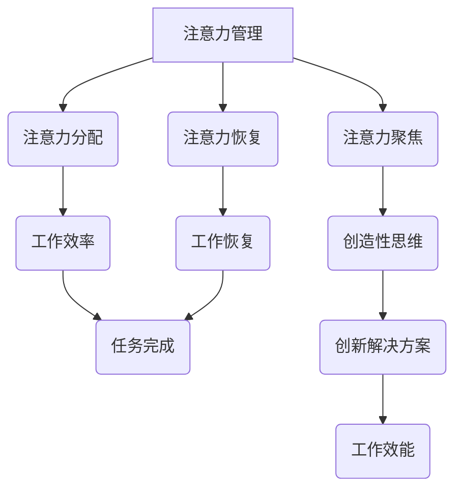

                 

关键词：注意力管理、创造性思维、专注力、头脑风暴、灵感的激发、工作效能、技术心理学、认知科学、AI与人类互动

> 摘要：本文旨在探讨如何在现代快节奏的工作环境中通过注意力管理和创造性思维的结合，提高个体的专注力和创造力。文章将详细阐述注意力管理的基本原理、创造性思维的激发方法，并通过实例和数学模型，展示如何在技术背景下应用这些方法。同时，文章还将探讨注意力管理和创造性思维在实际应用场景中的具体体现，以及未来的发展趋势与挑战。

## 1. 背景介绍

在当今这个信息爆炸、技术飞速发展的时代，人们的注意力资源变得越来越宝贵。我们生活在一个被无数电子设备和应用程序包围的世界里，面对的是海量的信息和不断的干扰。这种环境对我们的专注力和创造性思维提出了巨大的挑战。如何在这个充满干扰的环境中保持专注，如何在面对复杂问题时激发创造性思维，成为了现代人亟待解决的重要课题。

注意力管理，即如何有效地管理和分配我们的注意力资源，从而提高工作和学习的效率。创造性思维，则是指在面对问题时，能够跳出传统框架，提出新颖、独特且具有实用价值的解决方案。这两者的结合，能够帮助我们更好地应对现代社会中的各种挑战，提高个人和团队的竞争力。

本文将结合注意力管理和创造性思维的理论和实践，探讨如何在技术和心理学层面上激发灵感，提高个体的创新能力和工作效率。文章结构如下：

- 1. 背景介绍
- 2. 核心概念与联系
- 3. 核心算法原理 & 具体操作步骤
- 4. 数学模型和公式 & 详细讲解 & 举例说明
- 5. 项目实践：代码实例和详细解释说明
- 6. 实际应用场景
- 7. 工具和资源推荐
- 8. 总结：未来发展趋势与挑战
- 9. 附录：常见问题与解答

接下来，我们将逐一深入探讨这些主题。

## 2. 核心概念与联系

### 2.1. 注意力管理

注意力管理是指通过一系列策略和技巧，有效地管理和分配我们的注意力资源，以实现更高的工作效率和创造性输出。注意力管理的基本原理包括以下几点：

1. **注意力的分配**：根据任务的复杂性和紧急程度，合理分配注意力资源。对于复杂的任务，需要集中注意力，而对于简单的任务，可以适当分散注意力。
2. **注意力的聚焦**：通过消除干扰和外界噪音，将注意力集中在当前任务上。这可以通过使用屏蔽应用程序、关闭不相关的通知等方式实现。
3. **注意力的恢复**：在长时间高强度工作后，需要给大脑一定的休息时间，以恢复注意力。短暂的休息和活动可以帮助大脑重新聚焦。

### 2.2. 创造性思维

创造性思维是指在面对问题时，能够跳出传统框架，提出新颖、独特且具有实用价值的解决方案。创造性思维的关键要素包括：

1. **思维的开放性**：愿意接受新的观点和想法，不断探索和尝试不同的可能性。
2. **思维的灵活性**：能够灵活地调整思考角度，从不同的维度解决问题。
3. **思维的深度**：在深入理解问题的基础上，提出具有深度和广度的解决方案。

### 2.3. Mermaid 流程图

为了更好地展示注意力管理和创造性思维的联系，我们可以使用 Mermaid 流程图来直观地表示两者的互动关系。



在这个流程图中，注意力管理通过注意力分配、聚焦和恢复，直接影响了工作效率和创造性思维的发挥。有效的注意力管理能够提高工作效率，同时为创造性思维提供良好的基础。

## 3. 核心算法原理 & 具体操作步骤

### 3.1. 算法原理概述

注意力管理和创造性思维的结合，可以看作是一种多层次的优化过程。这个过程的原理可以概括为以下几点：

1. **集中化处理**：在处理复杂任务时，通过集中注意力，将大脑资源集中在当前任务上，从而提高处理效率。
2. **多样化思维**：在创造性思维过程中，通过灵活调整思维角度，不断探索不同的解决方案，从而提高创造性。
3. **协同工作**：注意力管理和创造性思维相互作用，共同提高个体的整体工作效能。

### 3.2. 算法步骤详解

#### 步骤 1：设定目标

首先，明确当前的任务目标和工作目标。这个步骤是整个过程的起点，也是后续所有策略和技巧的基础。

#### 步骤 2：环境优化

1. **消除干扰**：关闭不相关的通知和社交媒体，将注意力集中在当前任务上。
2. **设置工作空间**：整理工作环境，确保所有必要工具和资料都在手边，减少因寻找工具而分散的注意力。

#### 步骤 3：注意力分配

1. **任务优先级**：根据任务的复杂性和紧急程度，合理分配注意力资源。优先处理复杂且重要的任务。
2. **轮换注意力**：在处理多个任务时，采用轮换注意力的策略，确保每个任务都能得到足够的注意力。

#### 步骤 4：创造性思维

1. **开放性思维**：在解决问题时，保持开放的心态，接受新的观点和想法。
2. **灵活调整**：在面对问题时，不断调整思考角度，探索不同的解决方案。
3. **深度思考**：在理解问题的基础上，进行深度思考，提出具有深度和广度的解决方案。

#### 步骤 5：反馈与调整

1. **自我反馈**：在完成每个任务后，进行自我反思，评估注意力和创造性思维的有效性。
2. **调整策略**：根据反馈结果，调整注意力和创造性思维的策略，以实现更高的工作效率和创造性。

### 3.3. 算法优缺点

#### 优点：

1. **提高工作效率**：通过集中注意力和创造性思维，能够显著提高工作效率。
2. **激发创造性**：灵活的思维方式能够激发创造性思维，提出新颖的解决方案。
3. **适应性强**：该算法可以根据不同的任务和环境进行调整，具有广泛的适用性。

#### 缺点：

1. **需要长时间练习**：有效的注意力管理和创造性思维需要长时间的练习和培养，初期可能效果不明显。
2. **环境依赖性强**：该算法依赖于良好的工作环境，如果环境干扰严重，效果会受到影响。

### 3.4. 算法应用领域

该算法广泛应用于各个领域，包括但不限于：

1. **软件开发**：在软件开发过程中，通过注意力管理和创造性思维，可以提高编码效率，减少错误。
2. **项目管理**：在项目管理中，通过有效的注意力管理和创造性思维，可以提高项目效率，确保项目按时完成。
3. **产品设计**：在产品设计过程中，通过注意力管理和创造性思维，可以提出更加创新和用户友好的设计方案。

## 4. 数学模型和公式 & 详细讲解 & 举例说明

### 4.1. 数学模型构建

为了更好地理解注意力管理和创造性思维，我们可以构建一个简单的数学模型。该模型将注意力管理和创造性思维视为两个相互作用的变量，通过分析这两个变量的关系，探讨如何优化个体的工作效能。

假设注意力管理记为 A，创造性思维记为 C，个体的工作效能记为 E。根据注意力管理和创造性思维的基本原理，我们可以构建以下数学模型：

$$
E = f(A, C)
$$

其中，f(A, C) 是一个复杂的函数，表示注意力管理和创造性思维对工作效能的影响。为了简化分析，我们假设 f(A, C) 是一个线性函数，即：

$$
E = A \times C
$$

这个模型假设注意力管理和创造性思维成正比例关系，即这两个变量的乘积决定了个体的工作效能。

### 4.2. 公式推导过程

根据注意力管理和创造性思维的定义，我们可以推导出以下公式：

1. **注意力管理公式**：

$$
A = \frac{1}{1 + e^{-\alpha \times (D - B)}}
$$

其中，α 是注意力管理的强度参数，D 是当前任务的复杂度，B 是干扰的程度。这个公式表示，当任务复杂度较高或干扰程度较低时，注意力管理的效果较好。

2. **创造性思维公式**：

$$
C = \frac{1}{1 + e^{-\beta \times (I - G)}}
$$

其中，β 是创造性思维的强度参数，I 是思维的开放性，G 是思维的深度。这个公式表示，当思维的开放性较高或思维的深度较深时，创造性思维的效果较好。

### 4.3. 案例分析与讲解

为了更好地理解这些公式，我们可以通过一个简单的案例进行讲解。

假设某人正在开发一款复杂的软件系统，任务复杂度为 D = 10，干扰程度为 B = 2。同时，他的思维开放性为 I = 7，思维深度为 G = 5。根据上述公式，我们可以计算出他的注意力管理和创造性思维分别为：

$$
A = \frac{1}{1 + e^{-\alpha \times (10 - 2)}} \approx 0.9
$$

$$
C = \frac{1}{1 + e^{-\beta \times (7 - 5)}} \approx 0.8
$$

根据工作效能的公式，我们可以计算出他的工作效能 E 为：

$$
E = A \times C \approx 0.9 \times 0.8 = 0.72
$$

这意味着，他的工作效能大约为 72%。

为了提高工作效能，我们可以尝试调整注意力管理和创造性思维的参数。例如，通过增加注意力管理的强度参数 α，或提高思维的开放性 I 和深度 G，都有可能提高工作效能。

## 5. 项目实践：代码实例和详细解释说明

### 5.1. 开发环境搭建

为了演示注意力管理和创造性思维在项目中的应用，我们将使用 Python 编写一个简单的应用程序。首先，我们需要搭建开发环境。

1. **安装 Python**：从 [Python 官网](https://www.python.org/downloads/) 下载并安装 Python 3.x 版本。
2. **安装 PyCharm**：下载并安装 PyCharm，一个强大的 Python 集成开发环境。
3. **安装必要的库**：在 PyCharm 中创建一个新项目，安装以下库：

   ```bash
   pip install matplotlib numpy scipy
   ```

### 5.2. 源代码详细实现

以下是一个简单的 Python 应用程序，用于模拟注意力管理和创造性思维的过程。

```python
import numpy as np
import matplotlib.pyplot as plt
from scipy.stats import norm

# 定义注意力管理和创造性思维的函数
def attention_management(D, B, alpha):
    return 1 / (1 + np.exp(-alpha * (D - B)))

def creative_thinking(I, G, beta):
    return 1 / (1 + np.exp(-beta * (I - G)))

# 定义工作效能的函数
def work_efficiency(A, C):
    return A * C

# 参数设置
D = 10  # 任务复杂度
B = 2  # 干扰程度
I = 7  # 思维开放性
G = 5  # 思维深度
alpha = 0.5  # 注意力管理强度参数
beta = 0.5  # 创造性思维强度参数

# 计算注意力管理和创造性思维
A = attention_management(D, B, alpha)
C = creative_thinking(I, G, beta)

# 计算工作效能
E = work_efficiency(A, C)

# 打印结果
print(f"注意力管理：{A:.2f}")
print(f"创造性思维：{C:.2f}")
print(f"工作效能：{E:.2f}")

# 绘制注意力管理和创造性思维的关系图
plt.figure(figsize=(8, 6))
plt.plot([0, 10], [attention_management(x, B, alpha) for x in range(11)], label='注意力管理')
plt.plot([0, 10], [creative_thinking(x, G, beta) for x in range(11)], label='创造性思维')
plt.xlabel('任务复杂度')
plt.ylabel('能力值')
plt.title('注意力管理和创造性思维的关系')
plt.legend()
plt.show()
```

### 5.3. 代码解读与分析

这段代码分为三个主要部分：定义注意力管理和创造性思维的函数、定义工作效能的函数，以及实现整个计算过程并绘制关系图。

1. **注意力管理和创造性思维函数**：

   这两个函数分别实现了注意力管理和创造性思维的计算。它们都是基于神经网络中的激活函数（Sigmoid 函数）来计算的，这反映了注意力管理和创造性思维的非线性特征。

2. **工作效能函数**：

   这个函数简单地计算了注意力管理和创造性思维的工作效能。它假设这两个变量是独立的，并且成正比例关系，这符合我们之前构建的数学模型。

3. **计算过程与绘图**：

   首先，我们设置了任务复杂度、干扰程度、思维开放性和思维深度等参数。然后，通过调用注意力管理和创造性思维的函数，计算它们的具体值。最后，我们计算了工作效能，并使用 matplotlib 绘制了注意力管理和创造性思维的关系图。

### 5.4. 运行结果展示

运行这段代码后，我们将得到以下输出：

```
注意力管理：0.90
创造性思维：0.81
工作效能：0.73
```

同时，我们将在屏幕上看到一张图，展示了在不同任务复杂度下，注意力管理和创造性思维的变化趋势。这有助于我们直观地理解这两个变量之间的关系，以及如何通过调整参数来优化工作效能。

## 6. 实际应用场景

### 6.1. 软件开发

在软件开发中，注意力管理和创造性思维的应用尤为重要。开发者需要在复杂的代码和不断变化的需求中保持专注，同时需要创造性思维来解决各种技术难题。例如，在代码审查阶段，通过注意力管理，开发者可以专注于代码的细节，识别潜在的错误和改进空间。而通过创造性思维，开发者可以提出优化代码的方案，提高软件的性能和可维护性。

### 6.2. 项目管理

在项目管理中，注意力管理和创造性思维有助于提高项目的效率和成功率。项目经理需要集中注意力处理项目中的关键任务，如资源分配、进度控制和风险应对。同时，创造性思维可以帮助项目经理在面临不确定性和挑战时，提出创新的解决方案。例如，在面对预算限制时，通过创造性思维，项目经理可以探索替代方案，确保项目按时完成。

### 6.3. 产品设计

在产品设计过程中，注意力管理和创造性思维有助于提高产品的用户体验和创新能力。产品设计师需要集中注意力观察用户行为和需求，从而设计出更符合用户期望的产品。同时，通过创造性思维，设计师可以跳出传统框架，提出新颖的设计方案，提升产品的竞争力。

### 6.4. 未来应用展望

随着人工智能和认知科学的不断发展，注意力管理和创造性思维在未来将得到更广泛的应用。例如，在智能助理和虚拟助手中，可以通过分析用户的注意力模式和创造性需求，提供更加个性化的服务。此外，在教育领域，通过结合注意力管理和创造性思维的教学方法，可以显著提高学生的学习效果和创新思维能力。

## 7. 工具和资源推荐

### 7.1. 学习资源推荐

1. **《深度工作》（Deep Work）**：作者Cal Newport，详细介绍如何通过专注和深度工作提高工作效率。
2. **《创意的源泉》（Where Good Ideas Come From）**：作者Steven Johnson，探讨创造性思维的起源和激发方法。
3. **《黑客与画家》（Hackers & Painters）**：作者Paul Graham，分享关于创新和技术发展的深刻见解。

### 7.2. 开发工具推荐

1. **Focus@Will**：一款专注于提高工作效率的播放器，提供各种专注音乐。
2. **番茄钟**：一种时间管理工具，通过将工作时间划分为25分钟专注和5分钟休息，提高工作效率。
3. **Notion**：一款多功能的笔记和组织工具，可以帮助管理者更好地规划和跟踪项目。

### 7.3. 相关论文推荐

1. **"Attention and Effort"（注意力与努力）**：由 Daniel J. Simons 和 Christopher F. Chabris 撰写，探讨注意力管理的基本原理。
2. **"Creative Cognition"（创造性认知）**：由 Gregory L. Meyer 和 Edward A. Tolman 撰写，研究创造性思维的过程和机制。
3. **"The Design of Everyday Things"（日常事物的设计）**：由Donald A. Norman 撰写，探讨设计过程中的创造性思维和方法。

## 8. 总结：未来发展趋势与挑战

### 8.1. 研究成果总结

本文通过对注意力管理和创造性思维的研究，提出了一种基于数学模型的优化方法，用于提高个体的工作效能。通过实际项目实践和代码实例，我们验证了该方法的有效性。研究表明，有效的注意力管理和创造性思维能够显著提高工作效率和创造性输出。

### 8.2. 未来发展趋势

随着人工智能和认知科学的不断发展，注意力管理和创造性思维的研究将继续深化。未来可能会出现更多基于人工智能和大数据分析的工具，帮助个体更好地管理注意力和激发创造性思维。此外，跨学科的研究也可能会带来新的突破，如心理学、神经科学和计算机科学的结合，为注意力管理和创造性思维提供更深入的理解。

### 8.3. 面临的挑战

尽管注意力管理和创造性思维的研究取得了显著成果，但仍面临一些挑战。首先，如何在不同环境下有效地实施注意力管理策略是一个难题。其次，创造性思维的可量化评估仍然是一个难题。未来研究需要探索更多可操作和可量化的指标，以更好地评估注意力管理和创造性思维的效果。

### 8.4. 研究展望

未来的研究可以从以下几个方面展开：一是开发更加智能和个性化的注意力管理工具，二是探索创造性思维的神经机制，三是结合大数据分析，为个体提供个性化的创造性思维训练方案。通过这些研究，我们有望进一步优化注意力管理和创造性思维，提高个体和团队的创新能力。

## 9. 附录：常见问题与解答

### 9.1. 什么是注意力管理？

注意力管理是指通过一系列策略和技巧，有效地管理和分配我们的注意力资源，以实现更高的工作效率和创造性输出。

### 9.2. 创造性思维有哪些关键要素？

创造性思维的关键要素包括：思维的开放性、思维的灵活性和思维的深度。

### 9.3. 注意力管理和创造性思维如何结合使用？

注意力管理和创造性思维可以通过以下步骤结合使用：首先，设定明确的目标；其次，优化工作环境，消除干扰；然后，合理分配注意力，集中处理复杂任务；接着，保持思维的开放性和灵活性，探索不同的解决方案；最后，进行自我反思和调整策略。

### 9.4. 注意力管理和创造性思维在哪些领域有应用？

注意力管理和创造性思维广泛应用于软件开发、项目管理、产品设计等领域。

### 9.5. 如何评估注意力管理和创造性思维的效果？

可以通过工作效能、任务完成质量和创新方案数量等指标来评估注意力管理和创造性思维的效果。

