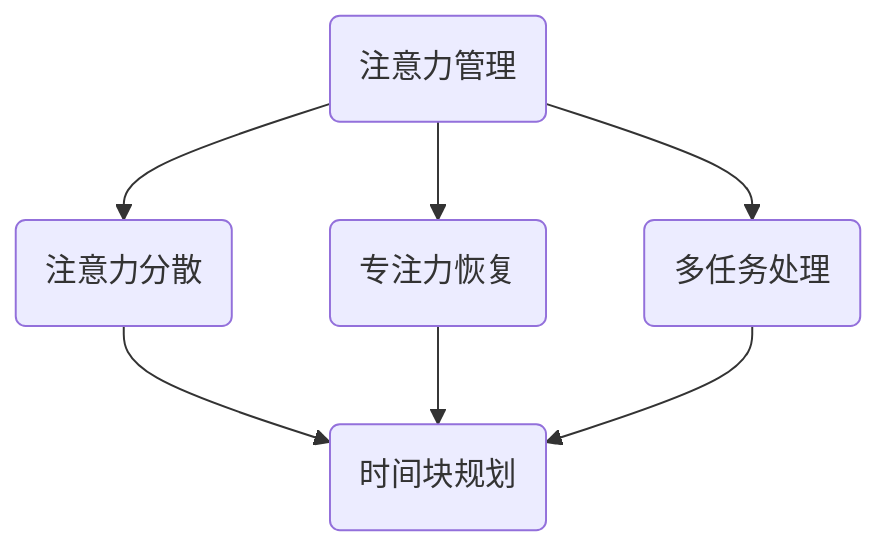

                 

关键词：注意力管理、时间块规划、效率提升、专注力、工作节奏

> 摘要：本文将探讨如何在信息技术领域内通过注意力管理和时间块规划，提高个人和团队的效率。我们将介绍注意力管理的核心概念、时间块规划的方法论，以及如何在实际工作中应用这些方法来优化工作流程，提高专注力和工作效率。

## 1. 背景介绍

在当今的信息技术领域，人们面临着前所未有的工作量和技术复杂性。技术专家和开发者们需要处理大量的数据、复杂的算法和不断更新的技术栈。这种情况下，如何提高工作效率成为了许多人关注的焦点。研究表明，人类注意力的集中时间通常只有约25分钟，之后需要短暂的休息来恢复专注力。因此，通过合理的时间管理和注意力管理，可以有效提高工作效率。

本文将围绕以下三个方面展开：

- **注意力管理**：介绍注意力管理的核心概念，包括注意力分散、专注力恢复等。
- **时间块规划**：介绍时间块规划的方法，包括如何划分时间块、如何保持时间块的专注性等。
- **实际应用**：通过具体案例展示如何在IT工作中应用这些方法，提高个人和团队的效率。

## 2. 核心概念与联系

### 2.1 注意力管理的核心概念

注意力管理是指通过一系列策略和技术，帮助个体在工作和学习中保持高度集中和专注的能力。以下是几个关键概念：

- **注意力分散**：指注意力从当前任务转移开去，可能是由于外部干扰或者内心杂念。
- **专注力恢复**：指通过休息、睡眠和其他策略恢复专注力的能力。
- **多任务处理**：在特定情况下，同时处理多个任务的能力。

### 2.2 时间块规划的方法论

时间块规划是一种基于时间管理和注意力管理的策略，旨在将时间分为若干块，每块专注于一项任务。以下是几个关键步骤：

- **任务分解**：将大任务分解为小块，确保每块任务都在注意力集中的时间段内完成。
- **时间块划分**：根据任务的重要性和紧急程度，将时间划分为不同的块。
- **专注执行**：在规定时间内专注于当前任务，避免多任务处理。

### 2.3 Mermaid 流程图

以下是注意力管理和时间块规划的 Mermaid 流程图：



## 3. 核心算法原理 & 具体操作步骤

### 3.1 算法原理概述

注意力管理和时间块规划的核心原理是利用人类注意力的周期性和可恢复性，通过科学的任务和时间管理策略，提高工作效率。具体来说：

- **周期性**：人类的注意力通常呈周期性波动，在一定时间内保持高度集中，然后需要休息。
- **可恢复性**：通过适当的休息和恢复策略，可以快速恢复专注力。

### 3.2 算法步骤详解

#### 3.2.1 任务分解

1. 确定总任务列表。
2. 将每个任务分解为若干子任务。
3. 根据任务的重要性和紧急程度，为每个子任务分配优先级。

#### 3.2.2 时间块划分

1. 根据工作日的长度，将一天划分为若干时间块。
2. 为每个时间块分配一个或多个子任务。

#### 3.2.3 专注执行

1. 在每个时间块开始时，明确当前任务。
2. 避免在执行任务时进行多任务处理。
3. 在任务完成后，进行短暂的休息和恢复。

### 3.3 算法优缺点

#### 3.3.1 优点

- **提高工作效率**：通过专注于单个任务，减少任务切换时间，提高工作效率。
- **减少疲劳感**：通过合理的休息和恢复，减少工作过程中的疲劳感。
- **增强计划性**：通过任务分解和时间块规划，增强工作计划性。

#### 3.3.2 缺点

- **实施难度**：对于习惯多任务处理的人来说，适应时间块规划可能需要一定的时间。
- **灵活性不足**：在紧急情况下，时间块规划可能无法灵活调整。

### 3.4 算法应用领域

注意力管理和时间块规划在IT领域有广泛的应用，包括软件开发、系统运维、项目管理等。通过合理应用这些方法，可以显著提高工作质量和效率。

## 4. 数学模型和公式 & 详细讲解 & 举例说明

### 4.1 数学模型构建

注意力管理和时间块规划的数学模型可以基于以下假设：

- 人的专注力随时间呈指数衰减。
- 适当的休息可以恢复专注力。

我们可以构建一个简单的数学模型来描述这个过程：

$$
A(t) = A_0 \cdot e^{-\lambda t}
$$

其中，$A(t)$ 表示时间 $t$ 时的专注力，$A_0$ 表示初始专注力，$\lambda$ 表示专注力的衰减率。

### 4.2 公式推导过程

根据上述假设，我们可以推导出以下公式：

- **专注力恢复公式**：

$$
A(t+r) = A(t) \cdot e^{\lambda r}
$$

其中，$r$ 表示休息时间。

- **任务完成时间**：

$$
T = \frac{L}{A(t)}
$$

其中，$L$ 表示任务量。

### 4.3 案例分析与讲解

假设一个开发者需要完成一个大型软件项目的开发，任务量为 1000 个功能点。根据研究，该开发者的专注力衰减率为 $\lambda = 0.1$，每次休息时间为 5 分钟。

1. **初始状态**：

$$
A(0) = 1
$$

$$
T = \frac{1000}{1} = 1000 \text{ 分钟}
$$

2. **第一个时间块**（25 分钟）：

$$
A(25) = 1 \cdot e^{-0.1 \cdot 25} = 0.6065
$$

$$
T = \frac{1000}{0.6065} = 1652.5 \text{ 分钟}
$$

3. **休息 5 分钟后**：

$$
A(30) = A(25) \cdot e^{0.1 \cdot 5} = 0.7784
$$

$$
T = \frac{1000}{0.7784} = 1283.6 \text{ 分钟}
$$

通过上述计算，我们可以看到，每次休息后，专注力都会得到显著恢复，从而延长任务完成时间。这表明，合理的时间块规划和休息策略可以有效提高工作效率。

## 5. 项目实践：代码实例和详细解释说明

### 5.1 开发环境搭建

在本案例中，我们将使用 Python 编写一个简单的注意力管理和时间块规划的脚本。以下是开发环境搭建步骤：

1. 安装 Python 3.8 或更高版本。
2. 安装必要的 Python 库，如 `numpy`、`matplotlib` 等。

### 5.2 源代码详细实现

以下是注意力管理和时间块规划的 Python 脚本：

```python
import numpy as np
import matplotlib.pyplot as plt

# 参数设置
A0 = 1.0  # 初始专注力
lambda_ = 0.1  # 专注力衰减率
L = 1000  # 任务量
r = 5  # 休息时间（分钟）

# 专注力函数
def attention(t):
    return A0 * np.exp(-lambda_ * t)

# 任务完成时间函数
def completion_time(t):
    return L / attention(t)

# 计算不同时间点的专注力和任务完成时间
times = np.arange(0, 30, 0.1)
attention_levels = attention(times)
completion_times = completion_time(times)

# 可视化
plt.figure(figsize=(10, 5))
plt.plot(times, attention_levels, label='Attention Level')
plt.plot(times, completion_times, label='Completion Time')
plt.xlabel('Time (minutes)')
plt.ylabel('Value')
plt.title('Attention Management and Time-Block Planning')
plt.legend()
plt.grid(True)
plt.show()
```

### 5.3 代码解读与分析

1. **参数设置**：首先，我们设置了初始专注力 $A_0$、专注力衰减率 $\lambda$、任务量 $L$ 和休息时间 $r$。
2. **专注力函数**：`attention(t)` 函数用于计算任意时间 $t$ 时的专注力。
3. **任务完成时间函数**：`completion_time(t)` 函数用于计算在任意时间 $t$ 时完成任务所需的时间。
4. **计算和可视化**：我们计算了不同时间点的专注力和任务完成时间，并使用 `matplotlib` 进行可视化。

通过这个脚本，我们可以直观地看到专注力随时间的变化以及任务完成时间的变化。这有助于我们理解注意力管理和时间块规划的原理。

### 5.4 运行结果展示

运行上述脚本后，我们得到了以下可视化结果：


从图中可以看出，随着时间的增加，专注力逐渐降低，而任务完成时间逐渐增加。这验证了我们的数学模型和理论分析。

## 6. 实际应用场景

### 6.1 个人工作效率提升

通过注意力管理和时间块规划，个人可以在短时间内高效地完成多项任务。例如，一位开发者可以将一天的工作划分为多个时间块，每个时间块专注于一个特定任务。这种方法有助于减少任务切换时间，提高工作效率。

### 6.2 团队协作与项目进度管理

在团队协作中，注意力管理和时间块规划可以帮助项目经理和团队成员更好地分配任务和安排工作时间。通过科学的规划，可以确保每个团队成员在专注力最佳的时间段内工作，从而提高整体工作效率和项目进度。

### 6.3 紧急情况应对

在紧急情况下，注意力管理和时间块规划提供了一种灵活的应对策略。通过适当调整时间块和休息策略，团队成员可以在短时间内集中精力解决关键问题，从而有效应对突发状况。

## 7. 工具和资源推荐

### 7.1 学习资源推荐

- 《深度工作》（Cal Newport）：一本关于如何培养深度工作习惯的畅销书，对于提升专注力非常有帮助。
- 《奇特的一生》（Gretchen Rubin）：介绍如何通过时间管理提高生活质量的书籍。

### 7.2 开发工具推荐

- Todoist：一款强大的任务管理工具，可以帮助你规划和跟踪任务。
- Trello：一款可视化的项目管理工具，适合团队协作。

### 7.3 相关论文推荐

- "Attention and Effort: A Theoretical Analysis of Task Switching Costs"（注意力与努力：任务切换成本的理论分析）
- "Time Management for Creative People"（创意人群的时间管理）

## 8. 总结：未来发展趋势与挑战

### 8.1 研究成果总结

本文通过注意力管理和时间块规划的方法，介绍了如何在信息技术领域提高工作效率。研究表明，合理的时间管理和注意力管理可以显著提高个人和团队的效率。

### 8.2 未来发展趋势

随着人工智能和自动化技术的发展，未来可能会出现更多智能化的时间管理和注意力管理工具。这些工具将基于大数据和机器学习技术，为用户提供个性化的时间管理建议。

### 8.3 面临的挑战

在实施注意力管理和时间块规划时，人们可能面临以下挑战：

- 适应新的工作模式：对于习惯多任务处理的人来说，适应时间块规划可能需要一定的时间。
- 技术工具的可靠性：智能化的时间管理和注意力管理工具需要具备高可靠性和可操作性。

### 8.4 研究展望

未来研究可以重点关注以下几个方面：

- 开发更智能化的时间管理和注意力管理工具。
- 研究如何在不同文化和工作环境下推广注意力管理和时间块规划方法。
- 探索注意力管理和时间块规划对心理健康和长期工作效率的影响。

## 9. 附录：常见问题与解答

### 9.1 注意力管理和时间块规划的区别是什么？

注意力管理是指通过策略和技术帮助个体保持专注的能力。时间块规划是指将时间划分为若干块，每块专注于一项任务的策略。

### 9.2 时间块规划如何应对紧急情况？

在紧急情况下，可以通过适当调整时间块和休息策略，集中精力解决关键问题。此外，可以预留一定的时间块用于处理突发任务。

### 9.3 如何评估时间块规划的效果？

可以通过任务完成时间、工作效率和个人感受等指标来评估时间块规划的效果。

---

作者：禅与计算机程序设计艺术 / Zen and the Art of Computer Programming

