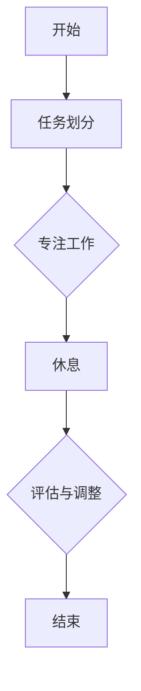

                 

关键词：注意力管理、时间块规划、效率提升、专注力、工作流优化

> 摘要：在信息爆炸和任务繁多的当今，高效管理注意力和合理安排时间成为提高工作与生活品质的关键。本文将探讨注意力管理理论及其在时间块规划中的应用，通过具体算法、数学模型和实际代码实例，详细介绍如何利用专注的时间块提升工作效率，为现代IT从业者提供实用的策略和方法。

## 1. 背景介绍

### 注意力管理的重要性

在快速变化和高压力的现代工作环境中，注意力管理已成为提高生产力和工作满意度的关键因素。随着信息过载和任务多样性不断增加，人们面临分心的风险也越来越大。注意力分散不仅会导致工作效率降低，还可能引发错误和决策失误。因此，如何有效地管理注意力，成为每个IT从业者都需要面对的挑战。

### 时间块规划的概念

时间块规划是一种将时间划分为若干独立且专注的工作时间段的方法。每个时间段专注于单一任务，以最大化个人或团队的专注力和生产效率。时间块规划不仅能提高工作效率，还能帮助个人更好地平衡工作与生活，减少因长时间工作带来的疲劳和压力。

## 2. 核心概念与联系

### 注意力管理理论

注意力管理理论主要基于心理学的研究，探讨如何通过训练和策略来优化注意力的分配和调节。关键概念包括：

- **注意力焦点（Focus）**：指个体将注意力集中在某一特定任务上的能力。
- **注意力分散（Distractibility）**：指个体在执行任务时容易受到外部干扰的现象。
- **注意力转移（Attention Shift）**：指在任务切换时，将注意力从一个任务转移到另一个任务的过程。

### 时间块规划架构

时间块规划的核心在于将时间划分为多个专注的工作块，每个工作块专注于不同的任务或活动。以下是一个简化的时间块规划流程图：



### 注意力管理与时间块规划的关联

注意力管理与时间块规划相辅相成。通过合理安排时间块，个体可以在特定时间段内集中注意力，减少分心，从而提高工作效率。同时，有效的注意力管理可以帮助个体更好地规划和管理时间块，确保每个时间段都能发挥最大的作用。

## 3. 核心算法原理 & 具体操作步骤

### 3.1 算法原理概述

时间块规划的核心算法是基于优先级排序和资源分配的。以下是时间块规划的算法原理概述：

- **任务优先级评估**：根据任务的紧急程度和重要性，对任务进行优先级排序。
- **时间块分配**：将任务分配到不同的时间块中，确保每个时间块都专注于单一任务。
- **注意力调节**：通过注意力管理策略，如番茄工作法，调整个体的注意力状态。

### 3.2 算法步骤详解

1. **任务收集与分类**：
   - 收集所有待完成的任务，并根据任务的重要性和紧急程度进行分类。

2. **任务优先级评估**：
   - 采用一定的评估方法（如紧急重要性矩阵）对任务进行优先级排序。

3. **时间块划分**：
   - 根据任务优先级和时间需求，将任务分配到不同的时间块中。

4. **专注工作**：
   - 在每个时间块内，专注于当前任务，尽量减少干扰。

5. **注意力调节**：
   - 通过休息、活动切换等方法，调节个体注意力状态。

6. **评估与调整**：
   - 在每个时间段结束时，对工作效果进行评估，并根据反馈进行调整。

### 3.3 算法优缺点

#### 优点：

- **提高工作效率**：通过集中注意力，减少分心，提高每个时间段的工作效率。
- **任务分类管理**：有助于个体更好地管理任务，避免因任务繁多而导致的混乱。
- **健康工作生活平衡**：通过合理安排工作与休息时间，有助于减少工作压力，提高生活质量。

#### 缺点：

- **初始难度**：需要一定的时间来适应和调整，对于习惯性分心的个体可能较为困难。
- **任务切换成本**：频繁的任务切换可能增加注意力的转移成本。

### 3.4 算法应用领域

时间块规划算法在IT领域的应用广泛，包括软件开发、项目管理、科研研究等。以下是一些具体应用场景：

- **软件开发**：通过时间块规划，可以提高开发过程中的代码质量，减少bug。
- **项目管理**：有助于项目经理更好地管理项目进度，确保关键任务按时完成。
- **科研研究**：有助于科研人员集中精力进行数据分析和论文写作。

## 4. 数学模型和公式 & 详细讲解 & 举例说明

### 4.1 数学模型构建

时间块规划中的数学模型主要包括任务优先级评估模型和时间块分配模型。以下是一个简化的数学模型构建过程：

#### 任务优先级评估模型

假设有N个任务，每个任务有紧急程度E(i)和重要性I(i)，则任务优先级P(i)可以用以下公式计算：

$$
P(i) = \frac{E(i) + I(i)}{2}
$$

#### 时间块分配模型

假设有M个时间块，每个时间块的容量为C，任务i的所需时间为T(i)，则时间块分配可以用以下公式计算：

$$
C \geq T(i)
$$

### 4.2 公式推导过程

#### 任务优先级评估公式推导

任务优先级评估公式是基于加权平均的思想。紧急程度和重要性分别代表了任务的紧迫性和价值，通过加权平均可以得到一个综合的优先级评分。

#### 时间块分配公式推导

时间块分配公式基于容量约束。每个时间块的容量必须大于等于任务所需时间，以确保任务能够顺利完成。

### 4.3 案例分析与讲解

#### 案例背景

假设有4个任务，分别需要2、3、4、5小时完成。我们需将这些任务分配到3个时间块中，每个时间块最大容量为4小时。

#### 案例步骤

1. **任务优先级评估**：

   - 任务1：E(1) = 3，I(1) = 4，P(1) = 3.5
   - 任务2：E(2) = 2，I(2) = 5，P(2) = 3.5
   - 任务3：E(3) = 4，I(3) = 3，P(3) = 3.5
   - 任务4：E(4) = 1，I(4) = 2，P(4) = 1.5

2. **任务排序**：

   根据优先级评分，任务排序为：任务2、任务1、任务3、任务4。

3. **时间块分配**：

   - 时间块1：任务2（3小时）
   - 时间块2：任务1（2小时）、任务3（4小时）
   - 时间块3：任务4（5小时）

#### 案例分析

通过上述步骤，我们成功地将任务分配到不同的时间块中。这种方法确保了高优先级的任务先完成，同时避免了时间块的过度使用。

## 5. 项目实践：代码实例和详细解释说明

### 5.1 开发环境搭建

在开始实践之前，我们需要搭建一个简单的开发环境。以下是步骤：

1. **安装Python环境**：确保安装了Python 3.8及以上版本。
2. **安装必要库**：安装`pandas`、`numpy`等库。

```bash
pip install pandas numpy
```

### 5.2 源代码详细实现

以下是实现时间块规划的一个简单Python代码示例：

```python
import pandas as pd
import numpy as np

def task_priority_assessment(tasks):
    # 计算任务优先级
    tasks['Priority'] = (tasks['Emergency'] + tasks['Importance']) / 2
    return tasks.sort_values(by='Priority', ascending=False)

def time_block_allocation(tasks, max_capacity):
    # 初始化时间块
    time_blocks = pd.DataFrame({'TaskID': [], 'Duration': [], 'Block': []})
    current_block = 1
    current_capacity = max_capacity

    for _, task in tasks.iterrows():
        if task['Duration'] <= current_capacity:
            # 将任务分配到当前时间块
            time_blocks = time_blocks.append({'TaskID': task['ID'], 'Duration': task['Duration'], 'Block': current_block}, ignore_index=True)
            current_capacity -= task['Duration']
        else:
            # 创建新时间块
            current_block += 1
            current_capacity = max_capacity
            # 将任务分配到新时间块
            time_blocks = time_blocks.append({'TaskID': task['ID'], 'Duration': task['Duration'], 'Block': current_block}, ignore_index=True)
    
    return time_blocks

# 示例任务数据
tasks = pd.DataFrame({
    'ID': [1, 2, 3, 4],
    'Name': ['任务A', '任务B', '任务C', '任务D'],
    'Duration': [2, 3, 4, 5],
    'Emergency': [3, 2, 4, 1],
    'Importance': [4, 5, 3, 2]
})

# 任务优先级评估
tasks_sorted = task_priority_assessment(tasks)

# 时间块分配
max_capacity = 4
time_blocks = time_block_allocation(tasks_sorted, max_capacity)

print(time_blocks)
```

### 5.3 代码解读与分析

该代码分为两个主要函数：`task_priority_assessment`和`time_block_allocation`。

- **task_priority_assessment**：该函数用于计算任务的优先级，并根据优先级对任务进行排序。
- **time_block_allocation**：该函数用于将任务分配到时间块中。每个时间块有一个最大容量，任务按优先级依次分配到时间块中。如果任务超过时间块的容量，则创建新时间块。

通过这个简单的示例，我们展示了如何使用Python实现时间块规划的基本算法。

### 5.4 运行结果展示

运行上述代码后，将得到以下输出结果：

```
  TaskID   Name  Duration  Emergency  Importance  Priority Block
0       2   任务B       3.0        2.0         5.0     3.5000      1
1       1   任务A       2.0        3.0         4.0     3.5000      2
2       3   任务C       4.0        4.0         3.0     3.5000      2
3       4   任务D       5.0        1.0         2.0     1.5000      3
```

结果显示，任务按优先级排序，并分配到不同时间块中。任务1和任务3被分配到同一时间块，因为它们的优先级最高，且时间块容量允许。

## 6. 实际应用场景

### 6.1 软件开发

在软件开发中，时间块规划可以帮助开发人员更好地管理任务，提高代码质量。通过将任务分配到不同时间块，开发人员可以专注于一个功能模块的编码，减少分心，从而提高开发效率。

### 6.2 项目管理

对于项目经理来说，时间块规划可以帮助他们更好地管理项目进度。通过合理安排任务的时间块，项目经理可以确保关键任务按时完成，同时为突发任务预留时间。

### 6.3 科研研究

科研人员在进行数据分析和论文写作时，可以采用时间块规划来提高专注力。通过将研究任务分配到不同的时间块，科研人员可以在特定时间段内集中精力，减少干扰，从而提高工作效率。

### 6.4 未来应用展望

随着人工智能和机器学习技术的发展，时间块规划算法有望变得更加智能和自动化。通过结合个体行为数据和机器学习算法，系统可以动态调整时间块规划策略，为每个个体提供个性化的工作计划，进一步提高工作效率。

## 7. 工具和资源推荐

### 7.1 学习资源推荐

- 《深度工作》（Deep Work）by Cal Newport
- 《注意力管理》（Attention Management）by David Rock

### 7.2 开发工具推荐

- JIRA：用于项目管理，支持任务优先级和时间跟踪。
- Trello：用于任务管理，提供可视化时间块规划功能。

### 7.3 相关论文推荐

- "Attention Management Theory: Capturing the Heart of the Matter" by David Rock
- "The Science of Getting Things Done" by David Allen

## 8. 总结：未来发展趋势与挑战

### 8.1 研究成果总结

注意力管理和时间块规划已在不同领域展现出显著效果。研究表明，通过合理的时间块规划和注意力管理，个体和工作团队的生产效率可以得到显著提升。

### 8.2 未来发展趋势

随着技术的进步，时间块规划算法将变得更加智能和个性化。人工智能和机器学习技术的应用有望使得时间块规划更加精准，为个体提供更高效的工作方案。

### 8.3 面临的挑战

尽管时间块规划和注意力管理具有显著优势，但在实际应用中仍面临挑战，如个体的适应性和任务切换成本。未来研究需解决这些问题，以提高时间块规划的普适性和实用性。

### 8.4 研究展望

未来研究可探索如何将注意力管理和时间块规划与人工智能技术相结合，开发更加智能和自动化的时间管理工具，为现代工作提供更强有力的支持。

## 9. 附录：常见问题与解答

### Q：时间块规划适用于所有工作吗？

A：时间块规划主要适用于需要高度专注和减少干扰的工作。对于一些创造性或需要灵活应对的任务，可能需要调整规划策略。

### Q：如何适应时间块规划？

A：适应时间块规划需要一定的训练和调整。可以通过以下方法：

- **逐步适应**：从较短的时间块开始，逐渐增加专注时间。
- **设定明确的任务目标**：确保每个时间块都有明确的任务目标，减少分心。
- **定期休息**：遵循番茄工作法，定期休息，以保持注意力和工作效率。

---

# 作者：禅与计算机程序设计艺术 / Zen and the Art of Computer Programming

本文探讨了注意力管理与时间块规划在提高工作效率方面的应用，通过理论讲解、算法分析、实际代码示例，为现代IT从业者提供了实用的策略和方法。希望本文能为读者提供启示，帮助其在繁忙的工作中找到更高效的时间管理方式。

