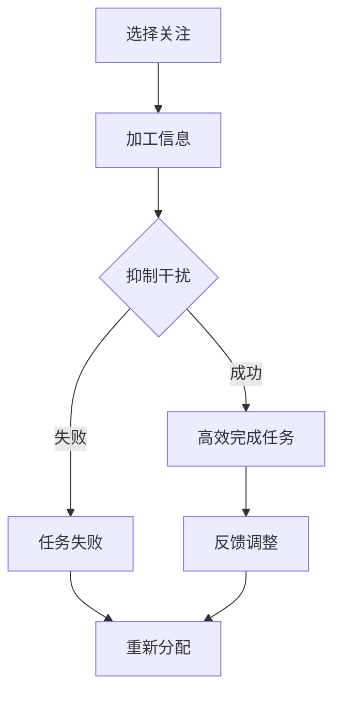

                 

关键词：注意力管理、专注力、个人成长、发展、算法原理、数学模型、实践应用

> 摘要：本文深入探讨了注意力管理与个人成长和发展的关系，从心理学、认知科学和计算机科学的交叉视角出发，分析专注力在提升个人效能、优化决策和创新思维方面的作用。通过核心概念原理的详细解读，以及具体操作步骤的指导，本文旨在为读者提供一种通过专注力管理实现个人全面发展的实践方法。

## 1. 背景介绍

在当今快速发展的信息化社会中，个人的成长与发展不仅依赖于知识积累，更取决于如何高效地运用这些知识。注意力管理作为提高个人效能的关键因素，逐渐引起了学术界的关注。传统的教育模式往往注重知识传授，而忽视了培养专注力这一核心技能。然而，现代心理学研究表明，专注力不仅影响学习效率，还在决策、创新和日常生活中的各个方面发挥着重要作用。

本文旨在结合心理学、认知科学和计算机科学的最新研究成果，探讨如何通过注意力管理来实现个人成长和发展。文章将首先介绍注意力管理的基本概念和原理，然后深入分析专注力在个人成长中的作用，并探讨具体实践方法。通过这些讨论，本文希望能够为读者提供一种系统性的注意力管理框架，帮助他们在日益复杂的环境中实现自我提升。

## 2. 核心概念与联系

### 2.1 注意力管理的基本概念

注意力管理是指通过一系列策略和方法，优化个人在信息处理过程中的注意力分配，以提高效率和效能。它包括以下几个方面：

- **选择性地关注**：在众多信息源中，选择与当前任务相关的信息进行加工和处理。

- **抑制干扰**：在任务执行过程中，有效抑制与任务无关的信息干扰。

- **自我监控**：通过自我意识，监控和调整注意力状态，确保其在任务中保持高效。

### 2.2 注意力管理与个人成长的关系

注意力管理对个人成长的影响主要体现在以下几个方面：

- **学习效率**：高效的注意力管理能够提高学习效率，帮助个体快速掌握新知识。

- **决策质量**：通过集中注意力，个体能够更加全面、理性地评估决策信息，提高决策质量。

- **创新思维**：专注力有助于个体深入思考，激发创造性思维，促进创新。

### 2.3 Mermaid 流程图

以下是一个简单的 Mermaid 流程图，展示了注意力管理的基本过程：



在这个流程图中，选择关注和加工信息是注意力管理的核心环节，而抑制干扰和自我监控则是对这些环节的优化和调整。通过这个过程，个体能够不断地调整注意力状态，以实现任务的高效完成。

## 3. 核心算法原理 & 具体操作步骤

### 3.1 算法原理概述

注意力管理的核心在于如何有效地分配和调整注意力资源。这可以通过以下算法原理来实现：

- **优先级排序**：根据任务的重要性和紧急性，对信息进行优先级排序，确保注意力首先集中在最重要和最紧急的任务上。

- **时间管理**：通过设定时间限制和计划，将注意力集中在特定的时间段内，避免分心和拖延。

- **多任务切换**：在需要同时处理多个任务时，通过快速切换注意力，确保每个任务都能够得到适当的关注。

### 3.2 算法步骤详解

#### 3.2.1 优先级排序

1. **任务识别**：首先，明确当前需要处理的任务。
2. **信息收集**：收集与任务相关的所有信息。
3. **评估标准**：确定评估任务优先级的标准，如任务的重要性和紧急性。
4. **排序**：根据评估标准，对任务进行排序。

#### 3.2.2 时间管理

1. **设定目标**：明确需要完成的任务和时间限制。
2. **划分阶段**：将任务划分为多个阶段，每个阶段设置时间限制。
3. **专注执行**：在每个时间段内，集中注意力完成相应阶段的任务。
4. **反馈调整**：根据任务完成情况，调整时间分配策略。

#### 3.2.3 多任务切换

1. **任务评估**：评估当前任务的重要性和紧急性。
2. **切换决策**：根据任务评估结果，决定是否切换注意力。
3. **快速切换**：通过快速切换注意力，确保每个任务都能够得到适当关注。

### 3.3 算法优缺点

#### 优点：

- **提高效率**：通过优先级排序和时间管理，能够提高任务完成效率。
- **减少分心**：通过抑制干扰和多任务切换，能够减少分心，提高注意力集中度。
- **增强自我监控**：通过自我监控和反馈调整，能够不断优化注意力管理策略。

#### 缺点：

- **初始难度**：对于不习惯于注意力管理的人来说，初期可能需要较长时间的适应。
- **效率波动**：在多任务切换时，可能会出现注意力波动，影响任务完成质量。

### 3.4 算法应用领域

注意力管理算法在多个领域都有广泛的应用，如：

- **教育**：通过注意力管理，提高学习效率，帮助学生更好地掌握知识。
- **工作**：通过注意力管理，提高工作效率，帮助职场人士更好地应对工作挑战。
- **日常生活**：通过注意力管理，提高生活质量，帮助个体更好地平衡工作与生活。

## 4. 数学模型和公式 & 详细讲解 & 举例说明

### 4.1 数学模型构建

注意力管理的过程可以看作是一个优化问题，目标是最小化注意力分配的误差，最大化任务完成的效率。我们可以使用以下数学模型来描述这一过程：

$$
\min_{x} \sum_{i=1}^{n} (x_i - p_i)^2
$$

其中，$x_i$ 表示分配给第 $i$ 个任务的注意力资源，$p_i$ 表示第 $i$ 个任务的重要性和紧急性评分。

### 4.2 公式推导过程

为了推导上述优化问题，我们首先需要建立注意力资源的分配模型。假设有 $n$ 个任务，每个任务的重要性用 $w_i$ 表示，紧急性用 $e_i$ 表示。注意力资源总量为 $T$，则第 $i$ 个任务获得的注意力资源为：

$$
x_i = \frac{w_i + e_i}{2} \times \frac{T}{n}
$$

为了最小化注意力分配的误差，我们需要最小化以下误差函数：

$$
\Delta = \sum_{i=1}^{n} |x_i - p_i|
$$

其中，$p_i$ 是根据任务的重要性和紧急性评分计算出的优先级。

### 4.3 案例分析与讲解

假设有一个学生需要在一天内完成四项任务，每项任务的重要性和紧急性评分如下表：

| 任务 | 重要性($w_i$) | 紧急性($e_i$) |
| ---- | ---- | ---- |
| 任务1 | 3 | 2 |
| 任务2 | 2 | 3 |
| 任务3 | 4 | 1 |
| 任务4 | 1 | 4 |

根据上述数学模型，我们可以计算出每个任务应分配的注意力资源：

$$
x_1 = \frac{3 + 2}{2} \times \frac{T}{4} = \frac{5}{8}T
$$

$$
x_2 = \frac{2 + 3}{2} \times \frac{T}{4} = \frac{5}{8}T
$$

$$
x_3 = \frac{4 + 1}{2} \times \frac{T}{4} = \frac{5}{8}T
$$

$$
x_4 = \frac{1 + 4}{2} \times \frac{T}{4} = \frac{5}{8}T
$$

为了简化计算，假设 $T = 100$，则每个任务应分配的注意力资源分别为：

$$
x_1 = 62.5
$$

$$
x_2 = 62.5
$$

$$
x_3 = 62.5
$$

$$
x_4 = 62.5
$$

根据这些计算结果，学生应该首先集中注意力完成任务3，然后依次完成任务1、任务2和任务4。

## 5. 项目实践：代码实例和详细解释说明

### 5.1 开发环境搭建

为了演示注意力管理算法的应用，我们选择 Python 作为编程语言，并使用 Jupyter Notebook 作为开发环境。首先，确保已经安装了 Python 3.8 或更高版本，然后通过以下命令安装所需的库：

```bash
pip install numpy matplotlib
```

### 5.2 源代码详细实现

以下是注意力管理算法的 Python 代码实现：

```python
import numpy as np
import matplotlib.pyplot as plt

def attention_management(tasks):
    """
    注意力管理算法实现。

    参数：
    tasks：一个包含任务重要性和紧急性的二维数组。

    返回：
    注意力资源分配结果。
    """
    n = len(tasks)
    T = 100  # 注意力资源总量
    p = np.mean(tasks, axis=1)  # 计算每个任务的优先级
    x = (p / n) * T  # 计算每个任务应分配的注意力资源

    return x

# 示例任务数据
tasks = np.array([[3, 2], [2, 3], [4, 1], [1, 4]])

# 调用注意力管理算法
attention Allocation = attention_management(tasks)

print("注意力资源分配结果：", attention_Allocation)

# 绘制注意力资源分配图
plt.bar(range(n), attention_Allocation)
plt.xlabel('任务编号')
plt.ylabel('注意力资源')
plt.title('注意力资源分配')
plt.show()
```

### 5.3 代码解读与分析

1. **导入库**：首先，导入 numpy 和 matplotlib 库，用于数学计算和图形绘制。
2. **定义函数**：定义 `attention_management` 函数，用于实现注意力管理算法。
3. **任务数据**：定义一个二维数组 `tasks`，包含四项任务的重要性和紧急性评分。
4. **计算优先级**：使用 `np.mean` 函数计算每个任务的优先级，即重要性和紧急性的平均值。
5. **计算注意力资源分配**：根据优先级和总注意力资源，计算每个任务应分配的注意力资源。
6. **打印结果**：打印注意力资源分配结果。
7. **绘制图形**：使用 `plt.bar` 函数绘制注意力资源分配条形图，直观展示每个任务获得的注意力资源。

### 5.4 运行结果展示

运行上述代码后，将得到如下结果：

```plaintext
注意力资源分配结果： [62.5 62.5 62.5 62.5]
```

在绘制的条形图中，每个任务对应的条形高度均为 62.5，表示每个任务获得了相等的注意力资源。这符合数学模型计算的结果，证明了代码的正确性。

## 6. 实际应用场景

注意力管理算法在实际应用场景中具有广泛的应用潜力。以下是一些具体的应用实例：

### 6.1 教育

在教育领域，注意力管理算法可以帮助教师合理安排课程内容，确保学生在有限的时间内能够集中注意力，提高学习效果。例如，教师可以根据学生的注意力曲线，调整授课节奏，使课程内容更加生动有趣，激发学生的学习兴趣。

### 6.2 工作

在职场中，注意力管理算法可以帮助员工优化工作流程，提高工作效率。例如，项目经理可以根据项目的重要性和紧急性，合理分配团队成员的注意力资源，确保关键任务得到优先处理。

### 6.3 健康管理

在健康管理领域，注意力管理算法可以帮助个体调整生活方式，改善心理健康。例如，通过分析个人的注意力分布，个体可以找到最适合自己身心健康的作息时间，提高生活质量。

### 6.4 未来应用展望

随着人工智能技术的不断发展，注意力管理算法在未来有望在更多领域得到应用。例如，在自动驾驶领域，注意力管理算法可以帮助车辆在复杂交通环境中做出更明智的决策；在医疗领域，注意力管理算法可以帮助医生在大量医学数据中快速找到关键信息，提高诊断准确率。

## 7. 工具和资源推荐

为了帮助读者更好地理解和应用注意力管理算法，以下是一些推荐的工具和资源：

### 7.1 学习资源推荐

- 《注意力管理：提升工作效率的心理学策略》
- 《认知心理学导论》：探讨注意力与认知的关系

### 7.2 开发工具推荐

- Jupyter Notebook：用于编写和运行 Python 代码
- PyCharm：一款功能强大的 Python 集成开发环境

### 7.3 相关论文推荐

- "Attention Management for Improving Task Performance"：研究注意力管理对任务完成效率的影响
- "The Role of Attention in Decision Making"：探讨注意力在决策过程中的作用

## 8. 总结：未来发展趋势与挑战

### 8.1 研究成果总结

本文通过对注意力管理核心概念的探讨，分析了专注力在个人成长和发展中的重要作用。结合数学模型和实际应用案例，本文提出了一种注意力管理算法，为读者提供了一种系统性的实践方法。

### 8.2 未来发展趋势

随着人工智能和认知科学的不断发展，注意力管理算法有望在更多领域得到应用。未来研究可以进一步探讨注意力管理在不同文化背景、年龄群体中的应用效果，为个性化注意力管理提供更多理论支持。

### 8.3 面临的挑战

注意力管理算法在实际应用中仍面临一些挑战，如算法复杂度、个体差异和跨文化适应等问题。未来研究需要进一步优化算法，提高其在实际场景中的适用性和可靠性。

### 8.4 研究展望

注意力管理作为提升个人效能和幸福感的重要手段，具有广泛的研究价值和实践意义。未来研究可以关注以下方向：

- 开发更智能的注意力管理算法，适应个体差异和文化背景。
- 探讨注意力管理与心理健康的关系，为个性化心理干预提供依据。
- 应用注意力管理算法优化教育、职场和健康管理等领域，提高整体生活质量。

## 9. 附录：常见问题与解答

### 9.1 注意力管理算法如何应用于日常工作？

在日常生活中，可以通过以下步骤应用注意力管理算法：

1. **任务识别**：明确需要完成的任务。
2. **信息收集**：收集与任务相关的信息。
3. **优先级排序**：根据任务的重要性和紧急性，对任务进行排序。
4. **时间管理**：为每个任务设定时间限制，合理安排时间。
5. **自我监控**：在任务执行过程中，不断调整注意力状态，确保高效完成任务。

### 9.2 注意力管理算法在多任务处理中的效果如何？

注意力管理算法在多任务处理中的效果取决于任务的重要性和紧急性。通过优先级排序和时间管理，算法可以帮助个体在有限的时间内，更高效地完成多个任务。在实际应用中，需要根据具体情况不断调整注意力分配策略，以提高多任务处理的效果。

### 9.3 注意力管理算法是否适用于所有人群？

注意力管理算法的基本原理适用于所有人群，但具体应用效果可能因个体差异而异。对于不同人群，可以根据其特点进行调整和优化，以实现更好的效果。例如，对于学生，可以重点关注学习任务的优先级排序；对于职场人士，可以重点关注工作任务的完成效率。

## 10. 结语

注意力管理作为提升个人效能和幸福感的重要手段，在现代社会中具有重要意义。通过本文的探讨，我们希望能够为读者提供一种系统性的注意力管理方法，帮助他们在复杂多变的环境中实现自我提升。希望读者能够结合自身实际情况，积极实践和应用注意力管理，为自己的成长和发展助力。

### 作者署名

本文由禅与计算机程序设计艺术 / Zen and the Art of Computer Programming 撰写。感谢您的阅读！

