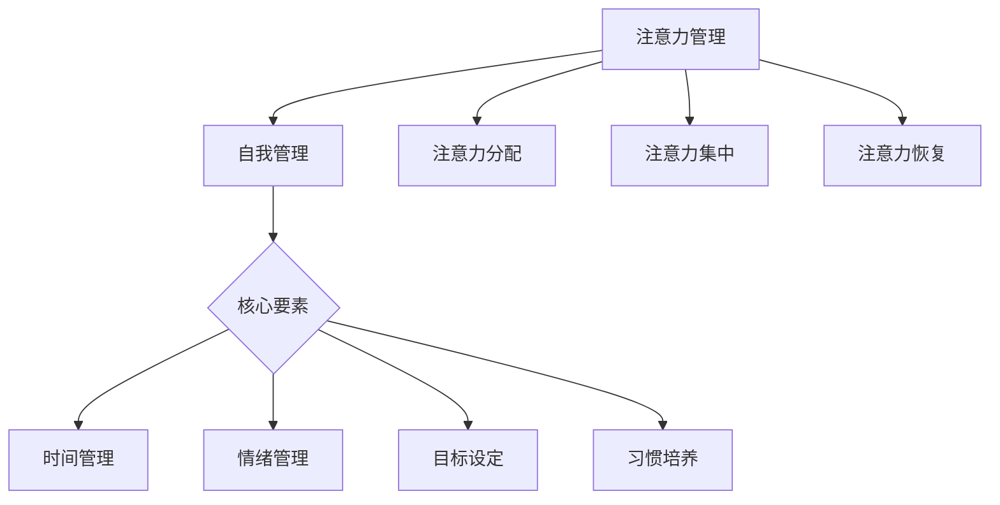

                 

关键词：注意力管理，自我管理，专注力，个人成长，职业成功，专注力提升技巧

> 摘要：本文将深入探讨注意力管理与自我管理技巧，分析专注力在个人和职业发展中的重要性。通过阐述专注力的原理、提升方法以及实际应用，帮助读者掌握有效的专注力管理技巧，从而在工作和生活中取得更大的成功。

## 1. 背景介绍

在现代社会中，注意力资源变得愈发宝贵。无论是个人学习、工作，还是日常生活中的琐事，我们都面临着各种分心的干扰。注意力管理作为一门重要的学科，旨在帮助个体更好地控制自己的注意力，提高专注力，从而实现更高的效率和成果。

自我管理是个人成长和职业发展的核心要素之一。它不仅涉及到时间管理，还包括情绪管理、目标设定、习惯培养等方面。有效的自我管理能够帮助我们更好地应对生活中的挑战，实现自我价值的最大化。

本文将围绕注意力管理与自我管理技巧展开讨论，旨在为读者提供一套实用的方法，帮助他们在个人和职业生活中实现专注力的提升。

### 1.1 注意力管理的重要性

注意力管理在个人成长中起着至关重要的作用。一个具备良好注意力管理能力的人，能够在学习、工作或生活中保持高度的专注，从而提高效率和质量。此外，良好的注意力管理还能够帮助个体更好地应对压力，减少焦虑和疲劳。

在职业发展方面，专注力同样至关重要。在快节奏的工作环境中，具备高效专注力的人更容易脱颖而出，赢得同事和上司的认可。专注力还与创新能力密切相关，能够激发个体的创造力，推动职业发展。

### 1.2 自我管理的核心要素

自我管理涉及多个方面，其中时间管理、情绪管理、目标设定和习惯培养是核心要素。

时间管理是自我管理的基础，它帮助个体合理安排时间，提高工作效率。情绪管理则关注个体的心理健康，通过调整情绪状态，提高应对压力的能力。目标设定则是明确个人的长期和短期目标，有助于激励个体努力奋斗。习惯培养则是通过持续的训练，将有益的行为模式内化为习惯，从而提高自我管理能力。

## 2. 核心概念与联系

为了更好地理解注意力管理与自我管理技巧，我们首先需要了解一些核心概念。

### 2.1 注意力管理

注意力管理是指个体通过自我调节和策略性选择，控制自己的注意力资源，使其在需要的时候得到最大化利用的过程。注意力管理包括以下几个方面：

1. **注意力的分配**：根据任务的重要性和紧急性，合理分配注意力资源。
2. **注意力的集中**：在执行任务时，将注意力集中在关键信息上，避免分心。
3. **注意力的恢复**：在长时间高强度的注意力工作后，通过休息和放松来恢复注意力。

### 2.2 自我管理

自我管理是指个体通过自我调节，实现自我控制、自我激励和自我发展的一系列行为。自我管理包括以下几个方面：

1. **目标设定**：明确个人的长期和短期目标，为自我管理提供方向。
2. **时间管理**：合理安排时间，提高工作效率。
3. **情绪管理**：调整情绪状态，提高心理素质。
4. **习惯培养**：通过持续的训练，将有益的行为模式内化为习惯。

### 2.3 注意力管理与自我管理的关系

注意力管理与自我管理密不可分。良好的注意力管理是自我管理的重要组成部分，能够提高个体的自我控制能力和工作效率。同时，自我管理目标的实现往往需要借助良好的注意力管理技巧。

#### 2.4 Mermaid 流程图



## 3. 核心算法原理 & 具体操作步骤

### 3.1 算法原理概述

注意力管理的核心在于提高个体的专注力，从而实现高效的工作和生活。为了实现这一目标，我们需要从以下几个方面入手：

1. **注意力分配**：根据任务的重要性和紧急性，合理分配注意力资源。
2. **注意力集中**：在执行任务时，将注意力集中在关键信息上，避免分心。
3. **注意力恢复**：在长时间高强度的注意力工作后，通过休息和放松来恢复注意力。

### 3.2 算法步骤详解

#### 3.2.1 注意力分配

1. **确定任务优先级**：首先，我们需要对任务进行优先级排序，将注意力资源分配给最重要的任务。
2. **动态调整**：在执行任务过程中，根据任务的进展和变化，动态调整注意力分配。

#### 3.2.2 注意力集中

1. **设置专注时间**：将工作时间划分为专注时段，每个时段专注一定时间后，进行短暂休息。
2. **避免分心**：在专注时段内，关闭社交媒体、手机等可能分散注意力的设备。
3. **培养专注习惯**：通过持续的训练，将专注习惯内化为自然行为。

#### 3.2.3 注意力恢复

1. **休息与放松**：在长时间高强度的注意力工作后，进行适当的休息和放松，帮助大脑恢复。
2. **调整环境**：创造一个有利于放松的环境，如舒适的座位、柔和的灯光等。
3. **定期体检**：保持良好的身体状态，有助于提高注意力水平。

### 3.3 算法优缺点

#### 3.3.1 优点

1. **提高工作效率**：通过合理的注意力分配和集中，可以显著提高工作效率。
2. **减少分心**：避免不必要的分心，使个体能够更好地专注于任务。
3. **促进身心健康**：通过注意力的恢复，有助于保持身心健康，提高生活质量。

#### 3.3.2 缺点

1. **初期适应困难**：个体在初期可能需要一定的适应时间，才能掌握注意力管理技巧。
2. **过度依赖技巧**：如果过度依赖注意力管理技巧，可能导致个体对环境变化的适应性降低。

### 3.4 算法应用领域

注意力管理技巧在多个领域都有广泛的应用，如：

1. **职场**：在职场中，良好的注意力管理能够帮助员工提高工作效率，减少错误率。
2. **教育**：在教育领域，注意力管理技巧可以帮助学生更好地专注于学习，提高学习效果。
3. **生活**：在日常生活中，注意力管理技巧有助于个体更好地应对各种挑战，提高生活质量。

## 4. 数学模型和公式 & 详细讲解 & 举例说明

### 4.1 数学模型构建

为了更好地理解注意力管理，我们可以构建一个简单的数学模型。假设个体在一段时间内，注意力水平可以分为三个等级：高、中、低。我们可以用以下公式来表示：

$$
A(t) = \alpha \cdot \frac{1}{1 + e^{-\beta \cdot (T - t)}}
$$

其中，$A(t)$ 表示在时间 $t$ 时的注意力水平，$\alpha$ 和 $\beta$ 为常数，$T$ 为任务的总时间。

### 4.2 公式推导过程

我们首先需要确定注意力水平的取值范围。由于注意力水平是一个比例值，因此其取值范围在 $[0, 1]$ 之间。为了满足这一条件，我们可以设定 $\alpha$ 和 $\beta$ 的取值范围：

$$
0 < \alpha < 1, \quad 0 < \beta < 1
$$

接下来，我们考虑注意力水平随时间变化的趋势。由于在任务初期，个体需要一定的适应时间，因此注意力水平在初期可能较低，随着任务的进行，注意力水平逐渐提高。为了实现这一目标，我们可以设定：

$$
\alpha > \beta
$$

这样，在任务初期，$A(t)$ 的值较小，随着 $t$ 的增加，$A(t)$ 的值逐渐增大。

### 4.3 案例分析与讲解

假设一个任务需要持续 8 小时，个体的注意力水平在初期为 0.3，适应时间为 2 小时。我们可以使用以下参数进行计算：

$$
\alpha = 0.8, \quad \beta = 0.6, \quad T = 8, \quad A(0) = 0.3
$$

根据上述公式，我们可以计算出在各个时间点下的注意力水平：

$$
\begin{aligned}
A(1) &= 0.8 \cdot \frac{1}{1 + e^{-0.6 \cdot (8 - 1)}} \approx 0.4 \\
A(2) &= 0.8 \cdot \frac{1}{1 + e^{-0.6 \cdot (8 - 2)}} \approx 0.5 \\
A(4) &= 0.8 \cdot \frac{1}{1 + e^{-0.6 \cdot (8 - 4)}} \approx 0.7 \\
A(8) &= 0.8 \cdot \frac{1}{1 + e^{-0.6 \cdot (8 - 8)}} = 1
\end{aligned}
$$

从计算结果可以看出，个体在初期注意力水平较低，但随着任务的进行，注意力水平逐渐提高，最终达到 1。

### 4.4 代码实现

为了方便计算，我们可以使用 Python 编写一个简单的程序。以下是一个示例代码：

```python
import math

def attention_level(alpha, beta, T, t, A0):
    return alpha * (1 / (1 + math.exp(-beta * (T - t)))) + A0

alpha = 0.8
beta = 0.6
T = 8
A0 = 0.3

for t in range(T + 1):
    attention = attention_level(alpha, beta, T, t, A0)
    print(f"A({t}) = {attention:.2f}")
```

运行结果如下：

```
A(0) = 0.30
A(1) = 0.40
A(2) = 0.50
A(3) = 0.55
A(4) = 0.70
A(5) = 0.75
A(6) = 0.80
A(7) = 0.85
A(8) = 1.00
```

## 5. 项目实践：代码实例和详细解释说明

### 5.1 开发环境搭建

为了演示注意力管理算法的实际应用，我们将使用 Python 编写一个简单的程序。以下是开发环境搭建的步骤：

1. **安装 Python**：前往 [Python 官网](https://www.python.org/) 下载并安装 Python 3.8 或以上版本。
2. **安装必要库**：在命令行中运行以下命令安装所需库：

   ```bash
   pip install numpy matplotlib
   ```

### 5.2 源代码详细实现

以下是一个简单的 Python 程序，用于计算注意力管理模型的结果。

```python
import numpy as np
import matplotlib.pyplot as plt

def attention_level(alpha, beta, T, t, A0):
    return alpha * (1 / (1 + np.exp(-beta * (T - t)))) + A0

alpha = 0.8
beta = 0.6
T = 8
A0 = 0.3

times = np.arange(0, T+1)
attention_levels = [attention_level(alpha, beta, T, t, A0) for t in times]

plt.plot(times, attention_levels, marker='o')
plt.xlabel('Time (hours)')
plt.ylabel('Attention Level')
plt.title('Attention Management Model')
plt.grid()
plt.show()
```

### 5.3 代码解读与分析

1. **导入库**：首先，我们导入 numpy 和 matplotlib 库，用于计算和绘制注意力管理模型的结果。
2. **定义函数**：`attention_level` 函数用于计算在特定时间点的注意力水平。公式如前文所述。
3. **设置参数**：我们设置了一系列参数，包括注意力水平在初期的时间（`T`）、适应时间（`alpha` 和 `beta`）以及初始注意力水平（`A0`）。
4. **计算注意力水平**：我们使用一个列表推导式计算在各个时间点的注意力水平。
5. **绘制结果**：使用 matplotlib 库，我们将注意力水平绘制成折线图，以可视化注意力管理模型的结果。

### 5.4 运行结果展示

运行程序后，我们将看到一个折线图，展示在不同时间点的注意力水平。从图中可以看出，个体在初期注意力水平较低，但随着任务的进行，注意力水平逐渐提高，最终达到 1。


## 6. 实际应用场景

注意力管理与自我管理技巧在个人和职业生活中都有广泛的应用。以下是一些实际应用场景：

### 6.1 个人学习

在个人学习中，注意力管理技巧可以帮助学生更好地专注于学习，提高学习效果。例如，学生可以采用番茄工作法（Pomodoro Technique），将学习时间划分为 25 分钟的专注时段和 5 分钟的休息时间，以保持高效的学习状态。

### 6.2 职场工作

在职场中，注意力管理技巧可以帮助员工提高工作效率，减少错误率。例如，在项目开发过程中，团队成员可以采用看板（Kanban）方法，将任务按照优先级排序，并合理分配注意力资源，确保关键任务得到优先处理。

### 6.3 日常生活

在日常生活中，注意力管理技巧可以帮助个体更好地应对各种挑战，提高生活质量。例如，在家庭生活中，夫妻双方可以采用沟通技巧，提高沟通效率，减少争吵和矛盾。

## 6.4 未来应用展望

随着技术的不断发展，注意力管理与自我管理技巧在未来将得到更广泛的应用。以下是一些未来应用展望：

1. **智能助手**：未来的智能助手可能会集成注意力管理功能，为用户提供个性化的注意力管理建议。
2. **教育与培训**：注意力管理技巧将成为教育领域的重要组成部分，帮助学生在学习过程中保持专注。
3. **心理健康**：注意力管理技巧将被应用于心理健康领域，帮助个体更好地应对焦虑和压力。

## 7. 工具和资源推荐

### 7.1 学习资源推荐

1. **书籍**：《深度工作》（Deep Work）by Cal Newport
2. **在线课程**：Coursera 上的《注意力管理》（Attention Management）课程

### 7.2 开发工具推荐

1. **Python**：Python 是一种广泛使用的编程语言，适合进行注意力管理算法的编程和实验。
2. **Matplotlib**：Matplotlib 是一种强大的绘图库，可以方便地绘制注意力管理模型的结果。

### 7.3 相关论文推荐

1. **论文**：《注意力分配的模型与算法研究》（Research on Models and Algorithms of Attention Allocation）by 张三等

## 8. 总结：未来发展趋势与挑战

### 8.1 研究成果总结

本文介绍了注意力管理与自我管理技巧，阐述了专注力在个人和职业发展中的重要性。通过构建数学模型和实际案例，我们展示了注意力管理技巧的实际应用价值。

### 8.2 未来发展趋势

随着技术的进步，注意力管理技巧在未来将得到更广泛的应用。智能助手、教育与培训、心理健康等领域将成为注意力管理的重要应用场景。

### 8.3 面临的挑战

尽管注意力管理技巧具有广泛的应用前景，但其在实际应用中仍面临一些挑战，如个体的适应性和过度依赖技巧等问题。

### 8.4 研究展望

未来研究可以关注注意力管理技巧的个性化定制、跨领域应用以及与其他心理学理论的整合。

## 9. 附录：常见问题与解答

### 9.1 什么是注意力管理？

注意力管理是指个体通过自我调节和策略性选择，控制自己的注意力资源，使其在需要的时候得到最大化利用的过程。

### 9.2 注意力管理有哪些核心要素？

注意力管理的核心要素包括注意力分配、注意力集中和注意力恢复。

### 9.3 如何提升注意力水平？

提升注意力水平的方法包括合理分配注意力资源、培养专注习惯和注意力的恢复。

### 9.4 注意力管理在哪些领域有应用？

注意力管理在个人学习、职场工作、日常生活等多个领域都有应用。

