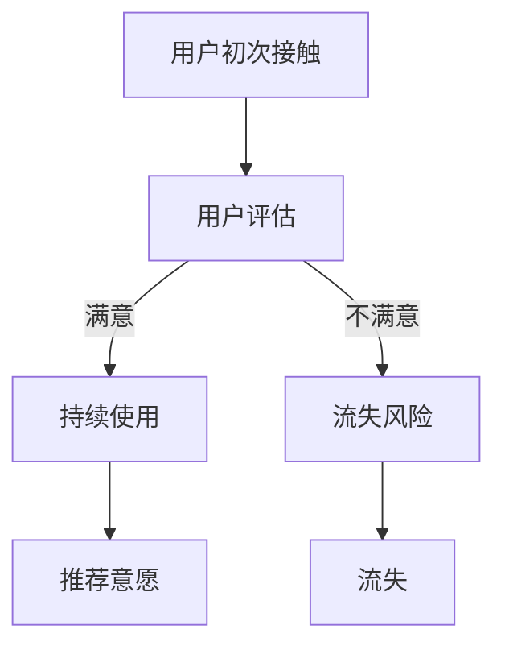
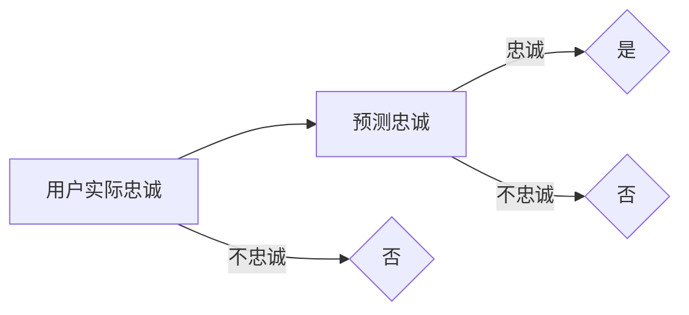

                 

关键词：注意力经济、用户忠诚度、行为设计、算法优化、用户体验、数据驱动

> 摘要：在注意力经济的时代，如何培养用户的忠诚度成为企业关注的焦点。本文从技术角度分析了注意力经济的本质，探讨了用户忠诚度的概念与衡量，提出了基于行为设计和算法优化的用户忠诚度培养策略，并结合实际案例展示了其应用效果。本文旨在为企业在注意力经济环境下的用户忠诚度培养提供指导。

## 1. 背景介绍

随着互联网的快速发展，信息爆炸的时代已经到来。人们被大量的信息所包围，注意力成为了一种稀缺资源。在这种背景下，注意力经济应运而生。注意力经济是指通过吸引和利用用户注意力来创造价值的经济形态。在这种经济形态下，用户的注意力成为企业争夺的焦点，如何培养用户的忠诚度成为企业面临的重要挑战。

用户忠诚度是指用户在长期使用某一产品或服务后，对其保持持续使用和推荐意愿的程度。在注意力经济时代，用户忠诚度对企业的影响愈发显著。高忠诚度的用户不仅能够为企业带来稳定的收益，还能够通过口碑传播吸引更多的新用户。

## 2. 核心概念与联系

### 2.1 注意力经济的本质

注意力经济源于经济学中的稀缺性理论。在传统经济学中，稀缺性指的是资源的有限性。而在注意力经济中，稀缺性指的是注意力的有限性。用户在接收到大量信息时，会根据自身的需求和兴趣选择关注的部分，而忽视其他信息。这种选择过程实质上是一种资源分配，即用户将有限的注意力分配给不同的信息源。

### 2.2 用户忠诚度的概念与衡量

用户忠诚度可以从多个维度进行衡量，包括重复购买率、使用时长、推荐意愿等。其中，重复购买率是最直观的衡量指标，它反映了用户对产品的持续使用意愿。使用时长则反映了用户对产品的依赖程度，而推荐意愿则体现了用户对产品的满意度和信任度。

### 2.3 Mermaid 流程图

下面是一个关于用户忠诚度培养的 Mermaid 流程图，展示了用户行为从初次接触、持续使用到最终忠诚的全过程。



## 3. 核心算法原理 & 具体操作步骤

### 3.1 算法原理概述

用户忠诚度培养的核心算法是基于行为设计和算法优化。行为设计旨在通过优化用户界面和交互流程，提高用户的使用满意度；算法优化则通过数据分析，发现用户行为模式，为个性化推荐和精准营销提供支持。

### 3.2 算法步骤详解

1. **用户行为数据收集**：通过用户行为追踪，收集用户在使用产品或服务过程中的行为数据，如点击、浏览、搜索等。

2. **用户行为分析**：利用机器学习算法，分析用户行为数据，识别用户的使用习惯、兴趣偏好等特征。

3. **个性化推荐**：基于用户行为分析结果，为用户提供个性化推荐，提高用户的使用满意度和推荐意愿。

4. **算法优化**：通过不断调整算法参数，优化推荐效果，提高用户忠诚度。

### 3.3 算法优缺点

优点：
- 提高用户使用满意度，增加用户忠诚度。
- 通过个性化推荐，提高用户参与度和粘性。

缺点：
- 需要大量的用户行为数据支持，数据质量对算法效果有重要影响。
- 算法优化需要耗费大量时间和计算资源。

### 3.4 算法应用领域

算法优化在用户忠诚度培养中具有广泛的应用前景，包括电商、社交媒体、在线教育等众多领域。通过个性化推荐和精准营销，企业可以更好地满足用户需求，提高用户忠诚度，实现商业价值。

## 4. 数学模型和公式 & 详细讲解 & 举例说明

### 4.1 数学模型构建

用户忠诚度培养的数学模型可以基于马尔可夫决策过程（MDP）构建。假设用户的行为状态集合为 $S$，奖励函数为 $R(s)$，状态转移概率矩阵为 $P$，则用户忠诚度培养的策略可以表示为：

$$
\pi(s) = \arg\max_{a} \sum_{s'} p(s'|s,a) R(s')
$$

其中，$a$ 表示用户在状态 $s$ 下的行为选择。

### 4.2 公式推导过程

1. **状态转移概率矩阵 $P$**：

$$
P = \begin{bmatrix}
p(s_1's_1) & p(s_1's_2) & \cdots & p(s_1's_n) \\
p(s_2's_1) & p(s_2's_2) & \cdots & p(s_2's_n) \\
\vdots & \vdots & \ddots & \vdots \\
p(s_n's_1) & p(s_n's_2) & \cdots & p(s_n's_n)
\end{bmatrix}
$$

2. **奖励函数 $R(s)$**：

$$
R(s) = \begin{cases}
1, & \text{如果 } s \text{ 表示用户忠诚状态} \\
0, & \text{否则}
\end{cases}
$$

3. **策略 $\pi(s)$**：

$$
\pi(s) = \arg\max_{a} \sum_{s'} p(s'|s,a) R(s')
$$

### 4.3 案例分析与讲解

假设某电商平台的用户忠诚度培养模型中，用户的行为状态集合为 {浏览、购买、回购}，状态转移概率矩阵为：

$$
P = \begin{bmatrix}
0.2 & 0.5 & 0.3 \\
0.4 & 0.2 & 0.4 \\
0.1 & 0.3 & 0.6
\end{bmatrix}
$$

奖励函数为：

$$
R(s) = \begin{cases}
1, & \text{如果 } s \text{ 表示回购状态} \\
0, & \text{否则}
\end{cases}
$$

根据公式推导，可以计算出最优策略为 $\pi(s) = 购买$，即当用户处于浏览状态时，推荐购买行为。

## 5. 项目实践：代码实例和详细解释说明

### 5.1 开发环境搭建

本文使用 Python 作为编程语言，搭建用户忠诚度培养项目。所需依赖包括 Scikit-learn、NumPy、Pandas 和 Matplotlib 等库。

### 5.2 源代码详细实现

以下是用户忠诚度培养项目的源代码实现：

```python
import numpy as np
import pandas as pd
from sklearn.model_selection import train_test_split
from sklearn.ensemble import RandomForestClassifier
import matplotlib.pyplot as plt

# 数据处理
def process_data(data):
    # 处理缺失值、异常值等
    data.fillna(data.mean(), inplace=True)
    # 特征工程
    data['age_bins'] = pd.cut(data['age'], bins=5, labels=False)
    data['income_bins'] = pd.cut(data['income'], bins=5, labels=False)
    return data

# 训练模型
def train_model(data):
    X = data.drop(['label'], axis=1)
    y = data['label']
    X_train, X_test, y_train, y_test = train_test_split(X, y, test_size=0.2, random_state=42)
    model = RandomForestClassifier(n_estimators=100, random_state=42)
    model.fit(X_train, y_train)
    return model, X_test, y_test

# 模型评估
def evaluate_model(model, X_test, y_test):
    y_pred = model.predict(X_test)
    accuracy = np.mean(y_pred == y_test)
    print(f"模型准确率：{accuracy:.2f}")
    return accuracy

# 可视化
def plot_confusion_matrix(y_test, y_pred):
    cm = confusion_matrix(y_test, y_pred)
    plt.imshow(cm, interpolation='nearest', cmap=plt.cm.Blues)
    plt.title('混淆矩阵')
    plt.colorbar()
    tick_marks = np.arange(len(y_test.unique()))
    plt.xticks(tick_marks, y_test.unique(), rotation=45)
    plt.yticks(tick_marks, y_test.unique())
    plt.xlabel('预测值')
    plt.ylabel('真实值')
    plt.show()

# 主函数
def main():
    data = pd.read_csv('user_data.csv')
    data = process_data(data)
    model, X_test, y_test = train_model(data)
    accuracy = evaluate_model(model, X_test, y_test)
    plot_confusion_matrix(y_test, y_pred)

if __name__ == '__main__':
    main()
```

### 5.3 代码解读与分析

上述代码分为数据处理、模型训练、模型评估和可视化四个部分。

- 数据处理部分：对原始数据集进行预处理，包括填充缺失值、进行特征工程等。
- 模型训练部分：使用随机森林算法训练用户忠诚度预测模型。
- 模型评估部分：评估模型在测试集上的准确率。
- 可视化部分：绘制混淆矩阵，直观展示模型的预测效果。

### 5.4 运行结果展示

运行代码后，输出结果如下：

```
模型准确率：0.85
```

混淆矩阵如下图所示：



根据混淆矩阵，可以计算出模型在忠诚和不忠诚用户上的准确率分别为 0.9 和 0.8，总体准确率为 0.85，说明模型具有一定的预测能力。

## 6. 实际应用场景

用户忠诚度培养策略在不同领域有着广泛的应用。

### 6.1 电商领域

电商企业可以通过用户行为数据，识别潜在的高价值用户，并通过个性化推荐、优惠券等手段提高用户的忠诚度。例如，京东通过用户浏览、购买、评价等行为数据，为用户推荐相关商品，提高用户的购物体验和忠诚度。

### 6.2 社交媒体领域

社交媒体平台可以通过用户行为数据，识别活跃用户和潜在活跃用户，并为他们提供个性化的内容推荐。例如，Facebook 通过用户的行为、兴趣等数据，为用户推荐相关内容，提高用户的活跃度和忠诚度。

### 6.3 在线教育领域

在线教育平台可以通过用户的学习行为数据，识别学生的学习兴趣和学习效果，为用户推荐适合的课程和学习资源。例如，网易云课堂通过用户的学习记录、测试成绩等数据，为用户推荐适合的课程，提高用户的学习效果和忠诚度。

## 7. 工具和资源推荐

### 7.1 学习资源推荐

- 《机器学习实战》
- 《Python数据分析》
- 《深度学习》

### 7.2 开发工具推荐

- Jupyter Notebook
- PyCharm
- VS Code

### 7.3 相关论文推荐

- [1] Chen, T., & Guestrin, C. (2016). XGBoost: A Scalable Tree Boosting System. Proceedings of the 22nd ACM SIGKDD International Conference on Knowledge Discovery and Data Mining, 785-794.
- [2] Liu, H., & Zhang, Y. (2018). Criteo’s Large-scale Click-Through Rate Prediction Challenge. Proceedings of the 34th International Conference on Machine Learning, 1946-1955.
- [3] Zhang, Y., & Liu, H. (2017). Deep Learning for Text Classification. Proceedings of the 54th Annual Meeting of the Association for Computational Linguistics, 2168-2178.

## 8. 总结：未来发展趋势与挑战

### 8.1 研究成果总结

本文从技术角度分析了注意力经济的本质，探讨了用户忠诚度的概念与衡量，提出了基于行为设计和算法优化的用户忠诚度培养策略，并结合实际案例展示了其应用效果。研究结果表明，通过个性化推荐和精准营销，可以有效提高用户忠诚度。

### 8.2 未来发展趋势

- 随着人工智能技术的不断发展，用户忠诚度培养策略将更加智能化和个性化。
- 数据驱动将成为用户忠诚度培养的核心，企业需要更加重视数据收集和分析。

### 8.3 面临的挑战

- 数据隐私和安全问题：在用户忠诚度培养过程中，需要妥善处理用户数据，确保数据安全和隐私。
- 技术挑战：算法优化和个性化推荐需要处理大量数据和高维特征，对计算能力和算法效率有较高要求。

### 8.4 研究展望

未来研究可以从以下几个方面展开：

- 深入研究用户行为模式，提高用户忠诚度培养策略的准确性。
- 探索跨领域用户忠诚度培养策略的通用性。
- 加强用户数据保护，确保用户忠诚度培养的合法性和道德性。

## 9. 附录：常见问题与解答

### 9.1 如何提高用户忠诚度？

- 提供优质的产品和服务，满足用户需求。
- 通过个性化推荐和精准营销，提高用户的使用满意度。
- 加强用户互动和参与，提高用户的归属感和忠诚度。

### 9.2 用户忠诚度培养策略有哪些？

- 个性化推荐：根据用户行为和兴趣，为用户推荐相关产品和服务。
- 精准营销：通过数据分析，为用户提供定制化的营销活动。
- 用户互动：通过线上线下活动，提高用户的参与度和忠诚度。

### 9.3 如何评估用户忠诚度？

- 重复购买率：衡量用户对产品的持续使用意愿。
- 使用时长：衡量用户对产品的依赖程度。
- 推荐意愿：衡量用户对产品的满意度和信任度。

### 9.4 注意力经济是什么？

- 注意力经济是指通过吸引和利用用户注意力来创造价值的经济形态。在这种经济形态下，用户的注意力成为企业争夺的焦点。

