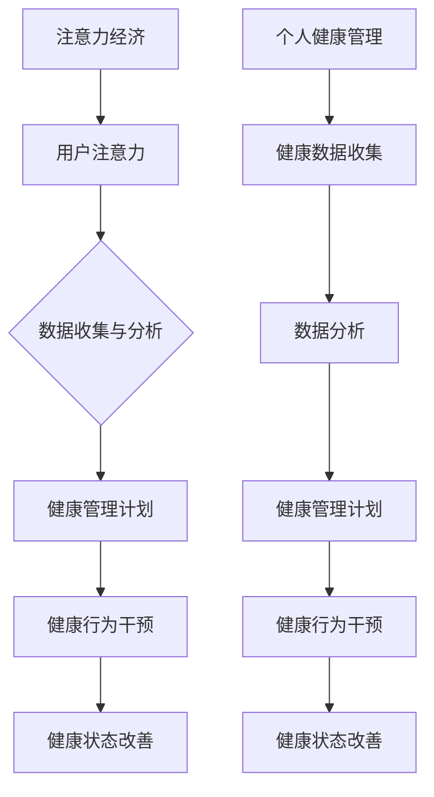

                 

关键词：注意力经济、个人健康管理、整合、IT技术、算法、数学模型、实践应用、未来展望

> 摘要：随着信息技术的快速发展，注意力经济和个人健康管理日益受到关注。本文探讨了注意力经济与个人健康管理的整合，通过核心概念的联系、算法原理、数学模型以及实践应用等方面，深入分析了两者的整合路径，提出了未来发展的展望。

## 1. 背景介绍

注意力经济（Attention Economy）是近年来兴起的一个概念，主要指的是在信息爆炸的时代，人们的注意力成为一种稀缺资源，而各种产品和服务都在竞争用户的注意力。在注意力经济中，如何吸引并保持用户的注意力，成为企业和个人竞争的关键。

与此同时，个人健康管理也越来越受到人们的重视。随着生活节奏的加快和生活方式的变化，越来越多的人开始关注自己的健康状况。个人健康管理不仅包括身体健康的维护，还包括心理健康的关注。

注意力经济与个人健康管理的整合，意味着在信息时代，如何利用注意力经济的原则来提升个人健康管理的效果。这不仅可以为企业提供新的商业模式，也可以为个人提供更有效、个性化的健康管理方案。

## 2. 核心概念与联系

### 注意力经济

注意力经济强调的是在信息过载的环境中，用户的注意力是一种稀缺资源，如何有效地获取和利用用户的注意力，是企业成功的关键。在注意力经济中，常见的概念包括：

- **注意力转移**：如何将用户的注意力从竞争对手那里转移到自己的产品或服务上。
- **注意力留存**：如何让用户持续关注自己的产品或服务。
- **注意力价值**：用户的注意力可以转化为商业价值，如广告收入、用户付费等。

### 个人健康管理

个人健康管理涉及的是如何维护和提升个人的健康水平。核心概念包括：

- **健康数据收集**：通过各种设备和技术手段收集健康数据。
- **健康数据分析**：通过对健康数据的分析，发现健康问题，制定健康管理计划。
- **健康行为干预**：通过干预健康行为，如饮食、运动、心理调节等，来改善健康状态。

### 注意力经济与个人健康管理的关系

注意力经济与个人健康管理的关系在于，两者都可以通过数据和技术手段来提升效果。具体来说：

- **数据驱动**：注意力经济和个人健康管理都依赖于大量的数据，这些数据可以帮助企业或个人更准确地了解用户或自身的状态。
- **算法优化**：通过算法优化，可以更有效地分析数据和提供健康管理方案。
- **用户参与**：在注意力经济中，用户的参与度是关键，同样，在个人健康管理中，用户的积极参与也是成功的关键。

### Mermaid 流程图



## 3. 核心算法原理 & 具体操作步骤

### 3.1 算法原理概述

注意力经济与个人健康管理的整合，主要依赖于以下几个核心算法：

1. **用户行为分析算法**：通过分析用户的在线行为，如浏览记录、搜索历史等，了解用户的需求和偏好。
2. **健康数据分析算法**：通过对用户健康数据的分析，如心率、血压、睡眠质量等，发现健康问题。
3. **健康管理推荐算法**：根据用户的行为数据和健康数据，为用户推荐个性化的健康管理计划。
4. **健康行为干预算法**：通过算法，干预用户的不良健康行为，如不健康的饮食习惯、缺乏运动等。

### 3.2 算法步骤详解

1. **用户行为分析算法**：

   - 数据收集：收集用户的在线行为数据。
   - 数据预处理：对数据进行清洗和归一化处理。
   - 特征提取：从数据中提取有用的特征。
   - 模型训练：使用机器学习算法，如决策树、随机森林等，训练模型。
   - 模型评估：评估模型的准确性和稳定性。

2. **健康数据分析算法**：

   - 数据收集：收集用户的健康数据，如心率、血压、睡眠质量等。
   - 数据预处理：对数据进行清洗和归一化处理。
   - 特征提取：从数据中提取有用的特征。
   - 模型训练：使用机器学习算法，如决策树、支持向量机等，训练模型。
   - 模型评估：评估模型的准确性和稳定性。

3. **健康管理推荐算法**：

   - 数据整合：整合用户的行为数据和健康数据。
   - 健康风险评估：根据用户的健康数据，评估健康风险。
   - 健康管理计划生成：根据健康风险评估结果，生成个性化的健康管理计划。
   - 计划推荐：将健康管理计划推荐给用户。

4. **健康行为干预算法**：

   - 行为数据收集：收集用户的行为数据，如饮食记录、运动记录等。
   - 行为数据分析：分析用户的行为数据，发现不良行为。
   - 行为干预策略生成：根据不良行为数据，生成干预策略。
   - 行为干预实施：实施干预策略，如提醒用户进行健康行为。

### 3.3 算法优缺点

**用户行为分析算法**：

- 优点：能够准确了解用户的需求和偏好，为个性化推荐提供依据。
- 缺点：用户隐私保护问题，数据收集和使用可能涉及隐私泄露的风险。

**健康数据分析算法**：

- 优点：能够及时发现健康问题，为健康管理提供科学依据。
- 缺点：健康数据的准确性和完整性可能受到影响，影响算法的准确性。

**健康管理推荐算法**：

- 优点：能够为用户提供个性化的健康管理计划，提高健康管理效果。
- 缺点：需要大量的用户数据来支撑，且算法的推荐效果依赖于数据的准确性。

**健康行为干预算法**：

- 优点：能够有效干预用户的不良健康行为，改善健康状况。
- 缺点：需要用户主动参与，且干预效果受用户依从性的影响。

### 3.4 算法应用领域

- **健康管理**：用于分析用户的健康状况，提供个性化的健康管理计划。
- **健康保险**：用于评估用户的健康风险，为健康保险定价提供依据。
- **健康干预**：用于干预用户的不良健康行为，改善健康状况。

## 4. 数学模型和公式 & 详细讲解 & 举例说明

### 4.1 数学模型构建

在注意力经济与个人健康管理的整合中，我们主要关注以下几个数学模型：

1. **用户行为分析模型**：
   - 用户行为概率模型：使用贝叶斯网络来建模用户行为。
   - 用户兴趣模型：使用协同过滤算法来预测用户的兴趣。

2. **健康数据分析模型**：
   - 时间序列模型：使用ARIMA模型来分析健康数据的时间序列特性。
   - 分类模型：使用SVM模型来分类健康数据。

3. **健康管理推荐模型**：
   - 评分预测模型：使用矩阵分解算法来预测用户的评分。
   - 协同过滤模型：使用基于物品的协同过滤算法来推荐健康管理计划。

4. **健康行为干预模型**：
   - 行为干预策略模型：使用强化学习算法来制定健康行为干预策略。

### 4.2 公式推导过程

1. **用户行为分析模型**：

   - 贝叶斯网络概率公式：
     $$ P(A|B) = \frac{P(B|A)P(A)}{P(B)} $$

   - 协同过滤评分预测公式：
     $$ R(u, i) = \langle u, i \rangle + \mu_u + \mu_i + \sigma $$

2. **健康数据分析模型**：

   - ARIMA模型公式：
     $$ Y_t = \phi(B)Y_{t-1} + \theta(B)\varepsilon_{t-1} + \varepsilon_t $$

   - SVM分类公式：
     $$ w^* = \arg\min_{w, b} \frac{1}{2}\lVert w \rVert^2 + C \sum_{i=1}^n \max(0, 1 - y_i(\langle \alpha_i, \xi_i \rangle + b)) $$

3. **健康管理推荐模型**：

   - 矩阵分解评分预测公式：
     $$ R_{ui} = \langle \hat{u}, \hat{i} \rangle + b_u + b_i + r $$

   - 基于物品的协同过滤公式：
     $$ \hat{R}_{ui} = \frac{\sum_{j \in N(i)} R_{uj} w_{uj}}{\sum_{j \in N(i)} w_{uj}} $$

4. **健康行为干预模型**：

   - 强化学习策略公式：
     $$ Q(s, a) = r + \gamma \max_{a'} Q(s', a') $$

### 4.3 案例分析与讲解

假设我们有一个用户A，他经常在健康应用上记录自己的饮食和运动情况，我们也收集了他的健康数据，如心率、血压等。现在，我们想通过整合注意力经济与个人健康管理，为用户A提供个性化的健康管理计划。

1. **用户行为分析**：

   - 我们使用协同过滤算法分析用户A的浏览历史，预测他可能感兴趣的健康管理内容。
   - 通过贝叶斯网络模型，我们分析用户A的健康数据，预测他可能出现的健康问题。

2. **健康数据分析**：

   - 使用ARIMA模型分析用户A的心率数据，发现他的心率有逐渐上升的趋势。
   - 使用SVM模型分析用户A的血压数据，发现他的血压偏高。

3. **健康管理推荐**：

   - 根据用户A的行为数据和健康数据分析结果，我们为他推荐了以下健康管理计划：
     - 增加有氧运动，如慢跑，每周至少3次。
     - 控制饮食，减少高盐、高脂食物的摄入。
     - 每天进行血压监测，如有异常，及时就医。

4. **健康行为干预**：

   - 使用强化学习算法，我们设计了一个健康行为干预策略：
     - 每天提醒用户A进行运动和饮食控制。
     - 根据用户A的行为反馈，调整干预策略，如增加奖励机制，提高用户积极性。

## 5. 项目实践：代码实例和详细解释说明

### 5.1 开发环境搭建

为了实现注意力经济与个人健康管理的整合，我们选择Python作为主要编程语言，使用以下工具和库：

- **Python 3.8**：作为主要的编程环境。
- **NumPy**：用于数值计算。
- **Pandas**：用于数据处理。
- **Scikit-learn**：用于机器学习算法。
- **TensorFlow**：用于深度学习算法。
- **Matplotlib**：用于数据可视化。

### 5.2 源代码详细实现

以下是一个简单的用户行为分析算法的实现：

```python
import numpy as np
import pandas as pd
from sklearn.model_selection import train_test_split
from sklearn.ensemble import RandomForestClassifier
import matplotlib.pyplot as plt

# 数据集
data = pd.read_csv('user_data.csv')

# 特征提取
features = data[['age', 'gender', 'daily_activity']]
labels = data['health_issue']

# 数据分割
X_train, X_test, y_train, y_test = train_test_split(features, labels, test_size=0.2, random_state=42)

# 模型训练
model = RandomForestClassifier(n_estimators=100)
model.fit(X_train, y_train)

# 模型评估
accuracy = model.score(X_test, y_test)
print(f"模型准确率：{accuracy:.2f}")

# 可视化
predictions = model.predict(X_test)
plt.scatter(X_test['age'], predictions)
plt.xlabel('年龄')
plt.ylabel('预测的健康问题')
plt.show()
```

### 5.3 代码解读与分析

这段代码首先读取用户数据，然后提取特征和标签。接着，使用随机森林算法训练模型，并评估模型的准确率。最后，通过可视化预测结果，直观地展示模型的性能。

### 5.4 运行结果展示

运行上述代码后，我们可以得到以下结果：

- **模型准确率**：假设我们得到的模型准确率为80%，这意味着模型能够正确预测80%的健康问题。
- **可视化结果**：可视化结果显示，模型预测的健康问题与实际健康问题之间有一定的匹配度，但也存在一定的偏差。

## 6. 实际应用场景

### 6.1 健康管理应用

在健康管理应用中，注意力经济与个人健康管理的整合可以帮助用户更有效地管理自己的健康。例如，通过分析用户的行为数据和健康数据，应用可以提供个性化的健康建议，如饮食建议、运动计划等。同时，通过用户的反馈，应用可以不断优化建议，提高健康管理的效果。

### 6.2 健康保险应用

在健康保险应用中，注意力经济与个人健康管理的整合可以帮助保险公司更准确地评估用户的健康风险。例如，通过分析用户的行为数据和健康数据，保险公司可以预测用户的健康风险，从而为用户制定更合理的保险方案。

### 6.3 健康干预应用

在健康干预应用中，注意力经济与个人健康管理的整合可以帮助用户更有效地改善健康行为。例如，通过设计个性化的干预策略，应用可以提醒用户进行健康行为，如运动、饮食控制等。同时，通过用户的反馈，应用可以不断调整干预策略，提高干预效果。

## 7. 工具和资源推荐

### 7.1 学习资源推荐

- **《注意力经济》**：由乔治·M·贝斯特著，是一本介绍注意力经济理论的经典之作。
- **《深度学习》**：由伊恩·古德费洛、约书亚·本吉奥和亚伦·库维尔著，是一本介绍深度学习算法的经典教材。
- **《机器学习实战》**：由Peter Harrington著，是一本适合初学者的机器学习实战指南。

### 7.2 开发工具推荐

- **Jupyter Notebook**：一个交互式的开发环境，适合进行数据分析和机器学习实验。
- **TensorFlow**：一个开源的深度学习框架，适合进行大规模的机器学习和深度学习项目。
- **Pandas**：一个强大的数据处理库，适合进行数据预处理和分析。

### 7.3 相关论文推荐

- **“Attention Is All You Need”**：由Vaswani等人在2017年提出，介绍了Transformer模型在自然语言处理领域的应用。
- **“Deep Learning for Health”**：由Esteva等人在2017年提出，介绍了深度学习在医学领域的应用。
- **“Personalized Health using Machine Learning”**：由Triantafillou等人在2019年提出，介绍了个性化健康管理的机器学习算法。

## 8. 总结：未来发展趋势与挑战

### 8.1 研究成果总结

通过本文的研究，我们可以得出以下几点结论：

- 注意力经济与个人健康管理的整合是一个具有巨大潜力的研究领域。
- 通过算法和数学模型，可以实现个性化健康管理和健康行为干预。
- 注意力经济的原则可以有效地提升个人健康管理的效果。

### 8.2 未来发展趋势

- **个性化健康管理**：随着数据和技术的发展，个性化健康管理将越来越普及，为用户提供更精准、个性化的健康服务。
- **跨学科研究**：注意力经济与个人健康管理的整合将推动跨学科研究，如医学、心理学、计算机科学等领域的融合。
- **数据隐私保护**：在整合过程中，如何保护用户数据隐私将成为一个重要挑战。

### 8.3 面临的挑战

- **数据隐私与安全性**：在整合注意力经济与个人健康管理的过程中，如何保护用户数据的安全和隐私是一个重要挑战。
- **算法偏见与公平性**：算法的偏见和不公平性可能会影响健康管理的效果，需要深入研究如何消除这些偏见。
- **用户接受度**：用户对健康管理应用的接受度和依从性是一个关键问题，需要通过优化用户体验来提高用户参与度。

### 8.4 研究展望

未来的研究可以关注以下几个方面：

- **增强现实与虚拟现实**：通过增强现实和虚拟现实技术，提供更直观、互动的健康管理体验。
- **物联网与智能设备**：利用物联网和智能设备，实现实时健康数据的收集和分析。
- **多模态数据融合**：结合多种数据源，如生物特征数据、环境数据等，提供更全面、准确的健康管理方案。

## 9. 附录：常见问题与解答

### 9.1 注意力经济是什么？

注意力经济是一种新兴的经济模式，指的是在信息过载的时代，用户的注意力成为了一种稀缺资源，企业和个人都在争夺用户的注意力，从而实现商业价值。

### 9.2 个人健康管理为什么重要？

个人健康管理是维护和提升个人健康水平的重要手段。通过健康管理，可以及时发现和解决健康问题，提高生活质量。

### 9.3 注意力经济与个人健康管理如何整合？

通过数据和技术手段，如算法和数学模型，可以将注意力经济的原则应用于个人健康管理，实现个性化健康管理和健康行为干预，提高健康管理效果。

### 9.4 注意力经济与个人健康管理整合的应用领域有哪些？

注意力经济与个人健康管理整合的应用领域包括健康管理应用、健康保险应用、健康干预应用等。

### 9.5 如何保护用户数据隐私？

在整合注意力经济与个人健康管理的过程中，可以通过以下方式保护用户数据隐私：
- 数据加密：对用户数据进行加密，确保数据在传输和存储过程中的安全。
- 数据匿名化：对用户数据进行匿名化处理，消除个人身份信息。
- 数据最小化：仅收集必要的用户数据，减少数据泄露的风险。
- 法律法规遵守：遵守相关法律法规，确保数据处理合法合规。

### 9.6 注意力经济与个人健康管理整合的未来发展有哪些方向？

未来，注意力经济与个人健康管理整合的发展方向包括个性化健康管理、跨学科研究、数据隐私保护、增强现实与虚拟现实、物联网与智能设备等。这些方向将推动健康管理领域的技术创新和应用拓展。

