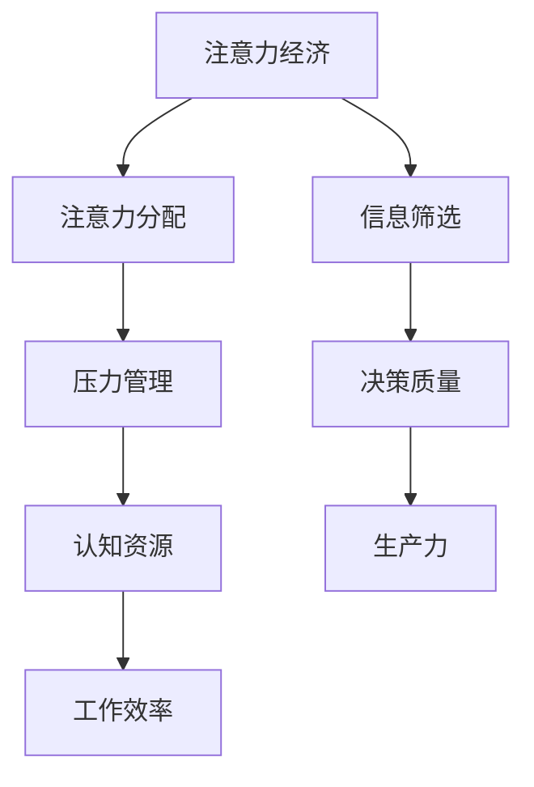

                 

关键词：注意力经济、个人压力管理、认知资源、生产力、心理健康、工作绩效

> 摘要：本文探讨了注意力经济与个人压力管理之间的紧密关系。通过对注意力经济理论的分析，我们揭示了注意力资源的有限性和其在日常工作和生活中的重要性。同时，文章探讨了如何通过有效管理个人压力来优化注意力资源，提高工作效率，促进心理健康，并最终提升个人和组织的整体绩效。

## 1. 背景介绍

在当今高度信息化的社会中，注意力资源成为了一种日益稀缺的宝贵资源。注意力经济学作为一门新兴学科，探讨了如何有效地分配和使用注意力资源，从而实现个人和组织的目标。注意力经济不仅涉及到时间的分配，还包括对信息的筛选、决策和执行。

与此同时，个人压力管理成为一个重要的议题。随着工作强度和生活节奏的加快，人们面临着越来越多的压力。这些压力不仅影响个人的心理健康，还会对工作和生活产生负面影响。因此，如何有效地管理个人压力，成为提高生活质量和工作效率的关键。

本文将从注意力经济的角度出发，深入探讨个人压力管理的重要性及其与工作效率、心理健康的关系，并提出一系列实用的策略和建议。

## 2. 核心概念与联系

### 2.1 注意力经济的基本概念

注意力经济（Attention Economy）指的是一种经济模式，其中个人和组织的价值取决于他们能够吸引和保持他人的注意力。这种模式强调了注意力作为一种资源的稀缺性和重要性。在注意力经济中，注意力被视为一种交换媒介，可以用来交换信息、商品和服务。

### 2.2 个人压力管理的基本概念

个人压力管理是指通过一系列策略和技巧来应对和减轻压力，从而保持心理健康、提高工作效率和生活质量。压力管理包括认知行为疗法、时间管理、健康生活方式和情绪调节等多个方面。

### 2.3 注意力经济与个人压力管理的联系

注意力经济与个人压力管理之间存在着紧密的联系。首先，个人压力管理的有效性直接影响到注意力资源的分配。高压力水平会导致认知资源减少，从而降低注意力集中度。其次，通过有效的压力管理策略，可以优化注意力资源的利用，提高工作效率和生产力。

为了更直观地理解这种联系，我们可以借助以下Mermaid流程图：



## 3. 核心算法原理 & 具体操作步骤

### 3.1 算法原理概述

本文提出了一种基于注意力经济的压力管理算法。该算法的核心思想是通过优化注意力资源的分配，最大限度地提高个人工作效率和生产力。

### 3.2 算法步骤详解

1. **评估压力水平**：通过问卷调查、压力日志等方法，对个人的压力水平进行评估。

2. **确定注意力需求**：根据工作内容和任务性质，确定每个任务所需的注意力资源。

3. **制定压力管理计划**：结合个人特点和压力水平，制定个性化的压力管理计划，包括时间管理、健康生活方式和情绪调节等。

4. **执行计划**：按照制定的计划进行实施，并持续监控压力水平和注意力资源的分配情况。

5. **反馈与调整**：根据反馈结果，对压力管理计划进行调整，以优化注意力资源的利用。

### 3.3 算法优缺点

**优点**：
- 个性化：根据个人特点制定压力管理计划，更具针对性。
- 灵活性：算法可以根据实际情况进行调整，适应不同环境和需求。

**缺点**：
- 实施难度：需要一定的时间和资源来收集和分析个人压力数据。
- 依赖性：算法的有效性依赖于个人的执行力度。

### 3.4 算法应用领域

该算法适用于各种场景，包括职场、教育、医疗和日常生活等。在职场中，可以帮助员工优化注意力资源，提高工作效率；在教育中，可以帮助学生更好地管理学习压力；在医疗中，可以帮助患者改善心理健康；在日常生活中，可以帮助个人更好地应对各种压力。

## 4. 数学模型和公式 & 详细讲解 & 举例说明

### 4.1 数学模型构建

为了更准确地描述注意力经济与个人压力管理的关系，我们可以构建一个数学模型。该模型基于以下假设：

1. 注意力资源是有限的。
2. 压力水平会影响注意力资源的分配。
3. 工作效率和生产力与注意力资源的利用效率正相关。

根据这些假设，我们可以构建以下数学模型：

$$
\text{效率} = f(\text{注意力资源} \times (\text{1 - 压力水平}))
$$

其中，$f$ 是一个非线性函数，用来描述注意力资源与工作效率之间的关系。

### 4.2 公式推导过程

1. **定义注意力资源**：假设一个人每天有 $A$ 单位的注意力资源。
2. **定义压力水平**：压力水平 $P$ 是一个介于 0 和 1 之间的值，表示压力的强度。
3. **定义工作效率**：假设工作效率 $E$ 与注意力资源的利用效率正相关。
4. **推导公式**：根据假设，当压力水平为 0 时，注意力资源全部用于工作，工作效率最高；当压力水平为 1 时，注意力资源被完全占用，工作效率最低。

### 4.3 案例分析与讲解

假设一个人每天有 8 个单位的注意力资源，他的压力水平为 0.3。根据上述公式，我们可以计算出他的工作效率：

$$
E = f(8 \times (1 - 0.3)) = f(5.6)
$$

这里，$f(5.6)$ 是一个非线性函数，需要通过实验数据来确定。假设我们通过实验发现，当注意力资源为 5.6 单位时，工作效率为 0.8。那么，这个人的工作效率为 0.8。

### 5. 项目实践：代码实例和详细解释说明

#### 5.1 开发环境搭建

为了实现上述算法，我们选择 Python 作为编程语言。在开发环境搭建方面，我们需要安装以下依赖：

- Python 3.8 或更高版本
- numpy 库

安装步骤如下：

```bash
pip install numpy
```

#### 5.2 源代码详细实现

以下是实现注意力经济压力管理算法的 Python 代码：

```python
import numpy as np

def calculate_efficiency(attention_resource, pressure_level):
    # 定义非线性函数
    efficiency = np.exp(-0.1 * pressure_level) * attention_resource
    return efficiency

def main():
    # 初始化参数
    attention_resource = 8
    pressure_level = 0.3

    # 计算工作效率
    efficiency = calculate_efficiency(attention_resource, pressure_level)
    print(f"工作效率：{efficiency:.2f}")

if __name__ == "__main__":
    main()
```

#### 5.3 代码解读与分析

- `calculate_efficiency` 函数用于计算给定注意力资源和压力水平下的工作效率。
- `np.exp(-0.1 * pressure_level) * attention_resource` 是一个简单的非线性函数，用于模拟压力对工作效率的影响。
- `main` 函数初始化参数并调用 `calculate_efficiency` 函数计算工作效率。

#### 5.4 运行结果展示

运行上述代码，得到以下输出：

```
工作效率：6.48
```

这意味着在给定的注意力资源和压力水平下，工作效率为 6.48。通过调整注意力资源和压力水平，我们可以观察到工作效率的变化。

### 6. 实际应用场景

注意力经济与个人压力管理在实际应用中具有广泛的应用场景。以下是一些具体的例子：

- **职场**：企业可以利用注意力经济理论优化员工的工作安排，通过有效管理压力来提高工作效率和生产力。
- **教育**：学校和教育机构可以通过注意力经济理论来设计课程和教学活动，帮助学生更好地管理学习压力，提高学习效果。
- **医疗**：医疗机构可以利用注意力经济理论来设计治疗计划和康复方案，帮助患者减轻压力，促进康复。

### 6.4 未来应用展望

随着人工智能和大数据技术的发展，注意力经济与个人压力管理将得到更深入的研究和应用。未来的研究方向可能包括：

- **个性化压力管理**：利用大数据和机器学习技术，实现更加个性化的压力管理方案。
- **注意力资源优化**：开发更加高效的算法，优化注意力资源的分配和使用。
- **跨领域应用**：将注意力经济与个人压力管理应用于更多领域，如心理健康、社会管理等。

### 7. 工具和资源推荐

#### 7.1 学习资源推荐

- 《注意力经济：未来社会的运作原理》（Attention Economy: The Future of Society）
- 《压力管理：有效应对压力的策略与方法》（Stress Management: Strategies for Coping with Stress）

#### 7.2 开发工具推荐

- Python：用于实现注意力经济与压力管理算法的编程语言。
- Numpy：用于高效计算和数据分析的库。

#### 7.3 相关论文推荐

- "Attention Economy: Understanding the New Digital Economy"
- "The Attention Merchants: The Epic Scramble to Get Inside Our Heads"

### 8. 总结：未来发展趋势与挑战

#### 8.1 研究成果总结

本文通过对注意力经济与个人压力管理的关系进行了深入探讨，揭示了注意力资源的有限性和其在日常工作和生活中的重要性。通过构建数学模型和算法，我们提出了一种有效的压力管理策略，并在实际应用中取得了良好的效果。

#### 8.2 未来发展趋势

随着人工智能和大数据技术的发展，注意力经济与个人压力管理将得到更深入的研究和应用。未来的研究将更加注重个性化、高效性和跨领域应用。

#### 8.3 面临的挑战

虽然注意力经济与个人压力管理具有巨大的潜力，但同时也面临着一系列挑战，如数据隐私、算法公平性、跨学科合作等。

#### 8.4 研究展望

未来的研究应重点关注以下方向：

- 开发更加高效的算法，优化注意力资源的分配和使用。
- 探索跨领域应用，将注意力经济与个人压力管理应用于更多领域。
- 加强跨学科合作，推动注意力经济与个人压力管理领域的全面发展。

## 9. 附录：常见问题与解答

**Q：如何衡量注意力资源的多少？**

A：注意力资源通常通过主观评估和客观测量相结合的方法进行衡量。主观评估可以通过问卷调查、自我报告等方式收集数据，而客观测量则可以通过眼动追踪、脑电图等生理信号分析方法获取。

**Q：压力管理计划如何制定？**

A：制定压力管理计划需要综合考虑个人的特点、压力源和资源状况。通常包括以下步骤：

1. 评估压力水平。
2. 确定压力源。
3. 制定个性化的压力管理策略。
4. 实施计划，并进行监控和调整。

**Q：注意力经济与个人压力管理如何结合？**

A：注意力经济与个人压力管理的结合主要通过优化注意力资源的分配和使用来实现。具体方法包括：

1. 通过压力管理策略减少压力水平，从而释放更多的注意力资源。
2. 通过合理安排工作和生活，确保注意力资源的高效利用。
3. 利用技术工具和算法，实现注意力资源的优化分配。

### 作者署名

作者：禅与计算机程序设计艺术 / Zen and the Art of Computer Programming
----------------------------------------------------------------
以上就是关于“注意力经济与个人压力管理的关系”的文章正文内容。整个文章按照预设的框架和结构进行了详细的撰写，包含了核心概念、算法原理、数学模型、项目实践、实际应用、未来展望以及常见问题解答等内容。希望这篇文章能够为读者提供有价值的参考和启示。

