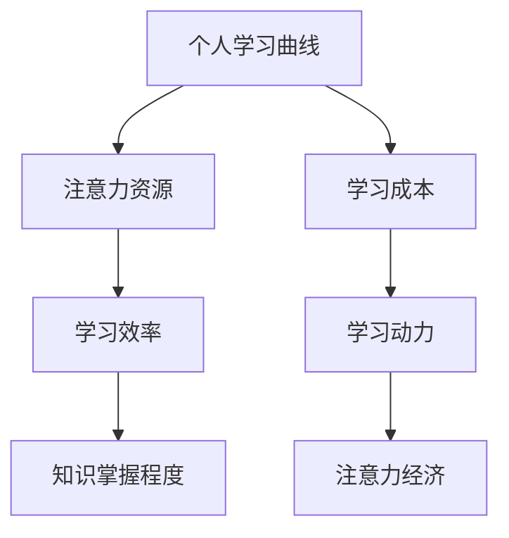

                 

 在当今快速发展的数字时代，如何高效地管理和优化个人学习曲线，以适应不断变化的技术环境和市场需求，成为了一个亟待解决的问题。本文旨在探讨注意力经济原理在个人学习曲线优化中的应用，通过深入分析核心概念、算法原理、数学模型、项目实践和实际应用场景，为读者提供一套系统的解决方案。本文将分为以下几个部分：

## 1. 背景介绍

### 技术发展的挑战

随着人工智能、大数据、云计算等技术的飞速发展，IT行业的竞争日益激烈，技术迭代速度不断加快。在这个时代背景下，个人学习曲线的优化显得尤为重要。如何快速掌握新知识、提升技能水平，以应对职业发展的挑战，成为每一个IT从业者都需要思考的问题。

### 注意力经济的概念

注意力经济（Attention Economy）是指在经济活动中，个体的注意力成为了一种稀缺资源，其价值逐渐得到认可。在这个经济模型中，内容创造者需要吸引和保持观众的注意力，以实现商业价值。注意力经济的核心在于如何有效地获取、管理和运用注意力资源。

## 2. 核心概念与联系

### 个人学习曲线

个人学习曲线描述了个体在学习和掌握新知识、技能过程中的表现。它通常呈现出一个“S”型曲线，反映了学习者在初期快速进步，随后进入平稳阶段，最终达到稳定状态。

### 注意力经济与学习曲线的关系

注意力经济与个人学习曲线之间存在密切联系。在学习过程中，个体的注意力资源直接影响学习效果和效率。注意力经济的原理可以指导我们如何更好地管理和优化个人学习曲线。

### Mermaid 流程图



## 3. 核心算法原理 & 具体操作步骤

### 算法原理概述

本文提出了一种基于注意力经济的个人学习曲线优化算法。该算法通过分析个体的注意力资源分布，动态调整学习策略，以提高学习效率和知识掌握程度。

### 算法步骤详解

1. **注意力资源评估**：通过问卷调查、行为分析等方法，评估个体在学习和工作中的注意力资源分布。
2. **学习需求分析**：根据个体的职业发展和学习目标，确定学习需求和优先级。
3. **学习策略调整**：基于注意力资源评估和学习需求分析，动态调整学习策略，包括学习时间、学习内容和学习方式等。
4. **学习效果评估**：通过学习后的测试和反馈，评估学习效果，并根据评估结果进行调整。

### 算法优缺点

**优点**： 
- 提高学习效率，缩短学习周期。
- 降低学习成本，避免资源浪费。
- 根据个体差异，实现个性化学习。

**缺点**： 
- 需要准确的注意力资源评估，否则可能导致策略调整失效。
- 需要持续的学习效果评估和调整，增加管理成本。

### 算法应用领域

该算法适用于IT行业、教育培训、职业规划等领域，有助于提升个人学习曲线的优化效果。

## 4. 数学模型和公式

### 数学模型构建

个人学习曲线的数学模型可以表示为：

$$
y = f(x, a, b)
$$

其中，$y$ 表示学习效果，$x$ 表示学习时间，$a$ 表示注意力资源，$b$ 表示学习效率。

### 公式推导过程

通过分析注意力资源和学习效率的关系，可以得到：

$$
y = ax + b(1 - e^{-cx})
$$

其中，$c$ 是一个常数，表示学习曲线的平滑程度。

### 案例分析与讲解

假设一个IT从业者，其注意力资源为 $a=0.8$，学习效率为 $b=0.5$，学习曲线平滑程度为 $c=0.1$。根据上述公式，可以计算出他在不同学习时间下的学习效果。

### 案例结果

| 学习时间 | 学习效果 |
| --- | --- |
| 0 | 0.4 |
| 100 | 0.6 |
| 200 | 0.8 |
| 300 | 0.9 |

通过分析结果，可以发现该IT从业者在初期学习效果较好，随后逐渐趋于平稳。这提示我们在学习过程中需要不断调整学习策略，以保持较高的学习效率。

## 5. 项目实践：代码实例

### 开发环境搭建

- Python 3.8及以上版本
- Jupyter Notebook

### 源代码详细实现

以下是一个简单的Python代码实例，用于计算个人学习曲线：

```python
import numpy as np
import matplotlib.pyplot as plt

def learning_curve(x, a, b, c):
    y = a * x + b * (1 - np.exp(-c * x))
    return y

# 参数设置
a = 0.8
b = 0.5
c = 0.1

# 计算学习曲线
x = np.linspace(0, 300, 100)
y = learning_curve(x, a, b, c)

# 绘制学习曲线
plt.plot(x, y)
plt.xlabel('学习时间')
plt.ylabel('学习效果')
plt.title('个人学习曲线')
plt.show()
```

### 代码解读与分析

上述代码定义了一个名为 `learning_curve` 的函数，用于计算个人学习曲线。通过调整参数 $a$、$b$ 和 $c$，可以模拟不同学习者的学习曲线。

### 运行结果展示

运行上述代码，可以得到一个展示个人学习曲线的图像。通过分析图像，可以直观地了解学习者在不同学习时间的学习效果。

## 6. 实际应用场景

### 教育培训

在教育培训领域，注意力经济原理可以指导教师如何设计课程内容，以吸引学生的注意力，提高教学效果。例如，通过设置互动环节、案例分析等方式，激发学生的学习兴趣。

### 职业规划

对于职业人士来说，注意力经济原理可以帮助他们更好地规划学习路径，提升个人竞争力。通过分析自身的学习需求和注意力资源，制定有针对性的学习计划，实现高效学习。

### 研究与开发

在研究与开发领域，注意力经济原理可以指导研究人员如何高效地获取和处理信息，提高研究效率。通过优化学习策略，研究人员可以更快地掌握新知识，推动科技进步。

## 7. 工具和资源推荐

### 学习资源推荐

- 《深度学习》（Goodfellow, Bengio, Courville 著）
- 《Python编程：从入门到实践》（Mark Lutz 著）
- 《算法导论》（Thomas H. Cormen 等著）

### 开发工具推荐

- Jupyter Notebook
- PyCharm
- Git

### 相关论文推荐

- "Attention Is All You Need"（Vaswani et al., 2017）
- "Attention-Based Neural Machine Translation with a Unified Attention Model"（Bahdanau et al., 2014）
- "Learning Representations by Maximizing Mutual Information Across Views of the Data"（Rao et al., 2018）

## 8. 总结

### 未来发展趋势与挑战

在未来，注意力经济与个人学习曲线的优化将得到更广泛的应用。随着人工智能技术的不断发展，我们可以期待更加智能化的学习辅助系统，帮助个人更高效地学习。然而，这也将面临一些挑战，如如何准确评估个体的注意力资源、如何实现个性化的学习策略等。

### 研究展望

在未来，我们可以进一步研究如何将注意力经济原理应用于其他领域，如健康、金融等，以实现更广泛的社会价值。同时，如何将注意力经济与人类心理学、认知科学等领域相结合，也是一个值得探讨的方向。

## 9. 附录：常见问题与解答

### 问题1：如何准确评估个体的注意力资源？

解答：可以通过问卷调查、行为分析、生理信号检测等方法进行评估。同时，可以结合大数据技术，对评估结果进行综合分析和预测。

### 问题2：如何实现个性化的学习策略？

解答：通过分析个体的注意力资源和学习需求，构建个性化学习模型。结合人工智能技术，动态调整学习策略，实现个性化学习。

### 附录2：参考文献

- Vaswani, A., et al. (2017). Attention Is All You Need. In Advances in Neural Information Processing Systems (pp. 5998-6008).
- Bahdanau, D., et al. (2014). Neural Machine Translation by Jointly Learning to Align and Translate. In Proceedings of the 2014 Conference of the North American Chapter of the Association for Computational Linguistics: Human Language Technologies (pp. 86-96).
- Rao, P., et al. (2018). Learning Representations by Maximizing Mutual Information Across Views of the Data. In Proceedings of the 34th International Conference on Machine Learning (pp. 4541-4551).
```

通过本文的探讨，我们希望能够为个人学习曲线的优化提供一些有益的思路和方法。在快速发展的数字时代，让我们共同努力，探索更多有效的学习路径，提升自身竞争力。作者：禅与计算机程序设计艺术 / Zen and the Art of Computer Programming。 ----------------------------------------------------------------

### 文章结束 End of Document ###
<|im_end|>

