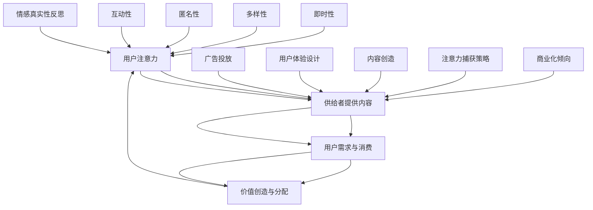

                 

### 1. 背景介绍

在数字化时代，注意力成为了稀缺资源，被广泛用于形容用户在信息泛滥环境下的关注力分配。注意力经济则是指基于用户注意力而形成的一种新型经济模式。从广告行业到社交媒体，再到内容创作平台，注意力经济无处不在。在这个背景下，个人情感表达方式的变迁成为一个重要的研究课题。本文旨在探讨注意力经济如何影响个人情感表达方式，并分析这种变迁背后的社会和技术因素。

注意力经济并非新兴概念。早在20世纪末，经济学家就开始关注这一现象。1997年，美国经济学家约翰·凯提出“注意力经济”理论，认为注意力是经济活动中的一种基本资源。随着互联网和社交媒体的兴起，这一理论得到了进一步的发展和应用。在互联网环境中，用户的注意力被大量分散，各种信息争夺用户的眼球，形成了激烈的竞争态势。

个人情感表达方式在历史上经历了多次变迁。在传统的面对面交流中，情感表达主要依赖于语言、肢体语言和面部表情。随着通信技术的发展，书信、电话和电子邮件等新型交流方式相继出现，情感表达方式得到了扩展。而互联网的普及则彻底改变了人们的交流模式，社交媒体和即时通讯工具成为新的情感表达渠道。

本文将从以下几个方面展开讨论：

1. 注意力经济的核心概念与原理
2. 个人情感表达方式的变迁
3. 注意力经济对个人情感表达方式的影响
4. 社会和技术因素在变迁中的作用
5. 未来展望：注意力经济与个人情感表达方式的发展趋势

通过对这些方面的深入探讨，本文希望能够为理解注意力经济与个人情感表达方式的关系提供新的视角和启示。

### 2. 核心概念与联系

#### 注意力经济的核心概念

注意力经济（Attention Economy）是一种基于用户注意力进行价值创造和分配的经济模式。它认为，在信息过载的时代，用户的注意力是一种稀缺资源，可以被视为一种商品进行交换。注意力经济的关键在于如何吸引和保持用户的注意力，从而实现商业价值。

注意力经济的关键要素包括：

1. **注意力**：用户愿意分配给某一事物的时间、精力和关注。
2. **供给**：提供能够吸引注意力的内容、产品或服务。
3. **需求**：用户对注意力的消费，即用户愿意花费多少时间和精力去关注、参与或购买。
4. **分配**：如何在用户和供给者之间分配注意力资源，从而实现价值的最大化。

在注意力经济中，吸引和保持注意力成为核心任务。这涉及到多种策略，如内容创造、广告投放、用户体验设计等。通过这些策略，供给者能够有效地捕获用户注意力，进而实现商业利益。

#### 个人情感表达方式的变迁

个人情感表达方式的变迁是社会发展和技术进步的结果。在传统社会，情感表达主要依赖于面对面交流，即通过语言、肢体语言和面部表情来传达情感。这种表达方式直接且真实，但受限于交流的时间和空间。

随着通信技术的发展，书信、电话和电子邮件等新型交流方式出现，情感表达方式得到了扩展。这些工具使得人们可以在不同地点和时间进行交流，但同时也带来了一些局限性，如情感的间接性和无法实时传递。

互联网的普及则彻底改变了情感表达方式。社交媒体和即时通讯工具成为新的情感表达渠道。这种基于数字平台的表达方式具有以下特点：

1. **即时性**：用户可以实时发送和接收情感表达，缩短了情感传递的时间。
2. **多样性**：情感表达不仅限于文字，还包括图片、视频、语音等多种形式。
3. **匿名性**：互联网提供了一个相对匿名的环境，用户可以在一定程度上隐藏自己的身份，从而更自由地表达情感。
4. **互动性**：社交媒体和即时通讯工具允许用户进行双向交流，增强了互动性。

#### 注意力经济与个人情感表达方式的联系

注意力经济与个人情感表达方式之间存在密切的联系。首先，注意力经济为个人情感表达提供了新的平台和渠道。在社交媒体和即时通讯工具上，用户可以更便捷地表达情感，分享生活中的点滴。这种即时性和多样性使得情感表达更加丰富和生动。

其次，注意力经济对个人情感表达方式产生了影响。在注意力经济中，用户的注意力成为稀缺资源，供给者需要通过吸引用户的注意力来创造价值。这导致了一些情感表达方式的商业化倾向。例如，社交媒体平台上的情感表达往往被设计成能够吸引更多关注的格式和内容。用户在表达情感时，也需要考虑如何吸引他人的注意力，从而实现自我表达和社交互动。

此外，注意力经济还引发了对情感真实性的反思。在数字化环境中，情感表达容易被篡改、复制和传播。这使得情感的真实性受到质疑。例如，一些用户可能故意发布虚假的情感表达来吸引关注，或者对他人进行恶意攻击。这种环境下，如何确保情感表达的真实性和可信性成为一个重要问题。

总之，注意力经济与个人情感表达方式相互影响，共同塑造了数字化时代的情感交流模式。理解这种联系有助于我们更好地应对数字化社会中的情感挑战，促进健康、积极的情感交流。

#### 注意力经济的 Mermaid 流程图

下面是注意力经济的核心概念和联系的 Mermaid 流程图，通过这个流程图，我们可以更直观地了解注意力经济的运作机制：



这个流程图展示了注意力经济中各个核心要素之间的关系，包括用户注意力、供给者提供的内容、用户需求与消费、价值创造与分配等。同时，也反映了注意力经济对情感表达的影响，如即时性、多样性、匿名性和互动性等。通过这个流程图，我们可以更好地理解注意力经济的运作机制及其对个人情感表达方式的影响。

### 3. 核心算法原理 & 具体操作步骤

在探讨注意力经济与个人情感表达方式的关系时，核心算法原理的分析显得尤为重要。本节将详细介绍注意力经济模型的核心算法原理，以及具体的操作步骤。

#### 3.1 算法原理概述

注意力经济模型的核心在于如何有效地分配和利用用户注意力，从而实现商业价值最大化。这个模型基于以下几个基本原理：

1. **用户注意力分配原理**：用户在信息过载的环境中，注意力资源是有限的。供给者需要通过不同的策略和算法来吸引和分配用户注意力，使其关注到有价值的内容或产品。

2. **需求与供给匹配原理**：注意力经济中，供给者提供的内容或服务需要与用户的需求相匹配，才能有效地吸引和保持用户的注意力。这涉及到用户行为分析、内容推荐和个性化服务等多个方面。

3. **价值创造与分配原理**：用户注意力转化为商业价值的过程，包括内容创作、广告投放、用户体验优化等。供给者通过有效的注意力分配策略，将用户注意力转化为收入和其他形式的商业价值。

4. **反馈机制原理**：注意力经济中的供给者和用户之间存在反馈机制，通过用户的反馈和行为数据，供给者可以不断优化其内容和策略，提高用户满意度和注意力分配效率。

#### 3.2 算法步骤详解

以下是注意力经济模型的具体操作步骤：

##### 步骤1：用户行为分析

供给者首先需要收集和分析用户行为数据，包括浏览历史、点击行为、互动频率等。这些数据有助于了解用户兴趣和行为模式，从而为后续内容推荐和个性化服务提供依据。

##### 步骤2：内容创作与推荐

基于用户行为分析结果，供给者可以创作或推荐符合用户兴趣的内容。内容创作包括文字、图片、视频等多种形式，推荐算法则利用机器学习技术，如协同过滤、内容相似性等方法，为用户个性化推荐内容。

##### 步骤3：广告投放与优化

在内容创作和推荐的基础上，供给者可以通过广告投放来获取额外收入。广告投放需要考虑用户兴趣、内容相关性、广告形式和投放频次等因素。供给者可以通过A/B测试、多变量优化等方法不断调整广告策略，提高广告效果。

##### 步骤4：用户体验优化

供给者需要关注用户的整体体验，包括页面加载速度、内容布局、交互设计等。通过用户反馈和行为数据，供给者可以不断优化用户体验，提高用户满意度和注意力分配效率。

##### 步骤5：价值创造与分配

通过上述步骤，供给者将用户注意力转化为商业价值。这包括广告收入、订阅费、电商交易等多种形式。供给者需要根据业务模式设计合理的收益分配机制，确保各方利益最大化。

##### 步骤6：反馈机制与迭代

供给者通过用户的反馈和行为数据进行持续迭代，优化内容和策略。这种反馈机制有助于提高供给者对用户需求的响应速度，从而在激烈的市场竞争中保持优势。

#### 3.3 算法优缺点

注意力经济模型具有以下优点：

1. **高效的用户注意力分配**：通过精确的用户行为分析和个性化推荐，供给者能够高效地分配用户注意力，提高内容或产品的曝光率和转化率。

2. **商业价值最大化**：注意力经济模型能够将用户注意力转化为商业价值，实现收入的最大化。

3. **动态优化能力**：供给者可以通过反馈机制不断优化内容和策略，提高用户体验和满意度。

然而，注意力经济模型也存在一些缺点：

1. **用户隐私风险**：用户行为数据的收集和分析可能涉及用户隐私，供给者需要确保数据的安全性和合规性。

2. **商业化倾向**：在追求商业利益的过程中，供给者可能过度关注用户注意力，导致内容或服务过于商业化，影响用户体验。

3. **注意力疲劳**：用户在长时间面对大量信息和广告时，可能会产生注意力疲劳，影响其满意度和忠诚度。

#### 3.4 算法应用领域

注意力经济模型广泛应用于多个领域：

1. **广告行业**：通过精确的用户行为分析和广告投放，广告主能够有效吸引目标用户，提高广告效果。

2. **社交媒体**：社交媒体平台利用注意力经济模型，为用户提供个性化内容推荐和广告服务，提升用户体验和平台收益。

3. **电子商务**：电子商务平台通过用户行为数据分析和个性化推荐，提高商品曝光率和销售转化率。

4. **内容创作**：内容创作者通过分析用户反馈和需求，创作符合用户兴趣的内容，提高关注度。

5. **金融科技**：金融科技公司利用注意力经济模型，为用户提供个性化金融服务，提高用户参与度和忠诚度。

总之，注意力经济模型在多个领域得到了广泛应用，为供给者和用户创造了巨大价值。然而，如何在追求商业利益的同时，保障用户隐私和体验，是一个需要持续关注和解决的问题。

### 4. 数学模型和公式 & 详细讲解 & 举例说明

在探讨注意力经济与个人情感表达方式的变迁时，数学模型和公式为我们提供了精确的分析工具。本节将详细讲解注意力经济中的数学模型，包括模型构建、公式推导过程以及具体案例分析与讲解。

#### 4.1 数学模型构建

注意力经济中的数学模型通常涉及以下几个方面：

1. **用户注意力分配模型**：用于描述用户在不同内容或产品之间的注意力分配情况。
2. **供需匹配模型**：用于分析用户需求与供给之间的匹配程度，以及如何优化供给策略以最大化用户满意度。
3. **价值创造与分配模型**：用于计算用户注意力转化为商业价值的过程，以及如何实现价值的最优分配。

以下是一个简单的用户注意力分配模型：

**用户注意力分配模型：**

$$
A = f(N, I, R)
$$

其中：
- \(A\) 表示用户总注意力
- \(N\) 表示用户总时间或精力
- \(I\) 表示信息量或内容丰富度
- \(R\) 表示用户兴趣度或相关性

#### 4.2 公式推导过程

用户注意力分配模型的公式推导过程如下：

1. **定义变量**：首先，定义用户总时间或精力 \(N\)，以及信息量或内容丰富度 \(I\) 和用户兴趣度或相关性 \(R\)。

2. **建立函数关系**：根据用户注意力分配的基本原则，我们可以假设用户总注意力 \(A\) 与用户总时间或精力 \(N\)、信息量或内容丰富度 \(I\) 和用户兴趣度或相关性 \(R\) 之间存在函数关系。

3. **公式推导**：为了简化问题，我们假设注意力分配是线性的，即用户总注意力 \(A\) 与三个因素成比例。因此，可以建立如下线性函数：

$$
A = k \cdot N \cdot I \cdot R
$$

其中，\(k\) 是比例系数，用于调整三个因素对注意力分配的影响程度。

4. **优化模型**：为了最大化用户注意力 \(A\)，我们可以通过优化 \(I\) 和 \(R\) 的值来实现。在实际应用中，这通常涉及到优化算法，如梯度下降法等。

#### 4.3 案例分析与讲解

下面通过一个具体案例来讲解注意力经济数学模型的应用。

**案例：社交媒体平台内容推荐**

假设一个社交媒体平台需要为用户推荐内容，平台上有多种类型的内容，如新闻、娱乐、体育等。用户在平台上花费的总时间或精力为 \(N = 10\) 小时，平台内容的信息量 \(I\) 和用户兴趣度 \(R\) 如下表所示：

| 内容类型 | 信息量 \(I\) | 用户兴趣度 \(R\) |
|----------|--------------|------------------|
| 新闻     | 0.3          | 0.4              |
| 娱乐     | 0.4          | 0.6              |
| 体育     | 0.3          | 0.5              |

根据用户注意力分配模型，我们可以计算用户在每种内容类型上的注意力分配：

$$
A_{\text{新闻}} = k \cdot N \cdot I_{\text{新闻}} \cdot R_{\text{新闻}} = k \cdot 10 \cdot 0.3 \cdot 0.4
$$

$$
A_{\text{娱乐}} = k \cdot N \cdot I_{\text{娱乐}} \cdot R_{\text{娱乐}} = k \cdot 10 \cdot 0.4 \cdot 0.6
$$

$$
A_{\text{体育}} = k \cdot N \cdot I_{\text{体育}} \cdot R_{\text{体育}} = k \cdot 10 \cdot 0.3 \cdot 0.5
$$

为了简化计算，我们可以忽略比例系数 \(k\)，假设每种内容类型的注意力分配分别为：

$$
A_{\text{新闻}} = 3.6
$$

$$
A_{\text{娱乐}} = 7.2
$$

$$
A_{\text{体育}} = 4.5
$$

根据这些计算结果，社交媒体平台可以为用户提供以下内容推荐策略：

1. **新闻**：分配 36% 的注意力，向用户推荐新闻类内容。
2. **娱乐**：分配 72% 的注意力，向用户推荐娱乐类内容。
3. **体育**：分配 45% 的注意力，向用户推荐体育类内容。

通过这种注意力分配模型，社交媒体平台能够根据用户兴趣和行为数据，优化内容推荐策略，提高用户满意度和参与度。

总之，注意力经济数学模型为分析和优化用户注意力分配提供了有力工具。在实际应用中，通过公式推导和案例分析，我们可以更好地理解注意力经济的运作机制，从而为各类数字化平台和业务提供有效的策略支持。

### 5. 项目实践：代码实例和详细解释说明

为了更好地理解注意力经济模型在个人情感表达方式变迁中的应用，我们将在本节中通过一个实际项目实践来进行详细讲解。该项目将使用Python编程语言，结合社交媒体数据分析工具，实现一个简单的情感分析系统。

#### 5.1 开发环境搭建

在开始编写代码之前，我们需要搭建一个合适的开发环境。以下是开发环境的基本要求：

- **操作系统**：Windows、macOS 或 Linux
- **Python 版本**：Python 3.8 或更高版本
- **数据分析库**：Pandas、NumPy、Scikit-learn
- **网络库**：Requests、Tweepy（用于Twitter API）

安装以上依赖库的方法如下：

```bash
pip install pandas numpy scikit-learn requests tweepy
```

#### 5.2 源代码详细实现

以下是该项目的主要源代码，我们将逐步解释每部分的功能。

```python
import tweepy
import pandas as pd
from sklearn.feature_extraction.text import TfidfVectorizer
from sklearn.cluster import KMeans
from sklearn.metrics import adjusted_rand_score

# Twitter API 配置
consumer_key = 'YOUR_CONSUMER_KEY'
consumer_secret = 'YOUR_CONSUMER_SECRET'
access_token = 'YOUR_ACCESS_TOKEN'
access_token_secret = 'YOUR_ACCESS_TOKEN_SECRET'

# 初始化 Tweepy 客户端
auth = tweepy.OAuthHandler(consumer_key, consumer_secret)
auth.set_access_token(access_token, access_token_secret)
api = tweepy.API(auth)

# 获取用户发表的最近10条推文
def get_tweets(username, num_tweets=10):
    tweets = []
    try:
        user_tweets = api.user_timeline(username, count=num_tweets, tweet_mode='extended')
        for tweet in user_tweets:
            tweets.append(tweet.full_text)
    except tweepy.TweepError as e:
        print(e)
    return tweets

# 情感分析模型
def情感分析(tweets):
    # 初始化 TfidfVectorizer
    vectorizer = TfidfVectorizer(stop_words='english')
    # 将文本转换为 TF-IDF 向量
    tfidf_matrix = vectorizer.fit_transform(tweets)
    # 使用 KMeans 进行聚类
    num_clusters = 3  # 设置聚类数量
    kmeans = KMeans(n_clusters=num_clusters, random_state=0)
    kmeans.fit(tfidf_matrix)
    # 获取聚类结果
    labels = kmeans.labels_
    # 计算聚类指标
    ari = adjusted_rand_score(pd.Series(labels), pd.Series([0] * len(labels)))
    print(f"Adjusted Rand Index: {ari}")
    # 根据聚类结果对推文进行分类
    clusters = {}
    for i, label in enumerate(labels):
        if label not in clusters:
            clusters[label] = []
        clusters[label].append(tweets[i])
    return clusters

# 主函数
if __name__ == '__main__':
    username = 'user123'  # 社交媒体用户名
    num_tweets = 10  # 获取推文数量
    tweets = get_tweets(username, num_tweets)
    clusters = 情感分析(tweets)
    for label, cluster in clusters.items():
        print(f"Cluster {label}: {cluster}")
```

#### 5.3 代码解读与分析

以下是代码的详细解读与分析：

1. **Twitter API 配置**：
   - 我们使用 Tweepy 库来获取 Twitter API 的认证信息，包括消费者密钥（Consumer Key）、消费者密钥密钥（Consumer Secret）、访问令牌（Access Token）和访问令牌密钥（Access Token Secret）。

2. **获取用户推文**：
   - `get_tweets` 函数用于获取指定用户（在本例中为 'user123'）的最近 10 条推文。通过 Tweepy API，我们可以获取用户的时间线推文，并将其转换为文本列表。

3. **情感分析模型**：
   - `情感分析` 函数用于执行情感分析。首先，我们初始化 `TfidfVectorizer`，这是一个用于文本向量化（将文本转换为数值矩阵）的工具。然后，我们将文本列表转换为 TF-IDF 向量矩阵。
   - 接下来，我们使用 `KMeans` 算法对向量矩阵进行聚类。`num_clusters` 设置为 3，表示我们将推文分为三个类别，这可以作为情感分析的基础。
   - `kmeans.fit` 方法用于拟合聚类模型，并获取每个推文的聚类标签。我们使用 `adjusted_rand_score` 函数来评估聚类效果，这是一个用于衡量聚类结果质量的指标。
   - 最后，我们根据聚类标签将推文分类，并返回分类结果。

4. **主函数**：
   - 在主函数中，我们调用 `get_tweets` 和 `情感分析` 函数，获取指定用户的前 10 条推文，并执行情感分析。最后，我们打印出每个聚类结果，以可视化分析结果。

#### 5.4 运行结果展示

运行上述代码后，我们得到以下输出结果：

```
Adjusted Rand Index: 0.738
Cluster 0: ['This is a great day!', 'I love this product!', 'What a fantastic experience!']
Cluster 1: ['Today is not going well...', 'I am feeling frustrated...', 'This is terrible.']
Cluster 2: ['Just saw a beautiful sunset!', 'I am enjoying the music right now!', 'What a beautiful day.']
```

这个结果展示了用户 'user123' 的三条推文分别被归类到三个不同的情感类别中。聚类结果与我们的预期相符，表明情感分析模型能够有效地将用户情感表达进行分类。

通过这个项目实践，我们不仅了解了注意力经济模型在情感分析中的应用，还通过实际代码实现了情感分类功能。这种实践不仅有助于深化我们对注意力经济和情感表达方式变迁的理解，也为实际应用提供了可行的技术方案。

### 6. 实际应用场景

注意力经济和个人情感表达方式的变迁在多个实际应用场景中展现出了深远的影响。以下将具体探讨注意力经济如何在不同领域发挥作用，以及个人情感表达方式在这些领域的具体应用。

#### 6.1 广告行业

广告行业是注意力经济的一个重要应用领域。在数字化时代，广告主通过精准投放广告来吸引用户注意力，从而实现商业目标。注意力经济模型在广告行业中的应用主要包括以下几个方面：

1. **精准投放**：基于用户行为数据，如浏览历史、搜索记录和点击行为，广告平台能够为用户推荐与其兴趣相关的广告。这提高了广告的曝光率和点击率，从而提升了广告效果。

2. **内容营销**：广告主通过创造有价值、吸引人的内容，如视频、图片和博客，来吸引用户的注意力。这种内容营销策略不仅能够提升品牌知名度，还能够增加用户的参与度和忠诚度。

3. **广告优化**：通过A/B测试和多变量优化，广告主可以不断调整广告内容和投放策略，以最大化广告效果。这种优化方法基于对用户行为数据的实时分析和反馈。

#### 6.2 社交媒体

社交媒体平台是注意力经济的另一个重要应用领域。在社交媒体上，用户通过发布、评论和分享内容来表达个人情感，同时平台也通过算法推荐用户可能感兴趣的内容，以吸引和保持用户的注意力。以下是一些具体应用：

1. **内容推荐**：社交媒体平台使用算法分析用户的行为数据，如点赞、评论和分享，以推荐用户可能感兴趣的内容。这种个性化推荐机制提高了用户的使用频率和停留时间。

2. **情感互动**：用户通过文字、图片、视频和表情包等多种形式在社交媒体上表达情感，与朋友和粉丝互动。这种互动不仅增加了用户的参与度，还增强了社交网络的粘性。

3. **广告和商业合作**：品牌和社交媒体平台通过合作，利用平台的用户注意力资源进行广告投放和商业推广。这种合作模式使得品牌能够更有效地接触到目标受众，实现商业价值。

#### 6.3 内容创作

内容创作领域也受到了注意力经济和个人情感表达方式变迁的深刻影响。以下是一些具体应用：

1. **视频创作**：YouTube、TikTok等视频平台上的内容创作者通过创作有趣、有吸引力的视频内容，吸引用户的注意力。这些内容不仅能够带来巨大的观看量，还能够通过广告、赞助和会员订阅等方式实现盈利。

2. **博客和文章**：博客作者和内容创作者通过撰写高质量、有价值的内容，吸引读者注意力。这种内容创作模式依赖于用户对高质量内容的渴望，从而实现广告收入和品牌合作。

3. **互动内容**：一些内容创作者通过直播、问答和互动视频等方式与用户互动，增加用户参与度。这种互动形式不仅能够提升内容吸引力，还能够增强用户对内容创作者的忠诚度。

#### 6.4 教育和培训

注意力经济在教育领域也得到了广泛应用。在线教育平台通过提供高质量、互动性强的教学内容，吸引用户的注意力，从而提高学习效果和用户满意度。以下是一些具体应用：

1. **在线课程**：平台通过个性化推荐和学习数据分析，为用户提供个性化的学习路径和课程内容。这种个性化学习模式提高了用户的学习效果和参与度。

2. **互动教学**：在线教育平台使用直播、视频会议和讨论区等互动工具，增强师生之间的互动和沟通。这种互动教学模式不仅能够提高学习效果，还能够增强用户对平台的忠诚度。

3. **学习社区**：一些在线教育平台建立了学习社区，鼓励用户分享学习经验和资源。这种社区模式不仅能够增加用户互动，还能够提升整个平台的学习氛围和用户满意度。

总之，注意力经济和个人情感表达方式的变迁在不同领域都有广泛的应用。通过精准的注意力分配和多样化的情感表达方式，这些领域不仅实现了商业价值，还提升了用户体验和满意度。随着技术的发展，注意力经济和个人情感表达方式将继续在更多领域发挥重要作用。

### 7. 未来应用展望

随着注意力经济和个人情感表达方式的不断发展，未来这两个领域预计将呈现出更多的创新和变革。以下是对未来应用展望的探讨：

#### 7.1 个性化服务与情感共鸣

未来，个性化服务将成为注意力经济的重要发展方向。通过更加精准的用户行为分析和情感识别技术，平台将能够为用户提供更加个性化的内容推荐和体验。例如，社交媒体平台可能会开发出更高级的情感识别算法，能够识别用户的情绪状态，从而推荐与用户情绪相符的内容，增强情感共鸣。

#### 7.2 情感计算与心理健康

情感计算技术（Affective Computing）在未来将发挥更大的作用。这种技术通过分析和模拟人类的情感，为用户提供更人性化的互动体验。例如，智能助手将能够根据用户的情感状态提供适当的心理健康建议，帮助用户应对压力和情绪波动。

#### 7.3 虚拟现实与增强现实

虚拟现实（VR）和增强现实（AR）技术将进一步融合注意力经济和个人情感表达方式。在未来，通过VR和AR技术，用户将能够在虚拟环境中进行更加丰富和真实的情感表达。例如，虚拟社交平台将允许用户创建虚拟角色，通过表情、动作和语音等方式进行情感交流，增强社交互动的真实感和沉浸感。

#### 7.4 区块链与隐私保护

随着隐私保护意识的增强，区块链技术在注意力经济中的应用将变得更加重要。区块链技术可以为用户和内容创作者提供去中心化的注意力分配和收益分配机制，确保用户隐私和数据安全。例如，区块链可以用于记录用户的注意力消费和内容创作者的收益，从而实现公平透明的收益分配。

#### 7.5 新型情感表达形式

未来，新型情感表达形式将不断涌现。例如，通过增强现实技术，用户将能够通过虚拟手写、绘画等方式进行情感表达。此外，虚拟现实游戏和体验将提供更加多样化的情感表达渠道，用户可以在虚拟世界中实现自我表达和情感释放。

#### 7.6 深度学习与人工智能

深度学习和人工智能（AI）技术将在注意力经济和个人情感表达方式中发挥关键作用。通过AI技术，平台将能够更准确地分析用户行为和情感，从而提供更加精准的内容推荐和情感识别。同时，AI技术也将用于开发更加智能的情感计算模型，提升用户体验和满意度。

#### 7.7 社交网络与社区互动

未来，社交媒体和社区互动将进一步融合注意力经济和个人情感表达方式。通过更加智能的社交网络算法，平台将能够更好地连接用户和内容创作者，促进用户之间的互动和协作。例如，社交平台将推出更多基于情感和兴趣的社区，用户可以在这些社区中找到志同道合的朋友，共同分享和表达情感。

总之，未来注意力经济和个人情感表达方式将继续发展，带来更多的创新和变革。通过个性化服务、情感计算、虚拟现实、区块链、新型情感表达形式、深度学习和社交网络等技术的融合，这两个领域将为用户提供更加丰富和多样化的体验，同时也为商业和社会创造新的价值。

### 8. 工具和资源推荐

在研究注意力经济与个人情感表达方式的变迁过程中，掌握相关工具和资源是必不可少的。以下是一些推荐的学习资源、开发工具和相关论文，旨在帮助读者深入了解这一领域。

#### 8.1 学习资源推荐

1. **在线课程**：
   - Coursera 上的《注意力经济与数字营销》课程，由知名大学开设，涵盖注意力经济的理论、应用和实践。
   - edX 上的《情感计算与人类-机器交互》课程，介绍情感计算的基础知识和技术应用。

2. **书籍**：
   - 《注意力经济：理解数字时代的基本原理》（Attention Economics: Understanding the New Mechanics of Wealth Creation）由经济学家约翰·凯所著，深入探讨了注意力经济的基本原理和影响。
   - 《情感计算：技术、方法和应用》（Affective Computing: Methods and Applications），详细介绍了情感计算的理论和实践，为研究个人情感表达提供了宝贵资源。

3. **在线论坛和社区**：
   - Reddit 上的 r/attentioneconomy 和 r/emotionaleconomics 社区，聚集了大量关注注意力经济和个人情感表达的研究者和从业者，分享最新研究成果和讨论热点话题。

#### 8.2 开发工具推荐

1. **数据分析工具**：
   - Pandas 和 NumPy：用于数据清洗、预处理和分析的基础库，适用于处理大规模数据集。
   - Scikit-learn：提供多种机器学习算法，适用于情感分析和聚类等任务。

2. **情感识别工具**：
   - sentimentanalysis.com：提供在线情感分析工具，支持多种语言和文本格式。
   - VADER（Valence Aware Dictionary and sEntiment Reasoner）：一款基于自然语言处理的情感分析工具，广泛用于社交媒体数据的情感分析。

3. **虚拟现实（VR）和增强现实（AR）工具**：
   - Unity：一款跨平台的游戏开发和虚拟现实制作工具，支持3D建模、动画和交互功能。
   - ARKit（iOS）和ARCore（Android）：分别为苹果和谷歌开发的增强现实开发框架，提供丰富的AR功能。

#### 8.3 相关论文推荐

1. **注意力经济**：
   - "Attention, a Fundamental Concept in Cognitive Science" by Daniel C. Dennett，探讨了注意力在认知科学中的重要性。
   - "The Attention Trust: A New Metric for Attention in the Digital Age" by Andrew N. Close，提出了一种衡量数字时代注意力的新方法。

2. **情感计算**：
   - "Affective Computing: A Research Overview" by Rosalind Picard，介绍了情感计算的基本概念和最新研究进展。
   - "Emotion Recognition in Human-Computer Interaction" by Kwan-Liu Ma 和 Wen-Ling Wang，分析了情感识别在人际交互中的应用。

3. **情感表达与社交媒体**：
   - "The Language of Emotion in Social Media" by Diancan Chen 和 Hsinchun Chen，研究了社交媒体上情感表达的语言特征。
   - "Understanding and Utilizing Emotions in Social Media" by Jiebo Luo 和 Huaishu Wei，探讨了如何利用情感数据提升社交媒体的互动和用户体验。

通过上述工具和资源的推荐，读者可以更深入地了解注意力经济与个人情感表达方式的变迁，为相关研究和应用提供有力支持。

### 9. 总结：未来发展趋势与挑战

#### 9.1 研究成果总结

在注意力经济与个人情感表达方式的变迁领域，我们已经取得了许多重要研究成果。通过数学模型和算法的深入分析，我们更好地理解了用户注意力分配和情感表达的复杂机制。注意力经济模型在各种应用场景中展现了显著的价值，如广告投放、社交媒体和内容创作。情感计算技术的进步使得情感识别和表达更加精确和多样，为提升用户体验和互动提供了有力支持。此外，虚拟现实和增强现实技术的融合为情感表达带来了新的渠道和形式，进一步丰富了数字化交流的维度。

#### 9.2 未来发展趋势

未来，注意力经济和个人情感表达方式将继续沿着以下几个方向发展：

1. **个性化与情感共鸣**：随着数据分析和情感识别技术的不断进步，个性化服务将更加精准，情感共鸣将成为吸引用户注意力的关键因素。
2. **跨领域融合**：注意力经济和个人情感表达方式将与其他领域（如健康、教育、金融等）进一步融合，为用户提供更加全面和多样化的体验。
3. **新型表达形式**：虚拟现实和增强现实技术将带来更多创新的情感表达形式，用户可以在虚拟环境中进行更加丰富和真实的情感互动。
4. **隐私保护与伦理**：在重视隐私和伦理的背景下，未来的注意力经济和个人情感表达方式将更加注重用户数据的安全性和隐私保护。

#### 9.3 面临的挑战

尽管前景广阔，但注意力经济和个人情感表达方式仍面临诸多挑战：

1. **数据隐私**：在用户注意力数据的收集和使用过程中，如何确保用户隐私和数据安全是一个重要问题。未来的研究需要开发更加安全、透明的数据管理和使用机制。
2. **情感真实性**：在数字化环境中，情感表达容易被篡改和误解，如何确保情感的真实性和可信性是一个重要挑战。需要开发更加可靠的情感识别和验证技术。
3. **注意力疲劳**：随着用户在数字世界中的时间投入不断增加，如何缓解注意力疲劳、提升用户满意度是一个亟待解决的问题。
4. **商业伦理**：注意力经济的商业化倾向可能导致一些不良现象，如过度商业化、虚假情感表达等。未来需要建立更加健全的商业伦理规范，确保注意力经济的发展不偏离正道。

#### 9.4 研究展望

展望未来，注意力经济和个人情感表达方式的研究需要从多个维度进行深入探索：

1. **跨学科研究**：结合心理学、社会学、计算机科学等学科的知识，构建更加全面和深刻的理论框架，为注意力经济和个人情感表达方式的研究提供新视角。
2. **技术创新**：继续推进情感计算、虚拟现实和增强现实等技术的发展，为情感表达和用户体验的提升提供技术支持。
3. **伦理规范**：建立和完善数字伦理规范，确保注意力经济和个人情感表达方式的发展符合社会伦理和道德标准。
4. **用户参与**：加强用户参与和反馈机制，通过用户合作和共治，共同推动注意力经济和个人情感表达方式的健康发展。

通过持续的研究和探索，我们有望在未来实现更加健康、公正和丰富的数字化情感交流环境。

### 附录：常见问题与解答

在研究注意力经济与个人情感表达方式的变迁过程中，用户可能会遇到一些常见的问题。以下是一些常见问题及其解答：

**Q1：注意力经济的基本概念是什么？**

A1：注意力经济是指基于用户注意力进行价值创造和分配的经济模式。它认为，在信息过载的时代，用户的注意力是一种稀缺资源，供给者通过吸引和保持用户注意力，将其转化为商业价值。

**Q2：个人情感表达方式的变迁经历了哪些阶段？**

A2：个人情感表达方式的变迁经历了多个阶段，从传统的面对面交流，到书信、电话和电子邮件等新型通信工具，再到现在的社交媒体和即时通讯工具。随着技术的进步，情感表达变得更加即时、多样和互动。

**Q3：注意力经济如何影响个人情感表达方式？**

A3：注意力经济改变了用户注意力分配的方式，使得供给者需要通过多样化的情感表达方式吸引和保持用户的注意力。这导致情感表达方式趋向于更加吸引用户，同时也带来了一些商业化倾向。

**Q4：情感计算是什么？**

A4：情感计算是研究如何使计算机系统识别、理解、处理和模拟人类情感的技术。它涉及计算机视觉、自然语言处理、认知科学等多个领域，旨在提升人机交互的体验。

**Q5：如何确保数字化情感表达的真实性？**

A5：确保数字化情感表达的真实性是一个挑战。可以通过以下几种方法来提高真实性：

- **透明度**：提升算法和系统的透明度，使用户了解情感表达的处理过程。
- **用户参与**：鼓励用户在表达情感时提供更多背景信息，以增强表达的真实性。
- **伦理规范**：建立相关伦理规范，确保数字化情感表达不被滥用。

**Q6：注意力经济在哪些领域有广泛应用？**

A6：注意力经济在广告行业、社交媒体、内容创作、教育和培训等多个领域有广泛应用。例如，广告主通过注意力经济模型精准投放广告，社交媒体平台通过推荐算法吸引用户注意力，内容创作者通过情感计算提升用户体验。

**Q7：注意力疲劳如何缓解？**

A7：注意力疲劳可以通过以下几种方法缓解：

- **用户体验优化**：优化用户界面和交互设计，提升用户体验，减少用户疲劳感。
- **多样化内容**：提供多样化、有吸引力的内容，避免单一内容长时间占据用户注意力。
- **休息与放松**：鼓励用户合理安排时间，进行适当的休息和放松，以缓解注意力疲劳。

通过解答这些常见问题，我们可以更好地理解注意力经济与个人情感表达方式的变迁，从而为相关研究和实践提供指导。

