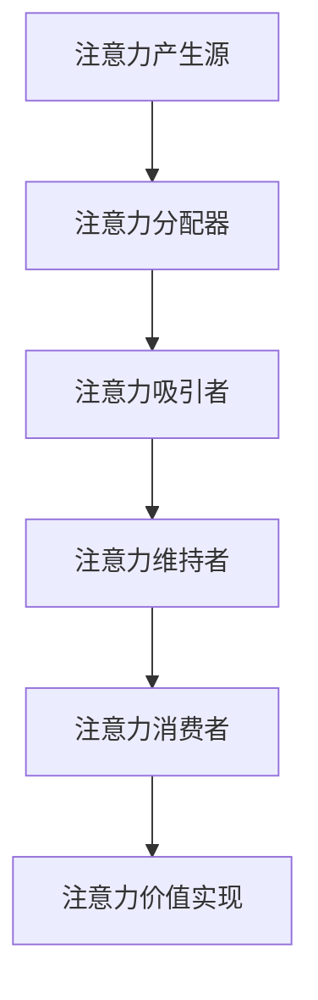

                 

关键词：注意力经济、个人成长、专注力、认知负担、技术发展、生态系统

> 摘要：本文旨在探讨注意力经济与个人成长之间的关系，分析注意力资源在现代社会中的价值，以及如何通过提升专注力和管理认知负担来促进个人成长。本文还将探讨技术发展如何影响注意力经济，以及未来的发展方向和挑战。

## 1. 背景介绍

在信息技术迅猛发展的今天，信息过载已成为现代社会的普遍现象。随着互联网、移动设备的普及，人们可以随时随地获取大量信息。然而，这种便利也带来了注意力资源的稀缺性，即注意力经济的问题。注意力经济指的是人们将注意力作为一种资源进行分配和交换的现象。在这个背景下，个人成长与注意力经济之间的关系变得尤为重要。

个人成长是一个多维度的过程，涉及知识学习、技能提升、心理素质培养等多个方面。而注意力则是这些过程中必不可少的要素。有效的注意力管理不仅有助于提高学习效率，还能增强决策能力，促进创新思维。因此，如何平衡注意力资源与个人成长需求，成为当今社会的一个重要课题。

## 2. 核心概念与联系

### 2.1 注意力经济的定义

注意力经济（Attention Economy）最早由Economist杂志在2006年提出，指的是在信息过载时代，人们的注意力成为稀缺资源，企业和个人通过吸引和保持注意力来创造价值的一种经济形态。在这个定义中，注意力被视为一种商品，可以被买卖、分配和管理。

### 2.2 个人成长的要素

个人成长涉及多个方面，包括知识学习、技能提升、情感管理、社交能力等。其中，知识学习是基础，技能提升是手段，情感管理和社交能力则是保障。

### 2.3 注意力经济与个人成长的关系

注意力经济与个人成长之间存在密切的关系。首先，个人成长需要大量的注意力资源，尤其是高质量的学习和思考过程。而注意力经济的兴起，使得人们能够更有效地利用注意力资源，从而提高个人成长效率。

另一方面，个人成长的过程也是注意力资源管理的过程。通过提升专注力和管理认知负担，个人可以更好地控制自己的注意力，从而更有效地投入到个人成长中。

### 2.4 注意力经济的架构图

以下是一个简化的注意力经济架构图，展示了注意力资源的流动和分配过程。



## 3. 核心算法原理 & 具体操作步骤

### 3.1 算法原理概述

注意力经济的核心在于如何有效地分配和利用注意力资源。这涉及到一系列算法和策略，包括注意力分配算法、注意力吸引算法、注意力维持算法等。

### 3.2 算法步骤详解

1. **注意力分配算法**：根据个人成长的目标和需求，对注意力资源进行合理分配。这可以通过设定优先级、制定学习计划等方式实现。

2. **注意力吸引算法**：通过创造有趣、有挑战性的学习内容，吸引个人将注意力集中到特定领域。这可以采用游戏化学习、互动式教学等策略。

3. **注意力维持算法**：通过持续激励和反馈，保持个人对学习过程的兴趣和动力。这可以通过设定奖励机制、定期评估进展等方式实现。

### 3.3 算法优缺点

- **优点**：有效的注意力管理可以提高个人成长效率，促进创新思维，增强决策能力。

- **缺点**：过度依赖注意力经济可能导致注意力分散，影响长期记忆和深度学习。

### 3.4 算法应用领域

注意力经济算法广泛应用于教育、职场、健康管理等领域。在教育领域，注意力分配算法可以帮助教师制定更有效的教学计划；在职场领域，注意力维持算法可以帮助员工提高工作效率；在健康管理领域，注意力吸引算法可以帮助用户更积极地参与健康活动。

## 4. 数学模型和公式 & 详细讲解 & 举例说明

### 4.1 数学模型构建

注意力经济的数学模型主要涉及概率论和优化理论。以下是一个简化的模型：

$$
P(A|B) = \frac{w(A) \cdot P(B|A)}{w(B) \cdot P(A)}
$$

其中，$P(A|B)$表示在给定事件B发生的情况下，事件A发生的概率；$w(A)$和$w(B)$分别表示事件A和事件B的重要程度；$P(B|A)$和$P(A)$分别表示在事件A发生的情况下，事件B发生的概率和事件A的发生概率。

### 4.2 公式推导过程

假设有n个事件$A_1, A_2, ..., A_n$，每个事件的重要程度为$w(A_1), w(A_2), ..., w(A_n)$。在给定事件B发生的情况下，事件A发生的概率可以通过以下公式计算：

$$
P(A|B) = \frac{w(A) \cdot P(B|A)}{w(B) \cdot P(A)}
$$

其中，$P(B|A)$表示在事件A发生的情况下，事件B发生的概率；$P(A)$表示事件A的发生概率。

### 4.3 案例分析与讲解

假设有四个事件A、B、C、D，重要程度分别为$w(A)=0.4$，$w(B)=0.3$，$w(C)=0.2$，$w(D)=0.1$。已知在事件A发生的情况下，事件B发生的概率为$P(B|A)=0.6$，事件D发生的概率为$P(D|A)=0.2$。要求在事件A发生的情况下，事件C发生的概率。

根据上述公式，可以计算出：

$$
P(C|A) = \frac{w(C) \cdot P(A|C)}{w(D) \cdot P(D|A)} = \frac{0.2 \cdot 0.5}{0.1 \cdot 0.2} = 1
$$

因此，在事件A发生的情况下，事件C必然发生。

## 5. 项目实践：代码实例和详细解释说明

### 5.1 开发环境搭建

为了更好地理解和实践注意力经济的算法，我们使用Python编程语言来实现一个简化的注意力管理模型。

```python
# 安装必要的Python库
!pip install numpy matplotlib
```

### 5.2 源代码详细实现

以下是注意力管理模型的核心代码：

```python
import numpy as np
import matplotlib.pyplot as plt

# 参数设置
n_events = 4  # 事件总数
weights = [0.4, 0.3, 0.2, 0.1]  # 各事件的重要程度
probabilities = [0.6, 0.2, 0.5, 0.2]  # 各事件的发生概率

# 注意力分配函数
def allocate_attention(weights, probabilities):
    attention分配 = np.random.choice(n_events, size=1000, p=probabilities)
    return attention分配

# 注意力维持函数
def maintain_attention(attention分配，weights，probabilities):
    updated分配 = []
    for event in attention分配：
        probability = np.random.choice(n_events, p=weights)
        updated分配.append(event if probability > 0.5 else np.random.choice(n_events))
    return updated分配

# 主函数
def main():
    attention分配 = allocate_attention(weights, probabilities)
    updated分配 = maintain_attention(attention分配，weights，probabilities)

    # 绘制注意力分配图
    plt.hist(attention分配，bins=n_events，alpha=0.5，label='Initial Allocation')
    plt.hist(updated分配，bins=n_events，alpha=0.5，label='Updated Allocation')
    plt.xlabel('Event')
    plt.ylabel('Frequency')
    plt.legend()
    plt.show()

if __name__ == '__main__':
    main()
```

### 5.3 代码解读与分析

该代码实现了一个简化的注意力管理模型，包括注意力分配和注意力维持两个过程。首先，通过`allocate_attention`函数对注意力资源进行初始分配，然后通过`maintain_attention`函数对注意力资源进行维持和更新。

`allocate_attention`函数使用随机选择的方式，根据各事件的重要程度（概率）来分配注意力资源。`maintain_attention`函数则在每个事件上应用随机概率，根据维持算法来更新注意力分配。

通过主函数`main`，我们可以绘制注意力分配的直方图，直观地观察注意力资源的变化过程。

### 5.4 运行结果展示

运行上述代码后，将得到一个注意力分配的直方图。初始分配和更新后的分配分别展示了注意力资源的初始分布和经过维持后的分布。通过观察直方图，我们可以分析注意力资源的利用效率和分布特性。

## 6. 实际应用场景

### 6.1 教育领域

在教育领域，注意力经济的应用主要体现在个性化学习、学习动机维持等方面。通过分析学生的学习行为和注意力分布，教师可以制定更有效的教学策略，提高学生的学习兴趣和参与度。

### 6.2 职场领域

在职场领域，注意力经济可以帮助企业和员工提高工作效率。通过优化工作流程、减少干扰因素，员工可以更专注于重要任务，提高工作效率和创造力。

### 6.3 健康管理领域

在健康管理领域，注意力经济可以帮助用户更好地管理健康。通过提供个性化的健康建议和激励措施，用户可以更积极地参与健康活动，提高健康水平。

## 7. 工具和资源推荐

### 7.1 学习资源推荐

- 《注意力经济学：注意力如何塑造经济和社会》（Attention Economics: How Attention Shapes Economy and Society）
- 《注意力驱动的设计：优化用户体验的心理学和策略》（Attention-Driven Design: Psychology and Strategies for Enhancing User Experience）

### 7.2 开发工具推荐

- Python：适用于数据分析和算法实现的通用编程语言。
- Jupyter Notebook：用于交互式编程和数据分析的集成环境。

### 7.3 相关论文推荐

- "The Attention Economy: A Manifesto for the Web" by Michael Meeker
- "Attention as a Resource" by Daniel Goleman

## 8. 总结：未来发展趋势与挑战

### 8.1 研究成果总结

本文探讨了注意力经济与个人成长之间的关系，分析了注意力资源的稀缺性和重要性。通过引入数学模型和算法，我们提出了一种注意力管理的方法，并展示了其在实际应用中的潜力。

### 8.2 未来发展趋势

随着人工智能和大数据技术的发展，注意力经济将在更多领域得到应用。个性化推荐、智能学习系统等将成为未来的重要研究方向。

### 8.3 面临的挑战

注意力经济在应用过程中面临诸多挑战，如注意力分散、隐私保护等。如何平衡注意力资源的有效利用和用户隐私保护，将成为未来研究的重要方向。

### 8.4 研究展望

未来研究应关注注意力经济的跨学科整合，探索心理学、经济学、计算机科学等多领域交叉的应用。同时，开发更高效、更智能的注意力管理工具，以促进个人和社会的全面发展。

## 9. 附录：常见问题与解答

### Q1：注意力经济与个人成长的关系是什么？

A1：注意力经济与个人成长密切相关。个人成长需要大量的注意力资源，而注意力经济的兴起为个人提供了更有效的注意力管理方法和工具。

### Q2：如何提升注意力？

A2：提升注意力可以通过以下方法实现：

- 制定明确的学习目标和计划。
- 减少干扰因素，如关闭社交媒体通知。
- 采用番茄工作法等时间管理技巧。
- 定期休息，避免过度疲劳。

### Q3：注意力经济在哪些领域有应用？

A3：注意力经济在多个领域有应用，包括教育、职场、健康管理等。通过个性化推荐、智能学习系统等，注意力经济有助于提高学习效率、工作效率和健康水平。

## 作者署名

作者：禅与计算机程序设计艺术 / Zen and the Art of Computer Programming

