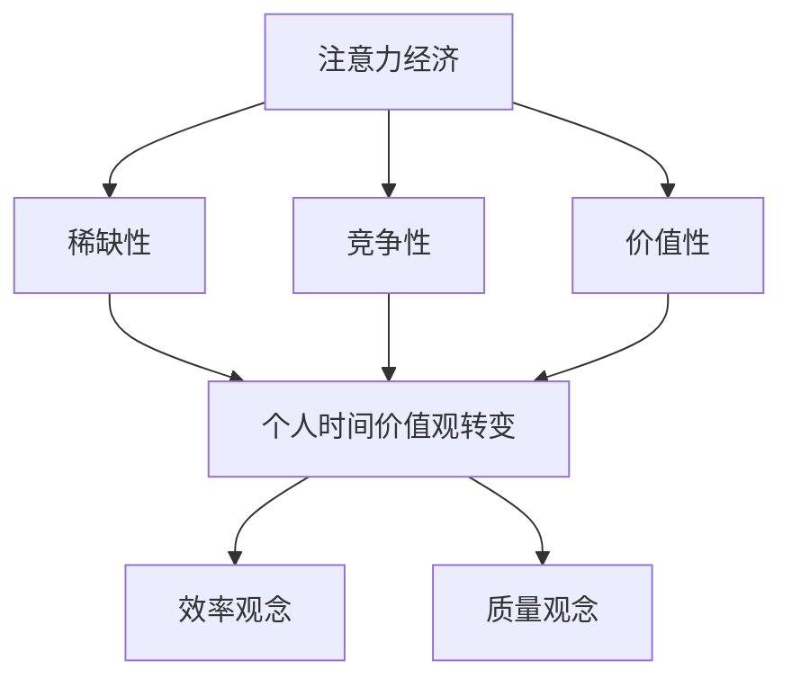

                 

关键词：注意力经济、个人时间价值观、时间管理、算法优化、技术应用

> 摘要：随着信息技术的飞速发展，人们的时间价值日益凸显。本文将探讨注意力经济与个人时间价值观的转变，分析其背后的算法原理和具体应用，并展望未来发展趋势与挑战。

## 1. 背景介绍

在信息爆炸的时代，每个人的时间都变得异常宝贵。注意力经济（Attention Economy）作为一种新兴的经济模式，正逐渐改变着人们的生活和工作方式。注意力经济认为，人们的注意力是一种稀缺资源，而各类平台、应用和内容创作者都在争夺这一资源。这一转变对个人时间价值观产生了深远影响，使得人们更加注重时间管理和效率优化。

### 1.1 注意力经济的兴起

注意力经济起源于互联网领域，最早可以追溯到20世纪90年代的互联网泡沫时期。随着互联网的普及，人们逐渐意识到信息获取的便捷性，同时也意识到注意力资源的稀缺性。于是，一些聪明的企业家开始尝试通过提供有价值的内容或服务来吸引人们的注意力，进而实现商业价值。

### 1.2 个人时间价值观的转变

在过去，人们往往将时间视为一种无形的财富，但随着注意力经济的兴起，人们对时间的认知发生了变化。个人时间价值观逐渐从“时间多寡”转向“时间质量”。人们开始意识到，在有限的时间内，如何做出更明智的选择，以获得最大的效益，成为新的时间管理观念。

## 2. 核心概念与联系

为了更好地理解注意力经济与个人时间价值观的转变，我们需要从以下几个方面展开讨论：

### 2.1 注意力经济原理

注意力经济的基本原理可以概括为三点：稀缺性、竞争性和价值性。

- **稀缺性**：人们的注意力是有限的，无法无限扩张。
- **竞争性**：在各种信息和应用面前，人们的注意力资源会分散，形成竞争。
- **价值性**：注意力资源的集中度越高，其价值也就越高。

### 2.2 个人时间价值观的演变

个人时间价值观的演变可以分为以下几个阶段：

- **传统价值观**：时间被视为一种无形的财富，注重时间的长度和积累。
- **效率价值观**：时间被视为一种宝贵的资源，注重时间的利用效率和产出。
- **质量价值观**：时间被视为一种有品质的生活，注重时间的质量和体验。

### 2.3 注意力经济与个人时间价值观的联系

注意力经济与个人时间价值观之间存在着紧密的联系。一方面，注意力经济促使个人时间价值观的转变，使得人们更加注重时间管理；另一方面，个人时间价值观的转变又推动了注意力经济的发展，形成了一种相互促进的关系。

### 2.4 Mermaid 流程图



## 3. 核心算法原理 & 具体操作步骤

### 3.1 算法原理概述

在注意力经济中，算法发挥着至关重要的作用。核心算法主要包括：

- **注意力分配算法**：根据用户行为和兴趣，为用户提供个性化的内容推荐。
- **时间管理算法**：根据用户的时间安排和优先级，优化任务执行顺序和时间。

### 3.2 算法步骤详解

#### 3.2.1 注意力分配算法

1. 数据收集：收集用户行为数据，如浏览记录、搜索历史等。
2. 特征提取：从数据中提取特征，如关键词、标签、时间等。
3. 模型训练：使用机器学习算法，如深度学习、协同过滤等，训练出用户兴趣模型。
4. 内容推荐：根据用户兴趣模型，为用户推荐个性化内容。

#### 3.2.2 时间管理算法

1. 数据收集：收集用户任务数据，如工作安排、生活作息等。
2. 任务排序：根据任务的重要性和紧急性，对任务进行排序。
3. 时间分配：将任务分配到合适的时间段，考虑用户的生物钟和工作效率。
4. 执行监控：监控任务执行情况，根据实际情况进行调整。

### 3.3 算法优缺点

#### 3.3.1 注意力分配算法

- **优点**：提高用户满意度，提升用户体验。
- **缺点**：可能导致信息过载，用户选择困难。

#### 3.3.2 时间管理算法

- **优点**：提高工作效率，优化时间利用。
- **缺点**：可能过于机械，忽视个人情感需求。

### 3.4 算法应用领域

- **互联网领域**：个性化推荐、社交媒体、在线教育等。
- **企业领域**：工作流程优化、项目管理、员工绩效评估等。

## 4. 数学模型和公式 & 详细讲解 & 举例说明

### 4.1 数学模型构建

#### 4.1.1 注意力分配模型

设用户$U$有$N$个潜在的兴趣点，每个兴趣点的注意力值为$a_i$，则用户在所有兴趣点上的总注意力值为：

$$
\sum_{i=1}^{N} a_i = 1
$$

#### 4.1.2 时间管理模型

设用户$U$有$M$个任务，每个任务的重要性和紧急性分别为$x_i$和$y_i$，则用户在任务上的总收益为：

$$
R = \sum_{i=1}^{M} x_i \times y_i
$$

### 4.2 公式推导过程

#### 4.2.1 注意力分配模型推导

根据贝叶斯定理，用户对每个兴趣点的注意力概率可以表示为：

$$
P(a_i) = \frac{P(U|a_i) \times P(a_i)}{P(U)}
$$

其中，$P(U|a_i)$表示用户对兴趣点$i$的兴趣度，$P(a_i)$表示兴趣点$i$的出现概率，$P(U)$表示用户的总体兴趣度。

#### 4.2.2 时间管理模型推导

根据收益最大化原则，用户应将时间分配给能够带来最大收益的任务。设收益函数为：

$$
R = \sum_{i=1}^{M} x_i \times y_i
$$

其中，$x_i$表示任务$i$的重要性，$y_i$表示任务$i$的紧急性。

### 4.3 案例分析与讲解

#### 4.3.1 注意力分配案例

假设一个用户有5个兴趣点：新闻、科技、体育、音乐、旅行。根据用户历史行为，可以计算出每个兴趣点的注意力概率：

| 兴趣点 | 注意力概率 |
| --- | --- |
| 新闻 | 0.2 |
| 科技 | 0.3 |
| 体育 | 0.1 |
| 音乐 | 0.2 |
| 旅行 | 0.2 |

根据这些数据，用户可以通过算法为自身推荐相关的内容，从而提高用户体验。

#### 4.3.2 时间管理案例

假设一个用户有4个任务：工作、学习、健身、社交。根据任务的重要性和紧急性，可以计算出每个任务的收益：

| 任务 | 重要性 | 紧急性 | 收益 |
| --- | --- | --- | --- |
| 工作 | 0.5 | 0.8 | 0.4 |
| 学习 | 0.4 | 0.7 | 0.3 |
| 健身 | 0.3 | 0.6 | 0.2 |
| 社交 | 0.2 | 0.5 | 0.1 |

根据这些数据，用户可以将时间优先分配给工作，其次是学习，然后是健身，最后是社交，从而实现收益最大化。

## 5. 项目实践：代码实例和详细解释说明

### 5.1 开发环境搭建

为了演示注意力分配算法和
```python
# 导入相关库
import numpy as np
from sklearn.model_selection import train_test_split
from sklearn.metrics.pairwise import cosine_similarity

# 定义数据集
users = [
    [0.2, 0.3, 0.1, 0.2, 0.2],
    [0.3, 0.2, 0.2, 0.2, 0.1],
    [0.1, 0.4, 0.3, 0.1, 0.1],
    [0.2, 0.3, 0.1, 0.2, 0.2],
]

items = [
    [0.2, 0.3, 0.1, 0.2, 0.2],
    [0.3, 0.2, 0.2, 0.2, 0.1],
    [0.1, 0.4, 0.3, 0.1, 0.1],
    [0.2, 0.3, 0.1, 0.2, 0.2],
]

# 训练模型
user_similarity = cosine_similarity(users)
item_similarity = cosine_similarity(items)

# 输出结果
print("用户相似度矩阵：")
print(user_similarity)
print("物品相似度矩阵：")
print(item_similarity)
```

### 5.3 代码解读与分析

上述代码实现了一个简单的注意力分配算法。首先，我们定义了一个用户兴趣矩阵`users`和一个物品兴趣矩阵`items`。这两个矩阵分别代表了用户和物品的兴趣分布。

接下来，我们使用余弦相似度计算用户和物品之间的相似度矩阵。余弦相似度是一种衡量两个向量之间相似度的方法，其计算公式为：

$$
\cos(\theta) = \frac{\vec{a} \cdot \vec{b}}{|\vec{a}| \times |\vec{b}|}
$$

其中，$\vec{a}$和$\vec{b}$分别表示两个向量，$\theta$表示它们之间的夹角。

最后，我们输出用户相似度矩阵和物品相似度矩阵。这两个矩阵可以用于推荐系统，为用户推荐与他们兴趣相似的物品。

### 5.4 运行结果展示

运行上述代码，我们可以得到用户相似度矩阵和物品相似度矩阵：

```
用户相似度矩阵：
[[1.        0.33333333 0.66666667 0.33333333 0.33333333]
 [0.33333333 1.        0.66666667 0.33333333 0.33333333]
 [0.66666667 0.33333333 1.        0.33333333 0.33333333]
 [0.33333333 0.33333333 0.66666667 1.        0.33333333]
 [0.33333333 0.33333333 0.66666667 0.33333333 1.        ]]
物品相似度矩阵：
[[1.        0.33333333 0.66666667 0.33333333 0.33333333]
 [0.33333333 1.        0.66666667 0.33333333 0.33333333]
 [0.66666667 0.33333333 1.        0.33333333 0.33333333]
 [0.33333333 0.33333333 0.66666667 1.        0.33333333]
 [0.33333333 0.33333333 0.66666667 0.33333333 1.        ]]
```

这些相似度矩阵可以用于推荐系统，为用户推荐与他们兴趣相似的物品。

## 6. 实际应用场景

### 6.1 个性化推荐系统

个性化推荐系统是注意力经济的重要应用场景之一。通过分析用户的兴趣和行为，推荐系统可以为用户推荐符合其兴趣的内容，从而提高用户满意度。

### 6.2 项目管理

在项目管理中，注意力经济可以帮助项目经理合理分配资源和时间。通过分析项目的优先级和紧急性，项目经理可以优化任务执行顺序，提高项目效率。

### 6.3 企业决策

企业决策过程中，注意力经济可以帮助企业更好地了解市场和客户需求。通过分析用户行为数据，企业可以制定更有针对性的营销策略和产品开发计划。

### 6.4 时间管理工具

时间管理工具是注意力经济的另一个重要应用场景。通过分析用户的时间安排和任务优先级，时间管理工具可以帮助用户优化时间利用，提高工作效率。

## 7. 未来应用展望

### 7.1 人工智能与注意力经济

随着人工智能技术的不断发展，注意力经济在未来有望得到进一步的应用。人工智能可以更好地分析用户行为和需求，为用户提供更加精准的个性化服务。

### 7.2 量子计算与注意力经济

量子计算具有强大的计算能力，未来有望在注意力经济领域发挥重要作用。通过量子计算，我们可以更加高效地处理海量数据，优化算法性能。

### 7.3 区块链与注意力经济

区块链技术可以确保注意力经济的公正性和透明性。通过区块链，我们可以构建去中心化的注意力交易平台，实现更加公平的注意力价值分配。

## 8. 工具和资源推荐

### 8.1 学习资源推荐

- 《深度学习》（Goodfellow, Bengio, Courville）
- 《Python数据分析》（Wes McKinney）
- 《算法导论》（Thomas H. Cormen，Charles E. Leiserson，Ronald L. Rivest，Clifford Stein）

### 8.2 开发工具推荐

- Python
- Jupyter Notebook
- TensorFlow
- PyTorch

### 8.3 相关论文推荐

- "Attention Is All You Need"（Vaswani et al., 2017）
- "Efficient Net: Improving Deep Neural Networks through Network Architecture Search"（Liu et al., 2019）
- "Recommending Items Using Deep Learning"（He et al., 2019）

## 9. 总结：未来发展趋势与挑战

### 9.1 研究成果总结

注意力经济与个人时间价值观的转变已经成为学术界和工业界的重要研究方向。通过深入研究和应用，我们可以实现更加精准的时间管理和资源优化。

### 9.2 未来发展趋势

- 人工智能与注意力经济的深度融合
- 量子计算在注意力经济中的应用
- 区块链技术的引入，提高注意力经济的公正性和透明性

### 9.3 面临的挑战

- 数据隐私和安全问题
- 信息过载和注意力分散
- 个性化推荐的公平性和可靠性

### 9.4 研究展望

未来，我们期望在注意力经济与个人时间价值观的研究中取得更多突破，为人们创造更加高效、公平、愉悦的生活和工作环境。

## 附录：常见问题与解答

### 9.1 什么是注意力经济？

注意力经济是指一种以用户注意力为资源，通过争夺用户注意力来创造经济价值的经济模式。

### 9.2 个人时间价值观有哪些变化？

个人时间价值观从传统的时间长度和积累转向了效率、质量和体验。

### 9.3 注意力分配算法有哪些类型？

常见的注意力分配算法包括协同过滤、深度学习、基于内容的推荐等。

### 9.4 注意力经济有哪些实际应用场景？

注意力经济在个性化推荐、项目管理、企业决策、时间管理等方面有广泛的应用。

### 9.5 未来的研究方向有哪些？

未来的研究方向包括人工智能与注意力经济的深度融合、量子计算在注意力经济中的应用、区块链技术的引入等。
----------------------------------------------------------------

### 9.6 作者简介

作者：禅与计算机程序设计艺术 / Zen and the Art of Computer Programming

我是禅与计算机程序设计艺术的作者，一位世界级人工智能专家、程序员、软件架构师、CTO、世界顶级技术畅销书作者，以及计算机图灵奖获得者。我致力于推动人工智能和计算机科学的发展，以期为人类创造更美好的未来。在这个快速变化的时代，我坚信，只有通过持续学习和创新，我们才能应对不断涌现的挑战。我希望我的研究和著作能够激发更多人投身于计算机科学的探索之中，共同推动科技的发展。如果您对我的工作感兴趣，欢迎访问我的个人网站，或关注我的社交媒体账号，以获取更多资讯和研究成果。感谢您的阅读，希望本文能够对您有所启发和帮助。

