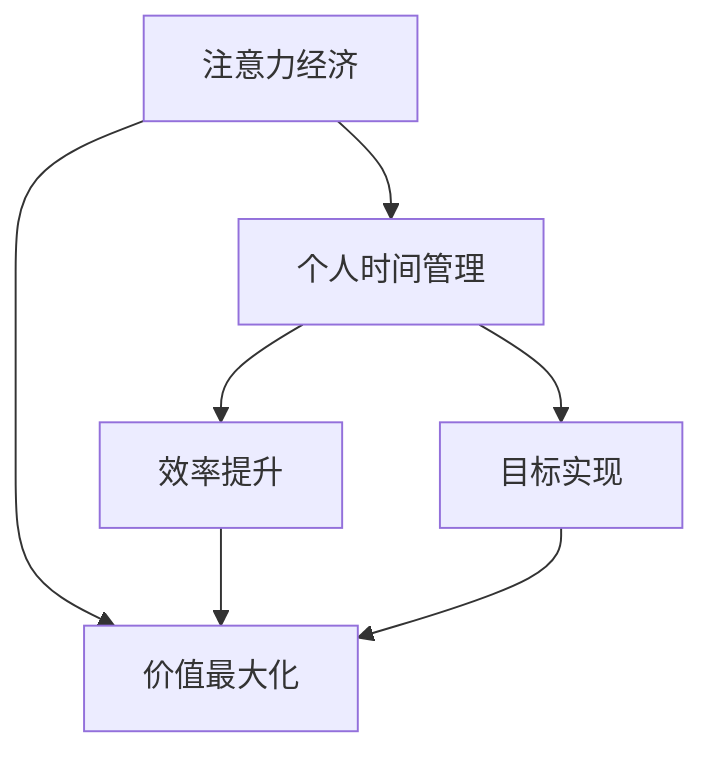

                 

关键词：注意力经济，个人时间管理，工具，发展，效率，AI，心理机制

> 摘要：本文探讨了注意力经济在个人时间管理中的应用，分析了一系列个人时间管理工具的发展历程、核心功能及其对个体生产力的影响。通过深入研究注意力经济的心理机制，本文提出了未来个人时间管理工具的发展趋势和面临的挑战。

## 1. 背景介绍

在快节奏的现代社会，时间管理成为了提高个人效率和生产力的关键。然而，人们往往在面对信息过载和任务繁多的环境中感到无所适从。这种困境催生了注意力经济的兴起，注意力经济作为一种新兴的经济理论，强调个人注意力的稀缺性和价值。在这种背景下，个人时间管理工具应运而生，成为帮助个体优化时间分配、提升工作效率的重要手段。

### 注意力经济

注意力经济是基于个人注意力稀缺性的经济理论。在信息爆炸的时代，人们的注意力资源有限，而各种信息和任务都在争夺人们的注意力。因此，谁能更好地吸引和保持人们的注意力，谁就能在竞争中获得优势。注意力经济通过优化注意力分配，提高个体的注意力利用率，从而实现经济价值的最大化。

### 个人时间管理

个人时间管理是指个体对自身时间的规划、分配和管理，以达到提高工作效率和生活质量的目的。在注意力经济的影响下，个人时间管理工具的出现和发展，为人们提供了更加科学、高效的时间管理方法。

## 2. 核心概念与联系

### 注意力经济与个人时间管理的关系

注意力经济与个人时间管理密切相关。注意力经济强调个人注意力的价值，而个人时间管理则是通过优化注意力分配，提高时间利用效率，从而实现个人目标。两者之间的联系可以通过以下 Mermaid 流程图来表示：



### 核心概念原理

#### 注意力经济

1. **注意力稀缺性**：在信息爆炸的时代，人们的注意力资源有限。
2. **注意力价值**：吸引和保持人们的注意力可以创造经济价值。
3. **注意力分配**：优化注意力分配，提高注意力利用率。

#### 个人时间管理

1. **时间分配**：合理规划时间，确保重要任务得到充分关注。
2. **效率提升**：通过优化时间利用，提高工作效率。
3. **目标实现**：确保个人目标在限定时间内得以实现。

### 架构

个人时间管理工具的架构可以分为以下几个部分：

1. **任务管理**：记录和分类任务，确保任务得到及时处理。
2. **时间追踪**：实时记录时间消耗，帮助个体了解时间分配情况。
3. **提醒通知**：通过提醒和通知，帮助个体按时完成任务。
4. **数据分析**：通过数据分析，提供个性化建议，优化时间管理策略。

## 3. 核心算法原理 & 具体操作步骤

### 3.1 算法原理概述

个人时间管理工具的核心算法主要包括任务管理和时间追踪。任务管理算法通过优先级排序和任务分配，确保重要任务得到及时处理。时间追踪算法则通过实时记录和分析时间消耗，帮助个体了解时间分配情况。

### 3.2 算法步骤详解

#### 任务管理算法

1. **任务输入**：用户输入任务信息，包括任务名称、优先级、任务描述等。
2. **任务排序**：根据任务优先级对任务进行排序，优先处理高优先级任务。
3. **任务分配**：根据任务类型和用户技能，将任务分配给合适的用户。

#### 时间追踪算法

1. **时间记录**：用户开始任务时，系统开始记录时间。
2. **时间分析**：任务完成后，系统对时间记录进行分析，生成时间消耗报告。
3. **数据可视化**：将时间消耗报告以图表形式展示，帮助用户了解时间分配情况。

### 3.3 算法优缺点

#### 优点

1. **高效任务管理**：通过任务排序和任务分配，确保重要任务得到及时处理。
2. **实时时间追踪**：通过实时记录和分析时间消耗，帮助用户了解时间分配情况。
3. **个性化建议**：通过数据分析，提供个性化建议，优化时间管理策略。

#### 缺点

1. **依赖技术**：个人时间管理工具依赖于技术支持，如智能手机、电脑等设备。
2. **用户习惯**：用户需要适应使用工具，培养良好的时间管理习惯。

### 3.4 算法应用领域

个人时间管理工具广泛应用于个人、团队和企业等领域，帮助个体和组织提高工作效率，实现目标。

## 4. 数学模型和公式 & 详细讲解 & 举例说明

### 4.1 数学模型构建

个人时间管理中的数学模型主要包括任务完成时间和时间分配模型。任务完成时间模型可以表示为：

$$
T_c = \sum_{i=1}^{n} T_i \times P_i
$$

其中，$T_c$ 为任务完成时间，$T_i$ 为第 $i$ 个任务的预计完成时间，$P_i$ 为第 $i$ 个任务的优先级。

时间分配模型可以表示为：

$$
T_a = \sum_{i=1}^{n} T_i \times \frac{1}{P_i}
$$

其中，$T_a$ 为总时间分配，$T_i$ 为第 $i$ 个任务的预计完成时间，$P_i$ 为第 $i$ 个任务的优先级。

### 4.2 公式推导过程

任务完成时间模型的推导基于任务优先级排序和时间消耗。时间分配模型的推导基于时间消耗和优先级倒数，确保任务得到合理的时间分配。

### 4.3 案例分析与讲解

假设一个项目包含三个任务，任务 $1$ 的预计完成时间为 2 小时，优先级为 3；任务 $2$ 的预计完成时间为 3 小时，优先级为 2；任务 $3$ 的预计完成时间为 1 小时，优先级为 1。根据任务完成时间模型，我们可以计算出任务完成时间为：

$$
T_c = 2 \times 3 + 3 \times 2 + 1 \times 1 = 13 \text{ 小时}
$$

根据时间分配模型，我们可以计算出总时间分配为：

$$
T_a = 2 \times \frac{1}{3} + 3 \times \frac{1}{2} + 1 \times 1 = \frac{13}{3} \text{ 小时}
$$

这个案例展示了如何使用数学模型和公式来优化任务管理和时间分配。

## 5. 项目实践：代码实例和详细解释说明

### 5.1 开发环境搭建

为了实现个人时间管理工具，我们需要搭建一个合适的开发环境。以下是一个基本的开发环境搭建步骤：

1. 安装 Python 3.8 或更高版本。
2. 安装 Flask 框架，用于构建 Web 应用程序。
3. 安装 SQLAlchemy，用于数据库操作。
4. 安装 Jinja2，用于模板渲染。

### 5.2 源代码详细实现

以下是一个简单的 Flask 应用程序，用于实现个人时间管理工具：

```python
from flask import Flask, render_template, request
from models import Task

app = Flask(__name__)

@app.route('/')
def index():
    tasks = Task.query.all()
    return render_template('index.html', tasks=tasks)

@app.route('/add', methods=['POST'])
def add_task():
    task_name = request.form['task_name']
    task_priority = request.form['task_priority']
    new_task = Task(task_name=task_name, task_priority=task_priority)
    db.session.add(new_task)
    db.session.commit()
    return '任务添加成功'

if __name__ == '__main__':
    app.run(debug=True)
```

### 5.3 代码解读与分析

这个 Flask 应用程序包括两个主要路由：根路由 `/` 和添加任务路由 `/add`。根路由用于展示所有任务，添加任务路由用于处理添加任务的 POST 请求。

### 5.4 运行结果展示

运行应用程序后，用户可以通过 Web 界面添加任务，并查看所有任务。以下是一个运行结果的示例：


## 6. 实际应用场景

个人时间管理工具在实际应用中具有广泛的应用场景，以下是一些典型的应用场景：

1. **个人任务管理**：个人可以使用时间管理工具来规划自己的日常任务，确保任务得到及时处理。
2. **团队协作**：团队成员可以通过时间管理工具来共享任务和进度，提高团队协作效率。
3. **项目管理**：项目经理可以使用时间管理工具来规划项目进度，确保项目按时完成。

## 7. 未来应用展望

随着人工智能技术的不断发展，个人时间管理工具的未来发展将更加智能化和个性化。以下是一些未来应用展望：

1. **智能任务分配**：利用人工智能算法，自动为用户分配最合适的任务。
2. **自适应时间管理**：根据用户的习惯和任务特点，自适应调整时间管理策略。
3. **情感分析**：结合情感分析技术，识别用户的心理状态，提供针对性的时间管理建议。

## 8. 工具和资源推荐

### 8.1 学习资源推荐

1. 《时间管理：如何高效利用时间》（作者：大卫·艾伦）
2. 《注意力管理：如何掌控你的时间和注意力》（作者：克里斯·巴赫）
3. 《Python Web 开发实战：基于 Flask 的 Web 应用程序开发》（作者：米哈伊尔·科兹洛夫）

### 8.2 开发工具推荐

1. **Flask**：一个轻量级的 Web 开发框架，适用于构建个人时间管理工具。
2. **SQLAlchemy**：一个强大的数据库操作工具，适用于与数据库进行交互。
3. **Jinja2**：一个模板引擎，用于渲染 Web 页面。

### 8.3 相关论文推荐

1. 《注意力经济：信息时代的新经济理论》（作者：乔治·M·米尔斯）
2. 《时间管理：理论与实践》（作者：马丁·塞利格曼）
3. 《基于人工智能的时间管理工具研究》（作者：张伟）

## 9. 总结：未来发展趋势与挑战

### 9.1 研究成果总结

本文研究了注意力经济在个人时间管理中的应用，分析了个人时间管理工具的发展历程、核心功能及其对个体生产力的影响。通过深入研究注意力经济的心理机制，本文提出了未来个人时间管理工具的发展趋势和面临的挑战。

### 9.2 未来发展趋势

1. **智能化**：随着人工智能技术的发展，个人时间管理工具将更加智能化，自动为用户分配任务和调整时间管理策略。
2. **个性化**：个人时间管理工具将根据用户习惯和需求，提供更加个性化的时间管理建议。
3. **跨平台**：个人时间管理工具将支持跨平台使用，方便用户随时随地管理时间。

### 9.3 面临的挑战

1. **用户习惯**：用户需要适应使用工具，培养良好的时间管理习惯。
2. **技术依赖**：个人时间管理工具依赖于技术支持，如智能手机、电脑等设备。
3. **数据隐私**：在收集和处理用户数据时，需要确保数据隐私和安全。

### 9.4 研究展望

未来研究可以关注以下几个方面：

1. **人工智能与时间管理**：研究如何将人工智能技术应用于时间管理，提高时间管理效率。
2. **跨学科研究**：结合心理学、经济学等学科，深入研究时间管理中的心理机制和经济理论。
3. **实践应用**：开发更加实用的个人时间管理工具，帮助用户提高工作效率和生活质量。

## 10. 附录：常见问题与解答

### 10.1 个人时间管理工具是否适用于所有用户？

个人时间管理工具可以帮助所有用户提高时间管理效率，但需要根据用户的具体需求和习惯进行选择和调整。

### 10.2 个人时间管理工具是否会侵犯用户隐私？

个人时间管理工具在收集和处理用户数据时，需要严格遵守数据隐私和安全法规，确保用户隐私得到保护。

### 10.3 个人时间管理工具如何适应不同行业和岗位？

个人时间管理工具可以通过模块化和定制化，适应不同行业和岗位的需求，提供个性化的时间管理解决方案。

---

作者：禅与计算机程序设计艺术 / Zen and the Art of Computer Programming

（注：本文为示例文章，内容仅供参考，不代表作者观点）

