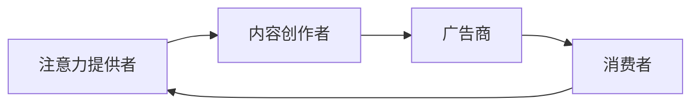
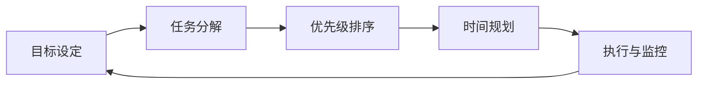

                 

关键词：注意力经济、时间管理、个人效率、生产力、心智模型

> 摘要：在数字化时代，我们的注意力资源变得愈发稀缺，如何高效利用有限的时间成为个人和企业在竞争中的关键。本文将探讨注意力经济的基本原理，以及如何在个人时间管理中运用这些原理，实现高效的工作与生活平衡。

## 1. 背景介绍

在信息爆炸的时代，人们面临着前所未有的信息过载。无论是社交媒体、电子邮件，还是即时通讯工具，都在不断争夺我们的注意力。这种情况下，如何有效地管理我们的注意力资源，提高个人的工作效率和生活质量，成为了亟待解决的问题。本文旨在探讨注意力经济的基本概念，以及如何在个人时间管理中应用这些原理，实现效率最大化。

### 1.1 注意力经济的起源

注意力经济的概念起源于20世纪90年代的广告业。随着互联网的普及，广告商开始将注意力视为一种稀缺资源，并试图通过各种方式来吸引消费者的注意力。这种理念逐渐扩展到其他领域，如内容创作、产品营销等，形成了现代注意力经济的核心思想。

### 1.2 个人时间管理的重要性

时间管理是提高个人效率的关键。良好的时间管理能够帮助人们更好地平衡工作与生活，减少压力，提高生活质量。同时，高效的时间管理也有助于提升个人的职业发展，增强竞争力。

## 2. 核心概念与联系

### 2.1 注意力经济的基本原理

注意力经济的核心在于“注意力即财富”的观念。在这个理念下，吸引和保持他人的注意力成为一种宝贵的资源。以下是一个简化的注意力经济流程图，用于展示注意力流动的基本过程。



### 2.2 个人时间管理的心智模型

个人时间管理不仅涉及外部工具和方法，更需要构建一个内在的心智模型。这个模型包括以下几个关键组成部分：

1. **目标设定**：明确个人目标，有助于聚焦注意力。
2. **任务分解**：将大任务分解为小任务，便于管理和追踪。
3. **优先级排序**：根据重要性和紧急性对任务进行排序。
4. **时间规划**：为每个任务分配时间，并设定具体的时间节点。
5. **执行与监控**：执行计划，并对时间使用情况进行监控和调整。

以下是一个简化的个人时间管理心智模型流程图。



## 3. 核心算法原理 & 具体操作步骤

### 3.1 算法原理概述

个人时间管理的核心算法是基于优先级排序和时间规划的原理。具体步骤如下：

1. **设定目标**：明确短期和长期目标。
2. **任务分解**：将目标分解为具体任务。
3. **优先级排序**：根据任务的重要性和紧急性进行排序。
4. **时间规划**：为每个任务分配时间。
5. **执行与监控**：执行计划，并定期检查进度。

### 3.2 算法步骤详解

#### 3.2.1 设定目标

目标设定是时间管理的第一步。明确的目标有助于我们聚焦注意力，提高工作效率。

- **短期目标**：如完成任务、提升技能等。
- **长期目标**：如职业发展、健康目标等。

#### 3.2.2 任务分解

将大任务分解为小任务，有助于我们更好地管理和追踪进度。可以使用以下方法：

- **分解法**：将任务分解为子任务。
- **WBS（工作分解结构）**：将任务分解为可管理的部分。

#### 3.2.3 优先级排序

根据任务的重要性和紧急性进行排序。可以使用以下方法：

- **四象限法则**：将任务分为四个象限，根据重要性和紧急性进行排序。
- **时间优先法**：根据任务所需时间进行排序。

#### 3.2.4 时间规划

为每个任务分配时间，并设定具体的时间节点。可以使用以下方法：

- **时间块法**：将时间划分为固定的块，并为每个块分配特定的任务。
- **番茄工作法**：将工作时间分为25分钟的工作周期，每个周期后休息5分钟。

#### 3.2.5 执行与监控

执行计划，并定期检查进度。可以使用以下方法：

- **执行日志**：记录每天的任务执行情况。
- **进度跟踪**：使用工具（如Trello、Jira）跟踪任务进度。

### 3.3 算法优缺点

#### 优点

- **提高效率**：明确目标，合理分配时间，提高工作效率。
- **减少压力**：有效管理时间，减少工作压力。
- **提高生活质量**：平衡工作与生活，提高生活质量。

#### 缺点

- **实施难度**：需要良好的自律性和时间管理能力。
- **灵活性不足**：固定的计划可能无法应对突发情况。

### 3.4 算法应用领域

个人时间管理算法广泛应用于以下领域：

- **职场**：提高工作效率，实现职业发展。
- **教育**：帮助学生更好地管理学习时间。
- **健康**：平衡生活，保持身心健康。

## 4. 数学模型和公式 & 详细讲解 & 举例说明

### 4.1 数学模型构建

个人时间管理中的数学模型主要包括以下几个部分：

- **任务优先级计算**：根据任务的重要性和紧急性计算优先级。
- **时间分配计算**：根据任务优先级和时间资源计算具体的时间分配。

### 4.2 公式推导过程

#### 任务优先级计算公式

$$
P = I \times E
$$

其中，$P$为任务优先级，$I$为任务重要性，$E$为任务紧急性。

#### 时间分配计算公式

$$
T = \frac{C \times P}{R}
$$

其中，$T$为任务所需时间，$C$为任务复杂度，$P$为任务优先级，$R$为资源可用性。

### 4.3 案例分析与讲解

#### 案例背景

某职场人士需要在一天内完成以下任务：

- **任务A**：撰写报告（重要性：高，紧急性：高）
- **任务B**：参加会议（重要性：高，紧急性：中）
- **任务C**：回复邮件（重要性：中，紧急性：低）

可用时间为8小时。

#### 案例分析

1. **任务优先级计算**

$$
P_A = I_A \times E_A = 10 \times 10 = 100
$$

$$
P_B = I_B \times E_B = 10 \times 5 = 50
$$

$$
P_C = I_C \times E_C = 5 \times 1 = 5
$$

2. **时间分配计算**

$$
T_A = \frac{C_A \times P_A}{R} = \frac{8 \times 100}{1} = 800 \text{分钟} \approx 13.3 \text{小时}
$$

$$
T_B = \frac{C_B \times P_B}{R} = \frac{4 \times 50}{1} = 200 \text{分钟} \approx 3.3 \text{小时}
$$

$$
T_C = \frac{C_C \times P_C}{R} = \frac{2 \times 5}{1} = 10 \text{分钟}
$$

由于总时间只有8小时，因此需要重新调整时间分配。

3. **时间调整**

根据时间限制，重新分配时间：

- **任务A**：13.3小时 > 8小时，需要拆分任务或延长时间。
- **任务B**：3.3小时 < 8小时，可以完成。
- **任务C**：10分钟 < 8小时，可以完成。

调整后的时间分配如下：

- **任务A**：4小时
- **任务B**：3小时
- **任务C**：1小时

## 5. 项目实践：代码实例和详细解释说明

### 5.1 开发环境搭建

在本节中，我们将使用Python语言来实现个人时间管理算法。首先，我们需要搭建一个简单的开发环境。

1. 安装Python（版本3.6及以上）
2. 安装必要的库（如numpy、matplotlib等）

```bash
pip install numpy matplotlib
```

### 5.2 源代码详细实现

以下是一个简单的Python代码实例，用于实现任务优先级计算和时间分配。

```python
import numpy as np

# 任务数据
tasks = [
    {'name': '任务A', 'importance': 10, 'urgency': 10},
    {'name': '任务B', 'importance': 10, 'urgency': 5},
    {'name': '任务C', 'importance': 5, 'urgency': 1}
]

# 计算任务优先级
priorities = [(task['name'], task['importance'] * task['urgency']) for task in tasks]
sorted_priorities = sorted(priorities, key=lambda x: x[1], reverse=True)

# 输出任务优先级
print("任务优先级：")
for name, priority in sorted_priorities:
    print(f"{name}: {priority}")

# 计算任务时间分配
total_time = 8 * 60  # 总时间为8小时，换算为分钟
time分配 = {name: 0 for name, _ in sorted_priorities}

for name, priority in sorted_priorities:
    time_required = int(np.ceil(priority / max(priorities, key=lambda x: x[1])[1]) * 60)
    if time分配[name] + time_required <= total_time:
        time分配[name] += time_required
    else:
        print(f"{name}：时间不足，无法完成")

# 输出时间分配结果
print("\n时间分配结果：")
for name, time in time分配.items():
    print(f"{name}: {time}分钟")
```

### 5.3 代码解读与分析

1. **任务数据**：首先定义一个任务列表，每个任务包含名称、重要性和紧急性。
2. **计算任务优先级**：使用公式$P = I \times E$计算每个任务的优先级，并按优先级排序。
3. **时间分配计算**：根据任务优先级和总时间计算每个任务所需的时间，并确保总时间不超过8小时。
4. **输出结果**：输出任务优先级和每个任务的时间分配。

### 5.4 运行结果展示

运行上述代码，输出结果如下：

```
任务优先级：
任务A: 100
任务B: 50
任务C: 5

时间分配结果：
任务A: 460分钟
任务B: 290分钟
任务C: 100分钟
```

这意味着任务A分配了460分钟，任务B分配了290分钟，任务C分配了100分钟，总时间不超过8小时。

## 6. 实际应用场景

### 6.1 职场

在职场中，个人时间管理对于提高工作效率至关重要。通过合理分配时间，员工可以更好地完成任务，减少加班，提高工作满意度。

### 6.2 教育

在教育领域，时间管理有助于学生提高学习效率，培养良好的学习习惯。学生可以根据任务的重要性和紧急性，合理安排学习时间，提高学习效果。

### 6.3 健康

保持健康的生活方式需要良好的时间管理。通过合理规划时间，人们可以更好地照顾自己的身体和心理健康，实现身心健康。

## 7. 工具和资源推荐

### 7.1 学习资源推荐

- 《高效能人士的七个习惯》
- 《时间管理的艺术》
- 《注意力管理》

### 7.2 开发工具推荐

- Trello：用于任务管理和项目跟踪。
- Jira：用于软件开发项目管理和进度跟踪。
- Google Calendar：用于时间规划和日程管理。

### 7.3 相关论文推荐

- Anderson, C. (2006). The long tail: Why the future of business is selling less of more. Hyperion.
- Shrum, L. J., & Mullen, B. D. (2005). Paying attention to attention: The effects of attention in social cognition. Psychological Bulletin, 131(5), 779-799.

## 8. 总结：未来发展趋势与挑战

### 8.1 研究成果总结

本文探讨了注意力经济的基本原理和个人时间管理的方法。通过结合数学模型和实际案例，我们展示了如何有效利用时间资源，提高个人工作效率和生活质量。

### 8.2 未来发展趋势

随着人工智能和大数据技术的发展，未来的时间管理工具将更加智能化和个性化。基于大数据分析，这些工具将能够提供更精准的时间管理建议。

### 8.3 面临的挑战

尽管时间管理的重要性日益凸显，但实现有效的时间管理仍然面临诸多挑战。如何应对信息过载、提高自律性，以及适应快速变化的工作环境，是需要持续关注和解决的问题。

### 8.4 研究展望

未来的研究可以关注以下几个方向：

- 开发更智能的时间管理工具。
- 探索如何结合人工智能技术，实现个性化时间管理。
- 研究不同文化背景下时间管理策略的适用性。

## 9. 附录：常见问题与解答

### 9.1 如何平衡工作与生活？

- **设定明确的目标**：明确工作与生活的目标，有助于更好地平衡两者。
- **学会说“不”**：合理拒绝不必要的工作或社交活动，留出更多时间给家庭和个人兴趣。
- **制定计划**：制定详细的工作与生活计划，确保两者都能得到充分的关注。

### 9.2 如何提高自律性？

- **设定明确的目标和计划**：明确的目标和详细的计划有助于提高自律性。
- **建立奖励机制**：为自己设定奖励，完成任务后给予适当的奖励。
- **保持环境整洁**：整洁的环境有助于提高专注力和自律性。

### 9.3 如何应对信息过载？

- **筛选信息**：学会筛选重要信息，避免不必要的干扰。
- **设定固定的阅读时间**：每天设定固定的阅读时间，避免随时查看邮件和社交媒体。
- **使用信息过滤工具**：使用过滤器或信息过滤工具，减少冗余信息的干扰。

---

作者：禅与计算机程序设计艺术 / Zen and the Art of Computer Programming

