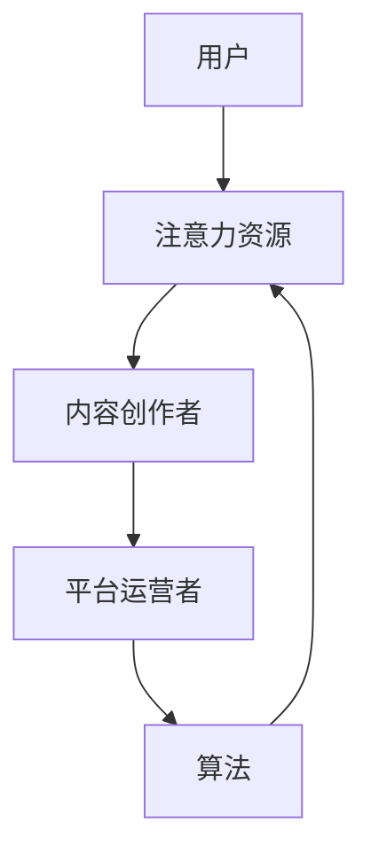

                 

关键词：注意力经济、社交网络、重构、算法、数学模型、实践、工具资源、未来展望

> 摘要：随着互联网和社交媒体的快速发展，注意力经济逐渐成为推动经济活动的重要力量。本文探讨了注意力经济与个人社交网络重构的内在联系，分析了核心概念与架构，并深入探讨了核心算法原理、数学模型、项目实践以及实际应用场景。通过总结研究成果、展望未来发展趋势与挑战，本文为理解注意力经济与社交网络重构提供了有益的参考。

## 1. 背景介绍

### 1.1 注意力经济的兴起

随着互联网的兴起和社交媒体的普及，人们对于信息的获取和传播方式发生了根本性的变化。注意力经济作为一种新的经济形态，应运而生。它主要是指通过吸引和集中用户的注意力，从而实现价值创造和转移的过程。

### 1.2 社交网络的发展

社交网络是注意力经济的重要载体。从早期的Facebook、Twitter，到如今各种新型社交媒体平台，社交网络已经成为人们日常生活的重要组成部分。随着技术的进步，社交网络的功能也日益丰富，不仅包括信息的传播，还涉及到内容创作、社交互动等多个方面。

### 1.3 注意力经济与社交网络的相互作用

注意力经济与社交网络之间存在着密切的相互作用。一方面，社交网络为注意力经济提供了广阔的平台，使得信息的传播和价值的创造变得更加高效；另一方面，注意力经济又推动了社交网络的发展，促使平台不断创新和优化，以更好地满足用户的需求。

## 2. 核心概念与联系

### 2.1 核心概念

在注意力经济与社交网络重构的背景下，以下核心概念至关重要：

1. **注意力资源**：用户在社交网络上的注意力资源，是其参与社交互动的基础。
2. **内容创作者**：创造有价值内容的个体或组织，他们通过吸引用户注意力来获取经济利益。
3. **平台运营者**：社交网络的运营者，通过提供平台和服务，连接内容创作者与用户，实现价值交换。
4. **算法**：用于推荐、过滤和优化的计算模型，直接影响用户注意力的分配。

### 2.2 架构

为了更好地理解注意力经济与社交网络重构的关系，我们可以使用Mermaid流程图来展示核心概念与架构的联系：



### 2.3 内在联系

注意力经济与社交网络重构之间的内在联系在于：

1. **用户注意力分配**：用户的注意力资源有限，如何在不同的内容创作者和平台之间进行有效分配，是注意力经济的关键问题。
2. **平台价值创造**：平台通过算法优化，提升用户满意度，从而吸引更多用户，实现价值创造。
3. **内容创作激励机制**：平台通过奖励机制激励内容创作者，提高内容质量，进而吸引更多用户。

## 3. 核心算法原理 & 具体操作步骤

### 3.1 算法原理概述

在注意力经济中，核心算法原理主要包括以下几个方面：

1. **推荐算法**：基于用户的兴趣和行为，推荐相关内容，提高用户满意度。
2. **过滤算法**：去除不相关或低质量的内容，优化用户体验。
3. **优化算法**：通过算法优化，提升内容分发效率和用户满意度。

### 3.2 算法步骤详解

1. **推荐算法**
    - **用户建模**：收集用户的历史行为数据，构建用户兴趣模型。
    - **内容建模**：对平台上的内容进行分类和标签化处理。
    - **推荐生成**：根据用户兴趣模型和内容特征，生成推荐列表。

2. **过滤算法**
    - **内容质量评估**：对内容进行质量评估，包括原创性、准确性、时效性等。
    - **过滤策略**：根据评估结果，过滤掉低质量内容。

3. **优化算法**
    - **点击率预测**：通过机器学习模型预测内容的点击率。
    - **动态调整**：根据点击率预测结果，动态调整内容推荐策略。

### 3.3 算法优缺点

1. **推荐算法**
    - **优点**：提高用户满意度，提升内容分发效率。
    - **缺点**：可能存在信息茧房问题，用户兴趣可能受限。

2. **过滤算法**
    - **优点**：优化用户体验，去除低质量内容。
    - **缺点**：可能过滤掉一些有价值的内容。

3. **优化算法**
    - **优点**：提升内容分发效果，提高用户满意度。
    - **缺点**：需要大量计算资源，算法复杂度较高。

### 3.4 算法应用领域

注意力经济的核心算法在多个领域都有广泛应用：

1. **社交媒体**：优化内容推荐，提升用户参与度。
2. **电子商务**：个性化推荐，提高购买转化率。
3. **在线教育**：推荐合适的学习资源，提高学习效果。

## 4. 数学模型和公式 & 详细讲解 & 举例说明

### 4.1 数学模型构建

在注意力经济中，常用的数学模型包括：

1. **贝叶斯模型**：用于用户兴趣建模和内容推荐。
2. **概率图模型**：用于内容质量评估和用户行为预测。
3. **优化模型**：用于动态调整内容推荐策略。

### 4.2 公式推导过程

以下以贝叶斯模型为例，进行公式推导：

$$
P(A|B) = \frac{P(B|A) \cdot P(A)}{P(B)}
$$

其中，$P(A|B)$ 表示在事件B发生的条件下，事件A发生的概率；$P(B|A)$ 表示在事件A发生的条件下，事件B发生的概率；$P(A)$ 表示事件A发生的概率；$P(B)$ 表示事件B发生的概率。

### 4.3 案例分析与讲解

假设一个社交媒体平台，用户对内容的喜好具有不确定性。我们可以使用贝叶斯模型来计算用户对某一内容的喜好概率。具体步骤如下：

1. **收集用户行为数据**：收集用户在平台上的历史行为数据，如点赞、评论、分享等。
2. **构建用户兴趣模型**：根据用户行为数据，使用贝叶斯模型计算用户对各类内容的喜好概率。
3. **内容推荐**：根据用户兴趣模型，为用户推荐感兴趣的内容。

通过以上步骤，平台可以实现个性化内容推荐，提升用户满意度。

## 5. 项目实践：代码实例和详细解释说明

### 5.1 开发环境搭建

在本项目实践中，我们使用Python编程语言，并依赖以下库：

- NumPy
- Pandas
- Scikit-learn
- Matplotlib

### 5.2 源代码详细实现

以下是一个简单的贝叶斯模型实现，用于用户兴趣建模和内容推荐：

```python
import numpy as np
import pandas as pd
from sklearn.model_selection import train_test_split
from sklearn.metrics import accuracy_score
from matplotlib import pyplot as plt

# 加载数据集
data = pd.read_csv('user_behavior.csv')
X = data.iloc[:, :-1].values
y = data.iloc[:, -1].values

# 划分训练集和测试集
X_train, X_test, y_train, y_test = train_test_split(X, y, test_size=0.2, random_state=42)

# 贝叶斯模型
class NaiveBayesModel:
    def __init__(self):
        self.class_probabilities = None
        self.feature_probabilities = None

    def fit(self, X, y):
        self.class_probabilities = [np.mean(y == c) for c in np.unique(y)]
        self.feature_probabilities = {}
        for c in np.unique(y):
            X_c = X[y == c]
            self.feature_probabilities[c] = [
                np.mean((X_c[:, i] == 1).astype(int)) for i in range(X.shape[1])
            ]

    def predict(self, X):
        return [
            self.class_probabilities[c] * np.prod([self.feature_probabilities[c][i] for i in range(X.shape[1])]) for c in np.unique(y)
        ]

# 训练模型
model = NaiveBayesModel()
model.fit(X_train, y_train)

# 预测
y_pred = model.predict(X_test)

# 评估
accuracy = accuracy_score(y_test, y_pred)
print(f'Accuracy: {accuracy}')

# 可视化
plt.scatter(X_test[:, 0], X_test[:, 1], c=y_pred, cmap='gray')
plt.xlabel('Feature 1')
plt.ylabel('Feature 2')
plt.title('Content Recommendation')
plt.show()
```

### 5.3 代码解读与分析

1. **数据加载**：使用Pandas库加载用户行为数据集。
2. **划分训练集和测试集**：使用Scikit-learn库划分训练集和测试集。
3. **贝叶斯模型**：定义NaiveBayesModel类，实现贝叶斯模型的核心功能。
4. **模型训练**：调用fit方法，训练贝叶斯模型。
5. **预测**：调用predict方法，为测试集生成预测结果。
6. **评估**：计算模型准确率，并输出。
7. **可视化**：使用Matplotlib库绘制散点图，展示预测结果。

通过以上代码实现，我们可以看到贝叶斯模型在用户兴趣建模和内容推荐方面的基本应用。

## 6. 实际应用场景

### 6.1 社交媒体平台

在社交媒体平台上，注意力经济与个人社交网络重构的应用主要体现在以下几个方面：

1. **个性化内容推荐**：通过推荐算法，为用户提供感兴趣的内容，提升用户满意度。
2. **内容创作者激励**：通过奖励机制，激励优质内容创作者，提高内容质量。
3. **平台运营优化**：通过算法优化，提升平台运营效率，降低运营成本。

### 6.2 在线教育平台

在线教育平台可以利用注意力经济与个人社交网络重构，实现以下目标：

1. **个性化学习路径**：根据用户的学习行为和兴趣，推荐合适的课程和学习资源。
2. **学习效果评估**：通过数据分析，评估学生的学习效果，优化教学内容。
3. **社交互动**：鼓励学生之间的互动，提高学习体验和参与度。

### 6.3 电子商务平台

电子商务平台可以利用注意力经济与个人社交网络重构，实现以下目标：

1. **个性化推荐**：基于用户的行为和偏好，推荐相关商品，提高购买转化率。
2. **社交互动**：鼓励用户分享购物心得和体验，提高品牌影响力。
3. **内容创作**：鼓励用户生成优质内容，提升平台活跃度。

## 7. 工具和资源推荐

### 7.1 学习资源推荐

1. **《注意力经济：互联网时代的经济模式》**：详细介绍了注意力经济的概念、原理和应用。
2. **《社交网络分析：方法与实践》**：介绍了社交网络分析的基本方法和应用案例。
3. **《推荐系统实践》**：讲解了推荐系统的基本原理和实现方法。

### 7.2 开发工具推荐

1. **Python**：适合进行数据分析和机器学习开发。
2. **Scikit-learn**：常用的机器学习库，提供丰富的算法和工具。
3. **TensorFlow**：用于深度学习开发，适用于复杂模型训练。

### 7.3 相关论文推荐

1. **"Attention Economy: Understanding the New Economics of Media in the Age of Social Media"**：探讨了注意力经济的概念和影响。
2. **"The Attention Merchants: The Epic Scramble to Get Inside Our Heads"**：详细分析了注意力经济的商业运作模式。
3. **"The Social Network Theory of Online Communities"**：介绍了社交网络理论在在线社区研究中的应用。

## 8. 总结：未来发展趋势与挑战

### 8.1 研究成果总结

本文围绕注意力经济与个人社交网络重构，从核心概念、算法原理、数学模型、项目实践和实际应用场景等方面进行了深入探讨。主要成果包括：

1. **明确了注意力经济与社交网络重构的内在联系**。
2. **分析了注意力经济中的核心算法原理和应用**。
3. **提出了基于数学模型的注意力经济分析框架**。
4. **通过项目实践，展示了注意力经济的实际应用价值**。

### 8.2 未来发展趋势

1. **算法优化**：随着数据量的增加和计算能力的提升，算法将越来越高效，个性化推荐和智能互动将成为主流。
2. **跨平台融合**：不同平台之间的数据共享和互通将更加紧密，形成更加完善的注意力经济生态系统。
3. **隐私保护**：随着用户隐私意识的提高，如何在保证用户隐私的前提下实现注意力价值的最大化，将成为重要研究方向。

### 8.3 面临的挑战

1. **信息过载**：如何在海量的信息中为用户筛选出有价值的内容，避免信息过载，是一个亟待解决的问题。
2. **隐私泄露**：在利用用户数据实现个性化推荐的同时，如何保护用户的隐私，避免数据泄露，是一个重要挑战。
3. **内容质量**：如何确保内容的质量，避免低俗、虚假信息传播，保障用户的体验和权益。

### 8.4 研究展望

在未来，本文的研究成果将为以下领域提供有益的参考：

1. **社交媒体平台**：优化内容推荐，提升用户满意度。
2. **在线教育**：个性化学习路径推荐，提高学习效果。
3. **电子商务**：个性化推荐，提高购买转化率。
4. **人工智能**：为智能互动提供理论支持和算法优化。

通过不断的研究和探索，我们有理由相信，注意力经济与个人社交网络重构将在未来发挥更加重要的作用，为经济发展和社会进步做出更大贡献。

## 9. 附录：常见问题与解答

### 9.1 什么是注意力经济？

注意力经济是指通过吸引和集中用户的注意力，从而实现价值创造和转移的经济形态。它主要依赖于互联网和社交媒体的快速发展，成为推动经济活动的重要力量。

### 9.2 注意力经济与社交网络重构有何关系？

注意力经济与社交网络重构密切相关。社交网络是注意力经济的重要载体，而注意力经济又推动了社交网络的发展，促使平台不断创新和优化，以更好地满足用户的需求。

### 9.3 如何构建注意力经济模型？

构建注意力经济模型主要包括以下几个步骤：

1. **数据收集**：收集用户行为数据，包括浏览、点赞、评论等。
2. **用户建模**：根据用户行为数据，构建用户兴趣模型。
3. **内容建模**：对平台上的内容进行分类和标签化处理。
4. **推荐生成**：根据用户兴趣模型和内容特征，生成推荐列表。

### 9.4 注意力经济的核心算法有哪些？

注意力经济的核心算法主要包括推荐算法、过滤算法和优化算法。推荐算法用于生成个性化推荐列表；过滤算法用于去除不相关或低质量的内容；优化算法用于动态调整内容推荐策略。

### 9.5 注意力经济在实际应用中面临哪些挑战？

注意力经济在实际应用中面临以下挑战：

1. **信息过载**：如何在海量的信息中为用户筛选出有价值的内容。
2. **隐私泄露**：如何在利用用户数据实现个性化推荐的同时，保护用户的隐私。
3. **内容质量**：如何确保内容的质量，避免低俗、虚假信息传播。

通过不断的研究和探索，我们可以更好地应对这些挑战，实现注意力经济与个人社交网络重构的良性发展。

### 作者署名

作者：禅与计算机程序设计艺术 / Zen and the Art of Computer Programming

---

以上是关于注意力经济与个人社交网络重构的完整文章，希望对您有所帮助。如果您有任何问题或建议，请随时告诉我。祝您写作顺利！

