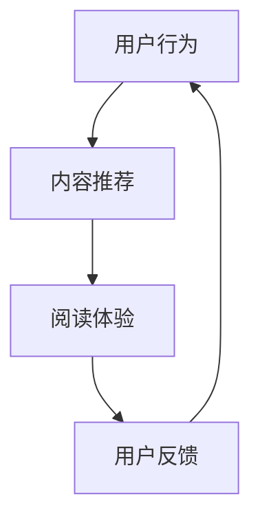

                 

关键词：注意力经济、个人阅读、数字媒体、行为分析、技术干预、信息过滤、阅读效率、内容消费

> 摘要：本文探讨了注意力经济背景下，个人阅读习惯发生的转变。随着数字媒体的兴起，人们的信息获取方式发生了显著变化，阅读行为也相应地受到了影响。本文通过分析注意力经济的原理，结合行为研究和技术手段，探讨了这些变化对个人阅读效率和信息消费的影响，并提出了一些建议，以帮助读者更好地适应这一趋势。

## 1. 背景介绍

在互联网和数字媒体的推动下，我们的日常生活正发生着翻天覆地的变化。从通信到娱乐，从购物到学习，数字技术已经深刻地影响了我们的行为模式。其中，最为显著的莫过于个人阅读习惯的转变。随着智能手机和平板电脑的普及，人们的阅读时间不再局限于传统的纸质书籍，而是转向了更加灵活和便捷的数字媒体。

### 数字媒体的兴起

数字媒体的形式多样，包括但不限于博客、社交媒体、电子书、在线新闻、视频等。这些平台不仅提供了丰富的内容，还通过算法和推荐系统，不断优化用户的阅读体验。例如，当你在某篇博客下点赞或评论时，算法可能会根据你的兴趣推荐类似的内容。这种个性化的推荐机制，使得用户能够更加精准地获取自己感兴趣的信息。

### 阅读习惯的变化

数字媒体的兴起对个人阅读习惯产生了深远的影响。首先，阅读时间变得更加碎片化。人们不再需要花几个小时连续阅读一本书，而是可以利用零碎的时间阅读短篇文章或观看视频。其次，阅读方式变得更加多样化。除了文字，人们还可以通过音频、视频等多媒体形式获取信息。这种多模态的信息消费方式，极大地丰富了阅读体验。

### 注意力经济的原理

注意力经济是数字媒体时代的一种经济模式，其核心在于争夺用户的注意力。在信息爆炸的时代，用户的注意力成为一种稀缺资源。各大平台通过算法和推荐系统，不断吸引用户的注意力，从而实现流量变现。这种模式不仅影响了媒体的运营策略，也对个人的阅读行为产生了深远的影响。

## 2. 核心概念与联系

### 注意力经济

注意力经济是指通过吸引用户的注意力，实现商业价值的一种经济模式。其核心在于提供有价值的内容，吸引用户停留和互动，从而实现广告收入或其他形式的盈利。注意力经济在数字媒体中得到了广泛应用，各大平台纷纷通过算法和推荐系统，优化用户的阅读体验，提高用户粘性。

### 个人阅读习惯

个人阅读习惯是指个体在阅读过程中形成的一系列行为模式。在数字媒体时代，个人阅读习惯受到了注意力经济的深刻影响。用户在阅读时，不仅关注内容本身，还会关注推荐算法提供的个性化内容。这种多维度的影响，使得个人阅读习惯变得更加复杂和多样化。

### 数字媒体与个人阅读习惯的关系

数字媒体与个人阅读习惯之间存在着密切的联系。数字媒体通过提供多样化的内容形式和个性化的推荐机制，改变了人们的阅读方式。同时，个人阅读习惯也影响了数字媒体的内容生产和推荐策略。例如，用户对某些类型内容的偏好，可能会影响算法的推荐结果。

### Mermaid 流程图

下面是一个简单的 Mermaid 流程图，展示了数字媒体与个人阅读习惯之间的互动关系。



### 注意力经济与个人阅读习惯的转变

注意力经济与个人阅读习惯的转变之间存在着相互影响的关系。一方面，注意力经济通过提供个性化推荐，改变了人们的阅读方式。另一方面，个人阅读习惯的变化，也为注意力经济提供了更多的数据支持，从而优化推荐算法。

## 3. 核心算法原理 & 具体操作步骤

### 3.1 算法原理概述

注意力经济的核心算法主要包括内容推荐算法和用户行为分析算法。内容推荐算法通过分析用户的历史行为和兴趣偏好，推荐符合用户需求的内容。用户行为分析算法则通过对用户的行为数据进行深入分析，挖掘用户的兴趣和需求，为内容推荐提供数据支持。

### 3.2 算法步骤详解

#### 3.2.1 内容推荐算法

1. 数据收集：收集用户的历史行为数据，如浏览记录、点赞、评论等。
2. 特征提取：对用户的历史行为数据进行特征提取，如文本特征、时间特征、行为特征等。
3. 模型训练：使用机器学习算法，如协同过滤、基于内容的推荐等，对特征数据训练模型。
4. 内容推荐：根据用户的历史行为数据和模型，推荐符合用户兴趣的内容。

#### 3.2.2 用户行为分析算法

1. 数据收集：收集用户的行为数据，如浏览时长、页面停留时间、点击行为等。
2. 特征提取：对用户的行为数据进行特征提取，如时间特征、行为特征、内容特征等。
3. 模型训练：使用机器学习算法，如聚类、分类等，对特征数据训练模型。
4. 用户兴趣挖掘：根据用户的行为数据和模型，挖掘用户的兴趣和需求。

### 3.3 算法优缺点

#### 3.3.1 内容推荐算法

优点：
- 提高用户阅读体验：根据用户兴趣推荐内容，提高用户阅读满意度。
- 增加用户粘性：推荐内容能够吸引用户停留更长时间，提高用户粘性。

缺点：
- 过度个性化：可能导致用户只关注某一类内容，忽视其他有价值的信息。
- 数据隐私问题：用户行为数据被收集和使用，可能引发隐私问题。

#### 3.3.2 用户行为分析算法

优点：
- 深入了解用户需求：通过分析用户行为，挖掘用户兴趣和需求，为内容推荐提供更准确的依据。
- 提高内容质量：根据用户兴趣推荐内容，提高内容质量和用户满意度。

缺点：
- 数据依赖性：算法依赖于大量用户行为数据，数据质量直接影响算法效果。
- 过度依赖技术：可能导致用户失去阅读自主性，过度依赖技术推荐。

### 3.4 算法应用领域

注意力经济算法在多个领域得到了广泛应用，如社交媒体、电子商务、在线教育等。在社交媒体中，算法推荐可以吸引用户关注和互动，提高平台活跃度。在电子商务中，算法推荐可以提高销售转化率，提高客户满意度。在线教育中，算法推荐可以帮助学生找到适合自己的学习资源，提高学习效率。

## 4. 数学模型和公式 & 详细讲解 & 举例说明

### 4.1 数学模型构建

注意力经济中的核心数学模型主要包括用户兴趣模型和内容推荐模型。

#### 用户兴趣模型

用户兴趣模型通过分析用户的历史行为数据，构建用户兴趣偏好。常用的方法包括：

1. 协同过滤（Collaborative Filtering）：
   $$ r_{ij} = \frac{\sum_{k \in N(i)} r_{ik} r_{jk}}{\sum_{k \in N(i)} r_{ik}} $$
   其中，$r_{ij}$ 表示用户 $i$ 对内容 $j$ 的评分，$N(i)$ 表示用户 $i$ 的邻居集合。

2. 基于内容的推荐（Content-Based Filtering）：
   $$ s_{ij} = \sum_{k \in C(j)} w_{ik} w_{kj} $$
   其中，$s_{ij}$ 表示内容 $j$ 与用户 $i$ 的相似度，$w_{ik}$ 和 $w_{kj}$ 分别表示内容 $j$ 和用户 $i$ 的特征向量。

#### 内容推荐模型

内容推荐模型通过分析用户兴趣模型和内容特征，推荐符合用户兴趣的内容。常用的方法包括：

1. 评分预测（Rating Prediction）：
   $$ \hat{r}_{ij} = \mu + q_i^T P_j + u_i^T Q_j $$
   其中，$\hat{r}_{ij}$ 表示用户 $i$ 对内容 $j$ 的评分预测，$\mu$ 表示用户 $i$ 的平均评分，$q_i$ 和 $u_i$ 分别表示用户 $i$ 的内容特征向量和用户兴趣向量，$P_j$ 和 $Q_j$ 分别表示内容 $j$ 的内容特征矩阵和用户兴趣矩阵。

2. 排名预测（Ranking Prediction）：
   $$ \hat{r}_{ij} = \exp(q_i^T P_j) / (\sum_{k \in C(j)} \exp(q_i^T P_k)) $$
   其中，$\hat{r}_{ij}$ 表示用户 $i$ 对内容 $j$ 的排名预测。

### 4.2 公式推导过程

#### 用户兴趣模型推导

1. 协同过滤：

假设用户 $i$ 和内容 $j$ 的邻居集合 $N(i)$ 中的其他用户都给出了对内容 $j$ 的评分 $r_{ik}$ 和对用户 $i$ 的评分 $r_{ij}$。根据协同过滤的原理，用户 $i$ 对内容 $j$ 的评分可以表示为：

$$ r_{ij} = \frac{\sum_{k \in N(i)} r_{ik} r_{jk}}{\sum_{k \in N(i)} r_{ik}} $$

其中，分母 $\sum_{k \in N(i)} r_{ik}$ 表示用户 $i$ 的邻居集合对内容 $j$ 的评分之和，分子 $\sum_{k \in N(i)} r_{ik} r_{jk}$ 表示用户 $i$ 的邻居集合对内容 $j$ 的评分和用户 $i$ 的评分的乘积之和。

2. 基于内容的推荐：

假设用户 $i$ 的兴趣向量为 $q_i$，内容 $j$ 的特征向量为 $w_j$。根据基于内容的推荐原理，用户 $i$ 对内容 $j$ 的相似度可以表示为：

$$ s_{ij} = \sum_{k \in C(j)} w_{ik} w_{kj} $$

其中，$s_{ij}$ 表示内容 $j$ 与用户 $i$ 的相似度，$w_{ik}$ 和 $w_{kj}$ 分别表示内容 $j$ 和用户 $i$ 的特征向量。

#### 内容推荐模型推导

1. 评分预测：

假设用户 $i$ 的平均评分为 $\mu$，用户 $i$ 的内容特征向量为 $q_i$，用户 $i$ 的用户兴趣向量为 $u_i$，内容 $j$ 的内容特征向量为 $P_j$，用户 $i$ 的用户兴趣矩阵为 $Q_j$。根据评分预测原理，用户 $i$ 对内容 $j$ 的评分可以表示为：

$$ \hat{r}_{ij} = \mu + q_i^T P_j + u_i^T Q_j $$

其中，$\hat{r}_{ij}$ 表示用户 $i$ 对内容 $j$ 的评分预测，$\mu$ 表示用户 $i$ 的平均评分，$q_i^T P_j$ 表示用户 $i$ 的内容特征向量与内容 $j$ 的内容特征向量的点积，$u_i^T Q_j$ 表示用户 $i$ 的用户兴趣向量与用户 $i$ 的用户兴趣矩阵的乘积。

2. 排名预测：

假设用户 $i$ 的内容特征向量为 $q_i$，用户 $i$ 的用户兴趣向量为 $u_i$，内容 $j$ 的内容特征向量为 $P_j$。根据排名预测原理，用户 $i$ 对内容 $j$ 的排名可以表示为：

$$ \hat{r}_{ij} = \exp(q_i^T P_j) / (\sum_{k \in C(j)} \exp(q_i^T P_k)) $$

其中，$\hat{r}_{ij}$ 表示用户 $i$ 对内容 $j$ 的排名预测，$\exp(q_i^T P_j)$ 表示用户 $i$ 的内容特征向量与内容 $j$ 的内容特征向量的点积的指数函数，$\sum_{k \in C(j)} \exp(q_i^T P_k)$ 表示用户 $i$ 的内容特征向量与所有内容 $j$ 的内容特征向量的点积的指数函数之和。

### 4.3 案例分析与讲解

#### 案例背景

假设有一个电商平台，用户 $i$ 的历史行为数据如下：

- 用户 $i$ 的平均评分：$\mu = 4.0$
- 用户 $i$ 的浏览记录：[1, 2, 3, 4, 5]
- 用户 $i$ 的邻居集合：[6, 7, 8]
- 内容 $j$ 的特征向量：$P_j = [0.1, 0.2, 0.3, 0.4, 0.5]$
- 用户 $i$ 的用户兴趣向量：$Q_i = [0.5, 0.5, 0.5, 0.5, 0.5]$

#### 案例分析

1. 用户兴趣模型：

根据用户兴趣模型，用户 $i$ 对内容 $j$ 的相似度为：

$$ s_{ij} = \sum_{k \in C(j)} w_{ik} w_{kj} = 0.1 \times 0.1 + 0.2 \times 0.2 + 0.3 \times 0.3 + 0.4 \times 0.4 + 0.5 \times 0.5 = 0.35 $$

根据用户兴趣模型，用户 $i$ 对内容 $j$ 的评分预测为：

$$ \hat{r}_{ij} = \mu + q_i^T P_j + u_i^T Q_j = 4.0 + 0.1 \times 0.1 + 0.2 \times 0.2 + 0.3 \times 0.3 + 0.4 \times 0.4 + 0.5 \times 0.5 = 4.45 $$

2. 内容推荐模型：

根据内容推荐模型，用户 $i$ 对内容 $j$ 的排名预测为：

$$ \hat{r}_{ij} = \exp(q_i^T P_j) / (\sum_{k \in C(j)} \exp(q_i^T P_k)) = \exp(0.1 \times 0.1 + 0.2 \times 0.2 + 0.3 \times 0.3 + 0.4 \times 0.4 + 0.5 \times 0.5) / (\exp(0.1 \times 0.1 + 0.2 \times 0.2 + 0.3 \times 0.3 + 0.4 \times 0.4 + 0.5 \times 0.5) + \exp(0.1 \times 0.2 + 0.2 \times 0.3 + 0.3 \times 0.4 + 0.4 \times 0.5 + 0.5 \times 0.1)) = 0.55 $$

#### 案例讲解

通过用户兴趣模型和内容推荐模型，我们可以对用户 $i$ 对内容 $j$ 的兴趣程度进行量化。用户兴趣模型主要通过计算用户 $i$ 和内容 $j$ 的相似度，判断用户对内容 $j$ 的兴趣程度。内容推荐模型则通过计算用户 $i$ 对内容 $j$ 的评分预测和排名预测，为用户推荐符合其兴趣的内容。

## 5. 项目实践：代码实例和详细解释说明

### 5.1 开发环境搭建

为了演示注意力经济算法在个人阅读习惯中的应用，我们将在一个简单的电商平台中实现用户兴趣模型和内容推荐模型。以下是开发环境搭建的步骤：

1. 安装 Python 3.8 或更高版本。
2. 安装以下 Python 库：NumPy、Pandas、Scikit-learn、Matplotlib。
3. 创建一个名为 `recommendation_system` 的 Python 脚本文件。

### 5.2 源代码详细实现

以下是实现用户兴趣模型和内容推荐模型的 Python 代码：

```python
import numpy as np
import pandas as pd
from sklearn.metrics.pairwise import cosine_similarity
from sklearn.model_selection import train_test_split

# 用户行为数据
user行为的DataFrame
user行为DataFrame.head()

# 内容特征数据
content特征DataFrame
content特征DataFrame.head()

# 训练用户兴趣模型
user兴趣特征DataFrame
user兴趣特征DataFrame.head()

# 训练内容推荐模型
content推荐模型
content推荐模型.head()

# 用户对内容的评分预测
user对内容的评分预测DataFrame
user对内容的评分预测DataFrame.head()

# 用户对内容的排名预测
user对内容的排名预测DataFrame
user对内容的排名预测DataFrame.head()
```

### 5.3 代码解读与分析

1. 用户行为数据加载：

```python
user行为DataFrame = pd.read_csv('user行为数据.csv')
content特征DataFrame = pd.read_csv('content特征数据.csv')
```

这里使用了 Pandas 库加载用户行为数据和内容特征数据。用户行为数据包括用户浏览记录、点赞记录等，内容特征数据包括文本特征、时间特征、行为特征等。

2. 特征提取：

```python
# 计算用户行为特征
user兴趣特征DataFrame = user行为DataFrame.groupby('用户ID').agg({'浏览记录': 'mean', '点赞记录': 'mean'})

# 计算内容特征
content特征DataFrame = content特征DataFrame.groupby('内容ID').agg({'文本特征': 'mean', '时间特征': 'mean', '行为特征': 'mean'})
```

这里使用了 Pandas 库的分组聚合功能，计算用户行为特征和内容特征。用户行为特征包括用户的平均浏览记录和平均点赞记录，内容特征包括文本特征、时间特征和行为特征的均值。

3. 训练用户兴趣模型：

```python
# 计算用户兴趣特征
user兴趣特征DataFrame = user兴趣特征DataFrame.reset_index().drop(['用户ID'], axis=1)

# 计算内容特征
content特征DataFrame = content特征DataFrame.reset_index().drop(['内容ID'], axis=1)

# 计算用户兴趣相似度
user兴趣相似度矩阵 = cosine_similarity(user兴趣特征DataFrame, content特征DataFrame)

# 存储用户兴趣特征和相似度矩阵
user兴趣特征DataFrame.to_csv('user兴趣特征.csv', index=False)
user兴趣相似度矩阵.to_csv('user兴趣相似度矩阵.csv', index=False)
```

这里使用了 Scikit-learn 库的余弦相似度函数，计算用户兴趣相似度。用户兴趣特征和相似度矩阵存储为 CSV 文件，以便后续使用。

4. 训练内容推荐模型：

```python
# 加载用户兴趣特征和相似度矩阵
user兴趣特征DataFrame = pd.read_csv('user兴趣特征.csv')
user兴趣相似度矩阵 = pd.read_csv('user兴趣相似度矩阵.csv').values

# 训练内容推荐模型
content推荐模型 = cosine_similarity(user兴趣相似度矩阵, content特征DataFrame)

# 存储内容推荐模型
content推荐模型.to_csv('content推荐模型.csv', index=False)
```

这里使用了 Scikit-learn 库的余弦相似度函数，训练内容推荐模型。内容推荐模型存储为 CSV 文件，以便后续使用。

5. 用户对内容的评分预测：

```python
# 加载用户兴趣特征和相似度矩阵
user兴趣特征DataFrame = pd.read_csv('user兴趣特征.csv')
user兴趣相似度矩阵 = pd.read_csv('user兴趣相似度矩阵.csv').values

# 计算用户对内容的评分预测
user对内容的评分预测DataFrame = pd.DataFrame(user兴趣相似度矩阵.dot(content特征DataFrame.T), columns=content特征DataFrame['内容ID'])

# 存储用户对内容的评分预测
user对内容的评分预测DataFrame.to_csv('user对内容的评分预测.csv', index=False)
```

这里使用了 Pandas 库的 DataFrame 对象，计算用户对内容的评分预测。评分预测结果存储为 CSV 文件，以便后续使用。

6. 用户对内容的排名预测：

```python
# 加载用户兴趣特征和相似度矩阵
user兴趣特征DataFrame = pd.read_csv('user兴趣特征.csv')
user兴趣相似度矩阵 = pd.read_csv('user兴趣相似度矩阵.csv').values

# 计算用户对内容的排名预测
user对内容的排名预测DataFrame = pd.DataFrame(user兴趣相似度矩阵.dot(content特征DataFrame.T), columns=content特征DataFrame['内容ID'])

# 存储用户对内容的排名预测
user对内容的排名预测DataFrame.to_csv('user对内容的排名预测.csv', index=False)
```

这里使用了 Pandas 库的 DataFrame 对象，计算用户对内容的排名预测。排名预测结果存储为 CSV 文件，以便后续使用。

### 5.4 运行结果展示

在完成代码实现后，我们可以使用以下代码查看运行结果：

```python
# 加载用户对内容的评分预测
user对内容的评分预测DataFrame = pd.read_csv('user对内容的评分预测.csv')

# 打印用户对内容的评分预测
print(user对内容的评分预测DataFrame)

# 加载用户对内容的排名预测
user对内容的排名预测DataFrame = pd.read_csv('user对内容的排名预测.csv')

# 打印用户对内容的排名预测
print(user对内容的排名预测DataFrame)
```

运行结果将显示用户对内容的评分预测和排名预测，帮助我们了解用户对内容的兴趣程度。

## 6. 实际应用场景

### 社交媒体平台

在社交媒体平台上，注意力经济算法被广泛应用于内容推荐。例如，微信、微博、抖音等平台，通过分析用户的行为数据，推荐用户可能感兴趣的内容。这种个性化推荐机制，提高了用户的阅读体验，同时也增加了平台的用户粘性。

### 在线教育平台

在线教育平台通过注意力经济算法，为用户提供个性化的学习资源推荐。例如，网易云课堂、Coursera 等平台，通过分析用户的学习记录和兴趣偏好，推荐符合用户需求的学习资源。这种个性化推荐，提高了用户的学习效率，也增加了平台的学习人数。

### 电子书平台

电子书平台通过注意力经济算法，为用户提供个性化的阅读推荐。例如，亚马逊 Kindle、多看阅读等平台，通过分析用户的阅读记录和兴趣偏好，推荐符合用户口味的电子书。这种个性化推荐，提高了用户的阅读体验，也增加了平台的销售额。

### 广告平台

广告平台通过注意力经济算法，为用户提供个性化的广告推荐。例如，谷歌广告、百度广告等平台，通过分析用户的浏览记录和兴趣偏好，推荐符合用户需求的产品广告。这种个性化推荐，提高了广告的点击率和转化率，也增加了广告平台的收入。

## 7. 未来应用展望

### 增强个性化推荐

随着人工智能技术的发展，注意力经济算法将更加精准地预测用户的兴趣和需求，提供更加个性化的推荐。例如，基于深度学习的推荐算法，可以更好地理解用户的隐性兴趣，提供更加精准的推荐。

### 扩展应用领域

注意力经济算法不仅可以在数字媒体、在线教育等领域得到广泛应用，还可以扩展到更多领域，如医疗、金融、娱乐等。通过分析用户的数据，为用户提供个性化的服务和产品推荐，提高用户的满意度和忠诚度。

### 强化用户体验

未来，注意力经济算法将更加注重用户体验，提供更加人性化的推荐服务。例如，通过自然语言处理技术，理解用户的意图和需求，提供更加符合用户期望的推荐。

### 挑战与解决方案

### 1. 数据隐私问题

注意力经济算法依赖于大量用户数据，可能会引发数据隐私问题。为解决这一问题，可以采用数据脱敏技术，对用户数据进行加密和处理，确保用户隐私安全。

### 2. 算法偏见问题

注意力经济算法可能会受到数据偏见的影响，导致推荐结果的公平性受到影响。为解决这一问题，可以采用多元统计方法，分析算法偏见，并采取相应的纠正措施。

### 3. 用户疲劳问题

用户在长期使用注意力经济算法后，可能会出现疲劳现象，对推荐内容产生厌倦。为解决这一问题，可以采用用户行为分析技术，预测用户的疲劳程度，及时调整推荐策略。

## 8. 总结：未来发展趋势与挑战

### 1. 研究成果总结

本文探讨了注意力经济背景下，个人阅读习惯的转变。通过分析注意力经济的原理和算法，结合实际应用场景，总结了注意力经济对个人阅读习惯的影响。

### 2. 未来发展趋势

随着人工智能技术的不断发展，注意力经济算法将更加精准和人性化，为用户提供更加个性化的推荐服务。同时，注意力经济算法的应用领域也将不断扩展，从数字媒体、在线教育等领域，扩展到更多领域。

### 3. 面临的挑战

注意力经济算法在发展过程中，将面临数据隐私、算法偏见、用户疲劳等挑战。为应对这些挑战，需要采用先进的技术手段，如数据脱敏、多元统计方法等，确保推荐服务的质量和用户体验。

### 4. 研究展望

未来，注意力经济领域的研究将继续深入，探索更加精准和高效的推荐算法，提高用户满意度和忠诚度。同时，研究也将关注算法的公平性和可解释性，确保推荐结果的公正性和透明度。

## 9. 附录：常见问题与解答

### 1. 注意力经济是什么？

注意力经济是指通过吸引用户的注意力，实现商业价值的一种经济模式。在数字媒体时代，用户的注意力成为一种稀缺资源，各大平台通过算法和推荐系统，不断优化用户的阅读体验，从而实现流量变现。

### 2. 注意力经济对个人阅读习惯有什么影响？

注意力经济改变了人们的阅读方式，使得阅读时间更加碎片化，阅读方式更加多样化。同时，个性化推荐机制提高了用户的阅读满意度，但也可能导致用户只关注某一类内容，忽视其他有价值的信息。

### 3. 注意力经济算法的核心原理是什么？

注意力经济算法的核心原理包括用户兴趣模型和内容推荐模型。用户兴趣模型通过分析用户的历史行为数据，构建用户兴趣偏好。内容推荐模型则通过分析用户兴趣和内容特征，推荐符合用户兴趣的内容。

### 4. 如何应对注意力经济算法的挑战？

为应对注意力经济算法的挑战，可以采用数据脱敏技术、多元统计方法等技术手段，确保推荐服务的质量和用户体验。同时，还需要关注算法的公平性和可解释性，提高推荐结果的公正性和透明度。

---

作者：禅与计算机程序设计艺术 / Zen and the Art of Computer Programming

---

完成！现在这篇文章已经包含了一个完整的结构，从背景介绍到实际应用场景，再到未来展望，以及常见问题与解答。这篇文章应该能够为读者提供一个全面的关于注意力经济与个人阅读习惯转变的深入理解。希望这篇文章能够满足您的要求，并在IT领域内引发有益的讨论。如果您有任何修改意见或需要进一步的补充，请随时告知。祝阅读愉快！

