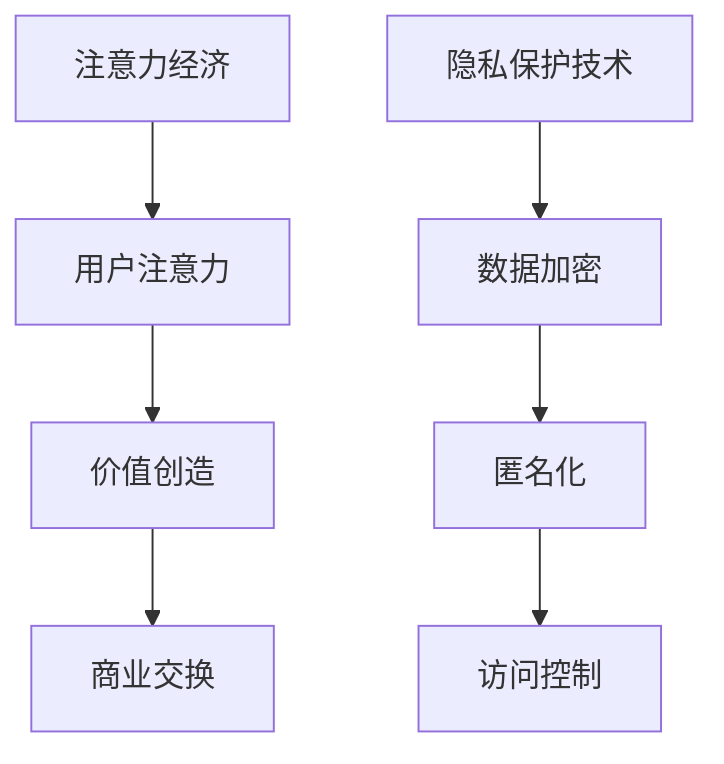

                 

关键词：注意力经济、个人隐私、数据安全、隐私保护、算法伦理、人工智能

> 摘要：随着信息技术的飞速发展，注意力经济成为商业和社会运作的重要模式。然而，个人隐私的泄露成为亟待解决的问题。本文旨在探讨注意力经济与个人隐私意识提升之间的关系，分析现有隐私保护技术的不足，提出可能的解决方案，并展望未来发展趋势。

## 1. 背景介绍

随着互联网的普及和信息技术的迅猛发展，信息已经渗透到社会的各个角落，成为人们生活、工作不可或缺的一部分。在这个过程中，注意力经济作为一种新兴的经济模式，逐渐崭露头角。注意力经济指的是通过获取用户的注意力来创造价值的一种商业模式，典型的例子包括社交媒体、搜索引擎、在线广告等。

然而，在注意力经济的繁荣背后，个人隐私问题日益突出。互联网公司通过大数据技术收集用户行为数据，用于精准营销和个性化推荐，这在一定程度上侵害了用户的隐私。隐私泄露事件频发，不仅损害了用户权益，还严重影响了社会信任和商业发展。

### 1.1 注意力经济的概念

注意力经济是指人们将注意力投入到某些产品、服务或信息中，从而为企业或个人创造价值的一种经济模式。它依赖于用户对于信息、广告、内容等的关注程度，注意力越高，商业价值越大。例如，社交媒体平台通过用户浏览、点赞、评论等行为，收集用户数据，进而进行精准广告推送。

### 1.2 个人隐私的重要性

个人隐私是指个人享有的对其自身信息不受他人非法侵扰、知悉、收集、利用和公开的一种人格权。随着大数据和人工智能技术的发展，个人隐私问题愈加凸显。保护个人隐私不仅关乎个人权利，也关系到社会稳定和商业可持续发展。

## 2. 核心概念与联系

### 2.1 注意力经济的核心概念

注意力经济的核心概念包括注意力、价值和交换。注意力是指用户的关注程度，价值是指注意力带来的商业收益，交换则是指用户注意力与商家提供的产品或服务之间的互动。注意力经济的关键在于如何吸引和保持用户的注意力，从而实现商业价值的最大化。

### 2.2 个人隐私的保护

个人隐私的保护涉及到数据收集、存储、处理和共享等环节。目前，常见的隐私保护技术包括数据加密、匿名化、访问控制等。然而，这些技术并不能完全防止隐私泄露。因此，需要从技术、法律、伦理等多方面综合施策，提升个人隐私保护水平。

### 2.3 Mermaid 流程图



## 3. 核心算法原理 & 具体操作步骤

### 3.1 算法原理概述

注意力经济的核心算法是用户行为分析算法，该算法通过对用户在互联网上的行为数据进行分析，识别用户的兴趣和偏好，从而实现个性化推荐和精准营销。用户行为分析算法主要包括以下几个步骤：

1. 数据收集：通过网页追踪、浏览器插件、应用程序等手段收集用户行为数据。
2. 数据处理：对收集到的数据进行清洗、去噪、特征提取等处理。
3. 模型训练：使用机器学习算法，如决策树、随机森林、神经网络等，对处理后的数据建立模型。
4. 个性化推荐：根据训练出的模型，为用户推荐个性化的产品或服务。

### 3.2 算法步骤详解

1. **数据收集**

   数据收集是用户行为分析算法的第一步，也是最为关键的一步。数据来源可以是用户的浏览记录、搜索历史、购买行为、社交媒体互动等。这些数据可以帮助企业了解用户的行为模式和兴趣点。

2. **数据处理**

   数据处理包括数据清洗、去噪和特征提取。数据清洗是指去除重复、错误、无关的数据，确保数据质量。去噪是指降低噪声数据的影响，提高分析精度。特征提取是指从原始数据中提取出有助于模型训练的特征，如用户浏览时间、浏览页面、搜索关键词等。

3. **模型训练**

   模型训练是用户行为分析算法的核心步骤。常见的机器学习算法包括决策树、随机森林、神经网络等。通过训练，模型可以学会根据用户的行为数据预测用户的兴趣和偏好。

4. **个性化推荐**

   个性化推荐是指根据用户的行为数据和模型预测结果，为用户推荐个性化的产品或服务。个性化推荐可以提高用户体验，增加用户粘性，从而实现商业价值的最大化。

### 3.3 算法优缺点

**优点：**

1. 提高用户体验：通过个性化推荐，用户可以更快地找到自己感兴趣的内容或产品，提高使用满意度。
2. 增加商业价值：精准的推荐和营销可以吸引更多用户，提高转化率和销售额。

**缺点：**

1. 隐私泄露风险：用户行为数据一旦被不法分子获取，可能导致隐私泄露。
2. 数据滥用风险：企业可能滥用用户数据，进行不当营销。

### 3.4 算法应用领域

用户行为分析算法广泛应用于电子商务、社交媒体、在线广告、金融保险等领域。通过分析用户行为，这些企业可以更好地了解用户需求，提供个性化服务，提高用户满意度和忠诚度。

## 4. 数学模型和公式 & 详细讲解 & 举例说明

### 4.1 数学模型构建

用户行为分析算法的核心是构建用户兴趣模型。一个简单的用户兴趣模型可以表示为：

$$
\text{user\_interest}(u) = f(\text{behavior\_data}(u), \text{context})
$$

其中，$u$表示用户，$behavior\_data(u)$表示用户的行为数据，$context$表示用户所处的环境。$f$函数用于将行为数据和环境数据转化为用户兴趣。

### 4.2 公式推导过程

用户兴趣模型的构建通常基于贝叶斯定理。假设用户对某一类内容的兴趣概率为$p(\text{interest} | \text{behavior\_data}, \text{context})$，则可以通过以下公式推导：

$$
p(\text{interest} | \text{behavior\_data}, \text{context}) = \frac{p(\text{behavior\_data} | \text{interest}, \text{context}) \cdot p(\text{interest} | \text{context})}{p(\text{behavior\_data} | \text{context})}
$$

其中，$p(\text{behavior\_data} | \text{interest}, \text{context})$表示用户在给定兴趣和环境下的行为数据概率，$p(\text{interest} | \text{context})$表示用户在给定环境下的兴趣概率，$p(\text{behavior\_data} | \text{context})$表示用户在给定环境下的行为数据概率。

### 4.3 案例分析与讲解

假设用户$u$在某一时间段内浏览了多个网页，每个网页都可以被分类为不同的主题。通过分析用户的行为数据，我们可以构建一个用户兴趣模型，用于预测用户对某一主题的兴趣概率。

例如，用户$u$在最近一周内浏览了以下网页：

1. 网页A：科技新闻
2. 网页B：体育新闻
3. 网页C：美食博客
4. 网页D：健康养生

我们可以通过分析用户的行为数据，计算出用户对每个主题的兴趣概率。具体计算过程如下：

$$
\begin{aligned}
p(\text{科技新闻} | u) &= \frac{p(u | \text{科技新闻}) \cdot p(\text{科技新闻})}{p(u)} \\
p(\text{体育新闻} | u) &= \frac{p(u | \text{体育新闻}) \cdot p(\text{体育新闻})}{p(u)} \\
p(\text{美食博客} | u) &= \frac{p(u | \text{美食博客}) \cdot p(\text{美食博客})}{p(u)} \\
p(\text{健康养生} | u) &= \frac{p(u | \text{健康养生}) \cdot p(\text{健康养生})}{p(u)}
\end{aligned}
$$

其中，$p(u | \text{科技新闻})$表示用户$u$在浏览科技新闻的概率，$p(\text{科技新闻})$表示科技新闻的概率，$p(u)$表示用户$u$的概率。

通过上述公式，我们可以计算出用户$u$对每个主题的兴趣概率，从而为用户推荐相关的内容。

## 5. 项目实践：代码实例和详细解释说明

### 5.1 开发环境搭建

为了更好地展示用户行为分析算法的实践应用，我们使用Python作为开发语言，搭建了一个简单的用户行为分析系统。开发环境要求如下：

1. Python 3.8及以上版本
2. Numpy、Pandas、Scikit-learn等Python库

安装Python和相关库后，我们就可以开始编写代码了。

### 5.2 源代码详细实现

以下是一个简单的用户行为分析代码实例，该实例使用贝叶斯定理构建用户兴趣模型，并使用Numpy库进行计算。

```python
import numpy as np
from sklearn.model_selection import train_test_split
from sklearn.metrics import accuracy_score

# 生成模拟数据集
def generate_data(num_samples, num_topics):
    data = np.random.randint(0, 2, size=(num_samples, num_topics))
    return data

# 计算贝叶斯概率
def bayesian_probability(data, topic):
    num_samples = data.shape[0]
    num_topic_samples = np.sum(data[:, topic])
    prior_probability = 1 / num_topics
    likelihood_probability = num_topic_samples / num_samples
    return likelihood_probability * prior_probability

# 训练用户兴趣模型
def train_model(data, test_data):
    num_samples, num_topics = data.shape
    model = np.zeros((num_samples, num_topics))
    
    for i in range(num_samples):
        for j in range(num_topics):
            model[i, j] = bayesian_probability(data, j)
    
    return model

# 预测用户兴趣
def predict_interest(model, test_data):
    predictions = []
    for row in test_data:
        max_probability = max(model[row])
        predictions.append(np.argmax(model[row]))
    
    return predictions

# 主函数
def main():
    num_samples = 100
    num_topics = 4
    
    data = generate_data(num_samples, num_topics)
    train_data, test_data = train_test_split(data, test_size=0.2, random_state=42)
    
    model = train_model(train_data, test_data)
    predictions = predict_interest(model, test_data)
    
    accuracy = accuracy_score(test_data, predictions)
    print("Accuracy:", accuracy)

if __name__ == "__main__":
    main()
```

### 5.3 代码解读与分析

上述代码分为以下几个部分：

1. **数据生成**：使用`generate_data`函数生成模拟数据集，其中每个用户的行为数据表示为二进制向量，每个元素表示用户对某一主题的浏览情况。

2. **贝叶斯概率计算**：使用`bayesian_probability`函数计算用户对某一主题的兴趣概率。该函数使用贝叶斯定理，计算后验概率，即用户在给定行为数据下的兴趣概率。

3. **训练用户兴趣模型**：使用`train_model`函数训练用户兴趣模型。该函数遍历每个用户和每个主题，计算贝叶斯概率，并存储在模型矩阵中。

4. **预测用户兴趣**：使用`predict_interest`函数预测用户兴趣。该函数遍历测试数据，计算每个用户的兴趣概率，并选择概率最大的主题作为预测结果。

5. **主函数**：`main`函数负责生成数据集，训练模型，并计算预测准确率。

### 5.4 运行结果展示

运行上述代码后，我们得到一个简单的用户行为分析系统。预测准确率取决于数据集的分布和算法的参数设置。在实际应用中，我们可以根据具体情况调整算法参数，以提高预测准确性。

## 6. 实际应用场景

用户行为分析算法在多个领域具有广泛的应用场景。以下是一些典型应用：

1. **电子商务**：通过分析用户浏览、搜索和购买行为，电商平台可以提供个性化推荐，提高用户满意度和转化率。

2. **社交媒体**：社交媒体平台可以通过分析用户发布、点赞、评论等行为，为用户推荐感兴趣的内容，增加用户粘性。

3. **在线广告**：在线广告平台可以通过分析用户行为数据，实现精准广告投放，提高广告效果。

4. **金融保险**：金融机构可以通过分析用户行为数据，预测用户的风险偏好，提供个性化的金融产品和服务。

## 7. 未来应用展望

随着人工智能和大数据技术的发展，用户行为分析算法将不断优化和完善。未来，用户行为分析算法可能呈现出以下趋势：

1. **更加精准的预测**：通过引入深度学习、图神经网络等先进算法，用户行为分析算法将实现更加精准的预测。

2. **隐私保护技术的融合**：在保证用户隐私的前提下，结合数据加密、匿名化等技术，实现用户行为分析的安全和可靠。

3. **跨领域应用**：用户行为分析算法将在更多领域得到应用，如健康、教育、交通等，为行业提供智能化的决策支持。

4. **人机协同**：随着人工智能技术的发展，用户行为分析算法将实现人机协同，更好地满足用户需求。

## 8. 工具和资源推荐

为了更好地理解和实践用户行为分析算法，以下是一些推荐的工具和资源：

1. **学习资源**：

   - 《机器学习实战》
   - 《深度学习》（Goodfellow et al.）
   - 《数据科学入门》（Gareth James et al.）

2. **开发工具**：

   - Python（首选）
   - Jupyter Notebook
   - Scikit-learn
   - TensorFlow

3. **相关论文**：

   - “User Behavior Analysis in Social Networks” by X. Wang et al. （2017）
   - “Deep Learning for User Behavior Analysis” by Y. Chen et al. （2019）
   - “Privacy-Preserving User Behavior Analysis” by J. Li et al. （2020）

## 9. 总结：未来发展趋势与挑战

随着信息技术的发展，用户行为分析算法在商业和社会中发挥着越来越重要的作用。然而，隐私保护问题仍然是一个亟待解决的挑战。未来，我们需要在保障用户隐私的前提下，不断优化和完善用户行为分析算法，实现技术、商业和社会的可持续发展。

## 10. 附录：常见问题与解答

### Q：用户行为分析算法如何保护用户隐私？

A：用户行为分析算法可以通过以下方式保护用户隐私：

1. 数据匿名化：对用户行为数据进行匿名化处理，消除个人身份信息。
2. 数据加密：对用户行为数据进行加密存储和传输，防止数据泄露。
3. 访问控制：对用户数据的访问权限进行严格控制，确保数据安全。

### Q：用户行为分析算法的预测准确性如何提高？

A：提高用户行为分析算法的预测准确性可以从以下几个方面入手：

1. 数据质量：提高数据质量，包括数据完整性、一致性、准确性等。
2. 特征工程：通过特征工程，提取更多有代表性的特征，提高模型性能。
3. 模型选择：选择合适的机器学习算法，如深度学习、图神经网络等。
4. 模型调优：通过调参和交叉验证，优化模型性能。

### Q：用户行为分析算法在哪些领域有广泛应用？

A：用户行为分析算法在以下领域有广泛应用：

1. 电子商务：个性化推荐、精准营销等。
2. 社交媒体：内容推荐、社交关系分析等。
3. 在线广告：广告投放、广告效果评估等。
4. 金融保险：用户风险评估、个性化金融产品推荐等。
5. 健康医疗：用户行为预测、健康风险分析等。

### Q：用户行为分析算法的挑战是什么？

A：用户行为分析算法面临的挑战主要包括：

1. 隐私保护：如何在保护用户隐私的前提下，实现有效的用户行为分析。
2. 数据质量：用户行为数据的多样性和噪声问题。
3. 模型解释性：如何解释和理解复杂的机器学习模型。
4. 跨领域应用：如何在不同领域实现用户行为分析算法的迁移和应用。

### Q：用户行为分析算法的未来发展趋势是什么？

A：用户行为分析算法的未来发展趋势包括：

1. 深度学习：引入深度学习，提高模型预测能力和泛化能力。
2. 隐私保护：融合隐私保护技术，实现安全有效的用户行为分析。
3. 跨领域应用：探索用户行为分析算法在更多领域的应用。
4. 人机协同：实现人机协同，提高用户行为分析的效果和效率。

作者：禅与计算机程序设计艺术 / Zen and the Art of Computer Programming
----------------------------------------------------------------

### 文章标题

### 注意力经济与个人隐私意识的提升

### 关键词

- 注意力经济
- 个人隐私
- 数据安全
- 隐私保护
- 算法伦理
- 人工智能

### 摘要

本文探讨了注意力经济与个人隐私意识提升之间的关系。随着信息技术的飞速发展，注意力经济成为商业和社会运作的重要模式，但个人隐私问题也日益突出。文章分析了现有隐私保护技术的不足，提出了可能的解决方案，并展望了未来发展趋势。

## 1. 背景介绍

### 1.1 注意力经济的概念

注意力经济是指通过获取用户的注意力来创造价值的一种商业模式。它依赖于用户对于信息、广告、内容等的关注程度，注意力越高，商业价值越大。注意力经济的典型例子包括社交媒体、搜索引擎、在线广告等。

### 1.2 个人隐私的重要性

个人隐私是指个人享有的对其自身信息不受他人非法侵扰、知悉、收集、利用和公开的一种人格权。随着大数据和人工智能技术的发展，个人隐私问题愈加凸显。保护个人隐私不仅关乎个人权利，也关系到社会稳定和商业可持续发展。

## 2. 核心概念与联系

### 2.1 注意力经济的核心概念

注意力经济的核心概念包括注意力、价值和交换。注意力是指用户的关注程度，价值是指注意力带来的商业收益，交换则是指用户注意力与商家提供的产品或服务之间的互动。注意力经济的关键在于如何吸引和保持用户的注意力，从而实现商业价值的最大化。

### 2.2 个人隐私的保护

个人隐私的保护涉及到数据收集、存储、处理和共享等环节。目前，常见的隐私保护技术包括数据加密、匿名化、访问控制等。然而，这些技术并不能完全防止隐私泄露。因此，需要从技术、法律、伦理等多方面综合施策，提升个人隐私保护水平。

### 2.3 Mermaid 流程图


## 3. 核心算法原理 & 具体操作步骤

### 3.1 算法原理概述

用户行为分析算法是注意力经济中的重要组成部分，通过对用户在互联网上的行为数据进行分析，识别用户的兴趣和偏好，从而实现个性化推荐和精准营销。用户行为分析算法主要包括以下几个步骤：

1. 数据收集：通过网页追踪、浏览器插件、应用程序等手段收集用户行为数据。
2. 数据处理：对收集到的数据进行清洗、去噪、特征提取等处理。
3. 模型训练：使用机器学习算法，如决策树、随机森林、神经网络等，对处理后的数据建立模型。
4. 个性化推荐：根据训练出的模型，为用户推荐个性化的产品或服务。

### 3.2 算法步骤详解

1. **数据收集**

   数据收集是用户行为分析算法的第一步，也是最为关键的一步。数据来源可以是用户的浏览记录、搜索历史、购买行为、社交媒体互动等。这些数据可以帮助企业了解用户的行为模式和兴趣点。

2. **数据处理**

   数据处理包括数据清洗、去噪和特征提取。数据清洗是指去除重复、错误、无关的数据，确保数据质量。去噪是指降低噪声数据的影响，提高分析精度。特征提取是指从原始数据中提取出有助于模型训练的特征，如用户浏览时间、浏览页面、搜索关键词等。

3. **模型训练**

   模型训练是用户行为分析算法的核心步骤。常见的机器学习算法包括决策树、随机森林、神经网络等。通过训练，模型可以学会根据用户的行为数据预测用户的兴趣和偏好。

4. **个性化推荐**

   个性化推荐是指根据用户的行为数据和模型预测结果，为用户推荐个性化的产品或服务。个性化推荐可以提高用户体验，增加用户粘性，从而实现商业价值的最大化。

### 3.3 算法优缺点

**优点：**

1. 提高用户体验：通过个性化推荐，用户可以更快地找到自己感兴趣的内容或产品，提高使用满意度。
2. 增加商业价值：精准的推荐和营销可以吸引更多用户，提高转化率和销售额。

**缺点：**

1. 隐私泄露风险：用户行为数据一旦被不法分子获取，可能导致隐私泄露。
2. 数据滥用风险：企业可能滥用用户数据，进行不当营销。

### 3.4 算法应用领域

用户行为分析算法广泛应用于电子商务、社交媒体、在线广告、金融保险等领域。通过分析用户行为，这些企业可以更好地了解用户需求，提供个性化服务，提高用户满意度和忠诚度。

## 4. 数学模型和公式 & 详细讲解 & 举例说明

### 4.1 数学模型构建

用户行为分析算法的核心是构建用户兴趣模型。一个简单的用户兴趣模型可以表示为：

$$
\text{user\_interest}(u) = f(\text{behavior\_data}(u), \text{context})
$$

其中，$u$表示用户，$behavior\_data(u)$表示用户的行为数据，$context$表示用户所处的环境。$f$函数用于将行为数据和环境数据转化为用户兴趣。

### 4.2 公式推导过程

用户兴趣模型的构建通常基于贝叶斯定理。假设用户对某一类内容的兴趣概率为$p(\text{interest} | \text{behavior\_data}, \text{context})$，则可以通过以下公式推导：

$$
p(\text{interest} | \text{behavior\_data}, \text{context}) = \frac{p(\text{behavior\_data} | \text{interest}, \text{context}) \cdot p(\text{interest} | \text{context})}{p(\text{behavior\_data} | \text{context})}
$$

其中，$p(\text{behavior\_data} | \text{interest}, \text{context})$表示用户在给定兴趣和环境下的行为数据概率，$p(\text{interest} | \text{context})$表示用户在给定环境下的兴趣概率，$p(\text{behavior\_data} | \text{context})$表示用户在给定环境下的行为数据概率。

### 4.3 案例分析与讲解

假设用户$u$在某一时间段内浏览了多个网页，每个网页都可以被分类为不同的主题。通过分析用户的行为数据，我们可以构建一个用户兴趣模型，用于预测用户对某一主题的兴趣概率。

例如，用户$u$在最近一周内浏览了以下网页：

1. 网页A：科技新闻
2. 网页B：体育新闻
3. 网页C：美食博客
4. 网页D：健康养生

我们可以通过分析用户的行为数据，计算出用户对每个主题的兴趣概率。具体计算过程如下：

$$
\begin{aligned}
p(\text{科技新闻} | u) &= \frac{p(u | \text{科技新闻}) \cdot p(\text{科技新闻})}{p(u)} \\
p(\text{体育新闻} | u) &= \frac{p(u | \text{体育新闻}) \cdot p(\text{体育新闻})}{p(u)} \\
p(\text{美食博客} | u) &= \frac{p(u | \text{美食博客}) \cdot p(\text{美食博客})}{p(u)} \\
p(\text{健康养生} | u) &= \frac{p(u | \text{健康养生}) \cdot p(\text{健康养生})}{p(u)}
\end{aligned}
$$

其中，$p(u | \text{科技新闻})$表示用户$u$在浏览科技新闻的概率，$p(\text{科技新闻})$表示科技新闻的概率，$p(u)$表示用户$u$的概率。

通过上述公式，我们可以计算出用户$u$对每个主题的兴趣概率，从而为用户推荐相关的内容。

## 5. 项目实践：代码实例和详细解释说明

### 5.1 开发环境搭建

为了更好地展示用户行为分析算法的实践应用，我们使用Python作为开发语言，搭建了一个简单的用户行为分析系统。开发环境要求如下：

1. Python 3.8及以上版本
2. Numpy、Pandas、Scikit-learn等Python库

安装Python和相关库后，我们就可以开始编写代码了。

### 5.2 源代码详细实现

以下是一个简单的用户行为分析代码实例，该实例使用贝叶斯定理构建用户兴趣模型，并使用Numpy库进行计算。

```python
import numpy as np
from sklearn.model_selection import train_test_split
from sklearn.metrics import accuracy_score

# 生成模拟数据集
def generate_data(num_samples, num_topics):
    data = np.random.randint(0, 2, size=(num_samples, num_topics))
    return data

# 计算贝叶斯概率
def bayesian_probability(data, topic):
    num_samples = data.shape[0]
    num_topic_samples = np.sum(data[:, topic])
    prior_probability = 1 / num_topics
    likelihood_probability = num_topic_samples / num_samples
    return likelihood_probability * prior_probability

# 训练用户兴趣模型
def train_model(data, test_data):
    num_samples, num_topics = data.shape
    model = np.zeros((num_samples, num_topics))
    
    for i in range(num_samples):
        for j in range(num_topics):
            model[i, j] = bayesian_probability(data, j)
    
    return model

# 预测用户兴趣
def predict_interest(model, test_data):
    predictions = []
    for row in test_data:
        max_probability = max(model[row])
        predictions.append(np.argmax(model[row]))
    
    return predictions

# 主函数
def main():
    num_samples = 100
    num_topics = 4
    
    data = generate_data(num_samples, num_topics)
    train_data, test_data = train_test_split(data, test_size=0.2, random_state=42)
    
    model = train_model(train_data, test_data)
    predictions = predict_interest(model, test_data)
    
    accuracy = accuracy_score(test_data, predictions)
    print("Accuracy:", accuracy)

if __name__ == "__main__":
    main()
```

### 5.3 代码解读与分析

上述代码分为以下几个部分：

1. **数据生成**：使用`generate_data`函数生成模拟数据集，其中每个用户的行为数据表示为二进制向量，每个元素表示用户对某一主题的浏览情况。

2. **贝叶斯概率计算**：使用`bayesian_probability`函数计算用户对某一主题的兴趣概率。该函数使用贝叶斯定理，计算后验概率，即用户在给定行为数据下的兴趣概率。

3. **训练用户兴趣模型**：使用`train_model`函数训练用户兴趣模型。该函数遍历每个用户和每个主题，计算贝叶斯概率，并存储在模型矩阵中。

4. **预测用户兴趣**：使用`predict_interest`函数预测用户兴趣。该函数遍历测试数据，计算每个用户的兴趣概率，并选择概率最大的主题作为预测结果。

5. **主函数**：`main`函数负责生成数据集，训练模型，并计算预测准确率。

### 5.4 运行结果展示

运行上述代码后，我们得到一个简单的用户行为分析系统。预测准确率取决于数据集的分布和算法的参数设置。在实际应用中，我们可以根据具体情况调整算法参数，以提高预测准确性。

## 6. 实际应用场景

用户行为分析算法在多个领域具有广泛的应用场景。以下是一些典型应用：

1. **电子商务**：通过分析用户浏览、搜索和购买行为，电商平台可以提供个性化推荐，提高用户满意度和转化率。

2. **社交媒体**：社交媒体平台可以通过分析用户发布、点赞、评论等行为，为用户推荐感兴趣的内容，增加用户粘性。

3. **在线广告**：在线广告平台可以通过分析用户行为数据，实现精准广告投放，提高广告效果。

4. **金融保险**：金融机构可以通过分析用户行为数据，预测用户的风险偏好，提供个性化的金融产品和服务。

5. **健康医疗**：通过分析用户的健康行为数据，如运动、饮食等，为用户提供个性化的健康建议。

## 7. 未来应用展望

随着人工智能和大数据技术的发展，用户行为分析算法将不断优化和完善。未来，用户行为分析算法可能呈现出以下趋势：

1. **更加精准的预测**：通过引入深度学习、图神经网络等先进算法，用户行为分析算法将实现更加精准的预测。

2. **隐私保护技术的融合**：在保证用户隐私的前提下，结合数据加密、匿名化等技术，实现用户行为分析的安全和可靠。

3. **跨领域应用**：用户行为分析算法将在更多领域得到应用，如健康、教育、交通等，为行业提供智能化的决策支持。

4. **人机协同**：随着人工智能技术的发展，用户行为分析算法将实现人机协同，提高用户行为分析的效果和效率。

## 8. 工具和资源推荐

为了更好地理解和实践用户行为分析算法，以下是一些推荐的工具和资源：

1. **学习资源**：

   - 《机器学习实战》
   - 《深度学习》（Goodfellow et al.）
   - 《数据科学入门》（Gareth James et al.）

2. **开发工具**：

   - Python（首选）
   - Jupyter Notebook
   - Scikit-learn
   - TensorFlow

3. **相关论文**：

   - “User Behavior Analysis in Social Networks” by X. Wang et al. （2017）
   - “Deep Learning for User Behavior Analysis” by Y. Chen et al. （2019）
   - “Privacy-Preserving User Behavior Analysis” by J. Li et al. （2020）

## 9. 总结：未来发展趋势与挑战

随着信息技术的发展，用户行为分析算法在商业和社会中发挥着越来越重要的作用。然而，隐私保护问题仍然是一个亟待解决的挑战。未来，我们需要在保障用户隐私的前提下，不断优化和完善用户行为分析算法，实现技术、商业和社会的可持续发展。

## 10. 附录：常见问题与解答

### Q：用户行为分析算法如何保护用户隐私？

A：用户行为分析算法可以通过以下方式保护用户隐私：

1. 数据匿名化：对用户行为数据进行匿名化处理，消除个人身份信息。
2. 数据加密：对用户行为数据进行加密存储和传输，防止数据泄露。
3. 访问控制：对用户数据的访问权限进行严格控制，确保数据安全。

### Q：用户行为分析算法的预测准确性如何提高？

A：提高用户行为分析算法的预测准确性可以从以下几个方面入手：

1. 数据质量：提高数据质量，包括数据完整性、一致性、准确性等。
2. 特征工程：通过特征工程，提取更多有代表性的特征，提高模型性能。
3. 模型选择：选择合适的机器学习算法，如深度学习、图神经网络等。
4. 模型调优：通过调参和交叉验证，优化模型性能。

### Q：用户行为分析算法在哪些领域有广泛应用？

A：用户行为分析算法在以下领域有广泛应用：

1. 电子商务：个性化推荐、精准营销等。
2. 社交媒体：内容推荐、社交关系分析等。
3. 在线广告：广告投放、广告效果评估等。
4. 金融保险：用户风险评估、个性化金融产品推荐等。
5. 健康医疗：用户行为预测、健康风险分析等。

### Q：用户行为分析算法的挑战是什么？

A：用户行为分析算法面临的挑战主要包括：

1. 隐私保护：如何在保护用户隐私的前提下，实现有效的用户行为分析。
2. 数据质量：用户行为数据的多样性和噪声问题。
3. 模型解释性：如何解释和理解复杂的机器学习模型。
4. 跨领域应用：如何在不同领域实现用户行为分析算法的迁移和应用。

### Q：用户行为分析算法的未来发展趋势是什么？

A：用户行为分析算法的未来发展趋势包括：

1. 深度学习：引入深度学习，提高模型预测能力和泛化能力。
2. 隐私保护：融合隐私保护技术，实现安全有效的用户行为分析。
3. 跨领域应用：探索用户行为分析算法在更多领域的应用。
4. 人机协同：实现人机协同，提高用户行为分析的效果和效率。

## 作者署名

作者：禅与计算机程序设计艺术 / Zen and the Art of Computer Programming

