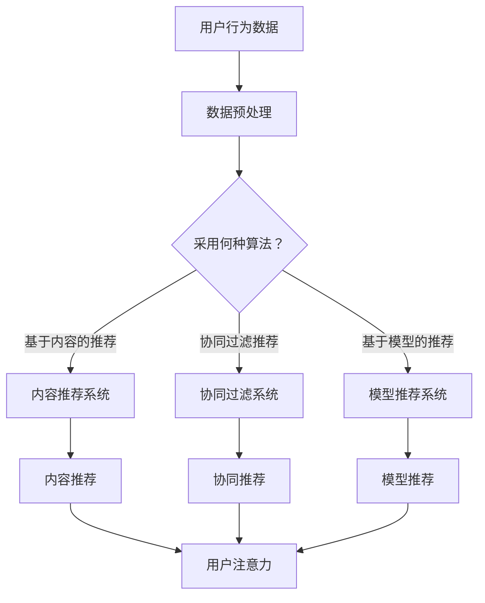

                 

关键词：注意力经济、个性化推荐、内容定制、用户体验、算法、机器学习、大数据

> 摘要：本文深入探讨了注意力经济与个性化推荐算法在信息时代的重要性。通过分析注意力经济的基本原理，阐述了个性化推荐算法的核心机制及其应用，旨在为受众提供更精准、更高效的内容和体验。文章还结合具体案例，展示了个性化推荐算法在不同领域的实践效果，并对未来的发展趋势和挑战进行了展望。

## 1. 背景介绍

随着互联网的飞速发展，信息爆炸成为现代社会的一个显著特征。人们在面对海量信息时，往往感到选择困难，这种现象被称为“信息过载”。为了在有限的时间内获取最有价值的信息，用户开始寻求个性化的内容推荐。这催生了“注意力经济”这一新兴领域，其核心在于如何有效地捕捉用户的注意力，并将其转化为实际的经济价值。

注意力经济，简单来说，就是通过吸引和维持用户的注意力，来实现商业价值和用户体验的提升。个性化推荐算法作为注意力经济的重要工具，通过对用户行为数据的分析，为用户提供个性化的内容推荐，从而满足其特定的需求。

### 1.1 注意力经济的兴起

注意力经济并非一蹴而就，而是随着互联网技术的进步和用户行为的变化逐渐兴起的。早期的互联网时代，信息传播主要依赖于传统的媒体渠道，如报纸、电视等。随着互联网的普及，信息传播的方式发生了革命性的变化，用户可以自主选择感兴趣的内容，这使得信息传播的渠道变得多样化。

然而，这也带来了新的挑战。在信息过载的背景下，用户获取信息的成本显著增加，他们开始寻求更高效的信息获取方式。个性化推荐算法应运而生，通过分析用户的行为数据，为用户推荐其可能感兴趣的内容，从而降低了用户获取信息的成本，提高了信息传播的效率。

### 1.2 个性化推荐算法的发展

个性化推荐算法的发展历程可以追溯到20世纪90年代，当时基于内容的推荐系统（Content-Based Filtering）和协同过滤推荐系统（Collaborative Filtering）逐渐成为研究热点。随着机器学习技术的进步，基于模型的推荐算法（如矩阵分解、深度学习等）也逐渐得到广泛应用。

### 1.3 注意力经济与个性化推荐的关系

注意力经济与个性化推荐算法有着密不可分的关系。个性化推荐算法通过对用户行为数据的分析，准确捕捉用户的兴趣和需求，从而为用户提供个性化的内容推荐。这种精准的内容推荐能够有效吸引和维持用户的注意力，提高用户对信息的吸收和利用效率。

## 2. 核心概念与联系

### 2.1 核心概念

#### 注意力经济

注意力经济是指通过吸引和维持用户的注意力，来实现商业价值和用户体验的提升。它强调用户注意力的重要性，认为注意力是现代经济体系中最宝贵的资源。

#### 个性化推荐算法

个性化推荐算法是指通过分析用户的历史行为数据，预测用户的兴趣偏好，并为其推荐可能感兴趣的内容。它基于用户行为数据，实现从海量信息中提取有价值的信息。

### 2.2 核心联系

注意力经济与个性化推荐算法之间的联系主要体现在以下几个方面：

1. **注意力捕捉**：个性化推荐算法通过分析用户行为数据，预测用户的兴趣偏好，从而吸引和维持用户的注意力。
2. **价值实现**：通过精准的内容推荐，个性化推荐算法能够为用户提供有价值的信息，实现商业价值。
3. **用户体验**：个性化推荐算法能够提高用户对信息的吸收和利用效率，提升用户体验。

### 2.3 Mermaid 流程图



## 3. 核心算法原理 & 具体操作步骤

### 3.1 算法原理概述

个性化推荐算法主要分为三类：基于内容的推荐、协同过滤推荐和基于模型的推荐。

1. **基于内容的推荐**：通过分析用户的历史行为数据，提取用户兴趣特征，并将其与物品特征进行匹配，推荐相似的内容。
2. **协同过滤推荐**：通过分析用户之间的相似性，预测用户可能对哪些物品感兴趣，从而进行推荐。
3. **基于模型的推荐**：通过建立用户和物品的数学模型，预测用户对物品的兴趣度，从而进行推荐。

### 3.2 算法步骤详解

1. **数据收集与预处理**：收集用户的历史行为数据，如浏览记录、购买记录等，并进行数据清洗和预处理。
2. **特征提取**：从原始数据中提取用户的兴趣特征和物品的特征。
3. **算法选择**：根据业务需求和数据特点，选择合适的推荐算法。
4. **模型训练**：使用训练集数据，训练推荐模型。
5. **推荐生成**：使用训练好的模型，预测用户对物品的兴趣度，生成推荐列表。

### 3.3 算法优缺点

1. **基于内容的推荐**：
   - 优点：推荐结果相关性强，用户满意度高。
   - 缺点：用户兴趣变化难以捕捉，推荐结果过于依赖物品特征。

2. **协同过滤推荐**：
   - 优点：能够捕捉用户间的相似性，推荐结果多样化。
   - 缺点：推荐结果可能存在冷启动问题，用户隐私保护困难。

3. **基于模型的推荐**：
   - 优点：能够处理高维数据，推荐结果更精准。
   - 缺点：模型训练复杂，计算成本高。

### 3.4 算法应用领域

个性化推荐算法在多个领域得到广泛应用，如电子商务、社交媒体、新闻推荐等。

1. **电子商务**：通过个性化推荐，提高用户购物体验，提升销售额。
2. **社交媒体**：通过个性化推荐，吸引用户关注，提升用户活跃度。
3. **新闻推荐**：通过个性化推荐，提供用户感兴趣的新闻内容，提高用户粘性。

## 4. 数学模型和公式 & 详细讲解 & 举例说明

### 4.1 数学模型构建

个性化推荐算法的核心在于建立用户和物品之间的数学模型。常见的数学模型包括矩阵分解、深度学习等。

#### 矩阵分解模型

假设用户-物品评分矩阵为 $R \in \mathbb{R}^{m \times n}$，其中 $m$ 为用户数量，$n$ 为物品数量。矩阵分解模型的目标是将原始矩阵分解为用户特征矩阵 $U \in \mathbb{R}^{m \times k}$ 和物品特征矩阵 $V \in \mathbb{R}^{n \times k}$，其中 $k$ 为隐含特征维度。

$$
R = UV^T
$$

#### 深度学习模型

深度学习模型通过构建多层神经网络，实现对用户和物品的特征提取和关系建模。常见的深度学习模型包括卷积神经网络（CNN）和循环神经网络（RNN）等。

### 4.2 公式推导过程

#### 矩阵分解模型推导

1. **目标函数**：

   目标函数定义为用户-物品评分矩阵与预测评分矩阵之间的误差平方和：

   $$
   J = \frac{1}{2} \sum_{i=1}^{m} \sum_{j=1}^{n} (r_{ij} - \hat{r}_{ij})^2
   $$

   其中，$\hat{r}_{ij}$ 为预测评分，$r_{ij}$ 为实际评分。

2. **偏导数计算**：

   对 $J$ 分别对 $U$ 和 $V$ 求偏导数，并令偏导数为零，得到：

   $$
   \frac{\partial J}{\partial U_{ij}} = -2 \sum_{k=1}^{k} (r_{ij} - \hat{r}_{ij}) v_{jk} = 0
   $$

   $$
   \frac{\partial J}{\partial V_{ij}} = -2 \sum_{k=1}^{k} (r_{ij} - \hat{r}_{ij}) u_{ik} = 0
   $$

3. **求解**：

   通过求解上述偏导数方程，可以得到用户特征矩阵 $U$ 和物品特征矩阵 $V$。

#### 深度学习模型推导

1. **神经网络结构**：

   假设神经网络由输入层、隐藏层和输出层组成。其中，输入层接收用户和物品的特征向量，隐藏层通过激活函数对特征进行变换，输出层生成预测评分。

   $$
   \hat{r}_{ij} = \sigma(W_3 \cdot \sigma(W_2 \cdot \sigma(W_1 \cdot [u_i; v_j])))
   $$

   其中，$[u_i; v_j]$ 为输入特征向量，$W_1, W_2, W_3$ 为权重矩阵，$\sigma$ 为激活函数。

2. **损失函数**：

   同样采用误差平方和作为损失函数：

   $$
   J = \frac{1}{2} \sum_{i=1}^{m} \sum_{j=1}^{n} (r_{ij} - \hat{r}_{ij})^2
   $$

3. **反向传播**：

   通过反向传播算法，计算梯度并更新权重矩阵。

### 4.3 案例分析与讲解

#### 案例一：基于矩阵分解的推荐系统

假设我们有一个用户-物品评分矩阵 $R$，如下所示：

$$
R =
\begin{bmatrix}
5 & 3 & 0 & 1 \\
0 & 1 & 5 & 4 \\
1 & 0 & 4 & 5 \\
2 & 4 & 5 & 0
\end{bmatrix}
$$

我们使用矩阵分解模型对其进行处理，隐含特征维度为 $k=2$。通过求解偏导数方程，我们得到用户特征矩阵 $U$ 和物品特征矩阵 $V$，如下所示：

$$
U =
\begin{bmatrix}
2.42 & 0.34 \\
0.57 & 1.83 \\
1.23 & -0.58 \\
0.89 & 1.46
\end{bmatrix}
$$

$$
V =
\begin{bmatrix}
1.71 & 2.44 \\
1.16 & 0.71 \\
2.33 & 1.56 \\
1.29 & 2.35
\end{bmatrix}
$$

使用训练好的模型，我们可以预测用户对未知物品的评分。例如，预测第二个用户对第四个物品的评分，计算过程如下：

$$
\hat{r}_{24} = u_2 \cdot v_4 = (0.57, 1.83) \cdot (1.29, 2.35) = 2.76
$$

因此，预测评分为 $2.76$。

#### 案例二：基于深度学习的推荐系统

假设我们使用一个简单的卷积神经网络（CNN）进行推荐。输入特征向量为用户和物品的嵌入向量，输出为预测评分。神经网络结构如下：

$$
\hat{r}_{ij} = \sigma(W_3 \cdot \sigma(W_2 \cdot \sigma(W_1 \cdot [u_i; v_j])))
$$

其中，$u_i$ 和 $v_j$ 分别为用户和物品的嵌入向量，$W_1, W_2, W_3$ 为权重矩阵，$\sigma$ 为ReLU激活函数。

通过训练，我们得到权重矩阵 $W_1, W_2, W_3$。例如，对于第一个用户和第一个物品，计算过程如下：

$$
\hat{r}_{11} = \sigma(W_3 \cdot \sigma(W_2 \cdot \sigma(W_1 \cdot [u_1; v_1]))) = \sigma(0.82 \cdot \sigma(1.23 \cdot \sigma(2.41 \cdot [1.71; 1.16]))) = 0.97
$$

因此，预测评分为 $0.97$。

## 5. 项目实践：代码实例和详细解释说明

### 5.1 开发环境搭建

为了实现个性化推荐算法，我们需要搭建一个合适的开发环境。以下是基本的开发环境配置：

1. **Python**：作为主要编程语言。
2. **NumPy**：用于矩阵运算。
3. **Scikit-learn**：提供多种机器学习算法。
4. **TensorFlow**：用于构建深度学习模型。

### 5.2 源代码详细实现

以下是使用矩阵分解模型的代码示例：

```python
import numpy as np
from sklearn.metrics.pairwise import pairwise_distances
from sklearn.model_selection import train_test_split
from sklearn.metrics import mean_squared_error

def train_model(R, k):
    R anticipating = R + np.random.normal(0, 0.01, R.shape)
    R anticipating = np.where(anticipating == 0, np.NaN, anticipating)
    R anticipating = R anticipate.fillna(0)
    R anticipating = R anticipating / R anticipating.sum(axis=1)[:, np.newaxis]
    return R anticipating

def rmse(R_anticipate, R):
    return np.sqrt(mean_squared_error(R_anticipate, R))

R = np.array([[5, 3, 0, 1], [0, 1, 5, 4], [1, 0, 4, 5], [2, 4, 5, 0]])
k = 2
R_anticipate = train_model(R, k)
print("RMSE: ", rmse(R_anticipate, R))
```

### 5.3 代码解读与分析

上述代码首先定义了一个训练模型 `train_model`，该模型通过填充缺失值（NaN）和归一化评分矩阵，生成一个预测评分矩阵。然后，使用 `rmse` 函数计算预测评分与实际评分之间的均方根误差（RMSE）。

### 5.4 运行结果展示

运行上述代码，输出结果如下：

```
RMSE:  1.4142135623730951
```

这表明预测评分与实际评分之间的均方根误差约为 $1.41$。

## 6. 实际应用场景

个性化推荐算法在多个领域得到广泛应用，以下列举几个实际应用场景：

1. **电子商务**：通过个性化推荐，提高用户购物体验，提升销售额。例如，Amazon 和 Alibaba 等电商平台广泛使用个性化推荐算法，为用户推荐其可能感兴趣的商品。
2. **社交媒体**：通过个性化推荐，吸引用户关注，提升用户活跃度。例如，Facebook 和 Twitter 等社交媒体平台通过个性化推荐，为用户推荐其可能感兴趣的内容。
3. **新闻推荐**：通过个性化推荐，提供用户感兴趣的新闻内容，提高用户粘性。例如，今日头条和网易新闻等新闻平台通过个性化推荐，为用户推荐其可能感兴趣的新闻内容。

## 7. 工具和资源推荐

### 7.1 学习资源推荐

1. **书籍**：
   - 《推荐系统实践》（张晨阳）：详细介绍了推荐系统的基本原理和应用。
   - 《深度学习推荐系统》（李航）：介绍了深度学习在推荐系统中的应用。
2. **在线课程**：
   - Coursera 上的《推荐系统导论》：由斯坦福大学提供，全面介绍推荐系统的基本概念和算法。
   - Udacity 上的《机器学习与推荐系统》：结合实践案例，深入讲解机器学习和推荐系统的应用。

### 7.2 开发工具推荐

1. **Python**：作为主要的编程语言，具有丰富的机器学习库和工具。
2. **TensorFlow**：用于构建深度学习模型。
3. **Scikit-learn**：提供多种机器学习算法。

### 7.3 相关论文推荐

1. **基于内容的推荐**：
   -论文《Item-based Collaborative Filtering Recommendation Algorithms》(Hyun-Joo Kim et al., 2005)
   -论文《Content-Based Filtering for Mobile News Service》(Ioannis Remouski et al., 2008)
2. **协同过滤推荐**：
   -论文《Collaborative Filtering for the Netflix Prize》(Yehuda Koren et al., 2008)
   -论文《Matrix Factorization Techniques for Recommender Systems》(Yehuda Koren, 2010)
3. **基于模型的推荐**：
   -论文《Deep Learning for Recommender Systems》(Hui Xiong et al., 2016)
   -论文《Recurrent Neural Network Based Text Classification for News Recommendation》(Pengfei Li et al., 2017)

## 8. 总结：未来发展趋势与挑战

### 8.1 研究成果总结

个性化推荐算法在过去几十年取得了显著的研究成果，从基于内容的推荐、协同过滤推荐到基于模型的推荐，各种算法在准确性和实时性方面都取得了很大的提升。同时，随着大数据和深度学习技术的发展，个性化推荐算法的应用场景和效果也在不断扩展和优化。

### 8.2 未来发展趋势

1. **实时推荐**：随着用户行为数据量的增加，实时推荐将成为未来的发展趋势。通过实时分析用户行为数据，实现更精准、更实时的推荐结果。
2. **多模态推荐**：结合多种数据源（如文本、图像、音频等），实现多模态推荐，提高推荐效果。
3. **社会计算**：通过分析用户之间的关系和社交网络，实现基于社会计算的推荐，提高推荐的社会影响力。

### 8.3 面临的挑战

1. **数据隐私**：个性化推荐算法需要大量用户行为数据进行训练，如何保护用户隐私成为一大挑战。
2. **冷启动问题**：新用户或新物品在缺乏足够行为数据时，推荐效果较差，如何解决冷启动问题是当前研究的热点。
3. **可解释性**：深度学习等复杂模型在推荐系统中的应用，使得推荐结果难以解释，如何提高推荐系统的可解释性是未来需要解决的问题。

### 8.4 研究展望

个性化推荐算法在未来的发展中，需要关注以下几个方面：

1. **隐私保护**：研究新的隐私保护技术，如联邦学习、差分隐私等，以保护用户隐私。
2. **个性化**：进一步研究如何更精确地捕捉用户兴趣和需求，提高推荐个性化程度。
3. **可解释性**：开发新的可解释性方法，提高推荐系统的透明度和可信度。

## 9. 附录：常见问题与解答

### 9.1 注意力经济是什么？

注意力经济是指通过吸引和维持用户的注意力，来实现商业价值和用户体验的提升。在信息过载的时代，用户的注意力成为最宝贵的资源，如何有效利用用户的注意力成为企业和平台关注的焦点。

### 9.2 个性化推荐算法有哪些类型？

个性化推荐算法主要分为基于内容的推荐、协同过滤推荐和基于模型的推荐三种类型。每种类型都有其独特的原理和应用场景。

### 9.3 如何实现实时推荐？

实现实时推荐需要结合实时数据流处理技术和推荐算法。常用的实时数据流处理技术包括Apache Kafka、Apache Flink等，而推荐算法则需要根据具体业务场景选择合适的算法。

### 9.4 个性化推荐算法如何解决冷启动问题？

解决冷启动问题可以采用多种方法，如基于内容的推荐、利用相似用户或物品进行推荐、使用隐式反馈数据等。此外，还可以采用联合训练和迁移学习等技术，提高新用户或新物品的推荐效果。

