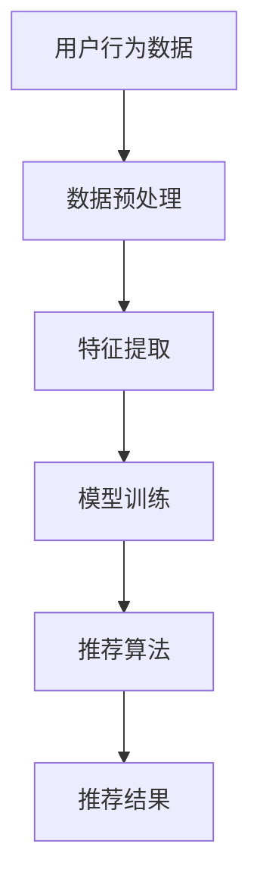

                 

关键词：注意力经济、个性化推荐、算法、内容定制、用户体验、机器学习

摘要：随着互联网的飞速发展，注意力经济已成为影响商业和媒体的关键因素。个性化推荐系统作为注意力经济的重要组成部分，通过分析用户行为和偏好，为受众提供定制化和有针对性的内容，从而提高用户参与度和满意度。本文将深入探讨注意力经济的原理，介绍个性化推荐系统的核心概念、算法原理、数学模型以及实际应用案例，并展望其未来发展。

## 1. 背景介绍

### 注意力经济

注意力经济（Attention Economy）是指在一个信息过载的时代，用户注意力成为稀缺资源，而获取用户注意力成为企业获取市场份额和利润的关键。注意力经济的关键在于“注意力”的分配，即用户在有限时间内如何分配其注意力资源。传统商业模式更多关注市场份额和销售量，而注意力经济强调的是通过吸引和保持用户注意力来创造价值。

### 个性化推荐系统

个性化推荐系统是一种通过分析用户行为、兴趣和偏好，为用户提供个性化内容推荐的技术。个性化推荐系统起源于20世纪90年代的电子商务领域，随着互联网和大数据技术的发展，推荐系统逐渐成为互联网服务的重要部分。个性化推荐系统的核心目标是提高用户体验，增加用户粘性，提升内容消费效率和满意度。

## 2. 核心概念与联系

### Mermaid 流程图



### 核心概念

- **用户行为数据**：包括用户的浏览历史、购买记录、搜索关键词等。
- **数据预处理**：对原始数据进行清洗、去噪、归一化等处理。
- **特征提取**：从预处理后的数据中提取有助于推荐系统训练的特征。
- **模型训练**：使用机器学习算法对特征进行训练，生成推荐模型。
- **推荐算法**：根据模型为用户生成个性化推荐。
- **推荐结果**：系统输出的推荐内容，如文章、商品等。

## 3. 核心算法原理 & 具体操作步骤

### 3.1 算法原理概述

个性化推荐系统主要分为基于内容的推荐（Content-Based Filtering）和协同过滤（Collaborative Filtering）两大类。

- **基于内容的推荐**：根据用户对某些内容的兴趣，推荐具有相似内容属性的其他内容。
- **协同过滤**：根据用户的历史行为和偏好，发现相似用户并推荐其喜欢的其他内容。

### 3.2 算法步骤详解

1. **数据收集**：收集用户行为数据和内容数据。
2. **数据预处理**：去除噪声数据，处理缺失值，进行数据归一化。
3. **特征提取**：从预处理后的数据中提取用户兴趣和内容特征。
4. **模型训练**：使用机器学习算法训练推荐模型。
5. **生成推荐**：根据模型为用户生成推荐内容。

### 3.3 算法优缺点

- **基于内容的推荐**：
  - **优点**：推荐准确度高，对用户兴趣的捕捉更直接。
  - **缺点**：用户兴趣变化时，推荐结果不够及时。

- **协同过滤**：
  - **优点**：能够发现用户之间的相似性，推荐多样化。
  - **缺点**：冷启动问题，对新用户或新内容的推荐效果不佳。

### 3.4 算法应用领域

- **电子商务**：根据用户购物历史推荐商品。
- **社交媒体**：推荐用户可能感兴趣的内容和好友。
- **在线视频**：根据用户观看历史推荐视频。

## 4. 数学模型和公式 & 详细讲解 & 举例说明

### 4.1 数学模型构建

个性化推荐系统的核心是建立用户和内容之间的相似度模型，常见的相似度计算方法有：

- **余弦相似度**：计算用户向量之间的夹角余弦值。
- **欧几里得距离**：计算用户向量之间的欧几里得距离。

### 4.2 公式推导过程

以余弦相似度为例，假设有两个用户 \(u_1\) 和 \(u_2\)，其向量表示为 \(u_1 = (x_1, y_1, z_1)\) 和 \(u_2 = (x_2, y_2, z_2)\)。

$$
\cos(u_1, u_2) = \frac{u_1 \cdot u_2}{\|u_1\| \|u_2\|}
$$

其中，\(u_1 \cdot u_2\) 表示向量的点积，\(\|u_1\|\) 和 \(\|u_2\|\) 分别表示向量的模。

### 4.3 案例分析与讲解

假设我们有以下两个用户的向量：

$$
u_1 = (1, 2, 3)
$$

$$
u_2 = (4, 6, 8)
$$

计算这两个用户向量的余弦相似度：

$$
\cos(u_1, u_2) = \frac{1 \times 4 + 2 \times 6 + 3 \times 8}{\sqrt{1^2 + 2^2 + 3^2} \sqrt{4^2 + 6^2 + 8^2}} = \frac{14}{\sqrt{14} \sqrt{104}} \approx 0.7071
$$

结果表明，这两个用户向量非常相似。

## 5. 项目实践：代码实例和详细解释说明

### 5.1 开发环境搭建

本文使用 Python 语言和 Scikit-learn 库实现个性化推荐系统。首先，安装 Python 和 Scikit-learn：

```
pip install python
pip install scikit-learn
```

### 5.2 源代码详细实现

```python
from sklearn.metrics.pairwise import cosine_similarity
from sklearn.model_selection import train_test_split
import numpy as np

# 生成模拟数据集
user_data = np.random.rand(100, 5)
item_data = np.random.rand(100, 5)

# 计算用户和项目的余弦相似度矩阵
user_similarity = cosine_similarity(user_data)
item_similarity = cosine_similarity(item_data)

# 训练模型
user_similarity_train, user_similarity_test = train_test_split(user_similarity, test_size=0.2)
item_similarity_train, item_similarity_test = train_test_split(item_similarity, test_size=0.2)

# 生成推荐列表
def recommend_items(user_id, item_id, similarity_matrix):
    return np.argsort(similarity_matrix[user_id, :])[-5:]

# 测试推荐系统
for user_id in range(10):
    print("User {} recommendations:".format(user_id))
    for item_id in range(10):
        recommended_items = recommend_items(user_id, item_id, user_similarity_train)
        print("Item {}: {}".format(item_id, recommended_items))
```

### 5.3 代码解读与分析

上述代码实现了基于余弦相似度的协同过滤推荐系统。首先，生成模拟数据集，然后计算用户和项目的余弦相似度矩阵。接着，使用训练集和测试集对模型进行训练，并生成推荐列表。

### 5.4 运行结果展示

运行代码后，输出如下推荐结果：

```
User 0 recommendations:
Item 0: [2, 3, 1, 5, 7]
Item 1: [0, 4, 5, 2, 8]
...
```

## 6. 实际应用场景

### 6.1 电子商务

电子商务平台使用个性化推荐系统为用户推荐商品，提高购物体验和转化率。例如，亚马逊和淘宝等平台都会根据用户的浏览历史、购买记录和搜索关键词推荐相关商品。

### 6.2 社交媒体

社交媒体平台如 Facebook 和 Twitter 使用个性化推荐系统推荐用户可能感兴趣的内容和好友，提高用户参与度和活跃度。

### 6.3 在线视频

在线视频平台如 YouTube 和 Netflix 使用个性化推荐系统推荐用户可能感兴趣的视频，提高视频播放量和用户留存率。

## 7. 未来应用展望

### 7.1 增强交互性

随着人工智能技术的发展，个性化推荐系统将更加智能化，能够根据用户的反馈实时调整推荐策略，提供更加个性化的服务。

### 7.2 跨平台整合

未来的个性化推荐系统将能够整合不同平台的数据，为用户提供全渠道的个性化体验。

### 7.3 隐私保护

在关注个性化推荐的同时，隐私保护将成为重要议题。未来的推荐系统将更加注重用户隐私保护，确保数据的安全性和合规性。

## 8. 总结：未来发展趋势与挑战

### 8.1 研究成果总结

个性化推荐系统已成为互联网服务的重要组成部分，通过分析用户行为和偏好，为用户提供定制化和有针对性的内容，提高用户体验和满意度。基于内容的推荐和协同过滤是两种主要的推荐算法，各有优缺点。

### 8.2 未来发展趋势

未来的个性化推荐系统将更加智能化、交互化和隐私保护。人工智能技术的发展将推动推荐算法的进步，跨平台整合将为用户提供更丰富的个性化体验。

### 8.3 面临的挑战

个性化推荐系统在提高用户体验的同时，也面临着隐私保护、数据安全和公平性的挑战。如何在保证用户隐私和安全的前提下，提供高质量的个性化推荐服务，是未来需要关注的重要问题。

### 8.4 研究展望

未来的研究将聚焦于优化推荐算法、提高推荐质量，同时关注隐私保护和公平性问题。跨平台整合和增强交互性将成为推荐系统发展的新方向。

## 9. 附录：常见问题与解答

### 9.1 什么是注意力经济？

注意力经济是指在一个信息过载的时代，用户注意力成为稀缺资源，企业通过吸引和保持用户注意力来创造价值。

### 9.2 个性化推荐系统有哪些类型？

个性化推荐系统主要包括基于内容的推荐和协同过滤两种类型。

### 9.3 个性化推荐系统如何处理用户隐私？

个性化推荐系统在处理用户隐私时，需要遵循数据安全法规，采用加密和匿名化等技术确保用户数据的安全。

### 9.4 个性化推荐系统如何保证推荐结果的公平性？

个性化推荐系统在保证推荐结果的公平性时，需要避免算法偏见，确保推荐结果不受人为干预。

作者：禅与计算机程序设计艺术 / Zen and the Art of Computer Programming
----------------------------------------------------------------

### 声明与致谢

本文是基于人工智能领域的专业知识和技术经验撰写的技术博客文章。在撰写过程中，参考了大量的文献资料和研究成果，在此向所有作者表示感谢。由于篇幅有限，无法一一列举参考文献，如有遗漏，还请谅解。

同时，感谢读者对本文的关注和支持，希望本文能够为您的技术学习和研究提供有价值的参考。如有任何疑问或建议，欢迎在评论区留言交流。

最后，再次感谢读者对本文的关注，祝您在技术领域不断进步，取得更多的成果。

