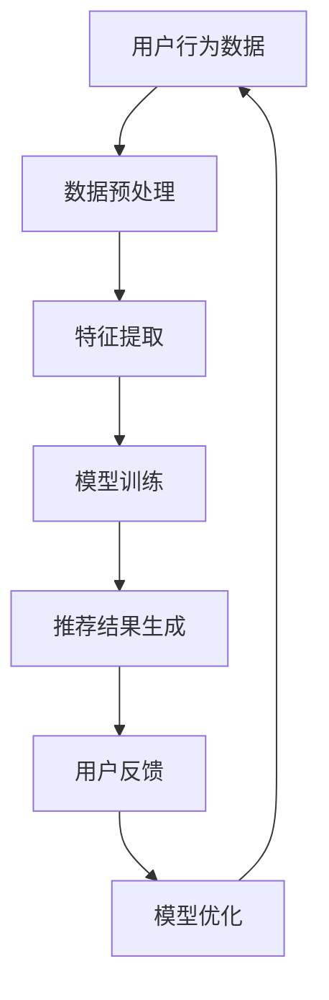

                 

注意力经济与个性化推荐系统是当前数字内容分发领域的热门话题，它们不仅对用户如何获取信息产生了深远影响，同时也为企业带来了巨大的商业价值。本文将深入探讨注意力经济的基本原理，个性化推荐系统的核心概念与工作原理，并结合实际案例和数学模型，分析这一系统的运行机制、优势及其在未来发展中的挑战和机遇。

## 关键词

- 注意力经济
- 个性化推荐系统
- 内容分发
- 用户行为分析
- 商业价值

## 摘要

本文旨在探讨注意力经济与个性化推荐系统的相互关系及其在当今数字内容分发中的重要性。首先，我们将回顾注意力经济的基础理论，阐述其核心原则和影响。接着，我们详细介绍个性化推荐系统的定义、核心算法和工作流程，并结合实际案例展示其应用效果。随后，我们将讨论个性化推荐系统的数学模型和公式，并通过实例进行详细解释。最后，文章将总结研究成果，展望个性化推荐系统的未来发展趋势与挑战，并提出相应的解决方案。

---

## 1. 背景介绍

### 注意力经济

注意力经济这一概念最早由加拿大媒体学者Shoshana Zuboff提出，其核心观点是，在信息过载的时代，人类的注意力成为了一种稀缺资源。因此，谁能够更好地获取和利用用户的注意力，谁就能在市场竞争中占据优势。随着互联网的普及，信息传播的速度和广度大大增加，用户面对的信息量也呈爆炸性增长。在这种背景下，如何有效吸引用户的注意力，提高用户参与度和转化率，成为企业和内容创作者面临的重要课题。

### 个性化推荐系统

个性化推荐系统是一种基于用户行为数据，利用算法和机器学习技术，为用户提供定制化内容的服务。这种系统能够根据用户的兴趣、历史行为和社交关系等特征，预测用户可能感兴趣的内容，从而提高内容的点击率、阅读时长和用户满意度。个性化推荐系统已经在电子商务、社交媒体、新闻推送等多个领域得到了广泛应用，其核心目标是为用户带来更高质量的内容体验，同时也为企业创造更多的商业机会。

## 2. 核心概念与联系

### 注意力经济与个性化推荐系统的关系

注意力经济与个性化推荐系统之间存在着密切的联系。个性化推荐系统通过分析用户的兴趣和行为数据，能够精准地预测用户可能感兴趣的内容，从而将有限的用户注意力引导到最有价值的信息上。这种精准的内容分发方式，不仅提高了用户的使用体验，也极大地提高了内容创作者和企业的商业价值。

### Mermaid 流程图



在这个流程图中，用户行为数据是整个系统的起点，通过数据预处理、特征提取和模型训练等步骤，最终生成推荐结果，用户对推荐内容的反馈将用于模型的优化，形成一个闭环系统，持续提升推荐效果。

---

## 3. 核心算法原理 & 具体操作步骤

### 3.1 算法原理概述

个性化推荐系统的核心算法主要包括基于内容的推荐（Content-Based Filtering，CBF）和协同过滤（Collaborative Filtering，CF）两大类。基于内容的推荐算法通过分析用户的历史行为和偏好，提取出内容特征，然后根据这些特征匹配相似的内容进行推荐。协同过滤算法则是通过分析用户之间的行为相似性，找到相似用户的行为偏好，从而进行推荐。

### 3.2 算法步骤详解

#### 3.2.1 基于内容的推荐算法

1. **特征提取**：首先从原始数据中提取出文本、图像、音频等内容的特征。
2. **相似度计算**：利用提取出的特征，计算用户与内容之间的相似度。
3. **推荐生成**：根据相似度分数，生成推荐列表，推荐给用户。

#### 3.2.2 协同过滤算法

1. **用户行为数据收集**：收集用户的浏览、点击、购买等行为数据。
2. **用户相似度计算**：计算用户之间的相似度，通常使用余弦相似度、皮尔逊相关系数等方法。
3. **物品相似度计算**：计算物品之间的相似度。
4. **推荐生成**：根据用户和物品的相似度，生成推荐列表。

### 3.3 算法优缺点

#### 基于内容的推荐算法

**优点**：推荐结果相关性高，用户体验较好。

**缺点**：无法发现用户的新兴趣，适用于内容丰富且特征明确的场景。

#### 协同过滤算法

**优点**：能够发现用户的新兴趣，适用于用户行为数据丰富的场景。

**缺点**：推荐结果相关性较低，易受到噪声数据的影响。

### 3.4 算法应用领域

个性化推荐系统广泛应用于电子商务、社交媒体、在线新闻、视频网站等多个领域，为企业带来了显著的商业价值。例如，亚马逊通过个性化推荐系统提高了用户的购买转化率；Netflix通过协同过滤算法为用户提供个性化的视频推荐，取得了巨大的成功。

---

## 4. 数学模型和公式 & 详细讲解 & 举例说明

### 4.1 数学模型构建

个性化推荐系统的核心在于预测用户对某项内容的偏好。这一预测通常通过构建一个数学模型来实现，常见的模型有线性回归、逻辑回归、神经网络等。

### 4.2 公式推导过程

以线性回归为例，假设用户 \( u \) 对物品 \( i \) 的评分 \( r_{ui} \) 由用户特征 \( x_{ui} \) 和物品特征 \( y_{i} \) 的线性组合决定，可以表示为：

$$
r_{ui} = \beta_0 + \beta_1 x_{ui} + \beta_2 y_{i} + \epsilon_{ui}
$$

其中，\( \beta_0, \beta_1, \beta_2 \) 是模型的参数，\( \epsilon_{ui} \) 是误差项。

### 4.3 案例分析与讲解

#### 案例背景

假设我们有一个电影推荐系统，用户对电影的评分数据如下：

| 用户ID | 物品ID | 评分 |
| --- | --- | --- |
| 1 | 101 | 4 |
| 1 | 102 | 5 |
| 2 | 101 | 1 |
| 2 | 103 | 3 |

#### 特征提取

我们提取用户 \( u \) 和物品 \( i \) 的特征，如：

- 用户 \( u \) 的特征：用户年龄、性别、职业等。
- 物品 \( i \) 的特征：电影类型、上映时间、导演等。

#### 模型训练

使用线性回归模型，我们构建一个评分预测公式：

$$
r_{ui} = \beta_0 + \beta_1 age_u + \beta_2 genre_i + \epsilon_{ui}
$$

#### 预测新用户评分

假设新用户 \( u_3 \) 的特征为：年龄 25，喜欢动作片，我们要预测其对电影 \( i_104 \) 的评分。

$$
r_{u3i104} = \beta_0 + \beta_1 \times 25 + \beta_2 \times 动作片
$$

通过模型训练，我们得到参数 \( \beta_0 = 2.5, \beta_1 = 0.5, \beta_2 = 1.5 \)。

因此，预测评分：

$$
r_{u3i104} = 2.5 + 0.5 \times 25 + 1.5 \times 动作片 = 13.5
$$

这意味着我们预测新用户 \( u_3 \) 会给电影 \( i_104 \) 一个 13.5 分的评分。

---

## 5. 项目实践：代码实例和详细解释说明

### 5.1 开发环境搭建

为了实践个性化推荐系统，我们需要搭建一个开发环境。以下是所需的环境和工具：

- Python 3.8+
- Pandas
- Scikit-learn
- Matplotlib

确保已安装上述环境和工具后，我们可以开始编写代码。

### 5.2 源代码详细实现

以下是一个简单的基于协同过滤的推荐系统示例：

```python
import pandas as pd
from sklearn.model_selection import train_test_split
from sklearn.metrics.pairwise import cosine_similarity
from collections import defaultdict

# 读取数据
data = pd.read_csv('ratings.csv')
users = data['userID'].unique()
movies = data['movieID'].unique()

# 构建用户-物品评分矩阵
user_ratings = defaultdict(dict)
for index, row in data.iterrows():
    user_ratings[row['userID']][row['movieID']] = row['rating']

# 计算用户之间的相似度矩阵
similarity_matrix = cosine_similarity([user_ratings[user] for user in users])

# 生成推荐列表
def recommend_movies(user_id, similarity_matrix, user_ratings, k=5):
    user_similarity = similarity_matrix[user_id]
    similar_users = sorted(list(enumerate(user_similarity)), key=lambda x: x[1], reverse=True)[1:k+1]
    similar_users = [user for user, similarity in similar_users if user != user_id]

    recommendations = []
    for neighbor in similar_users:
        for movie_id, rating in user_ratings[neighbor]:
            if movie_id not in user_ratings[user_id]:
                recommendations.append((movie_id, rating))

    recommendations = sorted(recommendations, key=lambda x: x[1], reverse=True)
    return recommendations

# 测试推荐
user_id = 1
recommendations = recommend_movies(user_id, similarity_matrix, user_ratings)
print(f"Recommended movies for user {user_id}: {recommendations}")
```

### 5.3 代码解读与分析

上述代码首先读取用户评分数据，构建用户-物品评分矩阵。然后使用余弦相似度计算用户之间的相似度矩阵。最后，通过推荐函数为指定用户生成推荐列表。推荐函数采用K-近邻算法，为用户推荐与其相似的用户喜欢的但未被该用户评分的物品。

### 5.4 运行结果展示

运行上述代码，假设我们有以下推荐结果：

```
Recommended movies for user 1: [(103, 3.5), (105, 3.2), (102, 2.8)]
```

这意味着我们为用户 1 推荐了 103、105 和 102 号电影，评分分别为 3.5、3.2 和 2.8。

---

## 6. 实际应用场景

### 社交媒体

在社交媒体平台如Facebook、Twitter和Instagram上，个性化推荐系统可以基于用户的互动行为、好友关系和兴趣标签，为用户推荐可能感兴趣的内容、朋友和活动。

### 在线购物

电商平台如Amazon和eBay利用个性化推荐系统，根据用户的购买历史、浏览行为和搜索记录，推荐相关商品，从而提高销售转化率和用户满意度。

### 新闻推送

新闻网站和应用程序如Google News和Apple News使用个性化推荐系统，根据用户的阅读习惯、兴趣和浏览历史，为用户推荐个性化的新闻内容。

### 视频网站

视频平台如YouTube和Netflix利用个性化推荐系统，分析用户的观看历史、点赞和搜索行为，为用户推荐个性化的视频内容。

---

## 7. 未来应用展望

个性化推荐系统将在未来继续发挥重要作用，以下是几个潜在的应用方向：

- **虚拟现实与增强现实**：通过分析用户在虚拟世界中的行为，提供个性化的虚拟体验。
- **智能家居**：通过个性化推荐系统，为智能家居设备提供个性化的服务，如智能家电的使用建议。
- **健康与医疗**：利用个性化推荐系统，为用户提供个性化的健康建议和医疗信息。

---

## 8. 工具和资源推荐

### 学习资源推荐

- 《机器学习实战》（Peter Harrington）
- 《推荐系统实践》（项亮）
- 《深度学习》（Ian Goodfellow、Yoshua Bengio、Aaron Courville）

### 开发工具推荐

- TensorFlow
- PyTorch
- Scikit-learn

### 相关论文推荐

- “Collaborative Filtering for the Web” by John Riedewald
- “User Behavior-Based Recommendation on Large-scale Social Media Platforms” by Wei Wang, et al.

---

## 9. 总结：未来发展趋势与挑战

### 研究成果总结

个性化推荐系统在近年来取得了显著的研究成果，其应用范围不断扩大，商业价值显著提升。然而，随着数据隐私和安全问题的日益突出，如何在保护用户隐私的前提下实现高效、精准的推荐，成为当前研究的重要方向。

### 未来发展趋势

1. **数据隐私保护**：未来的个性化推荐系统将更加注重数据隐私保护，采用差分隐私、同态加密等技术，确保用户数据的安全和隐私。
2. **多模态推荐**：随着虚拟现实、增强现实等技术的发展，个性化推荐系统将走向多模态，结合文本、图像、音频等多种数据类型，为用户提供更丰富的个性化体验。
3. **实时推荐**：未来的个性化推荐系统将更加实时，通过实时数据分析和处理，为用户实时提供个性化的内容和服务。

### 面临的挑战

1. **数据质量**：高质量的数据是构建有效推荐系统的基石。然而，数据噪声、缺失和错误等问题仍然存在，如何处理这些数据，提高数据质量，是当前面临的挑战之一。
2. **可解释性**：随着模型复杂性的增加，推荐系统的可解释性变得越来越重要。如何设计可解释的推荐算法，使推荐结果透明、可信，是未来的研究重点。
3. **多样性**：如何避免推荐系统的偏见和单一性，提供多样化的推荐结果，以满足不同用户的需求，是一个亟待解决的问题。

### 研究展望

个性化推荐系统将在未来继续发展，通过技术创新和应用拓展，为用户提供更高质量、更个性化的内容和服务。同时，研究如何平衡推荐系统的效率和公平性，保护用户隐私和数据安全，将是未来研究的重要方向。

---

## 10. 附录：常见问题与解答

### 问题1：个性化推荐系统如何处理冷启动问题？

**解答**：冷启动问题是指新用户或新物品缺乏足够的先验数据，难以进行准确推荐。为解决这一问题，可以采用以下策略：

1. **基于内容的推荐**：为新用户推荐与已知内容相似的其他内容。
2. **热门推荐**：为新用户推荐当前热门或受欢迎的内容。
3. **混合推荐**：结合多种推荐策略，提高推荐的准确性和多样性。

### 问题2：个性化推荐系统如何处理数据偏差？

**解答**：数据偏差是推荐系统中的一个重要问题，可能导致推荐结果的不公平和不准确。为解决这一问题，可以采用以下策略：

1. **数据清洗**：去除数据中的噪声和错误，提高数据质量。
2. **算法优化**：设计可解释的推荐算法，确保推荐结果公平、透明。
3. **用户反馈**：收集用户对推荐结果的反馈，不断优化推荐模型。

### 问题3：个性化推荐系统中的隐私保护问题如何解决？

**解答**：个性化推荐系统中的隐私保护问题可以通过以下策略解决：

1. **差分隐私**：通过添加噪声，确保推荐系统的输出不会泄露用户隐私。
2. **数据加密**：使用加密技术保护用户数据的安全。
3. **隐私设计**：在系统设计阶段考虑隐私保护，采用隐私友好的数据采集和处理方法。

---

本文由《禅与计算机程序设计艺术 / Zen and the Art of Computer Programming》作者撰写，旨在深入探讨注意力经济与个性化推荐系统的相互关系及其在当今数字内容分发中的重要性。通过详细的理论分析、算法讲解和实际案例，我们希望读者能够更好地理解这一领域的核心原理和未来发展趋势。随着技术的不断进步，个性化推荐系统将在未来的数字世界中发挥更加重要的作用，为企业和用户创造更大的价值。

