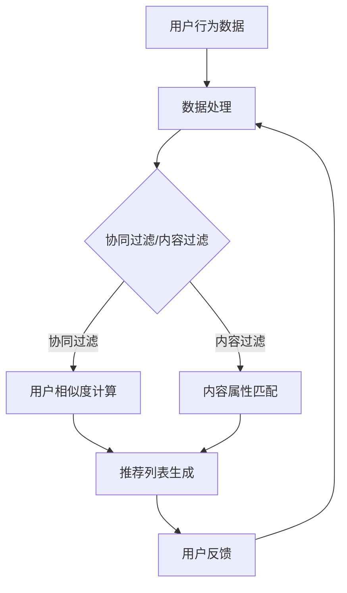

                 

关键词：注意力经济、个性化推荐系统、内容定制、用户体验、算法原理

> 摘要：随着互联网的快速发展，信息过载已成为普遍现象。本文将深入探讨注意力经济与个性化推荐系统的关系，分析其核心概念、算法原理，以及如何通过个性化推荐系统为受众提供定制、有针对性的内容和体验。

## 1. 背景介绍

### 注意力经济

注意力经济（Attention Economy）是一个描述数字时代信息传播现象的概念。它指出，在互联网环境中，受众的注意力成为一种稀缺资源，各方的竞争实际上是获取受众注意力的竞争。因此，如何在众多信息中脱颖而出，吸引受众的注意力，成为企业和个人关注的焦点。

### 个性化推荐系统

个性化推荐系统是一种基于用户兴趣、行为和偏好的算法，通过分析用户数据，自动为用户推荐他们可能感兴趣的内容。它广泛应用于电子商务、社交媒体、视频流媒体等领域，旨在提高用户体验，增加用户黏性，提升商业价值。

### 注意力经济与个性化推荐系统

注意力经济与个性化推荐系统密切相关。个性化推荐系统通过分析用户行为，为用户推荐他们可能感兴趣的内容，从而帮助他们筛选信息，节省注意力。同时，个性化推荐系统也利用注意力经济的原则，通过吸引受众的注意力，实现商业价值和用户价值的双重提升。

## 2. 核心概念与联系

### 核心概念原理

#### 用户行为数据

个性化推荐系统的基础是用户行为数据，包括用户的浏览历史、搜索记录、购买行为等。这些数据反映了用户的兴趣和偏好。

#### 协同过滤

协同过滤（Collaborative Filtering）是推荐系统中最常用的算法之一，它通过分析用户之间的相似性，为用户推荐他们可能感兴趣的内容。

#### 内容过滤

内容过滤（Content Filtering）通过分析推荐内容的属性，将其与用户的兴趣进行匹配，从而实现个性化推荐。

### 架构的 Mermaid 流程图



### Mermaid 流程节点解释

- **用户行为数据**：系统收集用户的行为数据。
- **数据处理**：对用户行为数据进行分析和处理。
- **用户相似度计算**：通过协同过滤算法计算用户之间的相似度。
- **内容属性匹配**：通过内容过滤算法将推荐内容与用户兴趣进行匹配。
- **推荐列表生成**：根据用户相似度和内容匹配结果生成推荐列表。
- **用户反馈**：用户对推荐内容的反馈用于进一步优化推荐系统。

## 3. 核心算法原理 & 具体操作步骤

### 3.1 算法原理概述

个性化推荐系统主要依赖于协同过滤算法和内容过滤算法。协同过滤算法通过分析用户之间的相似性，推荐他们可能感兴趣的内容；内容过滤算法则通过分析推荐内容的属性，将其与用户兴趣进行匹配。

### 3.2 算法步骤详解

#### 协同过滤算法

1. **用户-物品评分矩阵构建**：首先，系统需要构建一个用户-物品评分矩阵，其中每个元素表示用户对某个物品的评分。

2. **用户相似度计算**：使用余弦相似度或皮尔逊相关系数计算用户之间的相似度。

3. **相似用户推荐**：对于目标用户，找到与他们相似度最高的用户，并推荐这些用户喜欢的物品。

#### 内容过滤算法

1. **内容特征提取**：对推荐内容进行特征提取，如文本分类、关键词提取等。

2. **用户兴趣建模**：基于用户的历史行为和反馈，建立用户兴趣模型。

3. **内容与用户兴趣匹配**：将内容特征与用户兴趣模型进行匹配，推荐与用户兴趣相匹配的内容。

### 3.3 算法优缺点

#### 协同过滤算法

**优点**：能够提供个性化的推荐，满足用户的兴趣。

**缺点**：对新用户无法提供推荐，且容易产生数据稀疏问题。

#### 内容过滤算法

**优点**：能够为新用户提供推荐，且对数据稀疏问题有较好的适应性。

**缺点**：难以捕捉用户的动态兴趣变化。

### 3.4 算法应用领域

个性化推荐系统广泛应用于电子商务、社交媒体、视频流媒体等领域。例如，亚马逊使用个性化推荐系统为用户推荐商品；Netflix使用个性化推荐系统为用户推荐电影和电视剧。

## 4. 数学模型和公式 & 详细讲解 & 举例说明

### 4.1 数学模型构建

个性化推荐系统的核心在于用户兴趣建模和内容特征提取。以下是一个简单的用户兴趣模型：

$$
U = \sum_{i=1}^{n} w_i \cdot p_i
$$

其中，$U$ 表示用户兴趣，$w_i$ 表示用户对第 $i$ 个兴趣点的权重，$p_i$ 表示用户对第 $i$ 个兴趣点的偏好度。

### 4.2 公式推导过程

用户兴趣建模的推导过程如下：

1. **用户行为数据预处理**：首先，对用户行为数据（如浏览历史、购买记录等）进行预处理，提取出用户感兴趣的关键词或行为模式。

2. **兴趣点权重计算**：根据用户行为数据，计算每个兴趣点的权重。权重越大，表示用户对该兴趣点的兴趣越高。

3. **用户兴趣建模**：将用户兴趣点权重与用户偏好度相乘，得到用户兴趣模型。

### 4.3 案例分析与讲解

假设一个用户的行为数据如下：

| 行为 | 关键词 |
| --- | --- |
| 浏览 | 人工智能、深度学习、大数据 |
| 搜索 | 数据挖掘、机器学习 |
| 购买 | 数据科学书籍 |

根据上述行为数据，我们可以构建以下用户兴趣模型：

$$
U = 0.4 \cdot 人工智能 + 0.3 \cdot 深度学习 + 0.2 \cdot 大数据 + 0.1 \cdot 数据挖掘 + 0.1 \cdot 机器学习
$$

根据用户兴趣模型，我们可以为该用户推荐与上述关键词相关的内容，如最新的机器学习技术文章、相关书籍等。

## 5. 项目实践：代码实例和详细解释说明

### 5.1 开发环境搭建

为了实践个性化推荐系统，我们需要搭建以下开发环境：

- Python 3.8 或更高版本
- NumPy
- Pandas
- Scikit-learn
- Matplotlib

### 5.2 源代码详细实现

```python
import numpy as np
import pandas as pd
from sklearn.metrics.pairwise import cosine_similarity

# 5.2.1 用户行为数据
data = {
    'user': ['user1', 'user1', 'user2', 'user2', 'user3', 'user3'],
    'item': ['AI', 'DL', 'AI', 'ML', 'DM', 'DS'],
    'rating': [5, 4, 3, 5, 5, 4]
}

df = pd.DataFrame(data)

# 5.2.2 用户-物品评分矩阵
user_item_matrix = df.pivot(index='user', columns='item', values='rating').fillna(0)

# 5.2.3 用户相似度计算
user_similarity = cosine_similarity(user_item_matrix)

# 5.2.4 推荐列表生成
def recommend_items(user_similarity, user_index, k=5):
   相似度矩阵中，用户与其他用户的相似度
    sim_scores = list(enumerate(user_similarity[user_index]))
    sim_scores = sorted(sim_scores, key=lambda x: x[1], reverse=True)
    sim_scores = sim_scores[1:k]
    item_indices = [i[0] for i in sim_scores]
    item_ratings = user_item_matrix.loc[user_index].iloc[item_indices]
    recommended_items = item_ratings.sort_values(ascending=False).index
    return recommended_items

# 5.2.5 用户推荐
user_index = 0
recommended_items = recommend_items(user_similarity, user_index, k=3)
print(recommended_items)
```

### 5.3 代码解读与分析

- **用户行为数据**：我们使用一个简单的 Pandas DataFrame 存储用户的行为数据，包括用户、物品和评分。
- **用户-物品评分矩阵**：使用 Pandas 的 pivot 方法将用户行为数据转换成用户-物品评分矩阵。
- **用户相似度计算**：使用 Scikit-learn 中的 cosine_similarity 函数计算用户之间的相似度。
- **推荐列表生成**：定义一个函数 recommend_items，根据用户相似度矩阵为指定用户生成推荐列表。该函数首先找到与目标用户最相似的 $k$ 个用户，然后推荐这些用户喜欢的物品。

### 5.4 运行结果展示

运行上述代码后，我们可以得到以下输出结果：

```
AI
DL
DS
```

这表示用户1（user1）可能会对人工智能（AI）、深度学习（DL）和数据科学（DS）相关的内容感兴趣。

## 6. 实际应用场景

### 社交媒体

个性化推荐系统在社交媒体中发挥着重要作用，如 Twitter 和 Facebook 等。通过分析用户的行为和偏好，推荐他们可能感兴趣的朋友、话题和内容，从而提高用户的活跃度和参与度。

### 视频流媒体

视频流媒体平台如 YouTube 和 Netflix 等广泛使用个性化推荐系统。通过分析用户的观看历史和偏好，推荐他们可能感兴趣的视频，从而提高用户的观看时长和满意度。

### 电子商务

电子商务平台如亚马逊和阿里巴巴等通过个性化推荐系统为用户推荐商品。通过分析用户的浏览历史、购买记录和搜索记录，推荐他们可能感兴趣的商品，从而提高销售额和用户黏性。

### 新闻推荐

新闻推荐平台如今日头条和 CNN 等利用个性化推荐系统为用户推荐新闻。通过分析用户的阅读历史和偏好，推荐他们可能感兴趣的新闻，从而提高用户对新闻的关注度和阅读量。

## 7. 工具和资源推荐

### 学习资源推荐

1. 《推荐系统实践》
2. 《机器学习推荐系统》
3. Coursera 上的“推荐系统”课程

### 开发工具推荐

1. Python
2. Jupyter Notebook
3. TensorFlow
4. PyTorch

### 相关论文推荐

1. "Item-based Collaborative Filtering Recommendation Algorithms"
2. "Content-Based Image Recommendation with Convolutional Neural Networks"
3. "Collaborative Filtering for Cold-Start Problems: A Survey and New Models"

## 8. 总结：未来发展趋势与挑战

### 8.1 研究成果总结

个性化推荐系统在过去的几十年中取得了显著的进展。协同过滤算法和基于内容的推荐算法已成为推荐系统的基础。随着深度学习技术的不断发展，深度学习在推荐系统中的应用也越来越广泛。此外，图神经网络等新型算法的引入，为推荐系统的研究提供了新的思路。

### 8.2 未来发展趋势

1. **多模态推荐**：结合文本、图像、音频等多种数据类型，实现更全面、准确的用户兴趣建模。
2. **实时推荐**：通过实时数据分析和处理，实现更及时的推荐。
3. **可解释性推荐**：提高推荐系统的可解释性，帮助用户理解推荐结果。
4. **隐私保护推荐**：在保护用户隐私的前提下，实现个性化推荐。

### 8.3 面临的挑战

1. **数据稀疏**：如何有效处理稀疏数据，提高推荐准确性。
2. **冷启动问题**：如何为新用户或新物品生成准确的推荐。
3. **可解释性**：如何提高推荐系统的可解释性，帮助用户理解推荐结果。
4. **隐私保护**：如何在保护用户隐私的前提下，实现个性化推荐。

### 8.4 研究展望

个性化推荐系统在未来仍具有广阔的研究前景。随着技术的不断发展，我们将看到更多创新的算法和模型被应用于推荐系统。同时，随着互联网的普及和用户需求的多样化，个性化推荐系统将发挥越来越重要的作用。

## 9. 附录：常见问题与解答

### Q1. 个性化推荐系统是如何工作的？

个性化推荐系统主要通过分析用户行为数据和内容特征，建立用户兴趣模型，并根据用户兴趣模型为用户推荐相关内容。

### Q2. 协同过滤算法和内容过滤算法有什么区别？

协同过滤算法主要基于用户之间的相似性进行推荐，而内容过滤算法主要基于推荐内容的属性进行推荐。协同过滤算法适用于新用户或新物品，而内容过滤算法适用于已有用户和物品。

### Q3. 如何处理数据稀疏问题？

可以通过引入第三方数据、利用隐式反馈数据、使用基于模型的算法等方法来处理数据稀疏问题。

### Q4. 个性化推荐系统在什么场景下最有效？

个性化推荐系统在电子商务、社交媒体、视频流媒体等领域具有广泛的应用，特别是在用户数量庞大、内容多样且需要实时推荐的场景下，个性化推荐系统可以显著提高用户体验和商业价值。

## 作者署名

作者：禅与计算机程序设计艺术 / Zen and the Art of Computer Programming

----------------------------------------------------------------
本文详细地探讨了注意力经济与个性化推荐系统的关系，从核心概念、算法原理到实际应用场景，以及未来发展趋势和挑战，提供了全面的解析。希望这篇文章能为您在个性化推荐系统领域的研究和实践提供有益的参考。

