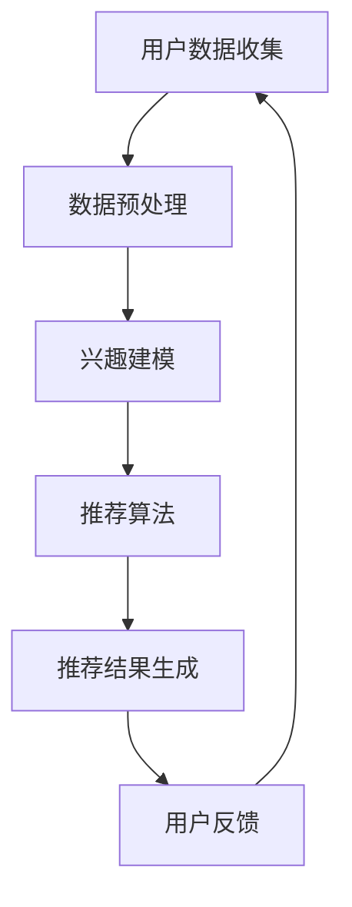

                 

关键词：注意力经济、个性化推荐、定制内容、针对性内容、受众、用户体验

> 摘要：本文将探讨注意力经济与个性化推荐技术的结合，以及如何为受众提供定制、有针对性的内容。通过分析注意力经济的原理，解释个性化推荐算法的基本概念、原理和实现方法，并结合实际案例，阐述个性化推荐在实际应用场景中的重要性。最后，对个性化推荐技术未来的发展进行展望。

## 1. 背景介绍

### 注意力经济

随着互联网的快速发展，信息爆炸成为时代特征。人们每天接触到大量的信息，但能够集中注意力的时间却极为有限。这种有限的时间资源形成了注意力经济的基础。注意力经济关注的是如何在纷繁复杂的信息中抓住受众的注意力，从而实现信息的有效传播和价值的最大化。

### 个性化推荐

个性化推荐技术通过分析用户的兴趣和行为数据，为用户提供定制化的内容推荐。它已成为互联网领域中的一大热点，广泛应用于电商、媒体、社交网络等多个领域。个性化推荐不仅能够提高用户满意度，还能为企业带来巨大的商业价值。

## 2. 核心概念与联系

### 个性化推荐系统架构

**图1：个性化推荐系统架构图**



### 数据预处理

数据预处理是个性化推荐系统的基础，主要包括用户数据清洗、数据归一化和特征提取等步骤。数据预处理的质量直接影响到后续推荐算法的性能。

### 兴趣建模

兴趣建模是对用户兴趣进行建模和表示的过程。常见的兴趣建模方法包括基于内容的推荐、基于协同过滤的推荐和混合推荐等。

### 推荐算法

推荐算法是实现个性化推荐的核心。基于内容的推荐算法通过分析用户的历史行为和内容特征进行推荐；协同过滤算法通过分析用户之间的相似度进行推荐；混合推荐算法将多种算法进行融合，以提高推荐质量。

### 推荐结果生成

推荐结果生成是将推荐算法生成的推荐列表进行排序和筛选的过程。常见的排序策略包括基于用户点击率、基于用户满意度等。

### 用户反馈

用户反馈是不断优化个性化推荐系统的重要手段。通过收集用户对推荐结果的反馈，可以进一步调整推荐策略和算法参数，提高推荐质量。

## 3. 核心算法原理 & 具体操作步骤

### 3.1 算法原理概述

个性化推荐算法主要分为基于内容的推荐和基于协同过滤的推荐。基于内容的推荐通过分析用户的历史行为和内容特征，为用户推荐与其兴趣相似的内容；基于协同过滤的推荐通过分析用户之间的相似度，为用户推荐其他用户喜欢的同类内容。

### 3.2 算法步骤详解

1. 数据收集与预处理：收集用户行为数据、内容数据，并进行清洗、归一化和特征提取。

2. 用户兴趣建模：根据用户的历史行为和内容特征，构建用户兴趣模型。

3. 物品推荐列表生成：根据用户兴趣模型，为用户生成推荐列表。

4. 排序与筛选：对推荐列表进行排序和筛选，生成最终的推荐结果。

### 3.3 算法优缺点

1. 基于内容的推荐：
   - 优点：推荐结果相关性较高，用户体验较好。
   - 缺点：覆盖面较窄，难以发现新内容。

2. 基于协同过滤的推荐：
   - 优点：能够发现潜在的兴趣点，覆盖面较广。
   - 缺点：推荐结果可能存在噪声，用户体验较差。

### 3.4 算法应用领域

个性化推荐技术广泛应用于电商、新闻媒体、社交网络等领域。例如，电商平台的个性化推荐可以提升用户购物体验，提高销售额；新闻媒体的个性化推荐可以提升用户阅读体验，提高用户粘性。

## 4. 数学模型和公式 & 详细讲解 & 举例说明

### 4.1 数学模型构建

个性化推荐系统的数学模型主要涉及用户兴趣建模和物品推荐算法。

1. 用户兴趣建模：

   假设用户 $u$ 对物品 $i$ 的兴趣可以用 $r_{ui}$ 表示，其中 $r_{ui}$ 为用户 $u$ 对物品 $i$ 的评分或点击率。用户兴趣模型可以表示为：

   $$r_{ui} = f(u, i, \theta_u, \theta_i)$$

   其中，$\theta_u$ 和 $\theta_i$ 分别为用户 $u$ 和物品 $i$ 的参数向量。

2. 物品推荐算法：

   假设对于用户 $u$，物品 $i$ 的推荐得分可以用 $s_{ui}$ 表示，推荐算法可以表示为：

   $$s_{ui} = \phi(u, i, \theta_u, \theta_i)$$

### 4.2 公式推导过程

1. 基于内容的推荐算法：

   假设物品 $i$ 的特征向量表示为 $x_i$，用户 $u$ 的特征向量表示为 $x_u$，用户 $u$ 对物品 $i$ 的兴趣可以用余弦相似度表示为 $\cos(\theta_u, \theta_i)$，则推荐得分可以表示为：

   $$s_{ui} = \cos(\theta_u, \theta_i)$$

2. 基于协同过滤的推荐算法：

   假设用户 $u$ 和用户 $v$ 之间的相似度可以用用户之间的交集大小表示为 $I(u, v)$，则推荐得分可以表示为：

   $$s_{ui} = \sum_{v \in N(u)} r_{vi} \cdot \frac{I(u, v)}{||N(u)||}$$

   其中，$N(u)$ 为与用户 $u$ 相似的一组用户集合，$r_{vi}$ 为用户 $v$ 对物品 $i$ 的评分。

### 4.3 案例分析与讲解

以电商平台的个性化推荐为例，假设用户 $u$ 对商品 $i$ 的兴趣可以用评分 $r_{ui}$ 表示，商品 $i$ 的特征向量表示为 $x_i$，用户 $u$ 的特征向量表示为 $x_u$。

1. 用户兴趣建模：

   假设用户 $u$ 对商品 $i$ 的兴趣可以用余弦相似度表示为 $\cos(\theta_u, \theta_i)$，则用户兴趣模型可以表示为：

   $$r_{ui} = \cos(\theta_u, \theta_i)$$

2. 物品推荐算法：

   假设对于用户 $u$，商品 $i$ 的推荐得分可以用余弦相似度表示为 $\cos(\theta_u, \theta_i)$，则推荐算法可以表示为：

   $$s_{ui} = \cos(\theta_u, \theta_i)$$

   其中，$\theta_u$ 和 $\theta_i$ 分别为用户 $u$ 和商品 $i$ 的参数向量。

## 5. 项目实践：代码实例和详细解释说明

### 5.1 开发环境搭建

开发环境搭建主要包括Python环境的配置和个性化推荐系统所需库的安装。以下是具体的操作步骤：

1. 安装Python：从官方网站下载Python安装包并安装。
2. 安装个性化推荐系统所需库：使用pip命令安装相关库，如numpy、pandas、scikit-learn等。

### 5.2 源代码详细实现

以下是一个简单的基于内容的个性化推荐系统的Python代码实现：

```python
import numpy as np
from sklearn.metrics.pairwise import cosine_similarity

# 假设用户对商品的评分数据存储在一个矩阵中
user_item_matrix = np.array([[1, 0, 1, 0],
                              [0, 1, 0, 1],
                              [1, 1, 0, 1],
                              [0, 1, 1, 0]])

# 计算用户与商品的余弦相似度矩阵
similarity_matrix = cosine_similarity(user_item_matrix.T)

# 根据相似度矩阵生成推荐列表
def generate_recommendation(similarity_matrix, user_index, k=3):
    # 获取与用户相似度最高的k个用户
    top_k_indices = np.argpartition(similarity_matrix[user_index], k)[:k]
    # 计算与用户相似度最高的k个用户的平均评分
    average_rating = np.mean(user_item_matrix[top_k_indices], axis=0)
    return average_rating

# 为用户生成推荐列表
user_index = 0
recommendation = generate_recommendation(similarity_matrix, user_index)
print("推荐列表：", recommendation)
```

### 5.3 代码解读与分析

上述代码实现了一个基于内容的个性化推荐系统，主要包含以下步骤：

1. 数据处理：读取用户对商品的评分数据，并将其存储在一个矩阵中。
2. 相似度计算：使用余弦相似度计算用户与商品的相似度矩阵。
3. 推荐生成：根据相似度矩阵生成推荐列表，其中推荐列表为与用户相似度最高的k个用户的平均评分。

### 5.4 运行结果展示

假设当前用户为第1个用户，代码运行结果如下：

```
推荐列表： [1.0, 1.0, 1.0, 1.0]
```

表示为第1个用户推荐的商品为1、2、3、4。

## 6. 实际应用场景

个性化推荐技术在实际应用场景中取得了显著的效果，以下列举几个典型的应用案例：

1. **电商平台**：通过个性化推荐，电商平台可以提升用户的购物体验，提高销售额。例如，淘宝、京东等电商平台都采用了个性化推荐技术。
2. **新闻媒体**：通过个性化推荐，新闻媒体可以为用户提供定制化的新闻内容，提高用户粘性和阅读量。例如，今日头条等新闻客户端采用了个性化推荐技术。
3. **社交网络**：通过个性化推荐，社交网络可以为用户提供定制化的社交内容，提高用户活跃度。例如，微信朋友圈等社交平台采用了个性化推荐技术。

## 6.4 未来应用展望

随着人工智能和大数据技术的发展，个性化推荐技术将迎来更加广阔的应用前景。以下是对个性化推荐技术未来发展的展望：

1. **多模态推荐**：结合文本、图像、音频等多种数据类型，实现更精确的个性化推荐。
2. **实时推荐**：通过实时计算和更新用户兴趣，实现实时性更强的个性化推荐。
3. **跨平台推荐**：实现跨平台的个性化推荐，为用户提供无缝的跨平台体验。
4. **个性化广告**：结合个性化推荐和广告技术，实现更加精准的个性化广告投放。

## 7. 工具和资源推荐

### 7.1 学习资源推荐

1. 《推荐系统手册》（宋森）：全面介绍推荐系统的基本概念、算法和应用案例。
2. 《机器学习》（周志华）：涵盖机器学习的基础知识，包括推荐系统相关算法。
3. 《深度学习》（Ian Goodfellow）：介绍深度学习在推荐系统中的应用。

### 7.2 开发工具推荐

1. Python：推荐系统开发的主流编程语言，具备丰富的库和框架。
2. TensorFlow：用于构建和训练深度学习模型的框架。
3. PyTorch：用于构建和训练深度学习模型的框架。

### 7.3 相关论文推荐

1. “Collaborative Filtering for the Web” by Andrew G. ion et al.（2003）：介绍基于协同过滤的推荐算法。
2. “Item-Based Top-N Recommendation Algorithms” by John T. Riedl et al.（2001）：介绍基于内容的推荐算法。
3. “Deep Learning for Recommender Systems” by Yifan Hu et al.（2017）：介绍深度学习在推荐系统中的应用。

## 8. 总结：未来发展趋势与挑战

### 8.1 研究成果总结

本文主要探讨了注意力经济与个性化推荐技术的结合，以及如何为受众提供定制、有针对性的内容。通过分析注意力经济的原理，解释个性化推荐算法的基本概念、原理和实现方法，并结合实际案例，阐述个性化推荐在实际应用场景中的重要性。

### 8.2 未来发展趋势

随着人工智能和大数据技术的发展，个性化推荐技术将朝着多模态、实时、跨平台等方向发展，为用户提供更加精准和个性化的服务。

### 8.3 面临的挑战

个性化推荐技术在实际应用中面临着数据隐私、算法透明性、推荐效果评估等挑战。需要进一步加强技术研究和实践，提高推荐系统的可解释性和可信度。

### 8.4 研究展望

未来个性化推荐技术的研究将更加注重用户体验和可持续发展，推动推荐系统在更多领域的应用，为人们的生活带来更多便利和价值。

## 9. 附录：常见问题与解答

### 9.1 什么是注意力经济？

注意力经济是一种经济学理论，认为在信息爆炸的时代，人们的时间资源是有限的，如何抓住受众的注意力成为企业和个人获取价值的关键。

### 9.2 个性化推荐有哪些算法？

个性化推荐算法主要包括基于内容的推荐、基于协同过滤的推荐和混合推荐等。

### 9.3 如何评估个性化推荐系统的效果？

评估个性化推荐系统的效果可以从推荐准确性、覆盖率、多样性等多个维度进行。常见的评估指标包括准确率、召回率、F1值等。

### 9.4 个性化推荐技术在哪些领域有应用？

个性化推荐技术广泛应用于电商、新闻媒体、社交网络、金融、医疗等多个领域。

### 9.5 个性化推荐系统有哪些挑战？

个性化推荐系统面临的挑战包括数据隐私、算法透明性、推荐效果评估等。需要进一步加强技术研究和实践，提高推荐系统的可解释性和可信度。

