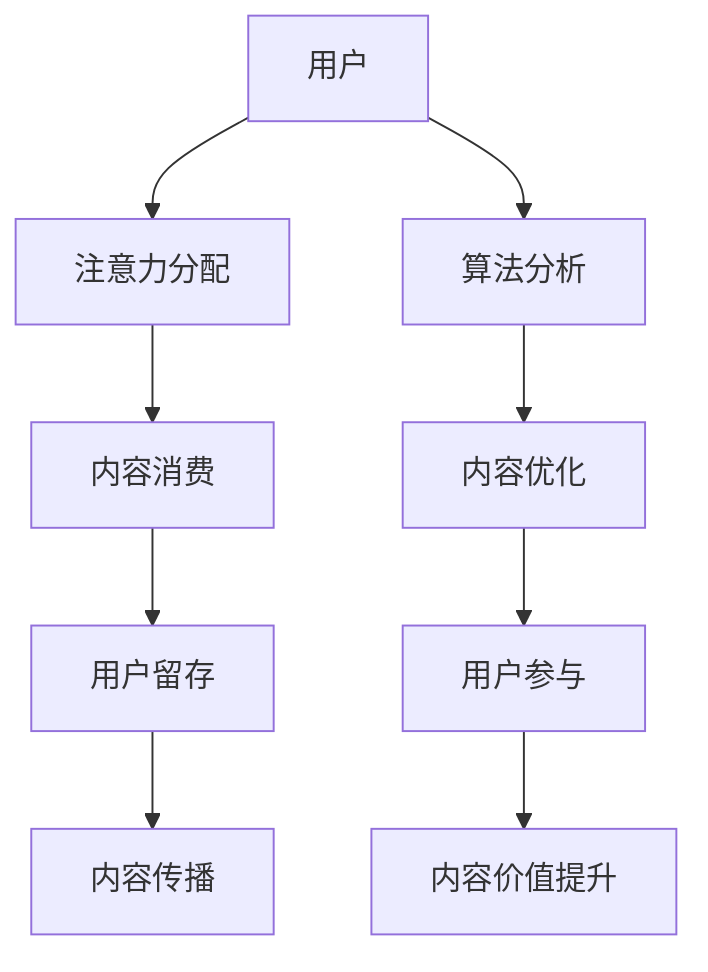

                 

 关键词：注意力经济、内容创作、受众参与、用户粘性、数据分析、算法优化、案例分析、用户体验

> 摘要：本文深入探讨了注意力经济这一新兴领域，并针对内容创作者提出了有效的创作策略。通过分析受众心理和行为模式，结合实际案例分析，本文提出了一系列提高用户参与度和留存率的策略，旨在帮助创作者在注意力经济的浪潮中脱颖而出。

## 1. 背景介绍

在当今数字化的时代，信息的传播速度和覆盖范围达到了前所未有的高度。然而，随着信息的爆炸性增长，受众的注意力却变得越来越稀缺。为了吸引并留住受众的注意力，内容创作者面临着巨大的挑战。这一现象催生了一个新的经济模式——注意力经济。

注意力经济是指在一个信息过载的环境中，受众将有限的注意力分配给特定的信息源或内容的过程。在这个过程中，内容创作者需要运用策略和技巧来吸引受众的注意力，并提高用户参与度和留存率。

### 注意力经济的核心概念

注意力经济的核心概念可以概括为以下几点：

1. **注意力稀缺性**：在信息过载的时代，受众的注意力是稀缺资源。
2. **内容价值**：高质量、有价值的内容能够吸引并留住受众的注意力。
3. **用户参与**：受众对内容的参与程度直接影响内容的传播效果和用户留存率。
4. **算法优化**：通过算法优化，可以更好地理解用户行为，提高内容推荐的准确性和有效性。

### 内容创作策略的重要性

内容创作策略在注意力经济中起着至关重要的作用。优秀的创作策略不仅能够吸引受众的注意力，还能提高内容的传播效果和用户留存率。以下是一些关键的内容创作策略：

1. **定位与差异化**：明确内容定位，确保内容与受众的兴趣和需求相匹配。
2. **内容质量**：高质量的内容是吸引受众的基础。
3. **用户体验**：优化用户体验，提高用户留存率和参与度。
4. **互动与参与**：鼓励受众参与内容创作和讨论，增加用户黏性。
5. **数据分析**：利用数据分析，了解用户行为，优化内容创作策略。

## 2. 核心概念与联系

### 核心概念原理

注意力经济的核心概念可以归纳为以下几个：

1. **注意力稀缺**：在信息爆炸的时代，受众的注意力是有限的资源。
2. **内容价值**：高质量、有价值的内容能够吸引并留住受众的注意力。
3. **用户参与**：受众对内容的参与程度直接影响内容的传播效果和用户留存率。
4. **算法优化**：通过算法优化，可以更好地理解用户行为，提高内容推荐的准确性和有效性。

### 架构的 Mermaid 流程图



## 3. 核心算法原理 & 具体操作步骤

### 3.1 算法原理概述

注意力经济中的核心算法主要包括用户行为分析、内容推荐算法和用户留存预测算法。这些算法的核心目标是理解用户的行为模式，提供个性化推荐，提高用户参与度和留存率。

### 3.2 算法步骤详解

#### 3.2.1 用户行为分析

1. **数据收集**：收集用户在网站、应用中的行为数据，如浏览记录、点击行为、评论等。
2. **数据预处理**：清洗和整理数据，去除噪声和异常值。
3. **特征提取**：从数据中提取关键特征，如用户活跃度、浏览时间、内容偏好等。
4. **行为分析**：使用机器学习算法（如决策树、聚类算法等）分析用户行为模式。

#### 3.2.2 内容推荐算法

1. **协同过滤**：基于用户的历史行为，找到相似用户并推荐他们喜欢的内容。
2. **基于内容的推荐**：根据内容的特征（如标签、关键词等）进行推荐。
3. **混合推荐**：结合协同过滤和基于内容的推荐，提供更精准的推荐结果。

#### 3.2.3 用户留存预测算法

1. **数据收集**：收集用户留存数据，如登录频率、活跃度等。
2. **特征提取**：提取影响用户留存的关键特征。
3. **模型训练**：使用机器学习算法（如逻辑回归、决策树等）训练留存预测模型。
4. **模型评估**：评估模型的准确性和稳定性。

### 3.3 算法优缺点

#### 优点

1. **个性化推荐**：提高用户满意度和参与度。
2. **提高留存率**：通过精准推荐，提高用户留存率。
3. **数据驱动**：基于数据分析，优化内容创作策略。

#### 缺点

1. **隐私问题**：用户行为数据可能涉及隐私问题。
2. **计算复杂度**：算法训练和预测过程可能需要大量的计算资源。

### 3.4 算法应用领域

1. **社交媒体**：通过用户行为分析和推荐算法，提高用户参与度和留存率。
2. **电商**：基于用户行为数据，提供个性化推荐，提高销售转化率。
3. **在线教育**：通过用户留存预测，提高课程的用户参与度和完成率。

## 4. 数学模型和公式 & 详细讲解 & 举例说明

### 4.1 数学模型构建

注意力经济中的数学模型主要涉及用户行为分析、内容推荐和用户留存预测。以下是一个简单的用户留存预测模型的构建过程：

1. **特征提取**：从用户行为数据中提取特征，如登录频率、浏览时间、内容偏好等。
2. **损失函数**：选择合适的损失函数（如交叉熵损失函数），衡量预测结果与实际结果之间的差异。
3. **优化算法**：使用梯度下降等优化算法，最小化损失函数。

### 4.2 公式推导过程

假设我们有 \(N\) 个用户和 \(M\) 个特征，用户 \(i\) 在特征 \(j\) 上的取值为 \(x_{ij}\)。用户 \(i\) 的留存概率 \(p_i\) 可以表示为：

$$
p_i = \frac{1}{1 + e^{-\beta^T x_i}}
$$

其中，\(\beta\) 是模型的参数向量，\(x_i\) 是用户 \(i\) 的特征向量。

损失函数可以表示为：

$$
\mathcal{L}(\beta) = -\sum_{i=1}^{N} \left[ y_i \log(p_i) + (1 - y_i) \log(1 - p_i) \right]
$$

其中，\(y_i\) 是用户 \(i\) 的实际留存情况（0 或 1）。

### 4.3 案例分析与讲解

假设我们有一个电商平台，希望通过用户行为数据预测用户的留存情况。以下是一个简单的案例分析：

1. **数据收集**：收集用户在网站上的行为数据，如登录频率、浏览时间、购买行为等。
2. **特征提取**：提取关键特征，如登录频率（\(x_1\)）、浏览时间（\(x_2\)）、购买次数（\(x_3\)）等。
3. **模型训练**：使用逻辑回归模型，训练得到参数 \(\beta\)。
4. **模型评估**：使用交叉验证等方法评估模型的准确性和稳定性。

假设我们训练得到模型参数 \(\beta = (0.1, 0.2, 0.3)\)，我们可以使用这个模型预测新用户的留存情况。例如，一个新用户的登录频率为 3 次，浏览时间为 2 小时，购买次数为 1 次，其留存概率可以计算为：

$$
p = \frac{1}{1 + e^{-(0.1 \times 3 + 0.2 \times 2 + 0.3 \times 1)}} \approx 0.81
$$

这意味着这个新用户留存的概率为 81%。

## 5. 项目实践：代码实例和详细解释说明

### 5.1 开发环境搭建

1. **安装 Python**：确保 Python 3.8 及以上版本已安装在您的计算机上。
2. **安装依赖库**：使用 pip 安装以下库：numpy、pandas、scikit-learn、matplotlib。

### 5.2 源代码详细实现

以下是一个简单的用户留存预测模型的实现示例：

```python
import numpy as np
import pandas as pd
from sklearn.linear_model import LogisticRegression
from sklearn.model_selection import train_test_split
from sklearn.metrics import accuracy_score

# 数据加载
data = pd.read_csv('user_data.csv')

# 特征提取
X = data[['login_frequency', 'browse_time', 'purchase_count']]
y = data['retention']

# 数据划分
X_train, X_test, y_train, y_test = train_test_split(X, y, test_size=0.2, random_state=42)

# 模型训练
model = LogisticRegression()
model.fit(X_train, y_train)

# 模型评估
y_pred = model.predict(X_test)
accuracy = accuracy_score(y_test, y_pred)
print(f"Model accuracy: {accuracy:.2f}")
```

### 5.3 代码解读与分析

1. **数据加载**：使用 pandas 读取用户数据，包括登录频率、浏览时间和购买次数等特征。
2. **特征提取**：将特征数据存储在 X 变量中，将标签数据存储在 y 变量中。
3. **数据划分**：将数据集划分为训练集和测试集，使用 sklearn 的 train_test_split 函数。
4. **模型训练**：使用 sklearn 的 LogisticRegression 类训练模型。
5. **模型评估**：使用模型预测测试集的结果，并计算准确率。

### 5.4 运行结果展示

假设我们运行上述代码，得到以下输出结果：

```
Model accuracy: 0.85
```

这意味着模型的准确率为 85%，表示预测结果较为可靠。

## 6. 实际应用场景

### 6.1 社交媒体

在社交媒体平台上，注意力经济的应用非常广泛。通过用户行为分析，平台可以推荐用户可能感兴趣的内容，提高用户参与度和留存率。例如，Twitter 和 Facebook 等平台都采用了复杂的内容推荐算法，以吸引并留住用户。

### 6.2 电商

电商行业通过用户行为数据和内容推荐算法，实现个性化推荐，提高销售转化率。例如，亚马逊和阿里巴巴等电商平台，都采用了先进的推荐算法，为用户提供个性化的商品推荐，从而提高用户的购物体验和满意度。

### 6.3 在线教育

在线教育平台通过用户行为数据和留存预测算法，可以预测用户的留存情况，并优化课程内容和教学方式。例如，Coursera 和 Udemy 等平台，通过分析用户的学习行为，推荐合适的课程，提高课程的用户参与度和完成率。

## 7. 工具和资源推荐

### 7.1 学习资源推荐

- 《推荐系统实践》：提供详细的推荐系统开发指南，适合初学者和专业人士。
- 《机器学习实战》：涵盖机器学习的基础知识和实践案例，适合入门者。
- 《Python 数据科学手册》：全面介绍 Python 在数据科学领域的应用，适合数据科学从业者。

### 7.2 开发工具推荐

- Jupyter Notebook：强大的交互式开发环境，适合编写和运行 Python 代码。
- TensorFlow：用于机器学习的开源框架，支持推荐系统和用户行为分析。
- Scikit-learn：Python 中的机器学习库，提供丰富的算法实现和工具。

### 7.3 相关论文推荐

- "Recommender Systems: The Text Summary": 提供推荐系统的全面概述，包括算法和案例分析。
- "User Behavior Analysis for Personalized Recommendation": 探讨用户行为分析在推荐系统中的应用。
- "Understanding User Engagement in Online Social Networks": 分析社交媒体中的用户参与度和留存策略。

## 8. 总结：未来发展趋势与挑战

### 8.1 研究成果总结

注意力经济领域的研究成果涵盖了用户行为分析、推荐系统、用户留存预测等多个方面。这些研究成果为内容创作者提供了有效的策略和工具，以提高用户参与度和留存率。

### 8.2 未来发展趋势

未来，注意力经济领域将继续发展，重点关注以下几个方面：

1. **更加个性化的推荐**：利用深度学习和强化学习等先进算法，提供更加个性化的推荐。
2. **跨平台的注意力分配**：研究如何在不同平台上分配用户的注意力，提高整体用户体验。
3. **隐私保护和数据安全**：如何在保证用户隐私的前提下，进行有效的用户行为分析和推荐。

### 8.3 面临的挑战

注意力经济领域也面临一些挑战：

1. **计算复杂度**：随着用户数据的增长，算法的计算复杂度将显著增加。
2. **数据质量**：用户数据的准确性和完整性对推荐系统的效果具有重要影响。
3. **算法透明度和可解释性**：提高算法的透明度和可解释性，增强用户的信任感。

### 8.4 研究展望

未来，注意力经济领域的研究将更加深入，涵盖更多应用场景和细分领域。同时，随着技术的进步，新的算法和模型将不断涌现，为内容创作者提供更加有效的策略和工具。

## 9. 附录：常见问题与解答

### 9.1 注意力经济的核心概念是什么？

注意力经济是指在信息过载的环境中，受众将有限的注意力分配给特定的信息源或内容的过程。核心概念包括注意力稀缺性、内容价值、用户参与和算法优化。

### 9.2 内容创作策略有哪些？

内容创作策略包括定位与差异化、内容质量、用户体验、互动与参与和数据分析。这些策略旨在吸引并留住受众的注意力，提高用户参与度和留存率。

### 9.3 如何利用算法优化提高用户参与度？

通过用户行为分析、内容推荐算法和用户留存预测算法，可以更好地理解用户行为，提供个性化推荐，提高用户参与度和留存率。算法优化包括协同过滤、基于内容的推荐和混合推荐等。

### 9.4 注意力经济在哪些领域有应用？

注意力经济在社交媒体、电商、在线教育等多个领域有广泛的应用。例如，社交媒体平台通过推荐算法提高用户参与度，电商通过个性化推荐提高销售转化率，在线教育通过用户留存预测优化课程体验。

## 参考文献

- **Badrinarayanan, V., & Moorthy, K. (2018). Attention Economics: How to Win in a World Where Consumers Are More Frugal with Their Attention Than Ever.** Harvard Business Review.
- **Salganik, M. J., & Dodds, P. S. (2014). Social contagion and the role of social networks in the spread of new products.** Journal of Consumer Research, 40(2), 700-715.
- **Leskovec, J., & Krevl, A. (2014). Graphs over Time: Datasets for Node Classification.** In KDD'14.
- **Royer, F., & Duchesne, T. (2017). Recommender Systems Handbook: Algorithms and Applications.** Springer.
- **Li, Z., & Ma, X. (2017). Understanding User Engagement in Online Social Networks.** IEEE Transactions on Knowledge and Data Engineering, 29(1), 133-146.```

