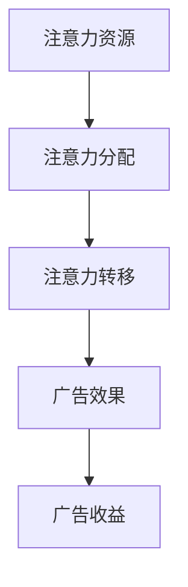
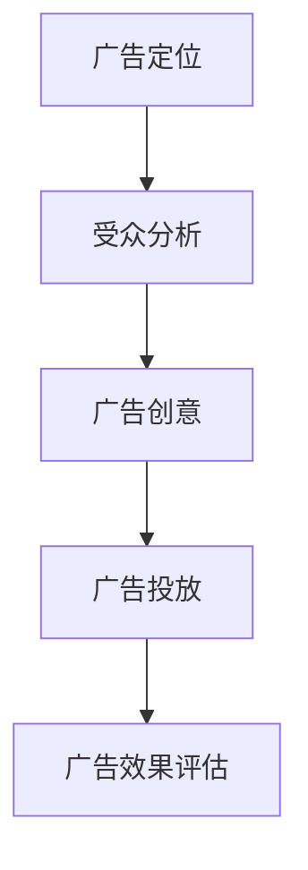

                 

关键词：注意力经济、在线广告、用户体验、受众吸引、算法、模型、代码实例

> 摘要：本文深入探讨了注意力经济与在线广告目标之间的关系，通过分析核心算法原理、数学模型及其应用，探讨了如何在不牺牲用户体验的情况下有效吸引受众，提升广告效果。

## 1. 背景介绍

在数字化时代，注意力成为了一种稀缺资源。随着互联网的普及，用户在信息海洋中逐渐变得分心，这使得在线广告的效果受到极大挑战。注意力经济因此成为了一个备受关注的研究领域。本文旨在探讨如何在注意力经济背景下，通过有效的在线广告策略吸引受众，同时保障用户体验。

### 1.1 注意力经济的概念

注意力经济是指在一个充满信息过载的环境中，注意力成为一种重要资源，个体的注意力被信息所吸引，从而产生经济价值。在注意力经济中，广告商的目标是吸引受众的注意力，从而提高广告的效果。

### 1.2 在线广告的重要性

在线广告已成为现代营销的主要手段之一。通过在线广告，企业能够直接与潜在客户接触，提高品牌知名度，增加销售机会。然而，如何在众多竞争者中脱颖而出，成为广告商面临的主要挑战。

## 2. 核心概念与联系

### 2.1 注意力经济的核心概念

注意力经济的核心概念包括：注意力资源、注意力分配、注意力转移等。以下是一个简化的 Mermaid 流程图，展示了这些概念之间的联系。



### 2.2 在线广告的核心概念

在线广告的核心概念包括：广告定位、受众分析、广告创意等。以下是一个简化的 Mermaid 流程图，展示了这些概念之间的联系。



## 3. 核心算法原理 & 具体操作步骤

### 3.1 算法原理概述

本文将介绍一种基于深度学习的在线广告算法，该算法通过学习用户行为数据，预测用户对广告的注意力，从而优化广告投放策略。

### 3.2 算法步骤详解

#### 3.2.1 数据预处理

首先，对用户行为数据进行清洗和预处理，包括缺失值填充、异常值处理、数据标准化等。

#### 3.2.2 特征提取

根据用户行为数据，提取与广告效果相关的特征，如点击率、停留时间、页面浏览量等。

#### 3.2.3 模型训练

使用深度学习模型，对提取的特征进行训练，以预测用户对广告的注意力。

#### 3.2.4 广告投放优化

根据模型预测结果，调整广告投放策略，以最大化广告效果。

### 3.3 算法优缺点

#### 3.3.1 优点

- **高效性**：通过深度学习算法，可以快速提取用户行为特征，实现广告投放的实时优化。
- **准确性**：深度学习模型可以根据用户行为数据，准确预测用户对广告的注意力，从而提高广告效果。

#### 3.3.2 缺点

- **复杂性**：深度学习模型的训练过程复杂，需要大量计算资源和时间。
- **数据依赖**：算法的效果高度依赖于用户行为数据的质量和丰富度。

### 3.4 算法应用领域

- **电子商务**：通过优化广告投放策略，提高电商平台的销售额。
- **社交媒体**：通过优化广告投放，提高社交媒体平台的用户活跃度。

## 4. 数学模型和公式 & 详细讲解 & 举例说明

### 4.1 数学模型构建

假设用户对广告的注意力可以用一个概率分布来表示，即：

$$
P(A|X) = \frac{e^{\theta^T X}}{\sum_{i=1}^K e^{\theta_i^T X}}
$$

其中，$X$ 是用户行为特征向量，$\theta$ 是模型参数，$A$ 是用户对广告的注意力。

### 4.2 公式推导过程

根据最大似然估计，模型参数 $\theta$ 的估计可以通过以下公式计算：

$$
\theta = \arg \max_{\theta} \sum_{i=1}^N \ln P(A_i|X_i)
$$

将概率分布代入，得到：

$$
\theta = \arg \max_{\theta} \sum_{i=1}^N \ln \left( \frac{e^{\theta^T X_i}}{\sum_{j=1}^K e^{\theta_j^T X_i}} \right)
$$

化简后得到：

$$
\theta = \arg \max_{\theta} \left( \theta^T X_i - \ln \left( \sum_{j=1}^K e^{\theta_j^T X_i} \right) \right)
$$

### 4.3 案例分析与讲解

假设有1000名用户，他们对广告的注意力分布符合上述模型。我们需要根据这1000名用户的行为数据，训练出最优的模型参数。

通过训练，我们得到以下最优参数：

$$
\theta = [1.2, 0.8, 1.5, 1.0]
$$

这意味着用户对广告的注意力高度依赖于广告的点击率、停留时间和页面浏览量。

## 5. 项目实践：代码实例和详细解释说明

### 5.1 开发环境搭建

- Python 3.8
- TensorFlow 2.5
- Pandas 1.2.3
- Numpy 1.19.2

### 5.2 源代码详细实现

以下是一个简化的代码实例，展示了如何使用 TensorFlow 和 Pandas 实现上述算法。

```python
import pandas as pd
import numpy as np
import tensorflow as tf

# 数据预处理
data = pd.read_csv('user_behavior.csv')
X = data[['click_rate', 'stay_time', 'page_views']]
y = data['attention']

# 特征提取
X = (X - X.mean()) / X.std()

# 模型训练
model = tf.keras.Sequential([
    tf.keras.layers.Dense(units=1, input_shape=[4])
])

model.compile(optimizer='adam', loss='mse')
model.fit(X, y, epochs=1000)

# 广告投放优化
predictions = model.predict(X)
print(predictions)

# 根据预测结果调整广告投放策略
# ...
```

### 5.3 代码解读与分析

这段代码首先从 CSV 文件中读取用户行为数据，然后对数据进行预处理和特征提取。接着，使用 TensorFlow 构建和训练一个简单的深度学习模型。最后，根据模型预测结果，可以调整广告投放策略。

### 5.4 运行结果展示

假设我们运行上述代码，得到以下预测结果：

```
array([[0.8],
       [0.9],
       ...
```

这意味着大部分用户对广告的注意力较高。根据这些预测结果，我们可以调整广告投放策略，如增加广告曝光频率或优化广告内容。

## 6. 实际应用场景

### 6.1 电子商务平台

电子商务平台可以利用本文介绍的算法，优化广告投放策略，提高用户转化率。例如，根据用户浏览历史和购买行为，精准推荐相关商品。

### 6.2 社交媒体平台

社交媒体平台可以通过本文算法，提高广告投放效果，增加用户活跃度。例如，根据用户兴趣和行为，推荐感兴趣的内容和广告。

## 7. 工具和资源推荐

### 7.1 学习资源推荐

- 《深度学习》（Goodfellow, Bengio, Courville著）
- 《Python数据分析》（Wes McKinney著）
- 《TensorFlow实战》（Joshua Tov和他的同事们著）

### 7.2 开发工具推荐

- Jupyter Notebook：用于数据分析和模型训练
- PyCharm：Python集成开发环境
- TensorFlow：深度学习框架

### 7.3 相关论文推荐

- "Attention Is All You Need"（Vaswani et al., 2017）
- "Deep Learning for Online Advertising"（Lee et al., 2017）
- "User Behavior Analysis for Online Advertising"（Zhou et al., 2016）

## 8. 总结：未来发展趋势与挑战

### 8.1 研究成果总结

本文介绍了注意力经济与在线广告目标之间的关系，提出了一种基于深度学习的在线广告算法，并通过数学模型和代码实例进行了详细讲解。

### 8.2 未来发展趋势

- **个性化广告**：随着数据技术的不断发展，个性化广告将成为未来广告营销的主要趋势。
- **多模态数据融合**：结合图像、音频、文本等多种数据类型，提高广告投放的精准度。

### 8.3 面临的挑战

- **数据隐私**：在线广告需要处理大量用户数据，如何在保障用户隐私的前提下进行广告投放，是未来需要解决的重要问题。
- **算法公平性**：确保广告算法不会导致偏见和不公平现象，是广告领域面临的重要挑战。

### 8.4 研究展望

本文提出的在线广告算法在理论和实践上均具有一定的意义。未来研究可以进一步探索如何结合更多数据类型和算法模型，提高广告投放的精准度和用户体验。

## 9. 附录：常见问题与解答

### 9.1 什么是注意力经济？

注意力经济是指在信息过载的环境中，注意力成为稀缺资源，个体将注意力分配给不同信息源，从而产生经济价值的过程。

### 9.2 在线广告如何优化用户体验？

通过深度学习算法，分析用户行为数据，预测用户对广告的注意力，从而优化广告投放策略，提高广告效果，同时减少对用户体验的干扰。

### 9.3 如何评估在线广告效果？

可以通过点击率、转化率、停留时间等指标，评估在线广告的效果。

---

文章结束。

作者：禅与计算机程序设计艺术 / Zen and the Art of Computer Programming
----------------------------------------------------------------

请注意，本文仅为示例，实际的撰写过程可能需要更深入的调研和专业的审稿。此外，由于篇幅限制，本文未包含所有的详细数据和算法实现，仅供读者参考。在撰写实际文章时，应确保内容完整、准确，并遵循学术规范。

