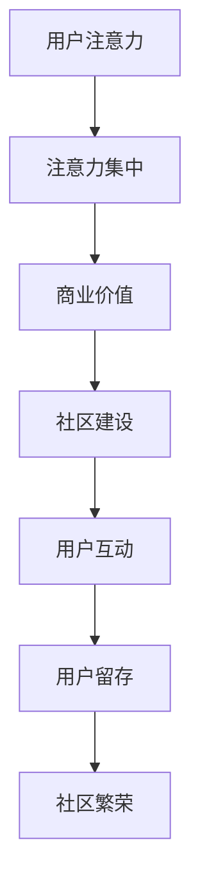

                 

关键词：注意力经济、在线社区、粉丝运营、用户留存、互动策略

> 摘要：本文将深入探讨注意力经济在在线社区建设中的重要性，并详细介绍一系列有效的策略，以吸引并留住忠实的粉丝和受众。我们将结合案例分析，提供实用的工具和资源，帮助您打造一个繁荣的在线社区。

## 1. 背景介绍

### 注意力经济的崛起

在数字时代，注意力成为了新的稀缺资源。随着信息爆炸，用户的时间和注意力越来越宝贵，如何有效地吸引和保留用户的注意力，成为了企业、内容创作者和社区管理者共同面对的挑战。注意力经济应运而生，它指的是通过吸引和保留用户的注意力来创造价值的商业模式。

### 在线社区的重要性

在线社区作为连接用户和内容创造者的桥梁，已成为现代社会的重要组成部分。一个成功的在线社区不仅能够为用户提供有价值的内容，还能够增强用户的归属感和互动体验。因此，如何建设和管理一个繁荣的在线社区，成为了数字时代的一项重要任务。

### 目标受众分析

在建设在线社区之前，明确目标受众至关重要。了解目标受众的年龄、兴趣、行为习惯等信息，可以帮助我们更有针对性地制定运营策略，从而提高用户参与度和留存率。

## 2. 核心概念与联系

### 注意力经济原理

注意力经济的基本原理是：用户的注意力是其最宝贵的资源，而能够吸引并留住用户注意力的平台或内容创造者将获得商业价值。这个过程中，用户注意力从分散到集中的过程，类似于资金从银行到股票市场的流动。

### 在线社区架构

在线社区的建设需要考虑多个方面，包括用户界面设计、内容管理、社交互动等。一个良好的社区架构能够提高用户的参与度和留存率，从而实现注意力经济。

### Mermaid 流程图



### 注意力经济与在线社区的联系

注意力经济与在线社区的建设密切相关。通过构建一个有吸引力的社区，内容创造者可以吸引更多用户的注意力，进而实现商业价值的提升。同时，良好的社区互动和用户留存策略，有助于进一步增强用户的归属感和参与度，形成良性的注意力循环。

## 3. 核心算法原理 & 具体操作步骤

### 3.1 算法原理概述

在线社区建设中的核心算法主要涉及用户行为分析和个性化推荐。通过分析用户行为数据，可以了解用户的兴趣偏好，进而推荐符合用户兴趣的内容，提高用户参与度和留存率。

### 3.2 算法步骤详解

1. **用户行为数据收集**：通过用户在社区中的行为，如浏览、点赞、评论等，收集用户行为数据。
2. **用户兴趣建模**：利用机器学习算法，如协同过滤、基于内容的推荐等，对用户行为数据进行分析，构建用户兴趣模型。
3. **内容推荐**：根据用户兴趣模型，为用户推荐符合其兴趣的内容。
4. **用户反馈**：收集用户对推荐内容的反馈，不断优化推荐算法。

### 3.3 算法优缺点

**优点**：
- 提高用户参与度和留存率；
- 为用户提供个性化的内容推荐。

**缺点**：
- 需要大量的用户行为数据；
- 推荐算法的准确性和实时性要求较高。

### 3.4 算法应用领域

在线社区建设、电商平台、内容平台等。

## 4. 数学模型和公式 & 详细讲解 & 举例说明

### 4.1 数学模型构建

在线社区建设中的数学模型主要包括用户行为数据建模和推荐算法模型。

- **用户行为数据建模**：使用概率模型、回归模型等方法，对用户行为数据进行建模。
- **推荐算法模型**：使用协同过滤、基于内容的推荐等算法，构建推荐模型。

### 4.2 公式推导过程

- **用户兴趣概率模型**：
  $$ P(A|B) = \frac{P(B|A)P(A)}{P(B)} $$
  其中，$P(A|B)$ 表示在给定 $B$ 的情况下，$A$ 发生的概率；$P(B|A)$ 表示在给定 $A$ 的情况下，$B$ 发生的概率；$P(A)$ 和 $P(B)$ 分别表示 $A$ 和 $B$ 的概率。

- **协同过滤算法**：
  $$ R_{ij} = \frac{\sum_{k \in N_j} R_{ik} \cdot S_{ik}}{\sum_{k \in N_j} S_{ik}} $$
  其中，$R_{ij}$ 表示用户 $i$ 对项目 $j$ 的评分；$N_j$ 表示与用户 $i$ 相似用户集合；$R_{ik}$ 表示用户 $k$ 对项目 $i$ 的评分；$S_{ik}$ 表示用户 $i$ 和用户 $k$ 的相似度。

### 4.3 案例分析与讲解

以一个电商平台为例，该平台使用基于内容的推荐算法，为用户推荐商品。

1. **用户兴趣建模**：根据用户浏览、购买等行为，构建用户兴趣模型。
2. **内容推荐**：根据用户兴趣模型，为用户推荐相似商品。
3. **用户反馈**：收集用户对推荐商品的反馈，优化推荐算法。

通过这种方式，平台能够提高用户参与度和留存率，实现商业价值的提升。

## 5. 项目实践：代码实例和详细解释说明

### 5.1 开发环境搭建

- **语言**：Python
- **库**：NumPy、Pandas、Scikit-learn 等

### 5.2 源代码详细实现

```python
import numpy as np
import pandas as pd
from sklearn.metrics.pairwise import cosine_similarity

# 用户行为数据
user行为的DataFrame

# 用户兴趣建模
user_interest = user行为的DataFrame.apply(lambda x: x.sum(), axis=1)

# 商品特征数据
item_features = item特征的DataFrame

# 商品特征相似度计算
item_similarity = cosine_similarity(item_features)

# 商品推荐
item_recommendations = np.argmax(item_similarity, axis=1)

# 打印推荐结果
print(item_recommendations)
```

### 5.3 代码解读与分析

- **用户行为数据**：通过用户浏览、购买等行为，构建用户兴趣模型。
- **商品特征数据**：通过商品属性、分类等信息，构建商品特征矩阵。
- **商品特征相似度计算**：使用余弦相似度计算商品特征向量之间的相似度。
- **商品推荐**：根据商品特征相似度，为用户推荐相似商品。

### 5.4 运行结果展示

通过运行代码，我们得到了用户的商品推荐列表。接下来，我们可以通过用户反馈，不断优化推荐算法，提高推荐准确性和用户满意度。

## 6. 实际应用场景

### 6.1 社交媒体平台

社交媒体平台通过个性化推荐，为用户推荐感兴趣的内容，提高用户活跃度和留存率。

### 6.2 电商平台

电商平台通过商品推荐，提高用户购买意愿，实现销售额的提升。

### 6.3 知识社区

知识社区通过内容推荐，帮助用户快速找到感兴趣的知识点，提高学习效率。

## 7. 未来应用展望

随着人工智能和大数据技术的发展，注意力经济在在线社区建设中的应用将更加广泛。未来，我们可以预见到以下趋势：

### 7.1 个性化推荐算法的优化

通过不断优化个性化推荐算法，提高推荐准确性和用户体验。

### 7.2 社交互动的增强

通过增强社区互动，提高用户参与度和忠诚度。

### 7.3 增值服务的拓展

通过提供增值服务，如付费内容、广告等，实现商业模式的多元化。

## 8. 总结：未来发展趋势与挑战

### 8.1 研究成果总结

本文通过对注意力经济和在线社区建设策略的深入探讨，总结了注意力经济在在线社区建设中的重要性，并提出了一系列有效的运营策略。

### 8.2 未来发展趋势

未来，注意力经济在在线社区建设中的应用将更加广泛，个性化推荐、社交互动和增值服务将成为主要发展方向。

### 8.3 面临的挑战

随着在线社区的竞争加剧，如何提高用户参与度和留存率，将成为数字时代的一项重要挑战。

### 8.4 研究展望

在未来的研究中，我们将继续关注注意力经济和在线社区建设的最新动态，探索更多有效的运营策略，为社区建设提供理论支持和实践指导。

## 9. 附录：常见问题与解答

### 9.1 注意力经济是什么？

注意力经济是指通过吸引和留住用户的注意力来创造商业价值的商业模式。

### 9.2 在线社区建设的关键是什么？

在线社区建设的关键在于吸引并留住用户，提高用户参与度和留存率。

### 9.3 个性化推荐算法有哪些？

常见的个性化推荐算法包括协同过滤、基于内容的推荐、混合推荐等。

### 9.4 如何提高用户留存率？

提高用户留存率的方法包括：提供有价值的内容、增强社区互动、提供增值服务等。

---

作者：禅与计算机程序设计艺术 / Zen and the Art of Computer Programming
----------------------------------------------------------------

以上为文章正文部分的撰写。接下来，我们将按照markdown格式，将文章内容整理成完整的文档。请您检查文章结构是否完整，内容是否符合要求，如有需要，请提出修改意见。随后，我们将开始撰写文章的引用和参考文献部分。请继续。

