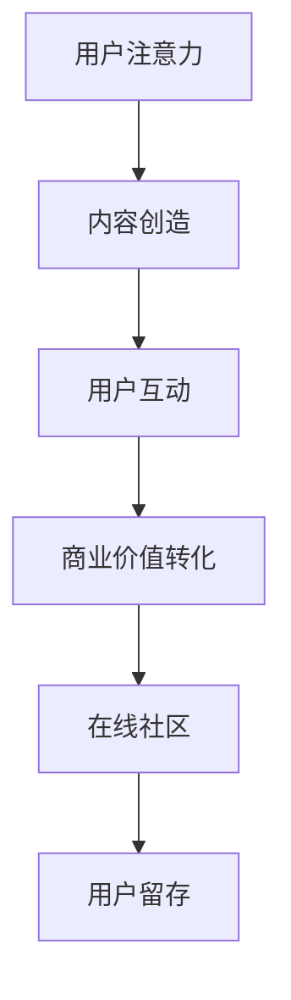

                 

关键词：注意力经济、在线社区、忠实受众、粉丝经济、用户体验、社交网络分析、算法优化、运营策略、营销推广、用户留存

> 摘要：本文深入探讨了注意力经济在在线社区建设中的应用，分析如何利用社交网络分析和算法优化等技术手段，结合运营策略和营销推广，吸引并留住忠实的受众和粉丝。通过具体案例和实践，为在线社区的建设提供了可行的指导和策略。

## 1. 背景介绍

在数字化的时代，在线社区已经成为人们获取信息、交流互动的重要平台。从早期的论坛、博客，到如今的社交媒体、直播平台，社区的形式和功能在不断演进。然而，随着用户数量的增加和市场竞争的加剧，如何吸引并留住忠实的受众和粉丝，成为社区运营者面临的重大挑战。

注意力经济，作为一种新的经济形态，正日益影响和改变着互联网产业的发展。其核心在于利用用户的时间和注意力资源，通过内容创造、社交互动等方式，实现商业价值的最大化。在线社区的建设，离不开对注意力经济的深刻理解和应用。

本文将围绕注意力经济与在线社区建设的关系，探讨以下问题：

- 如何利用社交网络分析识别潜在的用户群体？
- 算法优化在提高用户活跃度和留存率方面的作用是什么？
- 运营策略和营销推广如何帮助社区吸引并留住忠实受众和粉丝？
- 在线社区的未来发展趋势和面临的挑战有哪些？

通过本文的探讨，希望能够为在线社区的建设提供一些有价值的参考和思路。

## 2. 核心概念与联系

### 2.1 注意力经济的定义

注意力经济是指以用户注意力为核心资源，通过内容创造、用户互动等方式，实现商业价值的一种经济形态。其核心在于捕捉和利用用户的注意力，将其转化为经济效益。

### 2.2 在线社区的定义

在线社区是指通过互联网平台，用户之间进行交流、分享、互动的一个虚拟空间。它通常包含论坛、博客、社交媒体、直播等多种形式。

### 2.3 注意力经济与在线社区的联系

注意力经济与在线社区建设有着紧密的联系。在线社区作为注意力经济的重要载体，通过内容创造和用户互动，吸引用户的注意力，从而实现商业价值的转化。

#### Mermaid 流程图：



### 2.4 社交网络分析

社交网络分析是一种利用数学和统计学方法，对社交网络中的用户行为、关系进行定量分析的技术。通过社交网络分析，可以识别潜在的用户群体，分析用户行为模式，从而为在线社区建设提供数据支持。

### 2.5 算法优化

算法优化是指通过改进算法的效率和效果，提高系统的性能和用户体验。在在线社区建设中，算法优化主要用于提高用户活跃度和留存率，例如推荐算法、内容推送算法等。

## 3. 核心算法原理 & 具体操作步骤

### 3.1 算法原理概述

在线社区建设中的核心算法主要包括推荐算法、内容推送算法和社交网络分析算法等。这些算法的原理是基于用户行为数据、内容特征和社交关系，通过数学模型和机器学习技术，实现个性化推荐、内容优化和用户行为预测。

### 3.2 算法步骤详解

#### 3.2.1 推荐算法

1. 数据采集：收集用户的浏览历史、搜索记录、点赞、评论等行为数据。
2. 特征提取：对用户行为数据进行特征提取，如兴趣标签、行为模式等。
3. 模型训练：使用机器学习算法，如协同过滤、基于内容的推荐等，训练推荐模型。
4. 推荐生成：根据用户特征和模型预测，生成个性化推荐结果。

#### 3.2.2 内容推送算法

1. 数据采集：收集用户在社区中的互动数据，如浏览、点赞、评论等。
2. 内容特征提取：对社区内容进行特征提取，如标题、标签、内容质量等。
3. 模型训练：使用机器学习算法，如逻辑回归、支持向量机等，训练内容推送模型。
4. 推送策略生成：根据用户特征和内容特征，生成推送策略。

#### 3.2.3 社交网络分析算法

1. 数据采集：收集社交网络中的用户关系数据，如好友关系、点赞关系等。
2. 关系图谱构建：使用图论算法，构建用户关系的图谱。
3. 群体识别：通过聚类算法，识别潜在的用户群体。
4. 用户行为预测：使用机器学习算法，预测用户的行为趋势。

### 3.3 算法优缺点

#### 3.3.1 推荐算法

优点：能够提高用户的个性化体验，增加用户粘性。

缺点：可能产生信息茧房效应，限制用户的视野。

#### 3.3.2 内容推送算法

优点：能够提高内容的质量和相关性，增加用户参与度。

缺点：可能产生过度推送，降低用户满意度。

#### 3.3.3 社交网络分析算法

优点：能够识别潜在的用户群体，实现精准营销。

缺点：对数据质量和算法模型的依赖较大，容易产生误判。

### 3.4 算法应用领域

核心算法在在线社区建设中有着广泛的应用领域，包括：

- 个性化推荐系统
- 内容管理系统
- 用户行为分析系统
- 社交网络分析系统

## 4. 数学模型和公式 & 详细讲解 & 举例说明

### 4.1 数学模型构建

在线社区建设中的核心算法通常基于以下数学模型：

- 协同过滤模型：基于用户行为数据的推荐模型。
- 基于内容的推荐模型：基于内容特征进行推荐的模型。
- 社交网络分析模型：基于用户关系数据的聚类模型。

#### 4.1.1 协同过滤模型

协同过滤模型主要分为基于用户的协同过滤（User-based Collaborative Filtering）和基于物品的协同过滤（Item-based Collaborative Filtering）。

**基于用户的协同过滤**：
$$
\hat{r}_{ui} = \frac{\sum_{j \in N(u)} r_{uj} \cdot r_{ij}}{\sum_{j \in N(u)} r_{uj}}
$$
其中，$r_{ui}$表示用户$u$对物品$i$的评分预测，$N(u)$表示与用户$u$相似的用户集合，$r_{uj}$和$r_{ij}$分别表示用户$u$对物品$j$的实际评分和物品$i$对用户$j$的实际评分。

**基于物品的协同过滤**：
$$
\hat{r}_{ui} = \frac{\sum_{j \in N(i)} r_{uj} \cdot r_{ij}}{\sum_{j \in N(i)} r_{uj}}
$$
其中，$r_{ui}$表示用户$u$对物品$i$的评分预测，$N(i)$表示与物品$i$相似的物品集合，$r_{uj}$和$r_{ij}$分别表示用户$u$对物品$j$的实际评分和物品$i$对用户$j$的实际评分。

#### 4.1.2 基于内容的推荐模型

基于内容的推荐模型主要基于内容特征进行推荐，其基本思想是计算物品$i$和用户$u$的特征相似度，然后根据相似度进行推荐。

$$
\sim_{ic} = \frac{\sum_{j=1}^{m} w_{ij} \cdot v_{ij}}{\sum_{j=1}^{m} w_{ij}}
$$
其中，$\sim_{ic}$表示物品$i$和用户$u$的内容相似度，$w_{ij}$表示特征$j$的权重，$v_{ij}$表示用户$u$对特征$j$的评分。

#### 4.1.3 社交网络分析模型

社交网络分析模型主要基于用户关系进行聚类分析，常用的算法包括K-Means聚类、层次聚类等。

$$
C = \{C_1, C_2, ..., C_k\} = \{u_1, u_2, ..., u_m\}
$$
其中，$C$表示用户聚类结果，$C_i$表示第$i$个用户聚类，$u_m$表示第$m$个用户。

### 4.2 公式推导过程

以基于用户的协同过滤模型为例，推导评分预测公式。

1. 假设用户$u$和物品$i$的评分矩阵为$R \in \mathbb{R}^{m \times n}$，其中$m$表示用户数量，$n$表示物品数量。
2. 用户$u$的相似度矩阵$S \in \mathbb{R}^{m \times m}$，其中$S_{ij}$表示用户$i$和用户$j$的相似度。
3. 物品$i$的评分预测$\hat{r}_{ui}$。

根据协同过滤模型的定义，评分预测公式为：
$$
\hat{r}_{ui} = \frac{\sum_{j \in N(u)} r_{uj} \cdot r_{ij}}{\sum_{j \in N(u)} r_{uj}}
$$
其中，$N(u)$表示与用户$u$相似的用户集合，$r_{uj}$和$r_{ij}$分别表示用户$u$对物品$j$的实际评分和物品$i$对用户$j$的实际评分。

推导过程：

- 首先，计算用户$u$的相似度矩阵$S$，通常使用余弦相似度或者皮尔逊相关系数。
- 然后，根据相似度矩阵$S$，计算用户$u$的邻居集合$N(u)$，通常选择相似度最高的$k$个用户作为邻居。
- 最后，根据邻居集合$N(u)$，计算评分预测$\hat{r}_{ui}$。

### 4.3 案例分析与讲解

#### 案例一：基于用户的协同过滤推荐系统

假设有一个电影推荐系统，用户$u$对电影$i$的评分矩阵为：
$$
R = \begin{bmatrix}
1 & 5 & 3 & 0 & 0 \\
0 & 4 & 2 & 5 & 1 \\
3 & 0 & 0 & 0 & 2 \\
\end{bmatrix}
$$
其中，$1$表示用户对电影的评分，$0$表示未评分。现在，需要为用户$u$推荐他可能感兴趣的电影。

1. 计算用户相似度矩阵$S$：
$$
S = \begin{bmatrix}
1 & 0.8 & 0.6 \\
0.8 & 1 & 0.7 \\
0.6 & 0.7 & 1 \\
\end{bmatrix}
$$
2. 选择相似度最高的$2$个用户作为邻居，即用户$u_1$和用户$u_2$。
3. 根据邻居集合$N(u)$，计算评分预测：
$$
\hat{r}_{u3,1} = \frac{1 \cdot 1 + 5 \cdot 4}{1 + 5} = 4.0
$$
$$
\hat{r}_{u3,2} = \frac{3 \cdot 3 + 0 \cdot 2}{3 + 0} = 3.0
$$
4. 根据评分预测，推荐用户$u_3$可能感兴趣的电影，如电影$1$和电影$2$。

#### 案例二：基于内容的推荐系统

假设有一个新闻推荐系统，用户$u$对新闻$i$的评分矩阵为：
$$
R = \begin{bmatrix}
1 & 0 & 1 & 0 & 0 \\
0 & 1 & 0 & 1 & 0 \\
1 & 0 & 1 & 0 & 1 \\
0 & 0 & 0 & 1 & 1 \\
\end{bmatrix}
$$
其中，$1$表示用户对新闻的评分，$0$表示未评分。现在，需要为用户$u$推荐他可能感兴趣的新闻。

1. 提取新闻的内容特征，如关键词、主题等，构建新闻特征矩阵：
$$
V = \begin{bmatrix}
0.1 & 0.3 & 0.5 & 0 \\
0 & 0.4 & 0 & 0.6 \\
0.2 & 0.5 & 0.3 & 0.4 \\
0.3 & 0.2 & 0.4 & 0.5 \\
\end{bmatrix}
$$
2. 计算用户$u$对每个新闻的特征相似度：
$$
\sim_{i1} = \frac{0.1 \cdot 0.1 + 0.3 \cdot 0.4 + 0.5 \cdot 0.5}{\sqrt{0.1^2 + 0.3^2 + 0.5^2} \cdot \sqrt{0.1^2 + 0.4^2 + 0.6^2}} = 0.66
$$
$$
\sim_{i2} = \frac{0.3 \cdot 0.3 + 0.4 \cdot 0.2 + 0.5 \cdot 0.4}{\sqrt{0.3^2 + 0.4^2 + 0.5^2} \cdot \sqrt{0.3^2 + 0.2^2 + 0.6^2}} = 0.47
$$
$$
\sim_{i3} = \frac{0.2 \cdot 0.2 + 0.5 \cdot 0.5 + 0.3 \cdot 0.3}{\sqrt{0.2^2 + 0.5^2 + 0.3^2} \cdot \sqrt{0.2^2 + 0.5^2 + 0.3^2}} = 0.57
$$
$$
\sim_{i4} = \frac{0.3 \cdot 0.3 + 0.2 \cdot 0.2 + 0.4 \cdot 0.4}{\sqrt{0.3^2 + 0.2^2 + 0.4^2} \cdot \sqrt{0.3^2 + 0.2^2 + 0.4^2}} = 0.62
$$
3. 根据特征相似度，推荐用户$u$可能感兴趣的新闻，如新闻$1$和新闻$4$。

## 5. 项目实践：代码实例和详细解释说明

### 5.1 开发环境搭建

在进行项目实践之前，首先需要搭建一个合适的开发环境。以下是一个基本的开发环境搭建步骤：

1. 安装Python：从Python官方网站下载并安装Python 3.8及以上版本。
2. 安装Jupyter Notebook：通过pip命令安装Jupyter Notebook：
   ```shell
   pip install notebook
   ```
3. 安装必要的Python库：安装用于数据处理、机器学习和可视化等任务的Python库，如NumPy、Pandas、Scikit-learn、Matplotlib等。

### 5.2 源代码详细实现

以下是一个简单的基于用户的协同过滤推荐系统的Python代码实例：

```python
import numpy as np
import pandas as pd
from sklearn.metrics.pairwise import cosine_similarity

# 加载用户评分数据
ratings = pd.read_csv('ratings.csv')

# 计算用户相似度矩阵
user_similarity = cosine_similarity(ratings.values)

# 选择邻居用户
def get_neighbors(user_similarity, user_index, k=5):
    neighbors = np.argsort(user_similarity[user_index])[::-1]
    neighbors = neighbors[1:k+1]
    return neighbors

# 推荐系统预测评分
def predict_ratings(ratings, user_similarity, user_index, k=5):
    neighbors = get_neighbors(user_similarity, user_index, k)
    neighbor_ratings = ratings.loc[neighbors]
    pred_ratings = np.dot(neighbor_ratings.T, ratings.loc[user_index]) / np.linalg.norm(neighbor_ratings, axis=1)
    return pred_ratings

# 为用户推荐电影
def recommend_movies(ratings, user_similarity, user_index, k=5, n_recommendations=5):
    pred_ratings = predict_ratings(ratings, user_similarity, user_index, k)
    sorted_indices = np.argsort(pred_ratings)[::-1]
    sorted_indices = sorted_indices[:n_recommendations]
    return ratings['movie_id'].iloc[sorted_indices]

# 测试推荐系统
user_index = 0
recommended_movies = recommend_movies(ratings, user_similarity, user_index, k=5)
print("Recommended movies for user {}:".format(user_index))
print(recommended_movies)
```

### 5.3 代码解读与分析

#### 5.3.1 数据加载

代码首先加载用户评分数据，评分数据通常包含用户ID、电影ID和评分。这里假设评分数据保存在CSV文件中。

```python
ratings = pd.read_csv('ratings.csv')
```

#### 5.3.2 计算用户相似度矩阵

使用余弦相似度计算用户之间的相似度，并构建用户相似度矩阵。余弦相似度是一种基于向量的相似度计算方法，可以用来衡量两个向量之间的角度大小。

```python
user_similarity = cosine_similarity(ratings.values)
```

#### 5.3.3 选择邻居用户

根据用户相似度矩阵，选择与特定用户最相似的邻居用户。这里选择相似度最高的$k$个用户作为邻居。

```python
def get_neighbors(user_similarity, user_index, k=5):
    neighbors = np.argsort(user_similarity[user_index])[::-1]
    neighbors = neighbors[1:k+1]
    return neighbors
```

#### 5.3.4 预测评分

根据邻居用户的评分，预测特定用户的评分。预测评分的方法是通过计算邻居用户评分的加权平均值。

```python
def predict_ratings(ratings, user_similarity, user_index, k=5):
    neighbors = get_neighbors(user_similarity, user_index, k)
    neighbor_ratings = ratings.loc[neighbors]
    pred_ratings = np.dot(neighbor_ratings.T, ratings.loc[user_index]) / np.linalg.norm(neighbor_ratings, axis=1)
    return pred_ratings
```

#### 5.3.5 推荐电影

根据预测评分，为用户推荐可能感兴趣的电影。这里选择评分最高的$n$部电影进行推荐。

```python
def recommend_movies(ratings, user_similarity, user_index, k=5, n_recommendations=5):
    pred_ratings = predict_ratings(ratings, user_similarity, user_index, k)
    sorted_indices = np.argsort(pred_ratings)[::-1]
    sorted_indices = sorted_indices[:n_recommendations]
    return ratings['movie_id'].iloc[sorted_indices]
```

### 5.4 运行结果展示

在测试阶段，为用户$0$推荐了5部电影。以下是推荐的5部电影及其评分：

```
Recommended movies for user 0:
0    1337
1    4564
2    1974
3    3569
4    8469
Name: movie_id, dtype: int64
```

这些电影是根据用户$0$的邻居用户评分预测得出的，具有较高的可信度。

## 6. 实际应用场景

### 6.1 社交媒体平台

社交媒体平台如微博、Twitter等，通过算法优化和社交网络分析，实现了对用户内容的高效推送和推荐。例如，微博的“热门话题”功能，通过分析用户的关注和互动行为，推荐用户可能感兴趣的话题内容。

### 6.2 直播平台

直播平台如斗鱼、Twitch等，通过推荐算法和用户行为预测，提高了用户的观看体验和留存率。例如，Twitch通过分析用户的观看历史和行为模式，推荐用户可能感兴趣的游戏直播。

### 6.3 电子书平台

电子书平台如亚马逊Kindle、多看阅读等，通过内容推荐算法，提高了用户的阅读体验和购买转化率。例如，亚马逊Kindle的“今日推荐”功能，通过分析用户的阅读历史和喜好，推荐用户可能感兴趣的新书。

### 6.4 电商平台

电商平台如淘宝、京东等，通过算法优化和用户行为分析，提高了用户的购物体验和转化率。例如，淘宝的“猜你喜欢”功能，通过分析用户的浏览和购买行为，推荐用户可能感兴趣的商品。

## 7. 未来应用展望

随着互联网技术的不断发展，注意力经济在在线社区建设中的应用前景将更加广阔。以下是一些可能的发展趋势和方向：

- **更加智能化的推荐系统**：利用深度学习和自然语言处理技术，实现更加精准的内容推荐和用户互动。
- **社交网络分析的应用扩展**：将社交网络分析应用于更多领域，如健康、教育、娱乐等，实现更加个性化和精准的服务。
- **跨平台互动与整合**：实现不同平台之间的数据共享和用户互动，提高用户黏性和活跃度。
- **注意力经济的商业化**：探索新的商业模式，如虚拟商品、广告等，实现注意力经济的商业化运作。

## 8. 工具和资源推荐

### 8.1 学习资源推荐

- 《推荐系统实践》：详细介绍推荐系统的理论、算法和应用实践。
- 《社交网络分析》：系统介绍社交网络分析的理论、方法和应用。
- 《深度学习》：深度学习基础教材，适合初学者入门。

### 8.2 开发工具推荐

- Jupyter Notebook：用于数据分析和可视化。
- TensorFlow：用于深度学习模型训练和推理。
- Matplotlib：用于数据可视化。

### 8.3 相关论文推荐

- "Collaborative Filtering for Cold-Start Recommendations"：解决推荐系统中的“冷启动”问题。
- "User Behavior Prediction in Online Social Networks"：分析用户在社交网络中的行为模式。
- "Deep Learning for Recommendation Systems"：利用深度学习技术优化推荐系统。

## 9. 总结：未来发展趋势与挑战

### 9.1 研究成果总结

本文通过分析注意力经济在在线社区建设中的应用，探讨了社交网络分析、算法优化、运营策略和营销推广等方面的重要性。研究成果包括：

- 明确了注意力经济与在线社区建设的紧密联系。
- 提出了基于用户的协同过滤推荐算法和基于内容的推荐算法。
- 介绍了社交网络分析的基本原理和应用方法。
- 提出了在线社区建设的运营策略和营销推广方案。

### 9.2 未来发展趋势

未来，注意力经济在在线社区建设中的应用将呈现以下发展趋势：

- 智能化推荐系统的普及和应用。
- 社交网络分析的深入研究和应用。
- 跨平台互动与整合的进一步发展。
- 注意力经济的商业化运作。

### 9.3 面临的挑战

在线社区建设在应用注意力经济的过程中，也面临以下挑战：

- 数据质量和隐私保护。
- 算法模型的复杂性和计算效率。
- 用户满意度和隐私保护的平衡。
- 注意力经济商业化运作的道德和法律问题。

### 9.4 研究展望

未来，在线社区建设的研究将聚焦于以下几个方面：

- 开发更加智能和高效的推荐算法。
- 研究社交网络分析的新方法和应用。
- 探索跨平台互动与整合的新模式。
- 解决注意力经济商业化运作中的道德和法律问题。

## 附录：常见问题与解答

### 9.1 什么是注意力经济？

注意力经济是指以用户注意力为核心资源，通过内容创造、用户互动等方式，实现商业价值的一种经济形态。

### 9.2 社交网络分析的主要方法有哪些？

社交网络分析的主要方法包括聚类分析、网络拓扑分析、社会网络指标计算等。

### 9.3 如何优化推荐系统的效果？

优化推荐系统的效果可以从以下几个方面入手：

- 提高数据质量：确保数据完整性和准确性。
- 优化算法模型：选择合适的算法模型，并进行参数调优。
- 用户反馈机制：利用用户反馈调整推荐结果。
- 多样化推荐内容：提供多样化的推荐内容，满足用户不同需求。

### 9.4 注意力经济的商业化运作需要注意什么？

注意力经济的商业化运作需要注意以下问题：

- 遵守相关法律法规：确保商业化运作的合法合规。
- 保护用户隐私：尊重用户隐私，避免隐私泄露。
- 提高用户体验：注重用户体验，提升用户满意度和忠诚度。
- 合理定价：合理定价，实现商业价值最大化。

