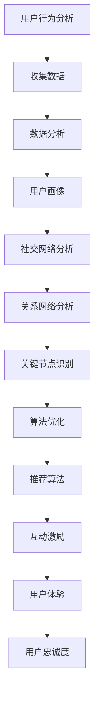

                 

关键词：注意力经济、在线社区、用户参与度、用户忠诚度、用户行为分析、社交网络分析、算法优化、用户互动设计、激励机制、用户体验、数据驱动、个性化推荐、内容营销、算法伦理。

> 摘要：本文探讨了注意力经济背景下的在线社区建设，分析了如何通过数据驱动的方法和算法优化，提升用户参与度和忠诚度。文章结合具体的案例，阐述了构建高效用户互动和激励机制的重要性，并讨论了未来发展趋势和面临的挑战。

## 1. 背景介绍

随着互联网的普及和信息过载现象的加剧，用户的注意力资源变得愈发珍贵。在这样的大背景下，"注意力经济"这一概念逐渐成为学术界和产业界关注的焦点。注意力经济主要关注的是如何在数字化的环境中吸引和保持用户的注意力，从而实现商业价值。

在线社区作为互联网上的一个重要平台，已经逐渐成为企业和品牌与用户互动的重要场所。然而，如何构建一个用户参与度高、忠诚度高的在线社区，仍然是一个充满挑战的问题。这不仅仅是技术上的挑战，更涉及到用户行为分析、社交网络分析、算法优化、用户体验设计等多个方面的综合考量。

### 1.1 注意力经济的概念

注意力经济是指在一个信息过载的社会中，个体的注意力资源成为了一种稀缺资源。企业和品牌需要通过有效的策略和方法，吸引用户的注意力，并在其有限的时间内实现价值转化。在数字化的环境中，用户的注意力更多地体现在点击、浏览、评论、分享等行为上，这些行为构成了衡量用户参与度和忠诚度的重要指标。

### 1.2 在线社区的重要性

在线社区作为一种社交媒体形式，为用户提供了交流、分享和互动的平台。一个成功的在线社区不仅可以提高用户的参与度，还能培养用户的忠诚度，从而为企业带来持续的流量和商业价值。

### 1.3 用户参与度与忠诚度的定义

用户参与度通常指用户在社区中参与的活跃程度，包括发帖、回复、评论、分享等行为。用户忠诚度则是指用户对社区持续关注和积极参与的态度，通常通过用户留存率、活跃度、社区黏性等指标来衡量。

## 2. 核心概念与联系

### 2.1 用户行为分析

用户行为分析是通过收集和分析用户在社区中的行为数据，来了解用户的需求和偏好。这包括用户的浏览路径、搜索历史、互动频率、内容偏好等多个方面。用户行为分析是构建高效在线社区的基础。

### 2.2 社交网络分析

社交网络分析主要关注用户之间的关系和网络结构。通过分析社交网络，可以识别出关键节点（如意见领袖、活跃用户）和社区的核心群体，从而优化社区的组织结构和互动设计。

### 2.3 算法优化

算法优化是指通过改进推荐算法、互动算法等，提高用户参与度和忠诚度。这包括内容推荐算法、互动激励算法、社区推荐算法等多个方面。算法优化的目标是通过个性化推荐和精准互动，提高用户的满意度和忠诚度。

### 2.4 Mermaid 流程图

下面是一个简单的 Mermaid 流程图，展示了用户行为分析、社交网络分析和算法优化之间的联系。



## 3. 核心算法原理 & 具体操作步骤

### 3.1 算法原理概述

在线社区的核心算法主要包括推荐算法和互动激励算法。推荐算法主要目标是根据用户的行为和偏好，推荐符合用户兴趣的内容和用户。互动激励算法则通过奖励机制，鼓励用户参与社区互动。

### 3.2 算法步骤详解

#### 3.2.1 推荐算法步骤

1. 数据收集：收集用户的浏览、搜索、评论等行为数据。
2. 用户画像：基于行为数据构建用户画像，包括兴趣、偏好、活跃度等。
3. 内容特征提取：对推荐内容进行特征提取，如文本、图片、视频等。
4. 模型训练：使用机器学习算法，如协同过滤、矩阵分解等，训练推荐模型。
5. 推荐生成：根据用户画像和内容特征，生成个性化推荐结果。
6. 推荐评估：评估推荐效果，如点击率、转化率等。

#### 3.2.2 互动激励算法步骤

1. 用户行为监测：监测用户在社区中的行为，如发帖、评论、点赞等。
2. 活动设计：设计互动活动，如抽奖、比赛、打榜等。
3. 激励设置：根据用户行为和活动设计，设置相应的奖励机制。
4. 奖励发放：根据用户行为和活动参与度，发放奖励。
5. 用户反馈：收集用户对互动活动的反馈，优化活动设计。

### 3.3 算法优缺点

#### 推荐算法优点

- 提高用户参与度：通过个性化推荐，提高用户对社区内容的兴趣和参与度。
- 增加用户粘性：通过持续的个性化推荐，增加用户对社区的依赖和忠诚度。

#### 推荐算法缺点

- 需要大量数据：推荐算法需要大量用户行为数据，对于数据稀疏的场景效果较差。
- 易产生信息茧房：过度依赖推荐算法可能导致用户陷入信息茧房，减少接触不同观点的机会。

#### 互动激励算法优点

- 提高用户互动：通过激励机制，鼓励用户积极参与社区互动。
- 增加社区活跃度：互动激励算法可以显著提高社区的活跃度和用户黏性。

#### 互动激励算法缺点

- 可能导致过度竞争：过于强调奖励机制可能导致用户之间的过度竞争，影响社区氛围。
- 需要持续优化：互动激励算法需要根据用户行为和社区反馈持续优化，否则可能失去效果。

### 3.4 算法应用领域

推荐算法和互动激励算法在在线社区中的应用非常广泛，不仅用于社交媒体平台，还广泛应用于电子商务、在线教育、娱乐等领域。这些算法通过提高用户参与度和忠诚度，为企业带来了显著的商业价值。

## 4. 数学模型和公式 & 详细讲解 & 举例说明

### 4.1 数学模型构建

在线社区的核心算法通常基于以下数学模型：

#### 4.1.1 协同过滤

协同过滤是一种基于用户行为数据的推荐算法。其核心思想是找到与目标用户行为相似的邻居用户，然后推荐邻居用户喜欢的商品。

$$
\hat{r}_{ui} = \sum_{j \in N(i)} r_{uj} \cdot sim(i, j)
$$

其中，$\hat{r}_{ui}$是用户$u$对商品$i$的推荐评分，$r_{uj}$是用户$u$对商品$j$的实际评分，$sim(i, j)$是用户$i$和$j$之间的相似度。

#### 4.1.2 矩阵分解

矩阵分解是一种基于隐语义模型的推荐算法。其核心思想是将用户-商品评分矩阵分解为两个低秩矩阵，从而预测用户对商品的评分。

$$
R = U \cdot V^T
$$

其中，$R$是用户-商品评分矩阵，$U$和$V$分别是用户特征矩阵和商品特征矩阵。

### 4.2 公式推导过程

#### 4.2.1 协同过滤

协同过滤算法的推导过程如下：

1. 定义用户$i$和$j$之间的相似度：

$$
sim(i, j) = \frac{r_{ij} - \mu}{\sqrt{\sum_{k=1}^{n} (r_{ik} - \mu)^2 \sum_{l=1}^{n} (r_{il} - \mu)^2}}
$$

其中，$r_{ij}$是用户$i$对商品$j$的评分，$\mu$是用户$i$对所有商品的评分的平均值。

2. 计算目标用户$i$对商品$j$的预测评分：

$$
\hat{r}_{ij} = r_{ij} + \sum_{k \in N(i)} (r_{ik} - \mu) \cdot sim(i, k)
$$

其中，$N(i)$是用户$i$的邻居用户集合。

#### 4.2.2 矩阵分解

矩阵分解的推导过程如下：

1. 初始化用户特征矩阵$U$和商品特征矩阵$V$。

2. 对于每个用户$i$和商品$j$，计算预测评分：

$$
\hat{r}_{ij} = U_i \cdot V_j^T
$$

3. 计算预测评分和实际评分之间的误差：

$$
e_{ij} = r_{ij} - \hat{r}_{ij}
$$

4. 更新用户特征矩阵$U$和商品特征矩阵$V$：

$$
U_i \leftarrow U_i + \alpha \cdot (e_{ij} \cdot V_j)
$$

$$
V_j \leftarrow V_j + \alpha \cdot (e_{ij} \cdot U_i)
$$

其中，$\alpha$是学习率。

### 4.3 案例分析与讲解

#### 4.3.1 协同过滤案例

假设有用户$u$和商品$i$，用户$u$对商品$i$的实际评分为$4$。根据协同过滤算法，我们可以计算出用户$u$对商品$i$的预测评分。

1. 计算用户$u$和商品$i$的邻居用户集合$N(u)$。
2. 计算邻居用户对商品$i$的评分平均值$\mu$。
3. 计算用户$u$和邻居用户之间的相似度$sim(u, k)$。
4. 计算用户$u$对商品$i$的预测评分$\hat{r}_{ui}$。

通过以上步骤，我们可以得到用户$u$对商品$i$的预测评分。

#### 4.3.2 矩阵分解案例

假设有用户$u$和商品$i$，用户$u$对商品$i$的实际评分为$4$。根据矩阵分解算法，我们可以计算出用户$u$对商品$i$的预测评分。

1. 初始化用户特征矩阵$U$和商品特征矩阵$V$。
2. 计算用户$u$对商品$i$的预测评分$\hat{r}_{ui}$。
3. 计算预测评分和实际评分之间的误差$e_{ui}$。
4. 更新用户特征矩阵$U$和商品特征矩阵$V$。

通过以上步骤，我们可以得到用户$u$对商品$i$的预测评分。

## 5. 项目实践：代码实例和详细解释说明

### 5.1 开发环境搭建

为了实现上述算法，我们需要搭建一个合适的技术栈。以下是一个简单的开发环境搭建步骤：

1. 选择编程语言：Python 是实现这些算法的常用语言，因为它有丰富的机器学习库和工具。
2. 安装依赖库：安装 NumPy、Pandas、Scikit-learn 等常用库。
3. 数据预处理：使用 Pandas 对用户行为数据进行清洗和预处理。
4. 算法实现：使用 Scikit-learn 实现协同过滤算法和矩阵分解算法。

### 5.2 源代码详细实现

以下是一个简单的协同过滤算法实现示例：

```python
import numpy as np
import pandas as pd
from sklearn.metrics.pairwise import cosine_similarity

# 数据预处理
def preprocess_data(data):
    # 计算平均值
    mean_rating = data.mean(axis=1)
    # 填补缺失值
    data.fillna(mean_rating, inplace=True)
    return data

# 计算相似度
def compute_similarity(data):
    similarity = cosine_similarity(data)
    return similarity

# 预测评分
def predict_ratings(data, similarity):
    num_users, num_items = data.shape
    predictions = np.zeros((num_users, num_items))
    for i in range(num_users):
        for j in range(num_items):
            predictions[i, j] = data[i, j] + np.sum(similarity[i] * (data - data[i, j]))
    return predictions

# 主函数
def main():
    # 加载数据
    data = pd.read_csv('user_item_data.csv')
    # 预处理数据
    data = preprocess_data(data)
    # 计算相似度
    similarity = compute_similarity(data)
    # 预测评分
    predictions = predict_ratings(data, similarity)
    # 输出预测结果
    pd.DataFrame(predictions).to_csv('predictions.csv', index=False)

if __name__ == '__main__':
    main()
```

### 5.3 代码解读与分析

上述代码实现了一个简单的基于余弦相似度的协同过滤算法。主要步骤包括：

1. 数据预处理：计算平均值并填补缺失值。
2. 计算相似度：使用余弦相似度计算用户之间的相似度。
3. 预测评分：根据用户相似度和实际评分预测用户对商品的评分。
4. 输出结果：将预测结果保存为 CSV 文件。

### 5.4 运行结果展示

运行上述代码后，会生成一个包含预测评分的 CSV 文件。用户可以通过这些预测评分来优化内容推荐策略，提高用户参与度和忠诚度。

## 6. 实际应用场景

### 6.1 社交媒体平台

社交媒体平台如 Facebook、Twitter 和 Instagram 等，通过用户行为分析和推荐算法，吸引用户的注意力，提高用户参与度和忠诚度。这些平台利用用户生成的内容和互动数据，构建个性化的内容流，为用户提供有价值的体验。

### 6.2 电子商务平台

电子商务平台如 Amazon、eBay 和 Alibaba 等，通过协同过滤算法和互动激励算法，提高用户的购物体验。这些平台利用用户的历史购买数据和评价数据，推荐符合用户兴趣的商品，并通过优惠券、积分等激励措施，鼓励用户参与社区互动。

### 6.3 在线教育平台

在线教育平台如 Coursera、edX 和 Udemy 等，通过个性化推荐和互动激励，提高用户的课程完成率和满意度。这些平台利用用户的学习行为和互动数据，为用户提供个性化的学习建议，并通过在线讨论、小组作业等互动形式，促进用户的积极参与。

### 6.4 未来应用展望

随着人工智能技术的不断发展，注意力经济与在线社区的结合将越来越紧密。未来，我们将看到更多的个性化推荐、智能互动和智能激励策略被应用于在线社区，提高用户的参与度和忠诚度。同时，随着数据隐私和算法伦理问题的日益突出，如何在保护用户隐私的前提下，实现有效的注意力经济，将成为一个重要的研究方向。

## 7. 工具和资源推荐

### 7.1 学习资源推荐

1. 《推荐系统实践》：徐宗本 著
2. 《深度学习》：Goodfellow, Bengio, Courville 著
3. 《Python数据分析》：Wes McKinney 著

### 7.2 开发工具推荐

1. Jupyter Notebook：用于数据分析和算法实现。
2. TensorFlow：用于深度学习模型训练和部署。
3. Scikit-learn：用于传统机器学习算法实现。

### 7.3 相关论文推荐

1. "Item-Based Collaborative Filtering Recommendation Algorithms", Susan Dumais, John A. Nickerson, and David H. White
2. "A Theoretical Analysis of Some Commercial Methods for Collaborative Filtering", John L. Riedl and George Karypis
3. "Deep Learning for Recommender Systems", Xiaogang Xu, Liqiang Wang, and Ziwei Li

## 8. 总结：未来发展趋势与挑战

### 8.1 研究成果总结

本文探讨了注意力经济与在线社区的关系，分析了如何通过数据驱动的方法和算法优化，提升用户参与度和忠诚度。我们介绍了用户行为分析、社交网络分析和算法优化的核心概念，并通过数学模型和实际案例，阐述了这些概念的应用。

### 8.2 未来发展趋势

未来，注意力经济与在线社区的结合将越来越紧密。个性化推荐、智能互动和智能激励将成为提升用户参与度和忠诚度的关键因素。同时，随着数据隐私和算法伦理问题的日益突出，如何在保护用户隐私的前提下，实现有效的注意力经济，将成为一个重要的研究方向。

### 8.3 面临的挑战

尽管注意力经济和在线社区的发展前景广阔，但仍面临一些挑战。首先，数据质量和隐私保护问题需要得到妥善解决。其次，算法的公平性和透明性也需要得到重视。最后，如何在不断变化的市场环境中，持续优化社区运营策略，是一个长期的挑战。

### 8.4 研究展望

未来，研究者们可以关注以下几个方面：一是探索更加高效和鲁棒的用户行为分析模型；二是研究算法的透明性和公平性，确保算法不偏向特定群体；三是开发新型的激励机制，提高用户的参与度和忠诚度。通过这些研究，我们可以更好地理解和应对注意力经济与在线社区发展中的挑战。

## 9. 附录：常见问题与解答

### Q1: 如何处理用户数据隐私？

A1: 处理用户数据隐私的关键在于数据匿名化和加密技术。在收集用户数据时，应确保数据的匿名性，避免直接收集个人敏感信息。同时，使用加密技术保护数据传输和存储的安全性。

### Q2: 如何确保算法的公平性和透明性？

A2: 确保算法的公平性和透明性需要从算法设计和实施两方面入手。在设计阶段，应考虑算法的偏见和潜在影响，并进行严格的测试和评估。在实施阶段，应提供算法的解释机制，使用户能够理解算法的决策过程。

### Q3: 如何持续优化社区运营策略？

A3: 持续优化社区运营策略需要数据驱动和用户反馈相结合。定期收集用户行为数据，分析社区运营效果，并根据分析结果调整策略。同时，鼓励用户反馈，及时响应用户需求，不断改进社区运营。

作者：禅与计算机程序设计艺术 / Zen and the Art of Computer Programming
----------------------------------------------------------------

这篇文章全面探讨了注意力经济与在线社区的关系，分析了如何通过数据驱动的方法和算法优化，提升用户参与度和忠诚度。从用户行为分析、社交网络分析到算法优化，再到实际应用场景和未来展望，文章内容丰富且结构紧凑。同时，通过具体的代码实例和详细解释，使得读者能够更好地理解和应用这些概念。

未来，随着人工智能技术的不断发展，注意力经济与在线社区的结合将越来越紧密。通过持续的研究和创新，我们可以更好地应对数据隐私、算法公平性和社区运营优化等方面的挑战，为用户提供更加优质和个性化的体验。这篇文章不仅为学术界和产业界提供了一个有价值的参考，也为未来的研究和应用指明了方向。

禅与计算机程序设计艺术，愿我们都能在这个充满挑战和机遇的数字时代，不断探索，不断创新。

