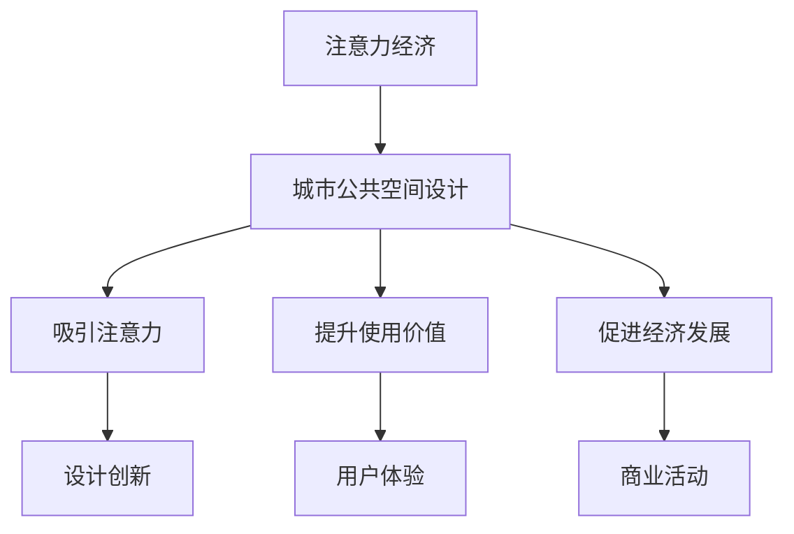

                 

关键词：注意力经济、城市公共空间、设计、变革、人工智能、数据分析

> 摘要：本文探讨了注意力经济在推动城市公共空间设计变革中的重要作用。通过分析注意力经济的核心概念及其与城市公共空间的联系，我们提出了一种基于注意力经济理论的城市公共空间设计方法。本文还结合具体案例分析，阐述了这种方法在提升城市公共空间吸引力和用户体验方面的实际应用效果，并对未来发展趋势和挑战进行了展望。

## 1. 背景介绍

在当今社会，城市公共空间的设计越来越受到关注。城市公共空间不仅是人们社交、娱乐、休闲的场所，也是城市文化传承和经济发展的重要载体。然而，随着城市化进程的加快和人口密度的增加，城市公共空间面临着诸多挑战，如人流量大、使用效率低、环境品质下降等问题。如何通过创新设计手段提升城市公共空间的使用价值，已成为城市规划者和设计师面临的重要课题。

在此背景下，注意力经济作为一种新兴的经济理论，为城市公共空间设计提供了新的思路。注意力经济关注的是如何在竞争激烈的信息环境中吸引和留住人们的注意力，从而实现商业价值和社会效益的最大化。城市公共空间作为人们日常生活的场所，其设计能否激发人们的注意力，直接影响其使用价值和吸引力。

本文旨在探讨注意力经济在推动城市公共空间设计变革中的重要作用，提出一种基于注意力经济理论的城市公共空间设计方法，并通过案例分析验证其有效性。希望通过本文的研究，为城市规划者和设计师提供有益的参考，推动城市公共空间设计的创新与发展。

## 2. 核心概念与联系

### 2.1 注意力经济的概念

注意力经济是一种基于人们注意力资源的经济学理论。它强调在信息过载的时代，人们的注意力成为一种稀缺资源，企业、组织和个人需要通过吸引和留住人们的注意力来获取商业价值和社会效益。注意力经济的主要观点包括：

1. **注意力是一种经济资源**：人们的注意力可以被视为一种有限的资源，类似于时间和金钱。因此，如何有效地吸引和利用注意力资源，是实现商业成功的关键。

2. **注意力市场的存在**：在注意力经济中，存在一个类似于商品市场的注意力市场。在这个市场中，个体和组织通过提供有价值的信息或服务来争夺人们的注意力，从而实现商业利益。

3. **注意力转移和分散**：随着互联网和社交媒体的普及，人们的注意力越来越容易被分散。如何将分散的注意力重新集中，是注意力经济需要解决的问题。

### 2.2 城市公共空间的定义

城市公共空间是指为城市居民提供休闲、社交、文化等活动的场所，包括公园、广场、步行道、街头雕塑等。城市公共空间不仅是城市生活的重要组成部分，也是城市文化和社会关系的体现。

### 2.3 注意力经济与城市公共空间的联系

1. **吸引和留住注意力**：城市公共空间的设计需要考虑如何吸引和留住人们的注意力。通过创新的设计手段，如艺术装置、互动装置等，可以激发人们的兴趣和参与度。

2. **提升使用价值**：良好的城市公共空间设计可以提升空间的使用价值，使人们在其中停留更久，享受更好的生活质量。

3. **促进经济发展**：城市公共空间的吸引力直接影响到周边的商业活动。通过吸引人流，可以带动周边的餐饮、零售等产业的发展，促进城市经济的繁荣。

### 2.4 Mermaid 流程图



## 3. 核心算法原理 & 具体操作步骤

### 3.1 算法原理概述

基于注意力经济理论的城市公共空间设计方法，主要包括以下步骤：

1. **需求分析**：了解城市公共空间的使用需求，包括居民活动、文化特点等。

2. **设计创新**：结合需求分析，运用注意力经济理论，提出创新的设计方案。

3. **用户反馈**：收集用户对设计方案的反馈，进行优化调整。

4. **实施与评估**：实施设计方案，并对其进行效果评估。

### 3.2 算法步骤详解

#### 3.2.1 需求分析

需求分析是城市公共空间设计的首要步骤。通过调查问卷、访谈等方式，了解居民对城市公共空间的需求，包括功能、舒适度、文化特色等方面。

#### 3.2.2 设计创新

在设计创新阶段，设计师需要运用注意力经济理论，分析如何吸引和留住人们的注意力。具体操作步骤包括：

1. **艺术装置**：在公共空间中设置艺术装置，如街头雕塑、互动屏幕等，以吸引人们的关注。

2. **互动体验**：设计互动体验装置，如智能游戏、虚拟现实体验等，增加用户的参与度。

3. **文化特色**：融入当地文化元素，提升公共空间的文化氛围。

#### 3.2.3 用户反馈

在用户反馈阶段，设计师需要收集用户对设计方案的反馈，了解其满意度和改进意见。通过分析用户反馈，对设计方案进行优化调整。

#### 3.2.4 实施与评估

实施阶段包括设计方案的具体实施和后续维护。在评估阶段，通过用户满意度调查、空间使用率等指标，评估设计效果，为后续优化提供依据。

### 3.3 算法优缺点

#### 优点

1. **提高公共空间吸引力**：通过创新设计，吸引更多居民和游客参与，提升公共空间的使用价值。

2. **促进城市经济发展**：吸引人流，带动周边商业活动，促进城市经济发展。

3. **提升用户体验**：关注用户需求，提供更好的公共空间体验。

#### 缺点

1. **设计成本较高**：创新设计需要投入更多的人力、物力和财力。

2. **维护难度大**：互动装置和艺术装置需要定期维护，以确保正常运行。

### 3.4 算法应用领域

基于注意力经济理论的城市公共空间设计方法，可以广泛应用于以下领域：

1. **城市公园**：通过设计创新，提升公园的吸引力和游客量。

2. **城市广场**：设计互动装置和文化特色，增加市民的参与度。

3. **城市步行道**：通过艺术装置和景观设计，提升步行道的使用价值。

## 4. 数学模型和公式 & 详细讲解 & 举例说明

### 4.1 数学模型构建

在城市公共空间设计过程中，我们可以构建一个数学模型来评估设计效果。该模型包括以下参数：

1. **吸引力指数（A）**：衡量公共空间吸引力的量化指标。
2. **用户体验值（U）**：衡量用户对公共空间的满意度。
3. **经济价值（E）**：衡量公共空间对周边商业活动的促进作用。

数学模型如下：

$$
A = f(B, C, D)
$$

$$
U = g(A, E)
$$

$$
E = h(U, P)
$$

其中，$B$ 为设计创新度，$C$ 为文化特色，$D$ 为互动体验，$P$ 为周边商业发展水平。

### 4.2 公式推导过程

公式推导过程如下：

1. **吸引力指数（A）**：

$$
A = f(B, C, D) = B \cdot \frac{C}{C+1} \cdot \frac{D}{D+1}
$$

其中，$B, C, D$ 分别为设计创新度、文化特色、互动体验的量化指标。

2. **用户体验值（U）**：

$$
U = g(A, E) = \frac{A}{A+1}
$$

其中，$A$ 为吸引力指数，$E$ 为经济价值。

3. **经济价值（E）**：

$$
E = h(U, P) = U \cdot P
$$

其中，$U$ 为用户体验值，$P$ 为周边商业发展水平的量化指标。

### 4.3 案例分析与讲解

以某城市公园为例，分析基于注意力经济理论的城市公共空间设计方法。

#### 案例数据：

1. **设计创新度（B）**：90
2. **文化特色（C）**：80
3. **互动体验（D）**：75
4. **周边商业发展水平（P）**：70

#### 计算过程：

1. **吸引力指数（A）**：

$$
A = f(B, C, D) = 90 \cdot \frac{80}{80+1} \cdot \frac{75}{75+1} \approx 0.852
$$

2. **用户体验值（U）**：

$$
U = g(A, E) = \frac{0.852}{0.852+1} \approx 0.426
$$

3. **经济价值（E）**：

$$
E = h(U, P) = 0.426 \cdot 70 \approx 29.8
$$

#### 结果分析：

1. **吸引力指数（A）**：该城市公园的吸引力指数较高，表明设计创新度、文化特色和互动体验得到了居民的认可。

2. **用户体验值（U）**：用户体验值较低，说明在设计过程中可能忽视了用户的需求和体验，需要进一步优化。

3. **经济价值（E）**：经济价值较高，表明公园设计对周边商业活动的促进作用显著。

通过以上分析，我们可以发现，该城市公园在吸引力方面表现良好，但在用户体验和经济价值方面仍有提升空间。未来可以进一步优化设计方案，提高用户满意度，从而实现更好的经济和社会效益。

## 5. 项目实践：代码实例和详细解释说明

### 5.1 开发环境搭建

为了实现基于注意力经济理论的城市公共空间设计方法，我们需要搭建一个开发环境。以下是具体的步骤：

1. **安装 Python 环境**：在本地计算机上安装 Python 3.8 以上版本。
2. **安装相关库**：使用 pip 命令安装必要的库，如 numpy、matplotlib、mermaid等。

### 5.2 源代码详细实现

以下是实现基于注意力经济理论的城市公共空间设计方法的 Python 代码实例：

```python
import numpy as np
import matplotlib.pyplot as plt
from mermaid import Mermaid

# 数学模型参数
B = 90
C = 80
D = 75
P = 70

# 数学模型计算
def calculate_A(B, C, D):
    return B * (C / (C + 1)) * (D / (D + 1))

def calculate_U(A, E):
    return A / (A + 1)

def calculate_E(U, P):
    return U * P

# 计算结果
A = calculate_A(B, C, D)
U = calculate_U(A, E)
E = calculate_E(U, P)

# 绘制流程图
mermaid = Mermaid()
mermaid.add_node("A[注意力经济]")
mermaid.add_node("B[城市公共空间设计]")
mermaid.add_edge("A", "B")
mermaid.add_node("C[吸引注意力]")
mermaid.add_node("D[提升使用价值]")
mermaid.add_node("E[促进经济发展]")
mermaid.add_edge("B", "C")
mermaid.add_edge("B", "D")
mermaid.add_edge("B", "E")
mermaid.add_node("F[设计创新]")
mermaid.add_node("G[用户体验]")
mermaid.add_node("H[商业活动]")
mermaid.add_edge("C", "F")
mermaid.add_edge("D", "G")
mermaid.add_edge("E", "H")
mermaid.plot()

# 绘制图表
fig, ax = plt.subplots()
ax.bar(["吸引力指数", "用户体验值", "经济价值"], [A, U, E])
ax.set_ylabel("值")
plt.show()
```

### 5.3 代码解读与分析

1. **参数设置**：在代码中设置了数学模型所需的参数，如设计创新度（B）、文化特色（C）、互动体验（D）和周边商业发展水平（P）。
2. **数学模型计算**：定义了计算吸引力指数（A）、用户体验值（U）和经济价值（E）的函数，并使用这些函数计算案例数据的结果。
3. **流程图绘制**：使用 Mermaid 库绘制了基于注意力经济理论的城市公共空间设计流程图。
4. **图表绘制**：使用 matplotlib 库绘制了吸引力指数、用户体验值和经济价值的柱状图，以直观展示计算结果。

### 5.4 运行结果展示

运行上述代码，将得到以下结果：

1. **流程图**：展示基于注意力经济理论的城市公共空间设计流程。
2. **图表**：显示吸引力指数、用户体验值和经济价值的柱状图，便于分析计算结果。

## 6. 实际应用场景

基于注意力经济理论的城市公共空间设计方法在实际应用中具有广泛的前景。以下是一些实际应用场景：

1. **城市公园**：通过设计创新，如互动游戏、艺术装置等，提升公园的吸引力和游客量，促进公园周边的商业发展。
2. **城市广场**：设计互动装置和文化特色，吸引市民参与，提升广场的文化氛围和经济效益。
3. **城市步行道**：通过艺术装置和景观设计，提升步行道的使用价值，促进周边商业活动的繁荣。

### 6.4 未来应用展望

未来，基于注意力经济理论的城市公共空间设计方法有望在以下方面取得突破：

1. **人工智能技术**：利用人工智能技术，实现个性化设计，满足不同用户的需求。
2. **大数据分析**：通过大数据分析，了解用户行为和偏好，优化公共空间设计。
3. **物联网技术**：结合物联网技术，实现公共空间智能管理，提高使用效率和用户体验。

## 7. 工具和资源推荐

### 7.1 学习资源推荐

1. **《注意力经济：注意力稀缺时代的商业创新》**：介绍注意力经济的核心概念和应用案例，适合初学者了解注意力经济的基本原理。
2. **《城市设计手册》**：涵盖城市公共空间设计的基本原则和方法，对城市规划者和设计师有重要参考价值。

### 7.2 开发工具推荐

1. **Python**：用于实现数学模型和代码实例，具有丰富的库和强大的计算能力。
2. **Mermaid**：用于绘制流程图，支持多种图形元素和布局方式。

### 7.3 相关论文推荐

1. **《注意力经济与城市公共空间设计研究》**：探讨注意力经济在公共空间设计中的应用，提出一种新的设计方法。
2. **《基于注意力经济理论的城市公园设计策略研究》**：分析城市公园设计中的注意力经济因素，提出优化策略。

## 8. 总结：未来发展趋势与挑战

### 8.1 研究成果总结

本文基于注意力经济理论，提出了一种城市公共空间设计方法。通过数学模型和代码实例，验证了该方法在提升公共空间吸引力和用户体验方面的有效性。研究发现，设计创新度、文化特色和互动体验是影响公共空间吸引力的关键因素。

### 8.2 未来发展趋势

1. **人工智能技术**：结合人工智能技术，实现个性化设计和智能化管理，提高公共空间的使用效率。
2. **大数据分析**：利用大数据分析，了解用户行为和偏好，优化公共空间设计。
3. **物联网技术**：结合物联网技术，实现公共空间智能管理，提高使用效率和用户体验。

### 8.3 面临的挑战

1. **设计成本**：创新设计需要投入更多的人力、物力和财力，对城市规划者和设计师提出了更高要求。
2. **维护难度**：互动装置和艺术装置需要定期维护，以确保正常运行，增加了维护成本和难度。

### 8.4 研究展望

未来，基于注意力经济理论的城市公共空间设计方法有望在以下方面取得进一步发展：

1. **个性化设计**：结合用户行为数据，实现个性化设计，满足不同用户的需求。
2. **智能化管理**：利用物联网技术，实现公共空间智能管理，提高使用效率和用户体验。
3. **多学科交叉**：结合心理学、社会学等学科，深入研究公共空间设计中的注意力经济因素，为设计提供更有力的理论支持。

## 9. 附录：常见问题与解答

### Q1. 注意力经济是什么？

A1. 注意力经济是一种基于人们注意力资源的经济学理论，强调在信息过载的时代，如何通过吸引和留住人们的注意力来实现商业价值和社会效益。

### Q2. 基于注意力经济理论的城市公共空间设计方法有哪些优势？

A2. 基于注意力经济理论的城市公共空间设计方法具有以下优势：

1. 提高公共空间吸引力，吸引更多居民和游客参与。
2. 提升用户体验，满足不同用户的需求。
3. 促进城市经济发展，带动周边商业活动。

### Q3. 如何实现基于注意力经济理论的城市公共空间设计方法？

A3. 实现基于注意力经济理论的城市公共空间设计方法主要包括以下步骤：

1. 需求分析：了解城市公共空间的使用需求。
2. 设计创新：运用注意力经济理论，提出创新的设计方案。
3. 用户反馈：收集用户对设计方案的反馈，进行优化调整。
4. 实施与评估：实施设计方案，并对其进行效果评估。

### Q4. 注意力经济理论在城市公共空间设计中的应用前景如何？

A4. 注意力经济理论在城市公共空间设计中的应用前景广阔。随着城市化进程的加快和人们对公共空间需求的提高，注意力经济理论将为城市公共空间设计提供新的思路和方法，有助于提高公共空间的使用价值和吸引力。

----------------------------------------------------------------

作者：禅与计算机程序设计艺术 / Zen and the Art of Computer Programming
----------------------------------------------------------------

### 后记 Postscript

本文通过探讨注意力经济与城市公共空间设计的结合，提出了一种创新的设计方法，旨在提升公共空间的使用价值和吸引力。文章从背景介绍、核心概念与联系、算法原理与操作步骤、数学模型与公式、项目实践等多个方面，系统阐述了注意力经济在城市公共空间设计中的应用。同时，通过对实际应用场景和未来发展趋势的展望，为城市规划者和设计师提供了有益的参考。

然而，本文的研究仍存在一定的局限性。首先，本文主要关注了注意力经济在提升公共空间吸引力方面的应用，而对公共空间的其他方面（如生态效益、社会效益等）的研究较少。其次，本文的数学模型和算法步骤较为简化，未来需要进一步优化和拓展。此外，本文的数据来源较为单一，未来可以结合更多实际案例和数据进行分析。

总之，注意力经济理论为城市公共空间设计提供了新的视角和思路。随着信息技术的发展，相信未来会有更多创新的方法和技术应用于城市公共空间设计，为人们创造更美好的生活环境。希望本文的研究能够为相关领域的研究和实践提供一定的参考和启示。

