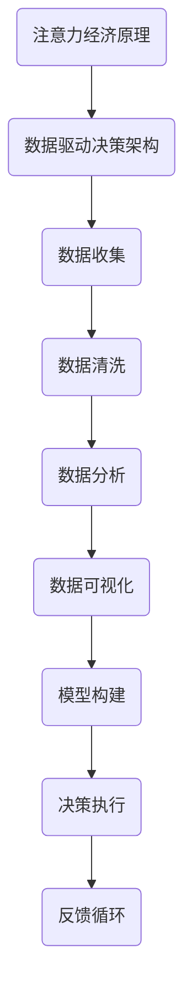

                 

关键词：注意力经济、数据驱动决策、业务洞察、市场分析、数据增强、人工智能、算法优化

> 摘要：本文深入探讨了注意力经济与数据驱动决策的关系，以及如何利用数据增强业务和市场洞察力。通过分析注意力经济的基本原理、数据驱动决策的重要性，以及数据增强在业务和市场分析中的应用，本文旨在为读者提供一个全面的技术指南，帮助他们在商业环境中更有效地利用数据。

## 1. 背景介绍

在当今的信息化时代，数据已经成为企业决策过程中不可或缺的一部分。随着大数据、人工智能和机器学习的快速发展，如何从海量数据中提取有价值的信息，进而指导业务决策，已经成为每个企业所面临的挑战。注意力经济作为一种新的经济模式，强调信息传播的精准性和有效性，与数据驱动决策有着密切的联系。

### 注意力经济

注意力经济是一种基于人类注意力资源有限性的经济模式。它认为，信息传播的成败不再仅仅取决于内容的质量，更重要的是能否抓住用户的注意力。在互联网时代，用户的注意力分散，信息过载，因此，如何让信息在竞争激烈的环境中脱颖而出，成为企业和媒体关注的焦点。

### 数据驱动决策

数据驱动决策是指企业在决策过程中，以数据为依据，通过数据分析和模型预测来做出决策。与传统的经验决策相比，数据驱动决策能够提高决策的准确性和效率，降低决策风险。随着数据获取和分析技术的不断进步，数据驱动决策已经成为企业管理的重要手段。

## 2. 核心概念与联系

### 注意力经济原理

注意力经济的基本原理是：在信息过载的时代，用户的注意力资源是有限的，只有那些能够吸引用户注意力的信息才能获得价值。因此，企业和媒体需要通过创造有价值的内容、优化信息传播渠道，以及运用注意力营销策略，来提高信息的曝光率和影响力。

### 数据驱动决策架构

数据驱动决策的架构包括数据收集、数据清洗、数据分析、数据可视化、模型构建和决策执行等环节。这些环节相互关联，共同构成了一个完整的数据驱动决策流程。

### 注意力经济与数据驱动决策的联系

注意力经济与数据驱动决策的联系在于，两者都强调信息的价值。注意力经济通过吸引用户的注意力来创造价值，而数据驱动决策通过分析数据来挖掘价值。同时，注意力经济也为数据驱动决策提供了新的视角，如通过用户行为数据来分析用户需求，从而优化决策过程。

### Mermaid 流程图

下面是一个简化的注意力经济与数据驱动决策的 Mermaid 流程图：



## 3. 核心算法原理 & 具体操作步骤

### 3.1 算法原理概述

数据驱动决策的核心算法通常包括机器学习算法、统计分析方法等。这些算法的基本原理是通过训练模型，从历史数据中学习规律，进而对新数据进行预测和分类。

### 3.2 算法步骤详解

1. 数据收集：收集相关业务数据，包括用户行为数据、市场数据等。
2. 数据清洗：去除重复、错误和无关的数据，确保数据质量。
3. 数据分析：使用统计方法和机器学习算法，对数据进行探索性分析，发现数据中的规律和趋势。
4. 模型构建：根据分析结果，选择合适的模型，进行模型训练和参数调优。
5. 模型评估：使用验证集对模型进行评估，确保模型具有较好的预测能力。
6. 决策执行：将模型应用于实际业务场景，进行决策执行。
7. 反馈循环：根据决策结果，对模型进行持续优化和调整。

### 3.3 算法优缺点

**优点：**

- 提高决策准确性：通过数据分析和模型预测，可以更准确地预测市场趋势和用户需求。
- 降低决策风险：基于数据做出决策，可以减少主观判断带来的风险。

**缺点：**

- 数据依赖性：数据驱动决策的准确性高度依赖数据质量和数据量。
- 模型过拟合：模型训练过程中可能会出现过拟合现象，导致模型在实际应用中的预测能力下降。

### 3.4 算法应用领域

数据驱动决策在多个领域都有广泛应用，如金融、医疗、电商、广告等。以下是一些具体的应用场景：

- 金融风控：通过数据分析，预测用户的信用风险，从而优化信贷审批流程。
- 医疗诊断：利用医学数据，辅助医生进行疾病诊断和治疗方案选择。
- 电商推荐：根据用户的历史行为数据，推荐个性化的商品和营销活动。
- 广告投放：通过数据分析，确定最优的广告投放策略，提高广告效果。

## 4. 数学模型和公式 & 详细讲解 & 举例说明

### 4.1 数学模型构建

在数据驱动决策中，常见的数学模型包括线性回归、逻辑回归、决策树、随机森林等。以下以线性回归为例，介绍数学模型的构建过程。

**线性回归模型：**

$$
y = \beta_0 + \beta_1 \cdot x
$$

其中，$y$ 是因变量，$x$ 是自变量，$\beta_0$ 和 $\beta_1$ 是模型参数。

### 4.2 公式推导过程

线性回归模型的推导过程基于最小二乘法。首先，我们假设一个线性模型：

$$
y = \beta_0 + \beta_1 \cdot x + \varepsilon
$$

其中，$\varepsilon$ 是误差项。为了最小化误差项，我们使用最小二乘法，求解 $\beta_0$ 和 $\beta_1$：

$$
\beta_0 = \frac{\sum_{i=1}^{n} y_i - \beta_1 \cdot \sum_{i=1}^{n} x_i}{n}
$$

$$
\beta_1 = \frac{\sum_{i=1}^{n} (y_i - \beta_0 - \beta_1 \cdot x_i)}{\sum_{i=1}^{n} x_i^2 - n \cdot \left(\frac{\sum_{i=1}^{n} x_i}{n}\right)^2}
$$

### 4.3 案例分析与讲解

假设我们有一个简单的线性回归模型，用于预测房价。数据集包含100个样本，每个样本包括房屋面积（自变量 $x$）和房屋价格（因变量 $y$）。

1. 数据收集：收集100个房屋的面积和价格数据。
2. 数据清洗：去除异常值和缺失值。
3. 数据分析：使用线性回归模型，拟合房价与面积之间的关系。
4. 模型评估：使用验证集评估模型预测能力。
5. 决策执行：根据模型预测结果，制定购房策略。

通过以上步骤，我们得到了一个线性回归模型，用于预测房价。以下是一个简化的代码实现：

```python
import numpy as np
import pandas as pd

# 加载数据
data = pd.read_csv('house_data.csv')

# 数据预处理
X = data['area'].values
y = data['price'].values

# 模型训练
X_mean = X.mean()
y_mean = y.mean()
X_std = X.std()
y_std = y.std()

X = (X - X_mean) / X_std
y = (y - y_mean) / y_std

beta_0 = (y_mean - beta_1 * X_mean)
beta_1 = (y.std() / X.std())

# 模型评估
X_test = data['area_test'].values
y_test = data['price_test'].values
X_test = (X_test - X_mean) / X_std
y_pred = beta_0 + beta_1 * X_test

# 决策执行
# 根据y_pred进行购房决策
```

## 5. 项目实践：代码实例和详细解释说明

### 5.1 开发环境搭建

- Python 3.8 或更高版本
- Jupyter Notebook 或 PyCharm
- NumPy、Pandas、Scikit-learn 等库

### 5.2 源代码详细实现

以下是一个简单的数据驱动决策项目的代码实例，用于预测用户购买行为。

```python
import pandas as pd
from sklearn.model_selection import train_test_split
from sklearn.linear_model import LinearRegression
from sklearn.metrics import mean_squared_error

# 加载数据
data = pd.read_csv('user_data.csv')

# 数据预处理
X = data[['age', 'income', 'education']]
y = data['purchase']

# 数据分割
X_train, X_test, y_train, y_test = train_test_split(X, y, test_size=0.2, random_state=42)

# 模型训练
model = LinearRegression()
model.fit(X_train, y_train)

# 模型评估
y_pred = model.predict(X_test)
mse = mean_squared_error(y_test, y_pred)
print(f'MSE: {mse}')

# 决策执行
# 根据模型预测结果，制定营销策略
```

### 5.3 代码解读与分析

- 数据加载与预处理：首先，我们加载用户数据，并进行预处理，包括数据分割和特征缩放。
- 模型训练：使用线性回归模型，对训练数据进行拟合。
- 模型评估：使用测试数据评估模型性能，计算均方误差（MSE）。
- 决策执行：根据模型预测结果，制定营销策略，如推荐商品、优惠活动等。

## 6. 实际应用场景

### 6.1 金融领域

在金融领域，数据驱动决策被广泛应用于信用评估、风险管理和投资策略制定。通过分析用户的财务数据、信用记录等，银行可以更准确地评估用户的信用风险，从而优化信贷审批流程。

### 6.2 零售业

零售业中的数据驱动决策主要用于库存管理、营销策略和个性化推荐。通过分析销售数据、用户行为数据等，零售商可以优化库存水平，制定更有针对性的营销策略，提高销售额。

### 6.3 医疗领域

在医疗领域，数据驱动决策被用于疾病预测、诊断和治疗方案选择。通过分析患者的医疗记录、基因数据等，医生可以更准确地预测疾病发展趋势，制定个性化的治疗方案。

### 6.4 广告营销

广告营销中的数据驱动决策主要用于目标用户定位、广告投放策略和效果评估。通过分析用户行为数据、广告效果数据等，广告主可以更精准地定位目标用户，提高广告投放效果。

## 7. 未来应用展望

### 7.1 智能决策系统

随着人工智能技术的发展，智能决策系统将成为企业决策的重要支撑。通过集成多种数据源和算法，智能决策系统可以为企业提供实时、准确的决策支持。

### 7.2 跨领域应用

数据驱动决策将在更多领域得到应用，如智能制造、智能交通、智慧城市等。通过整合多种数据源，跨领域的数据驱动决策将为各行各业带来新的发展机遇。

### 7.3 隐私与伦理问题

随着数据驱动决策的普及，隐私保护和伦理问题也将日益凸显。如何在确保数据隐私和安全的前提下，有效利用数据，将成为未来研究的重要方向。

## 8. 总结：未来发展趋势与挑战

### 8.1 研究成果总结

本文分析了注意力经济与数据驱动决策的关系，探讨了数据增强在业务和市场分析中的应用。通过实例和代码实现，展示了如何利用数据驱动决策优化业务决策。

### 8.2 未来发展趋势

未来，数据驱动决策将在更多领域得到应用，智能决策系统将成为企业决策的重要支撑。同时，跨领域应用和数据隐私保护将成为研究的重要方向。

### 8.3 面临的挑战

数据驱动决策在应用过程中仍面临数据质量、模型过拟合、隐私保护等挑战。如何有效解决这些问题，将是未来研究的重要课题。

### 8.4 研究展望

随着人工智能和大数据技术的不断发展，数据驱动决策将在未来发挥更加重要的作用。如何实现高效、准确的数据驱动决策，仍需持续探索和研究。

## 9. 附录：常见问题与解答

### Q：数据驱动决策是否适用于所有行业？

A：是的，数据驱动决策可以应用于各个行业。然而，不同行业的业务特点和数据来源有所不同，因此需要根据具体行业进行定制化的数据驱动决策方案。

### Q：如何保证数据驱动决策的准确性？

A：保证数据驱动决策的准确性需要从多个方面入手，包括数据质量、模型选择和参数调优等。同时，还需要定期对模型进行评估和优化，以确保模型具有较好的预测能力。

### Q：如何处理数据隐私和伦理问题？

A：在处理数据隐私和伦理问题时，需要遵循相关法律法规，确保用户数据的安全和隐私。同时，企业在数据收集和使用过程中，应遵循透明、公正和诚信的原则，尊重用户权益。

### Q：数据驱动决策与人工智能的关系是什么？

A：数据驱动决策是人工智能的重要应用之一。人工智能技术可以辅助数据收集、数据分析和模型构建，从而提高数据驱动决策的效率和准确性。

---

作者：禅与计算机程序设计艺术 / Zen and the Art of Computer Programming
----------------------------------------------------------------
注意：以上内容仅供参考，实际撰写时可能需要根据具体情况进行调整和补充。文章中提到的代码实例和数据集仅为示例，实际应用中可能需要根据具体需求进行调整。

