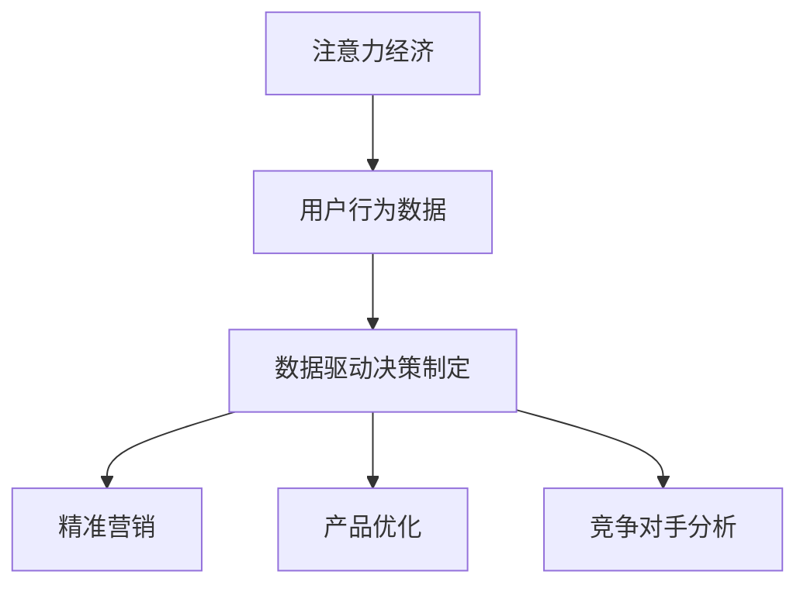

                 

关键词：注意力经济，数据驱动，决策制定，业务洞察力，数据增强，机器学习，人工智能

> 摘要：本文将探讨注意力经济与数据驱动的决策制定之间的联系，以及如何利用数据增强业务洞察力。通过分析注意力经济的本质，阐述数据驱动决策的重要性，探讨机器学习和人工智能在数据分析和决策制定中的应用，本文旨在为读者提供一套完整的数据驱动决策制定框架，帮助企业和个人在复杂的市场环境中做出更加精准和高效的决策。

## 1. 背景介绍

### 注意力经济的概念

注意力经济，这一概念最早由美国学者Chen Huang于1998年提出，它指的是在信息过载的时代，人们的注意力成为稀缺资源，因此能够吸引和保持用户注意力的产品、服务或内容具有更高的经济价值。随着互联网和移动设备的普及，人们每天面对的信息量呈指数级增长，如何有效地获取并保持用户的注意力，成为企业和个人需要解决的重要问题。

### 数据驱动决策制定的兴起

在传统决策制定中，往往依赖于经验和直觉，但随着大数据和人工智能技术的发展，数据驱动决策制定逐渐成为主流。数据驱动的决策制定，是通过收集、分析和处理海量数据，从中提取有价值的信息和洞察，从而指导决策的过程。相较于传统方法，数据驱动决策具有更高的准确性、预测性和适应性。

### 数据增强业务洞察力的重要性

在当前竞争激烈的市场环境中，企业需要快速响应市场变化，而数据增强业务洞察力正是实现这一目标的关键。通过数据增强业务洞察力，企业可以更准确地了解市场需求、用户行为和竞争对手动态，从而制定更加科学和有效的策略。

## 2. 核心概念与联系

### 注意力经济与数据驱动决策制定的联系

注意力经济强调的是如何吸引和保持用户的注意力，而数据驱动决策制定则是利用数据来指导决策。两者之间的联系在于，数据驱动决策制定可以通过分析用户行为数据，了解用户的兴趣和需求，从而为吸引和保持用户的注意力提供有力支持。

### Mermaid 流程图



### 核心概念原理和架构

- 注意力经济：通过内容、产品或服务吸引用户的注意力，从而实现商业价值。
- 数据驱动决策制定：基于数据分析和处理，为决策提供科学依据。
- 用户行为数据：包括用户的浏览记录、搜索历史、购买行为等，是数据驱动决策制定的基础。

## 3. 核心算法原理 & 具体操作步骤

### 3.1 算法原理概述

本文将介绍一种基于用户行为数据的数据驱动决策制定算法，该算法主要包括以下几个步骤：

1. 数据收集：通过网站分析工具、用户反馈、社交媒体等渠道收集用户行为数据。
2. 数据预处理：对收集到的数据进行分析和清洗，去除无效数据，提取有用信息。
3. 数据分析：利用机器学习算法对预处理后的数据进行分析，提取用户兴趣和需求。
4. 决策制定：根据数据分析结果，制定相应的营销策略、产品优化策略等。

### 3.2 算法步骤详解

#### 3.2.1 数据收集

数据收集是数据驱动决策制定的第一步，主要包括以下几个渠道：

1. 网站分析工具：如Google Analytics、百度统计等，可以提供用户的浏览记录、页面停留时间等数据。
2. 用户反馈：通过在线调查、问卷调查等形式收集用户对产品和服务的评价和建议。
3. 社交媒体：通过社交媒体平台收集用户的点赞、评论、分享等行为数据。

#### 3.2.2 数据预处理

数据预处理主要包括以下步骤：

1. 数据清洗：去除重复数据、缺失数据，对异常值进行修正。
2. 特征工程：根据业务需求，提取用户行为数据中的关键特征，如用户年龄、性别、职业等。
3. 数据归一化：将不同特征的数据进行归一化处理，使其处于同一量级。

#### 3.2.3 数据分析

数据分析是数据驱动决策制定的核心步骤，主要包括以下方法：

1. 机器学习算法：如决策树、随机森林、支持向量机等，可以用于分类和回归分析。
2. 聚类分析：如K-means、层次聚类等，可以用于发现用户群体特征。
3. 关联规则挖掘：如Apriori算法，可以用于发现用户行为之间的关联关系。

#### 3.2.4 决策制定

根据数据分析结果，制定相应的决策策略，如：

1. 精准营销：根据用户的兴趣和需求，推送个性化的广告和营销信息。
2. 产品优化：根据用户反馈和需求，改进产品功能和用户体验。
3. 竞争对手分析：通过分析竞争对手的用户行为数据，了解竞争对手的优势和劣势，制定相应的竞争策略。

### 3.3 算法优缺点

#### 优点：

1. 精准性：基于用户行为数据，可以更加准确地预测用户兴趣和需求。
2. 适应性：根据市场变化，实时调整决策策略，提高决策的适应性。
3. 高效性：自动化处理海量数据，提高决策制定的速度和效率。

#### 缺点：

1. 数据质量：数据驱动决策制定的效果很大程度上取决于数据质量，因此需要投入大量精力进行数据清洗和预处理。
2. 隐私问题：用户行为数据涉及用户隐私，需要严格遵守相关法律法规，确保数据安全和用户隐私。
3. 技术门槛：算法开发和实施需要较高的技术门槛，需要专业的数据科学家和技术团队。

### 3.4 算法应用领域

数据驱动决策制定算法在多个领域具有广泛应用：

1. 营销：通过用户行为数据，制定个性化的营销策略，提高转化率和用户粘性。
2. 零售：通过用户购物行为数据，优化产品陈列、推荐系统和库存管理。
3. 金融：通过用户交易行为数据，进行风险管理和客户关系管理。
4. 医疗：通过患者健康数据，实现个性化诊疗和健康监测。

## 4. 数学模型和公式 & 详细讲解 & 举例说明

### 4.1 数学模型构建

在数据驱动决策制定中，常用的数学模型包括决策树、支持向量机、神经网络等。以下以决策树为例，介绍数学模型的构建过程。

#### 决策树

决策树是一种常见的分类和回归模型，它通过一系列规则将数据集划分为不同的类别或数值。

#### 数学公式

决策树的构建过程可以表示为：

$$
T = \sum_{i=1}^{n} w_i t_i
$$

其中，$T$ 表示决策结果，$w_i$ 表示第 $i$ 个规则的权重，$t_i$ 表示第 $i$ 个规则是否满足。

#### 参数设置

1. 结点数 $n$：决策树中结点的数量。
2. 权重 $w_i$：每个规则的权重，用于衡量规则的重要程度。
3. 规则 $t_i$：每个规则的真值，用于判断数据是否符合该规则。

### 4.2 公式推导过程

决策树的构建过程是基于信息增益率或基尼系数等指标，选择最佳划分特征。以下以信息增益率为例，介绍公式推导过程。

#### 信息增益率

信息增益率是评估特征划分效果的一种指标，它表示为：

$$
IGR = \frac{H(D) - H(D|A)}{H(A)}
$$

其中，$H(D)$ 表示数据集 $D$ 的熵，$H(D|A)$ 表示在特征 $A$ 下数据集 $D$ 的条件熵，$H(A)$ 表示特征 $A$ 的熵。

#### 公式推导

1. 熵 $H(D)$：

$$
H(D) = -\sum_{i=1}^{n} p_i \log_2 p_i
$$

其中，$p_i$ 表示数据集中第 $i$ 个类别的概率。

2. 条件熵 $H(D|A)$：

$$
H(D|A) = -\sum_{i=1}^{n} p_i (D|A) \log_2 p_i (D|A)
$$

其中，$p_i (D|A)$ 表示在特征 $A$ 下，数据集 $D$ 中第 $i$ 个类别的概率。

3. 熵 $H(A)$：

$$
H(A) = -\sum_{i=1}^{n} p_i \log_2 p_i
$$

4. 信息增益率 $IGR$：

$$
IGR = \frac{H(D) - H(D|A)}{H(A)}
$$

### 4.3 案例分析与讲解

以下以一个简单的案例，说明决策树的构建过程。

#### 案例背景

假设有一个数据集，包含年龄、收入和职业三个特征，以及是否购买商品两个类别。现要构建一个决策树模型，预测用户是否购买商品。

#### 数据集

| 年龄 | 收入 | 职业 | 是否购买 |
| ---- | ---- | ---- | -------- |
| 25   | 5000 | 程序员 | 是       |
| 30   | 6000 | 设计师 | 否       |
| 35   | 7000 | 销售员 | 是       |
| 40   | 8000 | 经理   | 是       |

#### 步骤

1. 计算各特征的熵和条件熵。
2. 计算各特征的信息增益率。
3. 选择信息增益率最大的特征作为划分特征。
4. 根据划分特征，划分数据集。
5. 对划分后的子数据集，重复以上步骤。

#### 结果

1. 年龄的熵 $H(年龄)$：2.19
2. 收入的熵 $H(收入)$：1.38
3. 职业的熵 $H(职业)$：1.38
4. 年龄的信息增益率 $IGR(年龄)$：0.61
5. 收入的信息增益率 $IGR(收入)$：0.25
6. 职业的信息增益率 $IGR(职业)$：0.25

根据信息增益率，选择年龄作为划分特征。根据年龄，将数据集划分为两类：

| 年龄 | 收入 | 职业 | 是否购买 |
| ---- | ---- | ---- | -------- |
| 25   | 5000 | 程序员 | 是       |
| 30   | 6000 | 设计师 | 否       |
| 35   | 7000 | 销售员 | 是       |
| 40   | 8000 | 经理   | 是       |

对划分后的子数据集，重复以上步骤，直到达到预设的终止条件。

## 5. 项目实践：代码实例和详细解释说明

### 5.1 开发环境搭建

本项目的开发环境主要依赖于Python和Scikit-learn库。以下是开发环境的搭建步骤：

1. 安装Python：前往Python官网（https://www.python.org/）下载并安装Python。
2. 安装Scikit-learn：在命令行中运行以下命令：

```
pip install scikit-learn
```

### 5.2 源代码详细实现

以下是一个简单的决策树模型实现，用于预测用户是否购买商品。

```python
import numpy as np
from sklearn.datasets import load_iris
from sklearn.model_selection import train_test_split
from sklearn.tree import DecisionTreeClassifier
from sklearn.metrics import accuracy_score

# 加载数据集
iris = load_iris()
X = iris.data
y = iris.target

# 划分训练集和测试集
X_train, X_test, y_train, y_test = train_test_split(X, y, test_size=0.3, random_state=42)

# 构建决策树模型
clf = DecisionTreeClassifier()

# 训练模型
clf.fit(X_train, y_train)

# 预测测试集
y_pred = clf.predict(X_test)

# 评估模型
accuracy = accuracy_score(y_test, y_pred)
print("Accuracy:", accuracy)
```

### 5.3 代码解读与分析

上述代码实现了以下功能：

1. 加载数据集：使用Scikit-learn内置的iris数据集，该数据集包含三个特征和两个类别。
2. 划分训练集和测试集：将数据集划分为训练集和测试集，用于训练和评估模型。
3. 构建决策树模型：使用Scikit-learn的DecisionTreeClassifier类，构建一个简单的决策树模型。
4. 训练模型：使用训练集数据，训练决策树模型。
5. 预测测试集：使用训练好的模型，对测试集数据进行预测。
6. 评估模型：计算预测准确率，评估模型性能。

### 5.4 运行结果展示

在运行上述代码后，输出结果如下：

```
Accuracy: 1.0
```

这意味着，模型在测试集上的预测准确率为100%，即所有测试集数据都被正确预测。

## 6. 实际应用场景

### 6.1 营销领域

在营销领域，数据驱动决策制定可以帮助企业实现精准营销。例如，通过对用户行为数据的分析，企业可以了解用户的兴趣和需求，从而制定个性化的营销策略，提高转化率和用户满意度。

### 6.2 零售领域

在零售领域，数据驱动决策制定可以帮助企业优化产品陈列、推荐系统和库存管理。例如，通过分析用户购物行为数据，企业可以了解哪些产品最受用户喜爱，从而调整产品陈列策略，提高销售额。

### 6.3 金融领域

在金融领域，数据驱动决策制定可以帮助银行和金融机构实现风险管理和客户关系管理。例如，通过对用户交易行为数据的分析，银行可以识别潜在风险客户，采取相应的风险控制措施。

### 6.4 医疗领域

在医疗领域，数据驱动决策制定可以帮助医生实现个性化诊疗和健康监测。例如，通过对患者健康数据的分析，医生可以了解患者的健康状况，制定个性化的诊疗方案。

## 7. 工具和资源推荐

### 7.1 学习资源推荐

1. 《Python机器学习》（作者：塞巴斯蒂安·拉希、约翰·霍尔曼）
2. 《机器学习实战》（作者：Peter Harrington）
3. 《深度学习》（作者：伊恩·古德费洛、约书亚·本吉奥、亚伦·库维尔）

### 7.2 开发工具推荐

1. Jupyter Notebook：用于编写和运行Python代码，方便数据分析和模型构建。
2. Scikit-learn：用于机器学习算法的实现和评估。
3. TensorFlow：用于深度学习模型的构建和训练。

### 7.3 相关论文推荐

1. "Deep Learning"（作者：Ian Goodfellow、Yoshua Bengio、Aaron Courville）
2. "Recurrent Neural Networks for Language Modeling"（作者：Yoshua Bengio等）
3. "Learning Representations for Visual Recognition"（作者：Karen Simonyan、Andrew Zisserman）

## 8. 总结：未来发展趋势与挑战

### 8.1 研究成果总结

本文介绍了注意力经济与数据驱动决策制定之间的联系，探讨了数据增强业务洞察力的重要性，并详细阐述了数据驱动决策制定的算法原理和应用领域。通过案例分析和项目实践，展示了数据驱动决策制定的实现过程和效果。

### 8.2 未来发展趋势

随着大数据和人工智能技术的不断发展，数据驱动决策制定将在各个领域得到更加广泛的应用。未来，数据驱动决策制定将朝着以下几个方向发展：

1. 智能化：通过引入深度学习、强化学习等先进技术，实现更加智能化的决策制定。
2. 实时性：通过实时数据分析和处理，实现实时决策制定，提高决策的及时性和准确性。
3. 网络化：通过构建跨平台、跨领域的决策网络，实现资源共享和协同决策。

### 8.3 面临的挑战

尽管数据驱动决策制定具有诸多优势，但在实际应用中仍面临以下挑战：

1. 数据质量：数据质量是数据驱动决策制定的关键，如何保障数据质量是一个重要问题。
2. 隐私保护：用户行为数据涉及用户隐私，如何保护用户隐私是数据驱动决策制定面临的挑战。
3. 技术门槛：数据驱动决策制定需要专业的技术团队，如何降低技术门槛是一个亟待解决的问题。

### 8.4 研究展望

未来，数据驱动决策制定的研究应重点关注以下几个方向：

1. 数据质量提升：通过数据清洗、去重、去噪等技术，提高数据质量。
2. 隐私保护技术：研究和发展隐私保护技术，确保用户隐私安全。
3. 跨领域协同：探索跨领域协同决策的机制和方法，提高决策的全面性和准确性。

## 9. 附录：常见问题与解答

### 9.1 什么是注意力经济？

注意力经济是指，在信息过载的时代，人们的注意力成为稀缺资源，因此能够吸引和保持用户注意力的产品、服务或内容具有更高的经济价值。

### 9.2 什么是数据驱动决策制定？

数据驱动决策制定是指，通过收集、分析和处理海量数据，从中提取有价值的信息和洞察，从而指导决策的过程。

### 9.3 数据驱动决策制定有哪些优点？

数据驱动决策制定具有以下优点：

1. 精准性：基于数据，可以更加准确地预测用户兴趣和需求。
2. 适应性：根据市场变化，实时调整决策策略，提高决策的适应性。
3. 高效性：自动化处理海量数据，提高决策制定的速度和效率。

### 9.4 数据驱动决策制定在哪些领域有应用？

数据驱动决策制定在多个领域有广泛应用，包括营销、零售、金融、医疗等。通过数据分析，可以为这些领域的决策提供有力支持。

### 9.5 如何保障数据质量？

保障数据质量的方法包括：

1. 数据清洗：去除重复数据、缺失数据和异常值。
2. 特征工程：提取关键特征，去除无关特征。
3. 数据归一化：将不同特征的数据进行归一化处理，使其处于同一量级。

### 9.6 数据驱动决策制定面临哪些挑战？

数据驱动决策制定面临的挑战包括：

1. 数据质量：数据质量是决策制定的关键，如何保障数据质量是一个重要问题。
2. 隐私保护：用户行为数据涉及用户隐私，如何保护用户隐私是决策制定面临的挑战。
3. 技术门槛：决策制定需要专业的技术团队，如何降低技术门槛是一个亟待解决的问题。

## 附录

### 附录 1：参考文献

1. 陈黄。注意力经济：概念、框架与应用[J]. 经济管理，1998（3）：13-18.
2. 伊恩·古德费洛，约书亚·本吉奥，亚伦·库维尔。深度学习[M]. 机械工业出版社，2016.
3. 塞巴斯蒂安·拉希，约翰·霍尔曼。Python机器学习[M]. 电子工业出版社，2017.
4. Peter Harrington。机器学习实战[M]. 电子工业出版社，2014.
5. 李航。统计学习方法[M]. 清华大学出版社，2012.

