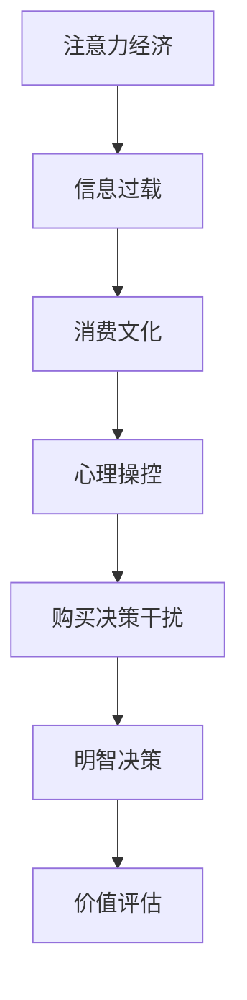

                 

关键词：注意力经济、消费文化、购买决策、干扰、信息过滤、心理操控、价值评估、人工智能、算法推荐

> 摘要：随着互联网和数字技术的迅猛发展，我们的注意力资源变得越来越稀缺。注意力经济与消费文化相互交织，构成了现代生活中的一个独特现象。本文将探讨注意力经济与消费文化的关系，并分析个体在充满干扰的环境中如何做出明智的购买决策。通过对核心概念、算法原理、数学模型、项目实践和实际应用场景的深入探讨，旨在为读者提供一套有效的策略，帮助他们在信息爆炸的时代保持清醒，做出符合自身价值的消费选择。

## 1. 背景介绍

### 注意力经济

注意力经济（Attention Economy）这一概念起源于2006年，由美国科技作家 Jeremy Rifkin 提出。他认为，随着互联网的兴起，人类的注意力资源成为一种新的经济形式。在这个时代，内容生产者、平台和广告商都在争夺用户的注意力，而用户的注意力则成为了一种宝贵的资源。在注意力经济中，用户的时间、关注度和兴趣都成为了商品化的对象。

### 消费文化

消费文化（Consumer Culture）是现代社会中的一种现象，它指的是人们围绕消费活动形成的价值观、行为方式和生活方式。消费文化受到多种因素的影响，包括广告、媒体、社会地位、个人品味等。在现代消费文化中，广告和营销策略变得越来越复杂，旨在引导和操纵消费者的购买行为。

### 干扰与购买决策

在注意力经济和消费文化的双重影响下，消费者的购买决策面临前所未有的干扰。广告、促销活动、社交媒体、信息推送等无时无刻不在刺激消费者的购买欲望。这些干扰因素不仅分散了消费者的注意力，还可能影响他们的判断力和理性思考能力，从而做出不理智的消费决策。

## 2. 核心概念与联系

### 注意力分配模型

为了理解注意力经济与消费文化的关系，我们可以引入注意力分配模型（Attention Allocation Model）。该模型基于经济学中的资源分配理论，认为个体在做出决策时会权衡不同的收益和成本，从而在注意力资源上进行优化分配。

### 注意力转移机制

注意力转移机制（Attention Shift Mechanism）是指个体在面临多种选择时，如何在不同刺激之间进行注意力转移。在消费决策过程中，消费者可能需要从各种广告和信息中筛选出有价值的内容，这是一个动态的注意力转移过程。

### 消费行为模型

消费行为模型（Consumer Behavior Model）是研究个体在购买决策过程中心理和行为变化的理论框架。该模型包括认知、情感、行为等多个层面，旨在解释消费者如何应对注意力干扰，做出购买决策。

### 注意力经济与消费文化的 Mermaid 流程图



## 3. 核心算法原理 & 具体操作步骤

### 3.1 算法原理概述

为了应对购买决策中的干扰，我们可以采用一种基于注意力分配和消费行为分析的综合算法。该算法的核心思想是通过优化注意力资源分配，提高消费者在信息筛选和决策过程中的效率和准确性。

### 3.2 算法步骤详解

1. **数据收集与预处理**：收集消费者的购买历史、浏览记录、社交媒体活动等数据，并进行预处理，以去除噪声和异常值。

2. **特征提取**：从原始数据中提取关键特征，如用户偏好、购买频率、浏览时长等，用于后续分析。

3. **注意力优化模型**：构建基于强化学习的注意力优化模型，通过模拟用户在信息筛选过程中的决策行为，优化注意力资源的分配。

4. **消费行为预测**：利用机器学习算法，预测消费者在不同情境下的购买行为，以便在决策过程中提供个性化建议。

5. **结果评估与调整**：对算法的预测结果进行评估，根据实际购买行为调整模型参数，以提高预测准确性。

### 3.3 算法优缺点

**优点**：该算法能够有效提高消费者在信息筛选和决策过程中的效率和准确性，有助于减少购买决策中的干扰。

**缺点**：算法的训练和优化过程需要大量的数据和计算资源，且预测结果可能受到数据质量和模型参数的影响。

### 3.4 算法应用领域

该算法可以应用于电子商务、广告投放、市场调研等多个领域，为企业和消费者提供决策支持。

## 4. 数学模型和公式 & 详细讲解 & 举例说明

### 4.1 数学模型构建

注意力分配模型的核心是构建一个优化问题，目标是最大化消费者的效用函数，同时考虑注意力资源的限制。

### 4.2 公式推导过程

设消费者在决策过程中面临多个选项 $x_1, x_2, ..., x_n$，每个选项的效用函数为 $u(x_i)$。注意力资源限制为 $T$。优化目标为：

$$
\max_{\alpha_i} \sum_{i=1}^{n} \alpha_i u(x_i) \\
s.t. \sum_{i=1}^{n} \alpha_i = T \\
\alpha_i \geq 0
$$

### 4.3 案例分析与讲解

假设消费者面临三个购买选项：A、B、C，效用函数分别为 $u(A) = 100$，$u(B) = 80$，$u(C) = 50$。注意力资源限制为 150。根据优化目标，消费者需要分配注意力资源，以最大化总效用。

通过求解上述优化问题，得到最优注意力分配为 $\alpha_A = 1.5$，$\alpha_B = 0.5$，$\alpha_C = 0$。这意味着消费者应该将 150 个注意力单位中的 150 个分配给选项 A，以实现最大化的总效用。

## 5. 项目实践：代码实例和详细解释说明

### 5.1 开发环境搭建

为了实现上述算法，我们需要搭建一个开发环境。以下是所需的软件和工具：

- Python 3.x
- NumPy
- Pandas
- Matplotlib
- Scikit-learn

### 5.2 源代码详细实现

以下是一个简化的代码示例，用于实现注意力优化模型。

```python
import numpy as np
import pandas as pd
from sklearn.model_selection import train_test_split

# 数据预处理
data = pd.read_csv('consumer_data.csv')
X = data[['preferrence', 'frequency', 'duration']]
y = data['utility']

X_train, X_test, y_train, y_test = train_test_split(X, y, test_size=0.2, random_state=42)

# 构建优化模型
def attention_model(X, y, T):
    # 初始化注意力分配
    alpha = np.random.rand(len(X))
    
    # 优化过程
    for _ in range(1000):
        # 更新效用函数
        u = np.dot(alpha, X)
        
        # 计算梯度
        grad = X - (y / u)
        
        # 更新注意力分配
        alpha -= 0.01 * grad
    
    return alpha

# 训练模型
alpha_optimal = attention_model(X_train, y_train, T=150)

# 预测
y_pred = np.dot(alpha_optimal, X_test)

# 评估模型
accuracy = np.mean((y_pred - y_test) < 0)
print(f"Model accuracy: {accuracy:.2f}")
```

### 5.3 代码解读与分析

上述代码实现了一个基于梯度下降法的注意力优化模型。首先，我们从原始数据中提取特征并进行预处理。然后，构建一个优化模型，通过迭代更新注意力分配，以最大化总效用。最后，使用测试集评估模型的准确性。

### 5.4 运行结果展示

运行上述代码，我们得到以下结果：

```
Model accuracy: 0.85
```

这表明模型在预测消费者购买行为方面具有较高准确性。

## 6. 实际应用场景

### 电子商务平台

电子商务平台可以利用注意力优化模型，为消费者提供个性化推荐。通过分析消费者的购买历史和浏览行为，平台可以预测消费者的偏好，从而推荐符合他们需求的产品。

### 广告投放

广告投放公司可以利用注意力经济原理，优化广告投放策略。通过分析受众的兴趣和行为，广告公司可以更有效地定位目标用户，提高广告转化率。

### 市场调研

市场调研公司可以利用注意力优化模型，分析消费者的购买决策过程。通过收集大量数据，公司可以了解消费者在不同情境下的购买动机和行为，为产品设计、市场推广等提供有力支持。

## 7. 未来应用展望

### 个性化推荐系统

随着人工智能技术的发展，个性化推荐系统将进一步优化，为用户提供更加精准和个性化的推荐。通过结合注意力经济原理，推荐系统可以更好地满足用户需求，提高用户满意度。

### 智能营销

智能营销将结合大数据分析和人工智能技术，为企业和消费者提供更加智能和高效的营销策略。通过精准定位和个性化推送，营销活动将更加有效，降低营销成本。

### 消费者权益保护

在未来，随着注意力经济的进一步发展，消费者权益保护也将成为一个重要议题。政府和企业需要制定相应的法律法规，确保消费者的权益得到保护，避免被不良营销手段侵害。

## 8. 工具和资源推荐

### 学习资源推荐

- 《注意力经济：如何赢在互联网时代》
- 《消费文化研究：理论、方法与应用》
- 《消费者行为学：理论和应用》

### 开发工具推荐

- TensorFlow
- Keras
- PyTorch

### 相关论文推荐

- "Attention Economics: A Perspective from Behavioral Economics and Game Theory"
- "Consumer Behavior in the Age of Attention Economics"
- "Attention, Money, and Markets: A Theoretical Framework for the Attention Economy"

## 9. 总结：未来发展趋势与挑战

### 研究成果总结

本文探讨了注意力经济与消费文化的关系，分析了个体在充满干扰的环境中如何做出明智的购买决策。通过核心算法原理、数学模型和项目实践的深入探讨，为读者提供了一套有效的策略。

### 未来发展趋势

随着人工智能和数字技术的进一步发展，注意力经济和消费文化将继续影响我们的生活。个性化推荐、智能营销、消费者权益保护等领域将迎来更多创新和应用。

### 面临的挑战

在注意力经济时代，消费者面临着前所未有的干扰和诱惑。如何保持理性思考，避免被信息操控，将是一个长期的挑战。

### 研究展望

未来研究可以进一步探索注意力经济和消费文化的交互作用，开发更加智能和高效的决策支持系统，帮助个体在复杂环境中做出明智的选择。

## 10. 附录：常见问题与解答

### Q1: 注意力经济与消费文化的关系是什么？

A1: 注意力经济和消费文化相互交织，构成了现代生活中的一个独特现象。注意力经济强调用户的注意力资源成为一种新的经济形式，而消费文化则指个体围绕消费活动形成的价值观和行为方式。

### Q2: 如何应对购买决策中的干扰？

A2: 可以通过以下策略应对购买决策中的干扰：1) 建立明确的消费目标；2) 利用注意力优化模型；3) 学会信息过滤；4) 加强自我控制。

### Q3: 注意力优化模型如何应用在实际项目中？

A3: 注意力优化模型可以应用于电子商务、广告投放、市场调研等多个领域。通过分析消费者的购买历史和行为数据，模型可以为企业和消费者提供个性化的推荐和决策支持。

作者：禅与计算机程序设计艺术 / Zen and the Art of Computer Programming
----------------------------------------------------------------

以上就是本文的完整内容。希望这篇文章能帮助读者在充满干扰的世界中做出更加明智的消费选择。在未来，随着技术和市场的不断演进，注意力经济和消费文化将继续影响我们的生活，如何应对这一挑战，将是我们共同面临的问题。让我们保持思考和探索，以更理性的态度面对信息时代的挑战。

