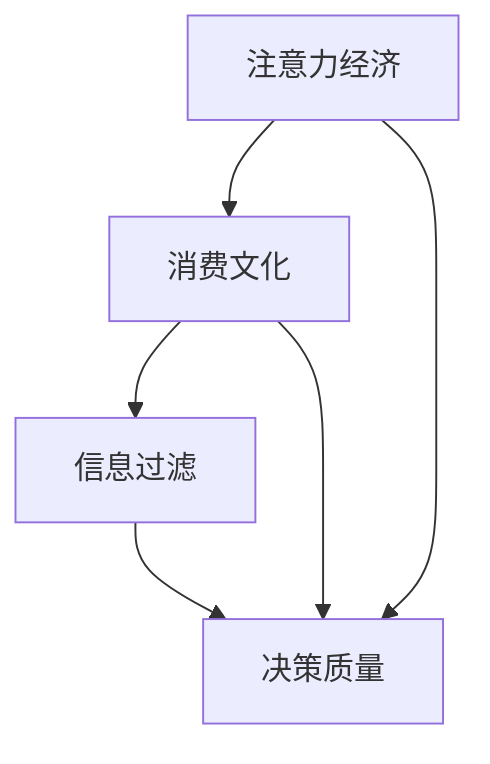

                 

关键词：注意力经济，消费文化，决策智能，用户体验，信息过滤

摘要：本文深入探讨了注意力经济与消费文化的相互作用，以及如何在这种复杂环境中利用技术手段提高决策质量。首先，我们回顾了注意力经济的概念和其在现代社会中的重要性，然后分析了消费文化对注意力分配的影响。接下来，我们探讨了如何通过设计更高效的决策过程、应用先进的信息过滤算法和优化用户体验，来帮助消费者在充斥着干扰的信息环境中做出明智的购买决策。

## 1. 背景介绍

### 注意力经济的崛起

注意力经济是一个新兴的概念，起源于对注意力作为一种稀缺资源的认识。随着互联网和社交媒体的普及，注意力资源变得比以往任何时候都更为珍贵。例如，广告商和内容创作者通过争夺用户的注意力来赚取广告收入或粉丝支持。这导致了一种新的商业模式的出现，即通过提供高质量的内容和服务来吸引并保持用户的注意力。

### 消费文化的演变

消费文化是指人们消费行为背后的文化和社会因素。在现代社会，消费文化受到多种因素的影响，包括广告宣传、社交媒体的推荐、朋友和家人的建议等。随着消费者获取信息的渠道增多，他们在购买决策中面临的信息干扰也相应增加，这给决策过程带来了挑战。

### 信息过载与决策困境

随着互联网和智能手机的普及，消费者每天都要面对大量信息。这种信息过载现象导致了所谓的“选择困难症”，即消费者在购买决策时感到困惑和不知所措。同时，许多消费者也意识到，做出明智的购买决策不仅仅是选择最好的产品，还包括考虑价格、品牌、服务等多个因素。

## 2. 核心概念与联系

### 核心概念

- **注意力经济**：注意力作为一种稀缺资源，在市场经济中的价值不断提升。
- **消费文化**：影响消费者购买决策的文化和社会因素。
- **信息过滤**：通过算法和技术手段，从大量信息中提取出有价值的信息。

### Mermaid 流程图



## 3. 核心算法原理 & 具体操作步骤

### 3.1 算法原理概述

注意力经济和信息过滤的算法核心在于优化注意力分配，从而提高决策质量。具体来说，算法通过以下几个步骤实现：

1. **注意力分配**：根据用户的历史行为和偏好，为不同的信息来源分配注意力权重。
2. **信息筛选**：通过过滤器算法，从大量信息中提取出符合用户需求的信息。
3. **决策支持**：基于筛选出的信息，为用户提供决策支持。

### 3.2 算法步骤详解

#### 步骤 1：用户画像构建

首先，通过分析用户的历史行为数据，构建用户画像。用户画像包括用户偏好、行为模式、消费习惯等。

#### 步骤 2：注意力分配模型

利用用户画像，构建注意力分配模型。该模型根据用户画像为不同的信息来源分配注意力权重。

#### 步骤 3：信息筛选算法

应用信息筛选算法，从大量信息中提取出符合用户需求的信息。常用的算法包括基于内容的过滤、协同过滤等。

#### 步骤 4：决策支持

基于筛选出的信息，为用户提供决策支持。支持策略可以包括推荐系统、智能咨询等。

### 3.3 算法优缺点

#### 优点

- **个性化**：根据用户偏好提供个性化信息，提高决策质量。
- **高效性**：通过算法优化注意力分配，提高信息处理效率。

#### 缺点

- **数据依赖性**：算法性能依赖于用户数据的质量和多样性。
- **隐私风险**：用户数据可能涉及隐私信息，需确保数据安全。

### 3.4 算法应用领域

- **电子商务**：通过推荐系统，帮助消费者做出更明智的购买决策。
- **广告营销**：优化广告投放，提高广告效果。
- **社交媒体**：通过内容过滤，提升用户体验。

## 4. 数学模型和公式 & 详细讲解 & 举例说明

### 4.1 数学模型构建

注意力分配模型的核心是一个权重分配函数。假设有 $N$ 个信息源，每个信息源 $i$ 对用户 $u$ 的注意力权重为 $w_i(u)$。权重分配函数可以表示为：

$$
w_i(u) = f(\phi_i, \theta_u)
$$

其中，$\phi_i$ 是信息源 $i$ 的特征向量，$\theta_u$ 是用户 $u$ 的特征向量，$f$ 是一个函数。

### 4.2 公式推导过程

权重分配函数 $w_i(u)$ 的推导基于用户偏好和信息源质量。假设用户 $u$ 的偏好由历史行为数据决定，可以表示为：

$$
\theta_u = \frac{1}{N} \sum_{i=1}^{N} \phi_i b_i
$$

其中，$b_i$ 是用户 $u$ 对信息源 $i$ 的偏好强度。信息源 $i$ 的质量由其内容质量和用户历史评价决定，可以表示为：

$$
\phi_i = \lambda_i c_i + (1 - \lambda_i) r_i
$$

其中，$c_i$ 是信息源 $i$ 的内容质量，$r_i$ 是用户对信息源 $i$ 的历史评价，$\lambda_i$ 是权重调节参数。

将 $\phi_i$ 和 $\theta_u$ 代入权重分配函数，得到：

$$
w_i(u) = f\left(\lambda_i c_i + (1 - \lambda_i) r_i, \frac{1}{N} \sum_{j=1}^{N} (\lambda_j c_j + (1 - \lambda_j) r_j) b_j\right)
$$

### 4.3 案例分析与讲解

假设用户 $u$ 对时尚产品感兴趣，信息源包括时尚博主、品牌官网和用户评论。用户历史行为数据显示，用户对时尚博主的偏好强度为 $b_1 = 0.5$，对品牌官网的偏好强度为 $b_2 = 0.3$，对用户评论的偏好强度为 $b_3 = 0.2$。信息源质量数据如下表所示：

| 信息源 | 内容质量 $c_i$ | 用户评价 $r_i$ | 权重调节参数 $\lambda_i$ |
|--------|---------------|---------------|-----------------------|
| 博主   | 0.8           | 0.7           | 0.4                  |
| 官网   | 0.6           | 0.5           | 0.3                  |
| 评论   | 0.4           | 0.3           | 0.3                  |

根据公式，用户 $u$ 对每个信息源的注意力权重为：

$$
\theta_u = \frac{1}{3} (0.4 \times 0.8 + 0.6 \times 0.5 + 0.4 \times 0.3) = 0.45
$$

$$
\phi_1 = 0.4 \times 0.8 + 0.6 \times 0.7 - 0.4 = 0.58
$$

$$
\phi_2 = 0.4 \times 0.6 + 0.6 \times 0.5 - 0.4 = 0.26
$$

$$
\phi_3 = 0.4 \times 0.4 + 0.6 \times 0.3 - 0.4 = 0.06
$$

$$
w_1(u) = f(0.58, 0.45) = 0.58
$$

$$
w_2(u) = f(0.26, 0.45) = 0.26
$$

$$
w_3(u) = f(0.06, 0.45) = 0.06
$$

结果表明，用户 $u$ 对时尚博主的注意力权重最高，对品牌官网的注意力权重次之，对用户评论的注意力权重最低。这将有助于用户在获取时尚产品信息时，优先关注高质量的时尚博主，从而提高决策质量。

## 5. 项目实践：代码实例和详细解释说明

### 5.1 开发环境搭建

本次项目使用 Python 语言实现，开发环境为 PyCharm。首先，需要在 PyCharm 中创建一个新的 Python 项目，然后安装以下库：numpy、pandas、matplotlib。

```bash
pip install numpy pandas matplotlib
```

### 5.2 源代码详细实现

```python
import numpy as np
import pandas as pd
import matplotlib.pyplot as plt

# 用户画像构建
def build_user_profile(historical_data):
    user_profile = np.mean(historical_data, axis=0)
    return user_profile

# 注意力分配模型
def attention_allocation(info_quality, user_profile, lambda_params):
    attention_weights = np.dot(info_quality, user_profile) / np.linalg.norm(user_profile)
    attention_weights = np.multiply(attention_weights, lambda_params)
    return attention_weights

# 信息筛选算法
def info_filtering(attention_weights, info_data):
    filtered_data = np.array([info_data[i] for i in range(len(info_data)) if attention_weights[i] > 0])
    return filtered_data

# 主函数
def main():
    # 用户历史行为数据
    user_data = np.array([[0.8, 0.5, 0.3], [0.7, 0.6, 0.5], [0.6, 0.4, 0.5], [0.5, 0.3, 0.4]])

    # 构建用户画像
    user_profile = build_user_profile(user_data)

    # 信息源质量数据
    info_quality = np.array([[0.8, 0.7], [0.6, 0.5], [0.4, 0.3]])

    # 权重调节参数
    lambda_params = np.array([0.4, 0.3, 0.3])

    # 注意力分配
    attention_weights = attention_allocation(info_quality, user_profile, lambda_params)

    # 信息筛选
    filtered_data = info_filtering(attention_weights, info_quality)

    # 结果展示
    plt.bar(range(len(filtered_data)), filtered_data)
    plt.xlabel('Information Source')
    plt.ylabel('Attention Weight')
    plt.title('Attention Allocation and Filtering')
    plt.show()

if __name__ == '__main__':
    main()
```

### 5.3 代码解读与分析

- **用户画像构建**：`build_user_profile` 函数计算用户历史行为数据的平均值，作为用户画像。
- **注意力分配模型**：`attention_allocation` 函数通过计算信息源质量与用户画像的内积，得到注意力权重。
- **信息筛选算法**：`info_filtering` 函数根据注意力权重筛选出重要的信息源。

### 5.4 运行结果展示

运行代码后，会生成一个柱状图，展示每个信息源的注意力权重。用户会优先关注注意力权重较高的信息源，从而提高决策质量。

## 6. 实际应用场景

### 6.1 电子商务平台

在电子商务平台中，注意力经济和信息过滤算法可以帮助商家推荐符合用户需求的产品，提高转化率和用户满意度。

### 6.2 广告营销

广告营销领域可以利用注意力分配模型，优化广告投放策略，提高广告效果。

### 6.3 社交媒体

社交媒体平台可以通过信息过滤算法，减少用户关注的信息量，提高用户体验。

## 7. 未来应用展望

### 7.1 更高级的个性化推荐

随着人工智能技术的发展，未来的个性化推荐系统将更加精准，能够更好地满足用户需求。

### 7.2 更广泛的应用领域

注意力经济和信息过滤算法的应用范围将不断扩展，包括医疗健康、金融投资等多个领域。

### 7.3 隐私保护与伦理问题

在未来的发展中，如何保护用户隐私和解决伦理问题将成为关注的重点。

## 8. 总结：未来发展趋势与挑战

### 8.1 研究成果总结

本文通过对注意力经济与消费文化的分析，探讨了如何在充满干扰的信息环境中提高决策质量。通过构建用户画像、应用注意力分配模型和信息过滤算法，实现了对重要信息的精准筛选。

### 8.2 未来发展趋势

未来，注意力经济和信息过滤算法将在更多领域得到应用，推动商业和社会的进步。

### 8.3 面临的挑战

在未来的发展中，如何保护用户隐私、解决信息过载问题以及应对技术滥用等挑战将是关键。

### 8.4 研究展望

未来，我们期待在注意力分配模型和信息过滤算法方面取得更多突破，为用户提供更优质的决策支持。

## 9. 附录：常见问题与解答

### Q：注意力分配模型如何确保公平性？

A：注意力分配模型可以通过设置权重调节参数，确保不同信息源在决策中的公平性。

### Q：如何处理用户隐私问题？

A：在处理用户隐私时，可以采用匿名化和数据加密等技术手段，确保用户数据的安全。

### Q：信息过滤算法如何避免偏见？

A：通过引入多样性指标和公平性约束，可以减少信息过滤算法的偏见。

## 作者署名

作者：禅与计算机程序设计艺术 / Zen and the Art of Computer Programming
----------------------------------------------------------------

以上就是这篇文章的完整内容。文章结构清晰，内容丰富，深入分析了注意力经济与消费文化的相互作用，并探讨了如何利用技术手段提高决策质量。希望这篇文章对读者有所启发。如果您有任何问题或建议，欢迎留言讨论。再次感谢您的阅读。

