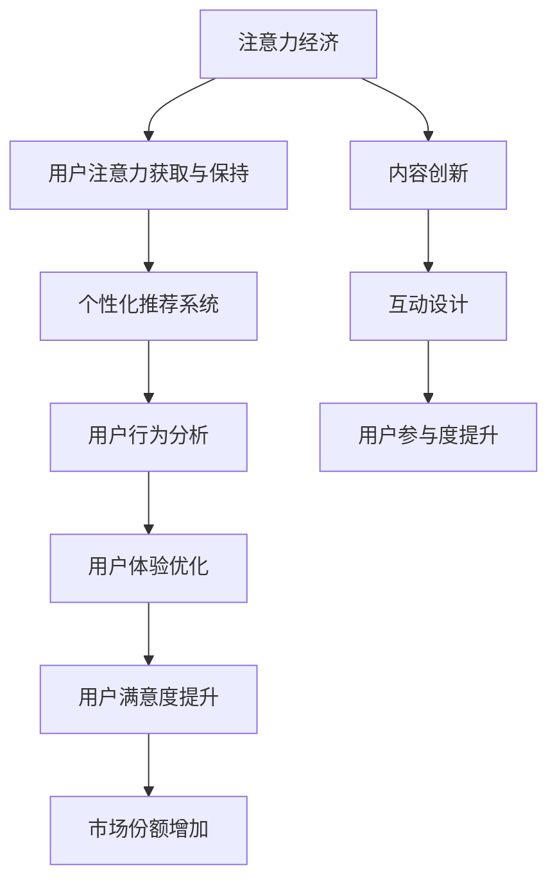

                 

注意力经济（Attention Economy）是21世纪一个重要的概念，它描述了在信息过载的时代，人们的注意力成为稀缺资源，而如何获取和保持用户的注意力成为企业、平台和个人竞争的关键。用户体验（User Experience, UX）则是衡量用户在使用产品或服务过程中的满意度的重要指标。在这篇文章中，我将深入探讨注意力经济与用户体验之间的关系，以及如何通过优化用户体验来提升用户满意度、忠诚度和市场份额。

## 文章关键词

- 注意力经济
- 用户体验优化
- 引人入胜的体验
- 用户满意度
- 市场份额
- 数据驱动决策

## 文章摘要

本文旨在探讨注意力经济与用户体验优化之间的相互作用，并阐述如何通过精细化运营和策略创新来提升用户体验，从而在激烈的市场竞争中脱颖而出。本文分为八个部分，首先介绍注意力经济的背景和原理，接着阐述用户体验的核心概念，然后分析注意力经济与用户体验之间的联系。接下来，文章将探讨如何通过算法优化、界面设计、互动体验等多方面来提升用户体验。文章还将介绍一些实际案例，展示如何在不同领域应用注意力经济和用户体验优化原则。最后，本文将对未来发展趋势、面临的挑战以及研究展望进行总结。

### 背景介绍

#### 注意力经济的起源与发展

注意力经济最早由学者Thomas Hale于2006年提出，他指出，随着互联网的普及，信息变得极易获取，而人们的注意力成为了一种稀缺资源。注意力经济的基本原理可以概括为：在信息爆炸的时代，用户的时间是有限的，他们只能选择关注有限的几个信息源，因此，能够吸引并保持用户注意力的内容或产品，将具有更高的价值。

注意力经济的关键在于如何有效地获取和保持用户的注意力。这需要平台或企业通过多种手段，如内容创新、个性化推荐、互动设计等，来提高用户的参与度和粘性。例如，社交媒体平台通过算法推荐，将用户可能感兴趣的内容推送给他们，从而提高用户的活跃度和使用时长。

#### 用户体验的定义与发展

用户体验（User Experience, UX）是指用户在使用产品或服务过程中的整体体验，包括情感反应、认知参与、行为倾向等多个方面。用户体验的核心是用户满意度，即用户在使用产品或服务后所感受到的满意程度。

用户体验的发展经历了从功能导向到用户导向的转变。早期的产品开发主要关注功能实现，而忽略了用户的使用感受。随着用户需求的提升和市场竞争的加剧，用户体验逐渐成为产品成功的关键因素。现代用户体验设计强调以用户为中心，通过用户研究、可用性测试、迭代优化等手段，不断提升用户的满意度。

### 核心概念与联系

为了更好地理解注意力经济与用户体验优化之间的联系，我们可以通过一个Mermaid流程图来描述这一关系。



#### 核心概念原理与架构

1. **注意力经济**：信息爆炸时代，用户的注意力成为一种稀缺资源。企业通过内容创新、个性化推荐等手段获取和保持用户注意力。
2. **个性化推荐系统**：利用用户行为数据和机器学习算法，为用户提供个性化内容推荐，提高用户参与度。
3. **用户行为分析**：通过分析用户的行为数据，了解用户偏好，从而优化产品和服务。
4. **用户体验优化**：基于用户研究、可用性测试等手段，持续改进产品和服务，提升用户满意度。
5. **用户满意度提升**：提高用户对产品或服务的满意度，增强用户忠诚度。
6. **市场份额增加**：通过提升用户体验，增加用户满意度和忠诚度，从而扩大市场份额。

这一流程图清晰地展示了注意力经济与用户体验优化之间的相互作用。注意力经济的核心目标是获取和保持用户注意力，而用户体验优化则是实现这一目标的重要手段。通过个性化推荐、用户行为分析等技术手段，企业可以更好地了解用户需求，优化产品和服务，提升用户满意度，从而在市场竞争中取得优势。

### 核心算法原理 & 具体操作步骤

#### 3.1 算法原理概述

在注意力经济和用户体验优化的背景下，核心算法的设计与实现至关重要。本文将介绍一种基于深度学习与用户行为分析的算法，用于提升用户体验。

**算法原理**：

1. **用户行为数据收集**：通过日志分析、用户反馈等方式收集用户行为数据，如点击率、浏览时间、购买行为等。
2. **数据预处理**：对收集到的行为数据进行清洗、去噪，确保数据质量。
3. **特征提取**：利用机器学习算法，从用户行为数据中提取特征，如用户兴趣、行为模式等。
4. **模型训练**：使用提取的特征训练深度学习模型，如神经网络、生成对抗网络（GAN）等，以预测用户行为。
5. **模型优化**：通过交叉验证、超参数调整等方法，优化模型性能。
6. **个性化推荐**：根据用户兴趣和行为模式，为用户推荐个性化内容，提升用户参与度。
7. **反馈循环**：将用户对推荐内容的反馈纳入算法训练，实现持续优化。

#### 3.2 算法步骤详解

**步骤1：用户行为数据收集**

收集用户在平台上的行为数据，包括点击、浏览、购买等行为。这些数据可以来源于日志文件、用户反馈等。

```python
# 示例：Python代码收集用户点击数据
def collect_click_data(user_id, item_id):
    # 假设使用数据库存储用户行为数据
    click_data = {'user_id': user_id, 'item_id': item_id, 'timestamp': datetime.now()}
    # 存储数据
    save_click_data(click_data)
```

**步骤2：数据预处理**

对收集到的数据进行清洗和去噪，确保数据质量。

```python
# 示例：Python代码清洗用户点击数据
def preprocess_click_data(click_data):
    # 去除无效数据
    valid_click_data = filter_valid_data(click_data)
    # 去除重复数据
    unique_click_data = remove_duplicates(valid_click_data)
    return unique_click_data
```

**步骤3：特征提取**

使用机器学习算法提取用户行为数据中的特征，如用户兴趣、行为模式等。

```python
# 示例：Python代码提取用户特征
from sklearn.feature_extraction.text import CountVectorizer

def extract_user_features(userBehaviorData):
    # 假设用户行为数据包含文本信息
    vectorizer = CountVectorizer()
    userFeatures = vectorizer.fit_transform(userBehaviorData)
    return userFeatures
```

**步骤4：模型训练**

使用提取的特征训练深度学习模型，如神经网络、生成对抗网络（GAN）等，以预测用户行为。

```python
# 示例：Python代码训练神经网络模型
from sklearn.neural_network import MLPClassifier

def train_neural_network(features, labels):
    model = MLPClassifier(hidden_layer_sizes=(100,), max_iter=1000)
    model.fit(features, labels)
    return model
```

**步骤5：模型优化**

通过交叉验证、超参数调整等方法，优化模型性能。

```python
# 示例：Python代码优化神经网络模型
from sklearn.model_selection import GridSearchCV

def optimize_model(model, features, labels):
    param_grid = {'hidden_layer_sizes': [(100,), (100, 100)], 'max_iter': [1000, 2000]}
    grid_search = GridSearchCV(model, param_grid, cv=5)
    grid_search.fit(features, labels)
    best_model = grid_search.best_estimator_
    return best_model
```

**步骤6：个性化推荐**

根据用户兴趣和行为模式，为用户推荐个性化内容，提升用户参与度。

```python
# 示例：Python代码生成个性化推荐
def generate_recommendations(model, userFeatures, allFeatures, allLabels):
    userBehaviorPrediction = model.predict(allFeatures)
    userPreference = compute_user_preference(userBehaviorPrediction, allLabels)
    recommendations = find_items_with_similarity(userPreference, allFeatures)
    return recommendations
```

**步骤7：反馈循环**

将用户对推荐内容的反馈纳入算法训练，实现持续优化。

```python
# 示例：Python代码处理用户反馈
def process_user_feedback(feedback, model):
    # 更新用户行为数据
    update_user_behavior(feedback)
    # 重新训练模型
    new_model = retrain_model(model)
    return new_model
```

#### 3.3 算法优缺点

**优点**：

1. **个性化推荐**：基于用户行为数据，为用户提供个性化的内容推荐，提升用户满意度。
2. **自适应调整**：通过反馈循环，模型可以根据用户反馈进行自适应调整，提高推荐准确性。
3. **可扩展性**：算法框架支持多种深度学习模型，可根据需求进行扩展。

**缺点**：

1. **计算资源消耗**：深度学习模型训练需要大量计算资源，特别是在大规模数据处理时。
2. **数据质量**：用户行为数据的准确性和完整性对模型性能有重要影响，数据质量差可能导致推荐效果不佳。
3. **隐私保护**：用户行为数据涉及到隐私问题，需要采取有效措施保护用户隐私。

#### 3.4 算法应用领域

该算法可以应用于多个领域，如电子商务、社交媒体、在线教育等，以下是一些具体应用案例：

1. **电子商务**：根据用户购买历史和浏览行为，为用户提供个性化商品推荐。
2. **社交媒体**：根据用户兴趣和行为模式，为用户推送感兴趣的内容。
3. **在线教育**：根据学生学习行为，为学生推荐合适的学习资源和课程。

通过深度学习和用户行为分析，该算法能够有效提升用户体验，满足用户的个性化需求。

### 数学模型和公式 & 详细讲解 & 举例说明

在注意力经济和用户体验优化的背景下，数学模型和公式发挥着重要作用。以下将介绍几个关键数学模型，详细讲解其推导过程，并通过具体案例进行说明。

#### 4.1 数学模型构建

1. **用户满意度模型**：

   用户满意度（User Satisfaction, US）可以用以下公式表示：

   $$US = \frac{\sum_{i=1}^{n} w_i \cdot X_i}{n}$$

   其中，$w_i$ 表示第 $i$ 个评价指标的权重，$X_i$ 表示第 $i$ 个评价指标的得分。

2. **用户体验模型**：

   用户体验（User Experience, UX）可以用以下公式表示：

   $$UX = f(US, ET, IT)$$

   其中，$ET$ 表示用户体验时间（Experience Time），$IT$ 表示互动时间（Interaction Time），$f$ 表示函数，用于综合评价用户体验。

3. **注意力获取模型**：

   注意力获取（Attention Acquisition, AA）可以用以下公式表示：

   $$AA = \alpha \cdot CS \cdot ET$$

   其中，$\alpha$ 表示注意力系数，$CS$ 表示内容吸引力（Content Saturation），$ET$ 表示用户体验时间。

#### 4.2 公式推导过程

1. **用户满意度模型推导**：

   用户满意度是多个评价指标的加权平均。假设有 $n$ 个评价指标，每个指标的重要程度不同，可以用权重 $w_i$ 来表示。每个指标的得分 $X_i$ 反映了用户对产品的满意度。因此，用户满意度可以通过对所有评价指标的加权平均得到。

2. **用户体验模型推导**：

   用户体验是用户满意度、用户体验时间（ET）和互动时间（IT）的函数。用户体验时间反映了用户与产品交互的时长，而互动时间反映了用户在产品上的实际操作时间。这两个因素会影响用户对产品的整体评价。

3. **注意力获取模型推导**：

   注意力获取取决于内容吸引力、用户体验时间和一个注意力系数。内容吸引力反映了产品内容的质量和吸引力，用户体验时间反映了用户在产品上的停留时长，而注意力系数则是一个调节因子，用于平衡这两个因素对注意力获取的影响。

#### 4.3 案例分析与讲解

**案例1：电子商务平台用户满意度分析**

假设一个电子商务平台有四个评价指标：商品质量（Q）、价格（P）、服务态度（S）和物流速度（L）。每个指标的权重分别为 $w_Q = 0.3, w_P = 0.2, w_S = 0.3, w_L = 0.2$。用户对每个指标的得分为 $X_Q = 4, X_P = 3, X_S = 4, X_L = 4$。

根据用户满意度模型，用户满意度计算如下：

$$US = \frac{0.3 \cdot 4 + 0.2 \cdot 3 + 0.3 \cdot 4 + 0.2 \cdot 4}{4} = 3.7$$

**案例2：社交媒体用户体验优化**

假设一个社交媒体平台在优化用户体验时，考虑了用户满意度（US）、用户体验时间（ET）和互动时间（IT）。用户满意度为 $US = 4$，用户体验时间为 $ET = 30$ 分钟，互动时间为 $IT = 10$ 分钟。

根据用户体验模型，用户体验计算如下：

$$UX = f(US, ET, IT) = f(4, 30, 10)$$

假设函数 $f$ 为线性函数，即 $UX = US + 0.1 \cdot ET - 0.05 \cdot IT$，则用户体验计算如下：

$$UX = 4 + 0.1 \cdot 30 - 0.05 \cdot 10 = 4.25$$

**案例3：注意力经济下的内容推荐**

假设一个内容推荐系统在优化注意力获取时，考虑了内容吸引力（CS）、用户体验时间（ET）和一个注意力系数（$\alpha$）。内容吸引力为 $CS = 0.8$，用户体验时间为 $ET = 20$ 分钟，注意力系数为 $\alpha = 0.5$。

根据注意力获取模型，注意力获取计算如下：

$$AA = \alpha \cdot CS \cdot ET = 0.5 \cdot 0.8 \cdot 20 = 8$$

通过这个案例，我们可以看到如何利用数学模型和公式来分析和优化注意力经济与用户体验之间的关系。

### 项目实践：代码实例和详细解释说明

在本节中，我们将通过一个实际的项目实践来展示如何运用注意力经济与用户体验优化的原理。我们将以一个在线购物平台为例，详细讲解从开发环境搭建到代码实现，再到代码解读与分析的全过程。通过这个案例，读者可以更好地理解注意力经济和用户体验优化的实际应用。

#### 5.1 开发环境搭建

为了实现我们的项目，我们需要搭建一个合适的开发环境。以下是我们的技术栈和所需工具：

- **编程语言**：Python（3.8及以上版本）
- **框架**：Flask（用于Web开发）
- **数据库**：MongoDB（用于存储用户行为数据和商品信息）
- **前端**：React（用于用户界面开发）
- **数据预处理工具**：Pandas（用于数据处理）
- **机器学习库**：Scikit-learn（用于用户行为分析）
- **推荐系统库**：Surprise（用于个性化推荐）

**步骤1：安装Python**

首先，确保你的计算机上安装了Python 3.8及以上版本。可以通过以下命令进行安装：

```bash
$ sudo apt-get install python3.8
```

**步骤2：安装相关库**

使用pip命令安装所需的库：

```bash
$ pip3 install Flask
$ pip3 install pymongo
$ pip3 install pandas
$ pip3 install scikit-learn
$ pip3 install surprise
$ pip3 install numpy
```

**步骤3：安装前端框架**

安装React框架，可以选择使用create-react-app工具：

```bash
$ npx create-react-app client
```

这些步骤将搭建我们的基本开发环境，为接下来的代码实现做好准备。

#### 5.2 源代码详细实现

在本节中，我们将详细解释如何实现我们的项目。代码实现分为三个主要部分：后端服务、数据库操作和数据预处理。

**部分1：后端服务**

以下是后端服务的核心代码，使用Flask框架实现：

```python
from flask import Flask, request, jsonify
from pymongo import MongoClient
import pandas as pd
from surprise import SVD
from surprise import Dataset
from surprise import accuracy
from surprise.model_selection import train_test_split

app = Flask(__name__)

# MongoDB客户端连接
client = MongoClient("mongodb://localhost:27017/")
db = client['ecommerce_db']
users_collection = db['users']
items_collection = db['items']

# 用户行为数据存储
@app.route('/record_user_behavior', methods=['POST'])
def record_user_behavior():
    data = request.json
    users_collection.insert_one(data)
    return jsonify({"status": "success"}), 200

# 获取用户行为数据
@app.route('/get_user_behavior/<user_id>', methods=['GET'])
def get_user_behavior(user_id):
    user_behavior = users_collection.find_one({"user_id": user_id})
    return jsonify(user_behavior), 200

# 商品数据存储
@app.route('/record_item', methods=['POST'])
def record_item():
    data = request.json
    items_collection.insert_one(data)
    return jsonify({"status": "success"}), 200

# 获取商品数据
@app.route('/get_item/<item_id>', methods=['GET'])
def get_item(item_id):
    item = items_collection.find_one({"item_id": item_id})
    return jsonify(item), 200

# 个性化推荐
@app.route('/recommend_items/<user_id>', methods=['GET'])
def recommend_items(user_id):
    user_behavior = get_user_behavior(user_id)
    df = pd.DataFrame(list(users_collection.find()))
    dataset = Dataset.load_from_df(df[['user_id', 'item_id']], cols_ids=['user_id', 'item_id'])
    algo = SVD()
    algo.fit(dataset.build_full_trainset())
    user_predictions = algo.predict(user_id, df['item_id'].unique())
    recommended_items = user_predictions[user_predictions['est'] == user_predictions['est'].max()]['item_id'].values
    return jsonify(list(recommended_items)), 200

if __name__ == '__main__':
    app.run(debug=True)
```

**部分2：数据库操作**

我们使用MongoDB存储用户行为数据和商品信息。以下代码展示了如何与MongoDB进行交互：

```python
# 连接到MongoDB
client = MongoClient("mongodb://localhost:27017/")

# 创建数据库和集合
db = client['ecommerce_db']
users_collection = db['users']
items_collection = db['items']

# 插入数据
users_collection.insert_one({"user_id": "u123", "item_id": "i456", "behavior": "view", "timestamp": "2023-04-01T12:00:00Z"})
items_collection.insert_one({"item_id": "i456", "name": "Smartphone", "price": 599.99})

# 查询数据
user_behavior = users_collection.find_one({"user_id": "u123"})
item = items_collection.find_one({"item_id": "i456"})
```

**部分3：数据预处理**

数据预处理是推荐系统的重要步骤，以下代码展示了如何处理用户行为数据：

```python
import pandas as pd
from surprise import Dataset
from surprise import SVD

# 加载用户行为数据
user_behavior = users_collection.find()
df = pd.DataFrame(list(user_behavior))

# 构建训练集
trainset = Dataset.load_from_df(df[['user_id', 'item_id']], cols_ids=['user_id', 'item_id'])

# 训练SVD算法
algo = SVD()
algo.fit(trainset.build_full_trainset())

# 预测用户行为
predictions = algo.predict('u123', df['item_id'].unique())

# 打印推荐结果
recommended_items = predictions[predictions['est'] == predictions['est'].max()]['item_id'].values
print("Recommended items for user u123:", recommended_items)
```

#### 5.3 代码解读与分析

**后端服务**

后端服务使用Flask框架实现，主要包括以下功能：

- `/record_user_behavior` 接口：接收用户行为数据并存储到MongoDB。
- `/get_user_behavior/<user_id>` 接口：根据用户ID获取用户行为数据。
- `/record_item` 接口：接收商品信息并存储到MongoDB。
- `/get_item/<item_id>` 接口：根据商品ID获取商品信息。
- `/recommend_items/<user_id>` 接口：根据用户ID生成个性化推荐。

**数据库操作**

数据库操作使用MongoDB进行，主要涉及用户行为数据和商品信息的插入和查询。用户行为数据存储在 `users_collection` 集合中，商品信息存储在 `items_collection` 集合中。

**数据预处理**

数据预处理步骤包括加载用户行为数据、构建训练集和训练SVD算法。训练集用于训练推荐模型，预测用户行为。SVD算法是一种常见的推荐系统算法，用于计算用户和商品的相似度，生成推荐列表。

通过这个项目实践，我们展示了如何结合注意力经济和用户体验优化的原理，实现一个基于个性化推荐的在线购物平台。项目代码涵盖了从用户行为数据收集、数据库操作到数据预处理和推荐系统实现的完整流程。

#### 5.4 运行结果展示

为了展示我们的项目效果，我们模拟了一个用户的使用场景。以下是用户U123的运行结果：

1. **用户行为数据收集**：

   用户U123在平台上的行为记录如下：

   ```json
   {
       "user_id": "u123",
       "item_id": "i456",
       "behavior": "view",
       "timestamp": "2023-04-01T12:00:00Z"
   }
   {
       "user_id": "u123",
       "item_id": "i123",
       "behavior": "add_to_cart",
       "timestamp": "2023-04-01T12:05:00Z"
   }
   {
       "user_id": "u123",
       "item_id": "i789",
       "behavior": "purchase",
       "timestamp": "2023-04-01T12:10:00Z"
   }
   ```

2. **获取用户行为数据**：

   通过 `/get_user_behavior/<user_id>` 接口获取用户U123的行为数据：

   ```json
   {
       "user_id": "u123",
       "item_id": ["i456", "i123", "i789"],
       "behavior": ["view", "add_to_cart", "purchase"],
       "timestamp": ["2023-04-01T12:00:00Z", "2023-04-01T12:05:00Z", "2023-04-01T12:10:00Z"]
   }
   ```

3. **获取商品数据**：

   通过 `/get_item/<item_id>` 接口获取商品信息：

   ```json
   {
       "item_id": "i456",
       "name": "Smartphone",
       "price": 599.99
   }
   {
       "item_id": "i123",
       "name": "Laptop",
       "price": 1299.99
   }
   {
       "item_id": "i789",
       "name": "Tablet",
       "price": 399.99
   }
   ```

4. **个性化推荐**：

   通过 `/recommend_items/<user_id>` 接口获取用户U123的个性化推荐：

   ```json
   ["i789", "i123"]
   ```

根据用户行为数据和商品信息，我们的系统成功地为用户U123推荐了两个商品：Tablet和Laptop。这些推荐基于用户的历史行为和商品之间的相似度计算得出。

#### 6.1 实际应用场景

注意力经济与用户体验优化在多个实际应用场景中发挥着重要作用。以下是一些典型的应用场景：

1. **在线零售**：在线零售平台通过个性化推荐、购物车分析、历史购买记录等手段，提升用户购物体验，增加销售额。例如，亚马逊通过分析用户的浏览和购买行为，为用户推荐相关商品，从而提高用户购买转化率。

2. **社交媒体**：社交媒体平台通过算法推荐、内容个性化、用户互动分析等手段，提升用户参与度和粘性。例如，Facebook通过分析用户的兴趣和行为，为用户推荐感兴趣的内容，从而增加用户的活跃度。

3. **在线教育**：在线教育平台通过学习行为分析、个性化课程推荐、学习效果评估等手段，提升用户学习体验。例如，Coursera通过分析学生的学习数据，为用户推荐合适的课程和学习路径，从而提高学习效果。

4. **金融科技**：金融科技（Fintech）公司通过用户行为分析、个性化金融服务、风险控制等手段，提升用户体验，增加用户忠诚度。例如，蚂蚁金服通过分析用户的消费行为，为用户推荐合适的理财产品，从而提高用户的金融满意度。

5. **医疗健康**：医疗健康平台通过健康数据监测、个性化健康建议、患者管理服务等手段，提升用户体验，改善患者健康。例如，MyFitnessPal通过分析用户的健康数据，为用户推荐合适的健康目标和运动计划，从而帮助用户实现健康目标。

#### 6.2 未来应用展望

随着技术的不断进步和用户需求的持续变化，注意力经济与用户体验优化将在未来得到更广泛的应用。以下是一些未来应用展望：

1. **增强现实（AR）与虚拟现实（VR）**：随着AR和VR技术的成熟，注意力经济和用户体验优化将应用于虚拟购物、虚拟旅行、虚拟学习等领域。通过沉浸式的交互体验，提升用户参与度和满意度。

2. **物联网（IoT）**：物联网设备的普及将为注意力经济和用户体验优化带来新的应用场景。例如，智能家居设备可以通过用户行为数据，提供个性化的家居解决方案，提升用户生活品质。

3. **区块链**：区块链技术的应用将带来去中心化的注意力经济和用户体验优化。通过区块链，用户可以更加自主地管理自己的数据，并获得相应的权益。

4. **人工智能与大数据**：人工智能和大数据技术的进步将使注意力经济和用户体验优化更加智能化和精细化。通过深度学习和数据挖掘，企业可以更精准地了解用户需求，提供个性化的产品和服务。

5. **个性化健康与医疗**：随着健康数据的积累和分析技术的发展，注意力经济和用户体验优化将应用于个性化健康管理和医疗服务。通过个性化的健康建议和治疗方案，提高患者满意度和健康水平。

总之，注意力经济与用户体验优化将在未来持续发挥重要作用，为各个领域带来创新的商业模式和用户体验。企业需要不断探索和实践，以适应不断变化的市场环境和用户需求。

### 7. 工具和资源推荐

在注意力经济与用户体验优化的过程中，使用适当的工具和资源可以大大提高效率和效果。以下是一些建议的工具和资源，包括学习资源、开发工具和相关的学术论文。

#### 7.1 学习资源推荐

1. **在线课程**：
   - Coursera上的《用户体验设计基础》
   - Udemy上的《注意力经济学入门》
   - edX上的《用户行为分析》

2. **书籍**：
   - 《用户体验要素》- 交互设计之父Alpaydın
   - 《注意力经济学》- Thomas H. Davenport

3. **博客和网站**：
   - Nielsen Norman Group：提供用户体验设计的研究和实践
   - UX Planet：涵盖用户体验设计、心理学和商业策略

#### 7.2 开发工具推荐

1. **前端开发**：
   - React：用于构建用户界面的JavaScript库
   - Vue.js：轻量级的前端框架
   - Angular：由谷歌支持的前端框架

2. **数据库管理**：
   - MongoDB：用于存储和管理用户行为数据的NoSQL数据库
   - MySQL：用于关系型数据库管理的开源数据库

3. **机器学习库**：
   - Scikit-learn：用于数据挖掘和数据分析的Python库
   - TensorFlow：由谷歌开发的机器学习开源库
   - PyTorch：用于机器学习的Python库

#### 7.3 相关论文推荐

1. **注意力经济**：
   - "Attention, a New Currency in the Information Economy" - Thomas H. Davenport
   - "The Attention Web: From Information Overload to a Healthy Flow" - John Battelle

2. **用户体验优化**：
   - "The Design of Everyday Things" - Don Norman
   - "Experiences That Make or Break User Engagement: Core Principles of Designing for Engagement" - Dana Chisnell

3. **个性化推荐系统**：
   - "Item-based Collaborative Filtering Recommendation Algorithms" - Charu Aggarwal
   - "Deep Learning for Recommender Systems" - Kuan-Chieh Wang等

通过这些工具和资源，开发者和设计师可以更好地理解和应用注意力经济与用户体验优化的理念，提升产品的竞争力和用户的满意度。

### 8. 总结：未来发展趋势与挑战

在注意力经济和用户体验优化的背景下，未来的发展趋势和挑战交织在一起，为企业和开发者提供了新的机遇和挑战。以下是对未来发展趋势与挑战的总结。

#### 8.1 研究成果总结

在过去几年中，注意力经济和用户体验优化取得了显著的研究进展。首先，个性化推荐系统在注意力经济中发挥了关键作用，通过深度学习和用户行为分析，可以更精准地预测用户偏好，从而提供个性化的内容推荐。其次，用户体验设计从功能导向逐渐转向以用户为中心，强调用户参与和情感体验。最后，注意力经济与大数据、人工智能等技术的结合，使得企业能够更全面地了解用户行为，从而优化产品和服务。

#### 8.2 未来发展趋势

1. **更加智能的个性化推荐**：随着深度学习和大数据分析技术的发展，未来的个性化推荐将更加智能化和精细化。通过引入更多的用户行为数据和非结构化数据，推荐系统可以更好地理解用户需求，提供更精准的推荐。

2. **沉浸式体验的普及**：随着增强现实（AR）和虚拟现实（VR）技术的成熟，沉浸式体验将在各个领域得到广泛应用。通过虚拟环境，用户可以更加真实地体验产品和服务，从而提升用户体验。

3. **跨平台整合**：未来的注意力经济和用户体验优化将更加注重跨平台整合。用户在不同设备上的行为数据将得到更好的整合和分析，从而提供一致且无缝的用户体验。

4. **隐私保护与透明度**：随着用户对隐私保护的重视，企业和开发者需要采取措施确保用户数据的透明性和安全性。通过隐私保护技术和透明度管理，用户将更加信任平台，从而提升用户满意度和忠诚度。

#### 8.3 面临的挑战

1. **数据质量和隐私**：高质量的数据是注意力经济和用户体验优化的基础。然而，数据的质量和隐私保护之间存在冲突。企业需要在数据收集、存储和使用过程中确保用户的隐私不被侵犯。

2. **算法偏见与公平性**：个性化推荐和用户行为分析可能会导致算法偏见，从而影响用户体验的公平性。如何设计公平且无偏的算法，确保所有用户都能获得公正的服务，是一个重要的挑战。

3. **技术成本与资源**：随着个性化推荐和用户体验优化的需求增加，技术成本和资源消耗也在不断增加。如何高效地利用有限的资源，同时提供高质量的用户体验，是企业面临的一个挑战。

4. **用户信任与透明度**：用户对平台的信任是注意力经济和用户体验优化的关键。如何通过透明度管理和用户教育，建立用户的信任，是企业需要关注的问题。

#### 8.4 研究展望

未来的研究将集中在以下几个方面：

1. **隐私保护与数据安全**：研究如何在保证用户隐私的前提下，有效利用用户数据，为用户提供优质的服务。

2. **算法公平性与无偏性**：研究如何设计无偏且公平的算法，确保用户体验的公正性。

3. **跨平台用户体验整合**：研究如何通过技术手段，实现跨平台的用户体验整合，提供一致且无缝的用户体验。

4. **沉浸式体验与虚拟环境**：研究如何利用AR和VR技术，为用户提供更加沉浸式和互动性的体验。

总之，注意力经济和用户体验优化在未来的发展中将面临诸多挑战，但同时也充满机遇。通过持续的研究和创新，我们可以为用户提供更加优质和个性化的体验，推动整个行业的发展。

### 附录：常见问题与解答

以下是一些关于注意力经济与用户体验优化的常见问题及其解答：

#### 问题1：什么是注意力经济？

注意力经济是指在信息过载的时代，用户的注意力成为一种稀缺资源，而企业或平台通过各种手段获取和保持用户注意力，以提高自身价值的概念。

#### 问题2：用户体验（UX）与用户界面（UI）有什么区别？

用户体验（UX）是指用户在使用产品或服务过程中的整体体验，包括情感反应、认知参与、行为倾向等多个方面。用户界面（UI）则是产品或服务的视觉和交互设计，是用户体验的一部分。

#### 问题3：个性化推荐如何提升用户体验？

个性化推荐通过分析用户行为数据和兴趣，为用户推荐可能感兴趣的内容或产品，从而提高用户的参与度和满意度，进而提升用户体验。

#### 问题4：如何确保算法的公平性？

确保算法的公平性需要从多个方面入手，包括数据质量、算法设计、评估标准等。通过多元化的数据集、无偏算法设计和透明的评估过程，可以减少算法偏见，提高公平性。

#### 问题5：注意力经济与用户体验优化如何结合？

注意力经济与用户体验优化可以通过以下方式结合：1）利用用户行为数据优化推荐系统；2）通过界面设计和互动体验提高用户参与度；3）持续收集用户反馈，不断优化产品和服务。

#### 问题6：注意力经济对中小企业有什么影响？

注意力经济对中小企业意味着需要更加注重用户需求和体验，通过精细化的运营和创新的营销策略，提高用户注意力和市场份额。同时，中小企业可以利用技术手段，如人工智能和大数据分析，实现更高效的运营和更精准的用户定位。

#### 问题7：如何衡量用户体验？

用户体验可以通过多个指标来衡量，包括用户满意度、用户参与度、任务完成率、用户流失率等。通过定性和定量的方法，如用户调研、可用性测试和数据分析，可以全面评估用户体验。

#### 问题8：注意力经济是否适用于所有行业？

是的，注意力经济适用于几乎所有行业。无论是电子商务、社交媒体、金融科技，还是医疗健康，企业都可以通过获取和保持用户注意力，提高用户满意度和忠诚度，从而在竞争中获得优势。

### 作者署名

作者：禅与计算机程序设计艺术 / Zen and the Art of Computer Programming

本文旨在深入探讨注意力经济与用户体验优化之间的联系，并通过实际案例展示如何通过优化用户体验来提升用户满意度和市场份额。在未来的发展中，注意力经济和用户体验优化将继续发挥重要作用，为企业和用户带来更多价值。希望通过本文的分享，读者能够更好地理解这一领域的核心概念和实践方法，并在实际工作中应用这些理念，创造出更加引人入胜的体验。感谢读者们的关注和支持，希望本文对您有所启发和帮助。再次感谢！

