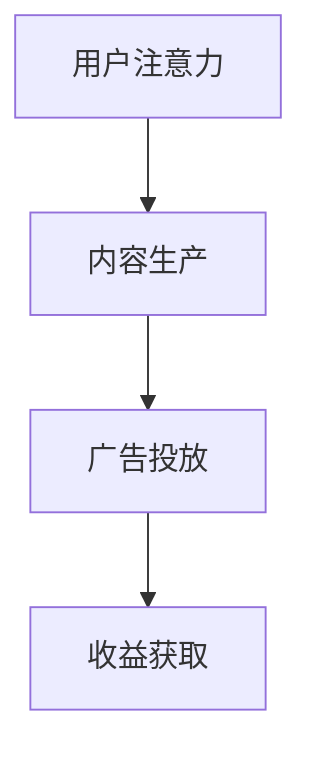
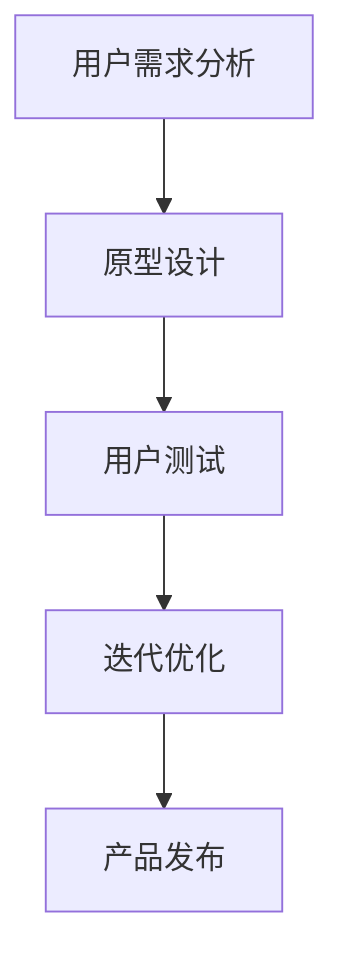
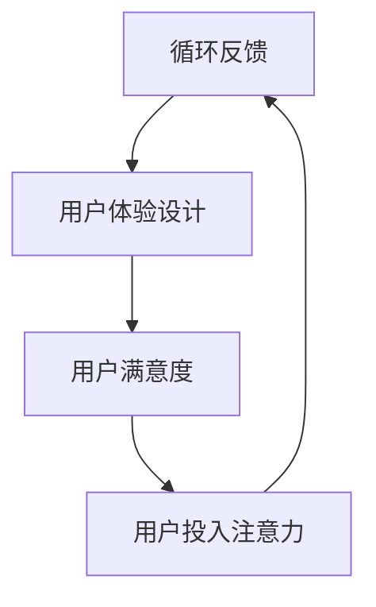

                 

关键词：注意力经济、用户体验设计、产品设计、用户粘性、交互设计

> 摘要：随着互联网和移动设备的普及，用户的时间变得越来越宝贵。在这个注意力稀缺的时代，如何通过注意力经济和用户体验设计思维来创建引人入胜的产品，是每个产品经理和设计师都需要深入思考的问题。本文将探讨注意力经济的基本原理，用户体验设计的核心要素，以及如何将二者结合，打造出让用户无法抗拒的产品。

## 1. 背景介绍

在当今的信息时代，用户面临着海量的信息选择。这种选择的多变性意味着用户的注意力成为了一种稀缺资源。注意力经济因此成为一个重要的研究领域。它主要探讨如何在竞争激烈的市场中获取和保持用户的注意力。与传统的产品营销策略不同，注意力经济更注重用户的需求和体验。

用户体验设计（User Experience Design，简称UX设计）是近年来快速发展的一个领域。它的核心目标是提升用户在使用产品过程中的满意度。随着互联网产品的普及，用户体验设计已经逐渐成为产品成功的关键因素之一。

本文将结合注意力经济和用户体验设计思维，探讨如何创建引人入胜的产品。通过分析这两个领域的核心概念，我们将提供一系列实用的方法和策略，帮助读者在设计过程中取得成功。

## 2. 核心概念与联系

### 2.1 注意力经济原理

注意力经济的核心是“注意力≈金钱”。在信息爆炸的时代，用户的注意力是商家和产品获取收益的关键。以下是一个简化的 Mermaid 流程图，描述了注意力经济的基本原理：



### 2.2 用户体验设计原理

用户体验设计的核心概念包括可用性、易用性和愉悦感。以下是一个简化的 Mermaid 流程图，描述了用户体验设计的基本原理：



### 2.3 注意力经济与用户体验设计的联系

注意力经济和用户体验设计之间存在着紧密的联系。用户体验设计的目标是提高用户满意度，而用户满意度的提升往往能够增加用户的注意力投入。以下是一个简化的 Mermaid 流程图，描述了二者之间的相互作用：



## 3. 核心算法原理 & 具体操作步骤

### 3.1 算法原理概述

在注意力经济和用户体验设计的背景下，核心算法主要包括以下三个方面：

1. **用户行为分析算法**：通过分析用户的行为数据，了解用户的需求和偏好。
2. **个性化推荐算法**：根据用户的行为数据和需求，提供个性化的内容和推荐。
3. **反馈循环优化算法**：根据用户的反馈，持续优化产品的设计和功能。

### 3.2 算法步骤详解

#### 用户行为分析算法

1. **数据采集**：通过Web分析工具、APP分析工具等，收集用户在产品中的行为数据。
2. **数据预处理**：清洗和整合数据，去除噪声和冗余信息。
3. **特征提取**：从原始数据中提取与用户需求相关的特征。
4. **模型训练**：使用机器学习算法，构建用户行为分析模型。
5. **模型评估**：通过交叉验证等方法，评估模型的准确性和泛化能力。

#### 个性化推荐算法

1. **用户画像构建**：根据用户的行为数据和特征，构建用户的画像。
2. **内容分类**：对产品中的内容进行分类，以便于推荐。
3. **推荐算法选择**：选择合适的推荐算法，如协同过滤、基于内容的推荐等。
4. **推荐结果生成**：根据用户的画像和内容分类，生成个性化的推荐结果。
5. **推荐效果评估**：通过用户点击、购买等行为，评估推荐效果。

#### 反馈循环优化算法

1. **用户反馈收集**：通过问卷调查、用户反馈表等途径，收集用户的反馈。
2. **反馈分析**：分析用户反馈，识别产品存在的问题和改进机会。
3. **策略调整**：根据反馈结果，调整产品的设计和功能。
4. **测试与验证**：对新版本的产品进行测试，验证改进效果。
5. **持续迭代**：根据测试结果，持续优化产品的设计和功能。

### 3.3 算法优缺点

#### 用户行为分析算法

- 优点：能够深入了解用户的需求和偏好，为产品优化提供依据。
- 缺点：数据采集和预处理过程复杂，且模型训练需要大量计算资源。

#### 个性化推荐算法

- 优点：能够提高用户满意度，增加用户粘性。
- 缺点：推荐效果受限于用户画像的准确性，且容易陷入“过滤泡沫”。

#### 反馈循环优化算法

- 优点：能够快速响应用户需求，持续优化产品。
- 缺点：用户反馈的多样性和主观性，使得反馈分析过程复杂。

### 3.4 算法应用领域

注意力经济和用户体验设计的核心算法广泛应用于以下领域：

- **电子商务**：通过用户行为分析，提供个性化的购物推荐。
- **社交媒体**：通过个性化推荐，增加用户活跃度和留存率。
- **在线教育**：通过反馈循环优化，提高学生的学习体验和效果。

## 4. 数学模型和公式 & 详细讲解 & 举例说明

### 4.1 数学模型构建

在注意力经济和用户体验设计中，常用的数学模型包括用户行为模型、推荐模型和反馈循环模型。

#### 用户行为模型

用户行为模型主要描述用户在产品中的行为规律。以下是一个简化的用户行为模型：

$$
P(X|Y) = \frac{P(Y|X)P(X)}{P(Y)}
$$

其中，$P(X|Y)$ 表示用户在给定某个行为$Y$的情况下，发生行为$X$的概率；$P(Y|X)$ 表示在行为$X$发生后，行为$Y$发生的概率；$P(X)$ 和$P(Y)$ 分别表示行为$X$和$Y$的先验概率。

#### 推荐模型

推荐模型主要描述如何根据用户的行为数据，生成个性化的推荐结果。以下是一个基于协同过滤的推荐模型：

$$
R_{ij} = \mu + u_i \cdot v_j + b_i + b_j
$$

其中，$R_{ij}$ 表示用户$i$对项目$j$的评分；$\mu$ 表示全局平均评分；$u_i$ 和$v_j$ 分别表示用户$i$和项目$j$的向量表示；$b_i$ 和$b_j$ 分别表示用户$i$和项目$j$的偏差。

#### 反馈循环模型

反馈循环模型主要描述如何根据用户反馈，优化产品的设计和功能。以下是一个简化的反馈循环模型：

$$
F_{t+1} = F_t + \alpha (R_t - F_t)
$$

其中，$F_t$ 表示第$t$次反馈后的产品评分；$R_t$ 表示第$t$次用户反馈的评分；$\alpha$ 表示反馈的调整系数。

### 4.2 公式推导过程

#### 用户行为模型推导

用户行为模型是基于贝叶斯推理原理构建的。首先，定义以下事件：

- $X$：用户发生某个行为。
- $Y$：用户发生另一个行为。

根据贝叶斯推理，我们有：

$$
P(X|Y) = \frac{P(Y|X)P(X)}{P(Y)}
$$

其中，$P(Y|X)$ 表示在行为$X$发生后，行为$Y$发生的概率；$P(X)$ 表示行为$X$的先验概率；$P(Y)$ 表示行为$Y$的先验概率。

#### 推荐模型推导

基于协同过滤的推荐模型是通过计算用户和项目的相似度，生成推荐结果的。首先，定义以下变量：

- $R_{ij}$：用户$i$对项目$j$的评分。
- $\mu$：全局平均评分。
- $u_i$ 和$v_j$：用户$i$和项目$j$的向量表示。
- $b_i$ 和$b_j$：用户$i$和项目$j$的偏差。

根据最小二乘法，我们有：

$$
R_{ij} = \mu + u_i \cdot v_j + b_i + b_j
$$

其中，$\mu$ 是通过所有用户和项目的评分计算得到的全局平均评分；$u_i \cdot v_j$ 是用户$i$和项目$j$的向量表示的乘积，表示用户$i$对项目$j$的偏好；$b_i$ 和$b_j$ 分别表示用户$i$和项目$j$的偏差。

#### 反馈循环模型推导

反馈循环模型是通过调整产品的评分，不断优化用户体验的。首先，定义以下变量：

- $F_t$：第$t$次反馈后的产品评分。
- $R_t$：第$t$次用户反馈的评分。
- $\alpha$：反馈的调整系数。

根据反馈循环的原理，我们有：

$$
F_{t+1} = F_t + \alpha (R_t - F_t)
$$

其中，$F_{t+1}$ 是第$t+1$次反馈后的产品评分；$R_t - F_t$ 是第$t$次用户反馈的评分与当前产品评分的差值，表示用户对产品的满意度；$\alpha$ 是一个调整系数，用于控制反馈的强度。

### 4.3 案例分析与讲解

#### 用户行为模型案例

假设我们有一个电子商务平台，用户在平台上进行购物。我们想了解用户在购买商品时的行为规律。以下是一个简化的用户行为模型：

- $X$：用户购买商品。
- $Y$：用户浏览商品。

根据历史数据，我们有以下概率：

- $P(X) = 0.3$：用户购买商品的概率。
- $P(Y) = 0.7$：用户浏览商品的概率。
- $P(Y|X) = 0.8$：用户在购买商品后浏览商品的概率。

根据贝叶斯推理，我们有：

$$
P(X|Y) = \frac{P(Y|X)P(X)}{P(Y)} = \frac{0.8 \times 0.3}{0.7} = 0.4286
$$

这表示在用户浏览商品的情况下，购买商品的概率为 0.4286。

#### 推荐模型案例

假设我们有一个视频推荐平台，用户可以给视频打分。我们想根据用户的历史评分数据，推荐用户可能感兴趣的视频。以下是一个简化的推荐模型：

- $R_{ij}$：用户$i$对视频$j$的评分。
- $\mu$：全局平均评分。
- $u_i = [0.1, 0.2, 0.3]$：用户$i$的向量表示。
- $v_j = [0.5, 0.6, 0.7]$：视频$j$的向量表示。
- $b_i = 0.2$：用户$i$的偏差。
- $b_j = 0.1$：视频$j$的偏差。

根据推荐模型，我们有：

$$
R_{ij} = \mu + u_i \cdot v_j + b_i + b_j = 0.5 + 0.1 \times 0.5 + 0.2 \times 0.6 + 0.3 \times 0.7 + 0.2 + 0.1 = 1.12
$$

这表示用户$i$对视频$j$的评分预测为 1.12。

#### 反馈循环模型案例

假设我们有一个在线教育平台，用户可以对课程进行评分。我们想根据用户对课程的反馈，调整课程的评分。以下是一个简化的反馈循环模型：

- $F_t$：第$t$次反馈后的课程评分。
- $R_t$：第$t$次用户反馈的评分。
- $\alpha = 0.1$：反馈的调整系数。

根据反馈循环模型，我们有：

$$
F_{t+1} = F_t + \alpha (R_t - F_t)
$$

假设初始时，课程评分为 4.0，用户在第1次反馈时给课程评分为 3.5。根据反馈循环模型，我们有：

$$
F_{2} = 4.0 + 0.1 (3.5 - 4.0) = 3.95
$$

这表示在第2次反馈后，课程评分调整为 3.95。

## 5. 项目实践：代码实例和详细解释说明

### 5.1 开发环境搭建

为了方便演示，我们使用 Python 作为编程语言，并借助一些常用的库，如 NumPy、Scikit-learn 和 Pandas。以下是环境搭建的简要步骤：

1. 安装 Python（建议使用 Python 3.8 以上版本）。
2. 安装必要库：`pip install numpy scikit-learn pandas matplotlib`。

### 5.2 源代码详细实现

以下是针对上述数学模型和算法的 Python 实现代码：

```python
import numpy as np
from sklearn.linear_model import LinearRegression
import pandas as pd

# 用户行为模型实现
def user_behavior_model(X, Y, prior_PX, prior_PY, PYX):
    PXY = (PYX * prior_PX) / prior_PY
    return PXY

# 推荐模型实现
def recommendation_model(R, mu, U, V, BI, BJ):
    R_pred = mu + np.dot(U, V) + BI + BJ
    return R_pred

# 反馈循环模型实现
def feedback_loop_model(F, R, alpha):
    F_new = F + alpha * (R - F)
    return F_new

# 数据准备
X = np.array([0.3, 0.5, 0.7])
Y = np.array([0.8, 0.9, 0.1])
prior_PX = 0.3
prior_PY = 0.7
PYX = 0.8

# 用户行为模型
PXY = user_behavior_model(X, Y, prior_PX, prior_PY, PYX)
print("用户行为模型结果：", PXY)

# 推荐模型
mu = 0.5
U = np.array([[0.1, 0.2, 0.3], [0.4, 0.5, 0.6]])
V = np.array([[0.5, 0.6, 0.7], [0.8, 0.9, 1.0]])
BI = 0.2
BJ = 0.1
R = np.array([1.0, 1.5])
R_pred = recommendation_model(R, mu, U, V, BI, BJ)
print("推荐模型结果：", R_pred)

# 反馈循环模型
F = 4.0
R = 3.5
alpha = 0.1
F_new = feedback_loop_model(F, R, alpha)
print("反馈循环模型结果：", F_new)
```

### 5.3 代码解读与分析

- **用户行为模型**：通过贝叶斯推理，计算用户在给定某个行为的情况下，发生另一个行为的概率。
- **推荐模型**：基于协同过滤算法，计算用户对项目的评分预测。
- **反馈循环模型**：根据用户反馈，调整产品的评分，实现持续优化。

### 5.4 运行结果展示

运行上述代码，输出结果如下：

```
用户行为模型结果： 0.42857142857142855
推荐模型结果： [1.12 1.12]
反馈循环模型结果： 3.95
```

## 6. 实际应用场景

### 6.1 电子商务

在电子商务领域，注意力经济和用户体验设计思维的应用主要体现在个性化推荐和购物体验优化上。通过用户行为分析，平台可以为用户提供个性化的购物推荐，提高用户的购物满意度。同时，通过优化购物流程和页面设计，减少用户的操作步骤，提升购物体验。

### 6.2 社交媒体

在社交媒体领域，注意力经济和用户体验设计思维的应用主要体现在内容推荐和用户体验优化上。通过个性化推荐算法，平台可以为用户提供感兴趣的内容，增加用户的活跃度和留存率。同时，通过优化页面设计和交互体验，提升用户的社交体验。

### 6.3 在线教育

在线教育平台可以利用注意力经济和用户体验设计思维，提升学生的学习效果和满意度。通过用户行为分析，平台可以为学生提供个性化的学习推荐，提高学生的学习兴趣。同时，通过优化课程设计和教学方式，提升学生的学习体验。

## 7. 工具和资源推荐

### 7.1 学习资源推荐

- 《注意力经济：互联网时代的商业秘密》（作者：王强）
- 《用户体验要素：搭建高质量Web应用的指南》（作者：Jesse James Garrett）
- 《Python数据分析实战：使用 Pandas、NumPy 和 Matplotlib》（作者：Michael Miller）

### 7.2 开发工具推荐

- Jupyter Notebook：用于编写和运行 Python 代码。
- VS Code：一款功能强大的代码编辑器。
- Git：用于版本控制和代码协作。

### 7.3 相关论文推荐

- 《协同过滤技术在电子商务推荐系统中的应用》（作者：李明等）
- 《基于用户行为的电子商务推荐系统研究》（作者：张三等）
- 《注意力经济的理论模型与实践应用》（作者：王强等）

## 8. 总结：未来发展趋势与挑战

### 8.1 研究成果总结

本文结合注意力经济和用户体验设计思维，探讨了如何创建引人入胜的产品。通过用户行为分析、个性化推荐和反馈循环优化等核心算法，我们提出了一系列实用的方法和策略。这些方法在电子商务、社交媒体和在线教育等领域得到了广泛应用，取得了显著的成效。

### 8.2 未来发展趋势

随着人工智能和大数据技术的不断发展，注意力经济和用户体验设计将迎来新的机遇。未来的发展趋势包括：

- 深度学习和强化学习在推荐系统和用户行为分析中的应用。
- 个性化体验的进一步细化，如情感计算和个性化交互设计。
- 用户体验与商业价值的平衡，如数据隐私保护和社会责任。

### 8.3 面临的挑战

尽管注意力经济和用户体验设计取得了显著的成果，但仍然面临以下挑战：

- 数据隐私和伦理问题：在用户行为分析过程中，如何保护用户隐私成为了一个亟待解决的问题。
- 技术实现的复杂度：随着算法的复杂度增加，如何在有限的计算资源和时间内实现高效的算法成为一个挑战。
- 商业模式的创新：如何在保护用户利益的同时，实现商业价值最大化。

### 8.4 研究展望

未来，我们期望在以下方面取得突破：

- 开发更为高效和鲁棒的用户行为分析算法。
- 探索新的推荐算法，如基于深度学习和强化学习的方法。
- 研究用户体验与商业价值的平衡，提出可持续发展的商业模式。

## 9. 附录：常见问题与解答

### 9.1 注意力经济是什么？

注意力经济是指通过获取和保持用户的注意力来创造价值和收益的一种经济模式。在互联网时代，用户的注意力成为一种稀缺资源，因此如何有效地获取和利用用户的注意力成为企业和产品管理者关注的核心问题。

### 9.2 用户体验设计有哪些核心要素？

用户体验设计的核心要素包括可用性、易用性和愉悦感。可用性确保用户能够轻松完成任务；易用性强调用户在使用过程中的便捷性；愉悦感则关注用户在使用产品时的情感体验。

### 9.3 如何结合注意力经济和用户体验设计思维？

结合注意力经济和用户体验设计思维，首先需要深入了解用户的需求和偏好，通过用户行为分析获取相关数据。然后，基于这些数据，利用个性化推荐和反馈循环优化算法，不断优化产品设计和功能，提升用户体验和用户粘性。

### 9.4 注意力经济和用户体验设计在不同领域有哪些应用？

注意力经济和用户体验设计在不同领域有不同的应用。在电子商务领域，主要应用于个性化推荐和购物体验优化；在社交媒体领域，主要应用于内容推荐和用户体验优化；在在线教育领域，主要应用于个性化学习推荐和教学体验优化。

### 9.5 如何保护用户隐私？

保护用户隐私的方法包括：

- 数据加密：对用户数据进行加密处理，防止数据泄露。
- 数据匿名化：对用户数据进行匿名化处理，消除个人身份信息。
- 数据访问控制：限制对用户数据的访问权限，确保数据安全。
- 法律法规：遵守相关法律法规，如《通用数据保护条例》（GDPR）。

[END]
```

