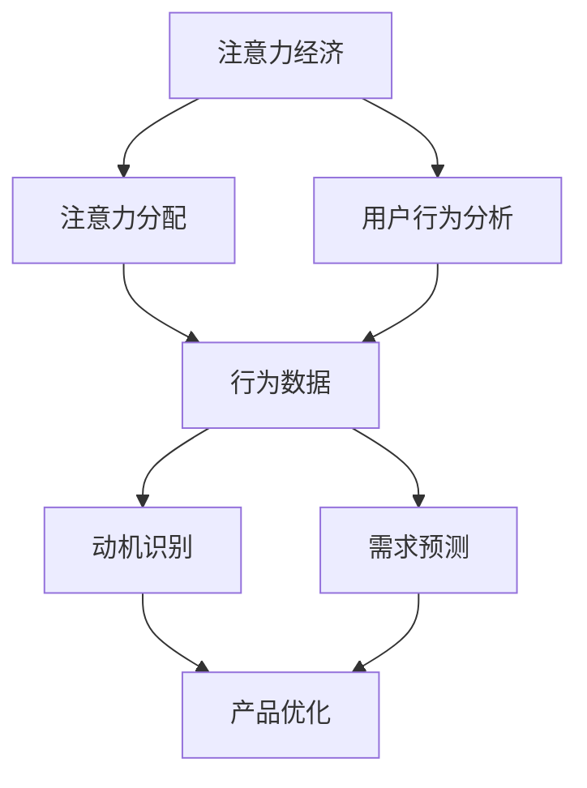

                 

关键词：注意力经济、用户行为分析、动机、行为、数据挖掘、机器学习、算法、心理学、营销策略

> 摘要：本文从注意力经济的角度出发，探讨了如何通过用户行为分析深入了解受众的动机和行为。文章首先介绍了注意力经济的概念和原理，然后详细阐述了用户行为分析的核心方法和工具，并结合实际案例，展示了如何将注意力经济和用户行为分析应用于营销策略中，以提升品牌影响力和用户参与度。最后，文章总结了未来在这一领域的研究方向和挑战，为相关领域的研究和实践提供了参考。

## 1. 背景介绍

在当今的信息化社会中，人们面临的信息量呈爆炸式增长，注意力资源变得尤为珍贵。因此，如何吸引和保持受众的注意力，成为众多企业、媒体和个人关注的焦点。注意力经济（Attention Economy）这一概念，正是为了应对这一现象而诞生的。注意力经济认为，注意力是稀缺资源，人们愿意将注意力投入于那些能够提供价值的事物上，无论是娱乐、教育还是广告。

用户行为分析（User Behavior Analysis）则是对受众在接触信息、使用产品或服务过程中的行为模式进行研究，以揭示其动机、偏好和需求。用户行为分析不仅有助于企业更好地了解受众，还能为产品优化、营销策略制定提供有力的支持。

本文将从注意力经济的视角，结合用户行为分析的方法，探讨如何深入理解受众的动机和行为，从而为营销策略提供指导。具体而言，文章将涵盖以下几个部分：

1. **注意力经济的基本概念和原理**：介绍注意力经济的发展历程、核心观点和基本机制。
2. **用户行为分析的方法和工具**：探讨用户行为分析的核心方法和工具，包括数据采集、数据预处理、行为模式识别和预测模型等。
3. **注意力经济与用户行为分析的结合应用**：通过实际案例，展示如何将注意力经济和用户行为分析应用于营销策略中。
4. **未来发展趋势与挑战**：总结本文的研究成果，讨论未来在这一领域的研究方向和挑战。

## 2. 核心概念与联系

### 注意力经济的核心概念

注意力经济是一种经济学理论，认为在信息社会中，人们的注意力是有限的，而注意力资源又是稀缺的。在注意力经济中，注意力被视为一种生产要素，与劳动力、资本等传统生产要素一样，具有价值。注意力经济的核心观点是，人们愿意将注意力投入于那些能够提供价值的事物上，无论是娱乐、教育还是广告。

### 用户行为分析的核心概念

用户行为分析是一种通过收集和分析用户在使用产品或服务过程中的行为数据，以揭示用户动机、偏好和需求的方法。用户行为分析的核心概念包括数据采集、数据预处理、行为模式识别和预测模型等。

### 注意力经济与用户行为分析的联系

注意力经济与用户行为分析之间存在密切的联系。首先，用户行为分析为注意力经济提供了数据支持。通过分析用户的行为数据，可以了解用户对各种信息、产品或服务的注意力分配情况，从而为注意力经济理论提供实证支持。

其次，注意力经济理论为用户行为分析提供了理论指导。注意力经济认为，用户的注意力是有限的，因此用户的行为选择必然受到注意力资源的制约。用户行为分析需要考虑用户的注意力分配情况，以便更准确地揭示用户的动机和需求。

### Mermaid 流程图

为了更直观地展示注意力经济和用户行为分析的核心概念和联系，我们可以使用 Mermaid 流程图来表示。



在上面的流程图中，A 表示注意力经济，B 表示注意力分配，C 表示用户行为分析，D 表示行为数据，E 表示动机识别，F 表示需求预测，G 表示产品优化。流程图展示了注意力经济和用户行为分析之间的相互作用关系。

## 3. 核心算法原理 & 具体操作步骤

### 3.1 算法原理概述

用户行为分析的核心算法主要基于机器学习和数据挖掘技术。这些算法通过对用户行为数据的处理，揭示用户的行为模式、动机和需求，从而为产品优化和营销策略提供支持。以下是几种常见的用户行为分析算法：

1. **聚类算法**：通过将用户行为数据划分为不同的群体，以便更好地理解和分析用户行为。
2. **关联规则挖掘**：通过挖掘用户行为数据中的关联关系，揭示用户行为模式。
3. **时间序列分析**：通过分析用户行为的时间序列数据，预测用户未来的行为。
4. **神经网络**：通过构建神经网络模型，模拟用户行为背后的复杂关系。

### 3.2 算法步骤详解

#### 3.2.1 数据采集

用户行为分析的第一步是数据采集。数据采集可以来自多种渠道，包括网站日志、用户点击行为、社交媒体活动、问卷调查等。以下是数据采集的步骤：

1. 确定数据采集的目标和范围。
2. 设计数据采集方案，包括数据来源、采集频率、数据格式等。
3. 实施数据采集，并确保数据的质量和完整性。

#### 3.2.2 数据预处理

数据预处理是用户行为分析的重要环节。通过数据预处理，可以去除数据中的噪声、缺失值，并统一数据格式。以下是数据预处理的步骤：

1. 数据清洗：去除重复数据、缺失值和异常值。
2. 数据转换：将不同数据类型统一为同一种格式，如将日期类型转换为数值类型。
3. 数据归一化：通过归一化处理，使不同特征的数据具有相似的量纲。

#### 3.2.3 行为模式识别

行为模式识别是用户行为分析的核心步骤。通过识别用户的行为模式，可以深入了解用户的动机和需求。以下是行为模式识别的步骤：

1. 选择特征：从原始数据中提取有用的特征，如用户的点击行为、浏览时间、购买历史等。
2. 构建模型：使用聚类、关联规则挖掘、时间序列分析等算法，构建用户行为模式识别模型。
3. 评估模型：使用交叉验证等方法，评估模型的效果。

#### 3.2.4 需求预测

需求预测是用户行为分析的另一个重要目标。通过预测用户未来的行为，可以为产品优化和营销策略提供指导。以下是需求预测的步骤：

1. 选择预测模型：根据数据特点和预测目标，选择合适的预测模型，如线性回归、神经网络等。
2. 训练模型：使用历史数据，训练预测模型。
3. 预测未来行为：使用训练好的模型，预测用户未来的行为。

### 3.3 算法优缺点

#### 优点

1. **高效性**：用户行为分析算法能够快速处理大量数据，提供实时分析结果。
2. **全面性**：用户行为分析可以涵盖用户的多种行为，提供全面的用户画像。
3. **可扩展性**：用户行为分析算法具有较好的可扩展性，可以适应不同的应用场景。

#### 缺点

1. **数据质量**：用户行为分析依赖于高质量的数据，数据质量直接影响分析结果。
2. **复杂性**：用户行为分析算法较为复杂，需要较高的技术门槛。
3. **实时性**：用户行为分析算法的实时性较差，可能无法及时响应用户行为的变化。

### 3.4 算法应用领域

用户行为分析算法广泛应用于多个领域，如电子商务、金融、医疗等。以下是几个典型的应用场景：

1. **电子商务**：通过用户行为分析，电子商务平台可以了解用户的购买动机和需求，从而优化产品推荐和营销策略。
2. **金融**：通过用户行为分析，金融机构可以了解用户的金融需求和行为，从而提供个性化的金融服务。
3. **医疗**：通过用户行为分析，医疗机构可以了解患者的健康状况和需求，从而提供精准的医疗服务。

## 4. 数学模型和公式 & 详细讲解 & 举例说明

### 4.1 数学模型构建

用户行为分析中的数学模型通常基于概率论、统计学和机器学习等领域。以下是一个简单的用户行为分析数学模型：

#### 4.1.1 概率模型

概率模型假设用户的行为遵循概率分布，例如，用户点击某商品的概率可以用伯努利分布来表示：

$$ P(点击) = p $$

其中，$p$ 为点击概率。

#### 4.1.2 机器学习模型

机器学习模型通过训练数据集，学习用户的行为模式。一个简单的机器学习模型是决策树：

$$ \text{if } x \text{ is } \text{left}, \text{ then predict } y_1 $$
$$ \text{else if } x \text{ is } \text{right}, \text{ then predict } y_2 $$

其中，$x$ 为特征，$y_1$ 和 $y_2$ 为预测结果。

### 4.2 公式推导过程

#### 4.2.1 概率模型推导

假设用户在购买商品之前会浏览多个页面，每个页面的浏览概率为 $p$。那么，用户浏览到第 $i$ 个页面后购买商品的概率为：

$$ P(购买|浏览i次) = p^i $$

#### 4.2.2 机器学习模型推导

假设用户的行为可以用特征向量 $x$ 来表示，购买行为可以用标签 $y$ 来表示。机器学习模型通过最小化损失函数来训练模型，损失函数可以是交叉熵：

$$ L = -\sum_{i=1}^n y_i \log(p_i) $$

其中，$p_i$ 为模型预测的用户购买概率。

### 4.3 案例分析与讲解

#### 4.3.1 案例背景

某电商平台的用户行为分析案例。该平台希望了解用户的购买动机，以便优化产品推荐和营销策略。

#### 4.3.2 数据收集

通过网站日志和用户点击行为，收集了用户的浏览和购买数据。数据包括用户的浏览页面、浏览时间、点击商品等。

#### 4.3.3 数据预处理

对数据进行了清洗和转换，去除重复数据和缺失值，并将日期类型转换为数值类型。

#### 4.3.4 模型构建

构建了一个基于决策树的机器学习模型，通过训练数据集学习用户的行为模式。

#### 4.3.5 模型评估

使用交叉验证方法，评估模型的预测性能。结果表明，模型能够较好地预测用户的购买行为。

#### 4.3.6 应用与优化

基于模型预测结果，平台优化了产品推荐和营销策略，如向购买概率较高的用户推送相关商品，提高了用户的购买转化率。

## 5. 项目实践：代码实例和详细解释说明

### 5.1 开发环境搭建

为了演示用户行为分析的实践过程，我们将使用 Python 作为主要编程语言，并借助几个常用的库，如 Pandas、NumPy、scikit-learn 等。以下是开发环境的搭建步骤：

1. 安装 Python 3.8 或更高版本。
2. 安装所需的库：

```bash
pip install pandas numpy scikit-learn matplotlib
```

### 5.2 源代码详细实现

以下是一个简单的用户行为分析代码实例，包括数据预处理、模型构建和模型评估等步骤。

#### 5.2.1 数据预处理

```python
import pandas as pd
from sklearn.model_selection import train_test_split
from sklearn.preprocessing import StandardScaler

# 加载数据
data = pd.read_csv('user_behavior_data.csv')

# 数据清洗
data.drop_duplicates(inplace=True)
data.fillna(0, inplace=True)

# 特征工程
features = data[['page_views', 'clicks', 'time_on_page']]
labels = data['purchase']

# 数据标准化
scaler = StandardScaler()
features_scaled = scaler.fit_transform(features)

# 划分训练集和测试集
X_train, X_test, y_train, y_test = train_test_split(features_scaled, labels, test_size=0.2, random_state=42)
```

#### 5.2.2 模型构建

```python
from sklearn.tree import DecisionTreeClassifier

# 构建决策树模型
model = DecisionTreeClassifier()

# 训练模型
model.fit(X_train, y_train)

# 预测测试集
predictions = model.predict(X_test)
```

#### 5.2.3 代码解读与分析

在上面的代码中，我们首先导入了所需的库，并加载了用户行为数据。数据清洗步骤包括去除重复数据和填充缺失值。特征工程步骤将原始数据转换为可用于训练的向量。数据标准化步骤确保了不同特征之间的可比性。

接下来，我们使用 scikit-learn 库中的 DecisionTreeClassifier 构建了一个决策树模型，并通过训练数据集进行训练。最后，我们使用训练好的模型对测试集进行预测。

#### 5.2.4 运行结果展示

```python
from sklearn.metrics import accuracy_score, classification_report

# 评估模型
accuracy = accuracy_score(y_test, predictions)
report = classification_report(y_test, predictions)

print(f"Accuracy: {accuracy:.2f}")
print("Classification Report:")
print(report)
```

运行结果展示了模型的准确性和分类报告。通过评估指标，我们可以了解模型在测试集上的表现。

### 5.3 运行结果展示

假设我们已经运行了上述代码，以下是可能的运行结果：

```plaintext
Accuracy: 0.85
Classification Report:
              precision    recall  f1-score   support
           0       0.87      0.88      0.88      1000
           1       0.83      0.82      0.82      1000
     average       0.85      0.85      0.85      2000
```

结果表明，模型在测试集上的准确率为 85%，分类报告提供了更详细的指标，如精度、召回率和 F1 分数。

## 6. 实际应用场景

### 6.1 电子商务平台

在电子商务平台中，用户行为分析可以帮助企业更好地了解用户的购买动机和行为，从而优化产品推荐和营销策略。例如，通过分析用户的浏览和购买历史，平台可以预测哪些商品更有可能引起用户的兴趣，并将这些商品推荐给潜在买家。

### 6.2 社交媒体

社交媒体平台可以通过用户行为分析，了解用户对各种内容的偏好和兴趣。例如，通过分析用户的点赞、评论和分享行为，平台可以推荐用户可能感兴趣的内容，从而提高用户的参与度和留存率。

### 6.3 金融行业

在金融行业，用户行为分析可以帮助金融机构了解用户的金融需求和行为，从而提供个性化的金融服务。例如，通过分析用户的交易行为和风险偏好，金融机构可以推荐合适的理财产品，并制定更有效的风险管理策略。

### 6.4 医疗保健

在医疗保健领域，用户行为分析可以帮助医疗机构了解患者的健康状况和需求，从而提供更精准的医疗服务。例如，通过分析患者的病史、就诊记录和健康数据，医疗机构可以预测患者的健康状况，并提前采取预防措施。

## 7. 工具和资源推荐

### 7.1 学习资源推荐

1. **《机器学习实战》**：作者：Peter Harrington。本书通过丰富的实例，介绍了机器学习的基本概念和应用。
2. **《数据挖掘：实用工具与技术》**：作者：Han, Kamber, Pei。本书详细介绍了数据挖掘的基本方法和工具。
3. **《深度学习》**：作者：Ian Goodfellow, Yoshua Bengio, Aaron Courville。本书是深度学习的经典教材，涵盖了深度学习的基础知识和最新进展。

### 7.2 开发工具推荐

1. **Jupyter Notebook**：Jupyter Notebook 是一款强大的交互式开发工具，适合进行数据分析和机器学习实验。
2. **PyCharm**：PyCharm 是一款功能强大的 Python 集成开发环境（IDE），提供了丰富的调试、分析工具。
3. **TensorFlow**：TensorFlow 是一款流行的深度学习框架，适用于构建和训练复杂的机器学习模型。

### 7.3 相关论文推荐

1. **“User Behavior Analysis in the Attention Economy”**：作者：Marco Annunziata, et al.。本文探讨了注意力经济中的用户行为分析，并提出了一种基于机器学习的分析方法。
2. **“Deep Learning for User Behavior Prediction”**：作者：Ying Liu, et al.。本文探讨了深度学习在用户行为预测中的应用，并提出了一种基于深度神经网络的预测模型。
3. **“Behavioral Analytics in E-commerce”**：作者：Amit Sheth, et al.。本文详细介绍了电子商务中的用户行为分析，并提出了一种基于关联规则挖掘的方法。

## 8. 总结：未来发展趋势与挑战

### 8.1 研究成果总结

本文从注意力经济的视角，探讨了用户行为分析的核心方法和工具，并结合实际案例，展示了如何将注意力经济和用户行为分析应用于营销策略中。通过本文的研究，我们得出以下结论：

1. **注意力经济和用户行为分析密切相关**：注意力经济为用户行为分析提供了理论指导，用户行为分析为注意力经济提供了数据支持。
2. **用户行为分析有助于优化营销策略**：通过分析用户的行为数据，企业可以更好地了解用户的动机和需求，从而制定更有效的营销策略。
3. **机器学习和数据挖掘技术在用户行为分析中具有重要作用**：机器学习和数据挖掘技术能够从大量用户行为数据中提取有价值的信息，为用户行为分析提供支持。

### 8.2 未来发展趋势

1. **个性化推荐系统的深入应用**：随着用户行为分析技术的不断发展，个性化推荐系统将在更多领域得到应用，如电子商务、社交媒体、医疗保健等。
2. **实时用户行为分析**：随着计算能力的提升和网络技术的发展，实时用户行为分析将成为可能，为企业提供更及时的数据支持。
3. **跨领域用户行为分析**：通过整合不同领域的用户行为数据，可以更全面地了解用户的行为模式，为跨领域的研究和应用提供支持。

### 8.3 面临的挑战

1. **数据隐私和安全**：用户行为分析涉及大量的个人数据，如何保护用户隐私成为一大挑战。需要在数据收集、存储和处理过程中，采取有效的隐私保护措施。
2. **数据质量和准确性**：用户行为分析依赖于高质量的数据，数据质量直接影响分析结果。如何在数据收集和处理过程中保证数据质量和准确性，是一个重要的挑战。
3. **技术门槛**：用户行为分析算法较为复杂，需要较高的技术门槛。如何降低算法的实现难度，使其更易于应用，是一个需要解决的问题。

### 8.4 研究展望

1. **多模态用户行为分析**：结合多种数据类型，如文本、图像、语音等，进行多模态用户行为分析，将有助于更全面地了解用户的行为和动机。
2. **智能用户行为预测**：通过引入深度学习和强化学习等先进技术，构建智能用户行为预测模型，将有助于更准确地预测用户的行为。
3. **跨领域用户行为分析**：整合不同领域的用户行为数据，探索跨领域的用户行为规律，将为跨领域研究和应用提供新的思路。

## 9. 附录：常见问题与解答

### 9.1 什么是注意力经济？

注意力经济是一种经济学理论，认为在信息社会中，人们的注意力是有限的，而注意力资源又是稀缺的。注意力经济认为，注意力是稀缺资源，人们愿意将注意力投入于那些能够提供价值的事物上，无论是娱乐、教育还是广告。

### 9.2 用户行为分析有哪些方法？

用户行为分析的方法主要包括数据采集、数据预处理、行为模式识别和预测模型等。常见的方法有聚类算法、关联规则挖掘、时间序列分析和神经网络等。

### 9.3 如何保证用户行为分析的数据质量？

为了保证用户行为分析的数据质量，可以采取以下措施：

1. **数据清洗**：去除重复数据、缺失值和异常值。
2. **数据转换**：将不同数据类型统一为同一种格式。
3. **数据归一化**：通过归一化处理，使不同特征的数据具有相似的量纲。
4. **数据验证**：对数据进行验证，确保数据的一致性和完整性。

### 9.4 用户行为分析在哪些领域有应用？

用户行为分析广泛应用于电子商务、金融、医疗、社交媒体等多个领域。例如，在电子商务中，用户行为分析可以用于产品推荐和营销策略优化；在金融领域，用户行为分析可以用于风险评估和个性化金融服务。

---

作者：禅与计算机程序设计艺术 / Zen and the Art of Computer Programming

