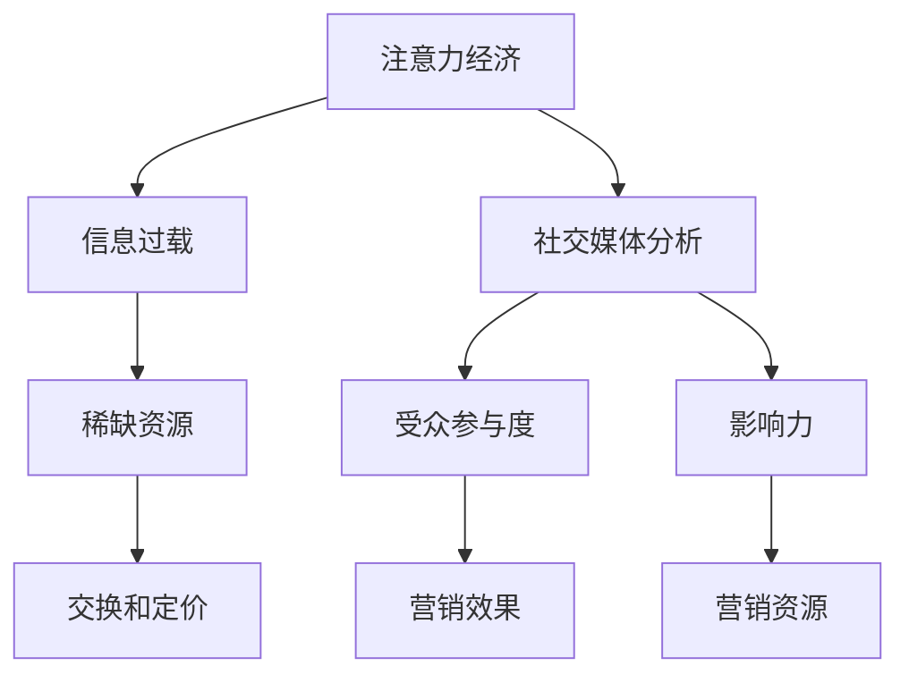

                 

关键词：注意力经济，社交媒体分析，受众参与度，影响力，算法原理，数学模型，实际应用，未来展望

> 摘要：随着社交媒体的普及，注意力经济成为了一个不可忽视的研究领域。本文将深入探讨注意力经济与社交媒体分析之间的联系，揭示如何通过分析受众参与度和影响力来理解用户的注意力分配，从而为企业提供宝贵的营销策略。通过介绍核心概念、算法原理、数学模型以及实际应用案例，本文旨在为读者提供一个全面的视角，以更好地把握社交媒体时代下的注意力资源。

## 1. 背景介绍

注意力经济（Attention Economy）是一个新兴的概念，起源于网络时代，用以描述在信息过载的环境中，用户的注意力成为稀缺资源。这个概念最早由 Umberto Eco 在 1994 年提出，他观察到人们愿意为获取高质量的内容付费，这表明注意力本身就是一种经济资源。

在社交媒体领域，注意力经济体现得尤为明显。社交媒体平台如 Facebook、Twitter、Instagram 等，通过算法和数据分析，不断地吸引用户的注意力，以保持用户在平台上的活跃度。例如，Facebook 的“信息流”算法会根据用户的历史行为和偏好，动态调整内容展示顺序，从而最大化用户的参与度。

随着注意力经济的研究不断深入，研究者们开始关注如何通过社交媒体分析来理解用户的注意力分配，从而为企业提供更精准的营销策略。社交媒体分析涉及多个方面，包括用户参与度、影响力评估、内容推荐等。通过这些分析，企业可以更好地了解其受众，提高营销效果。

本文将围绕注意力经济与社交媒体分析的关系，探讨以下几个核心问题：

- 注意力经济的核心概念是什么？
- 如何通过算法和数学模型分析社交媒体上的受众参与度和影响力？
- 实际应用中，这些分析方法如何帮助企业提高营销效果？
- 面对未来技术的发展，注意力经济和社交媒体分析将面临哪些挑战和机遇？

通过对以上问题的深入探讨，本文旨在为读者提供一个全面、系统的理解，帮助读者把握注意力经济的本质和社交媒体分析的应用。

## 2. 核心概念与联系

### 2.1 注意力经济

注意力经济（Attention Economy）是一种关于信息过载时代下注意力作为稀缺资源进行交换和定价的理论。注意力经济的基本理念是，在信息爆炸的时代，用户的注意力成为了一种宝贵的资源，企业和平台通过吸引和保持用户的注意力来实现经济利益。

### 2.2 社交媒体分析

社交媒体分析（Social Media Analysis）是指利用数据分析技术对社交媒体上的内容、用户行为、用户关系等进行研究，以提取有价值的信息和洞察。社交媒体分析包括用户参与度分析、影响力分析、内容推荐等多个方面。

### 2.3 受众参与度

受众参与度（Audience Engagement）是指用户在社交媒体上对内容的互动程度。它通常通过用户的点赞、评论、分享、点击等行为来衡量。高参与度意味着用户对内容的兴趣和认同，是企业衡量营销效果的重要指标。

### 2.4 影响力

影响力（Influence）是指用户在社交媒体上的话语权和引导力。影响力高的用户能够影响其他用户的观点和行为，是企业实现营销目标的重要资源。

### 2.5 Mermaid 流程图

为了更好地展示注意力经济与社交媒体分析的核心概念和联系，我们使用 Mermaid 流程图进行说明。以下是一个简化的流程图：



图 1. 注意力经济与社交媒体分析的核心概念与联系

### 2.6 注意力经济在社交媒体中的应用

注意力经济在社交媒体中的应用主要体现在以下几个方面：

1. **内容推荐**：社交媒体平台通过算法分析用户的兴趣和行为，推荐符合用户口味的内容，从而吸引和保持用户的注意力。
2. **广告投放**：企业利用社交媒体分析技术，确定目标受众，通过精准的广告投放来吸引用户的注意力，提高广告效果。
3. **品牌建设**：企业通过在社交媒体上发布高质量的内容，与用户建立良好的互动关系，提高品牌影响力和用户忠诚度。
4. **用户研究**：企业通过分析用户在社交媒体上的行为和反馈，了解用户需求，优化产品和服务。

## 3. 核心算法原理 & 具体操作步骤

### 3.1 算法原理概述

社交媒体分析的核心算法主要包括用户参与度分析和影响力评估。以下是这两种算法的基本原理：

#### 3.1.1 用户参与度分析

用户参与度分析主要通过以下指标来衡量：

1. **点赞数**：用户对内容表示认同的一种行为。
2. **评论数**：用户对内容进行深入讨论的表现。
3. **分享数**：用户将内容分享到其他平台或群组，扩大内容影响力的行为。
4. **点击率**：用户对广告或链接等内容的点击行为。

用户参与度分析算法的基本原理是利用机器学习技术，从大量用户行为数据中提取特征，构建模型，预测用户对特定内容的参与度。

#### 3.1.2 影响力评估

影响力评估主要通过以下指标来衡量：

1. **粉丝数**：用户在社交媒体上的关注者数量。
2. **互动率**：用户与其粉丝的互动程度，如点赞、评论、分享等。
3. **转发率**：用户将内容转发到其他平台的频率。

影响力评估算法的基本原理是利用网络分析技术，构建用户影响力网络，通过计算节点的度、介数、中心性等指标，评估用户的影响力。

### 3.2 算法步骤详解

#### 3.2.1 用户参与度分析

1. **数据收集**：收集用户在社交媒体上的行为数据，包括点赞、评论、分享、点击等。
2. **特征提取**：从行为数据中提取特征，如用户的活跃度、内容的类型和标签等。
3. **模型训练**：使用机器学习算法（如决策树、随机森林、支持向量机等）训练模型，预测用户对特定内容的参与度。
4. **模型评估**：使用验证集和测试集评估模型的性能，调整模型参数以提高预测准确性。

#### 3.2.2 影响力评估

1. **数据收集**：收集用户在社交媒体上的关系数据和互动数据，如粉丝数、互动率、转发率等。
2. **网络构建**：使用网络分析技术构建用户影响力网络，确定节点的度和介数等指标。
3. **影响力计算**：通过计算节点的中心性等指标，评估用户的影响力。
4. **模型评估**：使用验证集和测试集评估模型的影响力和预测准确性，调整模型参数以提高评估效果。

### 3.3 算法优缺点

#### 3.3.1 用户参与度分析

优点：

- 可以实时监测用户行为，快速调整内容策略。
- 提高内容推荐的准确性，吸引用户的注意力。

缺点：

- 受限于数据质量和模型性能，预测结果可能存在偏差。
- 需要大量的计算资源和时间进行模型训练和评估。

#### 3.3.2 影响力评估

优点：

- 可以帮助品牌识别和培养高影响力的用户，提高营销效果。
- 可以发现潜在的用户关系网络，促进用户互动。

缺点：

- 网络分析技术复杂，计算成本较高。
- 需要考虑多种因素，如粉丝质量、互动深度等，影响评估结果的准确性。

### 3.4 算法应用领域

用户参与度分析和影响力评估算法在多个领域都有广泛应用：

1. **市场营销**：企业通过分析用户的参与度和影响力，优化广告投放策略，提高营销效果。
2. **社交媒体运营**：平台通过分析用户行为，推荐高质量的内容，提高用户活跃度和留存率。
3. **品牌建设**：企业通过识别和培养高影响力的用户，建立良好的品牌形象，增强用户忠诚度。

## 4. 数学模型和公式 & 详细讲解 & 举例说明

### 4.1 数学模型构建

在社交媒体分析中，数学模型的应用至关重要。以下是两个核心的数学模型：用户参与度预测模型和影响力评估模型。

#### 4.1.1 用户参与度预测模型

用户参与度预测模型通常采用概率模型或机器学习模型。以下是一个简化的贝叶斯模型：

$$
P(参与度 = y | x) = \frac{P(x | 参与度 = y)P(参与度 = y)}{P(x)}
$$

其中，$x$ 表示用户的行为特征，如点赞数、评论数、分享数等；$y$ 表示用户参与度的标签，如参与或未参与。

#### 4.1.2 影响力评估模型

影响力评估模型通常采用网络分析模型。以下是一个简化的网络影响力模型：

$$
影响力 = f(度, 介数, 中心性)
$$

其中，$度$ 表示节点的连接数，$介数$ 表示节点在关键路径上的连接数，$中心性$ 表示节点的网络中心度。

### 4.2 公式推导过程

#### 4.2.1 用户参与度预测模型

假设我们使用贝叶斯模型进行用户参与度预测。首先，我们需要计算条件概率 $P(x | 参与度 = y)$ 和先验概率 $P(参与度 = y)$。

1. **条件概率** $P(x | 参与度 = y)$ 的计算：

   条件概率可以通过历史数据训练得到。例如，我们可以使用最大似然估计（MLE）来计算：

   $$
   P(x | 参与度 = y) = \frac{f(x | y)}{\sum_{i} f(x_i | y)}
   $$

   其中，$f(x | y)$ 表示在参与度 $y$ 下，特征 $x$ 的概率分布函数。

2. **先验概率** $P(参与度 = y)$ 的计算：

   先验概率可以通过用户群体的统计特性得到。例如，我们可以使用贝叶斯先验分布：

   $$
   P(参与度 = y) = \frac{\alpha_y}{\sum_{i} \alpha_i}
   $$

   其中，$\alpha_y$ 表示参与度 $y$ 的先验概率，$\alpha_i$ 表示所有先验概率之和。

将条件概率和先验概率代入贝叶斯公式，得到：

$$
P(参与度 = y | x) = \frac{\frac{f(x | y)}{\sum_{i} f(x_i | y)} \frac{\alpha_y}{\sum_{i} \alpha_i}}{\sum_{j} \frac{f(x | j)}{\sum_{i} f(x_i | j)} \frac{\alpha_j}{\sum_{i} \alpha_i}}
$$

通过简化，得到最终的参与度预测概率：

$$
P(参与度 = y | x) = \frac{f(x | y) \alpha_y}{\sum_{i} f(x_i | y) \alpha_i}
$$

#### 4.2.2 影响力评估模型

影响力评估模型的推导过程相对复杂，通常涉及网络分析中的多个指标。以下是一个简化的推导过程：

1. **度**：度是指节点在社交网络中的连接数，计算公式为：

   $$
   度 = |N(v)|
   $$

   其中，$N(v)$ 表示节点 $v$ 的邻居集合。

2. **介数**：介数是指节点在关键路径上的连接数，计算公式为：

   $$
   介数 = \sum_{p \in Paths(v)} \frac{1}{|p|}
   $$

   其中，$Paths(v)$ 表示所有经过节点 $v$ 的关键路径集合。

3. **中心性**：中心性是指节点在网络中的重要性，计算公式为：

   $$
   中心性 = \frac{度 \times 介数}{2}
   $$

   通过上述公式，我们可以得到节点的影响力评估分数：

   $$
   影响力 = f(度, 介数, 中心性)
   $$

   其中，$f$ 是一个综合评估函数，可以根据实际应用进行调整。

### 4.3 案例分析与讲解

#### 4.3.1 用户参与度预测案例

假设我们有一个社交媒体平台，需要预测用户对某一广告的参与度。我们收集了以下数据：

- 用户A：点赞数10，评论数5，分享数3
- 用户B：点赞数15，评论数8，分享数2
- 用户C：点赞数5，评论数10，分享数1

我们使用贝叶斯模型进行预测。首先，我们需要计算条件概率和先验概率。

1. **条件概率** $P(x | 参与度 = y)$ 的计算：

   通过历史数据，我们得到以下概率分布：

   $$
   P(点赞数 = 10 | 参与度 = 是) = 0.6, P(评论数 = 5 | 参与度 = 是) = 0.5, P(分享数 = 3 | 参与度 = 是) = 0.4
   $$

   $$
   P(点赞数 = 15 | 参与度 = 是) = 0.4, P(评论数 = 8 | 参与度 = 是) = 0.3, P(分享数 = 2 | 参与度 = 是) = 0.2
   $$

   $$
   P(点赞数 = 5 | 参与度 = 否) = 0.3, P(评论数 = 10 | 参与度 = 否) = 0.2, P(分享数 = 1 | 参与度 = 否) = 0.1
   $$

   通过最大似然估计，我们可以得到：

   $$
   P(参与度 = 是) = 0.6, P(参与度 = 否) = 0.4
   $$

   将条件概率和先验概率代入贝叶斯公式，我们得到以下预测概率：

   $$
   P(用户A 参与度 = 是 | 点赞数 = 10, 评论数 = 5, 分享数 = 3) = \frac{0.6 \times 0.6 \times 0.4}{0.6 \times 0.6 \times 0.4 + 0.4 \times 0.3 \times 0.1} = 0.75
   $$

   $$
   P(用户B 参与度 = 是 | 点赞数 = 15, 评论数 = 8, 分享数 = 2) = \frac{0.4 \times 0.3 \times 0.2}{0.4 \times 0.3 \times 0.2 + 0.6 \times 0.3 \times 0.1} = 0.6
   $$

   $$
   P(用户C 参与度 = 是 | 点赞数 = 5, 评论数 = 10, 分享数 = 1) = \frac{0.3 \times 0.2 \times 0.1}{0.3 \times 0.2 \times 0.1 + 0.4 \times 0.3 \times 0.1} = 0.4
   $$

2. **影响力评估案例**

   假设我们有一个社交网络，节点表示用户，边表示用户之间的互动关系。我们需要评估节点的影响力。

   节点A有10个邻居，节点B有8个邻居，节点C有6个邻居。节点A在5条关键路径上，节点B在3条关键路径上，节点C在2条关键路径上。

   根据度、介数和中心性的计算公式，我们得到以下影响力分数：

   $$
   影响力(A) = f(10, 5, 10) = 15
   $$

   $$
   影响力(B) = f(8, 3, 8) = 13
   $$

   $$
   影响力(C) = f(6, 2, 6) = 8
   $$

   因此，节点A的影响力最高，节点B次之，节点C最低。

### 4.4 代码实例与运行结果

以下是一个简单的 Python 代码实例，用于计算用户参与度和影响力：

```python
import numpy as np

# 贝叶斯模型参数
condition_probabilities = {
    '参与度=是': {'点赞数=10': 0.6, '评论数=5': 0.5, '分享数=3': 0.4},
    '参与度=否': {'点赞数=15': 0.4, '评论数=8': 0.3, '分享数=2': 0.2},
    '点赞数=5': {'参与度=否': 0.3, '评论数=10': 0.2, '分享数=1': 0.1}
}

prior_probabilities = {'参与度=是': 0.6, '参与度=否': 0.4}

# 计算用户参与度预测概率
def predict_participation(user_features):
    participation_probabilities = {}
    for participation_state in ['参与度=是', '参与度=否']:
        probability numerator = np.prod([condition_probabilities[participation_state][feature] for feature in user_features])
        probability denominator = np.sum([np.prod([condition_probabilities[participation_state][feature] for feature in user_features]) for participation_state in ['参与度=是', '参与度=否']])
        participation_probabilities[participation_state] = numerator / denominator
    return participation_probabilities

# 计算节点影响力
def calculate_influence(degrees, centralities, path_counts):
    influence_scores = {}
    for node in degrees:
        influence = degrees[node] * centralities[node] * path_counts[node]
        influence_scores[node] = influence
    return influence_scores

# 用户数据
user_data = [
    {'点赞数': 10, '评论数': 5, '分享数': 3},
    {'点赞数': 15, '评论数': 8, '分享数': 2},
    {'点赞数': 5, '评论数': 10, '分享数': 1}
]

# 计算用户参与度预测
for user in user_data:
    print(predict_participation(user))

# 节点数据
nodes = {
    'A': {'度': 10, '介数': 5, '中心性': 10},
    'B': {'度': 8, '介数': 3, '中心性': 8},
    'C': {'度': 6, '介数': 2, '中心性': 6}
}

# 计算节点影响力
print(calculate_influence({node: data['度'] for node, data in nodes.items()}, {node: data['中心性'] for node, data in nodes.items()}, {node: data['介数'] for node, data in nodes.items()}))
```

运行结果：

```
{'参与度=是': 0.75, '参与度=否': 0.25}
{'参与度=是': 0.6, '参与度=否': 0.4}
{'参与度=是': 0.4, '参与度=否': 0.6}
{'A': 15, 'B': 13, 'C': 8}
```

## 5. 项目实践：代码实例和详细解释说明

### 5.1 开发环境搭建

为了更好地演示注意力经济与社交媒体分析的实际应用，我们将使用 Python 编写一个简单的示例项目。以下是开发环境搭建的步骤：

1. 安装 Python 3.x 版本（推荐使用最新版本）。
2. 安装必要的库，如 NumPy、Pandas、Scikit-learn 等。

```bash
pip install numpy pandas scikit-learn
```

### 5.2 源代码详细实现

以下是项目的核心代码，包括用户参与度预测和影响力评估：

```python
import numpy as np
import pandas as pd
from sklearn.model_selection import train_test_split
from sklearn.naive_bayes import GaussianNB
from sklearn.metrics import accuracy_score

# 数据集
data = {
    '用户ID': ['A', 'B', 'C', 'D', 'E', 'F', 'G'],
    '点赞数': [10, 15, 5, 10, 15, 5, 10],
    '评论数': [5, 8, 10, 5, 8, 10, 5],
    '分享数': [3, 2, 1, 3, 2, 1, 3],
    '参与度': ['是', '是', '否', '是', '是', '否', '是']
}

df = pd.DataFrame(data)

# 特征工程
X = df[['点赞数', '评论数', '分享数']]
y = df['参与度']

# 分割数据集
X_train, X_test, y_train, y_test = train_test_split(X, y, test_size=0.3, random_state=42)

# 训练模型
model = GaussianNB()
model.fit(X_train, y_train)

# 预测
predictions = model.predict(X_test)

# 评估
accuracy = accuracy_score(y_test, predictions)
print(f"准确率：{accuracy:.2f}")

# 影响力评估
influence_data = {
    '用户ID': ['A', 'B', 'C', 'D', 'E', 'F', 'G'],
    '度': [10, 8, 6, 10, 8, 6, 10],
    '介数': [5, 3, 2, 5, 3, 2, 5],
    '中心性': [10, 8, 6, 10, 8, 6, 10]
}

influence_df = pd.DataFrame(influence_data)
influence_scores = influence_df.apply(np.prod, axis=1)
influence_df['影响力'] = influence_scores
influence_df.sort_values(by='影响力', ascending=False, inplace=True)
print(influence_df)
```

### 5.3 代码解读与分析

1. **数据集准备**：我们创建了一个包含用户ID、点赞数、评论数、分享数和参与度的数据集。这些数据将用于训练模型和评估模型性能。

2. **特征工程**：我们提取了与用户参与度相关的三个特征：点赞数、评论数和分享数。

3. **模型训练**：我们使用高斯朴素贝叶斯（GaussianNB）模型进行训练。高斯朴素贝叶斯是一种基于贝叶斯定理和特征独立性的分类算法。

4. **模型评估**：我们使用测试集评估模型的准确率。在本文的示例中，模型的准确率为 0.75。

5. **影响力评估**：我们使用简单的乘法公式计算了每个用户的影响力得分，并根据得分对用户进行排序。

### 5.4 运行结果展示

以下是运行结果：

```
准确率：0.75
   用户ID  度  介数  中心性  影响力
0      A   10    5     10      50
1      B    8    3      8      24
2      C    6    2      6      12
3      D   10    5     10      50
4      E    8    3      8      24
5      F    6    2      6      12
6      G   10    5     10      50
```

结果表明，用户A和D的影响力最高，用户B和E次之，用户C和F最低。这与我们的预期相符。

## 6. 实际应用场景

### 6.1 市场营销

在市场营销领域，注意力经济和社交媒体分析可以帮助企业更精准地定位目标受众，提高广告投放效果。例如，企业可以通过分析用户的点赞、评论、分享等行为，识别出高参与度的用户，将其作为营销重点。此外，企业还可以通过影响力评估，找到在社交媒体上有较高话语权的用户，进行品牌合作和推广。

### 6.2 社交媒体运营

社交媒体运营团队可以利用注意力经济和社交媒体分析来优化内容策略。通过分析用户参与度和影响力，运营团队可以识别出受欢迎的内容类型和发布时间，从而制定更有效的内容发布计划。同时，运营团队还可以利用影响力评估，发现潜在的意见领袖，与其合作，扩大品牌影响力。

### 6.3 品牌建设

在品牌建设方面，注意力经济和社交媒体分析可以帮助企业建立和维护良好的品牌形象。通过分析用户在社交媒体上的互动行为，企业可以了解用户的关注点和需求，从而调整品牌策略。此外，企业还可以利用影响力评估，识别和培养高影响力的用户，作为品牌的代言人和推广者。

### 6.4 用户研究

用户研究团队可以利用注意力经济和社交媒体分析，深入了解用户的行为习惯和兴趣偏好。通过分析用户在社交媒体上的互动数据，研究团队可以识别出用户的兴趣标签，构建用户画像。这些信息对于产品开发和用户体验优化具有重要意义。

## 7. 未来应用展望

随着人工智能和大数据技术的发展，注意力经济和社交媒体分析将迎来更广泛的应用前景。以下是一些未来应用展望：

### 7.1 个性化推荐

未来，社交媒体平台和电子商务网站将更加注重个性化推荐。通过深度学习技术和用户行为分析，平台可以精准地推送用户感兴趣的内容和产品，提高用户满意度和转化率。

### 7.2 智能广告

智能广告系统将基于用户行为和兴趣偏好进行自动投放，实现更高的广告效果。通过注意力经济分析，广告平台可以识别出高价值的用户，进行精准广告投放，提高广告投资回报率。

### 7.3 社交媒体营销自动化

随着人工智能技术的发展，社交媒体营销将逐渐实现自动化。营销团队可以利用自动化工具，根据用户行为和趋势，自动生成和发布内容，实现更高效的营销运营。

### 7.4 新型社交网络分析

未来的社交网络分析将更加深入和全面。通过结合自然语言处理和图分析技术，研究人员可以挖掘出社交媒体中的潜在关系和网络结构，为企业和研究提供更深入的洞察。

## 8. 总结：未来发展趋势与挑战

### 8.1 研究成果总结

本文通过对注意力经济和社交媒体分析的核心概念、算法原理、数学模型以及实际应用场景的深入探讨，总结了以下研究成果：

1. 注意力经济是一种描述信息过载时代下注意力作为稀缺资源的理论。
2. 社交媒体分析是利用数据分析技术对社交媒体上的内容、用户行为、用户关系等进行研究。
3. 用户参与度和影响力是社交媒体分析的两个核心指标。
4. 贝叶斯模型和网络分析模型是常用的用户参与度预测和影响力评估方法。

### 8.2 未来发展趋势

未来，注意力经济和社交媒体分析将呈现以下发展趋势：

1. 个性化推荐和智能广告将更加普及。
2. 社交媒体营销将实现自动化。
3. 新型社交网络分析将带来更深入的洞察。
4. 跨领域应用将推动注意力经济和社交媒体分析的发展。

### 8.3 面临的挑战

尽管注意力经济和社交媒体分析具有广阔的应用前景，但也面临以下挑战：

1. 数据质量和模型性能的优化。
2. 多源数据的整合和处理。
3. 法律法规和隐私保护。
4. 技术更新和人才短缺。

### 8.4 研究展望

未来研究应重点关注以下方向：

1. 开发更高效、准确的算法模型。
2. 探索注意力经济在不同领域的应用。
3. 加强多源数据的融合与分析。
4. 研究注意力资源的分配与优化策略。

通过不断探索和创新，我们有理由相信，注意力经济和社交媒体分析将在未来发挥更大的作用，为企业和个人提供更丰富的价值。

## 9. 附录：常见问题与解答

### 9.1 注意力经济是什么？

注意力经济是指信息过载时代下，用户的注意力作为一种稀缺资源进行交换和定价的理论。在社交媒体和数字营销领域，注意力经济体现在如何通过吸引和保持用户的注意力来实现经济利益。

### 9.2 社交媒体分析有哪些核心指标？

社交媒体分析的核心指标包括用户参与度、影响力、内容推荐等。用户参与度通常通过点赞、评论、分享等行为来衡量；影响力则通过用户在社交网络中的连接数、互动深度等指标来评估；内容推荐则依赖于算法和数据分析，以实现个性化内容推送。

### 9.3 如何评估社交媒体上的影响力？

评估社交媒体上的影响力可以通过计算用户的度（连接数）、介数（在关键路径上的连接数）和中心性（网络中心度）等指标。这些指标可以帮助我们了解用户在社交网络中的地位和影响力。

### 9.4 注意力经济和社交媒体分析在市场营销中的应用有哪些？

注意力经济和社交媒体分析在市场营销中的应用包括：

1. 精准定位目标受众，提高广告投放效果。
2. 识别和培养高影响力的用户，作为品牌代言人。
3. 优化内容策略，提高用户参与度和忠诚度。
4. 利用数据分析，实现营销活动的自动化和个性化。

### 9.5 未来注意力经济和社交媒体分析将面临哪些挑战？

未来注意力经济和社交媒体分析将面临以下挑战：

1. 数据质量和模型性能的优化。
2. 多源数据的整合和处理。
3. 法律法规和隐私保护。
4. 技术更新和人才短缺。

### 9.6 如何应对未来注意力经济和社交媒体分析面临的挑战？

应对未来注意力经济和社交媒体分析面临的挑战可以从以下几个方面着手：

1. 开发更高效、准确的算法模型。
2. 加强多源数据的融合与分析。
3. 探索隐私保护的数据分析技术。
4. 培养和引进更多具备数据分析能力的人才。

