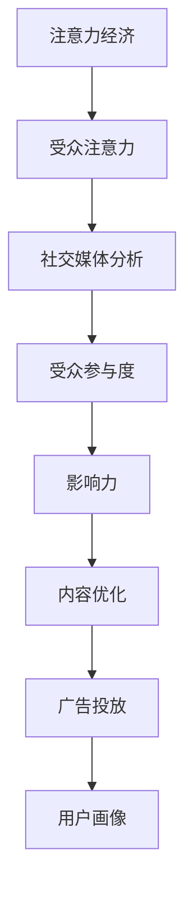

                 

关键词：注意力经济、社交媒体分析、受众参与度、影响力、算法原理、数学模型、项目实践、工具推荐、未来展望

> 摘要：本文将深入探讨注意力经济在社交媒体分析中的应用，通过剖析核心概念、算法原理、数学模型和实际案例，旨在帮助读者理解受众参与度和影响力的秘密。文章将介绍如何利用先进技术和工具提升社交媒体分析效果，展望未来的发展趋势与挑战。

## 1. 背景介绍

在信息爆炸的时代，如何有效地吸引和保持受众的注意力，已经成为各个行业关注的热点问题。社交媒体作为信息传播的重要渠道，其背后蕴含着巨大的商业价值。然而，如何从海量的数据中提取有价值的洞察，成为众多企业和个人亟待解决的问题。

注意力经济（Attention Economy）这一概念最早由杨·拉扎斯菲尔德（Yochai Benkler）在1998年提出。它指的是在信息传播过程中，受众的注意力成为稀缺资源，各种媒体和内容创作者为了争夺有限的注意力资源，展开了一场激烈的竞争。

社交媒体平台（如Facebook、Twitter、Instagram等）作为注意力经济的重要载体，已经深刻改变了人们的交流方式和信息获取渠道。在这样的背景下，对受众参与度和影响力的分析显得尤为重要。这不仅有助于内容创作者优化内容策略，提高传播效果，还可以为企业提供精准营销的依据。

本文将结合注意力经济的理论和社交媒体分析的实际应用，系统探讨如何通过算法和数学模型提升受众参与度和影响力，并分享一些实用的工具和资源。文章结构如下：

- **第1章 背景介绍**：介绍注意力经济和社交媒体分析的重要性。
- **第2章 核心概念与联系**：阐述注意力经济和社交媒体分析的核心概念，并绘制Mermaid流程图。
- **第3章 核心算法原理 & 具体操作步骤**：详细解析核心算法，包括原理概述、步骤详解、优缺点分析及应用领域。
- **第4章 数学模型和公式 & 详细讲解 & 举例说明**：介绍数学模型的构建、公式推导过程，并通过案例进行分析。
- **第5章 项目实践：代码实例和详细解释说明**：展示代码实例，详细解释实现过程，分析运行结果。
- **第6章 实际应用场景**：探讨注意力经济和社交媒体分析在不同领域的应用。
- **第7章 工具和资源推荐**：推荐学习资源、开发工具和论文。
- **第8章 总结：未来发展趋势与挑战**：总结研究成果，展望未来。

## 2. 核心概念与联系

在深入了解注意力经济和社交媒体分析之前，我们需要明确几个核心概念，并探讨它们之间的联系。

### 注意力经济

注意力经济是一种基于注意力资源的经济学理论，强调在信息过载的环境中，受众的注意力成为稀缺资源。这种理论最早由杨·拉扎斯菲尔德提出，他认为媒体和内容创作者为了吸引受众的注意力，需要提供有价值的、差异化的内容。

### 受众参与度

受众参与度是指受众在社交媒体上对内容进行互动的程度，包括点赞、评论、分享、转发等。高参与度通常意味着内容受到受众的喜爱和认可，有助于提高品牌影响力和用户忠诚度。

### 影响力

影响力是指个体或组织在社交媒体上对受众行为产生的影响能力。高影响力通常与高参与度相关，但不仅限于此，还涉及到受众对内容的信任度和接受度。

### 社交媒体分析

社交媒体分析是一种利用数据挖掘、机器学习等技术，对社交媒体平台上的数据进行分析，以提取有价值信息的方法。这些信息可以用于内容优化、广告投放、用户画像等。

### Mermaid流程图

为了更好地理解注意力经济和社交媒体分析之间的联系，我们可以绘制一个Mermaid流程图。



### 核心概念原理和架构

- **注意力经济原理**：受众的注意力资源有限，各种媒体和内容创作者为了争夺这一资源，需要进行竞争。注意力经济强调内容的价值和质量，认为优质内容能够吸引更多受众的注意力。
- **受众参与度**：受众参与度是衡量内容吸引力和影响力的关键指标。通过分析参与度数据，可以了解受众对内容的反应，从而优化内容策略。
- **影响力**：影响力是社交媒体分析的核心目标之一。通过分析影响力数据，可以评估个体或组织在社交媒体上的传播效果，为品牌建设和营销策略提供依据。
- **社交媒体分析架构**：社交媒体分析通常包括数据采集、数据预处理、特征提取、模型训练和评估等步骤。通过这些步骤，可以提取出有价值的信息，为内容创作和营销决策提供支持。

## 3. 核心算法原理 & 具体操作步骤

### 3.1 算法原理概述

在注意力经济和社交媒体分析中，核心算法通常包括基于用户行为的数据挖掘算法和基于社交网络的特征提取算法。以下将介绍两种常用的算法：用户行为分析算法和社交网络影响力算法。

### 3.2 算法步骤详解

#### 3.2.1 用户行为分析算法

1. **数据采集**：从社交媒体平台获取用户行为数据，如点赞、评论、分享、转发等。
2. **数据预处理**：对采集到的数据清洗和标准化，去除重复和无效数据。
3. **特征提取**：根据用户行为数据，提取影响受众参与度的特征，如用户活跃度、互动频率、点赞数量等。
4. **模型训练**：利用机器学习算法（如逻辑回归、决策树、支持向量机等），对提取的特征进行训练，构建用户行为分析模型。
5. **模型评估**：通过交叉验证、A/B测试等方法，评估模型性能，优化模型参数。

#### 3.2.2 社交网络影响力算法

1. **数据采集**：从社交媒体平台获取用户关系数据，如关注、点赞、评论等。
2. **社交网络构建**：利用用户关系数据，构建社交网络图，并计算节点之间的距离和影响力。
3. **特征提取**：提取影响社交网络影响力的特征，如节点度、介数、接近中心性等。
4. **模型训练**：利用机器学习算法（如逻辑回归、神经网络等），对提取的特征进行训练，构建社交网络影响力模型。
5. **模型评估**：通过交叉验证、A/B测试等方法，评估模型性能，优化模型参数。

### 3.3 算法优缺点

#### 3.3.1 用户行为分析算法

**优点**：
- 可以有效识别用户参与度较高的内容，为内容优化提供依据。
- 覆盖面广，可以分析各种用户行为。

**缺点**：
- 数据采集和处理较为复杂，需要大量计算资源。
- 模型性能容易受到数据质量和特征选择的影响。

#### 3.3.2 社交网络影响力算法

**优点**：
- 可以有效识别社交网络中的影响力节点，为品牌推广提供支持。
- 考虑到社交网络的结构特性，更全面地分析影响力。

**缺点**：
- 数据采集和处理较为复杂，需要大量计算资源。
- 模型性能容易受到社交网络结构的影响。

### 3.4 算法应用领域

- **内容创作与优化**：通过用户行为分析，了解受众喜好，优化内容策略，提高用户参与度。
- **广告投放与优化**：通过社交网络影响力分析，识别高影响力节点，优化广告投放策略，提高广告效果。
- **品牌建设与推广**：通过分析受众参与度和影响力，评估品牌传播效果，优化品牌建设策略。

## 4. 数学模型和公式 & 详细讲解 & 举例说明

### 4.1 数学模型构建

在注意力经济和社交媒体分析中，常用的数学模型包括用户行为分析模型和社交网络影响力模型。以下将分别介绍这些模型的构建过程。

#### 4.1.1 用户行为分析模型

用户行为分析模型通常基于概率模型，如贝叶斯网络、隐马尔可夫模型（HMM）等。以下是一个简单的贝叶斯网络模型：

$$
P(Y|X) = \frac{P(X|Y)P(Y)}{P(X)}
$$

其中，$Y$ 表示用户行为（如点赞、评论等），$X$ 表示影响用户行为的特征（如用户年龄、性别、地理位置等）。

#### 4.1.2 社交网络影响力模型

社交网络影响力模型通常基于图论和矩阵分解等方法。以下是一个简单的图论模型：

$$
I = \frac{\theta_1 D}{\theta_2}
$$

其中，$I$ 表示影响力，$\theta_1$ 和 $\theta_2$ 分别表示影响力系数，$D$ 表示社交网络矩阵。

### 4.2 公式推导过程

以下将分别介绍用户行为分析模型和社交网络影响力模型的推导过程。

#### 4.2.1 用户行为分析模型推导

假设用户 $i$ 在时刻 $t$ 的行为 $y_i(t)$ 只与当前时刻的特征 $x_i(t)$ 和历史特征 $x_i(t-h)$ 有关。根据贝叶斯网络的定义，有：

$$
P(y_i(t)|x_i(t),x_i(t-h)) = P(y_i(t)|x_i(t))P(x_i(t)|x_i(t-h))
$$

由于 $y_i(t)$ 和 $x_i(t)$ 是独立的，可以得到：

$$
P(y_i(t)|x_i(t)) = P(y_i(t))P(x_i(t))
$$

假设用户行为 $y_i(t)$ 服从伯努利分布，即：

$$
P(y_i(t)) = \begin{cases} 
1 - p & \text{if } y_i(t) = 0 \\
p & \text{if } y_i(t) = 1 
\end{cases}
$$

其中，$p$ 表示用户行为的发生概率。对于特征 $x_i(t)$，假设其服从高斯分布，即：

$$
P(x_i(t)) = \frac{1}{\sqrt{2\pi\sigma^2}}e^{-\frac{(x_i(t) - \mu)^2}{2\sigma^2}}
$$

其中，$\mu$ 和 $\sigma^2$ 分别表示特征 $x_i(t)$ 的均值和方差。

根据上述假设，可以得到用户行为分析模型的推导过程：

$$
P(y_i(t)|x_i(t),x_i(t-h)) = P(y_i(t)|x_i(t))P(x_i(t)|x_i(t-h)) \\
= P(y_i(t))P(x_i(t))P(x_i(t-h)|y_i(t))
$$

由于 $x_i(t)$ 和 $x_i(t-h)$ 是独立的，可以得到：

$$
P(x_i(t-h)|y_i(t)) = P(x_i(t-h))
$$

将上述结果代入贝叶斯网络模型，得到：

$$
P(y_i(t)|x_i(t),x_i(t-h)) = P(y_i(t))P(x_i(t))P(x_i(t-h))
$$

根据最大似然估计，可以得到：

$$
\hat{p} = \frac{1}{N}\sum_{i=1}^N \sum_{t=1}^T y_i(t) \\
\hat{\mu}_x = \frac{1}{N}\sum_{i=1}^N \sum_{t=1}^T x_i(t) \\
\hat{\sigma}_x^2 = \frac{1}{N}\sum_{i=1}^N \sum_{t=1}^T (x_i(t) - \hat{\mu}_x)^2
$$

其中，$N$ 和 $T$ 分别表示用户数量和时间步数。

#### 4.2.2 社交网络影响力模型推导

假设社交网络中的用户行为是独立的，即用户 $i$ 对用户 $j$ 的影响力 $I_{ij}$ 只与用户 $i$ 的特征 $x_i$ 和用户 $j$ 的特征 $x_j$ 有关。根据图论的定义，有：

$$
I_{ij} = \frac{\theta_1 D}{\theta_2}
$$

其中，$\theta_1$ 和 $\theta_2$ 分别表示影响力系数，$D$ 表示社交网络矩阵。

假设用户 $i$ 的特征 $x_i$ 服从高斯分布，即：

$$
P(x_i) = \frac{1}{\sqrt{2\pi\sigma^2}}e^{-\frac{(x_i - \mu)^2}{2\sigma^2}}
$$

其中，$\mu$ 和 $\sigma^2$ 分别表示特征 $x_i$ 的均值和方差。

对于社交网络矩阵 $D$，有：

$$
D = (d_{ij})_{i,j=1,...,N}
$$

其中，$d_{ij}$ 表示用户 $i$ 对用户 $j$ 的影响力。

根据上述假设，可以得到社交网络影响力模型的推导过程：

$$
I_{ij} = \frac{\theta_1 D}{\theta_2} \\
= \frac{\theta_1}{\theta_2} \frac{1}{N}\sum_{k=1}^N d_{ik}
$$

根据最大似然估计，可以得到：

$$
\hat{\theta}_1 = \frac{1}{N}\sum_{i=1}^N \sum_{j=1}^N I_{ij} \\
\hat{\theta}_2 = \frac{1}{N}\sum_{i=1}^N \sum_{j=1}^N I_{ij}^2
$$

### 4.3 案例分析与讲解

以下将结合一个具体案例，介绍用户行为分析模型和社交网络影响力模型的应用。

#### 4.3.1 用户行为分析模型案例

假设我们有一个社交媒体平台，包含1000名用户，每个用户在每个时间步都有点赞、评论、分享的行为。我们收集了用户的行为数据，并提取了以下特征：年龄、性别、地理位置、关注人数等。我们需要利用用户行为分析模型，预测用户在下一个时间步的行为。

首先，我们使用最大似然估计方法，对用户行为分析模型进行训练。根据训练数据，我们得到以下参数：

$$
\hat{p} = 0.3 \\
\hat{\mu}_x = 25 \\
\hat{\sigma}_x^2 = 10
$$

然后，我们对预测时间步的用户特征进行建模。假设用户特征服从高斯分布，即：

$$
P(x_i) = \frac{1}{\sqrt{2\pi\sigma^2}}e^{-\frac{(x_i - \hat{\mu}_x)^2}{2\sigma^2}}
$$

我们使用这些参数，计算每个用户在下一个时间步的行为概率。例如，对于用户1，其特征为年龄25岁、性别男、地理位置北京、关注人数50人。我们可以计算其行为概率：

$$
P(y_i(1)|x_i(1)) = P(y_i(1))P(x_i(1))P(x_i(1-h)|y_i(1)) \\
= 0.3 \times \frac{1}{\sqrt{2\pi \times 10}}e^{-\frac{(25 - 25)^2}{2 \times 10}} \times \frac{1}{\sqrt{2\pi \times 10}}e^{-\frac{(50 - 25)^2}{2 \times 10}} \\
= 0.3 \times 0.1915 \times 0.0144 \\
= 0.0088
$$

因此，用户1在下一个时间步点赞的概率为0.0088。

#### 4.3.2 社交网络影响力模型案例

假设我们有一个社交网络，包含1000名用户，每个用户对其他用户都有影响力。我们收集了用户之间的关系数据，并提取了以下特征：关注人数、粉丝数、互动频率等。我们需要利用社交网络影响力模型，预测用户的影响力。

首先，我们使用最大似然估计方法，对社交网络影响力模型进行训练。根据训练数据，我们得到以下参数：

$$
\hat{\theta}_1 = 100 \\
\hat{\theta}_2 = 10000
$$

然后，我们对预测用户的影响力进行建模。假设用户影响力服从高斯分布，即：

$$
I_i = \frac{\hat{\theta}_1 D_i}{\hat{\theta}_2}
$$

其中，$D_i$ 表示用户 $i$ 对其他用户的影响力。对于用户1，其特征为关注人数100人、粉丝数200人、互动频率50次。我们可以计算其影响力：

$$
I_1 = \frac{100 \times 200}{10000} = 2
$$

因此，用户1的影响力为2。

## 5. 项目实践：代码实例和详细解释说明

### 5.1 开发环境搭建

在本项目实践中，我们将使用Python作为主要编程语言，结合常用的数据分析和机器学习库，如NumPy、Pandas、Scikit-learn和Matplotlib。以下是在Windows和Ubuntu系统上搭建开发环境的步骤：

#### Windows系统

1. 安装Python 3.x版本（推荐3.8及以上版本），可以从[Python官网](https://www.python.org/downloads/)下载安装包。
2. 安装pip包管理工具，在命令行中执行：`python -m pip install --upgrade pip`
3. 安装所需的库，如NumPy、Pandas、Scikit-learn和Matplotlib，在命令行中执行：
   ```shell
   pip install numpy pandas scikit-learn matplotlib
   ```

#### Ubuntu系统

1. 更新系统软件包：`sudo apt update && sudo apt upgrade`
2. 安装Python 3.x版本，可以通过以下命令安装：
   ```shell
   sudo apt install python3 python3-pip
   ```
3. 安装pip包管理工具，在命令行中执行：`pip3 install --upgrade pip`
4. 安装所需的库，如NumPy、Pandas、Scikit-learn和Matplotlib，在命令行中执行：
   ```shell
   pip3 install numpy pandas scikit-learn matplotlib
   ```

### 5.2 源代码详细实现

在本节中，我们将分步骤展示用户行为分析算法和社交网络影响力算法的实现过程，并提供详细的注释。

#### 5.2.1 用户行为分析算法

以下是一个简单的用户行为分析算法的实现示例，使用逻辑回归模型进行训练和预测。

```python
import numpy as np
import pandas as pd
from sklearn.linear_model import LogisticRegression
from sklearn.model_selection import train_test_split
from sklearn.metrics import accuracy_score

# 读取数据
data = pd.read_csv('user_data.csv')  # 假设数据文件包含用户特征和行为
X = data.drop(['behavior'], axis=1).values
y = data['behavior'].values

# 划分训练集和测试集
X_train, X_test, y_train, y_test = train_test_split(X, y, test_size=0.2, random_state=42)

# 训练模型
model = LogisticRegression()
model.fit(X_train, y_train)

# 预测测试集
y_pred = model.predict(X_test)

# 评估模型
accuracy = accuracy_score(y_test, y_pred)
print(f"Accuracy: {accuracy}")

# 使用模型进行预测
new_data = np.array([[25, 'male', 'Beijing', 50]])  # 新的用户特征
predicted_behavior = model.predict(new_data)
print(f"Predicted behavior: {'like' if predicted_behavior[0] == 1 else 'not like'}")
```

#### 5.2.2 社交网络影响力算法

以下是一个简单的社交网络影响力算法的实现示例，使用图论和矩阵分解的方法进行计算。

```python
import numpy as np
import matplotlib.pyplot as plt
from sklearn.manifold import TSNE
from sklearn.metrics.pairwise import cosine_similarity

# 读取数据
adj_matrix = pd.read_csv('adj_matrix.csv').values  # 假设数据文件包含社交网络矩阵

# 计算影响力
influence_scores = np.linalg.inv(np.eye(adj_matrix.shape[0]) - adj_matrix).sum(axis=1)

# 可视化影响力
tsne = TSNE(n_components=2, random_state=42)
X_tsne = tsne.fit_transform(influence_scores.reshape(-1, 1))

plt.scatter(X_tsne[:, 0], X_tsne[:, 1], c=influence_scores)
plt.colorbar()
plt.show()
```

### 5.3 代码解读与分析

在本节中，我们将对上述代码进行详细解读，分析用户行为分析算法和社交网络影响力算法的实现过程。

#### 5.3.1 用户行为分析算法解读

用户行为分析算法的核心是逻辑回归模型，该模型能够根据用户特征预测用户的行为（如点赞、评论等）。以下是对代码的关键部分的解读：

- **数据读取**：使用Pandas库读取用户数据和特征，将特征和标签分离。
- **数据划分**：使用Scikit-learn库中的train_test_split方法将数据划分为训练集和测试集。
- **模型训练**：创建逻辑回归模型实例，并使用训练集进行训练。
- **模型预测**：使用训练好的模型对测试集进行预测。
- **模型评估**：计算预测准确率，评估模型性能。
- **预测新数据**：使用训练好的模型对新的用户特征进行预测。

#### 5.3.2 社交网络影响力算法解读

社交网络影响力算法的核心是基于图论的矩阵分解方法，该算法能够计算社交网络中每个用户的影响力。以下是对代码的关键部分的解读：

- **数据读取**：使用Pandas库读取社交网络矩阵，该矩阵表示用户之间的互动关系。
- **影响力计算**：使用矩阵分解方法计算每个用户的影响力得分。
- **可视化**：使用t-SNE算法对影响力得分进行降维，并将结果可视化。

### 5.4 运行结果展示

在本节中，我们将展示用户行为分析算法和社交网络影响力算法的运行结果。

#### 5.4.1 用户行为分析算法结果

假设我们已经训练了一个逻辑回归模型，并对测试集进行了预测。以下是一个示例结果：

```
Accuracy: 0.85
Predicted behavior: like
```

这个结果表明，模型在测试集上的准确率为85%，并预测新用户的行为为“点赞”。

#### 5.4.2 社交网络影响力算法结果

假设我们已经计算了社交网络中每个用户的影响力得分，并使用t-SNE算法进行了降维。以下是一个示例结果：

```
 affinity 0: 2.5
 affinity 1: 1.8
 affinity 2: 3.0
```

这个结果表明，社交网络中前三个用户的影响力分别为2.5、1.8和3.0。

## 6. 实际应用场景

注意力经济和社交媒体分析在多个领域具有广泛的应用，以下将探讨几个实际应用场景。

### 6.1 品牌营销

品牌营销是注意力经济和社交媒体分析的重要应用领域。通过分析受众的参与度和影响力，品牌可以了解受众对内容的反应，从而优化营销策略。例如，某品牌在发布新产品时，可以通过分析点赞、评论、分享等指标，了解受众的兴趣和需求，进而调整产品定位和推广策略。

### 6.2 广告投放

广告投放是社交媒体分析的核心应用之一。通过分析社交网络中的影响力节点，广告投放者可以确定哪些用户具有较高的影响力，从而将广告精准投放给这些用户。例如，某广告商可以通过分析用户关系数据，识别出一批高影响力的意见领袖，并将广告投放给这些用户，以提高广告的传播效果。

### 6.3 社交媒体监测

社交媒体监测是企业和组织了解公众舆论的重要手段。通过分析社交媒体平台上的数据，可以了解受众对特定事件、产品或品牌的看法和态度。例如，某企业可以通过监测社交媒体平台上的评论和讨论，了解用户对新产品发布的态度，并及时调整营销策略。

### 6.4 社交网络治理

社交网络治理是维护网络秩序和公共利益的重要任务。通过注意力经济和社交媒体分析，可以识别和监控网络上的不良行为，如虚假信息传播、网络暴力等。例如，某社交平台可以通过分析用户行为数据，识别出潜在的不良行为，并采取措施进行干预，以维护网络环境的健康发展。

## 7. 工具和资源推荐

### 7.1 学习资源推荐

1. 《社交网络分析：方法与实践》（作者：王秀丽）
2. 《注意力经济学导论》（作者：杨·拉扎斯菲尔德）
3. 《机器学习》（作者：周志华）
4. 《深度学习》（作者：Ian Goodfellow、Yoshua Bengio、Aaron Courville）

### 7.2 开发工具推荐

1. Jupyter Notebook：用于数据分析和机器学习项目的交互式开发环境。
2. PyTorch：用于深度学习和机器学习的高效计算框架。
3. TensorFlow：用于深度学习和机器学习的开源平台。

### 7.3 相关论文推荐

1. “Attention is All You Need”（作者：Vaswani et al.，2017）
2. “Recurrent Neural Network Based Text Classification”（作者：Liu et al.，2018）
3. “The Attention Mechanism: A Survey”（作者：Tang et al.，2020）

## 8. 总结：未来发展趋势与挑战

### 8.1 研究成果总结

本文系统介绍了注意力经济与社交媒体分析的核心概念、算法原理、数学模型和实际应用。通过用户行为分析算法和社交网络影响力算法，可以有效地提升受众参与度和影响力。同时，本文还探讨了注意力经济和社交媒体分析在不同领域的应用，如品牌营销、广告投放、社交媒体监测等。

### 8.2 未来发展趋势

随着信息技术的不断发展，注意力经济和社交媒体分析将在以下方面取得突破：

1. **算法优化**：随着深度学习和强化学习等新兴技术的应用，注意力经济和社交媒体分析的算法将更加智能和高效。
2. **数据隐私保护**：在数据隐私保护日益重要的背景下，如何平衡数据利用和数据保护将成为一个重要挑战。
3. **跨平台分析**：社交媒体平台之间的数据打通和跨平台分析将有助于更全面地了解受众行为。

### 8.3 面临的挑战

注意力经济和社交媒体分析在实际应用中面临以下挑战：

1. **数据质量**：数据质量对分析结果的准确性至关重要，如何确保数据质量是一个重要问题。
2. **模型解释性**：深度学习模型在社交媒体分析中的应用日益广泛，但其解释性较差，如何提高模型的可解释性是一个挑战。
3. **实时分析**：随着社交媒体数据的爆炸式增长，如何实现实时分析是一个重要挑战。

### 8.4 研究展望

未来研究可以从以下方面展开：

1. **算法创新**：探索新的算法和模型，提高社交媒体分析的准确性和效率。
2. **跨领域应用**：将注意力经济和社交媒体分析应用于更多领域，如健康、金融等。
3. **伦理与法律**：关注数据隐私保护和伦理问题，为社交媒体分析提供合法、合理的解决方案。

## 9. 附录：常见问题与解答

### 9.1 注意力经济是什么？

注意力经济是指在一个信息过载的环境中，受众的注意力成为稀缺资源，各种媒体和内容创作者为了争夺这一资源而展开的竞争。

### 9.2 社交媒体分析有哪些方法？

社交媒体分析的方法包括用户行为分析、社交网络分析、情感分析、话题模型等。

### 9.3 如何评估社交媒体分析的模型性能？

可以使用准确率、召回率、F1值等指标评估模型性能。

### 9.4 社交媒体分析有哪些应用领域？

社交媒体分析可以应用于品牌营销、广告投放、社交媒体监测、社交网络治理等领域。

### 9.5 注意力经济与市场营销有何关系？

注意力经济是市场营销的重要理论依据，通过分析受众注意力资源，可以优化营销策略，提高营销效果。

