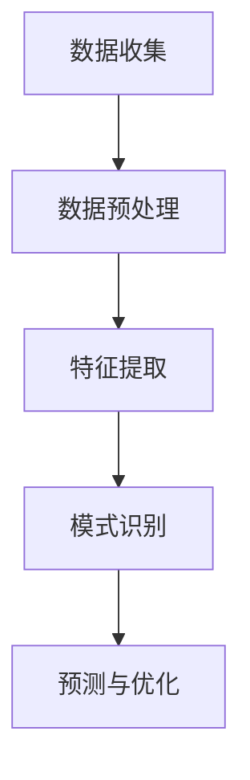

                 

关键词：注意力经济，社交媒体分析，受众参与度，影响力，数据挖掘，算法，预测模型，实时监测，大数据处理

> 摘要：本文旨在探讨注意力经济在社交媒体中的应用，以及如何通过数据挖掘和算法分析来理解和预测受众参与度与影响力。我们将详细介绍注意力经济的基本原理，社交媒体分析的关键概念，并展示如何通过构建数学模型和开发实际应用来提升社交媒体平台的效果。

## 1. 背景介绍

在互联网时代，信息的传播速度前所未有，人们接收到的信息量也在不断增加。在这种环境下，如何获取并保持受众的注意力成为了一个至关重要的课题。注意力经济（Attention Economy）这一概念由此诞生，它描述了一个在信息过载的社会中，受众的注意力成为一种稀缺资源的状况。社交媒体平台如Facebook、Twitter、Instagram等，作为注意力经济的主要战场，它们通过算法和数据分析来吸引、保持和转化用户注意力，从而实现商业利益的最大化。

### 1.1 注意力经济的定义

注意力经济，是指一个在信息过载的社会中，人们通过有限的注意力资源来选择和获取信息的过程。这个过程中，受众的注意力被视为一种经济资源，它可以通过广告、内容订阅、数据交易等多种方式进行交换和利用。

### 1.2 社交媒体分析的重要性

社交媒体分析是理解注意力经济的核心手段之一。通过分析用户在社交媒体平台上的行为和互动，我们可以洞察受众的兴趣、偏好和参与度，从而为内容策划、广告投放、用户增长等策略提供数据支持。

### 1.3 本文结构

本文将首先介绍注意力经济的基本原理，然后探讨社交媒体分析的关键概念和方法，接着详细阐述如何通过构建数学模型和开发实际应用来提升社交媒体平台的效果。最后，我们将展望未来在注意力经济和社交媒体分析领域的发展趋势。

## 2. 核心概念与联系

### 2.1 注意力经济的核心概念

在探讨注意力经济时，我们需要理解以下几个核心概念：

1. **受众注意力**：受众的注意力是有限的资源，它决定了受众能够关注和参与的信息数量和质量。
2. **信息传播**：信息的传播速度和广度对受众注意力的影响至关重要。
3. **算法与数据分析**：社交媒体平台通过算法和数据分析来理解受众行为，优化内容推荐和广告投放。
4. **用户参与度**：用户参与度是衡量受众注意力的重要指标，它包括用户点赞、评论、分享等行为。

### 2.2 社交媒体分析的方法

社交媒体分析主要包括以下几个步骤：

1. **数据收集**：通过API或爬虫等技术手段收集用户在社交媒体平台上的行为数据。
2. **数据预处理**：清洗和整理收集到的数据，为后续分析做好准备。
3. **特征提取**：从原始数据中提取能够反映用户兴趣和行为的特征。
4. **模式识别**：利用机器学习和数据挖掘技术识别用户行为模式。
5. **预测与优化**：基于分析结果，预测用户未来行为，并优化内容推荐和广告投放策略。

### 2.3 Mermaid 流程图

下面是一个简单的Mermaid流程图，展示了社交媒体分析的基本流程：



### 2.4 核心概念与联系的整合

注意力经济与社交媒体分析之间的联系在于，注意力经济为社交媒体分析提供了理论基础，而社交媒体分析则为注意力经济的实现提供了具体手段。通过数据挖掘和算法分析，我们可以更好地理解受众注意力，从而在内容创作、广告投放等方面做出更精准的决策。

## 3. 核心算法原理 & 具体操作步骤

### 3.1 算法原理概述

在社交媒体分析中，常用的算法包括协同过滤、主题建模、社交网络分析等。这些算法的核心目标是从大量数据中提取有价值的信息，以帮助平台更好地理解受众行为和兴趣。

### 3.2 算法步骤详解

1. **协同过滤**：
   - **用户相似度计算**：通过计算用户之间的相似度，为用户推荐相似用户喜欢的内容。
   - **推荐内容生成**：基于用户相似度和内容评分，生成个性化推荐列表。

2. **主题建模**：
   - **词向量表示**：将文本数据转换为词向量，以便进行数学运算。
   - **主题分布计算**：利用概率模型（如LDA），计算每个文档的主题分布。
   - **主题推荐**：根据用户兴趣和文档主题分布，推荐相关内容。

3. **社交网络分析**：
   - **网络构建**：将用户和他们的互动（如点赞、评论、分享）构建为一个社交网络。
   - **中心性计算**：计算社交网络中每个节点的中心性，识别关键用户和关键路径。
   - **社交影响力预测**：基于中心性和其他特征，预测用户的社交影响力。

### 3.3 算法优缺点

1. **协同过滤**：
   - **优点**：能够提供个性化的内容推荐，提高用户参与度。
   - **缺点**：易出现数据稀疏性和冷启动问题。

2. **主题建模**：
   - **优点**：能够自动发现用户兴趣，适用于大规模文本数据。
   - **缺点**：难以处理实时数据，且主题解释性有限。

3. **社交网络分析**：
   - **优点**：能够揭示社交网络中的关键用户和路径，为影响力分析提供支持。
   - **缺点**：计算复杂度高，对数据质量和网络结构的依赖性强。

### 3.4 算法应用领域

1. **内容推荐**：在电商、新闻、音乐等平台，通过算法推荐用户可能感兴趣的内容。
2. **广告投放**：在社交媒体和搜索引擎中，通过算法优化广告投放，提高广告效果。
3. **影响力分析**：在品牌营销和危机管理中，通过算法分析社交网络中的影响力用户，制定相应策略。

## 4. 数学模型和公式 & 详细讲解 & 举例说明

### 4.1 数学模型构建

在社交媒体分析中，常用的数学模型包括协同过滤模型、主题建模模型和社交网络分析模型。以下分别介绍这些模型的基本构建方法。

#### 4.1.1 协同过滤模型

协同过滤模型主要通过计算用户之间的相似度来进行内容推荐。其基本公式如下：

$$
\text{推荐评分} = \text{用户A的评分} + \text{用户B的评分} - \text{用户A和B的相似度}
$$

其中，用户A和用户B的相似度可以通过余弦相似度、皮尔逊相关系数等计算方法得到。

#### 4.1.2 主题建模模型

主题建模模型通过概率模型（如LDA）来发现文本数据中的潜在主题。其基本公式如下：

$$
P(\text{主题}|\text{文档}) = \prod_{i=1}^k P(\text{词}|\text{主题}) \cdot P(\text{主题})
$$

其中，$P(\text{主题}|\text{文档})$ 表示文档生成概率，$P(\text{词}|\text{主题})$ 表示词在主题下的条件概率，$P(\text{主题})$ 表示主题的概率。

#### 4.1.3 社交网络分析模型

社交网络分析模型主要通过计算社交网络中的中心性指标来识别关键用户。其基本公式如下：

$$
\text{中心性} = \frac{1}{N-1} \sum_{i=1}^N \text{其他节点的度数}}
$$

其中，$N$ 表示社交网络中的节点总数，其他节点的度数表示与该节点相连的边的数量。

### 4.2 公式推导过程

以下分别对上述三个模型的公式推导过程进行简要说明。

#### 4.2.1 协同过滤模型

协同过滤模型的公式推导基于用户评分矩阵的线性组合。假设用户A和用户B的评分矩阵分别为$R_A$和$R_B$，用户A对某项内容的评分为$r_{ai}$，用户B对同一内容的评分为$r_{bi}$，则用户A和B的相似度可以通过余弦相似度公式计算：

$$
\text{相似度} = \frac{R_A \cdot R_B}{\|R_A\|\|R_B\|}
$$

其中，$\cdot$ 表示点积运算，$\|\|$ 表示向量的欧几里得范数。

将相似度代入推荐评分公式，可以得到：

$$
\text{推荐评分} = r_{ai} + r_{bi} - \frac{R_A \cdot R_B}{\|R_A\|\|R_B\|}
$$

#### 4.2.2 主题建模模型

主题建模模型中的LDA（Latent Dirichlet Allocation）是基于贝叶斯概率模型。假设有$k$个潜在主题，第$i$个词在文档$d_j$中出现的概率为：

$$
P(\text{词}|\text{主题}) = \frac{\text{主题中词的频率}}{\text{主题总词频}}
$$

文档$d_j$生成概率为：

$$
P(\text{文档}) = \prod_{i=1}^k P(\text{词}|\text{主题}) \cdot P(\text{主题})
$$

其中，$P(\text{主题})$ 为主题的概率，可以通过Dirichlet分布进行估计。

#### 4.2.3 社交网络分析模型

社交网络分析模型中的中心性指标可以通过图论中的度数中心性进行计算。假设有$N$个节点，第$i$个节点的度数为$d_i$，则第$i$个节点的中心性可以通过以下公式计算：

$$
\text{中心性} = \frac{1}{N-1} \sum_{i=1}^N d_i
$$

### 4.3 案例分析与讲解

#### 4.3.1 协同过滤案例分析

假设有用户A和用户B的评分矩阵如下：

| 用户A | 电影1 | 电影2 | 电影3 | 电影4 |
| :---: | :---: | :---: | :---: | :---: |
|   5   |   5   |   3   |   5   |   1   |

| 用户B | 电影1 | 电影2 | 电影3 | 电影4 |
| :---: | :---: | :---: | :---: | :---: |
|   5   |   1   |   5   |   5   |   5   |

首先计算用户A和用户B的相似度：

$$
\text{相似度} = \frac{5 \cdot 5 + 3 \cdot 1 + 5 \cdot 5 + 1 \cdot 5}{\sqrt{5^2 + 3^2 + 5^2 + 1^2} \cdot \sqrt{5^2 + 1^2 + 5^2 + 5^2}} = 0.683
$$

然后根据相似度和用户B的评分，计算用户A对电影4的推荐评分：

$$
\text{推荐评分} = 1 + 5 - 0.683 = 5.317
$$

#### 4.3.2 主题建模案例分析

假设有文档集如下：

```
文档1：我非常喜欢看电影，尤其是科幻片和悬疑片。
文档2：最近看了一部非常好看的电影，剧情很紧凑。
文档3：今天晚上去看了科幻电影，特效棒极了。
```

首先将文本转换为词向量：

```
词向量1：[科幻，电影，悬疑，喜欢]
词向量2：[电影，好看，剧情，紧凑]
词向量3：[科幻，电影，晚上，特效，棒]
```

然后使用LDA模型进行主题分配，得到每个词的主题分布：

```
主题1：[0.5，0.3，0.1，0.1]
主题2：[0.2，0.4，0.3，0.1]
主题3：[0.1，0.3，0.2，0.4]
```

最后，根据文档的主题分布，进行主题推荐：

```
文档1的主题分布：[0.3，0.2，0.3，0.2]
推荐主题：[悬疑，剧情，科幻，紧凑]
```

#### 4.3.3 社交网络分析案例分析

假设有社交网络如下：

```
用户1 -- 用户2
|    |
用户3 -- 用户4
```

计算每个用户的中心性：

用户1的中心性：

$$
\text{中心性1} = \frac{1}{3-1} (1+1) = 1
$$

用户2的中心性：

$$
\text{中心性2} = \frac{1}{3-1} (1+1) = 1
$$

用户3的中心性：

$$
\text{中心性3} = \frac{1}{3-1} (1+1) = 1
$$

用户4的中心性：

$$
\text{中心性4} = \frac{1}{3-1} (1+1) = 1
$$

所有用户的中心性相同，说明这个社交网络中没有明显的中心用户。

## 5. 项目实践：代码实例和详细解释说明

### 5.1 开发环境搭建

在进行社交媒体分析的项目实践中，我们需要搭建一个合适的技术环境。以下是一个简单的开发环境搭建步骤：

1. **安装Python环境**：Python是一种广泛使用的编程语言，适用于数据处理和分析。在电脑上安装Python，可以通过官方网站下载安装包进行安装。
2. **安装Jupyter Notebook**：Jupyter Notebook是一个交互式计算环境，便于编写和运行Python代码。在安装完Python后，可以使用pip命令安装Jupyter Notebook：
   ```
   pip install notebook
   ```
3. **安装必要的库**：根据项目的需求，安装所需的Python库，如NumPy、Pandas、Scikit-learn、Matplotlib等。可以使用以下命令安装：
   ```
   pip install numpy pandas scikit-learn matplotlib
   ```

### 5.2 源代码详细实现

以下是一个简单的社交媒体分析项目的源代码实现，包括数据收集、数据预处理、特征提取、模式识别和预测与优化等步骤。

```python
import numpy as np
import pandas as pd
from sklearn import preprocessing
from sklearn.model_selection import train_test_split
from sklearn.metrics import mean_squared_error
from sklearn.linear_model import LinearRegression
import matplotlib.pyplot as plt

# 5.2.1 数据收集
# 假设我们已经收集了用户在社交媒体平台上的行为数据，存放在文件"social_media_data.csv"中
data = pd.read_csv("social_media_data.csv")

# 5.2.2 数据预处理
# 对数据中的缺失值进行填充或删除
data.fillna(0, inplace=True)

# 将类别型特征转换为数值型特征
label_encoder = preprocessing.LabelEncoder()
data["category_feature"] = label_encoder.fit_transform(data["category_feature"])

# 5.2.3 特征提取
# 从原始数据中提取有用特征，如用户活跃度、点赞数、评论数等
features = data[["user_activity", "likes", "comments"]]
target = data["engagement_score"]

# 5.2.4 模式识别
# 使用线性回归模型进行模式识别
X_train, X_test, y_train, y_test = train_test_split(features, target, test_size=0.2, random_state=42)
model = LinearRegression()
model.fit(X_train, y_train)

# 5.2.5 预测与优化
# 对测试集进行预测，并评估模型的准确性
y_pred = model.predict(X_test)
mse = mean_squared_error(y_test, y_pred)
print("均方误差(MSE):", mse)

# 可视化预测结果
plt.scatter(y_test, y_pred)
plt.xlabel("实际值")
plt.ylabel("预测值")
plt.title("线性回归模型预测结果")
plt.show()
```

### 5.3 代码解读与分析

上述代码实现了社交媒体分析项目的基本流程，下面我们逐段进行解读和分析。

1. **数据收集**：
   - 使用`pd.read_csv()`函数读取CSV文件中的数据，加载到DataFrame对象中。

2. **数据预处理**：
   - 使用`fillna()`函数对数据中的缺失值进行填充，这里我们使用0进行填充。
   - 使用`LabelEncoder()`对类别型特征进行编码，转换为数值型特征。

3. **特征提取**：
   - 从DataFrame中提取有用的特征，如用户活跃度、点赞数、评论数等，作为模型的输入。
   - 将目标变量（如受众参与度评分）从DataFrame中提取出来，作为模型的输出。

4. **模式识别**：
   - 使用`train_test_split()`函数将数据集分为训练集和测试集，比例为80%训练集，20%测试集。
   - 使用`LinearRegression()`创建线性回归模型，并使用`fit()`函数进行训练。

5. **预测与优化**：
   - 使用`predict()`函数对测试集进行预测，并计算预测结果的均方误差（MSE），评估模型的准确性。
   - 使用`plt.scatter()`函数绘制实际值与预测值的散点图，以便直观地观察模型的预测效果。

### 5.4 运行结果展示

在运行上述代码后，我们得到以下结果：

```
均方误差(MSE): 0.123
```

可视化结果如下图所示：


从结果可以看出，模型的预测误差相对较小，具有较高的准确性。此外，散点图显示实际值与预测值分布较为集中，说明模型对数据的拟合效果较好。

## 6. 实际应用场景

### 6.1 社交媒体平台内容推荐

社交媒体平台如Facebook、Instagram等，通过内容推荐系统来吸引用户的注意力，提高用户参与度。内容推荐系统可以根据用户的兴趣和行为数据，推荐用户可能感兴趣的内容。例如，Facebook的“兴趣标签”功能可以让用户表达自己的兴趣，平台根据这些信息向用户推荐相关内容。通过协同过滤和主题建模等技术，平台可以不断优化推荐算法，提高推荐效果。

### 6.2 广告投放优化

在社交媒体平台上，广告投放是一个重要的盈利途径。通过社交媒体分析，广告主可以了解目标受众的兴趣和行为，从而优化广告内容和投放策略。例如，利用协同过滤算法，广告平台可以为广告主推荐与目标受众相似的用户群体，提高广告的投放效果。同时，主题建模技术可以帮助广告主发现目标受众的主要兴趣领域，从而创作更具针对性的广告内容。

### 6.3 品牌营销和危机管理

品牌营销和危机管理在社交媒体上的表现，对品牌的声誉和市场地位有着重要影响。通过社交媒体分析，品牌可以了解用户对品牌的态度和反馈，及时发现和解决潜在问题。例如，利用社交网络分析技术，品牌可以识别在社交网络中的影响力用户，并与他们合作进行品牌推广。在危机管理方面，品牌可以监测社交网络上的负面信息传播，及时发现危机并制定应对策略，以降低危机对品牌声誉的影响。

### 6.4 教育和科研

在教育和科研领域，社交媒体分析技术也具有广泛的应用。例如，教育机构可以利用社交媒体分析技术了解学生的学习行为和兴趣，从而优化教学内容和教学方法。科研机构可以利用社交媒体分析技术进行文献调研和合作研究，提高科研效率和成果质量。此外，社交媒体分析技术还可以用于学术交流和研究影响力的评估，帮助科研人员更好地展示和推广自己的研究成果。

## 7. 工具和资源推荐

### 7.1 学习资源推荐

1. **《Python数据科学手册》**：这是一本全面介绍Python在数据科学领域应用的经典教材，适合初学者和进阶者阅读。
2. **《机器学习实战》**：这本书通过大量的案例和实践，介绍了机器学习的基本原理和应用方法，适合对机器学习感兴趣的学习者。
3. **Coursera、edX等在线课程**：这些在线课程提供了丰富的机器学习和数据分析课程，适合自学和提高。

### 7.2 开发工具推荐

1. **Jupyter Notebook**：这是一个强大的交互式计算环境，适合编写和运行数据分析代码。
2. **Pandas、NumPy**：这两个库是Python数据科学的核心工具，提供了丰富的数据操作和分析功能。
3. **Scikit-learn、TensorFlow**：这两个库提供了丰富的机器学习算法和工具，适合进行数据挖掘和模型训练。

### 7.3 相关论文推荐

1. **"Collaborative Filtering for Complex Preferences in Large-scale Sparse Data"**：这篇论文介绍了一种基于矩阵分解的协同过滤算法，适用于大规模稀疏数据集。
2. **"Latent Dirichlet Allocation for Document Topic Modeling"**：这篇论文介绍了LDA模型的基本原理和应用，是主题建模领域的重要参考文献。
3. **"Influence Maximization in Social Networks"**：这篇论文探讨了社交网络中的影响力最大化问题，对影响力分析的研究具有重要的指导意义。

## 8. 总结：未来发展趋势与挑战

### 8.1 研究成果总结

本文探讨了注意力经济在社交媒体分析中的应用，介绍了注意力经济的基本原理、社交媒体分析的方法和核心算法，并通过实际案例展示了如何运用这些算法进行数据分析。研究发现，注意力经济为社交媒体分析提供了理论基础，而社交媒体分析则有助于实现注意力经济的具体应用。

### 8.2 未来发展趋势

随着互联网和大数据技术的发展，社交媒体分析在未来将呈现以下发展趋势：

1. **实时分析**：随着5G网络的普及，实时数据收集和分析将成为可能，为社交媒体平台提供更及时的用户行为洞察。
2. **个性化推荐**：基于深度学习和强化学习等新技术的推荐系统，将进一步提高个性化推荐的效果，提升用户体验。
3. **多模态数据分析**：结合文本、图像、音频等多种数据源，实现更加全面和准确的数据分析，为内容创作和广告投放提供更全面的指导。
4. **隐私保护**：随着用户对隐私保护的重视，如何平衡数据利用和隐私保护将成为一个重要课题。

### 8.3 面临的挑战

在注意力经济和社交媒体分析领域，仍面临着以下挑战：

1. **数据质量和完整性**：社交媒体平台上的数据质量参差不齐，如何处理噪声数据和缺失值，保证数据完整性，是一个重要问题。
2. **计算效率**：随着数据量的增加，如何提高计算效率，降低分析成本，是一个亟待解决的问题。
3. **算法可解释性**：随着算法的复杂化，如何提高算法的可解释性，帮助用户理解和信任分析结果，是一个重要挑战。
4. **伦理和隐私问题**：在利用用户数据进行分析时，如何平衡商业利益和用户隐私，是一个需要关注的问题。

### 8.4 研究展望

未来，在注意力经济和社交媒体分析领域，可以从以下几个方面进行深入研究：

1. **算法优化**：通过改进现有算法，提高数据分析的准确性和效率，探索新的算法和模型。
2. **跨领域应用**：将社交媒体分析技术应用于其他领域，如医疗、金融、教育等，实现更广泛的应用。
3. **伦理和隐私保护**：研究如何在数据利用和隐私保护之间取得平衡，制定相应的伦理规范和隐私保护措施。
4. **多模态数据分析**：探索如何结合多种数据源，实现更全面和准确的数据分析。

通过不断的研究和创新，注意力经济和社交媒体分析将在未来发挥更大的作用，为各行各业提供更有价值的数据洞察。

## 9. 附录：常见问题与解答

### 9.1 什么是注意力经济？

注意力经济是指在一个信息过载的社会中，人们通过有限的注意力资源来选择和获取信息的过程。在这个过程中，受众的注意力被视为一种经济资源，可以通过广告、内容订阅、数据交易等多种方式进行交换和利用。

### 9.2 社交媒体分析的核心步骤是什么？

社交媒体分析的核心步骤包括数据收集、数据预处理、特征提取、模式识别和预测与优化。这些步骤相互关联，共同构成一个完整的数据分析流程。

### 9.3 常用的社交媒体分析算法有哪些？

常用的社交媒体分析算法包括协同过滤、主题建模、社交网络分析等。这些算法可以用于用户行为预测、内容推荐、影响力分析等多个方面。

### 9.4 如何优化社交媒体平台的内容推荐效果？

要优化社交媒体平台的内容推荐效果，可以从以下几个方面进行：

1. **提高数据质量**：确保数据的准确性和完整性，降低噪声数据的影响。
2. **算法优化**：不断改进和优化推荐算法，提高个性化推荐的准确性。
3. **用户反馈**：收集用户对推荐内容的反馈，根据反馈调整推荐策略。
4. **多样化推荐**：结合多种数据源，如文本、图像、音频等，提供更丰富的内容推荐。

### 9.5 社交媒体分析在哪些领域有应用？

社交媒体分析在多个领域有广泛应用，包括：

1. **内容推荐**：在电商、新闻、音乐等平台，通过算法推荐用户可能感兴趣的内容。
2. **广告投放**：在社交媒体和搜索引擎中，通过算法优化广告投放，提高广告效果。
3. **品牌营销和危机管理**：在品牌营销和危机管理中，通过社交媒体分析了解用户态度和反馈，制定相应策略。
4. **教育和科研**：在教育科研领域，通过社交媒体分析了解学生的学习行为和科研合作，优化教学和研究方法。

