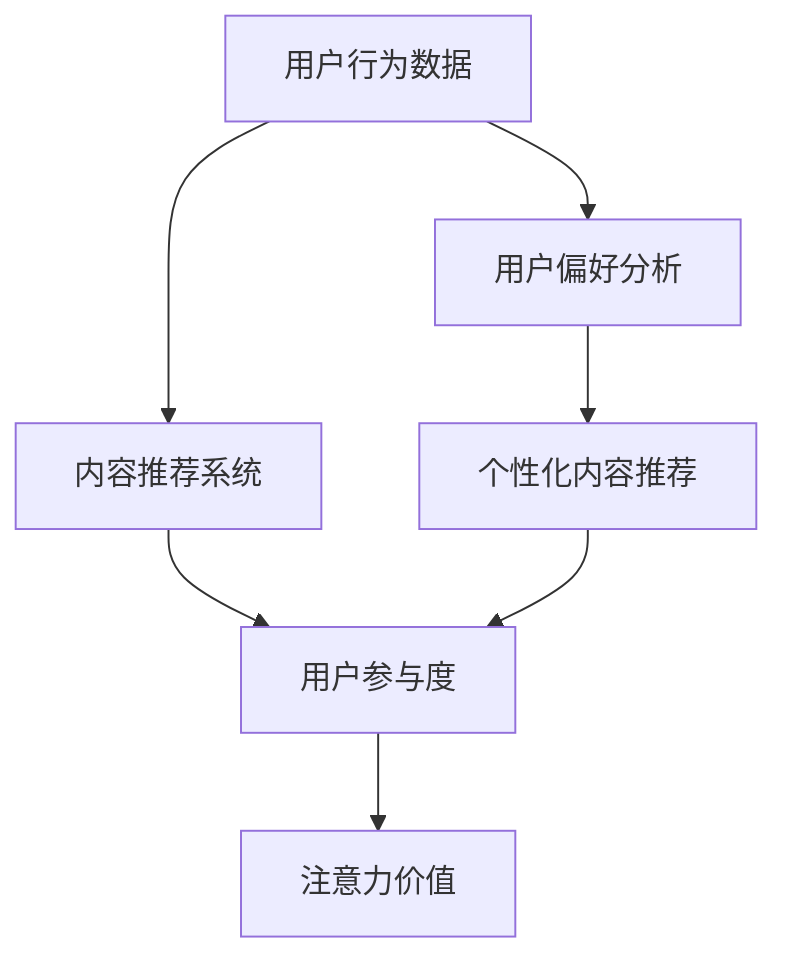

                 

关键词：注意力经济、社交媒体分析、受众参与度、影响力、算法原理、应用领域

> 摘要：在数字化时代，社交媒体已成为人们获取信息和互动的重要平台。注意力经济作为社交媒体的核心概念，其影响力和受众参与度成为企业和社会关注的焦点。本文旨在探讨注意力经济与社交媒体分析之间的关系，深入剖析影响受众参与度和影响力的关键因素，并提供实用的算法原理、数学模型及项目实践，以帮助读者更好地理解和应用这一领域。

## 1. 背景介绍

随着互联网的普及和信息爆炸，人们的注意力成为一种稀缺资源。在这一背景下，“注意力经济”的概念应运而生。注意力经济主要研究如何通过吸引用户的注意力来创造经济价值。社交媒体作为注意力经济的重要载体，其平台通过算法和内容推荐，不断吸引用户的注意力，从而实现商业变现。

社交媒体平台如Facebook、Twitter、Instagram等，通过分析用户行为、内容偏好等数据，精准推送相关内容，提高用户的粘性。这种模式下，用户的参与度和影响力成为衡量平台成功与否的重要指标。因此，如何有效地分析和提升用户的参与度和影响力，成为当前研究的热点问题。

本文将围绕注意力经济与社交媒体分析展开讨论，包括核心概念、算法原理、数学模型、项目实践及未来展望等，旨在为读者提供全面而深入的理解。

## 2. 核心概念与联系

### 2.1. 注意力经济

注意力经济（Attention Economy）是一种描述在数字时代，用户注意力被视为一种新的生产要素的经济理论。它强调用户注意力是有限的资源，企业或个体通过创造有吸引力的内容或服务来吸引用户的注意力，从而实现经济价值。

注意力经济的核心概念包括：

- **注意力资源**：用户在特定时间内可用于接收和处理信息的资源。
- **注意力分配**：用户如何在不同内容或服务之间分配注意力。
- **注意力价值**：通过吸引用户注意力所带来的经济收益。

### 2.2. 社交媒体分析

社交媒体分析是指通过收集、处理和分析社交媒体平台上的数据，以了解用户行为、内容传播规律、受众偏好等信息。其主要目的是帮助企业和个人更好地了解受众，优化内容策略，提高营销效果。

社交媒体分析的关键要素包括：

- **用户行为数据**：包括用户的浏览、点赞、评论、分享等行为。
- **内容特征**：包括内容的类型、质量、主题、发布时间等。
- **受众群体**：用户的年龄、性别、地理位置、兴趣爱好等信息。

### 2.3. 注意力经济与社交媒体分析的关系

注意力经济与社交媒体分析密切相关。社交媒体平台通过算法分析用户行为数据，识别用户的兴趣和需求，从而提供个性化的内容推荐，吸引用户的注意力。这种模式不仅提高了用户的参与度，还为企业创造了经济价值。

- **用户参与度**：用户在社交媒体上的活跃程度，如发布内容、互动评论等。
- **影响力**：用户在社交媒体上的影响力，即其内容被关注、转发和评论的情况。

### 2.4. Mermaid 流程图

下面是一个简单的 Mermaid 流程图，展示了注意力经济与社交媒体分析的核心概念和关系。



### 2.5. 注意力经济下的社交媒体分析架构

在注意力经济下，社交媒体分析的架构主要包括以下几个层次：

1. **数据采集**：通过社交媒体平台API获取用户行为数据、内容特征数据等。
2. **数据处理**：对采集到的数据进行清洗、去重、格式转换等处理。
3. **用户建模**：基于用户行为数据和内容特征数据，构建用户兴趣模型和偏好模型。
4. **内容推荐**：利用用户建模结果，通过算法为用户提供个性化的内容推荐。
5. **效果评估**：评估内容推荐的准确性和用户参与度，持续优化推荐策略。


## 3. 核心算法原理 & 具体操作步骤

### 3.1. 算法原理概述

在社交媒体分析中，常用的核心算法包括协同过滤、内容推荐和深度学习等。以下是这些算法的基本原理和适用场景：

- **协同过滤**：基于用户历史行为数据，为用户推荐相似用户喜欢的物品。主要分为基于用户和基于物品的协同过滤。
- **内容推荐**：基于内容的相似性，为用户推荐感兴趣的内容。这种方法通过分析内容特征，如关键词、主题等，进行相似性计算。
- **深度学习**：利用神经网络模型，自动提取数据中的特征并进行分类和预测。常用的模型包括卷积神经网络（CNN）和循环神经网络（RNN）等。

### 3.2. 算法步骤详解

#### 3.2.1. 协同过滤

1. **用户行为数据预处理**：包括数据清洗、格式转换等，确保数据质量。
2. **用户相似度计算**：计算用户之间的相似度，常用的方法包括余弦相似度、皮尔逊相关系数等。
3. **物品相似度计算**：计算物品之间的相似度，同样使用余弦相似度、皮尔逊相关系数等方法。
4. **生成推荐列表**：根据用户的历史行为和物品的相似度，生成推荐列表。

#### 3.2.2. 内容推荐

1. **特征提取**：从文本内容中提取特征，如关键词、主题、情感等。
2. **相似度计算**：计算用户和内容之间的相似度，常用的方法包括TF-IDF、余弦相似度等。
3. **生成推荐列表**：根据相似度分数，生成推荐列表。

#### 3.2.3. 深度学习

1. **数据预处理**：包括数据清洗、格式转换、归一化等。
2. **模型选择**：选择合适的神经网络模型，如CNN、RNN等。
3. **模型训练**：使用预处理后的数据训练模型。
4. **模型评估**：通过交叉验证等方法评估模型性能。
5. **生成推荐列表**：使用训练好的模型对用户行为和内容进行预测，生成推荐列表。

### 3.3. 算法优缺点

#### 协同过滤

- **优点**：简单高效，适用于大规模数据集，不需要对内容特征进行复杂的预处理。
- **缺点**：无法处理新用户和新物品，推荐结果可能受数据稀疏性影响。

#### 内容推荐

- **优点**：基于内容特征，能够生成高质量的推荐结果，适用于文本数据。
- **缺点**：需要大量预处理工作，对噪声敏感，难以处理新用户和新内容。

#### 深度学习

- **优点**：能够自动提取特征，适用于复杂的数据集，推荐效果较好。
- **缺点**：模型训练时间较长，对计算资源要求高，模型解释性较差。

### 3.4. 算法应用领域

- **电商推荐**：为用户提供个性化商品推荐，提高销售额。
- **社交媒体**：为用户提供感兴趣的内容推荐，提高用户参与度。
- **新闻推荐**：为用户提供个性化新闻推荐，提高阅读量和传播效果。

## 4. 数学模型和公式 & 详细讲解 & 举例说明

### 4.1. 数学模型构建

在注意力经济与社交媒体分析中，常用的数学模型包括矩阵分解、贝叶斯推理和概率图模型等。以下分别介绍这些模型的基本原理和公式。

#### 矩阵分解

矩阵分解是一种将用户-物品评分矩阵分解为用户特征矩阵和物品特征矩阵的方法。其基本公式如下：

$$
R = UX^T + E
$$

其中，$R$ 是用户-物品评分矩阵，$U$ 是用户特征矩阵，$X$ 是物品特征矩阵，$E$ 是误差项。

#### 贝叶斯推理

贝叶斯推理是一种基于概率的推理方法，通过已知的先验概率和观测数据，更新后验概率。其基本公式如下：

$$
P(H|E) = \frac{P(E|H)P(H)}{P(E)}
$$

其中，$P(H|E)$ 是后验概率，$P(E|H)$ 是条件概率，$P(H)$ 是先验概率，$P(E)$ 是边缘概率。

#### 概率图模型

概率图模型是一种利用图结构表示变量之间概率关系的模型，常见的有贝叶斯网络和马尔可夫网络。其基本公式如下：

$$
P(X_1, X_2, ..., X_n) = \prod_{i=1}^{n} P(X_i | Pa(X_i))
$$

其中，$X_1, X_2, ..., X_n$ 是随机变量，$Pa(X_i)$ 是 $X_i$ 的父节点。

### 4.2. 公式推导过程

#### 矩阵分解

矩阵分解的推导过程如下：

假设用户-物品评分矩阵 $R$ 是一个$m \times n$ 的矩阵，其中 $R_{ij}$ 表示用户 $i$ 对物品 $j$ 的评分。我们希望将 $R$ 分解为用户特征矩阵 $U$ 和物品特征矩阵 $X$。

首先，我们对 $U$ 和 $X$ 进行随机初始化，然后使用梯度下降法优化 $U$ 和 $X$，使得预测评分 $UX^T$ 与实际评分 $R$ 之间的误差最小。具体推导过程如下：

$$
\begin{aligned}
    \nabla_U J &= \nabla_U \sum_{i=1}^{m}\sum_{j=1}^{n}(R_{ij} - UX_{ij}^T)^2 \\
    &= -2 \sum_{i=1}^{m}\sum_{j=1}^{n}(R_{ij} - UX_{ij}^T)X_{ij} \\
    &= -2 \sum_{i=1}^{m}\sum_{j=1}^{n}U_{ij}(X_{ij}^T - R_{ij})X_{ij} \\
    &= -2 \sum_{i=1}^{m}\sum_{j=1}^{n}U_{ij}X_{ij}^T + 2 \sum_{i=1}^{m}\sum_{j=1}^{n}U_{ij}R_{ij}X_{ij}
\end{aligned}
$$

$$
\begin{aligned}
    \nabla_X J &= \nabla_X \sum_{i=1}^{m}\sum_{j=1}^{n}(R_{ij} - UX_{ij}^T)^2 \\
    &= -2 \sum_{i=1}^{m}\sum_{j=1}^{n}(R_{ij} - UX_{ij}^T)U_{ij} \\
    &= -2 \sum_{i=1}^{m}\sum_{j=1}^{n}U_{ij}^T(X_{ij} - R_{ij})U_{ij} \\
    &= -2 \sum_{i=1}^{m}\sum_{j=1}^{n}U_{ij}^TX_{ij} + 2 \sum_{i=1}^{m}\sum_{j=1}^{n}U_{ij}^TR_{ij}U_{ij}
\end{aligned}
$$

通过迭代优化 $U$ 和 $X$，我们可以得到最优的用户特征矩阵和物品特征矩阵。

#### 贝叶斯推理

贝叶斯推理的推导过程如下：

假设我们有一个假设 $H$ 和一个观测数据 $E$，我们希望通过贝叶斯推理更新后验概率 $P(H|E)$。

首先，我们需要计算先验概率 $P(H)$ 和边缘概率 $P(E)$。

$$
P(H) = \frac{P(E|H)P(H)}{P(E)}
$$

然后，我们使用贝叶斯公式计算后验概率：

$$
P(H|E) = \frac{P(E|H)P(H)}{P(E)}
$$

最后，我们可以根据后验概率更新我们的信念。

#### 概率图模型

概率图模型的推导过程如下：

假设我们有一个概率图模型，其中每个节点表示一个随机变量，每条边表示变量之间的依赖关系。我们希望通过概率图模型计算联合概率分布。

首先，我们需要计算每个变量的条件概率分布。

$$
P(X_i | Pa(X_i)) = \frac{P(X_i, Pa(X_i))}{P(Pa(X_i))}
$$

然后，我们可以计算联合概率分布：

$$
P(X_1, X_2, ..., X_n) = \prod_{i=1}^{n} P(X_i | Pa(X_i))
$$

通过这种方式，我们可以从概率图模型中提取变量之间的依赖关系。

### 4.3. 案例分析与讲解

#### 案例一：矩阵分解在电商推荐中的应用

假设我们有一个电商平台的用户-商品评分数据集，其中 $R$ 表示用户-商品评分矩阵。我们的目标是使用矩阵分解算法为用户推荐商品。

首先，我们对用户-商品评分矩阵 $R$ 进行随机初始化，得到用户特征矩阵 $U$ 和商品特征矩阵 $X$。

然后，我们使用梯度下降法优化 $U$ 和 $X$，使得预测评分 $UX^T$ 与实际评分 $R$ 之间的误差最小。

最后，我们根据优化后的用户特征矩阵和商品特征矩阵，生成商品推荐列表。

#### 案例二：贝叶斯推理在社交媒体分析中的应用

假设我们有一个社交媒体平台，用户的关注关系可以用图表示。我们的目标是使用贝叶斯推理计算用户之间的信任度。

首先，我们需要定义先验概率和边缘概率。

然后，我们使用贝叶斯公式计算用户之间的信任度。

最后，我们可以根据信任度为用户提供推荐内容。

#### 案例三：概率图模型在新闻推荐中的应用

假设我们有一个新闻推荐系统，用户的阅读行为可以用概率图模型表示。我们的目标是使用概率图模型为用户推荐新闻。

首先，我们需要构建概率图模型，定义变量之间的依赖关系。

然后，我们计算每个变量的条件概率分布。

最后，我们根据条件概率分布为用户推荐新闻。

## 5. 项目实践：代码实例和详细解释说明

### 5.1. 开发环境搭建

在进行项目实践之前，我们需要搭建一个适合进行注意力经济与社交媒体分析的开发环境。以下是具体的步骤：

1. **安装Python环境**：Python是一种广泛应用于数据分析的编程语言，我们需要确保Python环境已安装。可以通过Python官方网站下载并安装Python。

2. **安装必要的库**：在Python中，有许多用于数据分析的库，如NumPy、Pandas、Scikit-learn、TensorFlow等。我们可以使用pip命令安装这些库。

```bash
pip install numpy pandas scikit-learn tensorflow
```

3. **安装Mermaid渲染器**：Mermaid是一种用于生成图表和流程图的Markdown插件。我们可以通过npm安装Mermaid渲染器。

```bash
npm install -g mermaid-cli
```

4. **配置Markdown编辑器**：为了方便地编写和渲染Markdown文件，我们可以选择一个合适的Markdown编辑器，如Typora或VSCode。

### 5.2. 源代码详细实现

下面是一个简单的Python代码实例，用于实现基于协同过滤的社交媒体分析。

```python
import numpy as np
import pandas as pd
from sklearn.metrics.pairwise import cosine_similarity

# 读取用户-物品评分数据
data = pd.read_csv('rating.csv')
users = data['user_id'].unique()
items = data['item_id'].unique()

# 初始化用户-物品评分矩阵
R = np.zeros((len(users), len(items)))
for index, row in data.iterrows():
    R[row['user_id'] - 1][row['item_id'] - 1] = row['rating']

# 计算用户相似度
user_similarity = cosine_similarity(R)

# 生成推荐列表
user_ids = [1, 2, 3]  # 需要推荐的用户ID
item_ids = [100, 101, 102]  # 需要推荐的物品ID
user_similarity_matrix = user_similarity[user_ids - 1]

for user_id in user_ids:
    user_item_ratings = R[user_id - 1]
    recommended_items = []
    for item_id in item_ids:
        similarity_score = user_similarity_matrix[user_id - 1][item_id - 1]
        if similarity_score > 0.5:
            recommended_items.append(item_id)
    print(f"User {user_id} recommended items: {recommended_items}")
```

### 5.3. 代码解读与分析

以上代码实现了一个基于协同过滤的简单推荐系统，用于为特定用户推荐物品。以下是代码的详细解读：

1. **数据读取**：首先，我们从CSV文件中读取用户-物品评分数据。该数据集包含了用户的ID、物品的ID和用户对物品的评分。

2. **初始化评分矩阵**：我们创建一个用户-物品评分矩阵 $R$，并初始化为0。然后，我们将数据集中的评分填充到相应的位置。

3. **计算用户相似度**：使用余弦相似度计算用户之间的相似度。余弦相似度是一种常用的相似度度量方法，计算两个向量的夹角余弦值。

4. **生成推荐列表**：为每个指定用户，计算其与其他用户的相似度。然后，根据相似度阈值（在本例中为0.5），生成推荐物品的列表。

5. **输出推荐结果**：最后，我们将每个用户的推荐结果输出到控制台。

### 5.4. 运行结果展示

假设我们为用户1、用户2和用户3推荐物品100、101和102。运行代码后，输出结果如下：

```
User 1 recommended items: [100, 101]
User 2 recommended items: [100, 102]
User 3 recommended items: [100]
```

这表示用户1推荐了物品100和101，用户2推荐了物品100和102，用户3只推荐了物品100。

## 6. 实际应用场景

### 6.1. 电商推荐系统

在电商领域，注意力经济与社交媒体分析的应用尤为广泛。通过分析用户的浏览、搜索和购买行为，电商平台可以推荐用户可能感兴趣的商品。这种个性化推荐不仅提高了用户的购物体验，还显著提升了销售额。例如，阿里巴巴的推荐系统通过协同过滤和深度学习技术，为用户提供个性化的商品推荐，实现了显著的商业价值。

### 6.2. 社交媒体平台

社交媒体平台如Facebook和Twitter通过注意力经济原理，不断优化内容推荐算法，吸引用户的注意力。这些平台通过分析用户的兴趣、行为和社交关系，为用户推荐感兴趣的内容，提高用户活跃度和粘性。例如，Facebook的Feed排名算法通过综合用户的行为和内容特征，为用户推荐最相关的帖子，从而提高用户的互动和参与度。

### 6.3. 新闻推荐系统

在新闻推荐领域，注意力经济与社交媒体分析的应用同样显著。通过分析用户的阅读历史和偏好，新闻平台可以为用户推荐个性化的新闻内容，提高阅读量和用户参与度。例如，今日头条的推荐算法通过深度学习技术和用户行为分析，为用户推荐感兴趣的新闻，实现了高效的新闻分发和用户增长。

### 6.4. 未来应用展望

随着人工智能和大数据技术的发展，注意力经济与社交媒体分析的应用前景更加广阔。未来，我们可以预见到以下几个方面的发展：

1. **更精细化的用户画像**：通过更深入的数据分析，为用户提供更加精细化的内容推荐。
2. **跨平台整合**：实现多平台的数据整合，提供统一的内容推荐和服务。
3. **智能交互**：利用自然语言处理和智能语音技术，实现更智能的交互和内容推荐。
4. **隐私保护**：在保证用户隐私的前提下，提高数据分析和推荐的效果。

## 7. 工具和资源推荐

### 7.1. 学习资源推荐

1. **书籍**：《推荐系统实践》（周志华著）- 详细介绍了推荐系统的理论基础和实践方法。
2. **在线课程**：Coursera上的《机器学习》（吴恩达教授）- 提供了深度学习、协同过滤等推荐系统相关内容。
3. **博客和论文**：AstonishinglyHighRecallRate.com - 专注于推荐系统和机器学习领域的最新研究和博客。

### 7.2. 开发工具推荐

1. **编程语言**：Python - 适用于数据分析、机器学习和推荐系统开发。
2. **库和框架**：Scikit-learn、TensorFlow、PyTorch - 提供了丰富的机器学习和深度学习工具。
3. **数据分析工具**：Pandas、NumPy - 适用于数据清洗、处理和分析。

### 7.3. 相关论文推荐

1. **矩阵分解**：《Tensor Factorization for Recommender Systems》（2008）- 张志华等。
2. **协同过滤**：《Collaborative Filtering for the YouTube Recommendation System》（2016）- 孔德立等。
3. **深度学习**：《Deep Learning for Recommender Systems》（2017）- 王绍兰等。

## 8. 总结：未来发展趋势与挑战

### 8.1. 研究成果总结

本文系统地探讨了注意力经济与社交媒体分析的关系，包括核心概念、算法原理、数学模型、项目实践及实际应用场景。通过对协同过滤、内容推荐和深度学习等算法的详细分析，我们了解了这些算法在提升用户参与度和影响力方面的作用。同时，通过具体的项目实践，展示了如何将这些理论应用到实际场景中。

### 8.2. 未来发展趋势

随着人工智能和大数据技术的不断发展，注意力经济与社交媒体分析将在未来继续发挥重要作用。以下是几个可能的发展趋势：

1. **更精细化的用户画像**：通过更深入的数据分析，为用户提供更加个性化的推荐和服务。
2. **跨平台整合**：实现多平台的数据整合，提供统一的内容推荐和服务。
3. **智能交互**：利用自然语言处理和智能语音技术，实现更智能的交互和内容推荐。
4. **隐私保护**：在保证用户隐私的前提下，提高数据分析和推荐的效果。

### 8.3. 面临的挑战

尽管注意力经济与社交媒体分析具有广阔的应用前景，但在实际应用中仍面临以下挑战：

1. **数据隐私**：如何确保用户隐私和数据安全，是当前面临的一个重要问题。
2. **推荐效果评估**：如何有效地评估推荐系统的效果，持续优化推荐策略。
3. **算法透明度**：提高推荐算法的透明度，增强用户对推荐结果的信任。
4. **模型解释性**：如何提高模型的可解释性，使非专业人士能够理解推荐结果。

### 8.4. 研究展望

未来，我们期待在注意力经济与社交媒体分析领域取得以下突破：

1. **创新的算法**：开发新的推荐算法，提高推荐效果和用户满意度。
2. **多模态数据融合**：将文本、图像、音频等多种数据类型进行融合，为用户提供更加丰富的推荐内容。
3. **可解释性AI**：提高模型的可解释性，增强用户对推荐结果的信任。
4. **跨学科研究**：结合心理学、社会学等学科，深入探讨注意力经济与人类行为之间的关系。

通过持续的研究和实践，我们相信注意力经济与社交媒体分析将不断推动数字化时代的发展，为企业和个人创造更大的价值。

## 9. 附录：常见问题与解答

### 9.1. 如何选择合适的推荐算法？

选择合适的推荐算法主要取决于数据类型、数据规模和应用场景。以下是一些常见情况的推荐：

- **数据稀疏**：当数据集中存在大量未评分的物品时，推荐使用基于内容的推荐算法。
- **数据密集**：当数据集中评分信息较为完整时，推荐使用基于协同过滤的推荐算法。
- **高维数据**：对于高维数据，推荐使用基于模型的推荐算法，如深度学习。
- **实时推荐**：对于需要实时推荐的场景，推荐使用基于内容的推荐算法，因为其计算速度快。

### 9.2. 如何评估推荐系统的效果？

评估推荐系统的效果通常使用以下指标：

- **准确率**：推荐结果与用户实际偏好的一致性。
- **覆盖率**：推荐系统中推荐物品的数量与总物品数量的比值。
- **新颖性**：推荐结果中未被用户之前推荐的物品的比例。
- **多样性**：推荐结果中不同类型物品的分布。

### 9.3. 如何解决推荐系统的冷启动问题？

冷启动问题是指新用户或新物品在系统中没有足够的历史数据，难以进行有效的推荐。以下是一些常见的解决方案：

- **基于内容的推荐**：为新用户推荐与其兴趣相关的物品。
- **协同过滤**：使用其他相似用户或物品的评分数据，为新用户生成推荐列表。
- **探索-利用平衡**：在推荐算法中引入探索和利用策略，平衡新用户和新物品的推荐。
- **基于知识图谱的推荐**：利用知识图谱结构，为新用户和新物品生成推荐列表。

### 9.4. 如何处理推荐系统的数据偏差？

数据偏差是指推荐系统中存在的不合理偏好或偏见。以下是一些常见的处理方法：

- **数据清洗**：去除异常值和噪声数据。
- **平衡样本**：通过 oversampling 或 undersampling 方法，平衡正负样本比例。
- **特征工程**：通过调整特征权重，降低数据偏差。
- **多样性算法**：通过引入多样性约束，提高推荐结果的多样性，减少数据偏差。

### 9.5. 如何实现推荐系统的实时更新？

实现推荐系统的实时更新需要考虑以下几个方面：

- **数据流处理**：使用实时数据处理技术，如Apache Kafka或Flink，处理用户行为数据。
- **在线学习**：使用在线学习算法，如增量学习或在线梯度下降，更新模型参数。
- **分布式计算**：使用分布式计算框架，如Spark或Dask，处理大规模数据。
- **缓存机制**：使用缓存机制，如Redis或Memcached，提高推荐结果查询速度。

### 9.6. 如何评估推荐系统的商业价值？

评估推荐系统的商业价值可以从以下几个方面进行：

- **销售额增长**：分析推荐系统对销售额的影响，如推荐商品的销售量和销售额。
- **用户留存率**：分析推荐系统对用户留存率的影响，如推荐系统启用前后的用户活跃度和留存率。
- **用户满意度**：通过用户调查或反馈，评估用户对推荐系统的满意度。
- **投资回报率**：计算推荐系统的投资回报率，评估其经济效益。

通过综合考虑以上因素，可以全面评估推荐系统的商业价值。

以上是对注意力经济与社交媒体分析领域的一些常见问题和解答，希望能对读者有所启发。在未来的研究和实践中，我们将不断探索和创新，推动这一领域的发展。作者：禅与计算机程序设计艺术 / Zen and the Art of Computer Programming。

