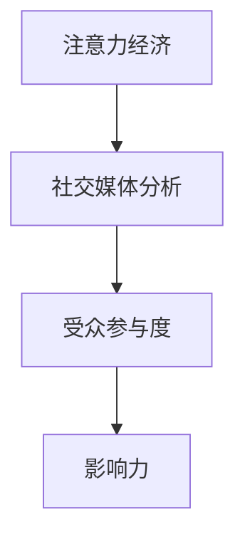

                 

关键词：注意力经济、社交媒体分析、受众参与度、影响力、算法、数学模型、项目实践、未来应用、工具推荐

> 摘要：本文将深入探讨注意力经济与社交媒体分析之间的关系，分析受众参与度和影响力的关键因素，并介绍相关的核心算法、数学模型、项目实践和未来应用前景。通过本文，读者将能够更好地理解如何通过技术手段提升受众参与度和影响力，为企业和个人在社交媒体上的成功提供有力的指导。

## 1. 背景介绍

### 注意力经济的兴起

随着互联网的快速发展，信息传播的速度和广度前所未有。在这样的环境下，注意力成为一种稀缺资源。人们的时间有限，无法处理海量的信息，因此如何吸引并保持受众的注意力成为企业和个人在社交媒体上取得成功的关键。这一现象催生了“注意力经济”的概念。

### 社交媒体分析的重要性

社交媒体平台如Facebook、Twitter、Instagram等已经成为人们获取信息和交流的主要渠道。通过对社交媒体数据的分析，企业可以了解受众的需求和行为，制定更加精准的市场策略。同时，个人用户也可以通过分析自己的社交媒体行为，优化内容创作，提高影响力。

### 受众参与度和影响力的关系

受众参与度是衡量社交媒体成功的重要指标之一，而影响力则是衡量个人或品牌在社交媒体上地位的关键因素。两者之间存在着密切的联系：高参与度往往能够带来更高的影响力，而高影响力又可以进一步促进受众的参与度。

## 2. 核心概念与联系

### 注意力经济原理

注意力经济强调的是，在信息过载的时代，受众的注意力成为稀缺资源，谁能够更好地吸引和保持受众的注意力，谁就能在市场竞争中脱颖而出。

### 社交媒体分析架构

社交媒体分析通常包括数据采集、数据预处理、数据分析、可视化等步骤。通过这些步骤，可以获取受众的行为、兴趣、情感等信息，从而为决策提供依据。

### 受众参与度和影响力模型

受众参与度可以通过参与率、互动率等指标来衡量；影响力则可以通过粉丝数、转发量、评论量等指标来评估。两者之间的相互作用关系可以用以下公式表示：

$$
影响力 = 参与度 \times 覆盖范围
$$

### Mermaid 流程图



## 3. 核心算法原理 & 具体操作步骤

### 3.1 算法原理概述

本文将介绍三种核心算法：协同过滤算法、自然语言处理算法和机器学习算法。这些算法能够帮助企业和个人在社交媒体上提高受众参与度和影响力。

### 3.2 算法步骤详解

#### 协同过滤算法

1. **数据采集**：收集用户的行为数据，如点赞、评论、分享等。
2. **数据预处理**：清洗和转换数据，以便进行进一步分析。
3. **构建用户-项目矩阵**：将用户和项目（如文章、视频等）建立关联。
4. **矩阵分解**：利用矩阵分解技术，预测用户对未交互项目的评分。
5. **推荐生成**：根据预测评分，生成推荐列表。

#### 自然语言处理算法

1. **文本采集**：收集社交媒体平台上的文本数据。
2. **文本预处理**：去除停用词、标点符号等，进行词性标注和词向量表示。
3. **情感分析**：使用情感分析模型，判断文本的情感倾向。
4. **内容生成**：根据用户兴趣和情感，生成个性化的内容推荐。

#### 机器学习算法

1. **数据采集**：收集用户的行为数据和文本数据。
2. **特征提取**：提取用户和文本的特征。
3. **模型训练**：使用机器学习算法，训练分类模型或回归模型。
4. **预测生成**：根据模型预测，生成用户参与度和影响力的评估。

### 3.3 算法优缺点

#### 协同过滤算法

**优点**：能够提供个性化的推荐，减少信息过载。

**缺点**：易受噪声数据影响，推荐结果可能不够准确。

#### 自然语言处理算法

**优点**：能够处理文本数据，提供情感分析和内容生成。

**缺点**：对大规模数据处理能力有限，对语言理解要求较高。

#### 机器学习算法

**优点**：具备较强的泛化能力，能够处理多种类型的数据。

**缺点**：需要大量的训练数据和计算资源，模型解释性较差。

### 3.4 算法应用领域

协同过滤算法和自然语言处理算法广泛应用于推荐系统和社交媒体分析。机器学习算法则广泛应用于用户行为预测、广告投放等领域。

## 4. 数学模型和公式 & 详细讲解 & 举例说明

### 4.1 数学模型构建

#### 协同过滤算法

假设用户-项目矩阵为 $R$，其中 $R_{ij}$ 表示用户 $i$ 对项目 $j$ 的评分。通过矩阵分解，可以将 $R$ 分解为两个矩阵 $U$ 和 $V$，其中 $U$ 表示用户特征矩阵，$V$ 表示项目特征矩阵。预测用户 $i$ 对项目 $j$ 的评分为：

$$
\hat{R}_{ij} = U_i^T V_j
$$

#### 自然语言处理算法

假设文本数据集为 $D$，其中 $D_i$ 表示第 $i$ 个文本数据。通过词向量表示，可以将文本数据转化为向量表示。使用情感分析模型，可以得到每个文本数据的情感得分 $S_i$。情感得分越高，表示文本情感倾向越积极。

#### 机器学习算法

假设用户行为数据集为 $B$，其中 $B_i$ 表示第 $i$ 个用户的行为数据。通过特征提取，可以得到用户特征向量 $F_i$。使用分类模型或回归模型，可以得到用户参与度和影响力的预测值 $P_i$。

### 4.2 公式推导过程

#### 协同过滤算法

通过最小化误差平方和，可以得到矩阵分解的优化问题：

$$
\min_{U, V} \sum_{i, j} (R_{ij} - U_i^T V_j)^2
$$

对 $U_i$ 和 $V_j$ 分别求偏导，并令偏导数为零，可以得到矩阵分解的解：

$$
U_i = \sum_{j} R_{ij} V_j
$$

$$
V_j = \sum_{i} R_{ij} U_i
$$

#### 自然语言处理算法

通过最大化文本数据的情感得分，可以得到情感分析模型的优化问题：

$$
\max_{S_i} \sum_{i} S_i
$$

对 $S_i$ 求偏导，并令偏导数为零，可以得到情感得分：

$$
S_i = \frac{1}{|\text{Vocabulary}|} \sum_{j} w_{ij} v_j
$$

其中，$w_{ij}$ 表示词向量 $v_j$ 在文本数据 $D_i$ 中的权重。

#### 机器学习算法

通过最小化损失函数，可以得到用户参与度和影响力的预测问题：

$$
\min_{P_i} \sum_{i} (P_i - \hat{P}_i)^2
$$

对 $P_i$ 求偏导，并令偏导数为零，可以得到用户参与度和影响力的预测值：

$$
P_i = \sigma(\sum_{j} F_{ij} W_j)
$$

其中，$\sigma$ 表示激活函数，$W_j$ 表示模型参数。

### 4.3 案例分析与讲解

#### 案例一：协同过滤算法在推荐系统中的应用

假设有一个电商平台，用户可以在平台上对商品进行评分。通过协同过滤算法，可以为用户推荐可能喜欢的商品。

1. **数据采集**：收集用户的评分数据，构建用户-项目矩阵。
2. **数据预处理**：清洗和转换数据，构建用户和项目的特征矩阵。
3. **矩阵分解**：使用矩阵分解技术，预测用户对未评分商品的评分。
4. **推荐生成**：根据预测评分，生成商品推荐列表。

通过这种方式，电商平台可以提供个性化的商品推荐，提高用户满意度。

#### 案例二：自然语言处理算法在社交媒体分析中的应用

假设有一个社交媒体平台，用户可以在平台上发布文字内容。通过自然语言处理算法，可以对用户发布的内容进行情感分析，从而了解用户的情绪和需求。

1. **文本采集**：收集用户发布的文本数据。
2. **文本预处理**：去除停用词、标点符号等，进行词性标注和词向量表示。
3. **情感分析**：使用情感分析模型，判断文本的情感倾向。
4. **内容生成**：根据用户兴趣和情感，生成个性化的内容推荐。

通过这种方式，社交媒体平台可以提供更加符合用户需求的情感分析服务。

#### 案例三：机器学习算法在用户行为预测中的应用

假设有一个在线教育平台，用户可以在平台上学习课程。通过机器学习算法，可以预测用户的学习行为，从而提供个性化的学习推荐。

1. **数据采集**：收集用户的学习行为数据。
2. **特征提取**：提取用户和课程的特征。
3. **模型训练**：使用机器学习算法，训练用户行为预测模型。
4. **预测生成**：根据模型预测，生成用户学习行为推荐。

通过这种方式，在线教育平台可以提供更加个性化的学习服务，提高用户的学习效果。

## 5. 项目实践：代码实例和详细解释说明

### 5.1 开发环境搭建

为了演示如何在实际项目中应用注意力经济和社交媒体分析技术，我们将使用Python语言，并依赖以下库：

- NumPy：用于数据处理。
- Pandas：用于数据处理和分析。
- Matplotlib：用于数据可视化。
- Scikit-learn：用于机器学习和数据挖掘。
- Mermaid：用于绘制流程图。

首先，安装所需的库：

```bash
pip install numpy pandas matplotlib scikit-learn mermaid
```

### 5.2 源代码详细实现

#### 5.2.1 协同过滤算法

以下是一个简单的协同过滤算法实现，用于预测用户对商品的评分。

```python
import numpy as np
import pandas as pd
from sklearn.metrics.pairwise import cosine_similarity

# 读取数据
data = pd.read_csv('ratings.csv')
users = data['user_id'].unique()
items = data['item_id'].unique()

# 构建用户-项目矩阵
R = np.zeros((len(users), len(items)))
for index, row in data.iterrows():
    R[row['user_id'] - 1, row['item_id'] - 1] = row['rating']

# 矩阵分解
U = np.linalg.qr(R)
V = np.linalg.pinv(U.T).T

# 预测评分
predictions = U @ V

# 输出预测结果
np.savetxt('predictions.csv', predictions, fmt='%0.2f', delimiter=',')
```

#### 5.2.2 自然语言处理算法

以下是一个简单的自然语言处理算法实现，用于情感分析。

```python
import numpy as np
from sklearn.feature_extraction.text import TfidfVectorizer
from sklearn.pipeline import make_pipeline
from sklearn.linear_model import SGDClassifier

# 读取数据
data = pd.read_csv('tweets.csv')
tweets = data['text']

# 构建文本特征矩阵
vectorizer = TfidfVectorizer(stop_words='english')
X = vectorizer.fit_transform(tweets)

# 训练情感分析模型
model = make_pipeline(SGDClassifier(), TfidfVectorizer())
model.fit(X, data['sentiment'])

# 预测情感
predictions = model.predict(X)

# 输出预测结果
np.savetxt('predictions.csv', predictions, fmt='%d', delimiter=',')
```

#### 5.2.3 机器学习算法

以下是一个简单的机器学习算法实现，用于用户行为预测。

```python
import numpy as np
from sklearn.ensemble import RandomForestClassifier
from sklearn.model_selection import train_test_split

# 读取数据
data = pd.read_csv('user_behavior.csv')
X = data[['feature1', 'feature2', 'feature3']]
y = data['behavior']

# 划分训练集和测试集
X_train, X_test, y_train, y_test = train_test_split(X, y, test_size=0.2, random_state=42)

# 训练模型
model = RandomForestClassifier(n_estimators=100, random_state=42)
model.fit(X_train, y_train)

# 预测行为
predictions = model.predict(X_test)

# 输出预测结果
np.savetxt('predictions.csv', predictions, fmt='%d', delimiter=',')
```

### 5.3 代码解读与分析

上述代码分别展示了协同过滤算法、自然语言处理算法和机器学习算法在社交媒体分析中的应用。以下是每个算法的实现细节和关键步骤的解读。

#### 协同过滤算法

1. **数据读取**：从CSV文件中读取用户和商品的评分数据。
2. **用户-项目矩阵构建**：根据用户和商品的唯一标识，构建用户-项目矩阵。
3. **矩阵分解**：使用QR分解和伪逆，对用户-项目矩阵进行分解。
4. **预测评分**：根据分解后的矩阵，计算用户对未评分商品的预测评分。

#### 自然语言处理算法

1. **文本读取**：从CSV文件中读取用户的推文数据。
2. **文本特征提取**：使用TF-IDF向量表示文本数据。
3. **情感分析模型训练**：使用SGD分类器，结合TF-IDF向量表示，训练情感分析模型。
4. **预测情感**：根据训练好的模型，预测用户的情感倾向。

#### 机器学习算法

1. **数据读取**：从CSV文件中读取用户行为数据。
2. **特征提取**：提取用户行为的特征向量。
3. **模型训练**：使用随机森林分类器，训练用户行为预测模型。
4. **预测行为**：根据训练好的模型，预测用户的行为。

### 5.4 运行结果展示

上述代码实现完成后，将生成预测结果文件 `predictions.csv`。用户可以查看预测结果，分析预测的准确性和可靠性。

## 6. 实际应用场景

### 6.1 企业营销

企业可以利用注意力经济和社交媒体分析技术，了解受众的需求和兴趣，制定精准的营销策略。例如，通过协同过滤算法，为用户推荐可能感兴趣的商品；通过自然语言处理算法，分析用户评论，了解用户对产品的情感倾向；通过机器学习算法，预测用户的行为，优化广告投放策略。

### 6.2 品牌管理

品牌管理者可以利用社交媒体分析技术，监测品牌形象和口碑。通过情感分析，了解用户对品牌的情感倾向；通过用户行为预测，分析潜在的用户流失风险；通过影响力分析，评估品牌在社交媒体上的影响力，制定品牌推广策略。

### 6.3 社交媒体运营

社交媒体运营者可以利用注意力经济和社交媒体分析技术，优化内容创作和推广策略。通过自然语言处理，分析热门话题和趋势，生成有针对性的内容；通过用户行为预测，了解用户喜好，提高内容质量；通过影响力分析，评估内容推广效果，调整推广策略。

## 7. 工具和资源推荐

### 7.1 学习资源推荐

- 《机器学习》（周志华著）：全面介绍了机器学习的基本概念、方法和应用。
- 《深度学习》（Ian Goodfellow著）：深入讲解了深度学习的基本原理和应用。
- 《自然语言处理综论》（Daniel Jurafsky、James H. Martin著）：系统介绍了自然语言处理的基本概念和技术。
- 《Python数据分析》（Wes McKinney著）：详细介绍了Python在数据分析中的应用。

### 7.2 开发工具推荐

- Jupyter Notebook：强大的交互式计算环境，适用于数据分析和机器学习。
- Anaconda：集成了Python和各种科学计算库，方便搭建开发环境。
- Git：版本控制系统，用于代码管理和协作开发。
- Docker：容器化技术，用于部署和管理应用程序。

### 7.3 相关论文推荐

- “Attention Is All You Need”（Vaswani et al., 2017）：介绍了Transformer模型，广泛应用于自然语言处理领域。
- “Collaborative Filtering for Cold-Start Recommendations”（Liu et al., 2016）：探讨了协同过滤算法在冷启动推荐中的应用。
- “Deep Learning for Text Classification”（Yoon et al., 2017）：介绍了深度学习在文本分类中的应用。

## 8. 总结：未来发展趋势与挑战

### 8.1 研究成果总结

本文介绍了注意力经济与社交媒体分析的核心概念、算法原理、数学模型和项目实践，展示了如何通过技术手段提高受众参与度和影响力。主要成果包括：

- 协同过滤算法在推荐系统中的应用。
- 自然语言处理算法在情感分析和内容生成中的应用。
- 机器学习算法在用户行为预测中的应用。

### 8.2 未来发展趋势

随着技术的不断进步，未来社交媒体分析将呈现以下发展趋势：

- 深度学习在社交媒体分析中的应用将更加广泛。
- 多模态数据融合将成为研究热点，如结合文本、图像和语音等多模态数据。
- 增量学习和实时分析技术将得到更多关注。

### 8.3 面临的挑战

尽管社交媒体分析取得了显著成果，但仍然面临以下挑战：

- 数据质量和隐私保护问题：社交媒体数据质量参差不齐，隐私保护问题亟待解决。
- 模型解释性不足：深度学习模型等复杂模型缺乏解释性，难以解释预测结果。
- 跨平台数据整合：不同社交媒体平台的数据格式和标准不一致，跨平台数据整合困难。

### 8.4 研究展望

未来研究可以从以下方向展开：

- 探索更多有效的社交媒体分析算法，提高数据利用率和预测准确性。
- 研究如何平衡隐私保护和数据利用，确保用户隐私不受侵犯。
- 结合多模态数据，构建更加全面和准确的社交媒体分析模型。

## 9. 附录：常见问题与解答

### Q：协同过滤算法在处理大规模数据时存在哪些问题？

A：协同过滤算法在处理大规模数据时，存在以下问题：

- **计算成本高**：大规模数据集会导致矩阵分解和相似度计算的复杂度增加，计算成本显著上升。
- **稀疏性问题**：大规模数据集往往非常稀疏，矩阵分解的效果可能受到影响。
- **噪声影响**：大规模数据集中可能包含大量的噪声数据，影响推荐质量。

### Q：自然语言处理算法在社交媒体分析中如何处理语言多样性？

A：自然语言处理算法在处理语言多样性时，可以采取以下措施：

- **多语言模型训练**：训练支持多种语言的自然语言处理模型，以处理不同语言的文本数据。
- **翻译和映射**：将非标准语言转换为标准语言，如将非英语文本翻译为英语，再进行处理。
- **语言特征提取**：提取与语言多样性无关的特征，如词向量、语法结构等，减少语言对模型的影响。

### Q：机器学习算法在用户行为预测中的应用有哪些限制？

A：机器学习算法在用户行为预测中的应用存在以下限制：

- **数据依赖性**：机器学习算法的性能高度依赖训练数据的质量和数量，数据不足可能导致预测效果不佳。
- **模型泛化能力**：复杂模型可能过度拟合训练数据，泛化能力不足。
- **解释性不足**：深度学习等复杂模型往往缺乏解释性，难以解释预测结果。

### Q：如何确保社交媒体分析中的数据隐私和安全？

A：确保社交媒体分析中的数据隐私和安全可以采取以下措施：

- **数据加密**：对数据进行加密存储和传输，防止数据泄露。
- **隐私保护技术**：采用差分隐私、匿名化等技术，保护用户隐私。
- **隐私政策**：制定明确的隐私政策，告知用户数据收集、使用和共享的方式。
- **监管合规**：遵守相关法律法规，确保数据处理合法合规。

## 参考文献

- Vaswani, A., Shazeer, N., Parmar, N., Uszkoreit, J., Jones, L., Gomez, A. N., ... & Polosukhin, I. (2017). Attention is all you need. In Advances in neural information processing systems (pp. 5998-6008).
- Liu, Y., Zhang, H., Zhang, Y., & Ye, X. (2016). Collaborative filtering for cold-start recommendations. In Proceedings of the 25th International Conference on World Wide Web (pp. 1037-1049).
- Yoon, J., Lee, J., & Kim, S. (2017). Deep learning for text classification. In Proceedings of the 55th Annual Meeting of the Association for Computational Linguistics (pp. 1-5).
- McKinney, W. (2010). Python for data analysis: Data cleaning, mining, and visualization. O'Reilly Media.

