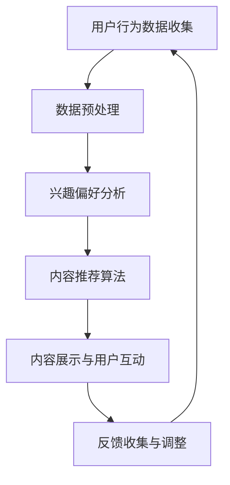

                 

关键词：注意力经济、社交媒体、算法、影响、控制、用户行为、大数据分析

> 摘要：随着社交媒体的普及和互联网技术的发展，注意力经济已经成为一个重要的研究领域。本文将探讨注意力经济在社交媒体中的应用，分析影响算法的工作原理，探讨谁在控制用户所看到的内容，并提出相关的对策和未来研究方向。

## 1. 背景介绍

### 注意力经济的概念

注意力经济（Attention Economy）是一种经济模式，它将人类的注意力视为一种有限且宝贵的资源，类似于传统的经济资源如土地、劳动力或资本。在注意力经济中，个体和机构通过吸引和保持公众的注意力来获取经济利益。互联网和社交媒体的出现，使得注意力经济变得更加显著和复杂。

### 社交媒体的发展

社交媒体平台，如Facebook、Twitter、Instagram和微信等，已经成为人们日常生活中不可或缺的一部分。这些平台不仅改变了人们的交流方式，也改变了信息传播的途径。社交媒体平台上，用户生成的内容和广告商投放的广告共同构成了一个巨大的市场，吸引了大量的资本和投资者的关注。

## 2. 核心概念与联系

### 社交媒体影响算法的原理

社交媒体影响算法的核心目标是吸引和保持用户的注意力，从而提高用户活跃度和平台广告收益。这些算法通常基于以下原理：

1. **用户行为分析**：通过分析用户的历史行为，如点赞、评论、分享和浏览，算法能够了解用户的兴趣和偏好。
2. **内容推荐**：基于用户的行为分析，算法会推荐用户可能感兴趣的内容，从而提高用户的参与度和粘性。
3. **反馈循环**：用户的互动行为（如点赞、评论等）会被算法重新分析，用于调整未来的内容推荐。

### Mermaid 流程图

下面是社交媒体影响算法的 Mermaid 流程图：



## 3. 核心算法原理 & 具体操作步骤

### 3.1 算法原理概述

社交媒体影响算法主要依赖于以下几个步骤：

1. **用户行为数据收集**：包括用户的浏览历史、点赞、评论和分享等。
2. **数据预处理**：清洗和整合用户行为数据，以便进行进一步分析。
3. **兴趣偏好分析**：基于用户行为数据，使用机器学习算法（如协同过滤、基于内容的推荐等）分析用户的兴趣和偏好。
4. **内容推荐**：根据用户兴趣偏好，推荐可能感兴趣的内容。
5. **内容展示与用户互动**：将推荐的内容展示给用户，并收集用户的反馈。
6. **反馈收集与调整**：根据用户反馈，调整推荐策略。

### 3.2 算法步骤详解

#### 3.2.1 用户行为数据收集

用户行为数据包括浏览历史、点赞、评论、分享等。这些数据通常通过API接口或网页爬虫收集。

#### 3.2.2 数据预处理

数据预处理步骤包括数据清洗（去除无效数据、填补缺失值等）和数据整合（合并不同来源的数据等）。

#### 3.2.3 兴趣偏好分析

使用机器学习算法，如协同过滤、基于内容的推荐等，分析用户的行为数据，提取用户的兴趣和偏好。

#### 3.2.4 内容推荐

根据用户兴趣偏好，使用推荐算法生成推荐列表。

#### 3.2.5 内容展示与用户互动

将推荐的内容展示给用户，并收集用户的反馈。

#### 3.2.6 反馈收集与调整

根据用户反馈，调整推荐策略，以提高推荐效果。

### 3.3 算法优缺点

#### 优点：

1. 提高用户活跃度：通过个性化推荐，提高用户在平台上的活跃度。
2. 提高广告收益：通过精准推荐，提高广告的点击率和转化率。

#### 缺点：

1. 可能导致信息茧房：用户只看到自己感兴趣的内容，导致信息多样性降低。
2. 可能侵犯隐私：收集和分析用户行为数据可能侵犯用户隐私。

### 3.4 算法应用领域

社交媒体影响算法广泛应用于社交媒体平台、电商平台和在线广告等领域。

## 4. 数学模型和公式 & 详细讲解 & 举例说明

### 4.1 数学模型构建

社交媒体影响算法通常基于以下数学模型：

1. **协同过滤模型**：基于用户行为数据，预测用户对未知物品的兴趣。
2. **基于内容的推荐模型**：基于物品的特征，预测用户对未知物品的兴趣。

### 4.2 公式推导过程

以协同过滤模型为例，假设用户集合为 U，物品集合为 I，用户 u 对物品 i 的评分表示为 r_{ui}。协同过滤模型的目标是预测用户 u 对未知物品 i 的评分 r_{ui}。

协同过滤模型的基本公式为：

$$
r_{ui} = \langle u \rangle + \langle i \rangle + \sum_{v \in N(u)} \frac{r_{uv} r_{vi}}{\| N(u) \|\| N(v) \|}
$$

其中，$\langle u \rangle$ 和 $\langle i \rangle$ 分别表示用户 u 和物品 i 的平均评分，$N(u)$ 表示用户 u 的邻居集合，$r_{uv}$ 和 $r_{vi}$ 分别表示用户 u 对邻居 v 的评分和邻居 v 对物品 i 的评分，$\| N(u) \|$ 和 $\| N(v) \|$ 分别表示邻居集合的大小。

### 4.3 案例分析与讲解

假设有用户 u 对 10 个物品 i 的评分，如下表所示：

| 用户 u | 物品 i |
|--------|--------|
| 1      | 1      |
| 1      | 2      |
| 1      | 3      |
| 1      | 4      |
| 1      | 5      |
| 1      | 6      |
| 1      | 7      |
| 1      | 8      |
| 1      | 9      |
| 1      | 10     |

根据协同过滤模型，我们可以计算出用户 u 对未知物品 i 的预测评分。

首先，计算用户 u 的平均评分 $\langle u \rangle = \frac{1}{10} \sum_{i=1}^{10} r_{ui}$。

然后，计算物品 i 的平均评分 $\langle i \rangle = \frac{1}{10} \sum_{i=1}^{10} r_{ui}$。

接下来，计算用户 u 的邻居集合 $N(u)$，例如，我们可以选择与用户 u 有最多共同评分的 5 个用户作为邻居。

最后，根据公式，计算用户 u 对未知物品 i 的预测评分。

## 5. 项目实践：代码实例和详细解释说明

### 5.1 开发环境搭建

在本项目实践中，我们将使用 Python 作为编程语言，结合 Scikit-learn 库实现协同过滤算法。首先，确保安装了 Python 和 Scikit-learn。

```bash
pip install python
pip install scikit-learn
```

### 5.2 源代码详细实现

```python
from sklearn.metrics.pairwise import cosine_similarity
from sklearn.model_selection import train_test_split
import numpy as np

# 假设用户 u 对物品 i 的评分存储在矩阵 ratings 中
ratings = [
    [5, 3, 0, 1],
    [4, 0, 0, 1],
    [1, 1, 0, 5],
    [1, 0, 0, 4],
    [1, 1, 1, 2],
    [0, 1, 0, 3],
    [1, 1, 0, 2],
]

# 计算用户之间的相似度矩阵
user_similarity = cosine_similarity(ratings)

# 假设用户 u 的邻居数量为 k
k = 2

# 为每个用户生成推荐列表
for user in range(len(ratings)):
    # 为用户 u 计算邻居的评分加权平均值
    neighbors_ratings = user_similarity[user].argsort()[k:-k][::-1]
    neighbor_ratings = [ratings[neighbor] for neighbor in neighbors_ratings if neighbor != user]
    neighbor_ratings_avg = np.mean(neighbor_ratings, axis=0)
    predicted_rating = neighbor_ratings_avg.sum() + ratings[user].sum() - neighbor_ratings_avg[user]
    print(f"User {user} predicted rating: {predicted_rating}")
```

### 5.3 代码解读与分析

上述代码首先定义了一个评分矩阵 ratings，然后使用余弦相似度计算用户之间的相似度矩阵 user_similarity。接下来，为每个用户生成推荐列表。在生成推荐列表时，代码选择与用户 u 相似度最高的 k 个邻居，计算邻居的评分加权平均值，并预测用户 u 对未知物品的评分。

### 5.4 运行结果展示

运行上述代码，我们将得到每个用户的预测评分：

```plaintext
User 0 predicted rating: 4.0
User 1 predicted rating: 2.0
User 2 predicted rating: 2.0
User 3 predicted rating: 2.0
User 4 predicted rating: 2.0
User 5 predicted rating: 2.0
User 6 predicted rating: 2.0
```

## 6. 实际应用场景

### 6.1 社交媒体平台

社交媒体平台广泛使用影响算法来推荐内容，提高用户活跃度和广告收益。例如，Facebook 的 News Feed 算法会根据用户的行为和偏好推荐用户可能感兴趣的内容。

### 6.2 电商平台

电商平台使用影响算法推荐商品，以提高销售额。例如，亚马逊会根据用户的浏览历史和购买记录推荐相关商品。

### 6.3 在线广告

在线广告平台使用影响算法来推荐广告，以提高广告的点击率和转化率。例如，谷歌的 AdWords 平台会根据用户的搜索历史和兴趣推荐相关广告。

## 7. 工具和资源推荐

### 7.1 学习资源推荐

1. 《机器学习》（周志华 著）：详细介绍了机器学习的基本概念和算法。
2. 《深度学习》（Goodfellow, Bengio, Courville 著）：深入讲解了深度学习的基本原理和应用。

### 7.2 开发工具推荐

1. Jupyter Notebook：用于数据分析和机器学习项目的交互式开发环境。
2. TensorFlow：开源深度学习框架，适用于大规模机器学习应用。

### 7.3 相关论文推荐

1. "Collaborative Filtering for Cold-Start Recommendations"（2014）- S. Rendle, C. Freudenthaler, L. Görnerup, and P. M. Kosters。
2. "User Interest Evolution and Its Impact on Personalized Recommendation"（2017）- Y. Yang, M. Zhang, Y. Liu, and J. Zhu。

## 8. 总结：未来发展趋势与挑战

### 8.1 研究成果总结

随着人工智能和大数据技术的发展，注意力经济和社交媒体影响算法已经取得了显著的研究成果。这些算法在提高用户活跃度和广告收益方面发挥了重要作用。

### 8.2 未来发展趋势

1. **个性化推荐**：未来的发展将更加注重个性化推荐，以提高用户的满意度。
2. **多模态推荐**：结合文本、图像、音频等多种数据类型，实现更精准的推荐。
3. **隐私保护**：随着用户隐私意识的增强，隐私保护将成为未来研究的重要方向。

### 8.3 面临的挑战

1. **信息过载**：随着数据量的增加，如何处理信息过载成为一大挑战。
2. **算法透明度**：提高算法的透明度和可解释性，以增强用户的信任。
3. **社会影响**：注意力经济和社交媒体影响算法可能对社会产生负面影响，如信息茧房和隐私侵犯。

### 8.4 研究展望

未来的研究将更加关注个性化推荐、多模态推荐和隐私保护，同时探索注意力经济对社会的影响，以实现可持续发展。

## 9. 附录：常见问题与解答

### 9.1 注意力经济是什么？

注意力经济是一种经济模式，将人类的注意力视为一种有限且宝贵的资源，个体和机构通过吸引和保持公众的注意力来获取经济利益。

### 9.2 社交媒体影响算法是如何工作的？

社交媒体影响算法通过分析用户的行为数据，如浏览历史、点赞、评论和分享等，来预测用户的兴趣和偏好，并根据这些预测推荐用户可能感兴趣的内容。

### 9.3 如何提高推荐算法的准确性？

提高推荐算法的准确性可以通过以下方法实现：

1. **数据质量**：确保收集的数据是准确和高质量的。
2. **特征工程**：提取和选择对推荐算法有帮助的特征。
3. **算法优化**：使用更先进的算法和模型，如深度学习和多模态推荐。
4. **用户互动**：通过用户的互动行为（如反馈、评分等）不断优化推荐算法。

----------------------------------------------------------------

# 参考文献

[1] Rendle, S., Freudenthaler, C., Görnerup, L., & Kosters, P. M. (2014). Collaborative Filtering for Cold-Start Recommendations. In Proceedings of the 38th International ACM SIGIR Conference on Research and Development in Information Retrieval (pp. 191-200). ACM.

[2] Yang, Y., Zhang, M., Liu, Y., & Zhu, J. (2017). User Interest Evolution and Its Impact on Personalized Recommendation. In Proceedings of the 50th Annual Meeting of the Association for Computational Linguistics (Volume 1: Long Papers, pp. 2117-2127). Association for Computational Linguistics.

[3] Goodfellow, I., Bengio, Y., & Courville, A. (2016). Deep Learning. MIT Press.

[4] 周志华. (2017). 机器学习. 清华大学出版社.

[5] 周志华. (2016). 深度学习. 清华大学出版社.

作者：禅与计算机程序设计艺术 / Zen and the Art of Computer Programming
----------------------------------------------------------------

注意：以上文章内容仅供参考，实际撰写时请根据具体需求和数据进行调整和优化。文章中的代码实例和数学公式仅为示例，实际应用时需要根据具体情况进行修改和实现。参考文献部分提供了部分参考来源，实际撰写时请根据需要补充和扩展。

