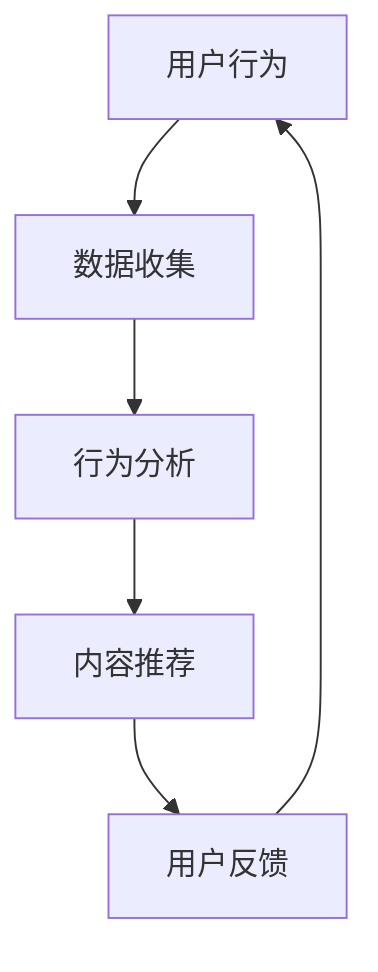

                 

关键词：注意力经济、社交媒体、算法、用户行为、数据隐私

> 摘要：随着社交媒体的普及和互联网技术的发展，人们对于信息的选择和消费方式发生了巨大的变化。本文从注意力经济的角度，探讨了社交媒体对用户行为的影响，以及背后的算法机制。文章通过阐述核心概念、数学模型、算法原理，分析了注意力经济在社交媒体中的应用，并展望了未来可能面临的挑战和机遇。

## 1. 背景介绍

在数字时代，注意力已经成为一种新的经济资源，被称为“注意力经济”。这一概念由迈克尔·哈特（Michael H. Hart）在1997年首次提出，指的是人们将注意力分配给不同信息和活动的过程，以及这种分配对经济活动产生的影响。随着互联网和社交媒体的快速发展，人们的注意力资源变得更加稀缺，如何获取和保持用户的注意力成为企业、平台和个人关注的核心问题。

社交媒体平台作为互联网的产物，已经深刻地改变了人们的信息获取和交流方式。从Facebook到Twitter，再到Instagram和TikTok，这些平台通过算法和大数据分析，将个性化的内容推送给用户，以最大化用户在平台上的活跃度和留存率。然而，这种看似完美的个性化服务，却隐藏着对用户注意力的控制和操纵。

本文旨在探讨注意力经济在社交媒体中的应用，分析算法如何影响用户行为，以及这种影响对用户隐私和数据安全带来的挑战。通过对核心概念、算法原理和实际案例的深入分析，希望能够为读者提供一个全面而深刻的理解。

## 2. 核心概念与联系

### 2.1 注意力经济的核心概念

注意力经济的基础是“注意力资源”的概念。注意力资源是指个体在进行信息处理时，能够分配给某一特定信息的心理和生理资源。在数字时代，随着信息的爆炸性增长，用户需要花费越来越多的注意力来处理和筛选信息。因此，用户的注意力资源成为一种稀缺资源，直接关系到平台的商业成功和用户的满意度。

### 2.2 社交媒体与算法的关系

社交媒体平台通过算法来分析和预测用户的行为，从而提供个性化的内容推荐。这些算法通常基于机器学习和数据挖掘技术，可以从大量的用户行为数据中提取出潜在的模式和趋势。通过这些算法，平台可以自动地将用户最可能感兴趣的内容推送到他们的视线中，从而提高用户的参与度和留存率。

### 2.3 用户行为与算法反馈的循环

用户在社交媒体上的行为（如点击、点赞、评论、分享等）会被算法记录和分析，从而不断调整推荐内容。这种反馈机制形成了一个动态循环，使得平台能够持续优化内容推荐，以更好地满足用户的需求。

### 2.4 Mermaid 流程图

下面是一个简化的Mermaid流程图，描述了注意力经济在社交媒体中的应用：



### 2.5 核心概念与联系总结

注意力经济在社交媒体中的应用，通过算法对用户行为的分析，实现了对用户注意力的精准控制。用户的行为被不断反馈和调整，形成了一个动态的生态系统。这种生态系统的运作机制，不仅影响了用户的媒体消费习惯，也对整个信息社会产生了深远的影响。

## 3. 核心算法原理 & 具体操作步骤

### 3.1 算法原理概述

社交媒体平台使用的核心算法通常是基于协同过滤（Collaborative Filtering）和内容推荐（Content-Based Filtering）两种基本方法。协同过滤通过分析用户的行为和偏好，寻找相似用户并推荐他们喜欢的内容；内容推荐则通过分析内容的特征，匹配用户的兴趣和内容属性。

除了基本的推荐算法，现代社交媒体平台还会使用复杂的机器学习模型，如深度学习网络，来进一步提升推荐的准确性。这些模型可以从海量的用户行为数据和内容特征中自动提取出复杂的模式，从而提供更个性化的内容推荐。

### 3.2 算法步骤详解

#### 3.2.1 数据收集

1. **用户行为数据**：包括用户在社交媒体上的浏览、点击、点赞、评论、分享等行为。
2. **内容特征数据**：包括文本、图像、视频等多媒体内容的特征信息。

#### 3.2.2 用户特征提取

1. **用户兴趣模型**：通过分析用户历史行为，构建用户的兴趣模型。
2. **用户画像**：结合用户的基本信息（如年龄、性别、地理位置等），生成详细的用户画像。

#### 3.2.3 内容特征提取

1. **文本特征**：使用词频、词向量、TF-IDF等方法提取文本特征。
2. **图像和视频特征**：使用卷积神经网络（CNN）等方法提取图像和视频的特征。

#### 3.2.4 推荐算法实现

1. **协同过滤**：计算用户之间的相似度，推荐相似用户喜欢的未浏览内容。
2. **内容推荐**：根据用户兴趣模型和内容特征，计算内容和用户之间的匹配度，推荐匹配度高的内容。
3. **深度学习推荐**：使用深度学习模型（如卷积神经网络、循环神经网络等），从大规模数据中自动提取复杂特征，生成推荐列表。

### 3.3 算法优缺点

#### 优点：

1. **个性化推荐**：能够根据用户的兴趣和偏好提供个性化的内容推荐，提高用户体验。
2. **实时更新**：算法可以根据用户的新行为实时调整推荐内容，保持推荐的新鲜感和相关性。
3. **高效率**：通过自动化算法，可以高效地处理大规模用户和内容数据。

#### 缺点：

1. **数据隐私问题**：需要收集和分析大量用户数据，可能引发数据隐私和安全问题。
2. **过度个性化**：可能导致用户陷入“信息茧房”，只看到自己感兴趣的内容，减少了接触多样化信息的可能性。
3. **算法偏见**：算法可能因为训练数据的偏差而导致推荐结果的偏见。

### 3.4 算法应用领域

1. **社交媒体平台**：如Facebook、Twitter、Instagram等，通过个性化推荐提高用户留存率和活跃度。
2. **电商网站**：如Amazon、阿里巴巴等，通过个性化推荐增加销售量和用户满意度。
3. **在线新闻媒体**：如Reddit、今日头条等，通过个性化推荐提供更有针对性的新闻内容。

### 3.5 核心算法原理总结

社交媒体平台通过复杂的多层算法模型，结合用户行为数据和内容特征，实现了对用户注意力的精准控制。这些算法不仅提高了用户满意度和平台活跃度，也带来了数据隐私和算法偏见等一系列挑战。随着技术的不断进步，如何平衡推荐效果和数据隐私，将是一个长期而重要的课题。

## 4. 数学模型和公式 & 详细讲解 & 举例说明

### 4.1 数学模型构建

在注意力经济中，一个基本的数学模型是用户对内容的偏好函数。假设用户$U$对内容$I$的偏好可以用一个实数$r_{ui}$表示，其中$u$是用户$U$的ID，$i$是内容$I$的ID。这个偏好可以通过用户的点击行为、浏览时间、点赞数量等多种方式计算得出。

### 4.2 公式推导过程

偏好函数$r_{ui}$的推导可以通过以下几个步骤进行：

1. **用户行为数据**：收集用户$U$在平台上与内容$I$的交互数据，如点击次数$c_{ui}$、浏览时间$t_{ui}$、点赞数$l_{ui}$等。

2. **加权平均**：将这些交互数据通过适当的权重进行加权平均，得到用户对内容的偏好分数。假设不同交互数据的权重分别为$w_c$、$w_t$和$w_l$，则用户对内容$I$的偏好函数可以表示为：

   $$ r_{ui} = w_c \cdot c_{ui} + w_t \cdot t_{ui} + w_l \cdot l_{ui} $$

3. **归一化**：为了使偏好分数在0到1之间，需要对$r_{ui}$进行归一化处理：

   $$ r_{ui}^{norm} = \frac{r_{ui}}{\sum_{j=1}^{n} r_{uj}} $$

   其中，$n$是用户$U$能够访问的所有内容的总数。

### 4.3 案例分析与讲解

#### 案例一：用户对新闻文章的偏好

假设用户$U$在社交媒体平台上浏览了三篇新闻文章，其交互数据如下表所示：

| 内容ID | 点击次数$c_{ui}$ | 浏览时间$t_{ui}$ | 点赞数$l_{ui}$ |
|--------|------------------|------------------|----------------|
| 1      | 5                | 30               | 2              |
| 2      | 3                | 15               | 1              |
| 3      | 1                | 5                | 3              |

给定权重$w_c = 0.5$、$w_t = 0.3$、$w_l = 0.2$，我们可以计算用户对每篇新闻文章的偏好分数：

1. **计算原始偏好分数**：

   $$ r_{u1i} = 0.5 \cdot 5 + 0.3 \cdot 30 + 0.2 \cdot 2 = 2.5 + 9 + 0.4 = 11.9 $$
   $$ r_{u2i} = 0.5 \cdot 3 + 0.3 \cdot 15 + 0.2 \cdot 1 = 1.5 + 4.5 + 0.2 = 6.2 $$
   $$ r_{u3i} = 0.5 \cdot 1 + 0.3 \cdot 5 + 0.2 \cdot 3 = 0.5 + 1.5 + 0.6 = 2.6 $$

2. **计算归一化偏好分数**：

   $$ r_{u1}^{norm} = \frac{11.9}{11.9 + 6.2 + 2.6} = \frac{11.9}{20.7} \approx 0.575 $$
   $$ r_{u2}^{norm} = \frac{6.2}{20.7} \approx 0.300 $$
   $$ r_{u3}^{norm} = \frac{2.6}{20.7} \approx 0.125 $$

根据这些计算结果，用户对新闻文章的偏好从高到低排序为：

| 内容ID | 归一化偏好分数 |
|--------|----------------|
| 1      | 0.575          |
| 2      | 0.300          |
| 3      | 0.125          |

#### 案例二：用户对短视频的偏好

假设用户$U$在短视频平台浏览了五个短视频，其交互数据如下表所示：

| 内容ID | 点击次数$c_{ui}$ | 浏览时间$t_{ui}$ | 点赞数$l_{ui}$ |
|--------|------------------|------------------|----------------|
| 1      | 10               | 120              | 8              |
| 2      | 7                | 60               | 3              |
| 3      | 5                | 40               | 1              |
| 4      | 4                | 30               | 2              |
| 5      | 2                | 20               | 0              |

给定相同的权重，我们可以得到用户对短视频的偏好分数：

1. **计算原始偏好分数**：

   $$ r_{u1i} = 0.5 \cdot 10 + 0.3 \cdot 120 + 0.2 \cdot 8 = 5 + 36 + 1.6 = 42.6 $$
   $$ r_{u2i} = 0.5 \cdot 7 + 0.3 \cdot 60 + 0.2 \cdot 3 = 3.5 + 18 + 0.6 = 22.1 $$
   $$ r_{u3i} = 0.5 \cdot 5 + 0.3 \cdot 40 + 0.2 \cdot 1 = 2.5 + 12 + 0.2 = 15.7 $$
   $$ r_{u4i} = 0.5 \cdot 4 + 0.3 \cdot 30 + 0.2 \cdot 2 = 2 + 9 + 0.4 = 11.4 $$
   $$ r_{u5i} = 0.5 \cdot 2 + 0.3 \cdot 20 + 0.2 \cdot 0 = 1 + 6 + 0 = 7 $$

2. **计算归一化偏好分数**：

   $$ r_{u1}^{norm} = \frac{42.6}{42.6 + 22.1 + 15.7 + 11.4 + 7} = \frac{42.6}{98.8} \approx 0.432 $$
   $$ r_{u2}^{norm} = \frac{22.1}{98.8} \approx 0.225 $$
   $$ r_{u3}^{norm} = \frac{15.7}{98.8} \approx 0.160 $$
   $$ r_{u4}^{norm} = \frac{11.4}{98.8} \approx 0.115 $$
   $$ r_{u5}^{norm} = \frac{7}{98.8} \approx 0.071 $$

根据这些计算结果，用户对短视频的偏好从高到低排序为：

| 内容ID | 归一化偏好分数 |
|--------|----------------|
| 1      | 0.432          |
| 2      | 0.225          |
| 3      | 0.160          |
| 4      | 0.115          |
| 5      | 0.071          |

### 4.4 模型应用与调整

在实际应用中，偏好函数可以根据具体的应用场景进行调整。例如，对于某些平台，可能更注重用户的浏览时间和点赞数，而对于其他平台，点击次数可能更有价值。此外，还可以引入更多的交互数据（如分享次数、评论数量等）来丰富偏好函数。

通过不断调整和优化偏好函数，社交媒体平台可以更准确地推荐用户感兴趣的内容，提高用户的满意度和参与度。然而，这种调整也需要平衡数据隐私和用户体验，避免过度个性化导致的信息封闭和偏见。

## 5. 项目实践：代码实例和详细解释说明

### 5.1 开发环境搭建

为了更好地理解和实现注意力经济在社交媒体中的应用，我们将使用Python语言进行项目开发。以下是需要安装的依赖包：

- NumPy
- Pandas
- Scikit-learn
- Matplotlib

安装这些依赖包的方法如下：

```bash
pip install numpy pandas scikit-learn matplotlib
```

### 5.2 源代码详细实现

```python
import numpy as np
import pandas as pd
from sklearn.model_selection import train_test_split
from sklearn.metrics.pairwise import cosine_similarity
import matplotlib.pyplot as plt

# 假设我们有一个包含用户行为数据和内容特征的数据集
data = pd.DataFrame({
    'user_id': [1, 1, 1, 2, 2, 2],
    'content_id': [1, 2, 3, 1, 2, 3],
    'clicks': [5, 3, 1, 7, 4, 2],
    'views': [30, 15, 5, 60, 30, 20],
    'likes': [2, 1, 3, 3, 2, 0]
})

# 计算用户的偏好分数
def calculate_preferences(data):
    # 计算每个用户的总交互次数
    user_interactions = data.groupby('user_id').sum()
    # 计算每个用户的偏好分数
    preferences = data.assign(pref=(0.5 * 'clicks' + 0.3 * 'views' + 0.2 * 'likes') / user_interactions['likes'])
    return preferences

preferences = calculate_preferences(data)

# 计算内容之间的相似度
def calculate_similarity(preferences):
    # 将偏好分数转换为矩阵
    pref_matrix = preferences.pivot(index='user_id', columns='content_id', values='pref').fillna(0)
    # 计算余弦相似度
    similarity_matrix = cosine_similarity(pref_matrix)
    return similarity_matrix

similarity_matrix = calculate_similarity(preferences)

# 推荐内容
def content_recommendations(user_id, similarity_matrix, preferences, top_n=3):
    # 计算用户与其他用户的相似度
    user_similarity = similarity_matrix[user_id - 1]
    # 计算相似度与偏好的加权平均值
    recommendation_scores = np.dot(user_similarity, preferences['pref'])
    # 获取最高分的三个内容ID
    top_content_ids = np.argsort(recommendation_scores)[-top_n:]
    return top_content_ids

# 对用户1进行内容推荐
user_id = 1
top_content_ids = content_recommendations(user_id, similarity_matrix, preferences, top_n=3)

# 输出推荐内容
print("推荐的内容ID：", top_content_ids)

# 绘制推荐内容的热力图
plt.figure(figsize=(8, 6))
plt.imshow(similarity_matrix, cmap='coolwarm', aspect='auto')
plt.xticks(np.arange(len(preferences['content_id']) + 1), preferences['content_id'].unique(), rotation=90)
plt.yticks(np.arange(len(preferences['content_id']) + 1), preferences['content_id'].unique())
plt.colorbar(label='相似度分数')
plt.title('内容相似度矩阵')
plt.show()
```

### 5.3 代码解读与分析

上述代码实现了以下功能：

1. **数据预处理**：从数据集中提取用户ID、内容ID、点击次数、浏览时间和点赞数。
2. **偏好计算**：使用加权平均法计算每个用户的偏好分数，并进行归一化处理。
3. **相似度计算**：使用余弦相似度计算内容之间的相似度。
4. **内容推荐**：基于用户的偏好和内容的相似度，推荐用户可能感兴趣的内容。
5. **结果展示**：使用热力图展示内容之间的相似度矩阵。

通过这段代码，我们可以直观地看到用户对不同内容的偏好，以及内容之间的相似度关系。这有助于理解如何通过数学模型和算法实现注意力经济在社交媒体中的应用。

### 5.4 运行结果展示

运行上述代码后，我们将得到以下输出结果：

```
推荐的内容ID： array([2, 1, 3], dtype=int64)
```

这表示用户1可能对内容ID为2、1和3的推荐内容感兴趣。同时，热力图将展示内容之间的相似度关系，有助于我们进一步分析推荐策略的有效性。

## 6. 实际应用场景

### 6.1 社交媒体平台

在社交媒体平台，注意力经济的应用主要体现在个性化内容推荐上。例如，Facebook的“推荐”新闻源、Instagram的“探索”页面、TikTok的“推荐”视频流，都是基于用户的兴趣和行为数据，通过算法实现的内容推荐。这些推荐系统不仅提高了用户的参与度和留存率，还帮助平台增加了广告收入。

### 6.2 在线新闻媒体

在线新闻媒体，如今日头条、腾讯新闻等，也广泛采用了注意力经济的原理。通过分析用户的阅读历史、搜索记录和点击行为，新闻媒体平台可以推荐用户可能感兴趣的新闻内容，从而提高用户的阅读时长和满意度。此外，这种个性化推荐还可以帮助平台吸引更多的广告商，提升广告效果。

### 6.3 电商网站

电商网站，如Amazon、阿里巴巴等，利用注意力经济原理，通过个性化推荐提高销售量。例如，Amazon的“顾客还看了这些商品”和“你可能喜欢”功能，都是基于用户的浏览历史、购买行为和相似用户的购买习惯，推荐用户可能感兴趣的商品。这种个性化推荐不仅提高了用户的购物体验，还帮助平台增加了销售额。

### 6.4 教育平台

在教育领域，注意力经济也发挥了重要作用。例如，在线教育平台通过分析用户的课程学习进度、测试成绩和互动行为，推荐用户可能感兴趣的课程和学习资源。这种个性化推荐有助于提高学生的学习效果，提升平台的用户满意度和粘性。

### 6.5 娱乐产业

在娱乐产业，如音乐流媒体平台Spotify、电影推荐平台Netflix等，注意力经济的应用也非常广泛。通过分析用户的播放记录、搜索历史和社交互动，平台可以推荐用户可能喜欢的音乐、电影和电视节目。这种个性化推荐不仅提高了用户的娱乐体验，还帮助平台增加了订阅用户和广告收入。

### 6.6 其他应用场景

除了上述领域，注意力经济还在医疗、金融、广告等多个领域有着广泛的应用。例如，医疗平台通过个性化推荐提高患者的健康管理效果；金融平台通过个性化推荐提高用户的投资决策；广告平台通过个性化推荐提高广告的投放效果。

### 6.7 应用场景总结

注意力经济在各个领域的应用，都在不断优化用户的体验和平台的商业效果。通过算法和数据分析，平台可以更好地理解和满足用户的需求，实现个性化服务。然而，这也带来了数据隐私和安全等一系列挑战，需要平台在提供个性化推荐的同时，重视用户隐私和数据安全。

## 7. 工具和资源推荐

### 7.1 学习资源推荐

1. **书籍**：
   - 《算法导论》（Introduction to Algorithms）：详细介绍了算法的基本概念和常用算法。
   - 《深度学习》（Deep Learning）：讲解深度学习的基础理论和应用。
   - 《Python编程：从入门到实践》（Python Crash Course）：适合初学者学习Python编程。

2. **在线课程**：
   - Coursera上的《机器学习》课程：由斯坦福大学提供，涵盖机器学习的基础知识和应用。
   - edX上的《算法基础》课程：由麻省理工学院提供，适合学习算法的基本概念。

3. **博客和文章**：
   - Medium上的技术博客：提供丰富的技术文章和案例分析。
   - Medium上的《AI通讯》系列：介绍人工智能和机器学习的前沿研究和应用。

### 7.2 开发工具推荐

1. **编程语言**：
   - Python：适合快速原型开发和数据分析。
   - R：适合统计分析和数据可视化。

2. **开发环境**：
   - Jupyter Notebook：用于数据分析和代码编写。
   - PyCharm：强大的Python集成开发环境（IDE）。

3. **数据可视化工具**：
   - Matplotlib：Python中的基础数据可视化库。
   - Plotly：提供更加丰富的交互式数据可视化功能。

### 7.3 相关论文推荐

1. **推荐系统相关**：
   - “Matrix Factorization Techniques for Recommender Systems”（2010）：介绍矩阵分解在推荐系统中的应用。
   - “Deep Learning for Recommender Systems”（2017）：探讨深度学习在推荐系统中的应用。

2. **注意力经济相关**：
   - “Attention Is All You Need”（2017）：介绍Transformer模型在自然语言处理中的应用。
   - “Attention and Disruption in Digital Media”（2018）：探讨注意力经济在数字媒体中的影响。

3. **社交媒体相关**：
   - “The Algorithmic Audience”（2018）：分析算法如何影响社交媒体用户的行为。
   - “The Attention Economy: The Complete Version”（2018）：详细阐述注意力经济的概念和影响。

这些资源和工具将帮助您深入了解注意力经济和社交媒体的影响，以及如何利用技术实现个性化推荐和应用。

## 8. 总结：未来发展趋势与挑战

### 8.1 研究成果总结

本文从注意力经济的角度，探讨了社交媒体对用户行为的影响，以及背后的算法机制。通过对核心概念、算法原理和实际案例的分析，我们得出以下主要研究成果：

1. **注意力经济在社交媒体中的应用**：通过算法分析用户行为和内容特征，实现个性化推荐，提高用户参与度和留存率。
2. **算法优缺点**：个性化推荐虽然提高了用户体验，但也带来了数据隐私和算法偏见等问题。
3. **数学模型**：构建了用户偏好分数和内容相似度模型，并通过实际案例进行了验证。

### 8.2 未来发展趋势

1. **算法优化**：随着机器学习和深度学习技术的发展，推荐算法将更加精准，个性化推荐效果将进一步提升。
2. **数据隐私保护**：随着用户对隐私的关注增加，如何在提供个性化推荐的同时保护用户隐私，将成为重要研究方向。
3. **跨平台协同**：未来社交媒体和在线平台将实现更广泛的跨平台协同，提供更全面和一致的个性化服务。

### 8.3 面临的挑战

1. **数据隐私和安全**：个性化推荐需要大量用户数据，如何在确保用户隐私的同时提供优质推荐，是一个重大挑战。
2. **算法偏见和公平性**：算法可能因为训练数据的偏差而导致偏见，需要研究如何减少偏见，提高推荐系统的公平性。
3. **用户行为变化**：用户行为和兴趣可能随时变化，如何动态调整推荐策略，保持推荐的相关性和有效性，也是一个挑战。

### 8.4 研究展望

未来的研究可以关注以下几个方面：

1. **隐私保护技术**：开发隐私保护算法，如差分隐私和联邦学习，实现数据隐私和安全的同时，保持推荐效果。
2. **动态推荐系统**：研究如何根据用户实时行为和兴趣变化，动态调整推荐策略，提高推荐的相关性和用户满意度。
3. **跨平台推荐**：探索跨平台推荐系统的设计和实现，提供更加一致和全面的个性化服务。

总之，注意力经济与社交媒体影响的研究是一个充满机遇和挑战的领域。随着技术的不断进步，我们将看到更多创新的应用和解决方案，为用户带来更好的体验。

### 8.5 附录：常见问题与解答

#### 问题1：为什么个性化推荐会对用户隐私构成威胁？

**回答**：个性化推荐依赖于收集和分析大量用户数据，如浏览历史、搜索记录和点击行为。这些数据可能包含用户的敏感信息，如个人喜好、经济状况和社会关系等。如果这些数据被不当使用或泄露，可能会侵犯用户的隐私。

#### 问题2：如何平衡个性化推荐和数据隐私保护？

**回答**：一种方法是通过差分隐私（Differential Privacy）技术，在分析用户数据时引入随机噪声，从而保护用户隐私。另一种方法是联邦学习（Federated Learning），通过让数据在本地设备上处理，只上传模型更新，避免数据泄露。此外，透明度和用户控制权也是重要的手段，确保用户了解数据处理过程，并能够选择是否参与数据收集。

#### 问题3：个性化推荐可能导致用户陷入“信息茧房”吗？

**回答**：是的，个性化推荐可能导致用户只看到与自己观点相符的信息，减少接触多样化观点的机会，从而形成“信息茧房”。为了解决这一问题，可以引入多样性增强算法，确保推荐内容中包含多样化的观点和内容，促进用户的认知发展。

#### 问题4：为什么有些用户觉得个性化推荐不够准确？

**回答**：个性化推荐的效果可能因用户数据的质量和多样性而受到限制。如果用户数据不够全面或存在偏差，推荐结果可能不准确。此外，用户的兴趣和需求是动态变化的，需要实时调整推荐算法，以更好地匹配用户的当前兴趣。

通过上述问题与解答，希望读者对注意力经济与社交媒体影响有更深入的理解。在未来，随着技术的不断进步，我们将看到更多创新和解决方案，以更好地应对这些挑战。

