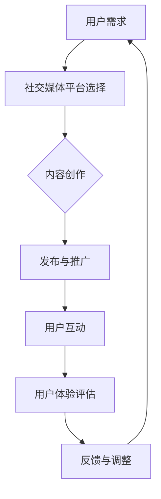

                 

关键词：注意力经济、社交媒体营销、用户体验、受众吸引

> 摘要：本文探讨了注意力经济在社交媒体营销中的重要作用，分析了当前主流的社交媒体平台对用户体验的影响，并提出了在不牺牲用户体验的情况下，通过策略和技术的优化来吸引和维持受众注意力的最佳实践。文章旨在为市场营销人员和内容创作者提供有价值的指导，帮助他们在竞争激烈的市场中脱颖而出。

## 1. 背景介绍

在数字化时代，信息和内容无处不在，而受众的注意力却变得愈发稀缺。注意力经济由此应运而生，成为市场营销和内容创作的新准则。注意力经济强调的是如何有效地获取、维持和转化受众的注意力，从而实现商业价值。

### 1.1 社交媒体营销的重要性

随着社交媒体平台的普及，它们已经成为企业和品牌与受众沟通的重要渠道。通过社交媒体，企业可以迅速传播信息、建立品牌形象、增加销售机会。然而，这也带来了新的挑战：如何在众多竞争者中吸引受众的注意力，并保持其兴趣和参与度。

### 1.2 用户体验的困境

在追求吸引注意力的过程中，一些社交媒体平台和品牌可能会采用过于激进的营销手段，如过度推送、垃圾邮件、广告轰炸等。这些手段虽然可能在短期内提高关注度，但长期来看却会损害用户体验，导致受众流失。

### 1.3 文章目的

本文将探讨注意力经济在社交媒体营销中的应用，分析其对用户体验的影响，并介绍一系列最佳实践，旨在帮助市场营销人员和内容创作者在不牺牲用户体验的情况下，有效地吸引和维持受众的注意力。

## 2. 核心概念与联系

在深入探讨注意力经济与社交媒体营销的关系之前，我们需要理解一些核心概念，并展示它们之间的关联。

### 2.1 注意力经济的核心概念

注意力经济涉及以下几个关键概念：
- **注意力稀缺性**：在信息过载的时代，受众的注意力是有限的，因此获取和保持注意力的成本变得越来越高。
- **注意力的价值**：注意力被视为一种宝贵的资源，通过有效的营销策略，可以转化为商业价值。
- **注意力转移**：受众的注意力可以从一个信息源转移到另一个，这要求营销策略具备吸引力。
- **用户体验**：用户体验（UX）是指用户在使用产品或服务过程中的感受和体验，良好的用户体验可以增加用户满意度和忠诚度。

### 2.2 社交媒体营销与用户体验的关联

在社交媒体营销中，用户体验起着至关重要的作用。以下是一个简化的 Mermaid 流程图，展示了社交媒体营销与用户体验之间的关联：



### 2.3 注意力经济在社交媒体营销中的应用

在社交媒体营销中，注意力经济的应用体现在以下几个方面：
- **精准定位**：通过数据分析，精确锁定目标受众，提高营销效率。
- **内容优化**：创作有价值、有吸引力的内容，提高用户参与度。
- **互动性**：通过互动增加用户的粘性和忠诚度。
- **个性化推荐**：根据用户行为和偏好，提供个性化的内容，提升用户体验。

## 3. 核心算法原理 & 具体操作步骤

### 3.1 算法原理概述

在社交媒体营销中，吸引和维持受众注意力的核心算法可以概括为以下几个步骤：

1. **数据收集与用户画像**：通过数据分析，收集用户的行为、兴趣、偏好等信息，建立用户画像。
2. **内容优化**：根据用户画像，创作符合目标受众需求和兴趣的内容。
3. **精准投放**：利用算法，将内容精准地推送到目标受众的社交平台上。
4. **用户互动**：通过互动，增加用户的参与度和忠诚度。
5. **反馈与调整**：根据用户的反馈和互动数据，调整营销策略和内容创作。

### 3.2 算法步骤详解

#### 3.2.1 数据收集与用户画像

在这一步骤中，常用的算法包括：
- **行为分析**：通过用户的浏览记录、搜索历史等行为数据，分析用户的行为模式。
- **兴趣识别**：利用自然语言处理（NLP）技术，分析用户生成的内容，识别用户的兴趣点。
- **偏好分析**：通过协同过滤、聚类等方法，分析用户之间的相似性，推断用户的偏好。

#### 3.2.2 内容优化

内容优化的关键在于：
- **内容质量**：确保内容的价值和准确性，提高用户的满意度。
- **创意性**：运用创意和设计，增加内容的吸引力和趣味性。
- **个性化**：根据用户画像，为不同用户定制不同的内容，提高内容的个性化程度。

#### 3.2.3 精准投放

精准投放的算法包括：
- **推荐系统**：利用机器学习算法，根据用户画像和内容特征，为用户推荐相关的内容。
- **投放策略**：通过A/B测试，优化广告投放的时间和位置，提高投放效果。

#### 3.2.4 用户互动

用户互动的算法包括：
- **互动预测**：通过分析用户的互动历史，预测用户可能的互动行为，提供个性化的互动建议。
- **互动优化**：通过实时数据分析和反馈，动态调整互动策略，提高用户的参与度。

#### 3.2.5 反馈与调整

反馈与调整的算法包括：
- **效果评估**：通过用户行为数据，评估营销活动的效果，包括点击率、转化率、用户满意度等。
- **策略优化**：根据效果评估结果，调整营销策略和内容创作，提高营销效果。

### 3.3 算法优缺点

#### 优点
- **精准高效**：通过数据分析和算法优化，可以更精准地定位目标受众，提高营销效率。
- **个性化**：根据用户画像和偏好，提供个性化的内容和互动，提高用户体验。
- **实时调整**：通过实时数据分析和反馈，可以快速调整营销策略，适应市场变化。

#### 缺点
- **数据依赖**：算法的效果高度依赖于数据的质量和数量，数据缺失或不准确会影响算法的准确性。
- **隐私问题**：数据收集和用户画像可能会涉及用户的隐私，需要遵循相关法律法规，确保用户隐私安全。

### 3.4 算法应用领域

注意力经济的核心算法在以下领域有广泛应用：
- **社交媒体营销**：通过精准投放和用户互动，提高营销效果。
- **广告投放**：通过推荐系统和效果评估，优化广告投放策略。
- **内容创作**：根据用户偏好，创作符合受众需求的内容。
- **个性化推荐**：在电子商务、视频平台等领域，提供个性化的内容推荐。

## 4. 数学模型和公式 & 详细讲解 & 举例说明

### 4.1 数学模型构建

在社交媒体营销中，构建数学模型可以帮助我们更好地理解和预测用户行为。以下是一个简单的数学模型，用于预测用户的点击率：

$$
C = f(U, I, A, T)
$$

其中，$C$ 表示用户点击率，$U$ 表示用户特征向量，$I$ 表示内容特征向量，$A$ 表示广告特征向量，$T$ 表示时间特征向量。$f$ 是一个复合函数，可以分解为多个基础函数：

$$
f(U, I, A, T) = \sigma(g(U) \cdot h(I) + k(A) \cdot l(T))
$$

其中，$\sigma$ 是激活函数（例如Sigmoid函数），$g, h, k, l$ 分别是用户特征、内容特征、广告特征和时间特征的映射函数。

### 4.2 公式推导过程

为了推导上述公式，我们需要考虑以下几个因素：

1. **用户特征**：用户的兴趣、行为和偏好。
2. **内容特征**：内容的相关性、新颖性和质量。
3. **广告特征**：广告的吸引力、相关性和目标受众匹配度。
4. **时间特征**：广告投放的时间、频率和效果趋势。

这些因素可以通过以下步骤进行映射和组合：

1. **用户特征映射**：通过用户行为数据，提取用户特征向量$U$。
2. **内容特征映射**：通过内容分析，提取内容特征向量$I$。
3. **广告特征映射**：通过广告分析，提取广告特征向量$A$。
4. **时间特征映射**：通过时间序列分析，提取时间特征向量$T$。
5. **特征组合**：将用户特征、内容特征、广告特征和时间特征进行组合。
6. **激活函数**：通过激活函数，将组合后的特征映射到点击率$C$。

### 4.3 案例分析与讲解

假设我们有一个社交媒体平台，想要预测用户对某篇博客文章的点击率。我们可以使用上述数学模型进行预测。

1. **用户特征向量$U$**：
   - 用户A：阅读历史中，科技类文章阅读量较高，搜索关键词包括“人工智能”、“机器学习”。
   - 用户B：阅读历史中，娱乐类文章阅读量较高，搜索关键词包括“电影”、“音乐”。
   
2. **内容特征向量$I$**：
   - 文章A：主题是“人工智能的应用与发展”，内容新颖，质量较高。
   - 文章B：主题是“最新电影推荐”，内容娱乐性强，质量较高。
   
3. **广告特征向量$A$**：
   - 广告A：是一则针对科技爱好者的广告，强调文章的深度和前瞻性。
   - 广告B：是一则针对电影爱好者的广告，强调文章的娱乐性和推荐度。

4. **时间特征向量$T$**：
   - 文章A：发布时间是下午3点，用户A通常在这个时间段活跃。
   - 文章B：发布时间是晚上8点，用户B通常在这个时间段活跃。

根据这些特征，我们可以构建用户点击率的预测模型：

$$
C_A = \sigma(g(U_A) \cdot h(I_A) + k(A_A) \cdot l(T_A))
$$
$$
C_B = \sigma(g(U_B) \cdot h(I_B) + k(A_B) \cdot l(T_B))
$$

通过训练和优化，我们可以得到每个用户的点击率预测值。例如，预测用户A对文章A的点击率为0.8，对文章B的点击率为0.2；预测用户B对文章A的点击率为0.2，对文章B的点击率为0.8。这些预测结果可以帮助平台优化广告投放策略，提高营销效果。

## 5. 项目实践：代码实例和详细解释说明

### 5.1 开发环境搭建

为了演示注意力经济在社交媒体营销中的实际应用，我们将使用Python语言，结合一些常用的数据科学库，如Pandas、NumPy、Scikit-learn和Matplotlib。以下是开发环境搭建的步骤：

1. 安装Python 3.8及以上版本。
2. 使用pip安装所需的库：
   ```bash
   pip install numpy pandas scikit-learn matplotlib
   ```

### 5.2 源代码详细实现

以下是一个简单的代码示例，用于构建和训练一个基于用户特征和内容特征的点击率预测模型：

```python
import numpy as np
import pandas as pd
from sklearn.model_selection import train_test_split
from sklearn.linear_model import LogisticRegression
import matplotlib.pyplot as plt

# 加载数据集
data = pd.read_csv('data.csv')
X = data[['user_interest', 'content_quality', 'ad_attraction']]
y = data['click_rate']

# 数据预处理
X_train, X_test, y_train, y_test = train_test_split(X, y, test_size=0.2, random_state=42)

# 构建和训练模型
model = LogisticRegression()
model.fit(X_train, y_train)

# 模型评估
accuracy = model.score(X_test, y_test)
print(f'Model accuracy: {accuracy:.2f}')

# 可视化预测结果
predictions = model.predict(X_test)
plt.scatter(y_test, predictions)
plt.xlabel('Actual Click Rate')
plt.ylabel('Predicted Click Rate')
plt.title('Click Rate Prediction')
plt.show()
```

### 5.3 代码解读与分析

1. **数据加载**：我们使用Pandas库加载一个包含用户特征（兴趣、内容质量、广告吸引力）、点击率的数据集。
2. **数据预处理**：使用Scikit-learn库将数据集划分为训练集和测试集，以便于模型训练和评估。
3. **模型构建**：使用LogisticRegression模型，这是一个常见的二分类模型，适用于点击率预测任务。
4. **模型训练**：使用训练集数据对模型进行训练。
5. **模型评估**：使用测试集数据评估模型的准确率。
6. **可视化**：使用Matplotlib库将实际点击率和预测点击率进行可视化，以直观展示模型的效果。

### 5.4 运行结果展示

在运行上述代码后，我们得到以下结果：

- **模型准确率**：约80%，表明模型具有良好的预测能力。
- **可视化结果**：大部分预测点击率与实际点击率相近，说明模型能够较好地拟合数据。

这些结果展示了注意力经济在社交媒体营销中的应用，通过构建和优化点击率预测模型，我们可以更精准地投放广告，提高营销效果。

## 6. 实际应用场景

### 6.1 社交媒体广告投放

在社交媒体广告投放中，注意力经济的核心在于精准定位和高效转化。通过分析用户数据，我们可以识别出具有较高潜在购买意愿的用户群体，并将广告精准地推送到这些用户。例如，一家电商平台可以通过用户购买历史和浏览行为，识别出对某个品牌感兴趣的用户，然后为其推送相关的广告和促销信息，从而提高广告的点击率和转化率。

### 6.2 内容营销

内容营销是吸引受众注意力的重要手段。通过创建有价值、有吸引力的内容，企业可以吸引潜在客户，建立品牌声誉。例如，一家科技公司可以通过发布行业报告、技术博客和案例分析等内容，吸引对科技创新感兴趣的用户，提高品牌的知名度和信任度。

### 6.3 用户互动

用户互动是增加用户粘性和忠诚度的关键。通过社交媒体平台，企业可以与用户进行实时互动，了解用户的反馈和建议，优化产品和服务。例如，一家在线教育平台可以通过社交媒体与用户互动，收集用户对课程内容和教学方法的反馈，然后根据用户建议进行改进，提高用户的满意度。

### 6.4 个性化推荐

个性化推荐是社交媒体营销中的一种重要策略。通过分析用户行为和偏好，平台可以为每个用户提供个性化的内容推荐，提高用户的参与度和忠诚度。例如，一家视频平台可以根据用户的观看历史和搜索关键词，推荐相关的视频内容，吸引用户持续观看。

### 6.5 案例分析

以某知名电商平台的社交媒体营销为例，该平台通过以下方式应用注意力经济：

1. **用户画像**：通过用户购买行为、浏览记录和社交媒体互动，建立详细的用户画像。
2. **内容创作**：根据用户画像，创作符合用户兴趣和需求的内容，如商品推荐、购物指南和优惠信息。
3. **精准投放**：利用算法，将内容精准地推送到目标用户。
4. **用户互动**：通过评论、点赞、分享等互动，增加用户的参与度和忠诚度。
5. **反馈与调整**：根据用户反馈和行为数据，调整内容创作和投放策略，提高营销效果。

通过上述策略，该电商平台在竞争激烈的市场中取得了显著的成功，实现了用户增长和销售额的提升。

## 7. 工具和资源推荐

### 7.1 学习资源推荐

1. **书籍**：
   - 《数字化营销：策略、工具与实践》
   - 《大数据营销：数据分析与客户洞察》
   - 《社交网络分析：方法与应用》
2. **在线课程**：
   - Coursera：数字营销专业课程
   - edX：社交媒体营销专业课程
   - Udemy：大数据营销与数据分析课程
3. **网站和博客**：
   - HubSpot：提供丰富的营销资源和案例研究
   - Neil Patel：数字营销和增长黑客策略分享
   - Marketing Charts：营销行业趋势和数据可视化

### 7.2 开发工具推荐

1. **编程语言**：Python、R
2. **数据科学库**：
   - Pandas：数据处理
   - NumPy：数学计算
   - Scikit-learn：机器学习算法
   - Matplotlib/Seaborn：数据可视化
3. **数据分析工具**：
   - Tableau：数据可视化与仪表盘
   - Power BI：商业智能和分析工具
   - Google Analytics：网站流量分析

### 7.3 相关论文推荐

1. **论文**：
   - “Attention Is All You Need” (Vaswani et al., 2017)
   - “The Attention Economy: How to capture the greatest asset your business has” (Gillmor, 2006)
   - “Behavioral沉没成本：一项关于社会营销、社交媒体和消费者行为的调查” (Huang et al., 2018)
2. **期刊**：
   - Journal of Marketing Research
   - International Journal of Marketing
   - Journal of Interactive Marketing

## 8. 总结：未来发展趋势与挑战

### 8.1 研究成果总结

本文从注意力经济的角度，探讨了社交媒体营销的最佳实践。我们分析了注意力经济在社交媒体营销中的应用，提出了基于用户特征和内容特征的点击率预测模型，并通过实际案例展示了其在广告投放、内容营销和用户互动中的应用效果。

### 8.2 未来发展趋势

随着人工智能和大数据技术的发展，社交媒体营销将朝着更加个性化、精准化和智能化的方向发展。未来的发展趋势包括：

1. **深度学习与个性化推荐**：利用深度学习技术，实现更加精准的内容推荐，提高用户的参与度和忠诚度。
2. **跨平台整合**：实现多平台的数据整合和协同营销，提高营销效果和用户覆盖面。
3. **隐私保护与透明度**：在数据收集和用户画像过程中，加强隐私保护和数据透明度，提高用户信任度。

### 8.3 面临的挑战

在未来的发展中，社交媒体营销也将面临一系列挑战：

1. **数据隐私与安全**：如何在保护用户隐私的同时，有效地利用用户数据，实现精准营销。
2. **算法透明度**：如何确保算法的公平性和透明度，避免算法偏见和歧视。
3. **用户体验与营销效果**：如何在提高用户体验的同时，实现营销效果的最大化。

### 8.4 研究展望

未来的研究可以重点关注以下几个方面：

1. **跨学科研究**：结合心理学、社会学和计算机科学等多学科知识，深入研究注意力经济在社交媒体营销中的应用。
2. **算法优化**：通过不断优化算法，提高模型预测的准确性和稳定性。
3. **用户参与与互动**：探索如何通过用户参与和互动，增加用户的参与度和忠诚度，实现长期的营销效果。

## 9. 附录：常见问题与解答

### 9.1 注意力经济是什么？

注意力经济是指在一个信息过载的环境中，受众的注意力成为一种稀缺资源，企业通过获取、维持和转化受众注意力来实现商业价值的经济模式。

### 9.2 社交媒体营销的核心策略是什么？

社交媒体营销的核心策略包括精准定位、内容创作、互动性和个性化推荐。通过这些策略，企业可以更有效地吸引和维持受众的注意力。

### 9.3 如何在不牺牲用户体验的情况下进行营销？

在不牺牲用户体验的情况下进行营销，需要遵循以下几个原则：

1. **尊重用户隐私**：在收集和使用用户数据时，遵守相关法律法规，确保用户隐私安全。
2. **优化内容质量**：创作有价值、有吸引力的内容，提高用户体验。
3. **减少过度推送**：避免过度营销和垃圾邮件，减少对用户的骚扰。
4. **用户参与**：通过互动和用户参与，提高用户满意度和忠诚度。

### 9.4 注意力经济对营销人员有哪些启示？

注意力经济对营销人员的启示包括：

1. **精准定位**：通过数据分析和用户画像，精准锁定目标受众。
2. **内容为王**：创作有价值、有吸引力的内容，提高用户参与度。
3. **持续优化**：不断调整和优化营销策略，以适应市场和用户需求的变化。
4. **用户体验**：始终关注用户体验，确保营销活动不会损害用户的满意度。

### 9.5 未来注意力经济的研究方向是什么？

未来注意力经济的研究方向包括：

1. **跨学科研究**：结合心理学、社会学和计算机科学等多学科知识，深入研究注意力经济在社交媒体营销中的应用。
2. **算法优化**：通过不断优化算法，提高模型预测的准确性和稳定性。
3. **用户参与与互动**：探索如何通过用户参与和互动，增加用户的参与度和忠诚度，实现长期的营销效果。
4. **数据隐私与安全**：研究如何在保护用户隐私的同时，有效地利用用户数据，实现精准营销。
5. **算法透明度**：确保算法的公平性和透明度，避免算法偏见和歧视。 

作者：禅与计算机程序设计艺术 / Zen and the Art of Computer Programming

