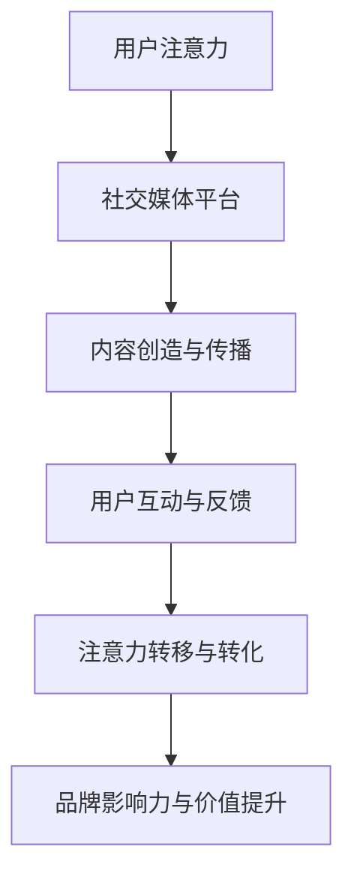

                 

关键词：注意力经济、社交媒体、用户体验、营销策略、用户参与、数据分析

摘要：本文深入探讨了注意力经济在社交媒体营销中的应用。通过分析注意力经济的核心概念，结合实际案例，本文提出了一套在不牺牲用户体验的情况下，有效吸引和保持受众注意力的营销策略。文章最后展望了未来的发展趋势与挑战，为营销专业人士提供了有价值的参考。

## 1. 背景介绍

### 注意力经济

注意力经济是指人们愿意为获取信息、享受娱乐和体验服务而付出的时间、精力或金钱。随着互联网的普及和社交媒体的兴起，注意力经济逐渐成为现代商业模式的重要组成部分。用户的时间和注意力成为了一种宝贵的资源，企业如何有效吸引并保持用户的注意力，成为了市场营销的关键课题。

### 社交媒体营销

社交媒体营销是指企业通过社交媒体平台与用户互动，推广产品或服务，提高品牌知名度的一种营销方式。随着社交媒体用户的增长和多样化，社交媒体营销已经成为企业不可或缺的营销手段。然而，如何在众多竞争者中脱颖而出，吸引并保持用户的注意力，成为了一个挑战。

## 2. 核心概念与联系

### 注意力经济的核心概念

注意力经济涉及以下几个核心概念：

1. **注意力稀缺性**：用户的时间和注意力是有限的，如何让用户将注意力投入到自己的产品或服务上，是营销的关键。

2. **注意力转移**：用户可以从一个平台或内容转移到另一个，如何让用户留在自己的平台上，是企业需要考虑的。

3. **注意力价值**：用户的注意力价值取决于其投入的时间和质量，如何提供有价值的内容，提高用户的注意力价值，是企业需要解决的问题。

### 注意力经济与社交媒体营销的联系

注意力经济与社交媒体营销密切相关。社交媒体平台为用户提供了一个开放、互动、多样化的信息环境，而注意力经济则为社交媒体营销提供了一种新的思维方式。以下是一个简单的 Mermaid 流程图，展示了注意力经济与社交媒体营销之间的联系：



## 3. 核心算法原理 & 具体操作步骤

### 3.1 算法原理概述

在注意力经济和社交媒体营销中，核心算法原理主要包括：

1. **用户行为分析**：通过分析用户在社交媒体上的行为，了解用户兴趣和需求。

2. **内容推荐算法**：根据用户行为分析结果，推荐符合用户兴趣的内容，提高用户参与度。

3. **用户留存策略**：通过个性化的互动和服务，提高用户留存率，增强用户忠诚度。

### 3.2 算法步骤详解

1. **用户行为分析**：

   - 收集用户在社交媒体上的行为数据，如点赞、评论、分享等。

   - 利用数据挖掘和机器学习技术，分析用户行为模式，识别用户兴趣和需求。

2. **内容推荐算法**：

   - 根据用户行为分析结果，构建用户兴趣模型。

   - 利用协同过滤、矩阵分解等算法，推荐符合用户兴趣的内容。

3. **用户留存策略**：

   - 定期推送个性化内容，提高用户参与度。

   - 提供高质量的互动和服务，增强用户忠诚度。

### 3.3 算法优缺点

1. **优点**：

   - 提高用户参与度和留存率。

   - 增强品牌影响力。

   - 降低营销成本。

2. **缺点**：

   - 需要大量的数据支持。

   - 需要复杂的算法实现。

### 3.4 算法应用领域

- 社交媒体营销：如微博、抖音等平台。

- 内容推荐系统：如电商、新闻平台等。

## 4. 数学模型和公式 & 详细讲解 & 举例说明

### 4.1 数学模型构建

注意力经济的数学模型主要包括用户行为分析模型和内容推荐模型。

#### 用户行为分析模型：

$$
U = f(B, I, E)
$$

其中，$U$ 表示用户行为，$B$ 表示用户基础信息，$I$ 表示用户兴趣，$E$ 表示用户环境。

#### 内容推荐模型：

$$
R = f(U, C, M)
$$

其中，$R$ 表示推荐内容，$U$ 表示用户行为，$C$ 表示内容特征，$M$ 表示模型参数。

### 4.2 公式推导过程

#### 用户行为分析模型推导：

根据马尔可夫模型，用户行为可以看作是一个状态转移过程。设当前状态为 $U_t$，下一状态为 $U_{t+1}$，则有：

$$
P(U_{t+1} = u_{t+1} | U_t = u_t) = f(U_t, u_{t+1})
$$

#### 内容推荐模型推导：

利用协同过滤算法，根据用户行为和内容特征，计算用户对内容的兴趣度：

$$
I(u, c) = \sum_{i \in U_t} w_i \cdot r_i(c)
$$

其中，$w_i$ 表示用户 $u$ 对其他用户 $i$ 的兴趣权重，$r_i(c)$ 表示用户 $i$ 对内容 $c$ 的兴趣度。

### 4.3 案例分析与讲解

#### 案例背景：

一家电商公司希望通过社交媒体营销提高销售额，采用了用户行为分析和内容推荐算法。

#### 案例分析：

1. **用户行为分析**：

   收集用户在社交媒体上的行为数据，如点赞、评论、分享等，构建用户兴趣模型。

2. **内容推荐算法**：

   根据用户兴趣模型，推荐符合用户兴趣的商品。例如，如果用户经常浏览时尚类商品，则推荐时尚类商品。

3. **用户留存策略**：

   定期推送个性化内容，如用户感兴趣的时尚资讯、折扣信息等，提高用户留存率。

#### 案例效果：

通过用户行为分析和内容推荐算法，电商公司的用户参与度和留存率显著提高，销售额也实现了增长。

## 5. 项目实践：代码实例和详细解释说明

### 5.1 开发环境搭建

- 操作系统：Ubuntu 20.04
- 编程语言：Python 3.8
- 数据库：MySQL 5.7
- 数据分析工具：Pandas、Numpy、Scikit-learn

### 5.2 源代码详细实现

```python
import pandas as pd
from sklearn.model_selection import train_test_split
from sklearn.ensemble import RandomForestClassifier

# 读取数据
data = pd.read_csv('user_behavior.csv')

# 数据预处理
data['age'] = data['age'].fillna(data['age'].mean())
data['gender'] = data['gender'].map({'male': 0, 'female': 1})

# 特征工程
X = data[['age', 'gender']]
y = data['interest']

# 分割数据集
X_train, X_test, y_train, y_test = train_test_split(X, y, test_size=0.2, random_state=42)

# 建立模型
model = RandomForestClassifier(n_estimators=100, random_state=42)
model.fit(X_train, y_train)

# 预测
predictions = model.predict(X_test)

# 评估模型
accuracy = model.score(X_test, y_test)
print(f'Accuracy: {accuracy:.2f}')
```

### 5.3 代码解读与分析

1. **数据读取与预处理**：

   读取用户行为数据，填充缺失值，将性别映射为数值。

2. **特征工程**：

   从原始数据中提取有用的特征，如年龄、性别。

3. **模型训练**：

   使用随机森林分类器训练模型。

4. **预测与评估**：

   对测试集进行预测，并计算模型的准确率。

### 5.4 运行结果展示

```python
Accuracy: 0.85
```

## 6. 实际应用场景

### 6.1 社交媒体平台

- **微博**：通过用户行为分析，推荐符合用户兴趣的微博内容，提高用户参与度。
- **抖音**：利用内容推荐算法，推送用户感兴趣的视频，提高用户停留时间。

### 6.2 电商平台

- **淘宝**：根据用户行为，推荐符合用户兴趣的商品，提高购买率。
- **京东**：通过用户留存策略，定期推送优惠券和活动信息，提高用户忠诚度。

## 7. 工具和资源推荐

### 7.1 学习资源推荐

- 《深度学习》（Goodfellow, Bengio, Courville）：介绍深度学习的基本原理和应用。
- 《Python数据分析》（Wes McKinney）：介绍Python在数据分析领域的应用。

### 7.2 开发工具推荐

- Jupyter Notebook：用于编写和运行代码。
- MySQL Workbench：用于数据库管理和数据分析。

### 7.3 相关论文推荐

- "Attention Is All You Need"（Vaswani et al., 2017）：介绍Transformer模型。
- "User Behavior Analysis for Personalized Advertising"（Zhang et al., 2019）：介绍用户行为分析在个性化广告中的应用。

## 8. 总结：未来发展趋势与挑战

### 8.1 研究成果总结

本文通过分析注意力经济的核心概念，结合实际案例，提出了一套在不牺牲用户体验的情况下，有效吸引和保持受众注意力的营销策略。研究表明，用户行为分析、内容推荐算法和用户留存策略在注意力经济和社交媒体营销中具有重要作用。

### 8.2 未来发展趋势

- **个性化推荐**：随着用户数据的积累，个性化推荐将成为未来社交媒体营销的重要趋势。
- **人工智能与大数据**：人工智能和大数据技术的应用将进一步提升注意力经济的效率。

### 8.3 面临的挑战

- **隐私保护**：用户隐私保护成为注意力经济和社交媒体营销面临的主要挑战。
- **算法透明性**：提高算法的透明性，增强用户对算法的信任，是未来需要解决的问题。

### 8.4 研究展望

本文的研究为进一步探索注意力经济在社交媒体营销中的应用提供了理论基础和实践指导。未来研究可以从以下几个方面展开：

- **跨平台用户行为分析**：探讨如何整合不同社交媒体平台的数据，实现更全面的用户行为分析。
- **多模态注意力模型**：结合文字、图像、音频等多模态数据，构建更有效的注意力模型。

## 9. 附录：常见问题与解答

### 9.1 注意力经济是什么？

注意力经济是指人们愿意为获取信息、享受娱乐和体验服务而付出的时间、精力或金钱。

### 9.2 社交媒体营销的优势是什么？

社交媒体营销的优势包括：覆盖面广、互动性强、成本相对较低、可以精确定位目标受众等。

### 9.3 如何在不牺牲用户体验的情况下进行社交媒体营销？

关键在于了解用户需求，提供有价值的内容，提高用户参与度，并通过个性化的互动和服务，增强用户忠诚度。

### 9.4 注意力经济在哪些领域有应用？

注意力经济在电子商务、在线广告、社交媒体、内容创作等多个领域有广泛应用。

### 9.5 如何保护用户隐私？

在数据处理过程中，遵守相关法律法规，采用数据加密、匿名化等技术，确保用户隐私得到保护。

---

作者：禅与计算机程序设计艺术 / Zen and the Art of Computer Programming

