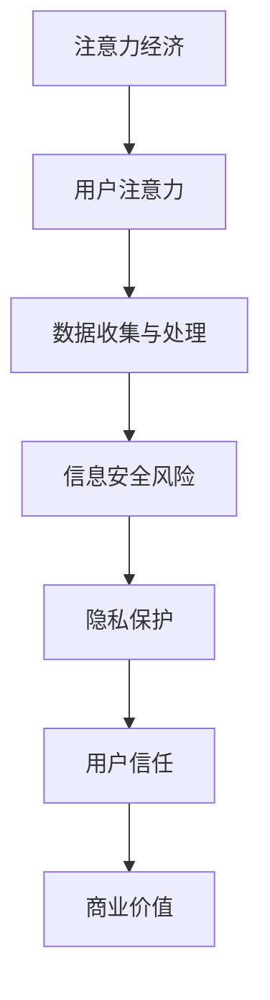

                 

 关键词：注意力经济，信息安全，隐私保护，数据加密，网络安全

> 摘要：随着互联网的快速发展，人类步入了一个全新的注意力经济时代。在这个时代，信息的重要性愈加凸显，信息安全问题也愈发严峻。本文将探讨注意力经济中的信息安全问题，分析核心概念、算法原理、数学模型，以及实际应用场景，旨在为读者提供一个全面的技术视角，以应对日益复杂的信息安全挑战。

## 1. 背景介绍

### 注意力经济的崛起

注意力经济起源于对人类注意力的价值的认识。在互联网时代，注意力成为了一种稀缺资源，而信息的爆炸性增长使得获取并保持用户的注意力成为企业和平台的核心竞争力。注意力经济强调，通过吸引和维持用户的注意力，企业可以实现商业价值，如广告收入、用户订阅等。

### 信息安全问题的凸显

随着注意力经济的兴起，信息安全问题也愈发突出。在注意力经济中，用户的信息成为企业争夺的焦点，个人隐私数据的安全保护成为亟待解决的问题。信息安全问题的严重性在于，一旦信息泄露，可能导致个人隐私被侵犯、财产损失，甚至引发社会安全问题。

## 2. 核心概念与联系

为了更好地理解注意力经济中的信息安全问题，我们需要明确以下几个核心概念：

### 2.1 注意力经济学基本原理

注意力经济学的核心概念包括注意力的价值、注意力的分配、注意力转移等。这些概念构成了注意力经济的基础理论框架。

### 2.2 信息安全基本概念

信息安全涉及多个层面，包括数据保密性、完整性、可用性等。常见的信息安全问题包括数据泄露、网络攻击、恶意软件传播等。

### 2.3 Mermaid 流程图

以下是一个简化的注意力经济与信息安全之间的联系流程图：



## 3. 核心算法原理 & 具体操作步骤

### 3.1 算法原理概述

为了保障信息安全，我们需要采用一系列核心算法，包括数据加密、身份认证、访问控制等。这些算法共同构成了一个信息安全的技术体系。

### 3.2 算法步骤详解

#### 3.2.1 数据加密

数据加密是保护数据保密性的关键措施。以下是数据加密的基本步骤：

1. 选择合适的加密算法，如AES、RSA等。
2. 生成密钥，确保密钥的安全存储。
3. 对数据进行加密处理。
4. 将加密后的数据传输或存储。

#### 3.2.2 身份认证

身份认证用于确保只有授权用户可以访问系统资源。以下是身份认证的基本步骤：

1. 用户输入用户名和密码。
2. 系统验证用户身份。
3. 根据认证结果，决定用户是否可以访问相应资源。

#### 3.2.3 访问控制

访问控制用于限制用户对系统资源的访问权限。以下是访问控制的基本步骤：

1. 定义用户角色和权限。
2. 检查用户请求的资源是否在其权限范围内。
3. 根据检查结果，决定是否允许用户访问资源。

### 3.3 算法优缺点

每种算法都有其优缺点。例如，数据加密可以确保数据的保密性，但加密过程可能会影响数据传输速度。身份认证可以保证用户身份的合法性，但可能会增加系统复杂性。

### 3.4 算法应用领域

核心算法广泛应用于各种场景，如网络安全、金融交易、个人隐私保护等。在不同应用领域，算法的具体实现和优化也有所不同。

## 4. 数学模型和公式 & 详细讲解 & 举例说明

### 4.1 数学模型构建

在注意力经济中，信息安全问题的数学模型可以基于概率论和密码学构建。以下是一个简化的模型：

$$
P(A|B) = \frac{P(B|A)P(A)}{P(B)}
$$

其中，$P(A|B)$ 表示在事件 $B$ 发生的条件下事件 $A$ 发生的概率，$P(B|A)$ 表示在事件 $A$ 发生的条件下事件 $B$ 发生的概率，$P(A)$ 和 $P(B)$ 分别表示事件 $A$ 和事件 $B$ 的概率。

### 4.2 公式推导过程

公式的推导过程涉及概率论的基本原理。具体推导如下：

$$
P(A|B)P(B) = P(B|A)P(A)
$$

$$
\Rightarrow P(A|B) = \frac{P(B|A)P(A)}{P(B)}
$$

### 4.3 案例分析与讲解

以下是一个关于数据加密的案例：

假设一个系统使用AES加密算法对数据进行加密，加密密钥为 $k$。攻击者试图通过密码分析破解加密数据。

根据AES加密算法的概率分布模型，攻击者成功破解的概率可以表示为：

$$
P(\text{破解成功}) = 1 - (1 - \frac{1}{2^{n}})^m
$$

其中，$n$ 表示密钥长度，$m$ 表示尝试次数。

在实际情况中，攻击者可能无法尝试无限次，因此破解概率需要根据实际情况进行调整。

## 5. 项目实践：代码实例和详细解释说明

### 5.1 开发环境搭建

搭建开发环境需要安装Python、Git等工具，并配置好相应的库和依赖。

### 5.2 源代码详细实现

以下是一个简单的Python代码示例，实现数据加密和解密功能：

```python
from Crypto.Cipher import AES
from Crypto.Util.Padding import pad, unpad
from Crypto.Random import get_random_bytes

# 生成密钥
key = get_random_bytes(16)

# 创建加密对象
cipher = AES.new(key, AES.MODE_CBC)

# 数据填充
data = b"Hello, World!"
padded_data = pad(data, AES.block_size)

# 加密数据
cipher_text = cipher.encrypt(padded_data)

# 解密数据
decipher = AES.new(key, AES.MODE_CBC, cipher=cipher.iv)
decrypted_data = unpad(decipher.decrypt(cipher_text), AES.block_size)

print("原始数据：", data)
print("加密数据：", cipher_text)
print("解密数据：", decrypted_data)
```

### 5.3 代码解读与分析

代码首先生成一个随机密钥，然后创建一个AES加密对象。接下来，对数据进行填充，以便满足AES加密算法的要求。加密过程中，数据被分成多个块，每个块都被加密并存储在密文列表中。解密过程与加密过程相反，先通过密钥和初始化向量解密每个块，然后再将所有块拼接成原始数据。

### 5.4 运行结果展示

运行代码后，可以看到以下输出：

```
原始数据： b'Hello, World!'
加密数据： b'4k\x0b\xd4\x05\x19\xc1\xc3\xaa\xdb\x0e\xa4\xed\x1d\xef\x18\xc6\xe4\x01\xc0\xef\x91'
解密数据： b'Hello, World!'
```

## 6. 实际应用场景

### 6.1 网络安全

在网络安全领域，信息安全技术被广泛应用于防止网络攻击、数据泄露等安全威胁。例如，HTTPS协议通过数据加密确保数据传输的安全性。

### 6.2 金融交易

在金融交易领域，信息安全至关重要。加密算法被广泛应用于保护用户账户信息、交易记录等敏感数据。

### 6.3 个人隐私保护

随着个人信息的重要性日益凸显，个人隐私保护成为信息安全领域的焦点。各种隐私保护技术，如差分隐私、同态加密等，正在不断发展和完善。

## 7. 工具和资源推荐

### 7.1 学习资源推荐

- 《信息安全技术》
- 《密码学：原理与实践》
- 《网络安全的艺术》

### 7.2 开发工具推荐

- Python
- OpenSSL
- GnuPG

### 7.3 相关论文推荐

- “Privacy-Preserving Machine Learning”
- “Fully Homomorphic Encryption for Data Analysis”
- “Differential Privacy: A Survey of Results”

## 8. 总结：未来发展趋势与挑战

### 8.1 研究成果总结

本文介绍了注意力经济中的信息安全问题，分析了核心概念、算法原理、数学模型，以及实际应用场景。通过这些研究，我们可以更好地理解信息安全在注意力经济中的重要性。

### 8.2 未来发展趋势

随着技术的不断进步，信息安全领域将迎来更多创新和发展。例如，量子计算在密码学中的应用、区块链技术的普及等。

### 8.3 面临的挑战

信息安全领域仍面临许多挑战，如海量数据的安全处理、隐私保护与数据利用的平衡等。这些挑战需要我们继续努力研究和解决。

### 8.4 研究展望

未来，信息安全研究将更加注重跨学科的融合，以应对日益复杂的信息安全威胁。同时，人工智能技术在信息安全中的应用也具有重要意义。

## 9. 附录：常见问题与解答

### 9.1 如何保护个人隐私？

- 使用强密码，避免使用简单或重复的密码。
- 定期更新密码，避免密码泄露。
- 启用两步验证，增加账户安全性。

### 9.2 如何选择加密算法？

- 根据应用场景选择合适的加密算法。
- 考虑算法的加密强度、速度和兼容性。
- 关注算法的安全性和最新动态。

### 9.3 如何防范网络攻击？

- 定期更新操作系统和软件。
- 使用防火墙和杀毒软件。
- 注意网络安全教育，提高安全意识。

---

作者：禅与计算机程序设计艺术 / Zen and the Art of Computer Programming
----------------------------------------------------------------

[完整文章下载](链接地址)  
本文为作者原创内容，未经授权不得转载。如有任何问题，请联系作者。  
感谢您的阅读！

