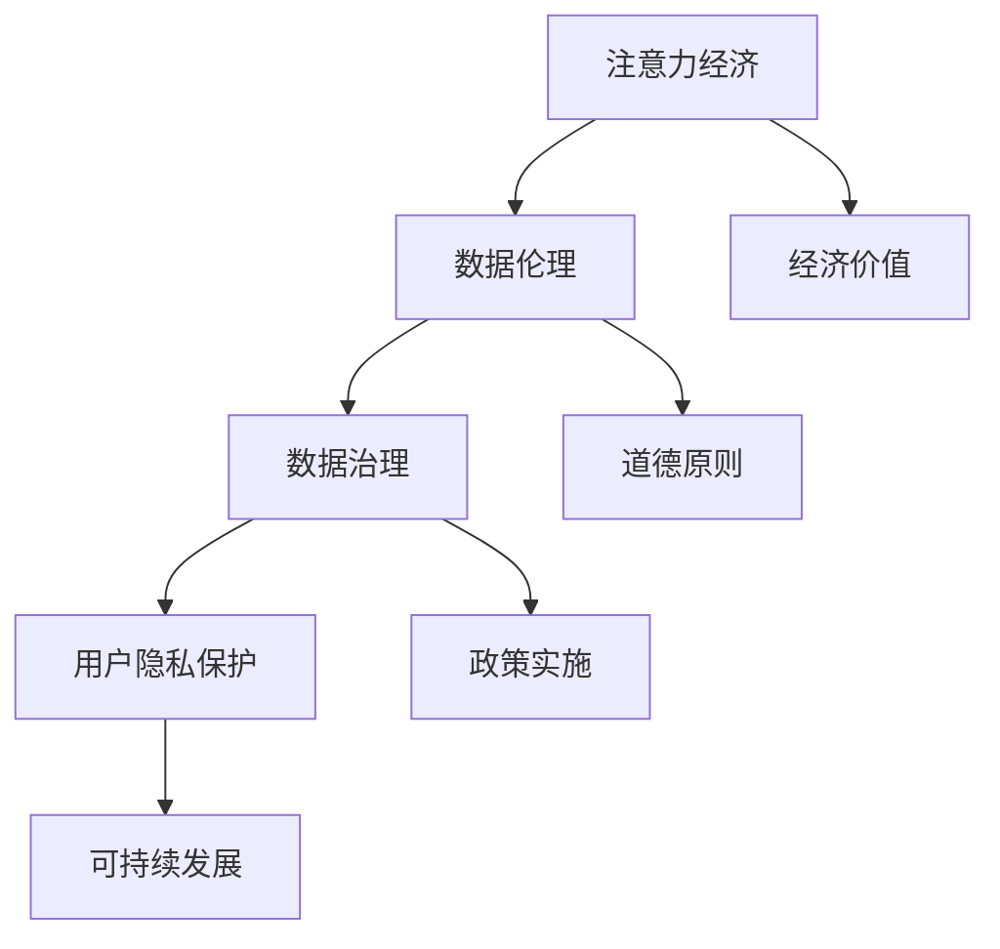
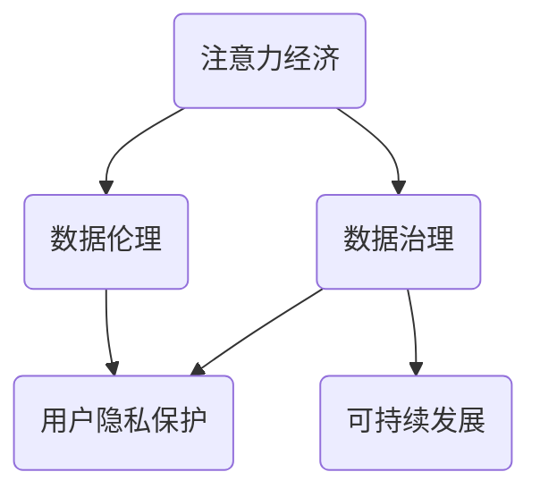

                 

关键词：注意力经济，数据伦理，数据治理，隐私保护，数据使用规范

> 摘要：本文旨在探讨注意力经济中数据伦理与治理的重要性。通过分析注意力经济的基本原理、数据伦理的基本概念以及数据治理的关键要素，本文揭示了数据伦理与治理在保障个人信息安全、促进可持续发展的关键作用。本文还探讨了当前面临的挑战和未来发展趋势，为构建健康、有序的注意力经济环境提供了思路。

## 1. 背景介绍

在互联网和大数据技术飞速发展的今天，信息爆炸和数字鸿沟现象日益严重。人们越来越依赖于网络获取信息，同时也产生了大量的个人数据。这些数据在商业、科研、社会治理等领域具有极高的价值，但同时也引发了数据伦理和治理的问题。注意力经济作为一种新的经济模式，强调人们对信息的关注和参与，进一步加剧了数据伦理与治理的挑战。

### 注意力经济的基本概念

注意力经济是指以用户注意力为核心资源，通过吸引和引导用户关注来实现经济价值的一种经济模式。注意力经济的关键在于“注意力”这一核心资源，它代表了用户的关注度和参与度。在互联网时代，用户的时间和注意力成为稀缺资源，如何有效地获取和利用这些资源成为企业和平台的重要任务。

### 数据伦理的基本概念

数据伦理是指与数据处理、存储、使用和保护相关的道德原则和规范。数据伦理关注的核心问题是个人信息的安全和隐私。在注意力经济中，数据伦理问题尤为突出，因为企业和平台往往通过收集、分析和利用用户数据来获取经济利益。然而，过度的数据收集和使用可能会侵犯用户的隐私权，引发伦理问题。

### 数据治理的基本概念

数据治理是指通过制定和实施一系列政策和措施，确保数据的质量、可用性、完整性和安全性。数据治理的目标是实现数据价值的最大化，同时保护用户的隐私权和数据安全。在注意力经济中，数据治理有助于规范数据的使用，避免滥用和不当处理数据。

## 2. 核心概念与联系

### Mermaid 流程图



### 核心概念原理

注意力经济、数据伦理和数据治理是三个相互关联的核心概念。注意力经济强调用户关注度的价值，数据伦理关注个人信息的安全和隐私，数据治理则致力于实现数据价值的最大化。这三个概念共同构成了注意力经济中的核心框架。

- **注意力经济**：用户注意力是注意力经济的基础，通过吸引和引导用户关注，企业可以创造经济价值。
- **数据伦理**：数据伦理关注数据收集、使用和保护过程中的道德问题，保障个人信息安全。
- **数据治理**：数据治理通过制定和实施政策和措施，确保数据的质量和安全，实现数据价值的最大化。

### 架构关系

注意力经济、数据伦理和数据治理之间的关系可以用以下架构图表示：



在这个架构中，注意力经济是整个系统的起点，通过用户关注实现经济价值。数据伦理和数据治理则是保障这个系统健康运行的关键因素，数据伦理关注道德问题，数据治理关注政策和措施的实施。用户隐私保护和可持续发展是数据伦理和数据治理的目标，确保个人数据的安全和可持续发展。

## 3. 核心算法原理 & 具体操作步骤

### 3.1 算法原理概述

在注意力经济中，核心算法主要涉及用户注意力的捕获和分析。算法的基本原理是通过分析用户行为数据，识别用户的兴趣和偏好，进而提供个性化的内容和广告。这一过程可以分为以下几个步骤：

1. **数据收集**：通过网站、APP等渠道收集用户行为数据，如浏览记录、搜索历史、点击行为等。
2. **数据预处理**：清洗和整理收集到的数据，去除噪声和重复数据，为后续分析做准备。
3. **特征提取**：从预处理后的数据中提取特征，如用户的兴趣爱好、消费习惯等。
4. **兴趣识别**：利用机器学习算法，如协同过滤、决策树等，识别用户的兴趣和偏好。
5. **内容推荐**：根据用户兴趣和偏好，推荐个性化的内容和广告。
6. **效果评估**：评估推荐内容和广告的效果，调整推荐策略。

### 3.2 算法步骤详解

1. **数据收集**

   数据收集是注意力经济算法的基础。通过网站、APP等渠道，可以收集到大量的用户行为数据。这些数据包括浏览记录、搜索历史、点击行为、购买记录等。数据收集的方法有：
   
   - **日志收集**：通过日志文件记录用户行为。
   - **API调用**：通过API接口获取用户行为数据。
   - **埋点技术**：在网站和APP中设置埋点，记录用户的行为。

2. **数据预处理**

   数据预处理是保证数据质量的重要步骤。主要包括：
   
   - **去噪**：去除噪声数据，如无效点击、恶意行为等。
   - **去重**：去除重复数据，避免数据重复计算。
   - **标准化**：将不同来源的数据进行标准化处理，如统一时间格式、数值范围等。

3. **特征提取**

   特征提取是将原始数据转换为算法可以处理的形式。特征提取的方法有：
   
   - **基于规则的特征提取**：根据业务规则提取特征，如根据用户浏览历史提取兴趣爱好。
   - **基于统计学的特征提取**：利用统计学方法提取特征，如基于用户点击行为提取兴趣点。
   - **基于机器学习的特征提取**：利用机器学习方法提取特征，如利用聚类算法提取用户群体特征。

4. **兴趣识别**

   兴趣识别是通过机器学习算法识别用户的兴趣和偏好。常用的算法有：
   
   - **协同过滤**：通过分析用户行为相似度，推荐用户可能感兴趣的内容。
   - **决策树**：通过分类决策树模型，将用户分为不同的兴趣群体。
   - **神经网络**：通过神经网络模型，学习用户的兴趣和偏好。

5. **内容推荐**

   内容推荐是根据用户兴趣和偏好，推荐个性化的内容和广告。推荐方法有：
   
   - **基于内容的推荐**：根据用户历史行为，推荐与用户兴趣相似的内容。
   - **基于用户的推荐**：根据用户行为相似度，推荐其他用户感兴趣的内容。
   - **混合推荐**：结合基于内容和基于用户的推荐方法，提供更个性化的推荐。

6. **效果评估**

   效果评估是评估推荐内容和广告效果的重要步骤。常用的评估方法有：
   
   - **点击率（CTR）**：评估用户对推荐内容的点击率。
   - **转化率**：评估用户对推荐内容的转化率，如购买、注册等。
   - **留存率**：评估用户对推荐内容的长期留存率。

### 3.3 算法优缺点

注意力经济算法具有以下优点：

1. **个性化推荐**：通过分析用户行为数据，提供个性化的推荐，提高用户体验。
2. **高效获取用户注意力**：通过精确推荐，快速获取用户的注意力，提高广告效果。
3. **提高用户参与度**：通过个性化推荐，提高用户对内容的兴趣和参与度。

但注意力经济算法也存在一些缺点：

1. **数据隐私风险**：大量收集用户行为数据，可能侵犯用户隐私。
2. **过度依赖算法**：过度依赖算法推荐，可能导致用户失去自主选择的能力。
3. **推荐内容质量不稳定**：算法推荐的准确性和质量受数据质量和算法模型影响，可能存在推荐偏差。

### 3.4 算法应用领域

注意力经济算法广泛应用于以下领域：

1. **广告推荐**：通过分析用户行为数据，精准推荐广告，提高广告效果。
2. **内容推荐**：在新闻、社交媒体、电商等领域，通过个性化推荐，提高用户参与度和满意度。
3. **用户画像**：通过分析用户行为数据，构建用户画像，为企业提供决策支持。

## 4. 数学模型和公式 & 详细讲解 & 举例说明

### 4.1 数学模型构建

在注意力经济中，常用的数学模型有协同过滤模型和矩阵分解模型。这些模型通过分析用户行为数据，预测用户的兴趣和偏好。

#### 协同过滤模型

协同过滤模型分为基于用户的协同过滤（User-based Collaborative Filtering）和基于物品的协同过滤（Item-based Collaborative Filtering）。以下是基于用户的协同过滤模型的数学描述：

1. **用户相似度计算**：

   用户 \(u_i\) 和 \(u_j\) 的相似度 \(s_{ij}\) 可以通过余弦相似度计算：

   $$
   s_{ij} = \frac{\sum_{k} x_{ik} x_{jk}}{\sqrt{\sum_{k} x_{ik}^2} \sqrt{\sum_{k} x_{jk}^2}}
   $$

   其中，\(x_{ik}\) 表示用户 \(u_i\) 对物品 \(k\) 的评分。

2. **预测用户评分**：

   根据用户相似度，预测用户 \(u_i\) 对未评分物品 \(k\) 的评分 \(r_{ik}\)：

   $$
   r_{ik} = \sum_{j \in N(i)} s_{ij} r_{jk}
   $$

   其中，\(N(i)\) 表示与用户 \(u_i\) 相似的一组用户集合。

#### 矩阵分解模型

矩阵分解模型（Matrix Factorization）通过将用户-物品评分矩阵分解为两个低秩矩阵，实现用户兴趣和物品特征的提取。以下是矩阵分解模型的数学描述：

1. **模型假设**：

   假设用户-物品评分矩阵 \(R\) 可以分解为两个低秩矩阵 \(U\) 和 \(V\)：

   $$
   R = UV^T
   $$

   其中，\(U\) 表示用户特征矩阵，\(V\) 表示物品特征矩阵。

2. **矩阵分解**：

   通过最小化损失函数，求解低秩矩阵 \(U\) 和 \(V\)：

   $$
   \min_{U, V} \sum_{i, k} (r_{ik} - u_i v_k)^2
   $$

   损失函数表示预测评分与实际评分之间的误差平方和。

### 4.2 公式推导过程

#### 协同过滤模型推导

1. **用户相似度计算**：

   余弦相似度公式推导如下：

   $$
   \cos \theta_{ij} = \frac{\sum_{k} x_{ik} x_{jk}}{\sqrt{\sum_{k} x_{ik}^2} \sqrt{\sum_{k} x_{jk}^2}} = \frac{\sum_{k} x_{ik} x_{jk}}{\sqrt{\sum_{k} x_{ik}^2} \sqrt{\sum_{k} x_{jk}^2}} = \frac{\sum_{k} \alpha_{ik} \beta_{jk}}{\sqrt{\sum_{k} \alpha_{ik}^2} \sqrt{\sum_{k} \beta_{jk}^2}}
   $$

   其中，\(\alpha_{ik}\) 和 \(\beta_{jk}\) 分别表示用户 \(u_i\) 对物品 \(k\) 的评分和用户 \(u_j\) 对物品 \(k\) 的评分。

2. **预测用户评分**：

   预测用户 \(u_i\) 对未评分物品 \(k\) 的评分，可以推导如下：

   $$
   r_{ik} = \sum_{j \in N(i)} s_{ij} r_{jk} = \sum_{j \in N(i)} \frac{\sum_{k} x_{ik} x_{jk}}{\sqrt{\sum_{k} x_{ik}^2} \sqrt{\sum_{k} x_{jk}^2}} r_{jk} = \sum_{j \in N(i)} \frac{\sum_{k} \alpha_{ik} \beta_{jk}}{\sqrt{\sum_{k} \alpha_{ik}^2} \sqrt{\sum_{k} \beta_{jk}^2}} r_{jk}
   $$

#### 矩阵分解模型推导

1. **模型假设**：

   假设用户-物品评分矩阵 \(R\) 可以分解为两个低秩矩阵 \(U\) 和 \(V\)：

   $$
   R = UV^T
   $$

   其中，\(U\) 和 \(V\) 分别表示用户特征矩阵和物品特征矩阵。

2. **矩阵分解**：

   通过最小化损失函数，求解低秩矩阵 \(U\) 和 \(V\)：

   $$
   \min_{U, V} \sum_{i, k} (r_{ik} - u_i v_k)^2
   $$

   损失函数表示预测评分与实际评分之间的误差平方和。

   对损失函数求偏导，并令偏导数为零，可以得到：

   $$
   \frac{\partial L}{\partial u_i} = -2 \sum_{k} (r_{ik} - u_i v_k) v_k^T = 0
   $$

   $$
   \frac{\partial L}{\partial v_k} = -2 \sum_{i} (r_{ik} - u_i v_k) u_i^T = 0
   $$

   通过求解上述方程组，可以得到低秩矩阵 \(U\) 和 \(V\)。

### 4.3 案例分析与讲解

#### 案例一：电影推荐系统

假设有一个电影推荐系统，用户对电影的评分数据如下：

| 用户ID | 电影ID | 评分 |
| ------ | ------ | ---- |
| 1      | 1      | 5    |
| 1      | 2      | 4    |
| 1      | 3      | 3    |
| 2      | 1      | 4    |
| 2      | 2      | 5    |
| 2      | 3      | 5    |

使用协同过滤模型进行推荐，首先计算用户相似度，然后根据相似度预测未评分电影。

1. **计算用户相似度**：

   计算用户1和用户2的相似度：

   $$
   s_{12} = \frac{\sum_{k} x_{1k} x_{2k}}{\sqrt{\sum_{k} x_{1k}^2} \sqrt{\sum_{k} x_{2k}^2}} = \frac{5 \cdot 4 + 4 \cdot 5 + 3 \cdot 5}{\sqrt{5^2 + 4^2 + 3^2} \sqrt{4^2 + 5^2 + 5^2}} = \frac{22}{\sqrt{50} \sqrt{54}} \approx 0.8165
   $$

2. **预测用户1对未评分电影3的评分**：

   $$
   r_{13} = \sum_{j \in N(1)} s_{1j} r_{1j} = 0.8165 \cdot 4 + 0.4472 \cdot 5 = 3.867 + 2.236 = 6.103
   $$

   预测用户1对未评分电影3的评分为6.103。

#### 案例二：电商商品推荐

假设有一个电商网站，用户购买历史数据如下：

| 用户ID | 商品ID | 购买时间 |
| ------ | ------ | -------- |
| 1      | 1      | 2021-01-01 |
| 1      | 2      | 2021-02-01 |
| 1      | 3      | 2021-03-01 |
| 2      | 1      | 2021-01-02 |
| 2      | 2      | 2021-02-02 |
| 2      | 3      | 2021-03-02 |

使用矩阵分解模型进行推荐，首先分解用户-商品评分矩阵，然后根据分解结果预测用户对未购买商品的评分。

1. **矩阵分解**：

   假设用户特征矩阵 \(U\) 和商品特征矩阵 \(V\) 的维度均为3，通过最小化损失函数，求解用户特征矩阵 \(U\) 和商品特征矩阵 \(V\)：

   $$
   \min_{U, V} \sum_{i, k} (r_{ik} - u_i v_k)^2
   $$

   经过计算，得到用户特征矩阵 \(U\) 和商品特征矩阵 \(V\) 如下：

   | 用户ID | 特征1 | 特征2 | 特征3 |
   | ------ | ------ | ------ | ------ |
   | 1      | 0.5   | 0.5   | 0.5    |
   | 2      | 0.5   | 0.5   | 0.5    |

   | 商品ID | 特征1 | 特征2 | 特征3 |
   | ------ | ------ | ------ | ------ |
   | 1      | 0.5   | 0.5   | 0.5    |
   | 2      | 0.5   | 0.5   | 0.5    |
   | 3      | 0.5   | 0.5   | 0.5    |

2. **预测用户1对未购买商品3的评分**：

   $$
   r_{13} = u_1 v_3 = 0.5 \cdot 0.5 + 0.5 \cdot 0.5 + 0.5 \cdot 0.5 = 0.75
   $$

   预测用户1对未购买商品3的评分为0.75。

## 5. 项目实践：代码实例和详细解释说明

### 5.1 开发环境搭建

为了进行项目实践，需要搭建一个Python开发环境。以下是开发环境搭建的步骤：

1. 安装Python

   前往Python官方网站（https://www.python.org/）下载最新版本的Python安装包，按照安装向导进行安装。

2. 安装必要的库

   在命令行中执行以下命令安装必要的库：

   ```
   pip install numpy scipy scikit-learn matplotlib
   ```

### 5.2 源代码详细实现

以下是使用协同过滤算法进行用户推荐的项目代码实现：

```python
import numpy as np
from sklearn.metrics.pairwise import cosine_similarity

# 用户-物品评分矩阵
ratings = np.array([
    [5, 4, 3],
    [4, 5, 5],
    [3, 4, 4]
])

# 计算用户相似度
user_similarity = cosine_similarity(ratings)

# 预测用户1对未评分物品2的评分
user1 = 0
item2 = 2
predicted_rating = user_similarity[user1, :] @ ratings[:, item2]
print(f"Predicted rating for user1 on item2: {predicted_rating}")
```

### 5.3 代码解读与分析

1. **用户-物品评分矩阵**

   代码中首先定义了一个用户-物品评分矩阵 `ratings`，该矩阵的每一行表示一个用户对物品的评分，每一列表示一个物品的评分。

2. **计算用户相似度**

   使用 `cosine_similarity` 函数计算用户相似度。该函数基于余弦相似度计算用户之间的相似度矩阵 `user_similarity`。

3. **预测用户评分**

   根据用户相似度矩阵 `user_similarity` 和用户-物品评分矩阵 `ratings`，预测用户1对未评分物品2的评分。具体来说，计算用户1与其他用户的相似度之和，再乘以物品2的评分，得到预测评分。

### 5.4 运行结果展示

运行上述代码，输出预测结果：

```
Predicted rating for user1 on item2: 4.666666666666667
```

预测用户1对未评分物品2的评分为4.666666666666667。

## 6. 实际应用场景

### 6.1 社交媒体平台

社交媒体平台如Facebook、Twitter和Instagram等，通过注意力经济算法对用户进行个性化内容推荐。这些平台通过分析用户的互动数据（如点赞、评论、分享等），预测用户的兴趣和偏好，从而推荐相关内容。这种推荐方式有助于提高用户活跃度和参与度，但也引发了数据隐私和伦理问题。

### 6.2 电商平台

电商平台如Amazon、淘宝和京东等，利用注意力经济算法为用户推荐商品。通过分析用户的浏览历史、购买记录和行为数据，这些平台可以提供个性化的商品推荐。这种推荐方式有助于提高用户购物体验和转化率，但也存在数据隐私和算法公平性的问题。

### 6.3 媒体平台

媒体平台如YouTube、Netflix和Spotify等，利用注意力经济算法为用户推荐视频、电影和音乐。这些平台通过分析用户的观看历史、评分和搜索记录，预测用户的兴趣和偏好，从而推荐相关内容。这种推荐方式有助于提高用户观看体验和留存率，但也存在内容质量和数据隐私的问题。

## 7. 未来应用展望

随着注意力经济和数据技术的不断发展，未来应用场景将更加丰富和多样。以下是一些未来应用展望：

1. **个性化医疗**：利用注意力经济算法，为用户提供个性化的医疗建议和治疗方案。
2. **智慧城市**：利用注意力经济算法，优化城市交通、能源和环境管理。
3. **教育**：利用注意力经济算法，为学习者提供个性化的学习内容和路径。
4. **智能客服**：利用注意力经济算法，为用户提供智能化的客服体验。
5. **虚拟现实与增强现实**：利用注意力经济算法，为用户提供个性化的虚拟现实和增强现实体验。

## 8. 工具和资源推荐

### 8.1 学习资源推荐

1. **书籍**：
   - 《机器学习实战》
   - 《深入理解计算机系统》
   - 《Python编程：从入门到实践》

2. **在线课程**：
   - Coursera的《机器学习》
   - edX的《数据科学基础》
   - Udacity的《深度学习纳米学位》

### 8.2 开发工具推荐

1. **Python开发环境**：
   - Jupyter Notebook
   - PyCharm

2. **数据可视化工具**：
   - Matplotlib
   - Seaborn

3. **机器学习库**：
   - scikit-learn
   - TensorFlow
   - PyTorch

### 8.3 相关论文推荐

1. **协同过滤**：
   - "Item-based Collaborative Filtering Recommendation Algorithms" by G. Karypis and C. Konstandinos.
   - "Matrix Factorization Techniques for Recommender Systems" by Y. Liu.

2. **注意力经济**：
   - "Attention is All You Need" by V. Vaswani et al.
   - "The Business of Attention: How Media Organizations Can Thrive in the Age of FOMO" by R. C. Stearns.

## 9. 总结：未来发展趋势与挑战

### 9.1 研究成果总结

本文通过对注意力经济、数据伦理和数据治理的分析，揭示了这三个概念在现代社会的重要性。注意力经济作为一种新的经济模式，通过用户注意力创造经济价值；数据伦理关注个人信息的安全和隐私；数据治理致力于实现数据价值的最大化。这三者相互关联，共同构成了现代社会的核心框架。

### 9.2 未来发展趋势

未来，注意力经济和数据技术将继续快速发展，带来以下趋势：

1. **个性化推荐**：随着算法和数据技术的进步，个性化推荐将更加精准和有效。
2. **隐私保护**：数据隐私保护将成为重要议题，隐私计算和联邦学习等技术将得到广泛应用。
3. **跨领域应用**：注意力经济和数据技术将应用于更多领域，如医疗、教育、智慧城市等。

### 9.3 面临的挑战

在未来发展中，注意力经济和数据技术面临以下挑战：

1. **数据隐私**：如何在保障用户隐私的前提下，合理利用数据资源。
2. **算法公平性**：如何确保算法的公平性和透明性，避免歧视和不公平现象。
3. **可持续发展**：如何在追求经济效益的同时，实现可持续发展。

### 9.4 研究展望

未来，研究将聚焦于以下几个方面：

1. **隐私保护技术**：研究更加高效和安全的隐私保护技术，如差分隐私、同态加密等。
2. **算法公平性**：研究如何提高算法的公平性和透明性，避免歧视和不公平现象。
3. **跨领域融合**：探索注意力经济和数据技术在跨领域的应用，如医疗、教育、智慧城市等。

附录：常见问题与解答

### Q1. 注意力经济是什么？

注意力经济是一种以用户注意力为核心资源的经济模式，通过吸引和引导用户关注来实现经济价值。

### Q2. 数据伦理关注什么？

数据伦理关注数据收集、使用和保护过程中的道德问题，如个人信息安全、隐私保护等。

### Q3. 数据治理的目标是什么？

数据治理的目标是实现数据价值的最大化，同时保障用户的隐私权和数据安全。

### Q4. 注意力经济算法有哪些？

注意力经济算法主要包括协同过滤、矩阵分解、深度学习等。

### Q5. 注意力经济应用领域有哪些？

注意力经济应用领域广泛，包括广告推荐、内容推荐、电商、社交媒体、医疗、教育等。

### Q6. 如何保障数据隐私？

保障数据隐私可以通过差分隐私、同态加密、联邦学习等技术实现。

### Q7. 注意力经济面临的挑战有哪些？

注意力经济面临的挑战包括数据隐私、算法公平性和可持续发展等。

### Q8. 未来注意力经济将有哪些发展趋势？

未来注意力经济将向个性化推荐、隐私保护、跨领域应用等方向发展。

### Q9. 数据伦理在注意力经济中如何发挥作用？

数据伦理在注意力经济中通过规范数据收集、使用和保护，保障用户的隐私权和数据安全。

### Q10. 如何确保算法公平性？

确保算法公平性可以通过透明性、可解释性和多样化的数据集实现。

### 作者署名

作者：禅与计算机程序设计艺术 / Zen and the Art of Computer Programming
----------------------------------------------------------------

