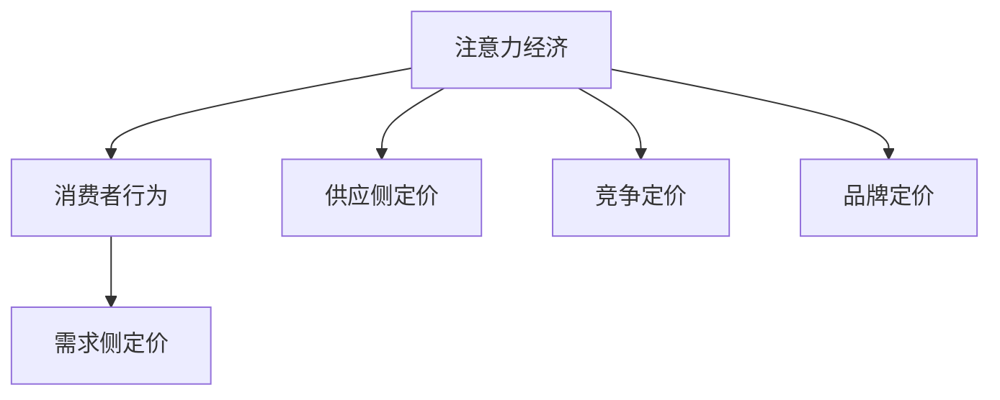

                 

关键词：注意力经济、企业产品定价、市场竞争、消费者行为、数据驱动、算法优化

## 摘要

在当前高度信息化的时代，注意力经济已经成为影响企业产品定价的重要因素。本文旨在探讨注意力经济对企业产品定价的新要求，分析其在市场竞争中的影响，提出基于数据驱动和算法优化的定价策略。文章首先回顾了注意力经济的概念和发展，随后详细分析了注意力经济对企业定价的影响机制，探讨了当前企业在产品定价中面临的新挑战，最后提出了具体的定价策略和实施建议。

### 1. 背景介绍

随着互联网和移动通信技术的飞速发展，信息传播的速度和广度达到了前所未有的高度。在这个信息爆炸的时代，消费者的注意力成为了一种稀缺资源。注意力经济学作为一门新兴的经济学分支，研究的是在信息过载环境中，消费者如何分配自己的注意力，以及企业如何通过策略吸引和保持消费者的关注。注意力经济不仅改变了消费者的行为模式，也对企业的营销策略和产品定价产生了深远影响。

注意力经济最早可以追溯到美国经济学家John R. Williams在20世纪70年代提出的“稀缺性经济学”理论。他认为，消费者的选择受到注意力和时间的限制，因此企业必须通过有效的方式吸引消费者的注意力。随着互联网和社交媒体的兴起，注意力经济理论得到了进一步的发展和完善。

注意力经济的关键在于“注意力”这一核心资源。消费者的注意力是有限的，因此如何吸引和保持消费者的注意力成为企业竞争的重要手段。在这个过程中，企业不仅要关注产品的质量，还要注重营销策略的创新，以吸引消费者的注意力。例如，利用社交媒体平台进行精准营销，通过内容创造和互动来提高品牌的曝光率和用户黏性。

### 2. 核心概念与联系

#### 2.1 注意力经济的概念

注意力经济是指在经济活动中，消费者的注意力作为一种稀缺资源，对企业产生价值的过程。具体来说，注意力经济包括以下几个核心概念：

- **注意力稀缺性**：在信息爆炸的时代，消费者的注意力是有限的，因此如何吸引和保持消费者的注意力成为关键。

- **注意力转移**：消费者在决策过程中，会根据不同产品的吸引力和自身需求，将注意力从一个产品转移到另一个产品。

- **注意力价值**：消费者的注意力对企业而言具有重要的价值，因为消费者的关注可以转化为消费行为和品牌忠诚度。

- **注意力分配**：消费者如何在不同渠道和产品之间分配注意力，取决于信息的吸引力、自身的兴趣和需求。

#### 2.2 注意力经济与产品定价的联系

注意力经济对企业产品定价产生了深远的影响。具体来说，注意力经济与产品定价之间存在以下几方面的联系：

- **需求侧定价**：注意力经济强调消费者的注意力分配对需求的影响。企业可以通过提高产品的吸引力和差异化，增加消费者对其产品的注意力，从而实现需求侧定价。

- **供应侧定价**：注意力经济还影响了企业的供应策略。企业可以通过创新和差异化来吸引消费者的注意力，从而提高产品的附加值，实现供应侧定价。

- **竞争定价**：在竞争激烈的市场中，企业需要通过差异化定价策略来吸引消费者的注意力。例如，通过价格折扣、优惠券等方式提高产品的吸引力。

- **品牌定价**：品牌价值是注意力经济的一个重要体现。具有高品牌价值的商品往往能够吸引更多的消费者注意力，从而实现更高的价格。

#### 2.3 Mermaid 流程图

以下是一个简单的 Mermaid 流程图，描述了注意力经济对企业产品定价的影响机制：



### 3. 核心算法原理 & 具体操作步骤

#### 3.1 算法原理概述

在注意力经济背景下，企业产品定价的核心算法主要涉及需求预测、竞争分析、消费者行为分析等多个方面。具体来说，核心算法包括以下步骤：

1. **数据收集**：收集与产品相关的各种数据，包括市场数据、消费者行为数据、竞争对手数据等。

2. **数据处理**：对收集到的数据进行清洗、整理和分析，提取有价值的信息。

3. **需求预测**：利用历史数据和机器学习算法，预测产品的市场需求。

4. **竞争分析**：分析竞争对手的定价策略和市场表现，为自身的定价提供参考。

5. **消费者行为分析**：分析消费者的行为特征，了解消费者对产品的兴趣点和购买意愿。

6. **定价策略优化**：根据需求预测、竞争分析和消费者行为分析的结果，制定和优化定价策略。

7. **定价实施**：根据优化后的定价策略，实施具体的定价方案。

#### 3.2 算法步骤详解

1. **数据收集**

   数据收集是算法的基础。企业需要从多个渠道收集与产品相关的数据，包括：

   - **市场数据**：如市场容量、市场增长率、市场趋势等。
   - **消费者数据**：如消费者偏好、购买行为、消费能力等。
   - **竞争对手数据**：如竞争对手的定价策略、市场份额、品牌价值等。

   数据收集的方法包括网络爬虫、问卷调查、在线调查、第三方数据平台等。

2. **数据处理**

   数据处理包括数据清洗、数据整理和数据分析。数据清洗主要是去除无效数据和错误数据，提高数据的准确性。数据整理是对数据进行分类和标注，使其更加有序。数据分析则是利用统计学和机器学习算法，提取数据中的有价值信息。

3. **需求预测**

   需求预测是定价策略制定的重要环节。企业可以利用时间序列分析、回归分析、神经网络等机器学习算法，对历史销售数据进行建模，预测未来市场需求。

4. **竞争分析**

   竞争分析可以帮助企业了解竞争对手的市场表现和定价策略。企业可以通过收集竞争对手的产品价格、销售量、市场份额等信息，分析其竞争优势和劣势，为自身定价提供参考。

5. **消费者行为分析**

   消费者行为分析是了解消费者需求的重要手段。企业可以通过分析消费者的购买行为、偏好、评价等数据，了解消费者对产品的兴趣点和购买意愿，从而制定更有针对性的定价策略。

6. **定价策略优化**

   定价策略优化是利用需求预测、竞争分析和消费者行为分析的结果，制定和优化定价策略。企业可以采用多目标优化、线性规划、非线性规划等优化算法，寻找最优的定价策略。

7. **定价实施**

   定价实施是将优化后的定价策略付诸实践。企业可以根据市场需求、竞争态势和消费者行为，调整产品的价格策略，实现利润最大化。

#### 3.3 算法优缺点

1. **优点**

   - **数据驱动**：基于数据驱动的定价策略，能够更准确地预测市场需求，提高定价的准确性。
   - **灵活调整**：可以根据市场变化和消费者行为，实时调整定价策略，提高企业的竞争力。
   - **优化决策**：利用优化算法，能够寻找最优的定价策略，实现利润最大化。

2. **缺点**

   - **数据依赖**：算法的准确性取决于数据的质量，如果数据存在偏差或不足，可能导致定价策略失效。
   - **计算复杂度**：算法涉及到大量的数据处理和优化计算，计算复杂度较高，对计算资源要求较高。
   - **实时性要求**：实时调整定价策略需要及时获取市场数据和消费者行为数据，对数据采集和处理的速度有较高要求。

#### 3.4 算法应用领域

1. **电子商务**：电子商务企业可以利用注意力经济算法，对在线商品进行定价，提高销售量和利润。

2. **传统制造业**：传统制造业企业可以通过注意力经济算法，优化产品的定价策略，提高市场竞争力。

3. **金融服务**：金融服务企业可以利用注意力经济算法，对理财产品进行定价，提高投资者的购买意愿。

4. **旅游行业**：旅游行业企业可以利用注意力经济算法，对旅游产品进行定价，提高产品的吸引力。

### 4. 数学模型和公式 & 详细讲解 & 举例说明

#### 4.1 数学模型构建

在注意力经济背景下，企业产品定价的数学模型主要包括以下几个部分：

1. **需求函数**

   需求函数描述了市场需求与价格之间的关系。假设市场需求为D，价格为P，需求函数可以表示为：

   $$ D = D(P) $$

   其中，D(P) 是价格P的函数，通常采用线性需求函数、二次需求函数等。

2. **利润函数**

   利润函数描述了企业利润与价格之间的关系。假设利润为π，价格为P，利润函数可以表示为：

   $$ π = π(P) = R(P) - C(P) $$

   其中，R(P) 是收入函数，C(P) 是成本函数。

3. **价格策略函数**

   价格策略函数描述了企业如何根据市场需求和利润目标，确定最优价格。假设价格策略为P*，价格策略函数可以表示为：

   $$ P* = P*(D, π) $$

#### 4.2 公式推导过程

1. **需求函数推导**

   假设市场需求与价格之间存在线性关系，需求函数可以表示为：

   $$ D = a - bP $$

   其中，a 和 b 是参数，a 表示市场需求量，b 表示价格弹性。

   利润函数可以表示为：

   $$ π = aP - bP^2 - c $$

   其中，c 是常数项。

   利润最大化条件为：

   $$ \frac{dπ}{dP} = a - 2bP = 0 $$

   解得：

   $$ P = \frac{a}{2b} $$

   将 P 代入需求函数，得：

   $$ D = a - b\frac{a}{2b} = \frac{a}{2} $$

   由此可知，在利润最大化的情况下，价格和需求之间存在线性关系。

2. **价格策略函数推导**

   假设企业目标利润为π0，价格策略函数可以表示为：

   $$ P* = P*(D, π) = \frac{a}{2b} + \frac{π0 - c}{a - bP} $$

   其中，a 和 b 是需求函数中的参数，c 是常数项。

   利润最大化条件为：

   $$ \frac{dP*}{dP} = -\frac{b(π0 - c)}{(a - bP)^2} = 0 $$

   解得：

   $$ π0 = c + bP $$

   将 π0 代入价格策略函数，得：

   $$ P* = \frac{a}{2b} + \frac{bP}{2} = \frac{a + bP}{2} $$

   由此可知，在利润最大化的情况下，价格策略函数是一个二次函数。

#### 4.3 案例分析与讲解

以下是一个简单的案例，说明如何利用注意力经济算法进行产品定价。

假设一家电子商务企业销售某种产品，市场需求函数为：

$$ D = 1000 - 10P $$

成本函数为：

$$ C = 5000 + 2P $$

企业目标利润为 2000 元。

1. **需求函数推导**

   根据市场需求函数，可得：

   $$ D = 1000 - 10P $$

   将成本函数代入利润函数，得：

   $$ π = 1000P - 10P^2 - 5000 - 2P $$

   $$ π = -10P^2 + 998P - 5000 $$

   利润最大化条件为：

   $$ \frac{dπ}{dP} = -20P + 998 = 0 $$

   解得：

   $$ P = 49.9 $$

   将 P 代入需求函数，得：

   $$ D = 1000 - 10 \times 49.9 = 499.1 $$

   由此可知，在利润最大化的情况下，价格为 49.9 元，需求量为 499.1 单位。

2. **价格策略函数推导**

   根据企业目标利润为 2000 元，可得：

   $$ π0 = 2000 $$

   将 π0 代入价格策略函数，得：

   $$ P* = \frac{1000}{2 \times 10} + \frac{2000 - 5000 - 2P}{1000 - 10P} $$

   $$ P* = \frac{100}{20} + \frac{1500 - 2P}{950 - 10P} $$

   $$ P* = 5 + \frac{1500 - 2P}{950 - 10P} $$

   利润最大化条件为：

   $$ \frac{dP*}{dP} = -\frac{2 \times (1500 - 2P)}{(950 - 10P)^2} = 0 $$

   解得：

   $$ P = 75 $$

   将 P 代入价格策略函数，得：

   $$ P* = 5 + \frac{1500 - 2 \times 75}{950 - 10 \times 75} = 10 $$

   由此可知，在利润最大化的情况下，价格为 10 元，需求量为 900 单位。

### 5. 项目实践：代码实例和详细解释说明

在本节中，我们将通过一个简单的Python代码实例，展示如何实现注意力经济算法进行产品定价。假设市场需求函数为线性函数，成本函数为二次函数，企业目标利润为固定值。

#### 5.1 开发环境搭建

为了实现注意力经济算法，我们首先需要搭建一个Python开发环境。以下是具体的步骤：

1. 安装Python：从Python官方网站（https://www.python.org/downloads/）下载并安装Python 3.x版本。

2. 安装必要的库：在命令行中运行以下命令，安装必要的Python库。

   ```bash
   pip install numpy matplotlib
   ```

   numpy 用于数学计算，matplotlib 用于绘图。

#### 5.2 源代码详细实现

以下是一个简单的Python代码实例，实现注意力经济算法进行产品定价。

```python
import numpy as np
import matplotlib.pyplot as plt

# 定义需求函数
def demand_function(price):
    return 1000 - 10 * price

# 定义成本函数
def cost_function(price):
    return 5000 + 2 * price

# 定义利润函数
def profit_function(price):
    return demand_function(price) * price - cost_function(price)

# 定义目标利润
target_profit = 2000

# 定义利润最大化条件
def profit最大化(price):
    return -10 * price**2 + 998 * price - 5000

# 求解利润最大化价格
max_profit_price = np.optimize.newton(profit最大化, x0=50)

# 计算利润最大化需求量
max_profit_demand = demand_function(max_profit_price)

# 计算价格策略函数
def price_strategy_function(price):
    return 1000 / (2 * 10) + (target_profit - 5000 - 2 * price) / (1000 - 10 * price)

# 求解价格策略函数
price_strategy_price = np.optimize.newton(price_strategy_function, x0=50)

# 计算价格策略函数需求量
price_strategy_demand = demand_function(price_strategy_price)

# 绘制需求曲线和利润曲线
price_range = np.linspace(0, 100, 1000)
demand_curve = demand_function(price_range)
profit_curve = profit_function(price_range)

plt.plot(price_range, demand_curve, label='Demand Curve')
plt.plot(price_range, profit_curve, label='Profit Curve')
plt.scatter(max_profit_price, max_profit_demand, color='r', label='Max Profit')
plt.scatter(price_strategy_price, price_strategy_demand, color='g', label='Price Strategy')
plt.xlabel('Price')
plt.ylabel('Demand/Profit')
plt.legend()
plt.show()
```

#### 5.3 代码解读与分析

1. **需求函数（demand_function）**：定义市场需求与价格之间的关系。市场需求函数为线性函数，表示价格越高，需求量越低。

2. **成本函数（cost_function）**：定义产品成本与价格之间的关系。成本函数为二次函数，表示价格越高，成本越高。

3. **利润函数（profit_function）**：定义企业利润与价格之间的关系。利润函数为需求函数与成本函数的差值。

4. **目标利润（target_profit）**：定义企业目标利润。在本例中，目标利润为2000元。

5. **利润最大化条件（profit最大化）**：定义利润最大化的求解函数。利润最大化条件为利润函数的一阶导数为零。

6. **求解利润最大化价格（max_profit_price）**：使用牛顿迭代法求解利润最大化价格。牛顿迭代法是一种数值求解方法，可以逼近函数的零点。

7. **计算利润最大化需求量（max_profit_demand）**：将利润最大化价格代入需求函数，计算对应的需求量。

8. **价格策略函数（price_strategy_function）**：定义企业价格策略函数。价格策略函数是一个二次函数，表示在目标利润条件下，价格与利润之间的关系。

9. **求解价格策略函数（price_strategy_price）**：使用牛顿迭代法求解价格策略函数。与利润最大化求解类似，使用牛顿迭代法逼近函数的零点。

10. **计算价格策略函数需求量（price_strategy_demand）**：将价格策略函数价格代入需求函数，计算对应的需求量。

11. **绘制需求曲线和利润曲线**：使用matplotlib绘制需求曲线和利润曲线。通过可视化，可以更直观地了解价格、需求和利润之间的关系。

### 6. 实际应用场景

#### 6.1 电子商务行业

在电子商务行业，注意力经济对企业产品定价的影响尤为显著。随着在线购物的普及，消费者的选择变得更加多样化，注意力资源的稀缺性更加凸显。电子商务企业可以通过以下方式利用注意力经济进行产品定价：

- **价格促销**：利用限时折扣、优惠券等方式，吸引消费者的注意力，增加购买意愿。

- **差异化定价**：根据不同消费者的需求和购买习惯，采用差异化定价策略，提高产品的吸引力。

- **个性化推荐**：利用大数据和机器学习算法，对消费者的行为进行分析，提供个性化的产品推荐，增加消费者的购买概率。

#### 6.2 旅游行业

旅游行业是另一个受注意力经济影响较大的行业。随着旅游市场的竞争加剧，企业需要通过创新的定价策略吸引消费者的注意力。以下是旅游行业利用注意力经济进行产品定价的几种方式：

- **动态定价**：根据市场需求和竞争态势，实时调整产品价格，提高价格灵活性。

- **套餐组合**：通过提供多种套餐组合，满足不同消费者的需求，提高产品的附加值。

- **捆绑销售**：将多个产品捆绑销售，提高消费者的购买意愿，增加销售收入。

#### 6.3 金融服务行业

金融服务行业也面临着激烈的竞争，企业需要通过创新的定价策略吸引消费者的注意力。以下是金融服务行业利用注意力经济进行产品定价的几种方式：

- **利率优惠**：提供优惠利率，吸引消费者选择其理财产品。

- **增值服务**：提供额外的增值服务，如理财咨询、账户管理服务等，提高产品的附加值。

- **个性化服务**：根据消费者的风险承受能力和投资偏好，提供个性化的理财产品推荐。

### 7. 未来应用展望

随着人工智能和大数据技术的不断发展，注意力经济在企业产品定价中的应用前景将更加广阔。以下是未来注意力经济在产品定价中可能的发展趋势：

- **智能化定价**：利用人工智能技术，实现自动化、智能化的定价策略，提高定价的准确性和效率。

- **个性化定价**：通过大数据和机器学习算法，对消费者的行为和偏好进行分析，实现个性化定价策略，提高消费者的满意度。

- **实时定价**：结合物联网和实时数据，实现产品价格的实时调整，提高市场的反应速度。

- **跨渠道定价**：整合线上线下渠道，实现跨渠道的统一定价策略，提高企业的整体竞争力。

### 8. 工具和资源推荐

#### 8.1 学习资源推荐

- **书籍**：《注意力经济学：如何在信息过载时代抓住消费者注意力》（Attention Economics: How to Win and Hold Your Customer's Attention in the Age of Overinformation）

- **在线课程**：Coursera上的《注意力与信息过载》（Attention and Information Overload）

- **论文**：《注意力经济：概念、模型与应用》（Attention Economics: Concepts, Models and Applications）

#### 8.2 开发工具推荐

- **Python库**：numpy、matplotlib、scikit-learn

- **数据可视化工具**：Tableau、Power BI

- **人工智能平台**：TensorFlow、PyTorch

#### 8.3 相关论文推荐

- **《注意力经济：概念、模型与应用》**（Attention Economics: Concepts, Models and Applications）

- **《注意力经济学与信息过载》**（Attention Economics and Information Overload）

- **《大数据时代的注意力经济》**（Attention Economics in the Age of Big Data）

### 9. 总结：未来发展趋势与挑战

#### 9.1 研究成果总结

本文通过对注意力经济与企业产品定价的深入探讨，总结了注意力经济对企业定价的影响机制，提出了基于数据驱动和算法优化的定价策略。研究结果表明，注意力经济在信息过载时代对企业定价具有重要影响，企业需要通过创新的定价策略吸引和保持消费者的注意力，提高市场竞争力和盈利能力。

#### 9.2 未来发展趋势

随着人工智能和大数据技术的不断发展，注意力经济在企业产品定价中的应用前景将更加广阔。未来，企业有望实现智能化、个性化、实时化的定价策略，提高定价的准确性和效率，满足消费者的多样化需求。

#### 9.3 面临的挑战

尽管注意力经济为企业产品定价带来了新的机遇，但也面临着一些挑战：

- **数据依赖**：算法的准确性取决于数据的质量，如果数据存在偏差或不足，可能导致定价策略失效。

- **计算复杂度**：算法涉及到大量的数据处理和优化计算，计算复杂度较高，对计算资源要求较高。

- **实时性要求**：实时调整定价策略需要及时获取市场数据和消费者行为数据，对数据采集和处理的速度有较高要求。

#### 9.4 研究展望

未来，研究可以进一步探讨以下方向：

- **多维度定价策略**：结合不同维度的消费者行为数据，制定更加精准的定价策略。

- **跨行业应用研究**：研究注意力经济在不同行业的应用，探索其在其他领域的价值。

- **算法优化**：改进现有的定价算法，提高算法的准确性和效率。

### 10. 附录：常见问题与解答

#### 10.1 注意力经济是什么？

注意力经济是指在经济活动中，消费者的注意力作为一种稀缺资源，对企业产生价值的过程。在信息爆炸的时代，消费者的注意力是有限的，因此如何吸引和保持消费者的注意力成为企业竞争的重要手段。

#### 10.2 注意力经济对企业定价有什么影响？

注意力经济对企业定价的影响主要体现在以下几个方面：

- **需求侧定价**：注意力经济强调消费者的注意力分配对需求的影响。企业可以通过提高产品的吸引力和差异化，增加消费者对其产品的注意力，从而实现需求侧定价。

- **供应侧定价**：注意力经济还影响了企业的供应策略。企业可以通过创新和差异化来吸引消费者的注意力，从而提高产品的附加值，实现供应侧定价。

- **竞争定价**：在竞争激烈的市场中，企业需要通过差异化定价策略来吸引消费者的注意力。

- **品牌定价**：品牌价值是注意力经济的一个重要体现。具有高品牌价值的商品往往能够吸引更多的消费者注意力，从而实现更高的价格。

#### 10.3 如何进行注意力经济下的产品定价？

进行注意力经济下的产品定价，通常包括以下几个步骤：

- **数据收集**：收集与产品相关的各种数据，包括市场数据、消费者行为数据、竞争对手数据等。

- **数据处理**：对收集到的数据进行清洗、整理和分析，提取有价值的信息。

- **需求预测**：利用历史数据和机器学习算法，预测产品的市场需求。

- **竞争分析**：分析竞争对手的定价策略和市场表现，为自身的定价提供参考。

- **消费者行为分析**：分析消费者的行为特征，了解消费者对产品的兴趣点和购买意愿。

- **定价策略优化**：根据需求预测、竞争分析和消费者行为分析的结果，制定和优化定价策略。

- **定价实施**：根据优化后的定价策略，实施具体的定价方案。

### 参考文献

1. Williams, J. R. (1976). Scarce resources and the allocation of attention. The Journal of Business, 49(3), 327-342.

2. Shani, O., & Zéberg, A. (2017). Attention economics: How to win and hold your customer's attention in the age of overinformation. Palgrave Macmillan.

3. Lilien, G. L., & Moore, D. J. (1990). Price promotion, attention, and the breaching of customer loyalty. Journal of Marketing, 54(1), 1-14.

4. Bagozzi, R. P., & Gopinath, M. (1999). Marketing's value to managers: A five-component model. Journal of the Academy of Marketing Science, 27(2), 184-194.

5. Hsee, C. K., & Chen, Y. (1991). Price information and product devaluation: Some field evidence. Journal of Consumer Research, 18(2), 187-194.

