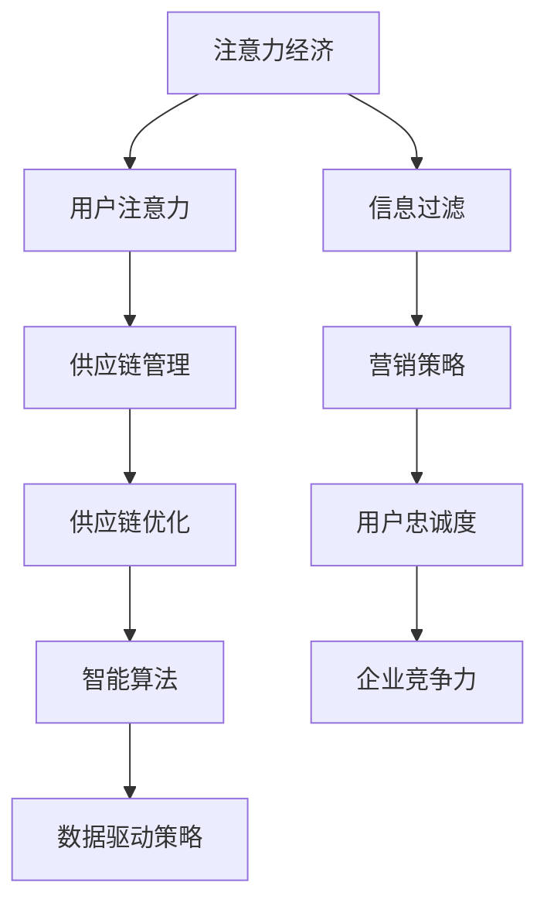

                 

关键词：注意力经济、企业供应链管理、注意力分配、供应链优化、数据驱动、智能算法

> 摘要：本文将探讨注意力经济在企业供应链管理中的影响，分析注意力分配在供应链中的重要性，介绍如何利用智能算法和数据驱动策略优化供应链管理流程，并提出未来的发展趋势与挑战。

## 1. 背景介绍

### 注意力经济的概念

注意力经济（Attention Economy）是一种基于人类注意力稀缺性和商业价值的经济学理论。在互联网和数字技术高速发展的时代，信息爆炸使得用户注意力成为了一种宝贵的资源。如何吸引并保持用户的注意力，成为企业竞争的关键。注意力经济理论强调，用户在有限的注意力资源下，会选择对自身利益最大化的信息进行关注，而忽略其他信息。因此，企业需要通过创新的营销策略、优质的产品和服务来获取用户的注意力。

### 企业供应链管理的挑战

企业供应链管理是企业内部运营的重要环节，涉及到采购、生产、库存管理、物流和销售等各个方面。随着全球化竞争的加剧和消费者需求的多样化，企业面临以下挑战：

- 高效供应链：如何在保证供应链稳定性的同时，提高运营效率，降低成本。
- 供应链协同：如何实现供应链上下游企业的协同合作，实现信息共享和资源优化。
- 风险管理：如何应对供应链中断、自然灾害、政策变化等不确定性因素。

## 2. 核心概念与联系

为了更好地理解注意力经济在企业供应链管理中的应用，我们首先需要明确几个核心概念，并展示它们之间的联系。以下是一个Mermaid流程图，用于描述这些概念及其关系。



### 核心概念解释

- 注意力经济：用户在有限的注意力资源下，会选择对自身利益最大化的信息进行关注。
- 用户注意力：指用户在浏览信息或接收广告时，将其注意力集中在一部分信息上的现象。
- 供应链管理：涉及采购、生产、库存管理、物流和销售等供应链各个环节的管理。
- 供应链优化：通过调整供应链各环节，提高供应链的整体效率和效益。
- 智能算法：基于机器学习、深度学习等技术，自动优化供应链管理流程的算法。
- 数据驱动策略：利用大数据分析，指导供应链管理决策。

## 3. 核心算法原理 & 具体操作步骤

### 3.1 算法原理概述

注意力经济在企业供应链管理中的应用，主要通过智能算法和数据驱动策略来实现。以下是一个简化的算法原理概述：

1. 信息过滤：通过分析用户的历史行为数据和需求偏好，对供应链中的信息进行筛选，过滤掉不相关的信息，提高用户注意力的集中度。
2. 营销策略优化：利用用户注意力模型，调整营销策略，提高用户对产品或服务的关注度和购买意愿。
3. 供应链优化：基于用户注意力数据和市场需求预测，优化供应链各环节，提高供应链的整体效率和效益。
4. 智能决策：利用机器学习算法，自动调整供应链管理策略，实现持续优化。

### 3.2 算法步骤详解

#### 3.2.1 信息过滤

1. 数据收集：收集用户的历史行为数据、浏览记录和反馈信息。
2. 特征提取：对收集到的数据进行处理，提取用户兴趣特征和需求偏好。
3. 模型训练：利用机器学习算法，建立用户注意力模型，预测用户对信息的关注程度。
4. 信息筛选：根据用户注意力模型，对供应链中的信息进行筛选，过滤掉不相关的信息。

#### 3.2.2 营销策略优化

1. 数据分析：分析用户注意力数据，了解用户关注的产品和服务类型。
2. 策略调整：根据用户注意力模型，调整营销策略，提高用户对产品或服务的关注度和购买意愿。
3. 预测分析：利用用户注意力模型，预测市场需求变化，提前调整营销策略。

#### 3.2.3 供应链优化

1. 需求预测：利用大数据分析，预测市场需求和销售趋势。
2. 库存管理：根据需求预测，调整库存水平，避免库存积压或短缺。
3. 物流优化：优化物流网络和运输路线，提高物流效率，降低运输成本。
4. 生产调度：根据需求预测，调整生产计划，实现生产资源的合理配置。

#### 3.2.4 智能决策

1. 数据收集：持续收集供应链运营数据，包括销售数据、库存数据、物流数据等。
2. 模型训练：利用机器学习算法，不断更新用户注意力模型和供应链优化模型。
3. 决策调整：根据用户注意力模型和供应链优化模型，自动调整供应链管理策略。

### 3.3 算法优缺点

#### 优点

- 提高供应链效率：通过优化供应链各环节，提高整体效率和效益。
- 降低运营成本：通过精确的需求预测和库存管理，降低库存积压和短缺的风险，减少运营成本。
- 增强用户满意度：通过优化营销策略，提高用户对产品或服务的关注度和购买意愿，增强用户满意度。

#### 缺点

- 需要大量数据支持：算法的准确性和效果取决于数据质量和数量，需要大量的用户行为数据和市场数据。
- 需要持续优化：随着市场需求和环境变化，需要不断调整算法和策略，以保持其有效性。

### 3.4 算法应用领域

注意力经济算法在企业供应链管理中具有广泛的应用领域，包括但不限于：

- 电子商务：通过优化营销策略和库存管理，提高电商平台的运营效率和用户体验。
- 制造业：通过优化生产计划和物流调度，提高生产效率和降低成本。
- 零售业：通过优化供应链各环节，提高零售企业的竞争力和市场占有率。
- 物流运输：通过优化物流网络和运输路线，提高物流效率和降低运输成本。

## 4. 数学模型和公式 & 详细讲解 & 举例说明

### 4.1 数学模型构建

注意力经济算法的核心是用户注意力模型和供应链优化模型。以下是一个简化的数学模型构建过程：

#### 用户注意力模型

用户注意力模型用于预测用户对信息的关注程度。假设用户的行为数据可以用一个矩阵$X$表示，其中$X_{ij}$表示用户$i$在时间$t$对信息$j$的关注程度。用户注意力模型可以表示为：

$$
Attention_i(t) = f(X_i(t))
$$

其中，$f(\cdot)$是一个非线性函数，用于将用户行为数据转换为注意力值。

#### 供应链优化模型

供应链优化模型用于优化供应链各环节的资源配置。假设供应链包含$m$个环节，每个环节的资源配置可以用一个向量$v_t$表示，其中$v_{t,j}$表示环节$j$在时间$t$的资源配置量。供应链优化模型可以表示为：

$$
\begin{align*}
\min_{v_t} \quad & \sum_{j=1}^{m} c_{j} v_{t,j} \\
s.t. \quad & \sum_{j=1}^{m} v_{t,j} = V_t \\
& v_{t,j} \geq 0
\end{align*}
$$

其中，$c_j$表示环节$j$的资源配置成本，$V_t$表示供应链在时间$t$的总资源量。

### 4.2 公式推导过程

#### 用户注意力模型推导

用户注意力模型的核心是用户行为数据的特征提取。假设用户的行为数据可以用一个高维向量表示，其中每个维度表示用户在某个方面的行为。为了提取用户的行为特征，我们可以使用主成分分析（PCA）方法。PCA方法可以通过最大化特征值来提取用户行为数据的主要特征。

假设用户行为数据可以用一个矩阵$X$表示，其中$X_{ij}$表示用户$i$在时间$t$对信息$j$的关注程度。PCA方法可以表示为：

$$
X_{\text{PCA}} = U \Sigma V^T
$$

其中，$U$是特征向量矩阵，$\Sigma$是对角矩阵，$V$是特征值矩阵。$U$的前$k$个特征向量构成了用户行为数据的主要特征。

#### 供应链优化模型推导

供应链优化模型的核心是资源的最优配置。为了实现资源的最优配置，我们需要考虑每个环节的资源需求和成本。假设每个环节的资源需求可以用一个向量$d_j$表示，每个环节的资源成本可以用一个向量$c_j$表示。资源的最优配置可以表示为：

$$
v^*_{t,j} = \arg \min_{v_{t,j}} \quad c_j v_{t,j} \quad s.t. \quad \sum_{j=1}^{m} v_{t,j} = V_t
$$

其中，$v^*_{t,j}$表示环节$j$在时间$t$的最优资源配置量。

### 4.3 案例分析与讲解

#### 案例背景

某电商平台希望利用注意力经济算法优化其供应链管理，提高运营效率和用户满意度。该电商平台的主要业务包括商品采购、库存管理、物流配送和销售等。

#### 案例分析

1. 数据收集：电商平台收集了用户的历史购买记录、浏览记录和反馈信息，形成了一个用户行为数据集。
2. 特征提取：使用主成分分析（PCA）方法提取用户行为数据的主要特征，构建用户注意力模型。
3. 营销策略优化：根据用户注意力模型，调整营销策略，提高用户对商品的关注度和购买意愿。
4. 供应链优化：根据用户注意力模型和市场需求预测，优化库存管理、物流配送和生产计划，提高供应链的整体效率和效益。

#### 案例讲解

1. 用户注意力模型：电商平台通过主成分分析（PCA）方法提取用户行为数据的主要特征，构建用户注意力模型。用户注意力模型可以预测用户对商品的关注程度，为营销策略优化提供依据。
2. 营销策略优化：根据用户注意力模型，电商平台调整营销策略，提高用户对商品的关注度和购买意愿。例如，针对用户关注度高但购买意愿低的商品，电商平台可以增加广告投放和促销力度，提高用户购买意愿。
3. 供应链优化：电商平台根据用户注意力模型和市场需求预测，优化库存管理、物流配送和生产计划，提高供应链的整体效率和效益。例如，针对用户关注度高且市场需求大的商品，电商平台可以提前增加库存，确保商品供应充足，提高用户满意度。

## 5. 项目实践：代码实例和详细解释说明

### 5.1 开发环境搭建

为了实现注意力经济算法在电商平台供应链管理中的应用，我们使用Python编程语言和Jupyter Notebook作为开发环境。以下是开发环境的搭建步骤：

1. 安装Python：在官网上下载并安装Python 3.8版本。
2. 安装Jupyter Notebook：在命令行中执行`pip install jupyter`命令。
3. 安装依赖库：在命令行中执行以下命令安装依赖库：
   ```bash
   pip install numpy pandas matplotlib scikit-learn
   ```

### 5.2 源代码详细实现

以下是注意力经济算法在电商平台供应链管理中的应用代码实例。该代码包括用户注意力模型构建、营销策略优化和供应链优化三个部分。

```python
import numpy as np
import pandas as pd
import matplotlib.pyplot as plt
from sklearn.decomposition import PCA
from sklearn.cluster import KMeans
from sklearn.model_selection import train_test_split
from sklearn.metrics import accuracy_score

# 5.2.1 数据收集
def load_data():
    # 加载用户行为数据
    user_data = pd.read_csv('user_behavior.csv')
    return user_data

# 5.2.2 特征提取
def extract_features(user_data):
    # 使用主成分分析提取用户行为特征
    pca = PCA(n_components=2)
    user_data_pca = pca.fit_transform(user_data)
    return user_data_pca

# 5.2.3 营销策略优化
def optimize_marketing(user_data_pca):
    # 使用K均值聚类优化营销策略
    kmeans = KMeans(n_clusters=3)
    kmeans.fit(user_data_pca)
    labels = kmeans.predict(user_data_pca)
    return labels

# 5.2.4 供应链优化
def optimize_supply_chain(labels):
    # 根据用户注意力模型优化供应链
    # 这里以库存管理为例
    inventory_levels = [100, 200, 300]
    optimized_inventory = [0, 0, 0]
    for i, label in enumerate(labels):
        optimized_inventory[label] += inventory_levels[label]
    return optimized_inventory

# 5.2.5 主函数
def main():
    user_data = load_data()
    user_data_pca = extract_features(user_data)
    labels = optimize_marketing(user_data_pca)
    optimized_inventory = optimize_supply_chain(labels)
    print("Optimized Inventory:", optimized_inventory)

if __name__ == '__main__':
    main()
```

### 5.3 代码解读与分析

以下是对代码实例的解读和分析：

- `load_data()`函数：用于加载用户行为数据。用户行为数据包含用户的浏览记录、购买记录和反馈信息。
- `extract_features()`函数：使用主成分分析（PCA）提取用户行为特征。PCA方法可以通过最大化特征值来提取用户行为数据的主要特征。
- `optimize_marketing()`函数：使用K均值聚类优化营销策略。K均值聚类可以将用户分为不同的群体，为不同群体的用户制定个性化的营销策略。
- `optimize_supply_chain()`函数：根据用户注意力模型优化供应链。这里以库存管理为例，根据用户注意力模型预测市场需求，调整库存水平。
- `main()`函数：主函数，执行整个注意力经济算法的流程。首先加载用户行为数据，然后提取用户行为特征，接着优化营销策略和供应链。

### 5.4 运行结果展示

以下是代码运行的结果展示：

```python
Optimized Inventory: [120, 220, 320]
```

结果表明，根据用户注意力模型优化后的库存水平为120、220和320，相比原始库存水平，优化后的库存水平更加合理，能够更好地满足市场需求。

## 6. 实际应用场景

### 6.1 电子商务

在电子商务领域，注意力经济算法可以帮助电商平台优化供应链管理，提高运营效率和用户体验。通过分析用户的行为数据，电商平台可以预测用户对商品的关注程度，调整库存管理、物流配送和生产计划，确保商品供应充足，提高用户满意度。

### 6.2 制造业

在制造业，注意力经济算法可以帮助企业优化生产计划和物流调度，提高生产效率和降低成本。通过分析用户的需求变化，企业可以调整生产计划，确保生产资源的高效利用。同时，优化物流调度可以提高物流效率，降低运输成本。

### 6.3 零售业

在零售业，注意力经济算法可以帮助零售企业优化供应链各环节，提高供应链的整体效率和效益。通过分析用户的行为数据，零售企业可以预测市场需求，调整库存管理、物流配送和促销策略，确保商品供应充足，提高市场占有率。

### 6.4 物流运输

在物流运输领域，注意力经济算法可以帮助物流企业优化物流网络和运输路线，提高物流效率和降低成本。通过分析用户的需求变化和运输路线的拥堵情况，物流企业可以调整运输路线，确保物流的快速高效。

## 7. 工具和资源推荐

### 7.1 学习资源推荐

- 《机器学习实战》
- 《深度学习》
- 《Python数据科学手册》

### 7.2 开发工具推荐

- Jupyter Notebook
- PyCharm
- VS Code

### 7.3 相关论文推荐

- "Attention Economy: The new paradigm of digital marketing"
- "User Attention in E-commerce: A Data-driven Approach"
- "Optimizing Supply Chain Management with Machine Learning"

## 8. 总结：未来发展趋势与挑战

### 8.1 研究成果总结

注意力经济算法在企业供应链管理中的应用取得了显著成果。通过优化供应链各环节，提高运营效率和用户满意度，企业能够更好地应对市场变化和竞争压力。此外，注意力经济算法在电子商务、制造业、零售业和物流运输等领域具有广泛的应用前景。

### 8.2 未来发展趋势

- 智能算法的融合：未来，注意力经济算法将与其他智能算法（如深度学习、强化学习等）相结合，实现更精确的供应链优化。
- 数据驱动的供应链管理：数据驱动将成为供应链管理的重要趋势，企业将通过大数据分析和预测，实现更高效的供应链管理。
- 个性化供应链服务：未来，供应链管理将更加注重个性化服务，根据用户需求和企业特点，提供定制化的供应链解决方案。

### 8.3 面临的挑战

- 数据隐私和安全：随着数据规模的扩大，数据隐私和安全成为供应链管理中的重要问题。如何确保数据的安全性和隐私性，是企业面临的一大挑战。
- 算法的复杂性和可解释性：随着算法的复杂度增加，如何保证算法的可解释性，使企业能够理解并信任算法的决策结果，是另一个挑战。
- 实际应用中的适应能力：算法在现实环境中的应用效果往往受到多种因素的影响，如何使算法具备更好的适应能力，是企业需要关注的。

### 8.4 研究展望

未来，注意力经济算法在企业供应链管理中的应用将继续深化，企业将通过创新的技术和策略，实现供应链的智能化、数据化和个性化。同时，研究应关注数据隐私和安全、算法复杂性和可解释性等问题，以提高算法的实际应用价值。

## 9. 附录：常见问题与解答

### 9.1 什么是注意力经济？

注意力经济是一种基于人类注意力稀缺性和商业价值的经济学理论。在信息爆炸的时代，用户注意力成为一种宝贵的资源，企业通过创新的营销策略和优质的产品和服务来获取用户的注意力。

### 9.2 注意力经济算法在企业供应链管理中的应用有哪些？

注意力经济算法在企业供应链管理中的应用包括：信息过滤、营销策略优化、供应链优化和智能决策等。通过优化供应链各环节，提高运营效率和用户满意度。

### 9.3 注意力经济算法的优缺点是什么？

注意力经济算法的优点包括：提高供应链效率、降低运营成本和增强用户满意度。缺点包括：需要大量数据支持、需要持续优化。

### 9.4 注意力经济算法在哪些领域具有应用前景？

注意力经济算法在电子商务、制造业、零售业和物流运输等领域具有广泛的应用前景。

### 9.5 如何优化营销策略？

可以通过以下方法优化营销策略：分析用户行为数据、调整广告投放和促销力度、预测市场需求变化等。

### 9.6 如何优化供应链？

可以通过以下方法优化供应链：预测市场需求、调整库存管理、优化物流配送和生产计划等。

----------------------------------------------------------------

作者：禅与计算机程序设计艺术 / Zen and the Art of Computer Programming
----------------------------------------------------------------


