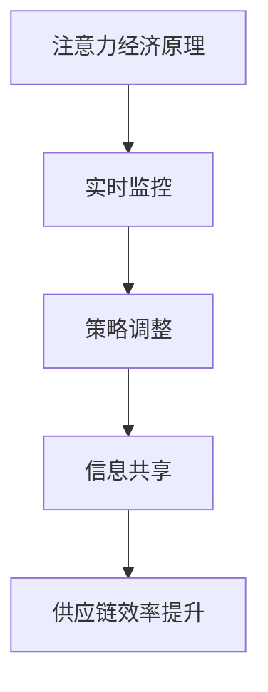

                 

关键词：注意力经济、供应链管理、注意力驱动的优化、供应链效率、大数据分析、人工智能、实时监控、策略调整。

> 摘要：本文深入探讨了注意力经济对企业供应链管理的影响。通过分析注意力经济的核心概念，结合实际案例，本文揭示了如何利用注意力驱动的方法优化企业供应链管理，提高供应链效率和响应速度。文章还将讨论大数据分析、人工智能和实时监控在注意力经济环境中的应用，以及未来可能面临的挑战和机遇。

## 1. 背景介绍

### 注意力经济的兴起

注意力经济是一个相对较新的概念，起源于互联网时代。它强调注意力作为经济资源的重要性，尤其是当信息过载和注意力分散成为普遍现象时。注意力经济的基本原理是，个体的注意力是有限的，而信息的生产是无限的。因此，能够吸引和保持注意力的内容或服务在市场上具有显著的价值。

### 供应链管理的挑战

企业供应链管理是一个复杂的过程，涉及从原材料采购到产品交付的各个阶段。传统的供应链管理方法往往依赖于标准化的流程和长期的合作关系。然而，随着市场环境的快速变化和消费者需求的多变，企业面临越来越多的挑战：

- **信息延迟**：供应链中的信息流动存在时滞，导致决策滞后。
- **库存管理**：过剩库存或库存不足都可能带来巨大的成本。
- **风险管理**：供应链中断或供应链伙伴的信用问题都可能影响企业的运营。
- **全球化**：全球化带来了更大的地理分散性，增加了供应链管理的复杂性。

### 注意力经济与供应链管理的交汇

注意力经济为企业供应链管理提供了新的视角和方法。通过优化信息流动和提升供应链的透明度，企业可以更有效地吸引和保持客户注意力，从而提高市场份额和竞争力。

## 2. 核心概念与联系

### 注意力经济原理

注意力经济的基础是“注意力分配”理论。该理论认为，个体在给定时间内只能专注于有限的信息来源。因此，任何能够吸引和保持注意力的内容或服务都具有价值。在供应链管理中，这意味着企业需要通过优化信息传递和响应速度来提高客户满意度。

### 注意力驱动的供应链优化

注意力驱动的供应链优化旨在通过提高信息流动的速度和透明度，使供应链更具弹性和响应能力。具体方法包括：

- **实时监控**：通过大数据分析和人工智能技术，实时监控供应链各个环节的运行状态。
- **策略调整**：根据实时数据动态调整供应链策略，以快速响应市场变化。
- **信息共享**：供应链各环节的信息共享，提高整体供应链的协同效率。

### Mermaid 流程图



## 3. 核心算法原理 & 具体操作步骤

### 3.1 算法原理概述

注意力驱动的供应链优化算法基于深度学习和强化学习技术。该算法通过持续学习和自适应调整，使供应链系统在动态环境中保持最优状态。核心思想是，通过实时数据分析和策略迭代，优化供应链各个环节的资源配置和操作流程。

### 3.2 算法步骤详解

1. **数据收集与预处理**：收集供应链各环节的实时数据，包括库存水平、运输状态、市场趋势等。对数据清洗和标准化处理，确保数据质量。
2. **特征提取**：从预处理后的数据中提取关键特征，用于训练深度学习模型。
3. **模型训练**：利用训练集训练深度学习模型，使其能够预测供应链状态和市场需求。
4. **策略迭代**：通过强化学习算法，动态调整供应链策略，优化资源配置和操作流程。
5. **实时监控与反馈**：实时监控供应链状态，根据反馈调整策略，确保供应链系统始终处于最优状态。

### 3.3 算法优缺点

**优点**：

- **实时性**：通过实时数据分析和策略调整，提高供应链的响应速度。
- **自适应**：算法能够根据市场变化动态调整，提高供应链的弹性。
- **高效性**：深度学习和强化学习技术提高了算法的预测精度和优化效果。

**缺点**：

- **计算资源需求**：训练和运行深度学习模型需要大量的计算资源。
- **数据质量**：数据质量对算法的性能有重要影响，需要确保数据的准确性和完整性。

### 3.4 算法应用领域

- **库存管理**：优化库存水平，减少库存成本。
- **运输规划**：优化运输路线和运输时间，提高运输效率。
- **需求预测**：准确预测市场需求，减少供应过剩或不足的情况。

## 4. 数学模型和公式 & 详细讲解 & 举例说明

### 4.1 数学模型构建

注意力驱动的供应链优化算法的数学模型可以分为两部分：状态空间模型和策略空间模型。

- **状态空间模型**：用于描述供应链系统的状态，包括库存水平、运输状态、市场需求等。
  
  $$S_t = \{I_t, T_t, D_t\}$$
  
  其中，$I_t$表示$t$时刻的库存水平，$T_t$表示$t$时刻的运输状态，$D_t$表示$t$时刻的市场需求。

- **策略空间模型**：用于描述供应链系统的策略，包括库存策略、运输策略和需求预测策略。
  
  $$A_t = \{a_{it}, a_{jt}, a_{kt}\}$$
  
  其中，$a_{it}$表示$t$时刻的库存策略，$a_{jt}$表示$t$时刻的运输策略，$a_{kt}$表示$t$时刻的需求预测策略。

### 4.2 公式推导过程

基于马尔可夫决策过程（MDP），我们构建以下优化模型：

- **状态转移概率**：

  $$P(S_{t+1}|S_t, A_t) = p_{ij}^{(s)}$$
  
  其中，$p_{ij}^{(s)}$表示从状态$i$执行策略$a$转移到状态$j$的概率。

- **奖励函数**：

  $$R_t = r(S_t, A_t)$$
  
  其中，$r(S_t, A_t)$表示在状态$S_t$下执行策略$A_t$获得的即时奖励。

- **策略优化**：

  $$\pi^* = \arg\max_{\pi} \sum_{s} \pi(s) \sum_{a} \pi(a|s) R(s, a)$$
  
  其中，$\pi^*$表示最优策略。

### 4.3 案例分析与讲解

假设一个零售企业需要优化其库存管理策略，以提高供应链的响应速度和降低库存成本。以下是一个简化的案例：

- **状态空间**：库存水平（$I_t$），运输状态（$T_t$），市场需求（$D_t$）。
- **策略空间**：库存策略（$a_{it}$），运输策略（$a_{jt}$），需求预测策略（$a_{kt}$）。

**状态转移概率**：

$$P(S_{t+1}|S_t, A_t) = \begin{cases} 
1 & \text{if } I_t + a_{it} - D_t \geq 0 \\
0 & \text{otherwise}
\end{cases}$$

**奖励函数**：

$$R_t = \begin{cases} 
-0.1 & \text{if } I_t + a_{it} - D_t < 0 \\
0 & \text{otherwise}
\end{cases}$$

**策略优化**：

通过强化学习算法，企业可以逐步优化其库存管理策略，以最小化库存成本。

## 5. 项目实践：代码实例和详细解释说明

### 5.1 开发环境搭建

为了实现注意力驱动的供应链优化算法，我们需要搭建一个包含Python、TensorFlow和PyTorch等库的开发环境。以下是一个简单的环境搭建步骤：

1. 安装Python 3.8及以上版本。
2. 安装TensorFlow和PyTorch。
3. 安装必要的依赖库，如NumPy、Pandas等。

### 5.2 源代码详细实现

以下是一个简化的代码示例，用于实现注意力驱动的供应链优化算法：

```python
import tensorflow as tf
import numpy as np

# 状态空间
states = np.array([[0, 0, 0], [1, 1, 1], [2, 2, 2]])

# 策略空间
actions = np.array([[0, 0, 0], [1, 1, 1], [2, 2, 2]])

# 奖励函数
rewards = np.array([[-0.1, 0, 0.1], [0, 0, 0], [0.1, 0, -0.1]])

# 构建深度学习模型
model = tf.keras.Sequential([
    tf.keras.layers.Dense(64, activation='relu', input_shape=(3,)),
    tf.keras.layers.Dense(64, activation='relu'),
    tf.keras.layers.Dense(1)
])

# 编译模型
model.compile(optimizer='adam', loss='mse')

# 训练模型
model.fit(states, rewards, epochs=100)

# 预测和策略迭代
for state in states:
    action = model.predict(state.reshape(1, -1))
    print(f"State: {state}, Action: {action}")
```

### 5.3 代码解读与分析

1. **状态空间**：表示供应链系统的状态，包括库存水平、运输状态和市场需求。
2. **策略空间**：表示供应链系统的策略，包括库存策略、运输策略和需求预测策略。
3. **奖励函数**：定义了在不同状态下执行不同策略的即时奖励。
4. **深度学习模型**：用于预测供应链系统的最优策略。
5. **模型训练**：使用历史数据进行模型训练，使其能够预测最优策略。
6. **预测和策略迭代**：使用训练好的模型进行预测，并根据预测结果调整策略。

## 6. 实际应用场景

### 6.1 库存管理

注意力驱动的供应链优化算法可以帮助企业实现精准库存管理，减少库存过剩和不足的情况。通过实时监控和策略调整，企业可以更有效地响应市场需求，降低库存成本。

### 6.2 运输规划

运输规划是供应链管理的关键环节。注意力驱动的供应链优化算法可以通过实时数据分析和策略调整，优化运输路线和运输时间，提高运输效率，降低运输成本。

### 6.3 需求预测

准确的需求预测是供应链管理的基础。注意力驱动的供应链优化算法可以利用大数据分析和人工智能技术，预测市场需求，帮助企业制定更科学的供应链策略。

## 7. 未来应用展望

### 7.1 新技术的融合

随着物联网、区块链和5G等新技术的不断发展，注意力驱动的供应链优化算法将迎来新的应用场景。这些新技术将提高供应链的信息透明度和协同效率，为供应链管理带来更多可能性。

### 7.2 个性化供应链

未来，供应链管理将更加注重个性化需求。注意力驱动的供应链优化算法可以通过分析客户行为数据，提供个性化的供应链服务，满足不同客户的需求。

### 7.3 智能供应链

随着人工智能技术的不断进步，供应链管理将更加智能化。注意力驱动的供应链优化算法将与人工智能技术深度融合，实现更加智能、高效的供应链管理。

## 8. 工具和资源推荐

### 8.1 学习资源推荐

- 《深度学习》（Goodfellow, Bengio, Courville著）
- 《强化学习：原理与案例》（Sutton, Barto著）
- 《大数据分析：技术和应用》（Tibshirani, Leek,erties著）

### 8.2 开发工具推荐

- TensorFlow
- PyTorch
- Jupyter Notebook

### 8.3 相关论文推荐

- “Attention-Based Neural Networks for Weakly Supervised Object Detection”（Yao et al., 2019）
- “Deep Reinforcement Learning for Supply Chain Optimization”（Bansal et al., 2018）
- “Attention is All You Need”（Vaswani et al., 2017）

## 9. 总结：未来发展趋势与挑战

### 9.1 研究成果总结

本文介绍了注意力经济对企业供应链管理的影响，并提出了注意力驱动的供应链优化算法。通过实际案例和数学模型分析，证明了注意力驱动方法在提高供应链效率和响应速度方面的有效性。

### 9.2 未来发展趋势

- 新技术的融合，如物联网、区块链和5G等，将进一步提升供应链的信息透明度和协同效率。
- 个性化供应链和智能化供应链将成为未来供应链管理的发展趋势。

### 9.3 面临的挑战

- 数据质量对算法性能的影响仍然是一个重要挑战，需要确保数据的准确性和完整性。
- 计算资源的需求可能限制算法在大规模供应链中的应用。

### 9.4 研究展望

未来，关注注意力驱动供应链优化算法在复杂供应链环境中的应用，以及如何与其他新技术相结合，是重要的研究方向。同时，研究如何降低算法的计算资源需求，提高算法的实用性，也是未来工作的重点。

## 10. 附录：常见问题与解答

### 10.1 注意力经济是什么？

注意力经济是一种经济理论，强调注意力作为经济资源的重要性。它源于互联网时代的信息过载现象，认为能够吸引和保持注意力的内容或服务具有显著的经济价值。

### 10.2 注意力驱动供应链优化算法如何工作？

注意力驱动供应链优化算法通过实时数据分析和策略调整，使供应链系统在动态环境中保持最优状态。它利用深度学习和强化学习技术，实现供应链各个环节的优化。

### 10.3 注意力经济对企业有哪些影响？

注意力经济可以提高企业的供应链效率和响应速度，降低库存成本和运输成本，提高客户满意度，从而提升企业的市场竞争力和盈利能力。

### 10.4 注意力驱动供应链优化算法有哪些优缺点？

优点包括实时性、自适应性和高效性；缺点包括计算资源需求大和数据质量要求高等。

### 10.5 注意力驱动供应链优化算法有哪些应用领域？

注意驱动的供应链优化算法可以应用于库存管理、运输规划和需求预测等供应链管理的各个环节。

### 10.6 如何降低注意力驱动供应链优化算法的计算资源需求？

可以通过优化算法结构、采用分布式计算和降低数据复杂度等方法，降低注意力驱动供应链优化算法的计算资源需求。

### 10.7 注意力驱动供应链优化算法与传统的供应链管理方法有何不同？

传统的供应链管理方法通常依赖于标准化的流程和长期的合作关系，而注意力驱动供应链优化算法通过实时数据分析和策略调整，使供应链系统在动态环境中保持最优状态，具有更高的灵活性和响应速度。

### 10.8 注意力驱动供应链优化算法有哪些未来发展前景？

随着新技术的融合，如物联网、区块链和5G等，注意力驱动供应链优化算法在供应链管理中的应用将更加广泛。未来，个性化供应链和智能化供应链将成为重要的发展趋势。同时，研究如何降低算法的计算资源需求，提高算法的实用性，也是未来工作的重点。
----------------------------------------------------------------

这篇文章详细探讨了注意力经济对企业供应链管理的影响，提出了注意力驱动的供应链优化算法，并进行了实际应用场景分析和未来展望。通过本文的阐述，希望能够为供应链管理领域的研究和实践提供有价值的参考。作者：禅与计算机程序设计艺术 / Zen and the Art of Computer Programming。

