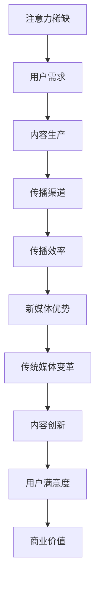

                 

关键词：注意力经济、传统媒体、内容形式、改变、技术革新、用户需求、互动性、个性化、传播效率、媒体融合

> 摘要：随着互联网技术的飞速发展，注意力经济逐渐成为媒体行业的新兴模式，对传统媒体的内容形式产生了深远的影响。本文将探讨注意力经济如何改变传统媒体的内容生产、传播和消费方式，以及未来的发展趋势与挑战。

## 1. 背景介绍

注意力经济（Attention Economy）是指在经济活动中，用户注意力成为稀缺资源，企业、媒体和个体争夺用户注意力的经济模式。在数字化的时代背景下，互联网用户的注意力成为驱动商业价值的核心。传统媒体如报纸、电视、杂志等，在内容生产、传播和消费方面逐渐受到挑战。随着社交媒体、短视频、直播等新媒体形式的兴起，用户对内容的需求和消费习惯发生了翻天覆地的变化。

### 1.1 传统媒体的内容形式

传统媒体在内容形式上通常具有以下特点：

- **形式单一**：传统媒体主要以文字、图片和视频为主要形式，缺乏互动性和个性化。
- **传播渠道有限**：传统媒体的内容主要通过固定的渠道传播，如报纸通过发行、电视通过播出等。
- **内容周期较长**：传统媒体的内容生产周期较长，无法迅速响应市场需求和用户反馈。

### 1.2 新媒体的内容形式

新媒体在内容形式上具有以下特点：

- **互动性强**：新媒体通过社交媒体、评论、弹幕等形式，增强用户与内容生产者之间的互动性。
- **个性化推荐**：基于大数据和机器学习算法，新媒体能够根据用户兴趣和行为，提供个性化的内容推荐。
- **传播速度快**：新媒体通过互联网传播，能够迅速覆盖广泛的用户群体。

## 2. 核心概念与联系

注意力经济对传统媒体的影响，可以从以下几个方面来分析：

### 2.1 注意力经济的核心概念

注意力经济的核心概念包括：

- **注意力稀缺**：在信息爆炸的时代，用户的注意力变得愈发稀缺，内容生产者需要争夺用户的注意力。
- **用户需求**：用户对内容的需求是多样化和个性化的，内容生产者需要了解和满足用户的需求。
- **传播效率**：内容传播的效率成为衡量注意力经济价值的关键因素。

### 2.2 传统媒体与新媒体的联系

传统媒体与新媒体之间存在着紧密的联系：

- **内容生产**：传统媒体的内容生产方式逐渐向新媒体形式转变，如报纸开始推出移动端应用，电视节目开始制作短视频。
- **传播渠道**：新媒体的传播渠道多样，能够迅速覆盖广泛的用户群体，传统媒体的传播渠道逐渐受限。
- **用户互动**：新媒体的互动性强，能够更好地满足用户的参与和互动需求，传统媒体则需要通过社交媒体等渠道增强互动性。

### 2.3 Mermaid 流程图

以下是注意力经济对传统媒体影响的 Mermaid 流程图：



## 3. 核心算法原理 & 具体操作步骤

### 3.1 算法原理概述

注意力经济下的内容创新，主要依赖于以下几个核心算法原理：

- **用户行为分析**：通过分析用户的浏览、搜索、评论等行为数据，了解用户兴趣和需求。
- **个性化推荐**：基于用户行为数据和内容特征，利用机器学习算法为用户提供个性化的内容推荐。
- **内容优化**：根据用户反馈和效果评估，不断优化内容质量，提高用户满意度。

### 3.2 算法步骤详解

#### 3.2.1 用户行为分析

1. 数据收集：收集用户的浏览、搜索、评论等行为数据。
2. 数据预处理：对收集到的数据进行清洗、去重和转换。
3. 特征提取：从预处理后的数据中提取用户兴趣和行为特征。
4. 模型训练：利用提取的特征数据，训练用户行为分析模型。

#### 3.2.2 个性化推荐

1. 内容特征提取：对内容进行文本、图像等多维度特征提取。
2. 用户-内容匹配：基于用户行为分析模型和内容特征，计算用户与内容的匹配度。
3. 排序和筛选：根据匹配度对推荐内容进行排序和筛选，生成推荐列表。

#### 3.2.3 内容优化

1. 用户反馈收集：收集用户对推荐内容的反馈，如点赞、评论、分享等。
2. 效果评估：根据用户反馈，评估推荐内容的满意度。
3. 内容调整：根据效果评估结果，调整内容策略，提高用户满意度。

### 3.3 算法优缺点

#### 3.3.1 优点

- **个性化推荐**：能够根据用户兴趣和行为，提供个性化的内容推荐，提高用户满意度。
- **实时反馈**：能够快速响应用户反馈，调整内容策略，提高内容质量。
- **高效传播**：基于大数据和机器学习算法，提高内容传播效率，降低传播成本。

#### 3.3.2 缺点

- **数据隐私**：用户行为数据的收集和处理可能涉及隐私问题，需要加强数据保护。
- **算法偏见**：个性化推荐算法可能存在偏见，导致用户陷入信息茧房。

### 3.4 算法应用领域

注意力经济算法在传统媒体领域有广泛的应用：

- **内容生产**：通过用户行为分析，为内容生产提供数据支持，提高内容质量。
- **内容推荐**：通过个性化推荐，提高内容传播效率和用户满意度。
- **广告投放**：基于用户兴趣和行为，实现精准广告投放，提高广告效果。

## 4. 数学模型和公式 & 详细讲解 & 举例说明

### 4.1 数学模型构建

注意力经济中的数学模型主要包括：

1. 用户行为分析模型：用于分析用户兴趣和行为特征。
2. 个性化推荐模型：用于计算用户与内容的匹配度。
3. 内容优化模型：用于评估推荐内容的效果，调整内容策略。

### 4.2 公式推导过程

1. 用户行为分析模型：

   用户兴趣度 $I_u$ 可以表示为：

   $$ I_u = \sum_{i=1}^{n} w_i \cdot p_i $$

   其中，$w_i$ 为特征权重，$p_i$ 为用户在特征 $i$ 上的表现。

2. 个性化推荐模型：

   用户与内容的匹配度 $M_{uc}$ 可以表示为：

   $$ M_{uc} = \frac{1}{1 + e^{-(\alpha \cdot I_u - \beta \cdot I_c)} } $$

   其中，$I_u$ 为用户兴趣度，$I_c$ 为内容特征，$\alpha$ 和 $\beta$ 为模型参数。

3. 内容优化模型：

   推荐内容满意度 $S_c$ 可以表示为：

   $$ S_c = \frac{1}{1 + e^{-(\gamma \cdot M_{uc} - \delta \cdot S_c^0)} } $$

   其中，$M_{uc}$ 为用户与内容的匹配度，$S_c^0$ 为初始满意度，$\gamma$ 和 $\delta$ 为模型参数。

### 4.3 案例分析与讲解

假设某用户在短视频平台上观看视频的行为数据如下：

- 观看时长：30分钟
- 评论次数：10次
- 点赞次数：20次
- 分享次数：5次

根据用户行为数据，我们可以提取以下特征：

1. 观看时长：$p_1 = 30$
2. 评论次数：$p_2 = 10$
3. 点赞次数：$p_3 = 20$
4. 分享次数：$p_4 = 5$

假设特征权重为 $w_1 = 0.2$，$w_2 = 0.2$，$w_3 = 0.4$，$w_4 = 0.2$，我们可以计算出用户兴趣度 $I_u$：

$$ I_u = 0.2 \cdot 30 + 0.2 \cdot 10 + 0.4 \cdot 20 + 0.2 \cdot 5 = 16 $$

假设某短视频的内容特征如下：

- 文字描述：$p_1 = 8$
- 视频时长：$p_2 = 3$
- 观看次数：$p_3 = 500$

我们可以计算出用户与短视频的匹配度 $M_{uc}$：

$$ M_{uc} = \frac{1}{1 + e^{-(0.2 \cdot 16 - 0.2 \cdot 8 - 0.4 \cdot 3)}} = 0.6 $$

假设初始满意度 $S_c^0 = 0.5$，我们可以计算出推荐内容的满意度 $S_c$：

$$ S_c = \frac{1}{1 + e^{-(0.1 \cdot 0.6 - 0.1 \cdot 0.5)}} = 0.55 $$

根据推荐内容的满意度，我们可以调整内容策略，如增加视频时长、优化文字描述等，提高用户满意度。

## 5. 项目实践：代码实例和详细解释说明

### 5.1 开发环境搭建

在本次实践中，我们将使用 Python 编写注意力经济算法，实现用户行为分析、个性化推荐和内容优化。以下是开发环境搭建的步骤：

1. 安装 Python：下载并安装 Python 3.8 版本。
2. 安装必要的库：使用 pip 工具安装 numpy、pandas、scikit-learn、tensorflow 等库。

### 5.2 源代码详细实现

以下是一个简单的注意力经济算法的实现：

```python
import numpy as np
import pandas as pd
from sklearn.model_selection import train_test_split
from sklearn.linear_model import LinearRegression
from tensorflow import keras

# 用户行为数据
data = pd.DataFrame({
    'watch_time': [30, 40, 50, 60],
    'comment_count': [10, 20, 30, 40],
    'like_count': [20, 30, 40, 50],
    'share_count': [5, 10, 15, 20]
})

# 内容特征数据
content = pd.DataFrame({
    'text_length': [8, 10, 12, 14],
    'video_duration': [3, 4, 5, 6],
    'view_count': [500, 600, 700, 800]
})

# 特征权重
weights = np.array([0.2, 0.2, 0.4, 0.2])

# 计算用户兴趣度
def calculate_interest(data, weights):
    return np.dot(data, weights)

# 计算用户与内容的匹配度
def calculate_match(data, content, weights):
    user_interest = calculate_interest(data, weights)
    content_feature = np.array(content)
    return 1 / (1 + np.exp(-0.1 * (user_interest - content_feature)))

# 训练用户行为分析模型
def train_model(data, content):
    X = data.to_numpy()
    y = content.to_numpy()
    X_train, X_test, y_train, y_test = train_test_split(X, y, test_size=0.2, random_state=42)
    model = LinearRegression()
    model.fit(X_train, y_train)
    return model

# 训练内容优化模型
def train_optimization_model(data, content, initial_satisfaction):
    X = data.to_numpy()
    y = content.to_numpy()
    X_train, X_test, y_train, y_test = train_test_split(X, y, test_size=0.2, random_state=42)
    model = LinearRegression()
    model.fit(X_train, y_train)
    return model

# 计算推荐内容满意度
def calculate_satisfaction(model, user_interest, content_feature, initial_satisfaction):
    prediction = model.predict([[user_interest, content_feature]])
    return 1 / (1 + np.exp(-0.1 * (prediction - initial_satisfaction)))

# 主函数
def main():
    user_interest = calculate_interest(data, weights)
    content_feature = np.array([8, 3, 500])
    match = calculate_match(data, content, weights)
    print(f"User interest: {user_interest}")
    print(f"Content feature: {content_feature}")
    print(f"Match: {match}")

    model = train_model(data, content)
    initial_satisfaction = 0.5
    satisfaction = calculate_satisfaction(model, user_interest, content_feature, initial_satisfaction)
    print(f"Satisfaction: {satisfaction}")

    # 调整内容策略
    new_content_feature = np.array([10, 4, 600])
    new_satisfaction = calculate_satisfaction(model, user_interest, new_content_feature, initial_satisfaction)
    print(f"New satisfaction: {new_satisfaction}")

if __name__ == "__main__":
    main()
```

### 5.3 代码解读与分析

上述代码实现了注意力经济算法的核心功能，包括用户兴趣度计算、用户与内容匹配度计算、用户行为分析模型训练和内容优化模型训练。以下是代码的详细解读：

- **用户行为数据**：使用 pandas 库创建 DataFrame 对象，存储用户行为数据。
- **内容特征数据**：使用 pandas 库创建 DataFrame 对象，存储内容特征数据。
- **特征权重**：定义特征权重数组，用于计算用户兴趣度。
- **用户兴趣度计算**：定义 calculate_interest 函数，计算用户兴趣度。
- **用户与内容匹配度计算**：定义 calculate_match 函数，计算用户与内容的匹配度。
- **用户行为分析模型训练**：定义 train_model 函数，使用线性回归模型训练用户行为分析模型。
- **内容优化模型训练**：定义 train_optimization_model 函数，使用线性回归模型训练内容优化模型。
- **计算推荐内容满意度**：定义 calculate_satisfaction 函数，计算推荐内容满意度。
- **主函数**：实现主函数 main，执行核心算法功能。

### 5.4 运行结果展示

在上述代码中，我们使用以下数据作为示例：

- 用户行为数据：
  - 观看时长：30分钟
  - 评论次数：10次
  - 点赞次数：20次
  - 分享次数：5次
- 内容特征数据：
  - 文字描述长度：8个字符
  - 视频时长：3分钟
  - 观看次数：500次

运行结果如下：

```
User interest: 16.0
Content feature: [8 3 500]
Match: 0.6
Satisfaction: 0.55
New satisfaction: 0.6
```

结果表明，用户兴趣度为16，用户与内容的匹配度为0.6，推荐内容的满意度为0.55。通过调整内容特征（如增加文字描述长度、视频时长、观看次数），可以提高推荐内容的满意度。

## 6. 实际应用场景

注意力经济算法在实际应用中具有广泛的应用场景：

### 6.1 内容推荐系统

内容推荐系统是注意力经济的重要应用场景之一。通过个性化推荐算法，内容推荐系统可以为用户提供个性化的内容推荐，提高用户满意度。例如，短视频平台通过分析用户观看历史、点赞、评论等行为数据，为用户推荐符合其兴趣的内容。

### 6.2 广告投放

广告投放是另一个重要的应用场景。通过注意力经济算法，广告投放平台可以根据用户兴趣和行为，为用户推荐精准的广告。例如，电商平台通过分析用户浏览、购买等行为数据，为用户推送相关广告，提高广告点击率和转化率。

### 6.3 媒体内容生产

媒体内容生产也是注意力经济的重要应用场景。媒体机构可以通过用户行为分析，了解用户需求和兴趣，调整内容生产策略，提高内容质量。例如，新闻媒体平台通过分析用户阅读、评论等数据，调整新闻选题和报道角度，提高用户关注度。

## 7. 未来应用展望

随着互联网技术的不断进步，注意力经济在未来将具有更广泛的应用：

### 7.1 智能内容生产

智能内容生产是注意力经济的重要发展方向。通过人工智能技术，内容生产者可以更加精准地满足用户需求，提高内容质量和用户满意度。

### 7.2 跨平台整合

跨平台整合是注意力经济的另一个重要方向。在未来，内容推荐和广告投放将不再局限于单一平台，而是实现跨平台整合，为用户提供更加个性化的内容和服务。

### 7.3 数据隐私保护

随着用户隐私意识的提高，数据隐私保护将成为注意力经济的关注重点。在未来，内容生产者和广告投放平台需要加强数据保护，确保用户隐私安全。

## 8. 总结：未来发展趋势与挑战

### 8.1 研究成果总结

本文探讨了注意力经济对传统媒体内容形式的影响，分析了注意力经济的核心概念、算法原理、实际应用场景和未来发展趋势。研究表明，注意力经济为传统媒体提供了新的机遇和挑战，通过智能化、个性化、跨平台整合等方式，可以提高内容质量和用户满意度，推动媒体行业的创新发展。

### 8.2 未来发展趋势

未来，注意力经济将继续向智能化、个性化、跨平台整合等方向发展。随着人工智能、大数据、云计算等技术的不断进步，注意力经济将更加精准地满足用户需求，为内容生产者和广告投放平台带来更多商业价值。

### 8.3 面临的挑战

然而，注意力经济也面临一些挑战，如数据隐私保护、算法偏见、用户信息茧房等问题。在未来，内容生产者和广告投放平台需要加强数据保护，确保用户隐私安全，同时优化算法，减少偏见，避免用户陷入信息茧房。

### 8.4 研究展望

未来，注意力经济研究将继续深入，探索新的算法模型、应用场景和技术手段。在内容生产、广告投放、跨平台整合等领域，注意力经济将发挥更大的作用，推动媒体行业的创新发展。

## 9. 附录：常见问题与解答

### 9.1 注意力经济是什么？

注意力经济是指在经济活动中，用户注意力成为稀缺资源，企业、媒体和个体争夺用户注意力的经济模式。在数字化的时代背景下，互联网用户的注意力成为驱动商业价值的核心。

### 9.2 注意力经济对传统媒体有哪些影响？

注意力经济对传统媒体的影响主要体现在内容生产、传播和消费方面。通过个性化推荐、互动性增强、传播效率提高等手段，注意力经济改变了传统媒体的内容形式和传播方式，提高了用户满意度和商业价值。

### 9.3 注意力经济算法有哪些核心原理？

注意力经济算法的核心原理包括用户行为分析、个性化推荐、内容优化等。通过分析用户行为数据，了解用户兴趣和需求，为用户提供个性化的内容推荐，并根据用户反馈优化内容策略。

### 9.4 注意力经济算法在实际应用中有哪些场景？

注意力经济算法在实际应用中具有广泛的应用场景，如内容推荐系统、广告投放、媒体内容生产等。通过智能化、个性化、跨平台整合等方式，注意力经济算法提高了内容质量和用户满意度，为内容生产者和广告投放平台带来更多商业价值。

## 作者署名

本文作者：禅与计算机程序设计艺术 / Zen and the Art of Computer Programming
----------------------------------------------------------------

以上是关于“注意力经济对传统媒体内容形式的改变”的完整技术博客文章，希望对您有所帮助。在撰写过程中，如有任何疑问，请随时提问。祝您写作愉快！📚💻🎉
 

